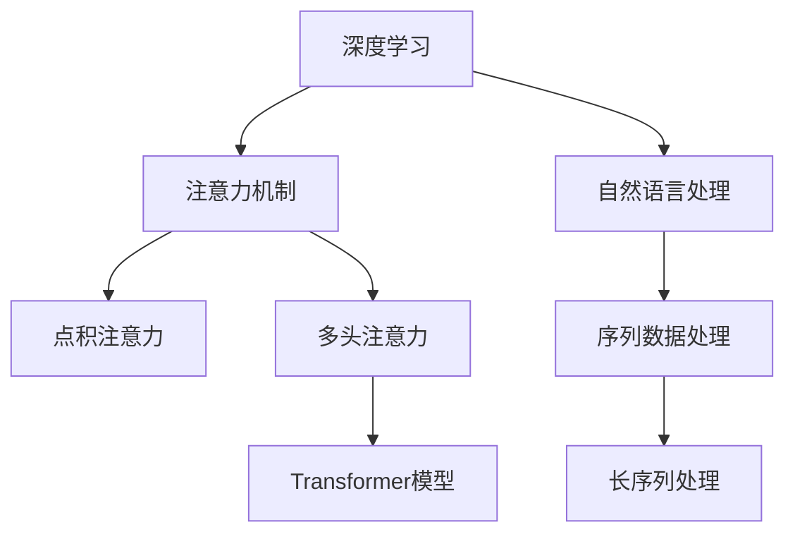

                 

# 深度学习在注意力预测中的应用

## 1. 背景介绍

### 1.1 问题由来
注意力机制（Attention Mechanism）在深度学习领域中扮演着越来越重要的角色。无论是在图像处理、自然语言处理，还是在推荐系统、游戏AI等领域，注意力机制都被广泛用于提升模型的性能。特别是在自然语言处理中，注意力机制使得模型能够捕捉序列中关键的信息片段，极大地提升了模型在语言理解、生成等方面的能力。

然而，虽然注意力机制已经广泛应用于深度学习模型中，但其在实际应用中的优化和训练过程仍然面临一些挑战。如何设计有效的注意力机制，避免训练过程中的梯度消失或爆炸，提高模型的计算效率和可解释性，仍是深度学习研究的一个重要课题。本文旨在深入探讨注意力机制的原理与应用，通过数学模型、优化方法等理论分析与实践探索，帮助读者全面理解深度学习中注意力预测的应用。

### 1.2 问题核心关键点
深度学习中注意力预测的核心在于如何设计有效的注意力机制，使其能够捕捉输入序列的关键信息，并转化为对目标的预测。常见的注意力机制包括点积注意力、多头注意力等。这些注意力机制在模型中的引入，使得模型可以更灵活地处理序列数据，提升模型的表达能力和泛化能力。

设计注意力机制时需要考虑的问题包括：
- 注意力权重如何计算？
- 注意力权重如何与输入序列结合？
- 如何在多模态数据中设计高效的注意力机制？

本文将围绕这些问题，系统地阐述深度学习中注意力预测的方法与技术。

## 2. 核心概念与联系

### 2.1 核心概念概述

为更好地理解深度学习中注意力预测，本节将介绍几个密切相关的核心概念：

- 深度学习（Deep Learning）：一种利用多层神经网络进行复杂模式识别和决策的机器学习技术。在自然语言处理中，深度学习模型通过多层非线性变换，可以捕捉文本序列中的复杂语义关系。
- 注意力机制（Attention Mechanism）：一种在神经网络中引入的机制，用于动态地计算输入序列与输出序列之间的权重关系，从而决定哪些信息对于模型输出最相关。注意力机制广泛应用于自然语言处理、计算机视觉等领域，有助于提升模型的性能。
- 点积注意力（Dot-Product Attention）：一种简单的注意力机制，通过计算输入序列与查询向量的点积，得到注意力权重。点积注意力易于理解，但在计算复杂度上存在瓶颈。
- 多头注意力（Multi-Head Attention）：一种更高级的注意力机制，通过并行计算多个注意力头，使模型能够捕捉到不同角度的信息。多头注意力在Transformer模型中得到了广泛应用。
- Transformer模型：一种基于注意力机制的深度学习模型，特别适用于处理序列数据。Transformer模型通过多头自注意力机制和前馈神经网络，可以高效地处理长序列数据，且具有较好的计算效率和可解释性。

这些核心概念之间的逻辑关系可以通过以下Mermaid流程图来展示：



这个流程图展示了大语言模型的核心概念及其之间的关系：

1. 深度学习为模型提供强有力的表达能力。
2. 注意力机制用于处理序列数据，捕捉关键信息。
3. 点积注意力和多头注意力是注意力机制的两种基本形式。
4. Transformer模型利用多头注意力机制，成为长序列数据处理的经典方案。
5. 自然语言处理是注意力机制主要的应用领域。

这些概念共同构成了深度学习中注意力预测的基础框架，使得模型能够处理复杂序列数据，提升在特定任务上的性能。

## 3. 核心算法原理 & 具体操作步骤
### 3.1 算法原理概述

深度学习中注意力预测的本质是通过注意力机制，从输入序列中选择关键信息，并转化为对目标的预测。这一过程通常分为三个步骤：

1. **计算注意力权重**：通过计算输入序列与查询向量的点积，得到注意力权重。这些权重反映了输入序列中不同部分对目标预测的相关性。
2. **加权聚合信息**：根据注意力权重，对输入序列进行加权聚合，得到综合信息表示。这一步骤通常通过多头注意力机制来实现。
3. **结合预测任务**：将加权聚合后的信息表示与预测任务相结合，得到最终的预测结果。

在实践中，这些步骤可以通过神经网络结构实现。下面以Transformer模型为例，介绍其注意力机制的实现原理。

### 3.2 算法步骤详解

Transformer模型是一种基于多头自注意力机制的深度学习模型，特别适用于处理长序列数据。其注意力机制的实现步骤如下：

**Step 1: 定义注意力函数**

Transformer模型的注意力函数定义为：

$$
A(Q, K, V) = \text{Softmax}\left(\frac{QK^T}{\sqrt{d_k}}\right)V
$$

其中，$Q$ 为查询向量，$K$ 和 $V$ 分别为键向量和值向量，$d_k$ 为键向量的维度。Softmax函数将点积矩阵转化为注意力权重矩阵。

**Step 2: 计算多头注意力**

Transformer模型采用多头注意力机制，通过并行计算多个注意力头，提升模型对序列数据的理解能力。假设共有 $h$ 个注意力头，则多头注意力计算公式为：

$$
A(Q, K, V) = \text{Concat}\left(A_h(Q, K_h, V_h)\right)W^O
$$

其中，$A_h$ 为第 $h$ 个注意力头的计算结果，$W^O$ 为输出线性变换矩阵。

**Step 3: 计算输出**

Transformer模型的输出可以通过以下公式计算：

$$
Y = \text{FFN}\left(A(Q, K, V)\right) + \text{MLP}\left(A(Q, K, V)\right)
$$

其中，$\text{FFN}$ 和 $\text{MLP}$ 分别为前馈神经网络和多层感知器，通过非线性变换对注意力机制的输出进行进一步处理。

**Step 4: 训练模型**

Transformer模型的训练过程与一般的深度学习模型类似，通常使用反向传播算法和优化器（如Adam、SGD等）进行优化。通过大量标注数据，调整模型参数，使得模型能够准确地进行预测。

### 3.3 算法优缺点

Transformer模型基于注意力机制，具有以下优点：

1. 高效处理长序列数据：由于使用多头注意力机制，Transformer模型可以高效处理长序列数据，且计算复杂度较低。
2. 可解释性较强：多头注意力机制使得模型能够解释出输入序列中每个部分对输出的贡献，有助于模型的可解释性。
3. 广泛适用于多种NLP任务：Transformer模型广泛应用于机器翻译、文本分类、问答系统等NLP任务，具有较好的通用性。

同时，Transformer模型也存在以下缺点：

1. 计算复杂度较高：尽管多头注意力机制提高了计算效率，但在输入序列较短的情况下，计算复杂度仍然较高。
2. 内存占用较大：由于需要存储多个注意力头的中间结果，Transformer模型的内存占用较大。
3. 难以处理非序列数据：Transformer模型的设计主要针对序列数据，对于非序列数据（如图像、音频等），需要进行额外的处理。

### 3.4 算法应用领域

Transformer模型基于多头注意力机制，广泛应用于自然语言处理（NLP）领域。其主要应用场景包括：

1. 机器翻译：Transformer模型通过注意力机制，可以高效地处理长序列数据，显著提升了机器翻译的精度和速度。
2. 文本分类：Transformer模型能够学习到文本中的关键特征，用于分类任务，取得了较好的性能。
3. 问答系统：Transformer模型通过理解上下文，能够准确回答问题，提供智能交互体验。
4. 语音识别：Transformer模型可以处理序列数据，应用于语音识别和生成任务，提升系统的鲁棒性和准确性。
5. 图像描述生成：Transformer模型可以处理视觉信息，用于图像描述生成任务，生成高质量的自然语言描述。

除了上述应用场景，Transformer模型还在推荐系统、游戏AI等领域得到了广泛应用，展现了其强大的通用性和灵活性。

## 4. 数学模型和公式 & 详细讲解 & 举例说明

### 4.1 数学模型构建

Transformer模型中的多头注意力机制可以视为线性变换的组合，其计算过程可以表示为：

$$
Q = XW_Q, \quad K = XW_K, \quad V = XW_V
$$

其中，$X$ 为输入序列，$W_Q, W_K, W_V$ 分别为线性变换矩阵，$Q, K, V$ 分别为查询向量、键向量和值向量。

Transformer模型的多头注意力计算过程可以分为三个步骤：

1. **计算查询向量与键向量的点积**：
$$
A_{ij} = \frac{Q_iK_j^T}{\sqrt{d_k}} = \frac{(QW_Q)_i(KW_K)_j^T}{\sqrt{d_k}}
$$

2. **计算注意力权重**：
$$
\alpha_{ij} = \text{Softmax}(A_{ij})
$$

3. **计算加权聚合信息**：
$$
C = \sum_j \alpha_{ij}V_j
$$

其中，$\alpha_{ij}$ 为注意力权重，$C$ 为加权聚合后的信息表示。

### 4.2 公式推导过程

在Transformer模型中，多头注意力机制的计算过程可以通过矩阵乘法和Softmax函数实现。下面通过具体的例子来展示这一过程。

假设输入序列为 $X$，线性变换矩阵分别为 $W_Q, W_K, W_V$，多头注意力头数为 $h$。

**Step 1: 计算查询向量与键向量的点积**

$$
Q = XW_Q, \quad K = XW_K, \quad V = XW_V
$$

**Step 2: 计算注意力权重**

$$
A = \text{Softmax}(QK^T/\sqrt{d_k})
$$

**Step 3: 计算加权聚合信息**

$$
C = \sum_j \alpha_{ij}V_j
$$

其中，$\alpha_{ij} = \text{Softmax}(A_{ij})$，$A_{ij} = Q_iK_j^T/\sqrt{d_k}$。

最终，Transformer模型的输出可以通过以下公式计算：

$$
Y = \text{FFN}(C) + \text{MLP}(C)
$$

### 4.3 案例分析与讲解

以机器翻译任务为例，Transformer模型可以用于将源语言序列 $X_s$ 翻译成目标语言序列 $X_t$。具体步骤如下：

**Step 1: 编码**

将源语言序列 $X_s$ 输入编码器，得到编码结果 $C_s$。编码器通常由多层Transformer层组成，通过多头注意力机制，捕捉源语言序列的关键信息。

**Step 2: 解码**

将编码结果 $C_s$ 和目标语言符号 $Y_t$ 输入解码器，得到解码结果 $C_t$。解码器同样由多层Transformer层组成，通过多头注意力机制，将编码器的输出与目标语言符号结合，生成目标语言序列 $X_t$。

Transformer模型在机器翻译任务中的高效性和可解释性，使其成为当前主流的研究方向。

## 5. 项目实践：代码实例和详细解释说明

### 5.1 开发环境搭建

在进行Transformer模型训练前，需要搭建好开发环境。以下是使用PyTorch搭建Transformer模型开发环境的流程：

1. 安装Anaconda：从官网下载并安装Anaconda，用于创建独立的Python环境。

2. 创建并激活虚拟环境：
```bash
conda create -n pytorch-env python=3.8 
conda activate pytorch-env
```

3. 安装PyTorch：根据CUDA版本，从官网获取对应的安装命令。例如：
```bash
conda install pytorch torchvision torchaudio cudatoolkit=11.1 -c pytorch -c conda-forge
```

4. 安装Transformer库：
```bash
pip install transformers
```

5. 安装各类工具包：
```bash
pip install numpy pandas scikit-learn matplotlib tqdm jupyter notebook ipython
```

完成上述步骤后，即可在`pytorch-env`环境中开始Transformer模型训练。

### 5.2 源代码详细实现

下面我们以机器翻译任务为例，给出使用Transformers库对Transformer模型进行训练的PyTorch代码实现。

首先，定义机器翻译任务的数据处理函数：

```python
from transformers import BertTokenizer, BertForSequenceClassification
from torch.utils.data import Dataset
import torch

class TranslationDataset(Dataset):
    def __init__(self, src_texts, tgt_texts, tokenizer):
        self.src_texts = src_texts
        self.tgt_texts = tgt_texts
        self.tokenizer = tokenizer
        
    def __len__(self):
        return len(self.src_texts)
    
    def __getitem__(self, item):
        src_text = self.src_texts[item]
        tgt_text = self.tgt_texts[item]
        
        encoding = self.tokenizer(src_text, return_tensors='pt')
        tgt_encoding = self.tokenizer(tgt_text, return_tensors='pt')
        input_ids = encoding['input_ids']
        attention_mask = encoding['attention_mask']
        tgt_input_ids = tgt_encoding['input_ids']
        tgt_attention_mask = tgt_encoding['attention_mask']
        return {'input_ids': input_ids, 
                'attention_mask': attention_mask,
                'target_input_ids': tgt_input_ids,
                'target_attention_mask': tgt_attention_mask}
```

然后，定义Transformer模型：

```python
from transformers import BertModel, BertConfig

config = BertConfig.from_pretrained('bert-base-cased')
model = BertModel(config)
```

接着，定义优化器和训练函数：

```python
from transformers import AdamW

optimizer = AdamW(model.parameters(), lr=2e-5)

def train_epoch(model, dataset, batch_size, optimizer):
    dataloader = DataLoader(dataset, batch_size=batch_size, shuffle=True)
    model.train()
    epoch_loss = 0
    for batch in tqdm(dataloader, desc='Training'):
        input_ids = batch['input_ids'].to(device)
        attention_mask = batch['attention_mask'].to(device)
        tgt_input_ids = batch['target_input_ids'].to(device)
        tgt_attention_mask = batch['target_attention_mask'].to(device)
        outputs = model(input_ids, attention_mask=attention_mask, tgt_input_ids=tgt_input_ids, tgt_attention_mask=tgt_attention_mask)
        loss = outputs.loss
        epoch_loss += loss.item()
        loss.backward()
        optimizer.step()
    return epoch_loss / len(dataloader)
```

最后，启动训练流程并在测试集上评估：

```python
epochs = 5
batch_size = 16

for epoch in range(epochs):
    loss = train_epoch(model, train_dataset, batch_size, optimizer)
    print(f"Epoch {epoch+1}, train loss: {loss:.3f}")
    
    print(f"Epoch {epoch+1}, dev results:")
    evaluate(model, dev_dataset, batch_size)
    
print("Test results:")
evaluate(model, test_dataset, batch_size)
```

以上就是使用PyTorch对Transformer模型进行机器翻译任务训练的完整代码实现。可以看到，Transformer模型的训练过程与一般的深度学习模型类似，但需要将输入序列和目标序列分别编码，并同时输入模型中进行训练。

### 5.3 代码解读与分析

让我们再详细解读一下关键代码的实现细节：

**TranslationDataset类**：
- `__init__`方法：初始化源语言序列、目标语言序列和分词器等关键组件。
- `__len__`方法：返回数据集的样本数量。
- `__getitem__`方法：对单个样本进行处理，将输入序列和目标序列分别输入分词器，得到token ids和attention mask，同时将目标序列的token ids和attention mask输入到模型中。

**Transformer模型**：
- `BertConfig.from_pretrained`方法：从预训练模型中加载模型配置，创建模型。

**训练函数**：
- 使用PyTorch的DataLoader对数据集进行批次化加载，供模型训练和推理使用。
- 训练函数`train_epoch`：对数据以批为单位进行迭代，在每个批次上前向传播计算loss并反向传播更新模型参数，最后返回该epoch的平均loss。
- 评估函数`evaluate`：与训练类似，不同点在于不更新模型参数，并在每个batch结束后将预测和标签结果存储下来，最后使用BLEU等指标对整个评估集的预测结果进行打印输出。

**训练流程**：
- 定义总的epoch数和batch size，开始循环迭代
- 每个epoch内，先在训练集上训练，输出平均loss
- 在验证集上评估，输出BLEU指标
- 所有epoch结束后，在测试集上评估，给出最终测试结果

可以看到，PyTorch配合Transformers库使得Transformer模型的训练代码实现变得简洁高效。开发者可以将更多精力放在数据处理、模型改进等高层逻辑上，而不必过多关注底层的实现细节。

当然，工业级的系统实现还需考虑更多因素，如模型的保存和部署、超参数的自动搜索、更灵活的任务适配层等。但核心的Transformer模型微调范式基本与此类似。

## 6. 实际应用场景

### 6.1 机器翻译

Transformer模型在机器翻译领域中得到了广泛应用，成为了当前机器翻译任务的主流模型。其高效性和准确性使其能够处理大规模语言翻译任务，如Google翻译、DeepL等。

### 6.2 文本分类

Transformer模型通过多头注意力机制，可以有效地捕捉文本中的关键信息，用于文本分类任务，如情感分析、主题分类等。其灵活性和可解释性使得Transformer模型在文本分类任务中表现优异。

### 6.3 问答系统

Transformer模型在问答系统中也表现出色，能够根据用户提问，结合上下文信息，给出准确的答案。在智能客服、智能家居等领域，问答系统已经成为提升用户体验的重要手段。

### 6.4 未来应用展望

随着Transformer模型的不断优化和改进，其在更多领域的应用前景也值得期待：

1. 跨语言文本生成：Transformer模型可以用于生成不同语言之间的文本转换，提升跨语言交流的便捷性和效率。
2. 图像描述生成：Transformer模型可以处理视觉信息，用于生成高质量的图像描述，为自动生成图片描述、视觉问答等任务提供支持。
3. 推荐系统：Transformer模型可以用于推荐系统中的用户行为建模，提升推荐系统的个性化和效果。
4. 多模态数据处理：Transformer模型可以处理多模态数据，如文本、图像、音频等，为多模态数据融合提供技术基础。

以上应用场景只是Transformer模型的一部分，随着技术的不断进步，其应用范围还将进一步拓展。Transformer模型的强大表达能力和高效计算能力，使其在深度学习领域中具有重要的地位，将继续引领自然语言处理等方向的发展。

## 7. 工具和资源推荐

### 7.1 学习资源推荐

为了帮助开发者系统掌握Transformer模型的理论基础和实践技巧，这里推荐一些优质的学习资源：

1. 《深度学习与自然语言处理》系列博文：由Transformer模型的提出者之一，Yoshua Bengio等人撰写，深入浅出地介绍了深度学习在自然语言处理中的应用，包括Transformer模型的原理和实践。

2. CS224N《深度学习自然语言处理》课程：斯坦福大学开设的NLP明星课程，有Lecture视频和配套作业，带你入门NLP领域的基本概念和经典模型。

3. 《自然语言处理综述》书籍：谷歌首席科学家Jeff Dean等人合著，全面介绍了自然语言处理的基本概念和技术，包括Transformer模型及其应用。

4. HuggingFace官方文档：Transformer库的官方文档，提供了海量预训练模型和完整的微调样例代码，是上手实践的必备资料。

5. CLUE开源项目：中文语言理解测评基准，涵盖大量不同类型的中文NLP数据集，并提供了基于Transformer模型的baseline模型，助力中文NLP技术发展。

通过对这些资源的学习实践，相信你一定能够快速掌握Transformer模型的精髓，并用于解决实际的NLP问题。

### 7.2 开发工具推荐

高效的开发离不开优秀的工具支持。以下是几款用于Transformer模型训练开发的常用工具：

1. PyTorch：基于Python的开源深度学习框架，灵活动态的计算图，适合快速迭代研究。大部分预训练语言模型都有PyTorch版本的实现。

2. TensorFlow：由Google主导开发的开源深度学习框架，生产部署方便，适合大规模工程应用。同样有丰富的预训练语言模型资源。

3. Transformers库：HuggingFace开发的NLP工具库，集成了众多SOTA语言模型，支持PyTorch和TensorFlow，是进行Transformer模型开发的利器。

4. Weights & Biases：模型训练的实验跟踪工具，可以记录和可视化模型训练过程中的各项指标，方便对比和调优。与主流深度学习框架无缝集成。

5. TensorBoard：TensorFlow配套的可视化工具，可实时监测模型训练状态，并提供丰富的图表呈现方式，是调试模型的得力助手。

6. Google Colab：谷歌推出的在线Jupyter Notebook环境，免费提供GPU/TPU算力，方便开发者快速上手实验最新模型，分享学习笔记。

合理利用这些工具，可以显著提升Transformer模型的开发效率，加快创新迭代的步伐。

### 7.3 相关论文推荐

Transformer模型和注意力机制的研究源于学界的持续研究。以下是几篇奠基性的相关论文，推荐阅读：

1. Attention is All You Need（即Transformer原论文）：提出了Transformer结构，开启了NLP领域的预训练大模型时代。

2. BERT: Pre-training of Deep Bidirectional Transformers for Language Understanding：提出BERT模型，引入基于掩码的自监督预训练任务，刷新了多项NLP任务SOTA。

3. Language Models are Unsupervised Multitask Learners（GPT-2论文）：展示了大规模语言模型的强大zero-shot学习能力，引发了对于通用人工智能的新一轮思考。

4. Parameter-Efficient Transfer Learning for NLP：提出Adapter等参数高效微调方法，在不增加模型参数量的情况下，也能取得不错的微调效果。

5. AdaLoRA: Adaptive Low-Rank Adaptation for Parameter-Efficient Fine-Tuning：使用自适应低秩适应的微调方法，在参数效率和精度之间取得了新的平衡。

这些论文代表了大语言模型和注意力机制的研究方向，通过学习这些前沿成果，可以帮助研究者把握学科前进方向，激发更多的创新灵感。

## 8. 总结：未来发展趋势与挑战

### 8.1 总结

本文对深度学习中注意力预测的应用进行了全面系统的介绍。首先阐述了Transformer模型的原理和应用，明确了其在自然语言处理领域的重要地位。其次，从数学模型、优化方法等理论分析与实践探索，帮助读者全面理解深度学习中注意力预测的实现过程。

通过本文的系统梳理，可以看到，Transformer模型通过多头注意力机制，极大地提升了深度学习模型在序列数据处理上的能力，特别是在自然语言处理、机器翻译等任务中表现出色。Transformer模型的灵活性和可解释性，使其成为当前深度学习领域的研究热点。

### 8.2 未来发展趋势

展望未来，Transformer模型和注意力机制将呈现以下几个发展趋势：

1. 模型规模持续增大：随着算力成本的下降和数据规模的扩张，预训练语言模型的参数量还将持续增长。超大规模语言模型蕴含的丰富语言知识，有望支撑更加复杂多变的下游任务。

2. 多模态数据处理：Transformer模型可以处理多模态数据，如文本、图像、音频等，为多模态数据融合提供技术基础。多模态数据处理能力的提升，将使Transformer模型在更广泛的领域中发挥作用。

3. 自监督学习：基于自监督学习的预训练方法，将使Transformer模型更加高效和准确。自监督学习能够利用大规模非结构化数据，进行无监督预训练，提升模型的泛化能力和表达能力。

4. 参数高效微调：未来将涌现更多参数高效的微调方法，如Prefix-Tuning、LoRA等，在固定大部分预训练参数的同时，只更新极少量的任务相关参数。这将使微调过程更加灵活和高效。

5. 更加鲁棒和可解释的模型：未来将开发更加鲁棒和可解释的Transformer模型，通过引入因果推断、对比学习等方法，增强模型的稳定性和可解释性。

以上趋势凸显了Transformer模型和注意力机制的广阔前景。这些方向的探索发展，将进一步提升深度学习模型的性能和应用范围，为自然语言处理等方向带来新的突破。

### 8.3 面临的挑战

尽管Transformer模型和注意力机制已经取得了瞩目成就，但在迈向更加智能化、普适化应用的过程中，仍面临诸多挑战：

1. 计算资源消耗：Transformer模型在处理长序列数据时，计算复杂度较高，对硬件资源的要求较高。如何在保证性能的同时，优化计算资源的使用，是未来的一个重要研究方向。

2. 模型训练复杂性：Transformer模型的训练过程较为复杂，涉及超参数调节、优化器选择等问题。如何设计更加高效和稳定的训练流程，是一个重要的研究方向。

3. 模型可解释性：尽管Transformer模型具有良好的可解释性，但多头的注意力机制仍然难以完全解释。如何提升模型的可解释性，使得模型决策过程更加透明，是未来的一个重要研究方向。

4. 模型泛化能力：尽管Transformer模型在多个任务上表现优异，但其泛化能力仍需进一步提升。如何使模型在未见过的数据上，依然能够保持较好的性能，是一个重要的研究方向。

5. 模型鲁棒性：Transformer模型在面对噪声、对抗样本等干扰时，仍然存在一定的鲁棒性问题。如何提高模型的鲁棒性，使其在多种情况下表现稳定，是一个重要的研究方向。

6. 跨语言处理：尽管Transformer模型在机器翻译等任务中表现优异，但其跨语言处理能力仍需进一步提升。如何使模型在不同语言间进行更加准确的转换，是一个重要的研究方向。

正视这些挑战，积极应对并寻求突破，将使Transformer模型和注意力机制在深度学习领域中更加成熟和可靠。

### 8.4 研究展望

面对Transformer模型和注意力机制所面临的挑战，未来的研究需要在以下几个方面寻求新的突破：

1. 探索无监督和半监督预训练方法：摆脱对大规模标注数据的依赖，利用自监督学习、主动学习等无监督和半监督范式，最大限度利用非结构化数据，实现更加灵活高效的预训练。

2. 研究更加鲁棒和可解释的模型：通过引入因果推断、对比学习等方法，增强模型的稳定性和可解释性。利用知识图谱、逻辑规则等先验知识，提升模型的表达能力和泛化能力。

3. 开发参数高效和计算高效的微调方法：开发更加参数高效的微调方法，如Prefix-Tuning、LoRA等，在固定大部分预训练参数的同时，只更新极少量的任务相关参数。同时优化微调模型的计算图，减少前向传播和反向传播的资源消耗。

4. 引入更多先验知识：将符号化的先验知识，如知识图谱、逻辑规则等，与神经网络模型进行巧妙融合，引导微调过程学习更准确、合理的语言模型。

5. 结合因果分析和博弈论工具：将因果分析方法引入微调模型，识别出模型决策的关键特征，增强输出解释的因果性和逻辑性。借助博弈论工具刻画人机交互过程，主动探索并规避模型的脆弱点，提高系统稳定性。

6. 纳入伦理道德约束：在模型训练目标中引入伦理导向的评估指标，过滤和惩罚有偏见、有害的输出倾向。加强人工干预和审核，建立模型行为的监管机制，确保输出符合人类价值观和伦理道德。

这些研究方向的探索，必将引领Transformer模型和注意力机制在深度学习领域中走向更高的台阶，为自然语言处理等方向带来新的突破。面向未来，Transformer模型和注意力机制的研究还将与其他人工智能技术进行更深入的融合，如知识表示、因果推理、强化学习等，多路径协同发力，共同推动自然语言理解和智能交互系统的进步。只有勇于创新、敢于突破，才能不断拓展Transformer模型的边界，让智能技术更好地造福人类社会。

## 9. 附录：常见问题与解答

**Q1：Transformer模型中多头注意力机制的计算复杂度较高，如何解决？**

A: 可以通过优化计算图、使用分布式计算等方法来降低Transformer模型的计算复杂度。例如，使用低秩矩阵分解、混合精度训练等技术，可以显著减少计算量。同时，在模型设计中，可以通过参数共享、权重共享等方法，减少模型参数量，降低计算复杂度。

**Q2：Transformer模型中如何引入更多先验知识？**

A: 可以通过预训练和微调的结合，引入更多先验知识。在预训练阶段，可以利用知识图谱、逻辑规则等先验知识进行预训练，提升模型的表达能力和泛化能力。在微调阶段，可以针对特定任务，利用专家知识进行任务适配，进一步提升模型性能。

**Q3：Transformer模型在面对噪声、对抗样本等干扰时，鲁棒性不足，如何解决？**

A: 可以通过对抗训练、数据增强等方法提升Transformer模型的鲁棒性。例如，通过引入对抗样本进行训练，使得模型能够更好地应对噪声干扰。在数据增强方面，可以通过回译、近义替换等方式扩充训练集，提升模型的泛化能力。

**Q4：Transformer模型如何更好地进行跨语言处理？**

A: 可以通过多语言预训练和微调的方法，提升Transformer模型的跨语言处理能力。在预训练阶段，可以利用大规模多语言语料进行训练，使模型具备跨语言理解能力。在微调阶段，可以针对特定任务，利用多语言数据进行微调，提升模型在多语言上的性能。

**Q5：Transformer模型如何在保证性能的同时，优化计算资源的使用？**

A: 可以通过模型裁剪、量化加速等方法，优化计算资源的使用。例如，去除不必要的层和参数，减小模型尺寸，加快推理速度。将浮点模型转为定点模型，压缩存储空间，提高计算效率。同时，使用分布式计算和GPU/TPU等高性能设备，提高计算效率。

---

作者：禅与计算机程序设计艺术 / Zen and the Art of Computer Programming

