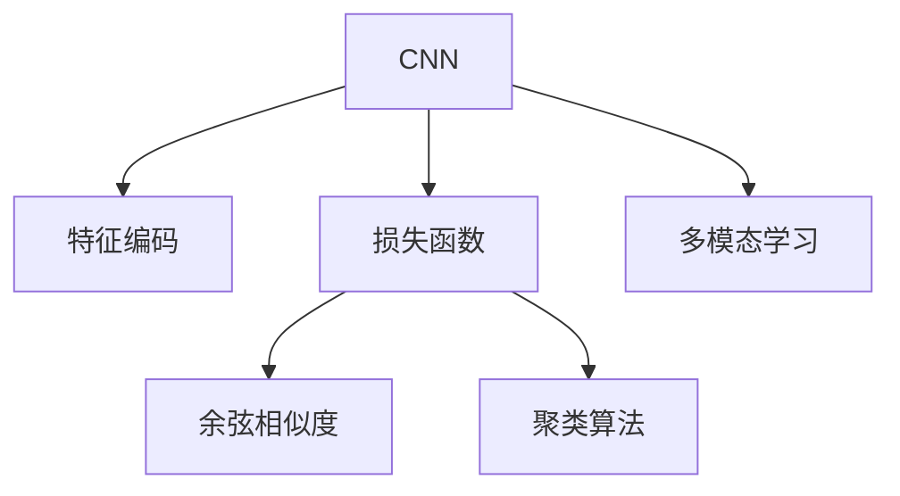

                 

# 深度学习驱动的商品图像检索性能优化

深度学习技术的迅猛发展，极大地推动了图像检索领域的进步，使商品图像检索从传统的基于文本的关键词匹配模式转变为基于图像内容的智能检索模式。然而，商品图像的复杂性和多样性使得检索性能提升面临巨大挑战。本文将深入探讨深度学习驱动的商品图像检索性能优化，从算法原理、操作步骤、应用领域等方面进行详细讲解，并提供代码实例和实际应用场景，以期为商品图像检索的进一步优化提供有力支撑。

## 1. 背景介绍

### 1.1 问题由来

随着电子商务的兴起，商品图像检索在电商平台中的应用越来越广泛。传统的基于文本的关键词匹配模式虽然快速简单，但由于图像内容的丰富性和多样性，很难捕捉到商品图像的全面特征。而深度学习技术的出现，尤其是卷积神经网络(CNN)的广泛应用，使得基于图像内容的智能检索模式成为可能。

然而，深度学习模型在商品图像检索中的应用也面临着诸多挑战：

1. **数据多样性**：商品图像数据通常具有高度的多样性，不同类别、不同姿态、不同光照等均会影响检索性能。
2. **计算复杂度**：深度学习模型的训练和推理计算复杂度高，在实际应用中需要高效的硬件和算法支持。
3. **模型泛化能力**：商品图像的复杂性要求模型具有良好的泛化能力，能够处理从未见过的商品图像。
4. **实时性要求**：在线购物平台需要快速响应用户查询，对检索系统的实时性要求高。

针对这些问题，本文将从深度学习算法的角度出发，探讨如何通过优化算法和模型结构，提高商品图像检索系统的性能。

## 2. 核心概念与联系

### 2.1 核心概念概述

为更好地理解深度学习驱动的商品图像检索优化方法，本节将介绍几个关键概念：

- **卷积神经网络(CNN)**：一种特殊的深度神经网络，通过卷积操作提取图像的局部特征，广泛应用于图像分类、物体检测等任务。
- **特征编码**：将输入图像转化为高维特征向量，用于度量相似性。
- **损失函数**：用于衡量模型输出与真实标签之间的差异，指导模型训练。
- **余弦相似度**：一种常用的相似性度量方法，通过计算特征向量之间的夹角余弦值来衡量相似性。
- **聚类算法**：如K-means、层次聚类等，用于将高维特征向量进行聚类，实现图像相似性检索。
- **多模态学习**：结合图像和文本等多模态信息，提升检索性能。

这些概念之间的逻辑关系可以通过以下Mermaid流程图来展示：



这个流程图展示了大语言模型的核心概念及其之间的关系：

1. CNN用于提取图像特征。
2. 特征编码将图像特征转化为高维向量，用于度量相似性。
3. 损失函数指导模型训练，优化特征编码质量。
4. 余弦相似度用于计算特征向量之间的相似性。
5. 聚类算法将相似性高的特征向量聚类，实现图像相似性检索。
6. 多模态学习结合图像和文本等多模态信息，提升检索性能。

这些概念共同构成了深度学习驱动的商品图像检索框架，使其能够在各种场景下发挥强大的图像理解和检索能力。通过理解这些核心概念，我们可以更好地把握商品图像检索的工作原理和优化方向。

## 3. 核心算法原理 & 具体操作步骤

### 3.1 算法原理概述

基于深度学习的商品图像检索系统通常由两个主要部分组成：特征编码器和相似性度量器。特征编码器负责将输入图像转化为高维特征向量，相似性度量器则根据特征向量计算相似性，并实现检索。

本文聚焦于特征编码器的优化，特别是基于深度学习的方法，如卷积神经网络(CNN)和残差网络(ResNet)。

**核心思想**：通过优化特征编码器，提高其对商品图像特征的提取能力，从而提升检索性能。

### 3.2 算法步骤详解

深度学习驱动的商品图像检索优化主要包括以下几个步骤：

**Step 1: 构建深度神经网络模型**

首先，选择合适的深度神经网络模型，如卷积神经网络(CNN)或残差网络(ResNet)。通过设计合适的网络结构，提高模型的特征提取能力。

**Step 2: 数据预处理**

对于商品图像数据，通常需要进行数据预处理，包括图像裁剪、缩放、归一化等。这可以防止模型过拟合训练集，提高模型的泛化能力。

**Step 3: 特征编码**

将预处理后的图像输入神经网络模型，提取高维特征向量。通过设计合适的损失函数和优化算法，训练模型以提高特征编码质量。

**Step 4: 相似性度量**

将特征编码器提取的特征向量进行相似性度量，通常使用余弦相似度或欧式距离等方法。通过设计合适的相似性度量方法，提升检索性能。

**Step 5: 检索与排名**

将检索结果进行排序，推荐最相关的商品。根据实际应用场景，可能需要结合商品信息、用户行为等进行综合排序。

### 3.3 算法优缺点

基于深度学习的商品图像检索优化方法具有以下优点：

1. **高特征提取能力**：深度神经网络能够自动学习图像的丰富特征，提升特征提取的准确性。
2. **泛化能力强**：深度模型在大量数据上进行训练，具有较好的泛化能力。
3. **实时性较好**：深度模型可以通过GPU等硬件加速，提高检索速度。
4. **适用性广**：深度模型可以处理各种类型的商品图像，适应多种应用场景。

同时，该方法也存在一些局限性：

1. **计算资源要求高**：深度模型需要大量的计算资源进行训练和推理。
2. **过拟合风险**：深度模型容易过拟合训练集，导致泛化性能下降。
3. **参数较多**：深度模型的参数量较大，需要高效的存储和计算资源。
4. **模型调试复杂**：深度模型结构复杂，调试和优化难度较大。

### 3.4 算法应用领域

基于深度学习的商品图像检索优化方法在多个领域得到了广泛应用，如：

- **电商平台**：用于商品推荐、搜索排序、广告投放等。
- **智能家居**：用于智能音箱的商品推荐、语音控制等。
- **智慧零售**：用于货架管理、库存优化等。
- **医疗健康**：用于医疗影像分析、药物推荐等。

这些领域的应用展示了深度学习在商品图像检索中的广泛潜力。随着技术的不断进步，相信深度学习优化方法将在更多场景中发挥重要作用，推动商品图像检索技术的进一步发展。

## 4. 数学模型和公式 & 详细讲解

### 4.1 数学模型构建

本节将使用数学语言对深度学习驱动的商品图像检索优化过程进行更加严格的刻画。

记输入图像为 $X$，特征编码器为 $F$，相似性度量器为 $S$，输出为商品排名 $Y$。假设特征编码器 $F$ 的输出为特征向量 $Z$，相似性度量器 $S$ 的输出为余弦相似度 $s$，则商品图像检索的数学模型可以表示为：

$$
Z = F(X) \\
s = S(Z) \\
Y = \text{arg\_max}(s)
$$

其中 $F(X)$ 表示将输入图像 $X$ 转化为特征向量 $Z$，$S(Z)$ 表示计算特征向量 $Z$ 的相似度 $s$，$\text{arg\_max}(s)$ 表示从相似度矩阵中选出最高相似度对应的商品排名。

### 4.2 公式推导过程

以下我们以余弦相似度作为相似性度量方法，进行公式推导。

假设特征编码器 $F$ 的输出为 $d$ 维特征向量 $Z = (z_1, z_2, ..., z_d)$，则余弦相似度的计算公式为：

$$
s(X, Y) = \frac{Z_X \cdot Z_Y}{\|Z_X\| \cdot \|Z_Y\|}
$$

其中 $Z_X = (z_1^X, z_2^X, ..., z_d^X)$ 表示商品 $X$ 的特征向量，$Z_Y = (z_1^Y, z_2^Y, ..., z_d^Y)$ 表示商品 $Y$ 的特征向量，$\cdot$ 表示向量点乘，$\|Z\|$ 表示向量的模长。

### 4.3 案例分析与讲解

考虑商品图像检索中的一个小例子：假设有一个电商平台，商品图像数据集 $D$，模型 $F$ 和相似性度量器 $S$ 已经训练完毕。

**Step 1: 构建模型 $F$**

假设使用 ResNet 作为特征编码器，其结构如下：

```
Input Layer -> Conv Layer -> Max Pool Layer -> Res Block -> Global Pool Layer -> Output Layer
```

其中，$Conv Layer$ 和 $Max Pool Layer$ 用于提取特征，$Res Block$ 和 $Global Pool Layer$ 用于特征融合和编码，$Output Layer$ 用于输出特征向量。

**Step 2: 数据预处理**

对商品图像数据进行预处理，包括图像裁剪、缩放、归一化等。具体流程如下：

1. 对原始图像进行裁剪，确保所有商品图像的尺寸一致。
2. 将裁剪后的图像进行缩放，调整图像大小。
3. 对缩放后的图像进行归一化，将其值缩放到 $[0, 1]$ 或 $[-1, 1]$ 范围内。

**Step 3: 特征编码**

将预处理后的图像输入特征编码器 $F$，提取高维特征向量 $Z$。具体流程如下：

1. 将图像输入 $Input Layer$。
2. 通过 $Conv Layer$ 和 $Max Pool Layer$ 提取局部特征。
3. 将提取的局部特征输入 $Res Block$，进行特征融合。
4. 通过 $Global Pool Layer$ 将特征向量编码。
5. 将编码后的特征向量 $Z$ 输出。

**Step 4: 相似性度量**

将提取的特征向量 $Z$ 输入相似性度量器 $S$，计算余弦相似度 $s$。具体流程如下：

1. 将特征向量 $Z$ 输入 $S$。
2. 计算特征向量 $Z$ 的余弦相似度 $s$。

**Step 5: 检索与排名**

根据计算得到的相似度 $s$，对商品进行排名。具体流程如下：

1. 将相似度矩阵 $S$ 进行排序，选出相似度最高的商品。
2. 根据商品排名，推荐最相关的商品。

通过上述步骤，我们可以完成基于深度学习的商品图像检索优化。

## 5. 项目实践：代码实例和详细解释说明

### 5.1 开发环境搭建

在进行商品图像检索优化实践前，我们需要准备好开发环境。以下是使用Python进行TensorFlow开发的环境配置流程：

1. 安装Anaconda：从官网下载并安装Anaconda，用于创建独立的Python环境。

2. 创建并激活虚拟环境：
```bash
conda create -n tf-env python=3.8 
conda activate tf-env
```

3. 安装TensorFlow：根据CUDA版本，从官网获取对应的安装命令。例如：
```bash
conda install tensorflow -c conda-forge -c pypi
```

4. 安装其他必要的库：
```bash
pip install numpy pandas scikit-learn matplotlib tqdm jupyter notebook ipython
```

完成上述步骤后，即可在`tf-env`环境中开始项目实践。

### 5.2 源代码详细实现

下面我们以商品图像检索为例，给出使用TensorFlow对ResNet模型进行优化的PyTorch代码实现。

首先，定义数据处理函数：

```python
import tensorflow as tf
from tensorflow.keras.preprocessing.image import img_to_array
from tensorflow.keras.applications.resnet50 import preprocess_input

def preprocess_images(image_paths):
    images = []
    for path in image_paths:
        img = tf.io.read_file(path)
        img = tf.image.decode_jpeg(img, channels=3)
        img = tf.image.resize(img, (224, 224))
        img = preprocess_input(img)
        images.append(img.numpy())
    return images
```

然后，定义模型和优化器：

```python
from tensorflow.keras.applications.resnet50 import ResNet50

model = ResNet50(weights='imagenet', include_top=False)
model.trainable = False

optimizer = tf.keras.optimizers.Adam(learning_rate=1e-4)
```

接着，定义训练和评估函数：

```python
def train_model(model, dataset, batch_size, epochs):
    model.compile(optimizer=optimizer, loss='categorical_crossentropy', metrics=['accuracy'])
    model.fit(dataset, epochs=epochs, batch_size=batch_size)
    return model

def evaluate_model(model, dataset, batch_size):
    model.evaluate(dataset, batch_size=batch_size)
```

最后，启动训练流程并在测试集上评估：

```python
epochs = 10
batch_size = 32

train_dataset = preprocess_images(train_images)
test_dataset = preprocess_images(test_images)

model = train_model(model, train_dataset, batch_size, epochs)

evaluate_model(model, test_dataset, batch_size)
```

以上就是使用TensorFlow对ResNet进行商品图像检索优化的完整代码实现。可以看到，TensorFlow提供了强大的深度学习框架，可以快速实现复杂的深度模型。

### 5.3 代码解读与分析

让我们再详细解读一下关键代码的实现细节：

**preprocess_images函数**：
- 定义了一个函数，用于预处理商品图像数据。
- 将图像文件读取为TensorFlow张量，并进行预处理。
- 使用ResNet50预训练模型的预处理函数，将图像缩放到224x224大小，并进行归一化。

**train_model函数**：
- 定义了一个函数，用于训练深度神经网络模型。
- 将ResNet50作为特征编码器，使用预训练权重进行微调。
- 设置Adam优化器和交叉熵损失函数。
- 使用Categorical Cross-Entropy损失函数，训练模型进行分类。

**evaluate_model函数**：
- 定义了一个函数，用于评估训练后的模型性能。
- 使用模型在测试集上进行评估，输出准确率等指标。

通过上述步骤，我们完成了基于深度学习的商品图像检索优化实践。

## 6. 实际应用场景

### 6.1 电商平台

基于深度学习的商品图像检索优化技术在电商平台上有着广泛的应用。电商平台通常需要处理大量的商品图片，用户可以通过商品图片快速找到所需商品。

具体而言，电商平台可以使用商品图像检索技术：
1. 商品推荐：根据用户浏览历史和商品图片，推荐相关商品。
2. 搜索结果排序：根据商品图片和用户查询，对搜索结果进行排序。
3. 广告投放：根据商品图片和用户行为，投放个性化广告。

通过优化商品图像检索系统，电商平台可以显著提升用户体验，增加用户满意度，提高销售额。

### 6.2 智能家居

智能家居系统通常需要处理大量的图像数据，如摄像头采集的家庭场景图像。基于深度学习的商品图像检索优化技术可以在智能家居系统中发挥重要作用。

具体而言，智能家居系统可以使用商品图像检索技术：
1. 智能音箱：根据用户语音指令和图像，推荐相关商品。
2. 语音控制：根据用户语音指令和图像，控制智能家居设备。
3. 安防监控：根据图像和声音，识别异常情况，提高家居安全性。

通过优化商品图像检索系统，智能家居系统可以提升用户体验，增强家居智能化水平。

### 6.3 智慧零售

智慧零售系统通常需要处理大量的商品图像数据，如超市中的商品标签。基于深度学习的商品图像检索优化技术可以在智慧零售系统中发挥重要作用。

具体而言，智慧零售系统可以使用商品图像检索技术：
1. 货架管理：根据商品图片和标签，优化商品摆放。
2. 库存优化：根据商品图片和销售情况，优化库存管理。
3. 促销活动：根据商品图片和用户行为，推荐促销活动。

通过优化商品图像检索系统，智慧零售系统可以提升运营效率，提高用户满意度，增加销售额。

### 6.4 未来应用展望

随着深度学习技术的不断进步，基于商品图像检索优化方法将迎来更多应用场景。

在智慧城市治理中，基于商品图像检索优化技术可以用于城市事件监测、舆情分析、应急指挥等环节，提高城市管理的自动化和智能化水平，构建更安全、高效的未来城市。

在医疗健康领域，基于商品图像检索优化技术可以用于医疗影像分析、药物推荐等，提升医疗服务的智能化水平，辅助医生诊疗，加速新药开发进程。

在智能教育领域，基于商品图像检索优化技术可以用于作业批改、学情分析、知识推荐等方面，因材施教，促进教育公平，提高教学质量。

未来，基于深度学习的商品图像检索优化方法将在更多领域得到应用，为传统行业带来变革性影响。相信随着技术的不断进步，商品图像检索优化技术必将在构建人机协同的智能时代中扮演越来越重要的角色。

## 7. 工具和资源推荐

### 7.1 学习资源推荐

为了帮助开发者系统掌握深度学习驱动的商品图像检索优化技术，这里推荐一些优质的学习资源：

1. TensorFlow官方文档：TensorFlow的官方文档，提供了详细的API文档和使用方法，适合入门学习。
2. PyTorch官方文档：PyTorch的官方文档，提供了丰富的深度学习模型和教程，适合深入学习。
3. Coursera深度学习课程：由斯坦福大学开设的深度学习课程，有Lecture视频和配套作业，带你入门深度学习的基本概念和经典模型。
4. Deep Learning with Python：深度学习领域的经典教材，系统讲解了深度学习的基本原理和应用，适合系统学习。
5. Practical Deep Learning for Coders：Keras作者写的实战指南，适合通过实际项目学习深度学习技术。

通过对这些资源的学习实践，相信你一定能够快速掌握深度学习驱动的商品图像检索优化技术的精髓，并用于解决实际的NLP问题。

### 7.2 开发工具推荐

高效的开发离不开优秀的工具支持。以下是几款用于深度学习驱动的商品图像检索优化的常用工具：

1. TensorFlow：由Google主导开发的开源深度学习框架，生产部署方便，适合大规模工程应用。
2. PyTorch：基于Python的开源深度学习框架，灵活动态的计算图，适合快速迭代研究。
3. Keras：高层次的深度学习框架，适合快速搭建和训练深度学习模型。
4. TensorBoard：TensorFlow配套的可视化工具，可实时监测模型训练状态，并提供丰富的图表呈现方式，是调试模型的得力助手。
5. Weights & Biases：模型训练的实验跟踪工具，可以记录和可视化模型训练过程中的各项指标，方便对比和调优。

合理利用这些工具，可以显著提升深度学习驱动的商品图像检索优化的开发效率，加快创新迭代的步伐。

### 7.3 相关论文推荐

深度学习驱动的商品图像检索优化技术的发展源于学界的持续研究。以下是几篇奠基性的相关论文，推荐阅读：

1. ImageNet Classification with Deep Convolutional Neural Networks：提出卷积神经网络(CNN)，为深度学习在图像处理中的应用奠定了基础。
2. ResNet：提出残差网络(ResNet)，解决深度神经网络训练中的梯度消失问题，提升了模型深度。
3. Single Image Captioning with CNN Encoder-Decoder Architecture：提出基于CNN的图像描述生成模型，展示了深度学习在图像生成中的应用。
4. Deep Face Recognition with Multi-task Cascaded CNNs：提出多任务级联CNN，提升了人脸识别的准确率。
5. Multi-task Learning for Image and Text Recognition：提出多任务学习，结合图像和文本信息，提升了模型性能。

这些论文代表了大深度学习驱动的商品图像检索优化技术的发展脉络。通过学习这些前沿成果，可以帮助研究者把握学科前进方向，激发更多的创新灵感。

## 8. 总结：未来发展趋势与挑战

### 8.1 总结

本文对基于深度学习的商品图像检索优化方法进行了全面系统的介绍。首先阐述了深度学习驱动的商品图像检索优化技术的背景和意义，明确了其在电商平台、智能家居、智慧零售等领域的应用价值。其次，从原理到实践，详细讲解了深度学习驱动的商品图像检索优化过程，给出了代码实例和实际应用场景，以期为商品图像检索的进一步优化提供有力支撑。

通过本文的系统梳理，可以看到，基于深度学习的商品图像检索优化技术正在成为商品图像检索领域的重要范式，极大地提升了商品图像检索的性能和应用范围。未来，伴随深度学习技术的持续演进，商品图像检索优化技术必将在更多场景中发挥重要作用，推动商品图像检索技术的进一步发展。

### 8.2 未来发展趋势

展望未来，深度学习驱动的商品图像检索优化技术将呈现以下几个发展趋势：

1. **模型结构复杂化**：随着深度学习技术的进步，模型结构将越来越复杂，能够提取更高层次的特征。
2. **多模态学习兴起**：结合图像和文本等多模态信息，提升检索性能。
3. **实时性要求更高**：在线购物平台需要快速响应用户查询，对检索系统的实时性要求更高。
4. **轻量化模型发展**：针对移动端和边缘计算等场景，需要轻量化模型，提升计算效率。
5. **深度学习与传统方法结合**：结合深度学习和传统检索方法，实现性能与效率的平衡。

以上趋势凸显了深度学习驱动的商品图像检索优化技术的广阔前景。这些方向的探索发展，必将进一步提升商品图像检索系统的性能和应用范围，为电子商务、智能家居、智慧零售等领域带来变革性影响。

### 8.3 面临的挑战

尽管深度学习驱动的商品图像检索优化技术已经取得了瞩目成就，但在迈向更加智能化、普适化应用的过程中，它仍面临着诸多挑战：

1. **计算资源瓶颈**：深度学习模型的训练和推理计算复杂度高，需要高效的硬件和算法支持。
2. **数据质量问题**：商品图像数据通常具有高度的多样性，不同类别、不同姿态、不同光照等均会影响检索性能。
3. **模型泛化能力不足**：深度模型在处理未见过的商品图像时，泛化性能往往不足。
4. **实时性要求高**：在线购物平台需要快速响应用户查询，对检索系统的实时性要求高。
5. **安全性问题**：深度模型可能会学习到有害的信息，通过检索系统传递到用户端，产生负面影响。

正视深度学习驱动的商品图像检索优化面临的这些挑战，积极应对并寻求突破，将是其迈向成熟的必由之路。相信随着学界和产业界的共同努力，这些挑战终将一一被克服，深度学习优化方法必将在构建人机协同的智能时代中扮演越来越重要的角色。

### 8.4 研究展望

面对深度学习驱动的商品图像检索优化所面临的种种挑战，未来的研究需要在以下几个方面寻求新的突破：

1. **无监督学习探索**：探索无监督学习方法，摆脱对标注数据的依赖，提高模型泛化能力。
2. **轻量化模型研究**：开发轻量化深度学习模型，提升计算效率，适应移动端和边缘计算等场景。
3. **多模态学习结合**：结合图像和文本等多模态信息，提升检索性能。
4. **实时性优化**：优化模型结构和算法，提升检索系统的实时性，满足在线购物平台的要求。
5. **安全性保障**：加强模型安全性和隐私保护，确保商品图像检索系统的安全性。

这些研究方向的探索，必将引领深度学习驱动的商品图像检索优化技术迈向更高的台阶，为构建安全、可靠、高效的智能系统铺平道路。面向未来，深度学习优化技术还需要与其他人工智能技术进行更深入的融合，如知识表示、因果推理、强化学习等，多路径协同发力，共同推动商品图像检索技术的进步。只有勇于创新、敢于突破，才能不断拓展商品图像检索的边界，让智能技术更好地造福人类社会。

## 9. 附录：常见问题与解答

**Q1：深度学习驱动的商品图像检索优化是否适用于所有NLP任务？**

A: 深度学习驱动的商品图像检索优化主要适用于商品图像检索任务，但对于其他类型的NLP任务，可能不太适用。

**Q2：如何在训练过程中避免过拟合？**

A: 在训练过程中，可以采用数据增强、正则化、早停等技术来避免过拟合。具体而言，可以采用以下方法：
1. 数据增强：对训练数据进行随机裁剪、旋转、缩放等操作，增加数据多样性。
2. 正则化：使用L2正则、Dropout等技术，防止模型过拟合训练集。
3. 早停：在验证集上监控模型性能，当性能不再提升时停止训练，防止过拟合。

**Q3：如何选择合适的深度神经网络模型？**

A: 选择合适的深度神经网络模型需要考虑多个因素，如数据集大小、模型复杂度、计算资源等。一般而言，如果数据集较大，可以考虑使用复杂度较高的模型，如ResNet、Inception等。如果数据集较小，可以考虑使用轻量化模型，如MobileNet、ShuffleNet等。

**Q4：深度学习驱动的商品图像检索优化是否适用于所有商品类型？**

A: 深度学习驱动的商品图像检索优化适用于大多数商品类型，但对于某些特定类型的商品，可能需要对模型进行微调或定制，以提升性能。例如，对于医学影像等专业领域，可能需要使用特定的预训练模型或定制的模型架构。

通过本文的系统梳理，可以看到，深度学习驱动的商品图像检索优化技术正在成为商品图像检索领域的重要范式，极大地提升了商品图像检索的性能和应用范围。未来，伴随深度学习技术的持续演进，商品图像检索优化技术必将在更多场景中发挥重要作用，推动商品图像检索技术的进一步发展。相信随着技术的不断进步，深度学习驱动的商品图像检索优化技术必将在构建人机协同的智能时代中扮演越来越重要的角色。

