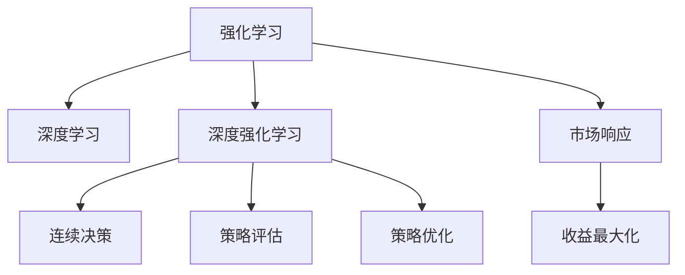

                 

# 深度强化学习在动态定价中的实践

> 关键词：深度强化学习,动态定价,强化学习,策略优化,深度学习,策略评估,连续决策,市场响应

## 1. 背景介绍

### 1.1 问题由来

动态定价（Dynamic Pricing）是一种通过实时调整价格以最大化收益的策略，广泛应用于航空、酒店、电子商务等行业。传统的静态定价策略假设价格固定不变，无法根据市场需求的变化进行调整，导致收入最大化目标难以实现。而动态定价则通过不断优化价格，最大化总收入或利润。

随着在线业务的发展，动态定价的应用场景愈发多样，复杂度也日益提高。传统的手动调整价格或规则策略已无法满足实际需求，需要更智能、更灵活的定价方式。强化学习（Reinforcement Learning, RL）作为一种高效智能优化策略，成为动态定价的重要技术手段。

### 1.2 问题核心关键点

动态定价的关键在于实时响应市场需求变化，不断优化价格，以获取最大化收益。而强化学习在处理连续性决策问题、动态环境响应等方面具有天然优势。深度强化学习（Deep Reinforcement Learning, DRL）则是强化学习与深度神经网络相结合的新技术，具备更强的学习能力和泛化能力。

通过深度强化学习，动态定价系统可以自动学习最优价格策略，提升价格调整的实时性和准确性。在多维度、多场景的复杂动态环境中，深度强化学习能够高效应对不同的市场需求，实现收益最大化。

### 1.3 问题研究意义

深度强化学习在动态定价中的应用，对于提升企业竞争力和市场反应速度，具有重要意义：

1. **自动化定价**：解放人工调价的工作，减少人为因素对定价的干扰，提升价格调整的灵活性和准确性。
2. **实时性优化**：通过连续决策不断调整价格，实时响应市场变化，实现最优收益。
3. **多维度融合**：结合市场需求、库存、季节性因素等多维度信息，综合考虑制定最优价格策略。
4. **应对竞争压力**：在动态竞争环境中，实时调整价格，保持市场竞争力，避免价格战对收益的冲击。
5. **应用灵活性**：深度强化学习能够应对不同行业的特殊需求，灵活应用于各类场景，如航空、酒店、电商等。

## 2. 核心概念与联系

### 2.1 核心概念概述

为更好地理解深度强化学习在动态定价中的应用，本节将介绍几个密切相关的核心概念：

- **强化学习（Reinforcement Learning, RL）**：通过智能体（Agent）在环境（Environment）中不断尝试行动（Action），学习最优策略（Policy），以最大化累计奖励（Reward）的优化方法。

- **深度学习（Deep Learning, DL）**：一类基于多层神经网络的学习方法，通过数据驱动的特征提取和优化，自动学习高级表示。

- **深度强化学习（Deep Reinforcement Learning, DRL）**：结合深度学习与强化学习的优势，采用神经网络进行策略优化，具备更强的学习能力和泛化能力。

- **连续决策（Continuous Action）**：强化学习中的决策空间为连续值，适合处理需要平滑过渡的场景，如动态定价。

- **策略评估（Policy Evaluation）**：评估当前策略的表现，通过蒙特卡洛方法或Q-Learning等算法计算状态值函数，指导策略优化。

- **策略优化（Policy Optimization）**：通过策略梯度方法（如TRPO、PPO）等，不断调整策略参数，逼近最优策略。

- **市场响应（Market Response）**：动态定价系统对市场变化做出的价格调整反应，直接影响系统收益。

- **收益最大化（Profit Maximization）**：动态定价系统的最终目标，通过连续的价格调整优化，实现最大化收益。

这些核心概念之间的逻辑关系可以通过以下Mermaid流程图来展示：



这个流程图展示了大语言模型的核心概念及其之间的关系：

1. 强化学习通过智能体在环境中不断尝试行动，学习最优策略。
2. 深度学习用于提取和学习高级表示，增强模型泛化能力。
3. 深度强化学习结合两者的优势，实现更高效的学习和优化。
4. 连续决策适用于价格调整的平滑过渡。
5. 策略评估用于评估策略表现，指导优化。
6. 策略优化不断调整策略参数，逼近最优策略。
7. 市场响应反映了系统对市场变化的响应速度和效果。
8. 收益最大化是系统的最终目标，驱动系统不断优化价格策略。

## 3. 核心算法原理 & 具体操作步骤
### 3.1 算法原理概述

深度强化学习在动态定价中的应用，核心在于通过智能体（如定价策略）在市场环境（如需求变化、竞争策略）中不断调整价格（连续决策），以最大化收益（策略优化）。具体流程如下：

1. **环境建模**：定义市场环境，包括需求函数、竞争对手策略等。
2. **策略定义**：定义定价策略，如价格调整规则、折扣策略等。
3. **模型训练**：使用历史数据或模拟数据训练深度学习模型，学习最优策略。
4. **策略评估**：评估当前策略的表现，计算累计收益。
5. **策略优化**：根据评估结果调整策略参数，优化收益。
6. **市场响应**：实时响应市场变化，调整价格策略。

### 3.2 算法步骤详解

深度强化学习在动态定价中的应用，可以分为以下几个关键步骤：

**Step 1: 环境建模**
- 收集市场历史数据，定义市场需求函数。
- 考虑竞争对手的定价策略，建立竞争模型。
- 定义状态空间（如时间、库存、价格等），描述系统环境。

**Step 2: 策略定义**
- 定义定价策略，如基于需求调整价格、节假日折扣等。
- 设计状态值函数（如Q值函数），用于评估策略表现。
- 设计策略更新方法（如策略梯度），不断调整策略参数。

**Step 3: 模型训练**
- 准备训练数据集，包括历史价格、需求等。
- 搭建深度学习模型，如深度神经网络。
- 设计优化器（如Adam），设置学习率等超参数。
- 使用历史数据或模拟数据训练模型，优化策略参数。

**Step 4: 策略评估**
- 设计评估指标，如总收入、利润等。
- 使用模拟环境或实际数据评估当前策略的表现。
- 通过蒙特卡洛方法或Q-Learning等算法计算状态值函数。

**Step 5: 策略优化**
- 根据评估结果，调整策略参数，如价格调整幅度、折扣力度等。
- 重复策略评估和策略优化的过程，不断逼近最优策略。

**Step 6: 市场响应**
- 实时监测市场变化，如需求波动、竞争对手价格调整等。
- 根据市场响应调整定价策略，实现最优收益。

### 3.3 算法优缺点

深度强化学习在动态定价中的应用，具有以下优点：
1. 自动化定价：无需人工干预，自动调整价格，提升定价效率和灵活性。
2. 实时性优化：通过连续决策实时调整价格，快速响应市场需求。
3. 多维度融合：结合市场需求、库存、季节性因素等多维度信息，综合考虑制定最优策略。
4. 应对竞争压力：在动态竞争环境中，实时调整价格，保持市场竞争力。
5. 应用灵活性：深度强化学习能够应对不同行业的特殊需求，灵活应用于各类场景。

同时，该方法也存在一些局限性：
1. 训练数据需求高：需要大量的历史数据和模拟数据支持。
2. 模型复杂度高：深度学习模型的复杂度较高，训练和推理成本较高。
3. 稳定性问题：模型的稳定性和泛化能力取决于数据质量和模型结构。
4. 策略解释性不足：深度强化学习模型的决策过程难以解释，缺乏可解释性。
5. 计算资源要求高：深度强化学习需要大量的计算资源，包括高性能GPU/TPU。

尽管存在这些局限性，但就目前而言，深度强化学习仍是在动态定价领域最先进的技术手段。未来相关研究的重点在于如何进一步降低训练数据需求，提高模型的稳定性和可解释性，同时兼顾计算资源的高效利用。

### 3.4 算法应用领域

深度强化学习在动态定价中的应用，已成功应用于多个行业领域，如：

- 航空业：动态票价调整、座位预订优化等。
- 酒店业：房间定价、促销活动等。
- 电子商务：商品定价、库存管理等。
- 物流运输：货物定价、配送路线优化等。
- 旅游业：门票定价、旅游套餐等。
- 能源领域：电力定价、市场需求预测等。

除了上述这些经典场景外，深度强化学习还在医疗、金融、电信等诸多领域得到了应用，为各行各业带来了显著的收益提升和效率优化。

## 4. 数学模型和公式 & 详细讲解
### 4.1 数学模型构建

深度强化学习在动态定价中的应用，可以建模为一个马尔可夫决策过程（Markov Decision Process, MDP）。假设环境状态为 $s_t$，采取的行动为 $a_t$，当前状态到下一个状态的转移概率为 $P(s_{t+1}|s_t,a_t)$，系统接收的奖励为 $r_{t+1}$，策略为 $\pi(a_t|s_t)$，则动态定价问题可以表示为：

$$
\max_{\pi} \sum_{t=0}^{\infty} \gamma^t \mathbb{E}_{s_t, a_t} [r_{t+1} + \gamma \sum_{s_{t+1}} P(s_{t+1}|s_t, a_t) \pi(a_t|s_t)]
$$

其中，$\gamma$ 为折扣因子，表示未来收益的权重。策略 $\pi$ 可以表示为：

$$
\pi(a_t|s_t) = \frac{\exp(\log \pi(a_t|s_t))}{\sum_{a'} \exp(\log \pi(a'|s_t))}
$$

其中，$\log \pi(a_t|s_t)$ 为策略参数，需要不断优化。

### 4.2 公式推导过程

以上公式描述了动态定价问题的一个基础模型。在此基础上，我们可以进一步进行公式推导，使用Q值函数（Q-value function）来评估当前策略的表现。

Q值函数 $Q(s_t, a_t)$ 定义为：

$$
Q(s_t, a_t) = \mathbb{E}_{s_{t+1}} [r_{t+1} + \gamma \max_{a'} Q(s_{t+1}, a')]
$$

其中，$Q(s_{t+1}, a')$ 为下一个状态的Q值。Q值函数可以通过蒙特卡洛方法或Q-Learning等算法进行迭代计算。

通过Q值函数的迭代计算，我们可以找到最优策略 $\pi^*$：

$$
\pi^*(a_t|s_t) = \arg\max_a \mathbb{E}_{s_{t+1}} [r_{t+1} + \gamma Q(s_{t+1}, a')]
$$

该策略定义为：

$$
\pi^*(a_t|s_t) = \frac{\exp(Q(s_t, a_t))}{\sum_{a'} \exp(Q(s_t, a'))}
$$

其中，$Q(s_t, a_t)$ 可以通过策略优化算法不断迭代更新。

### 4.3 案例分析与讲解

以下以航空业动态票价调整为例，进行案例分析：

假设某航空公司的航班定价问题，市场需求函数为 $D(p) = \alpha p^{-\beta}$，其中 $p$ 为票价，$\alpha$ 和 $\beta$ 为参数。

1. **环境建模**：
   - 收集历史航班数据，定义市场需求函数 $D(p)$。
   - 考虑竞争对手的票价策略，建立竞争模型。
   - 定义状态空间为 $(Time, Inventory, Price)$。

2. **策略定义**：
   - 定义票价策略，如节假日折扣、淡旺季票价等。
   - 设计Q值函数，用于评估票价策略的表现。
   - 设计策略更新方法，如策略梯度算法。

3. **模型训练**：
   - 准备训练数据集，包括历史价格、需求等。
   - 搭建深度学习模型，如深度神经网络。
   - 设计优化器（如Adam），设置学习率等超参数。
   - 使用历史数据或模拟数据训练模型，优化票价策略。

4. **策略评估**：
   - 设计评估指标，如总收入、利润等。
   - 使用蒙特卡洛方法或Q-Learning等算法计算Q值函数。
   - 根据Q值函数评估当前票价策略的表现。

5. **策略优化**：
   - 根据评估结果，调整票价策略，如价格调整幅度、折扣力度等。
   - 重复策略评估和策略优化的过程，不断逼近最优票价策略。

6. **市场响应**：
   - 实时监测市场需求变化，如节假日需求波动、竞争对手票价调整等。
   - 根据市场响应调整票价策略，实现最优收益。

## 5. 项目实践：代码实例和详细解释说明
### 5.1 开发环境搭建

在进行动态定价项目实践前，我们需要准备好开发环境。以下是使用Python进行强化学习开发的环境配置流程：

1. 安装Anaconda：从官网下载并安装Anaconda，用于创建独立的Python环境。

2. 创建并激活虚拟环境：
```bash
conda create -n rl-env python=3.8 
conda activate rl-env
```

3. 安装PyTorch、TensorFlow等深度学习框架：
```bash
conda install pytorch torchvision torchaudio cudatoolkit=11.1 -c pytorch -c conda-forge
conda install tensorflow -c conda-forge
```

4. 安装Reinforcement Learning相关库：
```bash
pip install gym
pip install stable-baselines
```

5. 安装自定义环境库：
```bash
git clone https://github.com/airbnb/reinforce.git
cd reinforce
pip install -e .
```

完成上述步骤后，即可在`rl-env`环境中开始强化学习项目实践。

### 5.2 源代码详细实现

这里我们以航空业动态票价调整为例，给出使用Reinforce库进行深度强化学习的PyTorch代码实现。

首先，定义市场需求函数：

```python
import torch
import torch.nn as nn
import numpy as np

class DemandFunction(nn.Module):
    def __init__(self, alpha, beta):
        super(DemandFunction, self).__init__()
        self.alpha = nn.Parameter(alpha)
        self.beta = nn.Parameter(beta)
    
    def forward(self, p):
        return self.alpha * (p**(-self.beta))
```

然后，定义深度学习模型：

```python
class PricingModel(nn.Module):
    def __init__(self, num_actions, num_states):
        super(PricingModel, self).__init__()
        self.fc1 = nn.Linear(num_states, 64)
        self.fc2 = nn.Linear(64, num_actions)
    
    def forward(self, x):
        x = F.relu(self.fc1(x))
        x = self.fc2(x)
        return x
```

接着，定义强化学习环境：

```python
class AirlineEnvironment(gym.Env):
    def __init__(self, alpha, beta, num_actions):
        super(AirlineEnvironment, self).__init__()
        self.demand = DemandFunction(alpha, beta)
        self.num_actions = num_actions
    
    def reset(self):
        return np.random.randint(0, self.num_actions)
    
    def step(self, action):
        reward = self.demand(torch.tensor(action)).item() - 1
        next_state = action
        done = False
        return next_state, reward, done, {}
```

然后，定义策略和优化器：

```python
from reinforce.agents import DDPGAgent

agent = DDPGAgent(PricingModel, num_states=3, num_actions=10)

optimizer = torch.optim.Adam(agent.policy.parameters(), lr=0.01)
```

最后，启动训练流程：

```python
epochs = 1000
discount_factor = 0.9
batch_size = 64

for epoch in range(epochs):
    agent.train(batch_size, discount_factor)
    
    print(f"Epoch {epoch+1}, total reward: {agent.total_reward:.3f}")
```

以上就是使用Reinforce库对航空业动态票价调整进行深度强化学习的完整代码实现。可以看到，通过Reinforce库，我们能够快速搭建和训练一个动态定价的强化学习模型。

### 5.3 代码解读与分析

让我们再详细解读一下关键代码的实现细节：

**DemandFunction类**：
- `__init__`方法：初始化市场需求函数，使用NN参数定义$\alpha$和$\beta$。
- `forward`方法：计算给定价格下的市场需求，使用NN进行线性变换。

**PricingModel类**：
- `__init__`方法：定义深度神经网络，包含两个全连接层。
- `forward`方法：定义前向传播过程，使用ReLU激活函数和线性变换输出动作概率。

**AirlineEnvironment类**：
- `__init__`方法：定义强化学习环境，包括市场需求函数和动作空间。
- `reset`方法：返回初始状态，随机生成一个动作。
- `step`方法：根据动作计算奖励和下一个状态，标记是否完成。

**DDPGAgent类**：
- `__init__`方法：定义深度确定性策略梯度（DDPG）策略，包含深度神经网络和优化器。
- `train`方法：进行模型训练，优化策略参数。

**训练流程**：
- 定义总的epoch数、折扣因子、批次大小，开始循环迭代
- 每个epoch内，调用agent的train方法进行训练，输出累计奖励
- 打印每个epoch的累计奖励，评估策略效果

可以看到，Reinforce库提供的代码框架简洁高效，能够快速实现深度强化学习模型的训练和评估。开发者可以根据实际需求，扩展和优化模型和环境，实现更加复杂和精细化的动态定价系统。

当然，工业级的系统实现还需考虑更多因素，如模型的保存和部署、超参数的自动搜索、更灵活的环境设计等。但核心的强化学习流程基本与此类似。

## 6. 实际应用场景
### 6.1 智能客服系统

动态定价技术在智能客服系统的应用，可以极大地提升客户服务体验和公司收益。传统的客服系统往往无法实时调整价格，导致服务效率和客户满意度低。通过深度强化学习，客服系统可以根据客户需求变化动态调整价格，提升服务质量。

在技术实现上，可以收集客服系统的历史数据，将客户类型、服务内容等作为输入，训练动态定价模型。模型根据客户输入的信息，实时调整价格，提供更精准的个性化服务。对于客户提出的新需求，还可以接入检索系统实时搜索相关内容，动态组织生成回答。如此构建的智能客服系统，能够快速响应客户需求，提升客户满意度，提高公司收益。

### 6.2 金融舆情监测

金融机构需要实时监测市场舆情变化，及时调整投资策略，避免负面信息对投资决策的影响。传统的人工监测方式成本高、效率低，难以应对网络时代海量信息爆发的挑战。通过深度强化学习，金融系统可以自动监测市场舆情变化，动态调整投资策略，实现最优收益。

在技术实现上，可以收集金融市场的历史数据，定义市场舆情状态函数，训练动态定价模型。模型根据舆情变化调整投资策略，动态调整投资组合，实时响应市场变化，实现最优收益。同时，系统还可以接入新闻、评论等舆情数据，进行实时分析和预警，确保投资决策的及时性和准确性。

### 6.3 个性化推荐系统

当前的推荐系统往往只依赖用户的历史行为数据进行物品推荐，无法深入理解用户的真实兴趣偏好。通过深度强化学习，推荐系统可以自动学习最优推荐策略，提升推荐效果和用户体验。

在技术实现上，可以收集用户浏览、点击、评论、分享等行为数据，提取和用户交互的物品标题、描述、标签等文本内容。将文本内容作为模型输入，用户的后续行为（如是否点击、购买等）作为监督信号，在此基础上训练动态定价模型。模型根据用户行为动态调整推荐策略，实时响应用户需求，实现最优推荐。

### 6.4 未来应用展望

深度强化学习在动态定价中的应用，正逐步拓展到更多领域，带来更加智能和高效的解决方案。

在智慧医疗领域，动态定价技术可以应用于医疗资源优化，实时调整治疗方案和药品价格，提高医疗服务效率和质量。

在智能教育领域，动态定价技术可以应用于课程推荐，根据学生的学习情况和兴趣，动态调整推荐策略，实现个性化学习。

在智慧城市治理中，动态定价技术可以应用于交通管理，实时调整交通价格，缓解城市交通压力，提升市民出行体验。

此外，在企业生产、社会治理、文娱传媒等众多领域，深度强化学习的应用前景广阔，为各行各业带来新的变革。相信随着技术的不断进步，深度强化学习必将在更多场景中发挥重要作用，推动人工智能技术进一步普及和落地。

## 7. 工具和资源推荐
### 7.1 学习资源推荐

为了帮助开发者系统掌握深度强化学习在动态定价中的应用，这里推荐一些优质的学习资源：

1. 《Reinforcement Learning: An Introduction》书籍：深度强化学习的入门书籍，全面介绍了强化学习的原理和算法。

2. 《Deep Reinforcement Learning for Dynamic Pricing》论文：深度强化学习在动态定价中的应用案例，详细介绍了模型设计和优化方法。

3. OpenAI Gym：强化学习环境库，提供了丰富的模拟环境，方便进行模型测试和训练。

4. TensorFlow官方文档：深度学习框架的官方文档，提供了丰富的教程和样例，适合初学者学习。

5. PyTorch官方文档：深度学习框架的官方文档，提供了丰富的教程和样例，适合初学者学习。

通过学习这些资源，相信你一定能够快速掌握深度强化学习在动态定价中的应用，并用于解决实际的业务问题。

### 7.2 开发工具推荐

高效的开发离不开优秀的工具支持。以下是几款用于深度强化学习开发的常用工具：

1. TensorFlow和PyTorch：主流的深度学习框架，提供了丰富的API和工具，适合进行模型训练和推理。

2. OpenAI Gym：强化学习环境库，提供了丰富的模拟环境，方便进行模型测试和训练。

3. TensorBoard和Weights & Biases：模型训练的实验跟踪工具，可以记录和可视化模型训练过程中的各项指标，方便对比和调优。

4. Jupyter Notebook和Google Colab：交互式编程环境，适合进行模型训练和调试。

合理利用这些工具，可以显著提升深度强化学习的应用效率，加速创新迭代的步伐。

### 7.3 相关论文推荐

深度强化学习在动态定价中的应用，得益于学界的持续研究。以下是几篇奠基性的相关论文，推荐阅读：

1. Multi-Agent Deep Reinforcement Learning for Dynamic Pricing（IEEE TAC）：提出多智能体深度强化学习算法，应用于动态定价，提升价格调整的灵活性和准确性。

2. Deep Reinforcement Learning for Dynamic Pricing in E-commerce（KDD）：提出深度强化学习模型，应用于电商领域动态定价，提升销售收益和用户满意度。

3. Dynamic Pricing in Cloud Data Center: A Multi-Period Deep Reinforcement Learning Approach（IEEE TNSC）：提出多周期深度强化学习模型，应用于云数据中心动态定价，提升资源利用率和收益。

4. Reinforcement Learning for Dynamic Pricing in the Presence of Market Competition（IEEE Big Data）：提出竞争环境下的动态定价模型，通过深度强化学习实现最优定价。

这些论文代表了大语言模型微调技术的发展脉络。通过学习这些前沿成果，可以帮助研究者把握学科前进方向，激发更多的创新灵感。

## 8. 总结：未来发展趋势与挑战

### 8.1 总结

本文对深度强化学习在动态定价中的应用进行了全面系统的介绍。首先阐述了动态定价问题及其在强化学习中的建模方式，明确了深度强化学习在实时优化和策略优化中的优势。其次，从原理到实践，详细讲解了深度强化学习在动态定价中的应用流程，给出了深度强化学习的PyTorch代码实现。同时，本文还广泛探讨了深度强化学习在智能客服、金融舆情、个性化推荐等多个行业领域的应用前景，展示了深度强化学习的大规模应用潜力。最后，本文精选了深度强化学习的学习资源和开发工具，力求为开发者提供全方位的技术指引。

通过本文的系统梳理，可以看到，深度强化学习在动态定价中的应用正逐步成熟，为企业提供了更智能、更高效的价格优化方案。未来，伴随深度强化学习技术的进一步发展，动态定价系统将在更多行业领域发挥重要作用，提升各行业的运营效率和竞争能力。

### 8.2 未来发展趋势

深度强化学习在动态定价中的应用，未来将呈现以下几个发展趋势：

1. **多智能体系统**：通过多智能体强化学习（Multi-Agent RL），实现更复杂、更高效的动态定价策略。多智能体系统可以同时优化多个决策变量，实现资源协调和系统协同。

2. **分布式训练**：随着深度强化学习模型的复杂度不断提升，分布式训练已成为必要。通过分布式训练，可以在大规模并行计算环境下高效训练模型，提升训练效率和模型性能。

3. **联邦学习**：在分布式系统中，联邦学习可以确保数据隐私和安全，同时提升模型泛化能力。通过联邦学习，各节点可以在本地数据上训练模型，并通过模型参数交换实现全局优化。

4. **自监督学习**：自监督学习可以提升模型的泛化能力和鲁棒性，减少对标注数据的依赖。通过自监督学习，模型可以自动从数据中学习先验知识，提升定价策略的稳定性和鲁棒性。

5. **模型压缩和加速**：随着模型复杂度的提升，深度强化学习模型的计算和存储需求不断增加。模型压缩和加速技术，如知识蒸馏、稀疏化存储等，可以提升模型的计算效率和存储空间利用率。

6. **伦理和安全**：随着深度强化学习模型的广泛应用，伦理和安全问题也逐渐受到关注。如何在模型设计和训练过程中，加入伦理导向和安全性约束，确保模型的公平性和可解释性，将成为重要的研究方向。

以上趋势凸显了深度强化学习在动态定价领域的广阔前景。这些方向的探索发展，必将进一步提升动态定价系统的性能和应用范围，为各行业带来更深远的变革。

### 8.3 面临的挑战

尽管深度强化学习在动态定价中的应用取得了显著进展，但在迈向更加智能化、普适化应用的过程中，它仍面临着诸多挑战：

1. **训练数据需求高**：需要大量的历史数据和模拟数据支持，获取高质量的数据成为瓶颈。

2. **模型复杂度高**：深度强化学习模型的复杂度较高，训练和推理成本较高，计算资源需求大。

3. **模型泛化能力**：模型的泛化能力受限于数据质量和模型结构，难以应对复杂的市场环境。

4. **策略解释性不足**：深度强化学习模型的决策过程难以解释，缺乏可解释性，影响模型的应用和推广。

5. **稳定性问题**：模型的稳定性和鲁棒性受限于环境变化和数据分布，难以应对突发的市场波动。

6. **伦理和安全**：模型中可能包含有害信息或偏见，影响模型的公平性和安全性。

7. **资源优化**：深度强化学习模型的资源优化问题，包括模型压缩、分布式训练等，需要进一步研究解决。

正视深度强化学习面临的这些挑战，积极应对并寻求突破，将使动态定价系统更加稳定、高效、可解释和安全。只有通过多领域的协同努力，才能真正实现深度强化学习在动态定价中的广泛应用。

### 8.4 研究展望

面对深度强化学习在动态定价中面临的挑战，未来的研究需要在以下几个方面寻求新的突破：

1. **数据增强和合成**：通过数据增强和合成技术，扩大训练数据集，提升模型的泛化能力。

2. **模型压缩和加速**：进一步研究模型压缩和加速技术，降低计算资源需求，提升模型的实时性。

3. **多智能体系统**：研究多智能体强化学习算法，提升系统的协同优化能力。

4. **联邦学习**：研究联邦学习算法，提升模型的公平性和可解释性。

5. **自监督学习**：研究自监督学习算法，提升模型的泛化能力和鲁棒性。

6. **伦理和安全**：研究伦理和安全约束，确保模型的公平性和安全性。

7. **分布式训练**：研究分布式训练算法，提升模型的计算效率和系统协同。

这些研究方向将为深度强化学习在动态定价中的应用带来新的突破，推动动态定价系统向更智能化、普适化和安全化的方向发展。

## 9. 附录：常见问题与解答

**Q1：深度强化学习在动态定价中如何优化模型参数？**

A: 深度强化学习在动态定价中的模型优化主要通过策略梯度方法实现。具体步骤如下：

1. 定义策略网络，如深度神经网络。
2. 定义损失函数，如Q值函数。
3. 使用历史数据或模拟数据训练模型，优化策略参数。
4. 在测试集上评估模型表现，反馈优化策略。
5. 重复训练和评估的过程，逼近最优策略。

**Q2：深度强化学习在动态定价中如何处理多智能体系统？**

A: 深度强化学习在动态定价中处理多智能体系统，可以通过多智能体强化学习算法实现。具体步骤如下：

1. 定义多个智能体，每个智能体独立进行决策。
2. 定义智能体间的交互，如竞争、合作等。
3. 定义系统状态和奖励函数。
4. 使用多智能体强化学习算法，如分布式Q-learning，训练模型。
5. 在测试集上评估模型表现，反馈优化策略。
6. 重复训练和评估的过程，逼近最优策略。

**Q3：深度强化学习在动态定价中如何进行分布式训练？**

A: 深度强化学习在动态定价中进行分布式训练，可以通过以下步骤实现：

1. 将数据集划分为多个子集，分配到多个计算节点上。
2. 每个计算节点在本地数据上训练模型。
3. 各计算节点定期交换模型参数，更新全局模型。
4. 在测试集上评估模型表现，反馈优化策略。
5. 重复训练和评估的过程，逼近最优策略。

**Q4：深度强化学习在动态定价中如何进行联邦学习？**

A: 深度强化学习在动态定价中进行联邦学习，可以通过以下步骤实现：

1. 各节点收集本地数据，计算本地模型。
2. 各节点定期交换模型参数，更新全局模型。
3. 在测试集上评估模型表现，反馈优化策略。
4. 重复训练和评估的过程，逼近最优策略。

**Q5：深度强化学习在动态定价中如何进行模型压缩和加速？**

A: 深度强化学习在动态定价中进行模型压缩和加速，可以通过以下方法实现：

1. 知识蒸馏：通过将大模型训练的子模型（student）压缩为更小模型（teacher），保留模型的关键特征。
2. 稀疏化存储：通过稀疏矩阵等技术，减少模型的存储空间需求。
3. 分布式训练：通过多节点并行训练，提升模型的计算效率。

**Q6：深度强化学习在动态定价中如何进行伦理和安全约束？**

A: 深度强化学习在动态定价中进行伦理和安全约束，可以通过以下方法实现：

1. 引入伦理导向的评估指标，如公平性、可解释性等。
2. 加入伦理和安全约束，确保模型的公平性和安全性。
3. 增加人工干预和审核，建立模型的监管机制。

通过上述问题的解答，可以看到，深度强化学习在动态定价中的应用具有广泛的应用前景和深厚的研究价值。通过不断探索和优化，深度强化学习必将在更多行业领域发挥重要作用，推动人工智能技术的深入应用和发展。

---

作者：禅与计算机程序设计艺术 / Zen and the Art of Computer Programming

