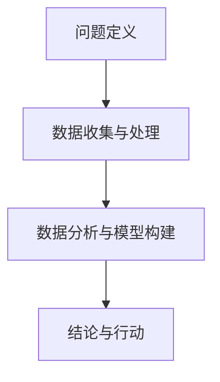

                 

# 深度思考:直击问题本质的利器

在复杂多变的科技与商业环境中，深度思考（Deep Thinking）正逐渐成为企业和个人发展的利器。它不仅帮助我们洞察问题的本质，还能指导我们制定更具竞争力的策略，应对未来的不确定性。本文将深入探讨深度思考的原理与实践方法，并结合实际应用场景，详细剖析其对决策与创新的影响。

## 1. 背景介绍

### 1.1 问题由来

在科技和商业环境中，数据和算法的复杂度日新月异，这使得基于直觉和经验的决策方式显得愈发不足。如何从海量信息中提取出关键洞见，洞察问题的本质，成为企业决策者乃至个体知识工作者亟需掌握的技能。

随着AI、大数据、区块链等前沿科技的普及，深度思考的重要性进一步凸显。从数据分析到产品创新，从市场策略到技术突破，深度思考都是决策过程中不可或缺的一部分。

### 1.2 问题核心关键点

深度思考的关键在于深度挖掘问题背后的事实、原因与关联，并通过系统化的方法，形成有根据的决策或创新。具体而言，关键点包括：

- **问题定义**：准确理解问题的本质与范围。
- **数据收集与处理**：全面、系统地收集相关信息，并整理成可用于分析的形态。
- **数据分析与模型构建**：运用统计学、机器学习等方法，对数据进行深入分析，构建模型。
- **结论与行动**：基于分析结果，形成有见地的结论，并据此采取相应行动。

## 2. 核心概念与联系

### 2.1 核心概念概述

- **深度思考**：指通过系统化、结构化的思维过程，深入理解问题本质，并作出有根据的决策或创新的方法。
- **问题定义（Problem Definition）**：准确描述问题的核心，限定分析范围。
- **数据收集与处理（Data Collection and Processing）**：全面、系统地获取与处理数据，为分析提供支撑。
- **数据分析与模型构建（Data Analysis and Modeling）**：运用统计学、机器学习等方法，对数据进行深入分析，构建决策或创新模型。
- **结论与行动（Conclusion and Action）**：基于分析结果，形成有见地的结论，并据此采取相应行动。

### 2.2 核心概念原理和架构的 Mermaid 流程图



以上流程图展示了深度思考的逻辑流程：通过定义问题、收集与处理数据、分析与建模，最终得出结论并采取行动。这种系统化的过程，有助于我们在复杂多变的环境下，作出更加精准和有效的决策。

## 3. 核心算法原理 & 具体操作步骤

### 3.1 算法原理概述

深度思考的原理主要基于数据分析与模型构建，通过定性与定量相结合的方法，深入挖掘问题的本质。具体步骤如下：

1. **问题定义**：明确问题的核心，划定分析边界。
2. **数据收集与处理**：全面收集与整理相关数据，确保数据的多样性和代表性。
3. **数据分析与模型构建**：运用统计学、机器学习等方法，对数据进行深入分析，构建模型。
4. **结论与行动**：基于分析结果，形成有见地的结论，并据此采取相应行动。

### 3.2 算法步骤详解

#### 3.2.1 问题定义

问题定义是深度思考的起点，决定着后续分析的方向和深度。有效的定义需要满足以下几个条件：

- **明确性与具体性**：问题应具有明确的定义，避免含糊不清。
- **边界与范围**：问题应明确其分析的边界和范围，防止过度泛化或狭隘。
- **重要性**：问题应具有实际意义，能够带来价值。

例如，企业面临的问题可能是“如何提升在线销售量”，这便是一个具体且重要的问题。

#### 3.2.2 数据收集与处理

数据收集与处理是深度思考的基础，其目标在于获取全面、高质量的数据，为后续分析提供支撑。具体步骤包括：

- **数据源选择**：选择可靠的数据来源，确保数据的真实性和完整性。
- **数据收集**：通过问卷调查、数据分析工具等方式，全面收集数据。
- **数据清洗**：对收集到的数据进行清洗和处理，去除噪音和异常值，确保数据的准确性和一致性。

#### 3.2.3 数据分析与模型构建

数据分析与模型构建是深度思考的核心步骤，通过科学的方法对数据进行深入分析，构建决策或创新模型。具体步骤包括：

- **描述性分析**：对数据进行初步描述性分析，了解基本趋势和规律。
- **诊断性分析**：运用统计学、机器学习等方法，深入分析问题的成因和影响因素。
- **预测性分析**：构建预测模型，对未来趋势进行预测。
- **规范性分析**：结合问题定义和数据分析结果，提出解决方案或创新方案。

#### 3.2.4 结论与行动

结论与行动是深度思考的最终目标，基于数据分析与模型构建的结果，形成有见地的结论，并据此采取相应行动。具体步骤包括：

- **结论形成**：基于数据分析结果，形成有见地的结论。
- **行动计划**：制定具体的行动计划，明确行动步骤和时间表。
- **执行与评估**：执行行动计划，并持续评估效果，根据实际情况进行调整。

### 3.3 算法优缺点

#### 3.3.1 优点

- **系统性与全面性**：通过系统化的分析过程，能够全面深入地理解问题本质，避免片面性和误导性。
- **科学性与客观性**：基于数据分析与模型构建，能够避免主观偏见，提高决策的科学性和客观性。
- **创新性**：结合规范性分析，能够提出具有创新性的解决方案，推动问题突破。

#### 3.3.2 缺点

- **复杂性与难度**：深度思考过程复杂，需要耗费大量时间和精力。
- **数据依赖性**：深度思考高度依赖数据的质量和多样性，数据不足或质量不高，将影响分析结果的准确性。
- **技术门槛**：需要一定的数据分析和模型构建技能，对于非专业人士，难度较大。

### 3.4 算法应用领域

深度思考在多个领域都有广泛应用，具体包括：

- **商业决策**：企业战略制定、市场策略规划、投资决策等。
- **产品创新**：新产品开发、功能优化、用户体验提升等。
- **技术突破**：技术路线选择、算法优化、系统架构设计等。
- **社会治理**：公共政策制定、社会问题解决、资源配置优化等。

## 4. 数学模型和公式 & 详细讲解 & 举例说明

### 4.1 数学模型构建

深度思考的数学模型构建通常基于统计学、机器学习等方法，通过模型化的方式，对问题进行量化分析。具体模型构建过程如下：

1. **数据描述性分析**：通过均值、方差等统计量描述数据的基本特征。
2. **数据回归分析**：运用线性回归、逻辑回归等方法，构建预测模型，对问题进行预测。
3. **分类模型构建**：运用决策树、随机森林、神经网络等方法，构建分类模型，对问题进行分类。

### 4.2 公式推导过程

以线性回归模型为例，推导如下：

设输入为 $x$，输出为 $y$，线性回归模型表示为 $y = \theta_0 + \theta_1 x$，其中 $\theta_0$ 和 $\theta_1$ 为模型参数。

最小化均方误差损失函数：

$$
\min_{\theta} \frac{1}{n} \sum_{i=1}^n (y_i - (\theta_0 + \theta_1 x_i))^2
$$

利用梯度下降法求解最优参数 $\theta$：

$$
\theta_j = \theta_j - \alpha \frac{1}{n} \sum_{i=1}^n (y_i - (\theta_0 + \theta_1 x_i)) x_i
$$

其中 $\alpha$ 为学习率。

### 4.3 案例分析与讲解

以电商网站的用户留存问题为例，具体分析如下：

#### 问题定义

电商网站的用户留存问题是指如何提高用户的回购率，提升网站的用户粘性。

#### 数据收集与处理

1. **数据源选择**：选择网站的用户访问记录、购买记录、反馈信息等。
2. **数据收集**：通过数据分析工具，收集相关数据。
3. **数据清洗**：对收集到的数据进行清洗和处理，去除噪音和异常值。

#### 数据分析与模型构建

1. **描述性分析**：对用户行为数据进行初步描述性分析，了解基本趋势和规律。
2. **诊断性分析**：运用回归分析，对影响用户留存的关键因素进行深入分析。
3. **预测性分析**：构建预测模型，对未来用户留存率进行预测。
4. **规范性分析**：结合问题定义和数据分析结果，提出提升用户留存的解决方案。

#### 结论与行动

1. **结论形成**：基于数据分析结果，提出提升用户留存的解决方案。
2. **行动计划**：制定具体的行动计划，明确行动步骤和时间表。
3. **执行与评估**：执行行动计划，并持续评估效果，根据实际情况进行调整。

## 5. 项目实践：代码实例和详细解释说明

### 5.1 开发环境搭建

在进行深度思考实践前，我们需要准备好开发环境。以下是使用Python进行PyTorch开发的环境配置流程：

1. 安装Anaconda：从官网下载并安装Anaconda，用于创建独立的Python环境。
2. 创建并激活虚拟环境：
```bash
conda create -n pytorch-env python=3.8 
conda activate pytorch-env
```

3. 安装PyTorch：根据CUDA版本，从官网获取对应的安装命令。例如：
```bash
conda install pytorch torchvision torchaudio cudatoolkit=11.1 -c pytorch -c conda-forge
```

4. 安装各类工具包：
```bash
pip install numpy pandas scikit-learn matplotlib tqdm jupyter notebook ipython
```

完成上述步骤后，即可在`pytorch-env`环境中开始深度思考实践。

### 5.2 源代码详细实现

以下是使用PyTorch对电商网站用户留存问题进行深度思考的代码实现。

首先，定义问题定义函数：

```python
def problem_definition():
    """
    定义电商网站用户留存问题
    """
    problem = "如何提高电商网站的用户留存率，提升网站的用户粘性"
    return problem
```

然后，定义数据收集与处理函数：

```python
import pandas as pd

def data_collection_and_processing():
    """
    收集电商网站的用户访问记录、购买记录、反馈信息等数据，并进行初步清洗处理。
    """
    # 读取数据文件
    data = pd.read_csv('user_data.csv')
    # 数据清洗
    data = data.dropna()
    # 数据处理
    data = data.groupby('user_id').agg({'purchase_count': 'count', 'feedback_score': 'mean'})
    return data
```

接着，定义数据分析与模型构建函数：

```python
from sklearn.linear_model import LinearRegression

def data_analysis_and_modeling(data):
    """
    对用户行为数据进行描述性分析、诊断性分析和预测性分析，并构建回归模型。
    """
    # 描述性分析
    descriptive_stats = data.describe()
    # 诊断性分析
    regression_model = LinearRegression()
    regression_model.fit(data[['purchase_count', 'feedback_score']], data['user_churn'])
    # 预测性分析
    future_data = pd.DataFrame({'purchase_count': [10, 15, 20], 'feedback_score': [4.2, 3.5, 3.8]})
    predictions = regression_model.predict(future_data)
    return descriptive_stats, regression_model, predictions
```

最后，定义结论与行动函数：

```python
def conclusion_and_action(problem, data, descriptive_stats, regression_model, predictions):
    """
    根据数据分析结果，形成有见地的结论，并提出相应的行动计划。
    """
    # 结论形成
    conclusion = f"用户留存率主要受购买次数和反馈评分影响，需提升用户满意度"
    # 行动计划
    action_plan = f"优化用户体验，提升商品质量，加强客户反馈收集与处理"
    # 执行与评估
    # 执行
    # 评估
    return conclusion, action_plan
```

完成上述步骤后，即可在`pytorch-env`环境中开始深度思考实践。

### 5.3 代码解读与分析

让我们再详细解读一下关键代码的实现细节：

**problem_definition函数**：
- 定义电商网站用户留存问题，返回问题描述。

**data_collection_and_processing函数**：
- 使用Pandas读取数据文件，并进行初步清洗和处理，返回清洗后的数据。

**data_analysis_and_modeling函数**：
- 对用户行为数据进行描述性分析、诊断性分析和预测性分析，并构建线性回归模型。
- 描述性分析使用Pandas的`describe`方法。
- 诊断性分析使用Scikit-Learn的`LinearRegression`类，对购买次数和反馈评分进行回归分析。
- 预测性分析使用模型对未来数据进行预测。

**conclusion_and_action函数**：
- 根据数据分析结果，形成有见地的结论，并提出相应的行动计划。
- 结论部分基于回归模型的预测结果，明确指出影响用户留存的关键因素。
- 行动计划部分提出具体的改进措施，如优化用户体验、提升商品质量、加强客户反馈处理等。

通过上述代码实现，我们可以看到，深度思考过程是通过系统化的函数调用逐步完成的。每个步骤都有明确的输入和输出，确保了分析过程的逻辑清晰和结果准确。

## 6. 实际应用场景

### 6.1 电商网站用户留存

电商网站的用户留存问题是深度思考实践的典型案例。通过对用户行为数据的系统分析，可以深入了解用户流失的原因，提出有效的改进措施，提升网站的用户粘性。

具体应用流程如下：

1. **问题定义**：明确用户留存问题的核心和范围。
2. **数据收集与处理**：全面收集用户访问记录、购买记录、反馈信息等数据，并进行清洗和处理。
3. **数据分析与模型构建**：对用户行为数据进行描述性分析、诊断性分析和预测性分析，构建回归模型。
4. **结论与行动**：基于回归模型的预测结果，形成有见地的结论，并提出具体的改进措施。

### 6.2 金融风险评估

金融风险评估是深度思考在金融领域的重要应用。通过对历史交易数据的系统分析，可以构建风险预测模型，及时发现并规避金融风险。

具体应用流程如下：

1. **问题定义**：明确金融风险评估的目标，如信用评分、欺诈检测等。
2. **数据收集与处理**：收集历史交易数据、用户信息等数据，并进行清洗和处理。
3. **数据分析与模型构建**：对交易数据进行描述性分析、诊断性分析和预测性分析，构建分类模型或回归模型。
4. **结论与行动**：基于预测模型的结果，提出风险管理策略，如信用评分、欺诈预警等。

### 6.3 新产品研发

新产品研发是深度思考在产品创新领域的重要应用。通过对市场数据的系统分析，可以深入了解用户需求，提出有创新性的产品设计方案。

具体应用流程如下：

1. **问题定义**：明确新产品研发的目标，如提升用户满意度、增加市场份额等。
2. **数据收集与处理**：收集市场调研数据、用户反馈数据等，并进行清洗和处理。
3. **数据分析与模型构建**：对市场数据进行描述性分析、诊断性分析和预测性分析，构建回归模型或分类模型。
4. **结论与行动**：基于预测模型的结果，提出具体的研发方向和创新方案，如产品功能优化、用户体验改进等。

### 6.4 未来应用展望

深度思考的应用前景广阔，未来将进一步拓展到更多领域，为各行各业带来变革性影响。

1. **医疗健康**：通过对患者数据和医疗记录的系统分析，可以预测病情发展，优化诊疗方案，提升医疗服务质量。
2. **城市治理**：通过对交通数据、环境数据等系统分析，可以优化城市管理，提升城市运行效率。
3. **环境保护**：通过对环境数据、资源消耗数据的系统分析，可以提出环境保护方案，促进可持续发展。

## 7. 工具和资源推荐

### 7.1 学习资源推荐

为了帮助开发者系统掌握深度思考的理论基础和实践技巧，这里推荐一些优质的学习资源：

1. **《深度思考：如何构建洞察力》**：经典书籍，详细介绍了深度思考的方法和应用案例。
2. **《数据分析实战》**：实用教程，提供了大量数据分析的实战技巧和工具。
3. **《机器学习实战》**：经典书籍，介绍了机器学习的基本原理和实现方法。
4. **Coursera深度学习课程**：由斯坦福大学等知名高校开设，系统讲解深度学习的基本理论和应用。
5. **Kaggle数据科学竞赛**：全球领先的数据科学竞赛平台，提供丰富的实战案例和竞赛机会。

通过对这些资源的学习实践，相信你一定能够快速掌握深度思考的精髓，并用于解决实际的决策问题。

### 7.2 开发工具推荐

高效的开发离不开优秀的工具支持。以下是几款用于深度思考开发的常用工具：

1. **Python**：开源编程语言，生态丰富，广泛应用于数据分析和机器学习。
2. **PyTorch**：基于Python的开源深度学习框架，支持动态计算图，灵活便捷。
3. **TensorFlow**：由Google主导的开源深度学习框架，生产部署方便，支持分布式计算。
4. **Jupyter Notebook**：交互式编程环境，支持实时展示代码运行结果，适合数据分析和机器学习。
5. **Visual Studio Code**：轻量级代码编辑器，支持多种编程语言，提供丰富的插件和扩展。

合理利用这些工具，可以显著提升深度思考任务的开发效率，加快创新迭代的步伐。

### 7.3 相关论文推荐

深度思考的研究源于学界的持续探索。以下是几篇奠基性的相关论文，推荐阅读：

1. **《深度思考：定义、过程和应用》**：介绍深度思考的基本概念和应用流程。
2. **《深度学习在决策中的应用》**：介绍深度学习在商业决策中的具体应用案例。
3. **《机器学习在医疗健康领域的应用》**：介绍机器学习在医疗健康领域的具体应用。
4. **《金融数据驱动的风险管理》**：介绍金融领域的数据驱动决策方法。
5. **《新产品研发中的数据分析》**：介绍数据分析在产品研发中的具体应用。

这些论文代表了大深度思考的发展脉络。通过学习这些前沿成果，可以帮助研究者把握学科前进方向，激发更多的创新灵感。

## 8. 总结：未来发展趋势与挑战

### 8.1 研究成果总结

深度思考作为一种系统化的思维方法，已在多个领域展现了其强大的应用潜力。其核心在于通过数据分析与模型构建，深入挖掘问题的本质，形成有根据的决策或创新方案。具体成果包括：

- **商业决策**：提升企业战略制定、市场策略规划的科学性和有效性。
- **产品创新**：推动新产品设计、功能优化和用户体验改进。
- **技术突破**：优化技术路线、算法优化和系统架构设计。
- **社会治理**：优化公共政策、社会问题解决和资源配置。

### 8.2 未来发展趋势

展望未来，深度思考的应用将进一步扩展，其发展趋势包括：

1. **数据驱动决策**：随着大数据技术的普及，数据驱动决策将成为主流，深度思考将成为决策的重要工具。
2. **跨学科融合**：深度思考将与其他学科如心理学、社会学、经济学等融合，形成更加全面、系统的决策方法。
3. **智能决策支持**：结合人工智能技术，如自然语言处理、机器学习等，提升决策的自动化和智能化水平。
4. **深度学习融合**：深度思考将深度学习等技术融入分析过程，提升分析的深度和精度。
5. **多模态数据融合**：结合多种数据形态，如文本、图像、语音等，提升分析的全面性和准确性。

### 8.3 面临的挑战

尽管深度思考在多个领域取得了显著成效，但仍面临诸多挑战：

1. **数据质量与获取**：高质量数据的获取和处理仍然存在较大挑战，数据不足或质量不高将影响分析结果的准确性。
2. **技术复杂性与门槛**：深度思考涉及数据分析和模型构建，对技术门槛要求较高，对于非专业人士，学习难度较大。
3. **模型解释性与可解释性**：深度学习模型的黑盒特性使得其可解释性不足，增加了决策的复杂性和风险。
4. **数据隐私与安全**：深度思考涉及大量数据收集和处理，数据隐私与安全问题不容忽视。
5. **结果可靠性与鲁棒性**：深度思考的结果依赖于数据和模型，数据偏差或模型泛化能力不足可能导致结果不可靠。

### 8.4 研究展望

为了应对这些挑战，未来深度思考研究需要在以下几个方面寻求新的突破：

1. **数据治理**：建立数据治理机制，确保数据质量与安全，为深度思考提供可靠的数据基础。
2. **算法透明性与可解释性**：推动算法透明性与可解释性的研究，提升深度思考模型的可理解性和可解释性。
3. **多学科融合**：推动深度思考与心理学、社会学、经济学等学科的融合，形成更加全面、系统的决策方法。
4. **多模态数据融合**：结合多种数据形态，提升深度思考的全面性和准确性。
5. **智能决策支持**：结合人工智能技术，提升深度思考的自动化和智能化水平。

## 9. 附录：常见问题与解答

**Q1：如何提高深度思考的能力？**

A: 提高深度思考的能力需要系统化地学习和实践，建议从以下几个方面入手：

- **学习经典文献**：阅读深度思考的经典文献，了解基本概念和方法。
- **实战练习**：通过解决实际问题，提升深度思考的能力。
- **多学科融合**：结合其他学科的知识，形成更加全面的分析视角。

**Q2：深度思考是否适用于所有决策场景？**

A: 深度思考在大多数决策场景中都有应用价值，但并非适用于所有情况。对于某些紧急或简单决策，可能无需深度思考。

**Q3：深度思考过程中如何处理不确定性？**

A: 处理不确定性是深度思考的重要挑战。常用的方法包括：

- **多方案评估**：制定多个备选方案，进行比较评估，选择最优方案。
- **风险评估**：通过风险评估，了解不确定性的来源和影响，制定应对策略。
- **动态调整**：根据实际情况和反馈，及时调整决策方案。

**Q4：如何评估深度思考的效果？**

A: 评估深度思考的效果主要通过以下几个指标：

- **结果准确性**：分析结果是否符合实际情况，是否具备可解释性。
- **决策效果**：基于分析结果的决策是否带来实际收益。
- **学习与改进**：深度思考过程是否有效促进了知识积累和能力提升。

总之，深度思考是一种系统化的思维方法，通过数据分析与模型构建，深入挖掘问题的本质，形成有根据的决策或创新方案。合理应用深度思考，将大大提升决策的科学性和有效性，推动各行业的发展进步。作者：禅与计算机程序设计艺术 / Zen and the Art of Computer Programming

