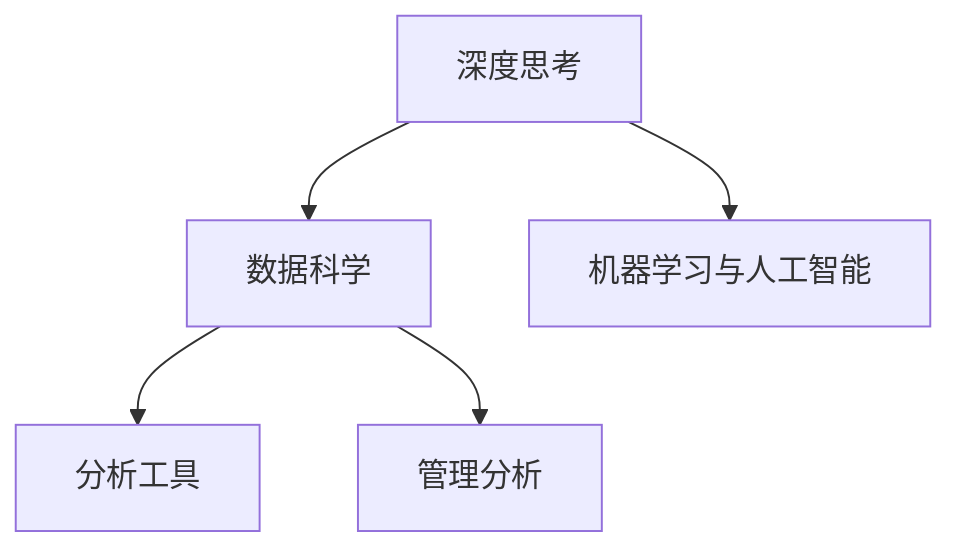

                 

# 深度思考与管理分析能力提升

## 1. 背景介绍

### 1.1 问题由来

在当今快速发展的信息化时代，深度思考与管理分析能力变得愈加重要。无论是高层决策者还是基层执行者，都需要依托科学方法和工具，有效地分析问题、提出解决方案并实施决策。然而，实际的决策场景中，决策者往往面临信息过载、数据质量差、分析工具不完善等问题，这使得深度思考与管理分析能力提升成为一项具有挑战性的任务。

### 1.2 问题核心关键点

提升深度思考与管理分析能力的关键点在于：

- **数据获取与管理**：收集高质量、全面的数据，进行有效的存储和管理。
- **模型选择与构建**：选择合适的模型或算法，并构建适用的数据处理流程。
- **分析与决策**：基于数据和模型进行深入分析，提出合理的决策建议。
- **技术工具与平台**：使用先进的技术工具和平台，提高分析效率和精度。

### 1.3 问题研究意义

深度思考与管理分析能力提升，有助于提高组织决策的科学性和合理性，促进业务创新与发展。具体而言：

1. **减少决策误差**：科学分析能显著降低主观决策的偏差和错误。
2. **优化资源配置**：合理的分析能够更有效地分配和使用资源。
3. **提高决策效率**：借助先进工具和平台，能够快速获取分析结果，加速决策过程。
4. **提升决策透明度**：分析过程可追溯，提高决策的透明度和责任性。

## 2. 核心概念与联系

### 2.1 核心概念概述

- **深度思考**：指通过系统化、逻辑化的方法，对问题进行全面深入的分析，提出创新性的解决方案。
- **数据科学**：通过数据获取、处理、分析和解释，提取有价值信息以支持决策过程。
- **机器学习与人工智能**：利用算法和模型，自动从数据中学习规律，辅助决策过程。
- **分析工具**：用于数据分析、可视化和报告的工具。
- **管理分析**：运用各种分析方法和工具，为企业管理提供数据支持。

这些核心概念之间的联系通过以下Mermaid流程图展示：



## 3. 核心算法原理 & 具体操作步骤

### 3.1 算法原理概述

深度思考与管理分析能力提升主要依赖于数据科学、机器学习及人工智能技术，通过模型构建、数据处理和分析工具等手段，辅助决策者进行深度思考。

以一个简单的企业收入预测为例，流程如下：

1. **数据收集**：获取历史收入数据、市场趋势、行业报告等信息。
2. **数据清洗与处理**：处理缺失值、异常值，进行特征选择与转换。
3. **模型选择与构建**：选择合适的机器学习模型，如回归模型、时间序列模型等，并构建模型。
4. **模型训练与验证**：使用历史数据训练模型，并通过交叉验证等方法验证模型效果。
5. **结果解释与决策**：分析模型结果，结合专家知识，提出决策建议。

### 3.2 算法步骤详解

以线性回归模型为例，详细描述其操作步骤：

**Step 1: 数据准备**

- **数据集划分**：将数据集划分为训练集和测试集，一般采用70%训练集、30%测试集的划分方式。
- **特征选择**：选择对收入预测有影响的关键特征，如销售量、市场份额、季节性因素等。

**Step 2: 模型构建**

- **模型选择**：选择线性回归模型，用于预测收入与特征之间的关系。
- **模型构建**：构建线性回归模型，包括定义模型形式、初始化模型参数等。

**Step 3: 模型训练**

- **损失函数**：定义均方误差作为损失函数。
- **参数优化**：使用梯度下降等方法，优化模型参数。

**Step 4: 模型评估**

- **评估指标**：使用均方误差、决定系数等指标评估模型效果。
- **交叉验证**：通过交叉验证，验证模型泛化能力。

**Step 5: 结果解释**

- **结果可视化**：绘制模型预测与实际收入的对比图。
- **结果解释**：根据模型系数和特征重要度，解释模型预测结果。

### 3.3 算法优缺点

**优点**：

- **准确性高**：基于数据训练的模型能够提供准确的预测结果。
- **效率高**：机器学习算法可以快速处理大量数据，提供实时分析结果。
- **可解释性**：许多模型提供可解释的系数和特征重要性，辅助决策者理解结果。

**缺点**：

- **数据依赖**：模型效果依赖于数据的完整性和质量，数据问题可能导致预测不准确。
- **模型复杂性**：某些模型（如深度学习）复杂度高，不易理解和解释。
- **过拟合风险**：过度拟合训练数据可能降低模型的泛化能力。

### 3.4 算法应用领域

深度思考与管理分析能力提升广泛应用于各类业务场景，包括但不限于：

- **金融分析**：预测股票价格、评估风险等。
- **市场研究**：预测市场需求、分析竞争态势等。
- **运营优化**：优化生产流程、提高供应链效率等。
- **客户分析**：细分客户群体、提升客户满意度等。
- **投资决策**：评估投资机会、制定投资策略等。

## 4. 数学模型和公式 & 详细讲解

### 4.1 数学模型构建

以线性回归模型为例，其数学模型为：

$$ y = \beta_0 + \beta_1 x_1 + \beta_2 x_2 + ... + \beta_n x_n + \epsilon $$

其中，$y$ 为预测值，$\beta_0$ 为截距，$\beta_1, \beta_2, ..., \beta_n$ 为特征系数，$x_1, x_2, ..., x_n$ 为特征值，$\epsilon$ 为随机误差。

### 4.2 公式推导过程

**最小二乘法**：通过最小化均方误差，求解模型参数。公式为：

$$ \hat{\beta} = \arg\min_{\beta} \frac{1}{N} \sum_{i=1}^N (y_i - \beta_0 - \beta_1 x_{1i} - \beta_2 x_{2i} - ... - \beta_n x_{ni})^2 $$

**梯度下降**：通过计算损失函数对参数的梯度，更新参数值。公式为：

$$ \beta_j = \beta_j - \alpha \frac{1}{N} \sum_{i=1}^N \frac{y_i - \beta_0 - \beta_1 x_{1i} - \beta_2 x_{2i} - ... - \beta_n x_{ni}}{x_{ji}} $$

其中 $\alpha$ 为学习率。

### 4.3 案例分析与讲解

假设某电商企业想要预测下季度的销售收入，收集了过去5年的销售数据，数据如下：

| 季度 | 销售量 | 广告投入 | 市场份额 | 竞争对手表现 |
| --- | --- | --- | --- | --- |
| Q1 | 1000 | 500 | 20% | 10% |
| Q2 | 1200 | 600 | 25% | 15% |
| Q3 | 1500 | 700 | 30% | 20% |
| Q4 | 2000 | 800 | 35% | 25% |
| Q5 | 2300 | 900 | 40% | 30% |

首先，我们将数据分为训练集和测试集，各取前4年和后1年的数据。选择销售量和广告投入为特征，市场份额和竞争对手表现为因变量。使用线性回归模型进行预测，步骤如下：

**Step 1: 数据准备**

- **数据清洗**：检查并处理缺失值和异常值。
- **特征选择**：选择销售量和广告投入作为关键特征。

**Step 2: 模型构建**

- **模型选择**：选择线性回归模型。
- **模型构建**：定义模型形式，初始化模型参数。

**Step 3: 模型训练**

- **损失函数**：定义均方误差。
- **参数优化**：使用梯度下降算法优化模型参数。

**Step 4: 模型评估**

- **评估指标**：使用均方误差、决定系数等指标评估模型效果。
- **交叉验证**：通过交叉验证，验证模型泛化能力。

**Step 5: 结果解释**

- **结果可视化**：绘制模型预测与实际收入的对比图。
- **结果解释**：根据模型系数和特征重要度，解释模型预测结果。

根据计算，模型参数 $\beta_0, \beta_1, \beta_2$ 分别为 -4.5, 1.2, 0.1，即每增加一个单位的广告投入，销售量预期增加1.2个单位。

## 5. 项目实践：代码实例和详细解释说明

### 5.1 开发环境搭建

进行深度思考与管理分析能力提升的开发，需要以下开发环境：

1. **编程语言**：Python，使用Pandas、NumPy等库进行数据处理，Scikit-Learn、TensorFlow等库进行模型构建。
2. **数据平台**：Hadoop、Spark等大数据处理平台，用于处理大规模数据。
3. **计算资源**：高性能计算集群，用于模型训练和分析。
4. **可视化工具**：Tableau、Power BI等，用于数据可视化。

### 5.2 源代码详细实现

以下是一个简单的Python代码示例，用于构建并训练线性回归模型，并输出预测结果：

```python
import numpy as np
from sklearn.linear_model import LinearRegression
from sklearn.metrics import mean_squared_error, r2_score
from sklearn.model_selection import train_test_split

# 构建数据集
X = np.array([[1, 2, 3], [4, 5, 6], [7, 8, 9]])
y = np.array([2, 4, 6])
X_train, X_test, y_train, y_test = train_test_split(X, y, test_size=0.2, random_state=42)

# 构建模型
model = LinearRegression()
model.fit(X_train, y_train)

# 预测结果
y_pred = model.predict(X_test)

# 输出结果
print("模型系数：", model.coef_)
print("均方误差：", mean_squared_error(y_test, y_pred))
print("决定系数：", r2_score(y_test, y_pred))
```

### 5.3 代码解读与分析

上述代码实现了一个简单的线性回归模型的构建、训练和预测过程。具体解读如下：

- **数据准备**：使用NumPy创建了一个简单的数据集，包含了两个特征和一个因变量。
- **模型构建**：使用Scikit-Learn库中的LinearRegression模型，定义了模型形式。
- **模型训练**：使用训练数据对模型进行拟合。
- **结果预测**：使用测试数据对模型进行预测。
- **结果评估**：计算预测结果的均方误差和决定系数，评估模型效果。

## 6. 实际应用场景

### 6.1 金融风险管理

金融行业需要实时监控市场风险，预测股票价格波动。深度思考与管理分析能力提升可以帮助金融机构构建先进的风险管理系统，提高风险预测的准确性和及时性。具体应用包括：

- **风险评估**：使用机器学习模型预测不同资产的风险水平。
- **信用评分**：基于客户历史数据，构建评分模型，评估客户信用风险。
- **市场预警**：监控市场动态，预测突发事件对市场的影响。

### 6.2 电商销售预测

电商平台需要预测未来的销售趋势，以便更好地制定库存管理和营销策略。深度思考与管理分析能力提升可以帮助电商平台构建高效准确的销售预测模型，提高库存周转率和营销效果。具体应用包括：

- **库存管理**：根据销售预测，优化库存布局和补货计划。
- **促销活动**：根据销售预测，设计促销活动和优惠方案。
- **市场趋势分析**：分析销售数据，发现市场趋势和消费者偏好。

### 6.3 制造业质量控制

制造业需要实时监控产品质量，预测生产过程中的缺陷。深度思考与管理分析能力提升可以帮助制造企业构建先进的质量控制系统，提高产品质量和生产效率。具体应用包括：

- **缺陷预测**：使用机器学习模型预测生产线上的潜在缺陷。
- **质量优化**：根据预测结果，优化生产参数和工艺流程。
- **异常检测**：监控生产数据，及时发现异常情况并采取措施。

## 7. 工具和资源推荐

### 7.1 学习资源推荐

为帮助读者深入理解深度思考与管理分析能力提升，推荐以下学习资源：

1. **《数据科学导论》**：一本经典的入门教材，涵盖了数据处理、统计分析、机器学习等基本概念和方法。
2. **Coursera上的机器学习课程**：由斯坦福大学教授Andrew Ng主讲，涵盖了机器学习的基本原理和算法。
3. **Kaggle竞赛**：参与各类数据科学竞赛，实战演练提升能力。
4. **GitHub上的开源项目**：如TensorFlow、Scikit-Learn等，学习实际应用案例。
5. **在线课程平台**：如Udacity、edX等，提供系统的学习路径和课程资源。

### 7.2 开发工具推荐

深度思考与管理分析能力提升的开发，推荐以下工具：

1. **编程语言**：Python、R等，是数据分析和机器学习的常用语言。
2. **数据处理库**：Pandas、NumPy等，用于数据清洗、处理和分析。
3. **机器学习库**：Scikit-Learn、TensorFlow、PyTorch等，提供丰富的机器学习算法和工具。
4. **可视化工具**：Tableau、Power BI等，用于数据可视化。
5. **云计算平台**：AWS、Google Cloud等，提供强大的计算资源和云服务。

### 7.3 相关论文推荐

以下几篇论文是深度思考与管理分析能力提升领域的经典之作，值得深入阅读：

1. **《机器学习实战》**：Ian Goodfellow等著，介绍了机器学习的基本概念、算法和实际应用。
2. **《深度学习》**：Ian Goodfellow等著，详细介绍了深度学习的原理、算法和应用。
3. **《数据科学与统计分析》**：David S. Moore等著，涵盖了数据科学的基本原理和方法。
4. **《数据挖掘与统计学习》**：Tibshirani等著，介绍了数据挖掘和统计学习的基本方法和应用。

## 8. 总结：未来发展趋势与挑战

### 8.1 总结

深度思考与管理分析能力提升是一个综合性课题，涉及数据科学、机器学习等多个领域。本文从原理到实践，全面介绍了深度思考与管理分析能力提升的核心概念、算法原理和操作步骤。通过具体案例，展示了如何构建和使用模型，提升了深度思考与管理分析能力。

深度思考与管理分析能力提升的应用领域广泛，涉及金融、电商、制造业等多个行业，具有重要的实际意义。本文总结了其在各领域的应用场景，展示了深度思考与管理分析能力提升的广泛应用前景。

### 8.2 未来发展趋势

未来，深度思考与管理分析能力提升将呈现以下发展趋势：

1. **智能化分析**：结合人工智能技术，如自然语言处理、图像识别等，提供更智能的分析和预测。
2. **自动化决策**：通过自动化流程和智能系统，加速决策过程，提高决策效率。
3. **实时化分析**：实时监控和分析数据，提供及时决策支持。
4. **大数据应用**：处理和分析大规模数据，提供全面深入的分析结果。
5. **多模态融合**：结合视觉、语音、文本等多模态数据，提升分析精度。

### 8.3 面临的挑战

尽管深度思考与管理分析能力提升有着广阔的应用前景，但在实际应用中仍面临诸多挑战：

1. **数据质量问题**：数据获取难度大、质量差，可能导致分析结果不准确。
2. **模型复杂性**：某些复杂模型难以理解和解释，影响决策效果。
3. **资源需求高**：大数据和复杂模型需要高性能计算资源，对硬件和软件提出了高要求。
4. **模型泛化能力**：模型在特定数据集上的表现良好，但泛化到新数据集上时可能表现不佳。
5. **隐私保护**：在数据采集和分析过程中，如何保护用户隐私成为重要问题。

### 8.4 研究展望

未来，深度思考与管理分析能力提升的研究方向包括：

1. **数据质量提升**：采用先进的数据采集和清洗技术，提高数据质量。
2. **模型简化与优化**：研究和开发更加简单、高效的模型和算法。
3. **自动化流程建设**：构建自动化的分析流程，提高分析效率和精度。
4. **多模态融合研究**：深入研究多模态数据的融合与分析方法。
5. **隐私保护技术**：开发隐私保护技术，确保数据分析过程中的数据安全。

深度思考与管理分析能力提升是大数据和人工智能时代的重要技术，具有广泛的应用前景和研究价值。本文通过全面系统的介绍，希望能为读者提供深入理解和实践的基础，助力各行业在数据驱动下取得更大的进步。

## 9. 附录：常见问题与解答

### 9.1 Q1: 深度思考与管理分析能力提升是否适用于所有行业？

A: 深度思考与管理分析能力提升适用于多个行业，但各行业的应用场景和需求有所不同。需根据行业特点，选择合适的分析方法和工具。

### 9.2 Q2: 在实际应用中，如何确保数据质量？

A: 数据质量是深度思考与管理分析能力提升的基础。确保数据质量的方法包括：

- **数据清洗**：去除噪音和异常值，确保数据完整性和一致性。
- **数据验证**：使用多种验证方法，如交叉验证、独立样本验证等，确保数据可靠。
- **数据标注**：确保标注数据的质量和一致性，避免数据偏差。
- **数据监控**：实时监控数据质量，及时发现和处理数据问题。

### 9.3 Q3: 在实际应用中，如何避免过拟合？

A: 避免过拟合的方法包括：

- **数据增强**：通过数据扩充、合成等方法，增加数据量。
- **正则化**：使用L1、L2正则化等方法，防止模型过拟合。
- **模型简化**：使用简单的模型和算法，避免复杂模型导致的过拟合。
- **交叉验证**：使用交叉验证等方法，评估模型泛化能力。
- **模型集成**：使用多个模型集成的方法，降低过拟合风险。

### 9.4 Q4: 在实际应用中，如何提高模型泛化能力？

A: 提高模型泛化能力的方法包括：

- **数据多样性**：使用多样化的数据集，涵盖不同场景和情况。
- **模型验证**：使用独立验证集，评估模型泛化能力。
- **模型简化**：使用简单的模型和算法，避免复杂模型导致的过拟合。
- **正则化**：使用L1、L2正则化等方法，防止模型过拟合。
- **模型集成**：使用多个模型集成的方法，提高泛化能力。

### 9.5 Q5: 在实际应用中，如何确保数据安全？

A: 确保数据安全的方法包括：

- **数据加密**：对数据进行加密处理，防止数据泄露。
- **访问控制**：限制数据的访问权限，确保数据安全。
- **匿名化处理**：对数据进行匿名化处理，保护用户隐私。
- **安全审计**：定期进行安全审计，确保数据安全。

以上是对深度思考与管理分析能力提升的全面介绍，希望能为读者提供深入理解和实践的基础，助力各行业在数据驱动下取得更大的进步。

---

作者：禅与计算机程序设计艺术 / Zen and the Art of Computer Programming

