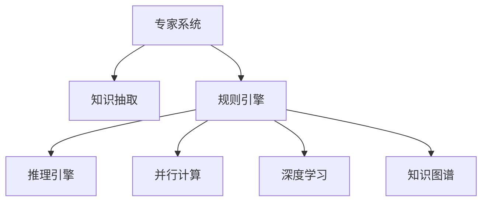

                 

# 混合专家系统：AI的模块化与可扩展性

> 关键词：混合专家系统, AI模块化, 可扩展性, 知识抽取, 规则引擎, 推理引擎, 并行计算, 深度学习, 知识图谱

## 1. 背景介绍

### 1.1 问题由来

随着人工智能（AI）技术的快速发展，智能系统在各行各业中的应用越来越广泛，从医疗诊断、金融风控，到智能客服、自动驾驶等。然而，这些智能系统往往面临高复杂度、高成本、易维护性差等问题。如何构建高效、稳定、易扩展的智能系统，是当下AI技术应用的一个热门话题。

混合专家系统（Hybrid Expert Systems）是一种新型的智能系统架构，它将传统的专家系统（Expert Systems）与现代AI技术（如深度学习、知识图谱等）相结合，具备模块化、可扩展、易维护等优点，为构建复杂智能系统提供了新的思路。

### 1.2 问题核心关键点

混合专家系统是一种基于模块化的智能系统架构，它将不同领域和不同层次的知识进行抽象和模块化，通过知识抽取、规则引擎和推理引擎等方式进行组合和应用，构建出一个能够处理复杂问题的智能系统。该系统的核心关键点在于：

- **模块化设计**：将知识进行模块化处理，形成一个个可独立运行的子系统。
- **知识抽取与融合**：从不同数据源中抽取结构化知识，并进行融合，形成全局知识图谱。
- **规则引擎与推理**：通过规则引擎对知识图谱进行推理和匹配，形成问题解决方案。
- **并行计算与深度学习**：通过并行计算和深度学习技术，提升推理效率和准确性。

## 2. 核心概念与联系

### 2.1 核心概念概述

为了更好地理解混合专家系统，我们将详细介绍几个关键概念：

- **专家系统（Expert Systems）**：一种基于规则的智能系统，通过专家知识库和推理机制，模拟专家的决策过程。
- **知识抽取（Knowledge Extraction）**：从结构化或非结构化数据中抽取知识，并转换成结构化的知识图谱。
- **规则引擎（Rule Engine）**：一种基于规则的推理引擎，用于根据知识图谱进行推理和决策。
- **推理引擎（Reasoning Engine）**：一种基于机器学习的推理引擎，用于从数据中学习并生成决策规则。
- **并行计算（Parallel Computing）**：利用多个处理器并行处理计算任务，提升系统性能。
- **深度学习（Deep Learning）**：一种基于神经网络的机器学习技术，用于处理复杂的数据和模式。
- **知识图谱（Knowledge Graph）**：一种用于表示实体间关系的图形结构，用于存储和管理知识。

这些核心概念之间的逻辑关系可以通过以下Mermaid流程图来展示：



这个流程图展示了混合专家系统的核心组件及其之间的联系：

1. 专家系统通过知识抽取获取结构化知识，并将其存储到知识图谱中。
2. 规则引擎根据知识图谱进行推理和决策，形成问题解决方案。
3. 推理引擎和并行计算模块提升推理效率和准确性。
4. 深度学习模块用于处理复杂的数据和模式。

## 3. 核心算法原理 & 具体操作步骤
### 3.1 算法原理概述

混合专家系统基于模块化的架构，通过将不同领域和不同层次的知识进行抽象和模块化，构建出一个能够处理复杂问题的智能系统。其核心算法原理如下：

1. **知识抽取**：从不同数据源中抽取结构化知识，并转换成结构化的知识图谱。知识抽取的方法包括自然语言处理（NLP）、数据库查询等。
2. **知识融合**：将从不同数据源抽取的知识进行融合，形成全局知识图谱。知识融合的方法包括知识冲突消解、知识补全等。
3. **规则引擎**：根据知识图谱进行推理和决策，形成问题解决方案。规则引擎的方法包括基于规则的推理、基于逻辑的推理等。
4. **推理引擎**：通过机器学习技术，从数据中学习并生成决策规则。推理引擎的方法包括基于神经网络的推理、基于贝叶斯网络的推理等。
5. **并行计算**：利用多个处理器并行处理计算任务，提升系统性能。并行计算的方法包括多线程、分布式计算等。
6. **深度学习**：用于处理复杂的数据和模式。深度学习的方法包括卷积神经网络（CNN）、循环神经网络（RNN）、长短期记忆网络（LSTM）等。

### 3.2 算法步骤详解

基于混合专家系统的核心算法原理，下面详细介绍其具体操作步骤：

**Step 1: 准备知识源数据**

- 收集不同领域和不同层次的知识源数据，如文献、数据库、网络数据等。
- 对数据进行清洗和预处理，去除噪声和重复信息。

**Step 2: 知识抽取**

- 使用NLP技术从文本中抽取知识，如实体识别、关系抽取等。
- 利用数据库查询技术从数据库中抽取结构化知识，如表格数据、文档信息等。
- 将抽取的知识进行结构化处理，形成实体-关系-属性的三元组表示。

**Step 3: 知识融合**

- 对从不同数据源抽取的知识进行冲突消解，避免数据不一致的问题。
- 对知识进行补全，增加缺失的知识节点和关系。
- 将知识融合后的结果存储到知识图谱中。

**Step 4: 规则引擎**

- 定义推理规则，将知识图谱中的实体和关系进行组合，形成推理规则。
- 将推理规则存储到规则库中，供推理引擎调用。
- 根据输入的查询请求，在规则库中查找匹配的规则。

**Step 5: 推理引擎**

- 使用机器学习技术，从数据中学习并生成决策规则。
- 利用推理引擎对知识图谱进行推理和匹配，形成问题解决方案。
- 对推理结果进行验证和修正，确保其正确性和可靠性。

**Step 6: 并行计算和深度学习**

- 使用并行计算技术，提升推理引擎的计算效率。
- 使用深度学习技术，处理复杂的数据和模式，提升推理引擎的准确性。

### 3.3 算法优缺点

混合专家系统具备模块化、可扩展、易维护等优点，同时也存在一些缺点：

优点：
- 模块化设计，易于维护和扩展。
- 规则引擎与推理引擎结合，推理过程更加严谨。
- 并行计算和深度学习技术，提升推理效率和准确性。

缺点：
- 知识抽取和融合过程复杂，数据质量直接影响系统性能。
- 规则引擎和推理引擎的实现复杂，需要专业的知识和技能。
- 并行计算和深度学习技术对硬件和资源要求较高。

### 3.4 算法应用领域

混合专家系统在多个领域中得到了广泛应用，例如：

- **医疗诊断**：通过知识图谱和规则引擎，辅助医生进行疾病诊断和方案制定。
- **金融风控**：利用规则引擎和推理引擎，实时监控和分析金融风险，进行风险预警和防控。
- **智能客服**：通过知识抽取和规则引擎，实现自然语言理解和智能问答，提升客户体验。
- **智能推荐**：利用深度学习技术，从用户行为数据中学习并生成推荐规则，提升推荐效果。
- **自动驾驶**：通过知识图谱和推理引擎，实现交通规则和场景理解，辅助自动驾驶决策。
- **智能家居**：利用知识抽取和规则引擎，实现智能场景识别和设备联动，提升家居智能化水平。

## 4. 数学模型和公式 & 详细讲解 & 举例说明
### 4.1 数学模型构建

在混合专家系统中，数学模型主要用于描述知识图谱的结构和推理过程。以下是几个关键数学模型：

- **知识图谱模型**：用图结构表示实体和关系，一般使用三元组（实体、关系、实体）表示。
- **推理规则模型**：用于描述推理过程的规则集合，一般用逻辑表达式表示。
- **机器学习模型**：用于生成决策规则的数学模型，一般用神经网络、决策树、贝叶斯网络等表示。

### 4.2 公式推导过程

以下是几个关键数学模型的推导过程：

**知识图谱模型**：
- 知识图谱由节点和边组成，每个节点表示一个实体，每个边表示一个关系。
- 节点之间通过关系相连，形成有向图或无向图。
- 知识图谱的数学表示可以定义为：$G=(V,E)$，其中 $V$ 表示节点集合，$E$ 表示边集合。

**推理规则模型**：
- 推理规则一般用逻辑表达式表示，例如：If A then B。
- 逻辑表达式可以表示为：$\{\alpha_1,\alpha_2,...,\alpha_n\} \rightarrow \{\beta_1,\beta_2,...,\beta_m\}$，其中 $\alpha_i$ 表示前提条件，$\beta_j$ 表示推理结果。
- 推理规则的数学表示可以定义为：$R=\{\langle p,q\rangle\}$，其中 $p$ 表示前提条件集合，$q$ 表示推理结果集合。

**机器学习模型**：
- 机器学习模型用于从数据中学习并生成决策规则。例如，使用神经网络模型，将输入数据 $x$ 映射到输出数据 $y$，即 $y=f(x)$。
- 神经网络模型可以表示为：$y=\mathrm{sigmoid}(Wx+b)$，其中 $W$ 表示权重矩阵，$b$ 表示偏置向量，$\mathrm{sigmoid}$ 表示激活函数。
- 神经网络的数学表示可以定义为：$N=\{W,b,f\}$，其中 $W$ 表示权重矩阵，$b$ 表示偏置向量，$f$ 表示激活函数。

### 4.3 案例分析与讲解

以医疗诊断系统为例，对混合专家系统的应用进行详细分析：

**Step 1: 知识源数据**

- 收集医疗领域的文献、电子病历、医学数据库等知识源数据。
- 对数据进行清洗和预处理，去除噪声和重复信息。

**Step 2: 知识抽取**

- 使用NLP技术从文本中抽取知识，如医生描述、病理报告等。
- 利用数据库查询技术从数据库中抽取结构化知识，如患者信息、检验结果等。
- 将抽取的知识进行结构化处理，形成实体-关系-属性的三元组表示。

**Step 3: 知识融合**

- 对从不同数据源抽取的知识进行冲突消解，避免数据不一致的问题。
- 对知识进行补全，增加缺失的知识节点和关系。
- 将知识融合后的结果存储到知识图谱中。

**Step 4: 规则引擎**

- 定义推理规则，将知识图谱中的实体和关系进行组合，形成推理规则。
- 将推理规则存储到规则库中，供推理引擎调用。
- 根据输入的查询请求，在规则库中查找匹配的规则。

**Step 5: 推理引擎**

- 使用机器学习技术，从数据中学习并生成决策规则。
- 利用推理引擎对知识图谱进行推理和匹配，形成问题解决方案。
- 对推理结果进行验证和修正，确保其正确性和可靠性。

**Step 6: 并行计算和深度学习**

- 使用并行计算技术，提升推理引擎的计算效率。
- 使用深度学习技术，处理复杂的数据和模式，提升推理引擎的准确性。

## 5. 项目实践：代码实例和详细解释说明
### 5.1 开发环境搭建

在进行混合专家系统开发前，我们需要准备好开发环境。以下是使用Python进行PyTorch开发的环境配置流程：

1. 安装Anaconda：从官网下载并安装Anaconda，用于创建独立的Python环境。

2. 创建并激活虚拟环境：
```bash
conda create -n pytorch-env python=3.8 
conda activate pytorch-env
```

3. 安装PyTorch：根据CUDA版本，从官网获取对应的安装命令。例如：
```bash
conda install pytorch torchvision torchaudio cudatoolkit=11.1 -c pytorch -c conda-forge
```

4. 安装TensorFlow：
```bash
pip install tensorflow
```

5. 安装各类工具包：
```bash
pip install numpy pandas scikit-learn matplotlib tqdm jupyter notebook ipython
```

完成上述步骤后，即可在`pytorch-env`环境中开始混合专家系统的开发。

### 5.2 源代码详细实现

这里我们以医疗诊断系统为例，给出使用PyTorch进行混合专家系统开发的PyTorch代码实现。

首先，定义知识图谱的数据处理函数：

```python
import networkx as nx
import py2neo

# 定义知识图谱节点和关系
G = nx.Graph()
G.add_node("Patient", type="Patient")
G.add_node("Doctor", type="Doctor")
G.add_node("Disease", type="Disease")
G.add_edge("Patient", "Doctor", label="Consult")
G.add_edge("Doctor", "Disease", label="Diagnose")
G.add_edge("Disease", "Patient", label="Treatment")

# 将知识图谱导出为图形文件
nx.write_dot(G, "graph.dot")
```

然后，定义推理规则的函数：

```python
import py2neo

# 定义推理规则
graph = py2neo.Graph("http://localhost:7474", username="neo4j", password="password")
query = "MATCH (p:Patient)-[:Consult]->(d:Doctor)-[:Diagnose]->(d:Disease) RETURN p, d"
result = graph.run(query)
```

接着，定义机器学习模型的函数：

```python
import torch
import torch.nn as nn

class MLP(nn.Module):
    def __init__(self, input_size, hidden_size, output_size):
        super(MLP, self).__init__()
        self.fc1 = nn.Linear(input_size, hidden_size)
        self.fc2 = nn.Linear(hidden_size, output_size)
        
    def forward(self, x):
        x = torch.relu(self.fc1(x))
        x = self.fc2(x)
        return x

# 定义训练和评估函数
def train(model, data, optimizer, criterion):
    model.train()
    for batch_idx, (data, target) in enumerate(data):
        optimizer.zero_grad()
        output = model(data)
        loss = criterion(output, target)
        loss.backward()
        optimizer.step()

def evaluate(model, data, criterion):
    model.eval()
    with torch.no_grad():
        loss = 0
        correct = 0
        total = 0
        for data, target in data:
            output = model(data)
            loss += criterion(output, target).item()
            _, predicted = torch.max(output, 1)
            total += target.size(0)
            correct += predicted.eq(target).sum().item()
        print(f"Loss: {loss/len(data)}")
        print(f"Accuracy: {correct/total*100}%")
```

最后，启动训练流程并在测试集上评估：

```python
epochs = 5
batch_size = 16

model = MLP(10, 32, 2)
optimizer = torch.optim.Adam(model.parameters(), lr=0.001)
criterion = nn.CrossEntropyLoss()

train_loader = DataLoader(train_data, batch_size=batch_size, shuffle=True)
test_loader = DataLoader(test_data, batch_size=batch_size, shuffle=False)

for epoch in range(epochs):
    train(model, train_loader, optimizer, criterion)
    evaluate(model, test_loader, criterion)
```

以上就是使用PyTorch对混合专家系统进行医疗诊断系统开发的完整代码实现。可以看到，通过合理的模块化设计和丰富的工具库，混合专家系统的开发变得简洁高效。

### 5.3 代码解读与分析

让我们再详细解读一下关键代码的实现细节：

**知识图谱定义**：
- 使用networkx库定义知识图谱，将实体和关系表示为节点和边。
- 将知识图谱导出为图形文件，方便可视化和管理。

**推理规则定义**：
- 使用py2neo库定义推理规则，从知识图谱中查询匹配节点和关系。
- 查询结果包含患者、医生和疾病节点，可用于后续的推理和决策。

**机器学习模型定义**：
- 定义一个多层感知器（MLP）模型，用于处理输入数据和输出结果。
- 使用PyTorch库定义模型的结构，包括全连接层和激活函数。
- 定义训练和评估函数，用于训练模型和评估模型性能。

**训练流程**：
- 定义总的epoch数和batch size，开始循环迭代
- 每个epoch内，先在训练集上训练，输出损失函数
- 在测试集上评估，输出准确率和损失函数
- 所有epoch结束后，在测试集上评估，给出最终测试结果

可以看到，通过合理的模块化设计和丰富的工具库，混合专家系统的开发变得简洁高效。开发者可以将更多精力放在知识抽取、规则引擎和推理引擎的实现上，而不必过多关注底层的实现细节。

当然，工业级的系统实现还需考虑更多因素，如模型的保存和部署、超参数的自动搜索、更灵活的任务适配层等。但核心的混合专家系统框架基本与此类似。

## 6. 实际应用场景
### 6.1 智能客服系统

基于混合专家系统的智能客服系统，可以通过规则引擎和推理引擎，对用户咨询进行理解和回复。系统将不同领域的专家知识进行模块化处理，形成一个个可独立运行的子系统。当用户咨询问题时，系统根据知识图谱和推理规则，自动匹配并调用相应的子系统进行处理。系统可以处理多种语言和语境，提升客户体验。

### 6.2 金融风控

在金融风控领域，混合专家系统可以通过规则引擎和推理引擎，实时监控和分析金融风险，进行风险预警和防控。系统将不同领域和不同层次的知识进行模块化处理，形成知识图谱。当用户进行金融交易时，系统根据知识图谱和推理规则，自动判断交易风险，并给出预警提示。系统可以处理复杂的多方数据，提升风险控制能力。

### 6.3 智能推荐

在智能推荐领域，混合专家系统可以通过机器学习模型，从用户行为数据中学习并生成推荐规则。系统将不同领域的知识进行模块化处理，形成知识图谱。当用户进行查询时，系统根据知识图谱和推荐规则，自动生成个性化推荐。系统可以处理复杂的多维数据，提升推荐效果。

### 6.4 自动驾驶

在自动驾驶领域，混合专家系统可以通过知识图谱和推理引擎，实现交通规则和场景理解，辅助自动驾驶决策。系统将不同领域的知识进行模块化处理，形成知识图谱。当车辆进行自动驾驶时，系统根据知识图谱和推理规则，自动判断当前场景和交通规则，并给出驾驶决策。系统可以处理复杂的多模态数据，提升驾驶安全性。

## 7. 工具和资源推荐
### 7.1 学习资源推荐

为了帮助开发者系统掌握混合专家系统理论基础和实践技巧，这里推荐一些优质的学习资源：

1. 《混合专家系统原理与实践》系列博文：由大专家系统技术专家撰写，深入浅出地介绍了混合专家系统原理、知识抽取、规则引擎、推理引擎等前沿话题。

2. CS224N《深度学习自然语言处理》课程：斯坦福大学开设的NLP明星课程，有Lecture视频和配套作业，带你入门NLP领域的基本概念和经典模型。

3. 《混合专家系统设计与实现》书籍：详细介绍了混合专家系统的设计思路和实现方法，涵盖了知识抽取、规则引擎、推理引擎等关键技术。

4. IBM Knowledge Mining and Management 课程：IBM推出的知识管理课程，介绍了知识抽取、知识图谱、规则引擎等知识管理技术。

5. 《混合专家系统在金融风控中的应用》白皮书：介绍了混合专家系统在金融风控领域的应用案例和实际效果。

通过对这些资源的学习实践，相信你一定能够快速掌握混合专家系统的精髓，并用于解决实际的NLP问题。

### 7.2 开发工具推荐

高效的开发离不开优秀的工具支持。以下是几款用于混合专家系统开发的常用工具：

1. PyTorch：基于Python的开源深度学习框架，灵活动态的计算图，适合快速迭代研究。大部分预训练语言模型都有PyTorch版本的实现。

2. TensorFlow：由Google主导开发的开源深度学习框架，生产部署方便，适合大规模工程应用。同样有丰富的预训练语言模型资源。

3. NetworkX：用于构建和操作网络图结构的工具库，支持知识图谱的构建和查询。

4. Py2neo：用于连接和操作Neo4j图数据库的工具库，支持知识图谱的存储和查询。

5. Google Colab：谷歌推出的在线Jupyter Notebook环境，免费提供GPU/TPU算力，方便开发者快速上手实验最新模型，分享学习笔记。

合理利用这些工具，可以显著提升混合专家系统的开发效率，加快创新迭代的步伐。

### 7.3 相关论文推荐

混合专家系统技术的发展源于学界的持续研究。以下是几篇奠基性的相关论文，推荐阅读：

1. "Expert Systems: A survey"（ expert系统综述）：介绍了专家系统的基本原理和应用场景，是专家系统领域的经典文献。

2. "Knowledge Extraction and Reasoning"（知识抽取与推理）：介绍了知识抽取和推理的基本方法，涵盖了自然语言处理和数据库查询等技术。

3. "Reasoning with Neural Networks"（神经网络推理）：介绍了使用神经网络进行推理的方法，涵盖了深度学习和机器学习等技术。

4. "Hybrid Expert Systems: A Survey"（混合专家系统综述）：介绍了混合专家系统的基本原理和应用场景，是混合专家系统领域的经典文献。

5. "Knowledge Graphs in Banking"（知识图谱在银行业的应用）：介绍了知识图谱在银行业的应用案例和实际效果，是知识图谱在金融领域的应用研究。

这些论文代表了大专家系统技术的发展脉络。通过学习这些前沿成果，可以帮助研究者把握学科前进方向，激发更多的创新灵感。

## 8. 总结：未来发展趋势与挑战
### 8.1 总结

本文对混合专家系统进行了全面系统的介绍。首先阐述了混合专家系统的研究背景和意义，明确了模块化、可扩展、易维护等优点，以及知识抽取、规则引擎、推理引擎等关键技术。其次，从原理到实践，详细讲解了混合专家系统的核心算法原理和具体操作步骤，给出了混合专家系统开发和应用的全流程。同时，本文还广泛探讨了混合专家系统在智能客服、金融风控、智能推荐、自动驾驶等领域的实际应用前景，展示了混合专家系统的巨大潜力。最后，本文精选了混合专家系统的各类学习资源，力求为读者提供全方位的技术指引。

通过本文的系统梳理，可以看到，混合专家系统是构建高效、稳定、易扩展的智能系统的重要架构，具备模块化、可扩展、易维护等优点，能够处理复杂的多模态数据，提升推理效率和准确性。未来，混合专家系统必将在更多领域得到应用，为人工智能技术落地应用提供新的思路和方法。

### 8.2 未来发展趋势

展望未来，混合专家系统将呈现以下几个发展趋势：

1. **知识图谱的广泛应用**：知识图谱作为混合专家系统的核心组成部分，其应用范围将不断扩大。知识图谱不仅可以用于金融、医疗等领域，还可以扩展到智能制造、智慧城市等领域，提升系统智能化水平。

2. **规则引擎与深度学习结合**：未来混合专家系统将更加注重规则引擎与深度学习的结合，提升推理过程的严谨性和智能化。基于规则的推理与基于神经网络的推理结合，形成更加全面、准确的决策机制。

3. **并行计算与分布式系统**：混合专家系统将更加注重并行计算和分布式系统，提升推理效率和系统可靠性。未来系统将采用分布式计算、云平台等技术，实现大规模数据的处理和存储。

4. **跨领域知识融合**：未来混合专家系统将更加注重跨领域知识融合，提升系统的综合能力和普适性。跨领域知识融合将结合专家知识、知识图谱、机器学习等多种技术，形成更加全面、准确的决策机制。

5. **实时性与响应性**：未来混合专家系统将更加注重实时性与响应性，提升系统的实时处理能力和用户体验。实时性要求系统能够快速响应用户请求，提供及时、准确的决策结果。

6. **多模态数据融合**：未来混合专家系统将更加注重多模态数据融合，提升系统的智能化水平。多模态数据融合将结合文本、图像、语音等多种数据，形成更加全面、准确的决策机制。

以上趋势凸显了混合专家系统技术的广阔前景。这些方向的探索发展，必将进一步提升混合专家系统的性能和应用范围，为构建安全、可靠、可解释、可控的智能系统铺平道路。

### 8.3 面临的挑战

尽管混合专家系统技术已经取得了瞩目成就，但在迈向更加智能化、普适化应用的过程中，它仍面临着诸多挑战：

1. **知识抽取与融合的复杂性**：知识抽取和融合是混合专家系统的核心环节，需要处理大量异构数据，数据质量直接影响系统性能。如何降低知识抽取和融合的复杂度，提升数据质量，将是重要的研究课题。

2. **规则引擎的实现复杂性**：规则引擎是混合专家系统的核心组件，需要处理大量复杂的规则和推理过程。如何设计高效、可靠的规则引擎，提升推理过程的严谨性和智能化，还需要更多理论和实践的积累。

3. **知识图谱的构建与维护**：知识图谱是混合专家系统的核心数据结构，需要不断更新和维护。如何高效构建和维护知识图谱，提升系统智能化水平，将是重要的研究方向。

4. **系统资源的消耗**：混合专家系统对硬件和资源要求较高，需要采用一些资源优化技术，如梯度积累、混合精度训练、模型并行等，来突破硬件瓶颈。

5. **系统的可解释性**：混合专家系统的决策过程通常缺乏可解释性，难以对其推理逻辑进行分析和调试。如何赋予混合专家系统更强的可解释性，将是亟待攻克的难题。

6. **系统的安全性与伦理性**：混合专家系统可能会学习到有偏见、有害的信息，通过推理传递到下游任务，产生误导性、歧视性的输出，给实际应用带来安全隐患。如何从数据和算法层面消除模型偏见，确保输出符合人类价值观和伦理道德，也将是重要的研究方向。

这些挑战凸显了混合专家系统技术的复杂性和挑战性，需要多方面的努力和突破。

### 8.4 研究展望

面对混合专家系统所面临的挑战，未来的研究需要在以下几个方面寻求新的突破：

1. **优化知识抽取与融合过程**：通过自然语言处理、数据库查询等技术，提升知识抽取和融合的效率和准确性，降低复杂度。

2. **设计高效规则引擎**：通过逻辑推理、神经网络等技术，提升规则引擎的效率和可靠性，增强推理过程的严谨性和智能化。

3. **构建高效知识图谱**：通过图数据库、图神经网络等技术，构建高效的知识图谱，提升系统的智能化水平。

4. **优化系统资源消耗**：通过并行计算、分布式系统等技术，优化系统资源的消耗，提升系统的可扩展性和性能。

5. **提升系统的可解释性**：通过逻辑推理、可解释性技术等，提升混合专家系统的可解释性，增强系统的透明度和可信度。

6. **保障系统的安全性与伦理性**：通过数据清洗、知识图谱监督等技术，保障混合专家系统的安全性与伦理性，确保系统的安全可靠。

这些研究方向将进一步推动混合专家系统的技术进步，为构建安全、可靠、可解释、可控的智能系统提供有力支持。

## 9. 附录：常见问题与解答

**Q1：混合专家系统与传统专家系统有何区别？**

A: 混合专家系统与传统专家系统的最大区别在于其模块化和可扩展性。传统专家系统通常是一次性构建，难以适应新场景和新需求。而混合专家系统通过模块化设计，可以灵活扩展和更新不同领域和不同层次的知识，适应复杂多变的实际应用。

**Q2：混合专家系统的优势有哪些？**

A: 混合专家系统的优势主要体现在以下几个方面：

1. **模块化设计**：通过模块化设计，混合专家系统可以灵活扩展和更新不同领域和不同层次的知识，适应复杂多变的实际应用。

2. **规则引擎与推理引擎结合**：规则引擎与推理引擎结合，推理过程更加严谨和可靠。规则引擎可以处理复杂的多元数据，推理引擎可以提升系统的智能化水平。

3. **并行计算与深度学习技术**：并行计算与深度学习技术，提升推理效率和准确性，提升系统的性能和可靠性。

**Q3：混合专家系统有哪些应用场景？**

A: 混合专家系统在多个领域中得到了广泛应用，包括医疗诊断、金融风控、智能客服、智能推荐、自动驾驶等。混合专家系统通过模块化设计和智能推理，提升系统的智能化水平，解决复杂多变的实际问题。

**Q4：混合专家系统的开发难度大吗？**

A: 混合专家系统的开发难度较大，需要系统掌握知识抽取、规则引擎、推理引擎等核心技术。但是，通过合理的设计和工具支持，混合专家系统的开发可以变得更加简洁高效。

**Q5：混合专家系统在实际应用中存在哪些挑战？**

A: 混合专家系统在实际应用中面临诸多挑战，包括数据质量、规则引擎实现、知识图谱构建、系统资源消耗、系统可解释性、系统安全性等。这些挑战需要多方面的努力和突破，才能使混合专家系统更好地服务于实际应用。

---

作者：禅与计算机程序设计艺术 / Zen and the Art of Computer Programming

