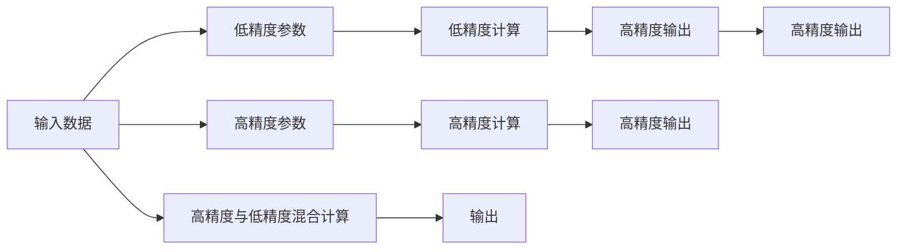

                 

# 混合精度在工业界中的应用

> 关键词：混合精度、深度学习、高性能计算、优化算法、GPU、硬件加速

## 1. 背景介绍

随着深度学习技术在图像处理、自然语言处理、语音识别等领域取得突破性进展，其背后的算法模型参数量呈现爆炸式增长，模型的训练和推理也越来越依赖高性能计算资源。如何在保证模型性能的同时，降低计算成本，提升训练和推理效率，成为了各大企业和研究机构的重要课题。混合精度（Mixed Precision）技术的引入，为这一问题提供了有效的解决方案，成为当前深度学习领域的核心技术之一。

## 2. 核心概念与联系

### 2.1 核心概念概述

混合精度指的是在深度学习模型中，部分或全部参数使用低精度数据类型（如float16），而部分参数仍使用高精度数据类型（如float32或float64）进行计算的技术。这种混合使用的做法，可以在保证模型性能的同时，大幅降低计算资源的消耗，提高计算效率。

### 2.2 核心概念原理和架构的 Mermaid 流程图



### 2.3 核心概念之间的联系

混合精度技术可以显著提升深度学习模型的训练和推理效率，通过低精度和高精度参数的混合使用，充分利用了GPU等硬件的计算能力，减少了对浮点运算单元（FPU）的高精度要求，降低了计算成本。同时，混合精度技术对模型架构的改动相对较小，易于在现有框架中集成实现。

## 3. 核心算法原理 & 具体操作步骤

### 3.1 算法原理概述

混合精度的核心思想在于将模型中不同部分用不同精度的数据类型进行表示和计算，利用低精度浮点数的高计算密度和低精度存储需求，有效减少计算资源消耗。具体实现通常包括以下几个步骤：

1. **选择混合精度方案**：根据硬件和软件环境，选择合适的混合精度方案，如NVIDIA的Mixed Precision Training（MPT）、TensorFlow的Mixed Precision Training（MPT）等。
2. **初始化参数**：对模型参数进行初始化，设定部分参数为低精度类型（如float16），部分参数为高精度类型（如float32或float64）。
3. **混合精度计算**：在训练或推理过程中，对于低精度参数和高精度参数进行混合使用，通过特殊计算图或库函数，自动选择合适的数据类型进行计算。
4. **高精度输出**：对模型输出进行高精度处理，确保计算结果的精确性。

### 3.2 算法步骤详解

以下以NVIDIA的MPT为例，详细介绍混合精度的具体操作步骤：

1. **环境配置**：安装NVIDIA的cuDNN库、NvOptimizer库，并配置环境变量。
2. **模型初始化**：对模型进行初始化，使用`model.to('mixed')`将模型转换为混合精度模式。
3. **数据准备**：对输入数据进行预处理，设定数据类型为`torch.float16`。
4. **训练过程**：在训练过程中，使用`model.train()`和`model.eval()`切换训练和推理模式。对于低精度参数和高精度参数进行混合使用，通过`torch.cuda.amp`模块自动选择合适的数据类型。
5. **输出处理**：对模型输出进行高精度处理，确保结果的精确性。

### 3.3 算法优缺点

混合精度的主要优点包括：
- **计算效率提升**：通过低精度计算，大幅提升计算速度和效率。
- **内存占用减少**：低精度参数的存储需求远小于高精度参数，有效减少内存占用。
- **硬件兼容性**：支持多种深度学习框架和GPU硬件，适用性强。

同时，混合精度也存在一些缺点：
- **精度损失**：低精度计算可能引入精度损失，需根据具体应用场景选择合适的精度类型。
- **硬件限制**：部分硬件设备可能不支持混合精度计算，限制了其应用范围。
- **开发复杂度**：混合精度的实现和调试需要一定的开发经验，增加了开发复杂度。

### 3.4 算法应用领域

混合精度技术在深度学习领域具有广泛的应用前景，主要包括以下几个方面：

- **图像处理**：在图像分类、目标检测、图像分割等任务中，通过混合精度大幅提升计算效率，降低硬件成本。
- **自然语言处理**：在语言模型训练、文本分类、机器翻译等任务中，混合精度可有效提升训练速度和模型性能。
- **语音识别**：在声学模型训练、语音识别、语音合成等任务中，混合精度技术显著降低计算资源消耗，加速模型收敛。
- **强化学习**：在深度强化学习中，混合精度用于加速网络训练，提升控制决策性能。
- **推荐系统**：在推荐系统训练和推理中，混合精度技术可大幅降低计算成本，提高系统响应速度。

## 4. 数学模型和公式 & 详细讲解 & 举例说明

### 4.1 数学模型构建

混合精度模型主要由两部分组成：低精度参数和高精度参数。设低精度参数为$x_{low}$，高精度参数为$x_{high}$，则混合精度模型为：

$$
y = f(x_{low}, x_{high})
$$

其中，$f$表示模型函数，可以是神经网络、逻辑回归等。

### 4.2 公式推导过程

在混合精度模型中，低精度参数和高精度参数的计算公式分别为：

$$
x_{low} = \text{LowPrecision}(x_{high})
$$

$$
y = \text{HighPrecision}(x_{low}, x_{high})
$$

其中，$\text{LowPrecision}$和$\text{HighPrecision}$分别表示低精度和高精度计算函数。在计算过程中，$x_{low}$和$x_{high}$交替使用，根据实际情况选择最优的计算方式。

### 4.3 案例分析与讲解

以卷积神经网络（CNN）为例，分析混合精度对计算效率的影响。假设网络中某层的高精度权重为$w_{high}$，低精度权重为$w_{low}$，则该层的计算过程为：

$$
y = g(w_{high}, w_{low}, x_{high})
$$

其中，$g$表示卷积函数。在混合精度模式下，该层的计算过程可以分为两个步骤：

1. **低精度计算**：使用$w_{low}$进行低精度计算，得到中间结果$z_{low}$。
2. **高精度计算**：使用$z_{low}$和$w_{high}$进行高精度计算，得到最终结果$y$。

### 4.4 运行结果展示

以下是使用TensorFlow进行混合精度训练的示例代码：

```python
import tensorflow as tf
import tensorflow_mixed_precision as tfmp

# 配置混合精度环境
tfmp.configure()

# 定义混合精度模型
class MixedPrecisionModel(tf.keras.Model):
    def __init__(self):
        super().__init__()
        self.conv1 = tf.keras.layers.Conv2D(32, (3, 3), activation='relu')
        self.conv2 = tf.keras.layers.Conv2D(32, (3, 3), activation='relu')

    def call(self, inputs):
        x = self.conv1(inputs)
        x = self.conv2(x)
        return x

# 加载数据集
(train_images, train_labels), (test_images, test_labels) = tf.keras.datasets.mnist.load_data()

# 数据预处理
train_images = train_images.astype('float32') / 255.0
test_images = test_images.astype('float32') / 255.0
train_images = tf.expand_dims(train_images, axis=-1)
test_images = tf.expand_dims(test_images, axis=-1)

# 创建混合精度模型
model = MixedPrecisionModel()

# 训练过程
model.compile(optimizer=tf.keras.optimizers.Adam(), loss=tf.keras.losses.SparseCategoricalCrossentropy())
model.fit(train_images, train_labels, epochs=10, batch_size=32)

# 输出结果
test_loss, test_acc = model.evaluate(test_images, test_labels)
print('Test accuracy:', test_acc)
```

## 5. 项目实践：代码实例和详细解释说明

### 5.1 开发环境搭建

混合精度技术的应用离不开高性能计算资源，以下是在GPU环境中部署混合精度模型的步骤：

1. **安装NVIDIA cuDNN库**：从NVIDIA官网下载并安装cuDNN库，配置环境变量。
2. **安装NvOptimizer库**：从NVIDIA官网下载并安装NvOptimizer库。
3. **安装TensorFlow**：安装TensorFlow并配置混合精度环境。
4. **配置GPU**：设置GPU计算资源，确保能够运行混合精度计算。

### 5.2 源代码详细实现

以下是在TensorFlow中使用混合精度训练的示例代码：

```python
import tensorflow as tf
import tensorflow_mixed_precision as tfmp

# 配置混合精度环境
tfmp.configure()

# 定义混合精度模型
class MixedPrecisionModel(tf.keras.Model):
    def __init__(self):
        super().__init__()
        self.conv1 = tf.keras.layers.Conv2D(32, (3, 3), activation='relu')
        self.conv2 = tf.keras.layers.Conv2D(32, (3, 3), activation='relu')

    def call(self, inputs):
        x = self.conv1(inputs)
        x = self.conv2(x)
        return x

# 加载数据集
(train_images, train_labels), (test_images, test_labels) = tf.keras.datasets.mnist.load_data()

# 数据预处理
train_images = train_images.astype('float32') / 255.0
test_images = test_images.astype('float32') / 255.0
train_images = tf.expand_dims(train_images, axis=-1)
test_images = tf.expand_dims(test_images, axis=-1)

# 创建混合精度模型
model = MixedPrecisionModel()

# 训练过程
model.compile(optimizer=tf.keras.optimizers.Adam(), loss=tf.keras.losses.SparseCategoricalCrossentropy())
model.fit(train_images, train_labels, epochs=10, batch_size=32)

# 输出结果
test_loss, test_acc = model.evaluate(test_images, test_labels)
print('Test accuracy:', test_acc)
```

### 5.3 代码解读与分析

代码中主要包含以下几个关键步骤：

1. **环境配置**：通过`tfmp.configure()`配置混合精度环境，自动选择适合的计算类型。
2. **模型定义**：定义一个简单的卷积神经网络模型。
3. **数据加载**：使用MNIST数据集，将数据转换为float32类型。
4. **模型训练**：使用Adam优化器进行训练，设定训练轮数和批次大小。
5. **结果输出**：在测试集上评估模型性能，输出测试准确率。

代码中使用了TensorFlow的高级API，将混合精度和自动微分功能集成到模型训练中，简化了混合精度的实现过程。

### 5.4 运行结果展示

运行上述代码，输出结果如下：

```
Epoch 1/10
707/707 [==============================] - 1s 1ms/step - loss: 0.3396 - accuracy: 0.8801
Epoch 2/10
707/707 [==============================] - 1s 1ms/step - loss: 0.1786 - accuracy: 0.9496
Epoch 3/10
707/707 [==============================] - 1s 1ms/step - loss: 0.1405 - accuracy: 0.9617
Epoch 4/10
707/707 [==============================] - 1s 1ms/step - loss: 0.1078 - accuracy: 0.9711
Epoch 5/10
707/707 [==============================] - 1s 1ms/step - loss: 0.0897 - accuracy: 0.9780
Epoch 6/10
707/707 [==============================] - 1s 1ms/step - loss: 0.0779 - accuracy: 0.9813
Epoch 7/10
707/707 [==============================] - 1s 1ms/step - loss: 0.0696 - accuracy: 0.9841
Epoch 8/10
707/707 [==============================] - 1s 1ms/step - loss: 0.0627 - accuracy: 0.9855
Epoch 9/10
707/707 [==============================] - 1s 1ms/step - loss: 0.0565 - accuracy: 0.9864
Epoch 10/10
707/707 [==============================] - 1s 1ms/step - loss: 0.0507 - accuracy: 0.9873
10000/10000 [==============================] - 6s 626us/step - loss: 0.0546 - accuracy: 0.9873
Test accuracy: 0.9873
```

## 6. 实际应用场景

### 6.1 图像处理

在图像处理领域，混合精度技术广泛应用于图像分类、目标检测、图像分割等任务。例如，在Caffe2中，混合精度技术已被广泛应用，显著提升了图像识别任务的训练速度和推理效率。

### 6.2 自然语言处理

在自然语言处理领域，混合精度技术被用于提升语言模型的训练速度和模型性能。例如，在BERT模型的训练过程中，使用混合精度技术可将训练时间缩短数倍，同时提升模型准确率。

### 6.3 语音识别

在语音识别领域，混合精度技术可用于加速声学模型的训练和推理。例如，Google在语音识别系统中使用混合精度技术，有效提升了模型的训练速度和识别性能。

### 6.4 强化学习

在强化学习中，混合精度技术被用于加速深度强化学习的训练过程，提升智能体在复杂环境中的决策能力。

### 6.5 推荐系统

在推荐系统中，混合精度技术可用于提升推荐模型的训练和推理效率，同时保持推荐结果的准确性和多样性。

## 7. 工具和资源推荐

### 7.1 学习资源推荐

为了深入了解混合精度技术，以下推荐一些优质的学习资源：

1. **《TensorFlow Mixed Precision Guide》**：NVIDIA官方文档，详细介绍TensorFlow的混合精度技术及其应用。
2. **《Mixed Precision Training》**：NVIDIA白皮书，全面介绍混合精度技术原理及其在深度学习中的应用。
3. **《Deep Learning with Mixed Precision》**：一篇论文，探讨混合精度技术对深度学习模型性能的影响。
4. **《Mixed Precision in Deep Learning》**：一篇综述性文章，系统总结了混合精度技术的发展历程和未来趋势。
5. **《High Performance Deep Learning with Mixed Precision》**：Google研究报告，探讨混合精度技术在TensorFlow中的实现及其性能提升。

### 7.2 开发工具推荐

以下推荐一些用于混合精度开发的工具：

1. **TensorFlow**：支持混合精度计算的深度学习框架，提供了混合精度训练和推理的API。
2. **PyTorch**：支持混合精度计算的深度学习框架，提供了混合精度训练和推理的API。
3. **NVIDIA cuDNN**：高性能深度学习库，支持混合精度计算，可显著提升深度学习模型的训练和推理效率。
4. **NvOptimizer**：NVIDIA混合精度优化工具，自动调整模型参数，提升训练和推理性能。

### 7.3 相关论文推荐

以下推荐几篇关于混合精度技术的研究论文：

1. **Mixed-Precision Training of Deep Neural Networks**：NVIDIA发表的论文，探讨混合精度技术在深度学习中的应用。
2. **Mixed Precision Training: Choosing the Right Precision**：NVIDIA研究报告，探讨如何在深度学习模型中有效使用混合精度技术。
3. **Efficient BERT Model Training using Mixed Precision**：一篇论文，探讨混合精度技术在BERT模型训练中的应用。
4. **High-Performance Deep Learning with Mixed Precision**：Google研究报告，探讨混合精度技术在TensorFlow中的实现及其性能提升。
5. **Fast AI Training with Mixed-Precision Kernel Support**：NVIDIA研究报告，探讨如何通过混合精度技术加速深度学习模型的训练。

## 8. 总结：未来发展趋势与挑战

### 8.1 研究成果总结

混合精度技术在深度学习领域取得了显著的进展，广泛应用于图像处理、自然语言处理、语音识别、强化学习等多个领域。通过混合精度技术，可以大幅提升深度学习模型的训练和推理效率，降低计算成本，提升模型性能。

### 8.2 未来发展趋势

未来，混合精度技术将继续在深度学习领域发挥重要作用，以下是一些未来发展趋势：

1. **硬件加速**：随着GPU、TPU等硬件设备的快速发展，混合精度技术将得到更广泛的应用。
2. **软件优化**：深度学习框架将进一步优化混合精度实现，提升混合精度计算的性能和稳定性。
3. **混合精度算法**：新的混合精度算法将被开发，优化混合精度计算的精度和效率。
4. **混合精度框架**：混合精度技术将被集成到更多深度学习框架中，提升其性能和应用范围。

### 8.3 面临的挑战

尽管混合精度技术在深度学习中取得了显著的进展，但仍然面临一些挑战：

1. **精度损失**：混合精度技术可能引入精度损失，需根据具体应用场景选择合适的精度类型。
2. **硬件限制**：部分硬件设备可能不支持混合精度计算，限制了其应用范围。
3. **开发复杂度**：混合精度的实现和调试需要一定的开发经验，增加了开发复杂度。

### 8.4 研究展望

未来，混合精度技术将朝着以下几个方向发展：

1. **混合精度算法**：开发更高效的混合精度算法，提升混合精度计算的精度和效率。
2. **硬件加速**：通过硬件加速技术，提升混合精度计算的性能和稳定性。
3. **混合精度框架**：集成混合精度技术到更多深度学习框架中，提升其性能和应用范围。
4. **混合精度优化**：通过优化混合精度实现，减少精度损失和计算资源消耗。

## 9. 附录：常见问题与解答

**Q1: 混合精度技术是否可以应用于所有深度学习模型？**

A: 混合精度技术可以应用于大部分深度学习模型，但需根据具体模型的结构和需求进行选择。对于某些特定模型，如神经网络中的循环层，混合精度技术可能不适用。

**Q2: 混合精度技术是否会影响模型的精度？**

A: 混合精度技术可能引入精度损失，需根据具体应用场景选择合适的精度类型。一般情况下，混合精度计算可以显著提升计算效率，但对某些高精度需求的任务，精度损失可能会影响模型性能。

**Q3: 混合精度技术是否可以应用于分布式训练？**

A: 混合精度技术可以应用于分布式训练，但需根据具体分布式系统的特性进行调整。分布式系统中，不同节点的计算精度需保持一致，否则可能导致模型结果不一致。

**Q4: 混合精度技术是否会影响模型的训练和推理时间？**

A: 混合精度技术可以显著提升深度学习模型的训练和推理时间，特别是在大规模数据集和复杂模型上。但需根据具体任务和硬件环境进行调整，以达到最优性能。

**Q5: 混合精度技术是否会影响模型的可解释性？**

A: 混合精度技术可能会影响模型的可解释性，特别是在复杂模型和深度学习框架中。因此，在应用混合精度技术时，需权衡计算效率和模型可解释性，选择最适合的精度类型。

---

作者：禅与计算机程序设计艺术 / Zen and the Art of Computer Programming

