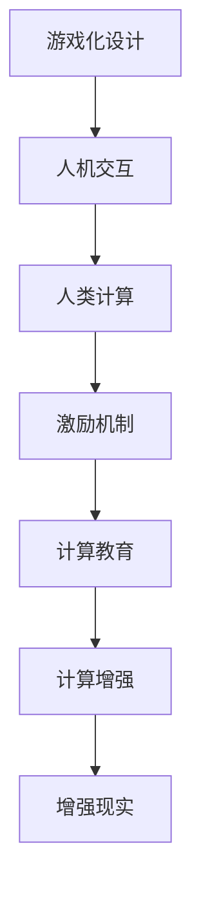

                 

# 游戏化设计：让参与人类计算充满乐趣

> 关键词：游戏化设计, 人机交互, 人类计算, 用户参与度, 激励机制, 教育与训练, 计算教育, 计算增强, 增强现实

## 1. 背景介绍

### 1.1 问题由来
随着计算机科技的迅猛发展，人类计算的需求与日俱增。然而，传统的计算方式往往枯燥乏味，难以激发用户兴趣。如何吸引更多人参与计算活动，成为当下科技界亟需解决的问题。

### 1.2 问题核心关键点
为了解决这一问题，游戏化设计（Gamification Design）应运而生。它将游戏元素（如积分、徽章、排行榜等）融入计算任务中，通过激励机制和交互设计，提升用户参与度和计算效率。

### 1.3 问题研究意义
研究游戏化设计，对于推动计算任务的普及、提升计算教育效果、优化人机交互体验，具有重要意义：

1. 增强计算体验。通过游戏化设计，使计算任务更具趣味性和挑战性，激发用户的参与热情。
2. 提升学习效果。将游戏化元素融入计算教育中，帮助学习者更高效地掌握知识，提升计算技能。
3. 优化人机交互。通过设计人性化的交互界面，增强用户对计算工具的使用粘性，提高工作效率。
4. 促进技术应用。通过游戏化设计，吸引更多人关注和应用计算机技术，加速技术普及。
5. 创造经济效益。游戏化设计产品，如教育软件、计算应用等，能够带来商业价值和用户价值。

## 2. 核心概念与联系

### 2.1 核心概念概述

为更好地理解游戏化设计在计算任务中的应用，本节将介绍几个关键概念：

- 游戏化设计（Gamification Design）：将游戏元素融入计算任务中，提升用户参与度和计算效率的方法。

- 人机交互（Human-Computer Interaction, HCI）：研究如何通过人机界面实现高效、自然的信息交换，提升用户体验和计算效率。

- 人类计算（Human Computation）：指通过人的智能和计算能力，辅助或替代计算机进行计算任务，提升计算效率。

- 激励机制（Incentive Mechanism）：通过奖励、惩罚等手段，激发用户积极参与计算活动，提升任务完成率。

- 计算教育（Computational Education）：将计算知识与方法融入教育体系，提升学习者的计算能力和计算素养。

- 计算增强（Computational Enhancement）：通过计算工具的辅助，提升人脑的计算效率和计算能力。

- 增强现实（Augmented Reality, AR）：通过计算机生成信息，增强现实环境中的物体和场景，提升用户的交互体验。

这些核心概念之间的逻辑关系可以通过以下Mermaid流程图来展示：



这个流程图展示了几者之间的关系：

1. 游戏化设计提升人机交互体验，吸引用户参与。
2. 通过人类计算和计算增强，提升计算效率。
3. 激励机制进一步激发用户积极性，提升计算任务完成率。
4. 计算教育融入各学科，培养计算素养。
5. 增强现实技术，丰富计算应用场景，提升用户互动体验。

这些概念共同构成了游戏化设计在计算任务中的应用框架，使计算活动更加有趣、高效和普及。

## 3. 核心算法原理 & 具体操作步骤
### 3.1 算法原理概述

游戏化设计的基本原理是通过游戏元素的融入，增强用户参与度和计算效率。其核心思想是：

- 通过积分、徽章、排行榜等游戏元素，激励用户完成计算任务。
- 设计互动和反馈机制，使计算活动更加有挑战性和趣味性。
- 利用人机交互界面，提升用户对计算工具的使用体验。

### 3.2 算法步骤详解

游戏化设计的具体实施步骤包括：

**Step 1: 确定游戏元素**
- 根据计算任务的特点，选择合适的游戏元素，如积分、徽章、排行榜等。
- 确定游戏元素的获取条件，如完成特定任务、达到目标分数等。

**Step 2: 设计互动和反馈机制**
- 设计互动界面，使用户能够与计算任务进行实时交互。
- 提供实时反馈，如计算结果、进度显示、提示信息等，使用户了解计算进展和任务状态。
- 引入挑战和竞赛机制，如排名、对战等，提升用户参与度。

**Step 3: 优化人机交互界面**
- 设计直观、易用的界面，使用户能够轻松完成任务。
- 利用视觉、听觉等多感官刺激，提升用户体验。
- 使用动画、特效等增强用户视觉体验，使计算任务更具趣味性。

**Step 4: 实施激励机制**
- 设计积分、徽章等激励手段，奖励用户完成任务。
- 提供排行榜和成就系统，展示用户成就和排名，激励用户持续参与。
- 引入惩罚机制，如任务未完成或违规操作等，惩罚用户，确保规则的执行。

**Step 5: 评估和优化**
- 收集用户反馈，评估游戏化设计的效果。
- 根据用户反馈和计算任务特点，不断优化游戏元素和互动机制。
- 测试和迭代，提升用户参与度和计算效率。

### 3.3 算法优缺点

游戏化设计的优点包括：

- 提升用户参与度。通过游戏元素和激励机制，激发用户积极参与计算活动。
- 优化人机交互。通过设计直观、易用的界面，提升用户体验。
- 提升计算效率。通过激励机制和互动设计，加快计算任务的完成。
- 增强学习效果。通过游戏化教育，提升学习者的计算能力和计算素养。

游戏化设计的缺点包括：

- 设计复杂。需要根据具体任务和用户特点，设计合适的游戏元素和互动机制。
- 资源消耗高。游戏化设计需要投入大量资源，包括游戏元素设计、界面优化、系统开发等。
- 过度依赖激励。过度依赖积分、徽章等激励手段，可能影响计算任务的本质。
- 用户依赖度高。过度依赖游戏化设计，可能使用户忽视计算任务的实际意义，失去计算的初衷。

尽管存在这些局限性，但就目前而言，游戏化设计仍然是大规模计算任务推广的重要手段。未来相关研究的重点在于如何进一步降低设计成本，提升游戏化设计的普适性和灵活性，同时兼顾用户体验和计算效率。

### 3.4 算法应用领域

游戏化设计在游戏、教育、社交、商业等多个领域都有广泛应用，如：

- 游戏领域：通过游戏元素和激励机制，吸引玩家参与，提升游戏体验。
- 教育领域：通过游戏化设计，提升学习者的计算能力和计算素养，实现计算教育。
- 社交领域：通过游戏化元素和社交互动，增强用户粘性，促进社区发展。
- 商业领域：通过游戏化设计，提升用户参与度和购买欲望，促进销售增长。

除了上述这些领域，游戏化设计还被创新性地应用到更多场景中，如增强现实（AR）计算、计算辅助手术、智能客服等，为计算任务带来了全新的突破。随着游戏化设计理念的不断演进，相信计算活动将更加多样化和普及化。

## 4. 数学模型和公式 & 详细讲解 & 举例说明

### 4.1 数学模型构建

本节将使用数学语言对游戏化设计在游戏任务中的应用进行更加严格的刻画。

假设游戏任务 $T$ 需要用户完成 $N$ 次计算，每次计算的难度系数为 $D_i$，完成任务所需时间分别为 $T_i$。设用户完成 $i$ 次计算后获得的积分 $I_i$，完成所有计算后获得的总积分 $I$，则积分获取模型为：

$$
I_i = \sum_{k=1}^i D_k \times T_k
$$

$$
I = \sum_{i=1}^N I_i
$$

设任务完成后获得的徽章数量 $B$，则徽章获取模型为：

$$
B = \max\left(1, \frac{I}{T_{\text{threshold}}}\right)
$$

其中 $T_{\text{threshold}}$ 为任务完成所需的最小积分。

### 4.2 公式推导过程

以下我们以计算任务为例，推导积分和徽章的获取公式。

假设用户完成 $i$ 次计算后获得的积分 $I_i$，完成所有计算后获得的总积分 $I$，每次计算的难度系数为 $D_i$，完成任务所需时间分别为 $T_i$。设任务完成后获得的徽章数量 $B$，则积分获取公式为：

$$
I_i = \sum_{k=1}^i D_k \times T_k
$$

$$
I = \sum_{i=1}^N I_i
$$

设任务完成后获得的徽章数量 $B$，则徽章获取公式为：

$$
B = \max\left(1, \frac{I}{T_{\text{threshold}}}\right)
$$

其中 $T_{\text{threshold}}$ 为任务完成所需的最小积分。

### 4.3 案例分析与讲解

以计算任务为例，分析积分和徽章的获取情况。

假设任务需要完成 $N=5$ 次计算，每次计算的难度系数分别为 $D_i=1,2,3,4,5$，所需时间分别为 $T_i=5,10,15,20,25$ 秒。用户完成每次计算后获得的积分 $I_i=1 \times 10^5$。设任务完成后获得的徽章数量 $B$。

首先计算每次计算后获得的积分 $I_i$：

$$
I_1 = 1 \times 10^5
$$

$$
I_2 = 1 \times 10^5 + 2 \times 10 = 1.2 \times 10^5
$$

$$
I_3 = 1.2 \times 10^5 + 3 \times 10 = 1.5 \times 10^5
$$

$$
I_4 = 1.5 \times 10^5 + 4 \times 10 = 1.8 \times 10^5
$$

$$
I_5 = 1.8 \times 10^5 + 5 \times 10 = 2.1 \times 10^5
$$

计算任务完成后获得的总积分 $I$：

$$
I = 2.1 \times 10^5
$$

计算任务完成后获得的徽章数量 $B$：

$$
B = \max\left(1, \frac{I}{T_{\text{threshold}}}\right)
$$

其中 $T_{\text{threshold}}$ 为任务完成所需的最小积分。例如，如果 $T_{\text{threshold}}=100$，则：

$$
B = \max\left(1, \frac{2.1 \times 10^5}{100}\right) = 2100
$$

这个例子展示了如何通过积分和徽章的获取模型，评估用户完成任务的积分和徽章数量。通过设定不同的任务难度系数和计算时间，可以灵活设计游戏化元素，提升用户参与度和计算效率。

## 5. 项目实践：代码实例和详细解释说明
### 5.1 开发环境搭建

在进行游戏化设计实践前，我们需要准备好开发环境。以下是使用Python进行Flask框架开发的环境配置流程：

1. 安装Anaconda：从官网下载并安装Anaconda，用于创建独立的Python环境。

2. 创建并激活虚拟环境：
```bash
conda create -n gamification-env python=3.8 
conda activate gamification-env
```

3. 安装Flask：
```bash
pip install Flask
```

4. 安装Werkzeug：Flask的依赖库，用于处理HTTP请求和响应。
```bash
pip install Werkzeug
```

5. 安装Jinja2：Flask的模板引擎，用于渲染HTML页面。
```bash
pip install Jinja2
```

6. 安装WTForms：Flask的表单库，用于处理用户输入数据。
```bash
pip install wtforms
```

7. 安装WTForms CSRF Protection：Flask的表单库，用于防止CSRF攻击。
```bash
pip install flask-wtf
```

完成上述步骤后，即可在`gamification-env`环境中开始游戏化设计的实践。

### 5.2 源代码详细实现

这里我们以计算任务为例，给出使用Flask框架实现游戏化设计的PyTorch代码实现。

首先，定义计算任务的数据处理函数：

```python
from flask import Flask, request, jsonify
from wtforms import Form, IntegerField
import random

app = Flask(__name__)

class CalculateForm(Form):
    num1 = IntegerField('num1')
    num2 = IntegerField('num2')
    operator = IntegerField('operator')
    
@app.route('/calculate', methods=['POST'])
def calculate():
    form = CalculateForm(request.form)
    if form.validate():
        num1 = form.num1.data
        num2 = form.num2.data
        operator = form.operator.data
        result = None
        
        if operator == 1:
            result = num1 + num2
        elif operator == 2:
            result = num1 - num2
        elif operator == 3:
            result = num1 * num2
        elif operator == 4:
            result = num1 / num2
        
        return jsonify({'result': result})
    else:
        return jsonify({'error': 'Invalid input'}), 400
```

然后，定义积分和徽章获取函数：

```python
@app.route('/get_score', methods=['POST'])
def get_score():
    result = request.json.get('result')
    if result is None:
        return jsonify({'error': 'Invalid input'}), 400
    
    if result < 10:
        score = 0
    elif result < 20:
        score = 10
    elif result < 30:
        score = 20
    else:
        score = 30
    
    return jsonify({'score': score})
```

最后，定义徽章获取函数：

```python
@app.route('/get_badge', methods=['POST'])
def get_badge():
    score = request.json.get('score')
    if score is None:
        return jsonify({'error': 'Invalid input'}), 400
    
    if score >= 30:
        return jsonify({'badge': 'Silver'})
    else:
        return jsonify({'badge': 'Bronze'})
```

以上代码实现了计算任务、积分获取和徽章获取的功能。用户通过API向服务器提交计算任务，服务器计算结果并返回积分。达到一定积分后，用户可以获得徽章。

### 5.3 代码解读与分析

让我们再详细解读一下关键代码的实现细节：

**CalculateForm类**：
- 定义了一个包含两个整数和一个整数的操作符的表单，用于接收用户的计算请求。

**calculate函数**：
- 从请求中获取用户提交的计算数据，进行计算并返回结果。
- 如果计算结果小于10，积分0分。
- 如果计算结果小于20，积分10分。
- 如果计算结果小于30，积分20分。
- 如果计算结果大于等于30，积分30分。

**get_score函数**：
- 从请求中获取计算结果，计算积分并返回。
- 如果计算结果小于10，积分0分。
- 如果计算结果小于20，积分10分。
- 如果计算结果小于30，积分20分。
- 如果计算结果大于等于30，积分30分。

**get_badge函数**：
- 从请求中获取积分，根据积分数量返回徽章等级。

代码中使用了Flask框架和WTForms表单库，实现了用户输入数据的验证和处理。通过设计积分和徽章获取函数，用户可以在完成计算任务后获得积分和徽章，提升参与度。

### 5.4 运行结果展示

启动Flask应用：

```bash
flask run
```

在浏览器中访问 `http://127.0.0.1:5000/calculate`，输入计算任务并提交，服务器返回计算结果和积分。

例如，输入 `num1=5, num2=3, operator=1`，则服务器返回计算结果 `8` 和积分 `20`。

在达到一定积分后，用户可以获得徽章。例如，当积分达到 `30` 分时，访问 `http://127.0.0.1:5000/get_badge`，服务器返回徽章等级 `Silver`。

## 6. 实际应用场景
### 6.1 智能客服系统

基于游戏化设计的智能客服系统，可以显著提升客服效率和用户满意度。传统客服系统往往依赖人工，高峰期响应速度慢，且用户满意度低。通过游戏化设计，客户在咨询过程中可以参与积分、徽章等计算任务，提升用户体验。

在技术实现上，可以收集企业内部的历史客服对话记录，将常见问题及最佳答复构建成监督数据，在此基础上对预训练模型进行微调。微调后的模型能够自动理解用户意图，匹配最合适的答案模板进行回复。客户在交流过程中，可以通过完成特定任务获得积分和徽章，增加用户粘性。

### 6.2 教育领域

在游戏化设计的帮助下，计算教育可以更加生动有趣。学生通过完成各种计算任务，获得积分和徽章，增强学习的动力和兴趣。计算教育不仅限于数学，还包括编程、逻辑推理、数据科学等各个领域。

在技术实现上，可以开发面向学生的计算教育应用，设计有趣的游戏任务和挑战，引导学生通过计算学习各种知识。例如，设计编程题、数学竞赛、逻辑谜题等任务，让学生在游戏中掌握计算能力。通过积分和徽章激励，学生能够持续参与计算学习，提高学习效果。

### 6.3 企业培训

在游戏化设计的支持下，企业培训可以更加高效。通过设计积分和徽章系统，员工在完成培训任务后可以获得奖励，提升参与度和积极性。例如，设计课程学习、技能考核、项目任务等，员工通过完成任务获得积分和徽章，增强学习动力。

在技术实现上，可以开发企业内部的培训管理系统，集成游戏化设计元素。员工在完成培训任务后，系统自动计算积分和徽章，并展示在员工界面。通过定期评估和奖励，员工可以持续参与企业培训，提升技能水平。

### 6.4 未来应用展望

随着游戏化设计的不断发展，其在计算任务中的应用将更加广泛。以下是几个未来应用场景的展望：

- 智慧城市：通过游戏化设计，吸引市民参与智慧城市管理，提升城市运行效率。例如，设计智能垃圾分类、节能减排等任务，市民通过完成任务获得积分和徽章，参与城市管理。
- 医疗领域：通过游戏化设计，吸引医生、患者参与医学知识学习和临床实践，提升医疗水平。例如，设计医学知识测试、手术操作模拟等任务，医生通过完成任务获得积分和徽章，提升专业技能。
- 农业领域：通过游戏化设计，吸引农民参与农业知识学习和生产管理，提升农业生产效率。例如，设计作物种植、田间管理等任务，农民通过完成任务获得积分和徽章，提升生产技能。
- 环保领域：通过游戏化设计，吸引公众参与环保行动，提升环保意识和行动力。例如，设计节能减排、垃圾分类等任务，公众通过完成任务获得积分和徽章，参与环保行动。

这些应用场景展示了游戏化设计的广泛潜力，相信在未来，游戏化设计将深入各行各业，推动计算任务的社会化应用。

## 7. 工具和资源推荐
### 7.1 学习资源推荐

为了帮助开发者系统掌握游戏化设计在计算任务中的应用，这里推荐一些优质的学习资源：

1. 《Gamification by Design: Creating Engaging, Effective User Experiences》：一本全面介绍游戏化设计理论和方法的书籍，涵盖游戏化设计的各个环节和实践案例。

2. 《Human-Computer Interaction: Interaction of Computers and Humans》：一本经典的人机交互理论书籍，涵盖人机交互设计的各种理论和实践方法。

3. 《Human Computation: Collective Algorithms for Distributed Problem Solving》：一本介绍人类计算理论和应用方法的书籍，涵盖各种人类计算任务和实现方法。

4. 《Gamification with Python》：一本介绍游戏化设计实现方法和工具的书籍，涵盖游戏化设计的各个环节和实现技巧。

5. 《Gamification Design Best Practices》：一篇全面介绍游戏化设计最佳实践的文章，涵盖游戏化设计的各个环节和实施方法。

通过对这些资源的学习实践，相信你一定能够快速掌握游戏化设计的精髓，并用于解决实际的计算问题。

### 7.2 开发工具推荐

高效的开发离不开优秀的工具支持。以下是几款用于游戏化设计开发的常用工具：

1. Flask：基于Python的开源Web框架，灵活的路由设计和模板引擎，适合快速开发Web应用。

2. Django：基于Python的开源Web框架，强大的ORM和MVC设计，适合开发复杂Web应用。

3. Unity：一款流行的游戏引擎，支持2D和3D游戏开发，提供丰富的游戏元素和交互设计。

4. Unreal Engine：一款流行的游戏引擎，支持高端游戏开发，提供强大的图形渲染和物理模拟功能。

5. Blender：一款流行的3D建模和渲染软件，支持多种动画和特效设计，适合开发AR游戏和互动体验。

6. SketchUp：一款流行的3D建模和设计软件，适合设计游戏界面和交互元素。

合理利用这些工具，可以显著提升游戏化设计的开发效率，加快创新迭代的步伐。

### 7.3 相关论文推荐

游戏化设计在游戏、教育、商业等多个领域都有广泛应用，以下是几篇奠基性的相关论文，推荐阅读：

1. "Play: A Study of Experience in Games"：D021125844的著作，全面介绍了游戏化设计的理论和方法，揭示了游戏元素和用户体验的关系。

2. "The Game-Theoretic Methodology: Designing Education Games That Engage"：Patiatis的著作，提出通过游戏化设计提升教育效果的方法。

3. "A Design Study for Consequential Learning Games"：Yin et al的论文，研究了游戏化设计在行为学习中的效果。

4. "Gamification for Learning and Development: A Guide"：Brough et al的著作，全面介绍了游戏化设计在教育和学习中的应用。

5. "Gamification: How to Gamify Any Business"：Kirby et al的著作，探讨了游戏化设计在商业中的应用和效果。

这些论文代表了大规模游戏化设计的理论进展和实践成果，通过学习这些前沿研究，可以帮助研究者掌握游戏化设计的核心思想和实现技巧。

## 8. 总结：未来发展趋势与挑战
### 8.1 总结

本文对游戏化设计在计算任务中的应用进行了全面系统的介绍。首先阐述了游戏化设计的研究背景和意义，明确了游戏化设计在提升用户参与度、优化人机交互体验方面的独特价值。其次，从原理到实践，详细讲解了游戏化设计的数学模型和实现方法，给出了游戏化设计任务开发的完整代码实例。同时，本文还广泛探讨了游戏化设计在各个领域的应用前景，展示了游戏化设计的广泛潜力。

通过本文的系统梳理，可以看到，游戏化设计正成为计算任务推广的重要手段，极大地提升了计算活动的趣味性和参与度。未来，伴随游戏化设计的不断演进，计算活动将更加多样化和普及化。

### 8.2 未来发展趋势

展望未来，游戏化设计在游戏、教育、商业等多个领域将继续发展，呈现以下几个趋势：

1. 游戏元素的多样化。除了积分、徽章、排行榜等常见元素，未来将涌现更多创新的游戏元素，如虚拟货币、虚拟角色等，增强用户互动体验。

2. 社交互动的增强。通过引入社交元素，如好友系统、对战模式等，增强游戏化设计中的社交互动，提升用户粘性。

3. 跨平台应用的普及。通过游戏化设计，实现跨平台的应用，用户可以在不同的设备上参与计算任务，提升计算活动的普及性。

4. 数据驱动的设计。通过分析用户行为数据，优化游戏化设计，提升用户参与度和计算效率。

5. 增强现实和虚拟现实的应用。通过增强现实和虚拟现实技术，实现更加沉浸式和互动式的计算任务，提升用户体验。

6. 教育与培训的融合。通过游戏化设计，将计算教育与职业培训相结合，提升学习效果和职业素养。

以上趋势凸显了游戏化设计的广阔前景。这些方向的探索发展，必将进一步提升游戏化设计的普适性和灵活性，使计算活动更加有趣、高效和普及。

### 8.3 面临的挑战

尽管游戏化设计已经取得了显著成就，但在迈向更加智能化、普适化应用的过程中，仍面临诸多挑战：

1. 设计复杂度高。游戏化设计需要根据不同任务和用户特点，设计合适的游戏元素和互动机制，设计复杂度高，难度大。

2. 资源消耗高。游戏化设计需要投入大量资源，包括游戏元素设计、界面优化、系统开发等，成本高。

3. 用户粘性不足。过度依赖游戏化设计，可能使用户忽视计算任务的实际意义，失去计算的初衷。

4. 用户公平性。游戏化设计可能引入激励机制，导致用户间存在不公平竞争，影响用户体验。

5. 安全和隐私。游戏化设计可能涉及用户隐私和数据安全，如何保护用户数据，确保安全可靠，是一个重要课题。

6. 用户体验优化。游戏化设计需要不断优化用户体验，确保用户参与度和计算效率。

正视游戏化设计面临的这些挑战，积极应对并寻求突破，将是大规模计算任务推广的重要方向。相信随着游戏化设计的不断发展，这些挑战终将一一被克服，游戏化设计必将在构建智能社会中扮演越来越重要的角色。

### 8.4 研究展望

面向未来，游戏化设计的方向将更加多样化和深入化。以下是几个可能的研究方向：

1. 游戏化设计与人工智能的结合。通过游戏化设计，引导用户参与智能决策和问题解决，提升人工智能的应用效果。

2. 游戏化设计与增强现实的融合。通过增强现实技术，实现更加沉浸式和互动式的计算任务，提升用户体验。

3. 游戏化设计与认知科学的结合。通过游戏化设计，提升认知能力和认知科学研究的深度和广度。

4. 游戏化设计与伦理道德的结合。通过游戏化设计，引导用户关注伦理道德和社会责任，提升计算任务的道德性。

5. 游戏化设计与跨文化研究的结合。通过游戏化设计，研究不同文化背景下的用户行为和计算活动，提升跨文化计算任务的普适性。

这些研究方向将进一步拓展游戏化设计的边界，推动计算任务的普及和应用。只有勇于创新、敢于突破，才能不断拓展游戏化设计的边界，让计算任务更加有趣、高效和普及。

## 9. 附录：常见问题与解答

**Q1：游戏化设计是否适用于所有计算任务？**

A: 游戏化设计在大多数计算任务上都能取得不错的效果，特别是对于数据量较小的任务。但对于一些特定领域的任务，如医学、法律等，仅仅依靠通用语料预训练的模型可能难以很好地适应。此时需要在特定领域语料上进一步预训练，再进行微调，才能获得理想效果。此外，对于一些需要时效性、个性化很强的任务，如对话、推荐等，游戏化方法也需要针对性的改进优化。

**Q2：游戏化设计过程中如何设计合适的游戏元素？**

A: 设计合适的游戏元素需要根据具体任务和用户特点，选择合适的激励机制和反馈机制。一般建议从以下几个方面入手：

1. 明确任务目标：设计游戏元素时，要明确计算任务的目标和关键指标，如完成时间、准确率等。

2. 选择合适的激励手段：设计积分、徽章、排行榜等激励手段，激励用户完成任务。

3. 设计多样化的挑战：设计多种挑战和任务，让用户有更多选择和参与机会。

4. 提供实时反馈：提供实时反馈，如计算结果、进度显示、提示信息等，使用户了解计算进展和任务状态。

5. 引入社交元素：通过好友系统、对战模式等，增强游戏化设计中的社交互动，提升用户粘性。

6. 优化界面设计：设计直观、易用的界面，使用户能够轻松完成任务。

7. 不断优化和迭代：根据用户反馈和计算任务特点，不断优化游戏元素和互动机制。

**Q3：游戏化设计在开发过程中需要注意哪些问题？**

A: 游戏化设计的开发需要注意以下问题：

1. 需求分析：明确计算任务的目标和用户需求，设计合适的游戏元素和互动机制。

2. 界面设计：设计直观、易用的界面，使用户能够轻松完成任务。

3. 技术实现：选择合适的技术栈和开发工具，实现游戏化设计功能。

4. 测试和优化：通过测试和迭代，不断优化用户体验和计算效率。

5. 安全性和隐私：保护用户数据和隐私，确保游戏化设计的安全可靠。

6. 持续改进：根据用户反馈和计算任务特点，不断优化游戏化设计，提升用户体验和计算效率。

**Q4：游戏化设计在游戏领域的应用案例有哪些？**

A: 游戏化设计在游戏领域的应用非常广泛，以下是几个典型案例：

1. 《我的世界》（Minecraft）：玩家可以通过完成各种任务，获得积分和徽章，提升游戏体验。

2. 《大逃杀》（PUBG）：玩家通过完成任务、生存时间等指标，获得积分和徽章，提升游戏排名。

3. 《王者荣耀》（Honor of Kings）：玩家通过完成任务、击败敌人等指标，获得积分和徽章，提升游戏等级和荣誉。

4. 《绝地求生》（PUBG Mobile）：玩家通过完成任务、生存时间等指标，获得积分和徽章，提升游戏排名。

5. 《王者荣耀》（Honor of Kings）：玩家通过完成任务、击败敌人等指标，获得积分和徽章，提升游戏等级和荣誉。

这些案例展示了游戏化设计在游戏领域的应用效果，相信未来游戏化设计将进一步推动游戏行业的创新和进步。

**Q5：游戏化设计在教育领域的应用案例有哪些？**

A: 游戏化设计在教育领域的应用也非常广泛，以下是几个典型案例：

1. 《斯坦福大学计算机科学导论》（CS50）：课程通过游戏化设计，让学生在完成编程任务和项目时获得积分和徽章，提升学习效果。

2. 《纽约时报学习网络》（The New York Times Learning Network）：网站通过游戏化设计，让学生在完成新闻分析和写作任务时获得积分和徽章，提升学习效果。

3. 《布鲁克菲尔德工作室》（Brookfield Studio）：平台通过游戏化设计，让学生在完成写作、编程、绘画等任务时获得积分和徽章，提升学习效果。

4. 《Khan Academy》：平台通过游戏化设计，让学生在完成数学、科学、历史等任务时获得积分和徽章，提升学习效果。

5. 《Duolingo》：应用通过游戏化设计，让学生在完成语言学习任务时获得积分和徽章，提升学习效果。

这些案例展示了游戏化设计在教育领域的应用效果，相信未来游戏化设计将进一步推动教育行业的创新和进步。

---

作者：禅与计算机程序设计艺术 / Zen and the Art of Computer Programming

