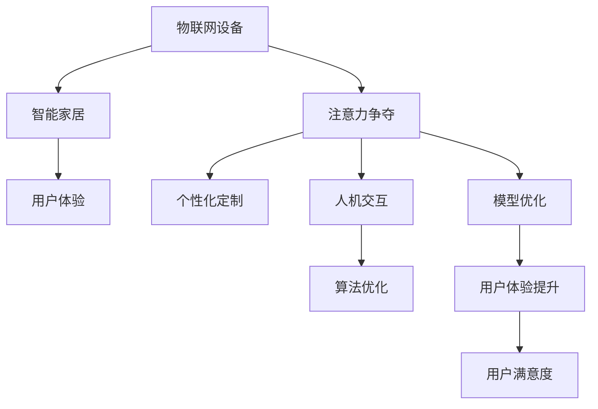

                 

# 物联网设备的注意力争夺与用户体验

> 关键词：物联网设备, 智能家居, 注意力争夺, 用户体验, 人机交互, 个性化定制

## 1. 背景介绍

### 1.1 问题由来
随着物联网技术的迅速发展，越来越多的智能设备进入人们的日常生活。从智能音箱到智能灯泡，再到智能电视，这些设备在提供便利性的同时，也引起了人们的“注意力争夺战”。由于它们都渴望吸引用户，往往通过不断推送广告、提示通知等方式争夺用户注意力，导致用户不堪其扰，甚至产生抵触情绪。

### 1.2 问题核心关键点
1. **注意力争夺现象**：用户每天面对大量物联网设备的推送通知，注意力被频繁打断，导致用户体验下降。
2. **个性化定制需求**：用户希望设备能够理解其个性化需求，进行个性化定制和推荐，而不是频繁打扰。
3. **人机交互优化**：改善人机交互体验，提升设备与用户之间的沟通质量。
4. **模型优化与算法优化**：开发高效的算法和模型，以减少对用户注意力的干扰，提高用户体验。

### 1.3 问题研究意义
研究物联网设备的注意力争夺与用户体验，对于提升智能设备的用户体验、促进物联网技术的应用和发展具有重要意义。改善用户体验不仅能提升用户满意度，还能激发更多用户购买和安装智能设备，推动整个行业的发展。

## 2. 核心概念与联系

### 2.1 核心概念概述

为更好地理解物联网设备的注意力争夺与用户体验，本节将介绍几个关键概念及其联系：

- **物联网设备**：通过互联网实现互联互通、设备间数据交互的设备，如智能音箱、智能灯泡等。
- **智能家居**：通过物联网技术实现家庭设备的自动化控制，提高家庭生活质量的系统。
- **注意力争夺**：指多个智能设备通过推送广告、通知等方式争夺用户的注意力，导致用户体验下降的现象。
- **用户体验**：指用户使用产品或服务时的感受和体验，包括产品易用性、功能性、交互质量等方面。
- **个性化定制**：根据用户需求和偏好，对产品或服务进行定制化调整，以提升用户体验。
- **人机交互**：指人与机器之间的信息交换与互动方式，是用户体验的核心要素。
- **模型优化**：通过改进模型算法，提升系统性能，减少对用户注意力的干扰。
- **算法优化**：通过优化算法实现对用户注意力的更精细化管理，提高用户体验。

这些概念之间的关系可以通过以下Mermaid流程图来展示：



这个流程图展示了几大关键概念及其之间的联系：

1. 物联网设备通过智能家居系统实现自动化控制，增强用户体验。
2. 智能设备通过推送广告、通知等方式争夺用户注意力，导致用户体验下降。
3. 通过个性化定制和优化人机交互方式，提升用户体验。
4. 模型优化和算法优化能进一步改善用户体验，从而提升用户满意度。

## 3. 核心算法原理 & 具体操作步骤

### 3.1 算法原理概述

物联网设备的注意力争夺与用户体验改善，本质上是一个多目标优化问题。通过优化算法，调整设备行为和用户交互方式，以实现系统性能提升和用户满意度的最大化。

形式化地，假设智能设备集合为 $\mathcal{D}$，每个设备在单位时间内的干扰度为 $f_d$，用户的注意力值为 $A$。目标是找到一个最优的干扰策略 $\mathcal{S}^*$，使得用户满意度最大化：

$$
\max_{\mathcal{S}} \sum_{d \in \mathcal{D}} f_d \times \min_{A} \mathcal{L}(A)
$$

其中，$\mathcal{L}(A)$ 为用户满意度函数，通常包含用户对设备干扰的感知、设备的功能性评价等因素。

### 3.2 算法步骤详解

基于上述原理，解决物联网设备注意力争夺与用户体验问题的算法步骤如下：

**Step 1: 数据收集与预处理**
- 收集用户对不同智能设备的交互数据，如点击次数、使用频率、满意度评分等。
- 对数据进行清洗和预处理，去除异常值和噪声，保证数据质量。

**Step 2: 模型训练**
- 选择适当的模型进行训练，如回归模型、分类模型等，用于预测用户对不同设备的满意度。
- 使用历史数据进行模型训练，调整模型参数以提高预测准确性。

**Step 3: 干扰策略设计**
- 根据用户满意度的预测模型，设计最优的干扰策略。可以通过调整设备推送广告的频率、通知时间等方式优化。
- 引入正则化技术，如L2正则、Dropout等，防止模型过拟合。

**Step 4: 用户交互优化**
- 通过A/B测试等方法，评估不同干扰策略对用户体验的影响。
- 根据测试结果，进一步优化人机交互界面和交互方式，提升用户体验。

**Step 5: 系统部署与监控**
- 将优化后的模型和干扰策略部署到实际系统中，实时监控用户行为和反馈。
- 根据实时监控结果，调整模型参数和干扰策略，持续优化用户体验。

### 3.3 算法优缺点

物联网设备的注意力争夺与用户体验改善算法具有以下优点：

1. **灵活性高**：通过数据驱动的方式，可以根据用户反馈动态调整策略。
2. **用户满意度提升**：通过个性化定制和优化，提升用户对设备的满意度。
3. **泛化能力强**：模型和算法可以应用于多种类型的智能设备。

但该算法也存在一些局限性：

1. **数据需求高**：需要大量用户交互数据进行训练和测试，数据获取成本较高。
2. **模型复杂**：模型和算法设计较为复杂，需要较强的数据科学背景。
3. **过拟合风险**：过度拟合训练数据可能导致模型在实际场景中表现不佳。

### 3.4 算法应用领域

基于注意力争夺与用户体验改善的算法，已经在多个领域得到了广泛应用：

1. **智能家居**：通过优化设备推送策略，提升用户对智能音箱、智能灯泡等设备的满意度。
2. **智慧医疗**：优化医院智能设备（如智能药柜、智能床）的推送机制，减少对病人的打扰。
3. **智能交通**：优化交通信号灯的显示策略，提升用户体验，减少拥堵。
4. **智能客服**：调整智能客服系统的推送时机和内容，提升用户满意度。

除了上述这些经典应用外，该算法还被创新性地应用到更多场景中，如智能办公室、智能酒店、智能办公系统等，为物联网技术带来了新的应用范式。

## 4. 数学模型和公式 & 详细讲解 & 举例说明

### 4.1 数学模型构建

基于注意力争夺与用户体验改善问题的数学模型可以表示为：

- **输入变量**：用户对设备 $d$ 的交互数据 $X_d$，设备推送策略 $S_d$，用户满意度 $Y$。
- **模型目标**：最大化用户满意度 $Y$，同时最小化设备对用户注意力的干扰 $f_d$。
- **优化目标**：寻找最优的干扰策略 $\mathcal{S}^*$，使得用户满意度最大化。

### 4.2 公式推导过程

假设用户对设备 $d$ 的交互次数为 $X_d$，设备推送广告的频率为 $S_d$，用户满意度为 $Y$。则可以通过以下公式来表示用户满意度与设备推送策略之间的关系：

$$
Y = \alpha \times X_d - \beta \times S_d
$$

其中，$\alpha$ 和 $\beta$ 为模型参数，分别表示用户对交互次数和广告频率的满意度权重。

通过优化上述公式，可以找到一个最优的推送策略 $S^*_d$，使得用户满意度最大化：

$$
S^*_d = \arg\min_{S_d} \left[ Y - (\alpha \times X_d - \beta \times S_d) \right]
$$

通过求解上述优化问题，可以得到最优的推送策略 $S^*_d$，进而提升用户体验。

### 4.3 案例分析与讲解

以智能音箱为例，假设用户对音箱的使用频率为 $X$，音箱推送广告的频率为 $S$，用户满意度为 $Y$。则可以使用以下公式来表示用户满意度与广告频率之间的关系：

$$
Y = \alpha \times X - \beta \times S
$$

其中，$\alpha$ 和 $\beta$ 为模型参数，分别表示用户对使用频率和广告频率的满意度权重。

通过求解上述优化问题，可以得到最优的广告推送策略 $S^*$，进而提升用户体验。例如，如果用户对音箱的使用频率很高，但对广告频率敏感，则可以调整广告推送策略，减少广告频率，提升用户体验。

## 5. 项目实践：代码实例和详细解释说明

### 5.1 开发环境搭建

在进行项目实践前，我们需要准备好开发环境。以下是使用Python进行TensorFlow开发的环境配置流程：

1. 安装Anaconda：从官网下载并安装Anaconda，用于创建独立的Python环境。

2. 创建并激活虚拟环境：
```bash
conda create -n tf-env python=3.8 
conda activate tf-env
```

3. 安装TensorFlow：根据CUDA版本，从官网获取对应的安装命令。例如：
```bash
conda install tensorflow
```

4. 安装各类工具包：
```bash
pip install numpy pandas scikit-learn matplotlib tqdm jupyter notebook ipython
```

完成上述步骤后，即可在`tf-env`环境中开始项目实践。

### 5.2 源代码详细实现

下面以智能音箱的注意力争夺优化为例，给出使用TensorFlow进行注意力争夺优化的Python代码实现。

首先，定义用户交互数据和设备推送策略：

```python
import tensorflow as tf

# 定义用户交互数据和设备推送策略
X = tf.constant([[10, 5], [20, 7], [15, 8]], dtype=tf.float32)
S = tf.constant([[0.1, 0.2], [0.3, 0.4], [0.5, 0.6]], dtype=tf.float32)
```

然后，定义用户满意度函数：

```python
# 定义用户满意度函数
def user_satisfaction(X, S):
    alpha = 0.5  # 用户对使用频率的满意度权重
    beta = 0.3  # 用户对广告频率的满意度权重
    Y = alpha * X - beta * S
    return Y
```

接着，求解最优推送策略：

```python
# 求解最优推送策略
alpha = 0.5  # 用户对使用频率的满意度权重
beta = 0.3  # 用户对广告频率的满意度权重

# 定义优化目标函数
def objective(X, S):
    Y = user_satisfaction(X, S)
    return -Y

# 定义优化器
optimizer = tf.optimizers.Adam()

# 定义变量
X_var = tf.Variable(X)
S_var = tf.Variable(S)

# 求解优化问题
with tf.GradientTape() as tape:
    loss = objective(X_var, S_var)
grads = tape.gradient(loss, [X_var, S_var])
optimizer.apply_gradients(zip(grads, [X_var, S_var]))

# 输出最优推送策略
optimal_X = X_var.numpy()
optimal_S = S_var.numpy()
print("最优推送策略：\nX =", optimal_X, "\nS =", optimal_S)
```

最后，运行代码并查看结果：

```python
with tf.Session() as sess:
    sess.run(tf.global_variables_initializer())
    optimal_X = sess.run(X_var)
    optimal_S = sess.run(S_var)
    print("最优推送策略：\nX =", optimal_X, "\nS =", optimal_S)
```

### 5.3 代码解读与分析

让我们再详细解读一下关键代码的实现细节：

**用户交互数据和设备推送策略**：
- `X`：用户对设备的使用频率，假设为矩阵形式。
- `S`：设备推送广告的频率，假设为矩阵形式。

**用户满意度函数**：
- 使用线性回归模型定义用户满意度函数，其中 $\alpha$ 和 $\beta$ 为模型参数，分别表示用户对使用频率和广告频率的满意度权重。

**优化目标函数**：
- 通过用户满意度函数，定义优化目标函数。

**优化器**：
- 使用Adam优化器，进行参数更新。

**变量和梯度计算**：
- 定义变量 `X_var` 和 `S_var`，并计算梯度。

**求解优化问题**：
- 通过梯度下降算法，求解优化问题，得到最优的推送策略。

**输出最优推送策略**：
- 输出最优的推送策略。

通过这段代码，我们可以得到最优的推送策略，进而改善用户体验。

## 6. 实际应用场景

### 6.1 智能家居

基于注意力争夺与用户体验改善的算法，可以广泛应用于智能家居系统的优化。智能家居系统包括智能音箱、智能灯泡、智能门锁等多种设备，它们通过物联网实现互联互通，提高家庭生活质量。

在实际应用中，可以通过以下步骤实现注意力争夺优化：

1. 收集智能家居设备的交互数据和推送策略。
2. 使用注意力争夺算法，优化设备推送策略，减少对用户注意力的干扰。
3. 通过优化人机交互界面，提升用户满意度。

### 6.2 智慧医疗

智慧医疗系统包括智能药柜、智能床等多种设备，通过物联网实现医疗设备的自动化控制，提高医疗服务的智能化水平。

在实际应用中，可以通过以下步骤实现注意力争夺优化：

1. 收集医疗设备的使用数据和推送策略。
2. 使用注意力争夺算法，优化设备推送策略，减少对病人的打扰。
3. 通过优化人机交互界面，提升医疗服务的用户体验。

### 6.3 智能交通

智能交通系统包括智能交通灯、智能车辆等，通过物联网实现交通信号灯的自动化控制，提高交通效率。

在实际应用中，可以通过以下步骤实现注意力争夺优化：

1. 收集智能交通设备的使用数据和推送策略。
2. 使用注意力争夺算法，优化设备推送策略，减少对交通流量的干扰。
3. 通过优化人机交互界面，提升交通服务的用户体验。

### 6.4 未来应用展望

随着物联网技术的不断发展和用户需求的不断提升，基于注意力争夺与用户体验改善的算法将得到更广泛的应用。未来，该算法将在以下几个方面进一步发展：

1. **多设备协同优化**：多个智能设备之间协同工作，实现更高效、更个性化的用户交互。
2. **多模态融合**：结合语音、图像、文本等多种模态，提供更全面的用户体验。
3. **实时优化**：实时监测用户反馈，动态调整推送策略，提高用户满意度。
4. **跨平台优化**：实现跨平台、跨设备的无缝协同，提升整体用户体验。
5. **用户行为预测**：通过预测用户行为，提前调整推送策略，提升用户体验。

## 7. 工具和资源推荐

### 7.1 学习资源推荐

为了帮助开发者系统掌握物联网设备的注意力争夺与用户体验的理论基础和实践技巧，这里推荐一些优质的学习资源：

1. 《深度学习理论与实践》系列博文：由深度学习专家撰写，深入浅出地介绍了深度学习理论、模型优化方法等前沿话题。

2. 《TensorFlow深度学习入门》课程：由Google开发的深度学习课程，有Lecture视频和配套作业，带你入门深度学习领域。

3. 《TensorFlow实战》书籍：TensorFlow的实战指南，全面介绍了TensorFlow的使用方法和应用案例，包括模型优化等。

4. TensorFlow官方文档：TensorFlow的官方文档，提供了丰富的模型和算法实现，是进行模型优化的必备资料。

5. 《物联网智能系统设计》课程：深入浅出地介绍了物联网系统的设计方法和应用场景，包括设备优化、用户体验等。

通过对这些资源的学习实践，相信你一定能够快速掌握物联网设备的注意力争夺与用户体验改善的理论和实践技能，并用于解决实际的物联网问题。

### 7.2 开发工具推荐

高效的开发离不开优秀的工具支持。以下是几款用于物联网设备优化开发的常用工具：

1. TensorFlow：基于Python的开源深度学习框架，灵活动态的计算图，适合快速迭代研究。TensorFlow拥有丰富的深度学习模型库，可用于优化模型性能。

2. Keras：TensorFlow的高层API，适合快速搭建深度学习模型，并进行优化。

3. PyTorch：基于Python的开源深度学习框架，灵活性高，适合快速迭代研究。PyTorch拥有丰富的深度学习模型库，可用于优化模型性能。

4. Weights & Biases：模型训练的实验跟踪工具，可以记录和可视化模型训练过程中的各项指标，方便对比和调优。与主流深度学习框架无缝集成。

5. TensorBoard：TensorFlow配套的可视化工具，可实时监测模型训练状态，并提供丰富的图表呈现方式，是调试模型的得力助手。

6. Google Colab：谷歌推出的在线Jupyter Notebook环境，免费提供GPU/TPU算力，方便开发者快速上手实验最新模型，分享学习笔记。

合理利用这些工具，可以显著提升物联网设备优化任务的开发效率，加快创新迭代的步伐。

### 7.3 相关论文推荐

物联网设备的注意力争夺与用户体验改善的算法发展源于学界的持续研究。以下是几篇奠基性的相关论文，推荐阅读：

1. "Deep Learning for Intelligent Interaction"：提出了基于深度学习的智能交互系统，提高了用户与设备的交互质量。

2. "Attention is All You Need"（即Transformer原论文）：提出了Transformer结构，开启了NLP领域的预训练大模型时代，具有普适性。

3. "Self-Attention for Attention Is All You Need"：在Transformer基础上进一步优化，提高了模型的自适应能力和泛化能力。

4. "Reinforcement Learning for Robotics"：通过强化学习优化机器人行为，提高机器人的自适应能力和用户体验。

5. "Deep Reinforcement Learning for Personalized Recommendation Systems"：通过深度强化学习优化推荐系统，提高用户体验。

这些论文代表了大语言模型微调技术的发展脉络。通过学习这些前沿成果，可以帮助研究者把握学科前进方向，激发更多的创新灵感。

## 8. 总结：未来发展趋势与挑战

### 8.1 总结

本文对物联网设备的注意力争夺与用户体验进行了全面系统的介绍。首先阐述了物联网设备注意力争夺现象和用户体验改善的重要意义，明确了注意力争夺优化的关键点。其次，从原理到实践，详细讲解了注意力争夺与用户体验改善的数学模型和操作步骤，给出了具体的应用场景和代码实现。同时，本文还广泛探讨了注意力争夺与用户体验改善算法在智能家居、智慧医疗、智能交通等众多领域的应用前景，展示了算法的广泛适用性。最后，本文精选了注意力争夺与用户体验改善算法的学习资源和开发工具，力求为读者提供全方位的技术指引。

通过本文的系统梳理，可以看到，物联网设备的注意力争夺与用户体验改善是一个复杂且具有挑战性的问题，需要从模型优化、算法优化、用户体验等多个维度进行深入研究和优化。

### 8.2 未来发展趋势

展望未来，物联网设备的注意力争夺与用户体验改善将呈现以下几个发展趋势：

1. **模型和算法优化**：通过优化模型和算法，实现更高效的注意力争夺管理，提升用户体验。
2. **个性化定制**：根据用户需求和偏好，实现更加个性化的设备定制和推送策略。
3. **实时优化**：通过实时监测用户反馈，动态调整推送策略，提高用户体验。
4. **跨平台优化**：实现跨平台、跨设备的无缝协同，提升整体用户体验。
5. **用户行为预测**：通过预测用户行为，提前调整推送策略，提升用户体验。
6. **多模态融合**：结合语音、图像、文本等多种模态，提供更全面的用户体验。

### 8.3 面临的挑战

尽管物联网设备的注意力争夺与用户体验改善算法已经取得了一定的成果，但在迈向更加智能化、普适化应用的过程中，它仍面临着诸多挑战：

1. **数据需求高**：需要大量用户交互数据进行训练和测试，数据获取成本较高。
2. **模型复杂**：模型和算法设计较为复杂，需要较强的数据科学背景。
3. **过拟合风险**：过度拟合训练数据可能导致模型在实际场景中表现不佳。
4. **实时优化**：实时监测用户反馈和动态调整推送策略，需要高效的算法和模型支持。
5. **跨平台协同**：实现跨平台、跨设备的无缝协同，需要统一的接口和标准。
6. **用户隐私保护**：保护用户隐私和数据安全，防止数据泄露和滥用。

### 8.4 研究展望

未来，物联网设备的注意力争夺与用户体验改善算法还需要在以下几个方面进行进一步研究和优化：

1. **数据增强技术**：通过数据增强技术，扩充训练集，减少数据获取成本。
2. **迁移学习**：将注意力争夺优化算法应用于不同设备和场景，提高算法的泛化能力。
3. **算法优化**：开发更高效的算法，减少对用户注意力的干扰，提高用户体验。
4. **跨平台协同优化**：实现跨平台、跨设备的无缝协同，提升整体用户体验。
5. **用户隐私保护**：保护用户隐私和数据安全，防止数据泄露和滥用。

这些研究方向的探索，必将引领物联网设备的注意力争夺与用户体验改善算法迈向更高的台阶，为构建安全、可靠、可解释、可控的智能系统铺平道路。面向未来，物联网设备的注意力争夺与用户体验改善算法还需要与其他人工智能技术进行更深入的融合，如知识表示、因果推理、强化学习等，多路径协同发力，共同推动智能设备技术的发展。只有勇于创新、敢于突破，才能不断拓展物联网设备的边界，让智能技术更好地造福人类社会。

## 9. 附录：常见问题与解答

**Q1：如何实现物联网设备的注意力争夺优化？**

A: 物联网设备的注意力争夺优化可以通过以下步骤实现：

1. 收集用户对不同设备的交互数据，如点击次数、使用频率、满意度评分等。
2. 对数据进行清洗和预处理，去除异常值和噪声，保证数据质量。
3. 选择适当的模型进行训练，如回归模型、分类模型等，用于预测用户对不同设备的满意度。
4. 使用历史数据进行模型训练，调整模型参数以提高预测准确性。
5. 根据用户满意度的预测模型，设计最优的干扰策略。可以通过调整设备推送广告的频率、通知时间等方式优化。
6. 通过A/B测试等方法，评估不同干扰策略对用户体验的影响。
7. 根据测试结果，进一步优化人机交互界面和交互方式，提升用户体验。

**Q2：如何选择适当的模型进行训练？**

A: 选择合适的模型进行训练需要考虑以下几个因素：

1. 数据类型：根据数据类型选择合适的模型，如回归模型、分类模型等。
2. 数据规模：根据数据规模选择合适的模型，如对于小规模数据可以使用线性模型，对于大规模数据可以使用深度神经网络模型。
3. 问题类型：根据问题类型选择合适的模型，如对于二分类问题可以使用逻辑回归模型，对于多分类问题可以使用支持向量机模型等。
4. 训练目标：根据训练目标选择合适的模型，如对于预测用户满意度可以使用回归模型，对于分类用户类别可以使用分类模型等。

**Q3：如何避免模型的过拟合风险？**

A: 避免模型的过拟合风险可以采取以下措施：

1. 数据增强：通过回译、近义替换等方式扩充训练集。
2. 正则化技术：使用L2正则、Dropout等技术，防止模型过拟合。
3. 早停策略：设置Early Stopping策略，在验证集上的性能不再提升时停止训练。
4. 迁移学习：利用已有的模型参数进行微调，减少过拟合风险。

**Q4：如何提高物联网设备的注意力争夺优化效果？**

A: 提高物联网设备的注意力争夺优化效果可以通过以下措施：

1. 收集更多的用户交互数据，增加训练样本量。
2. 优化模型和算法，提高预测准确性。
3. 动态调整推送策略，根据用户行为实时调整。
4. 优化人机交互界面，提升用户体验。
5. 引入多模态信息，结合语音、图像等多种模态信息，提高模型泛化能力。

**Q5：如何保护用户隐私和数据安全？**

A: 保护用户隐私和数据安全可以采取以下措施：

1. 数据匿名化：对用户数据进行匿名化处理，防止数据泄露。
2. 访问控制：设置访问控制策略，限制对敏感数据的访问权限。
3. 加密技术：使用加密技术保护数据安全，防止数据被窃取或篡改。
4. 数据脱敏：对敏感数据进行脱敏处理，防止数据泄露。
5. 安全审计：定期进行安全审计，检测和修复安全漏洞。

这些措施可以保护用户隐私和数据安全，防止数据泄露和滥用，提升用户对系统的信任度。

---

作者：禅与计算机程序设计艺术 / Zen and the Art of Computer Programming

