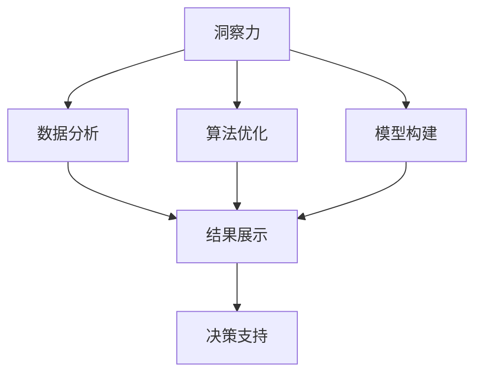

                 

# 理解洞察力的培养：鼓励好奇心和创新人才

## 1. 背景介绍

在快速发展的信息时代，洞察力成为了企业竞争的关键要素。企业若能培养和挖掘员工对数据的敏锐洞察，将能够更快地做出决策，从而占据市场优势。与此同时，从数据中提取洞察并非易事，它需要员工具备敏锐的观察力、强大的分析能力以及前瞻性的思维模式。如何鼓励员工培养这些能力，成为了企业必须思考的问题。

本文章将围绕洞察力的培养，从概念引入、算法原理、操作步骤、实际应用场景及工具资源推荐等方面展开深入探讨。帮助读者理解培养洞察力的重要性，掌握培养方法，并探讨在未来发展趋势及面临的挑战。

## 2. 核心概念与联系

### 2.1 核心概念概述

要理解洞察力的培养，首先需要理解几个关键概念：

- **洞察力（Insight）**：指对复杂事物或现象的敏锐观察和准确判断。
- **好奇心（Curiosity）**：驱动人们探究未知事物的渴望和动力。
- **创新人才（Innovative Talent）**：具有创新思维和能力的人才，能够创造性地解决问题。
- **数据分析（Data Analysis）**：通过数据来揭示事物本质，辅助决策。
- **算法优化（Algorithm Optimization）**：使用算法来提升数据分析的效率和准确性。
- **模型构建（Model Building）**：设计并训练数据模型，帮助洞察力的提取。

这些概念相互联系，共同构成了培养洞察力的理论基础。

### 2.2 核心概念原理和架构的 Mermaid 流程图



此图表展示了洞察力培养的流程，即通过数据分析来生成洞察，再通过算法优化和模型构建，提高数据处理的准确性和效率，最终辅助决策。

## 3. 核心算法原理 & 具体操作步骤

### 3.1 算法原理概述

洞察力的培养，主要是通过数据处理和模型训练来实现。其基本原理是：

1. **数据清洗与预处理**：对数据进行清洗，去除噪声，确保数据质量。
2. **特征提取与选择**：从数据中提取关键特征，并选择有意义的特征进行建模。
3. **模型训练与优化**：构建模型，并使用算法优化提升模型性能。
4. **结果验证与展示**：验证模型的准确性，并展示分析结果。
5. **决策应用**：将分析结果应用于决策支持。

### 3.2 算法步骤详解

#### 3.2.1 数据清洗与预处理

数据清洗与预处理是洞察力培养的基础步骤，主要分为以下几个步骤：

1. **数据获取**：从不同渠道获取数据，包括内部系统、社交媒体、客户反馈等。
2. **数据清洗**：去除重复、错误或不完整的数据，确保数据的准确性和一致性。
3. **数据转换**：将数据转换为适合模型处理的格式，如时间序列数据归一化、文本数据分词等。

#### 3.2.2 特征提取与选择

特征提取与选择是洞察力培养的核心步骤，主要分为以下几个步骤：

1. **特征提取**：从清洗后的数据中提取关键特征，包括时间、频率、统计特征等。
2. **特征选择**：通过相关性分析、主成分分析等方法，选择对分析目标有贡献的特征。
3. **特征融合**：将多种特征进行融合，提升分析效果。

#### 3.2.3 模型训练与优化

模型训练与优化是洞察力培养的关键步骤，主要分为以下几个步骤：

1. **模型选择**：根据分析目标选择合适的模型，如回归模型、分类模型、聚类模型等。
2. **模型训练**：使用训练数据对模型进行训练，调整模型参数。
3. **模型优化**：通过交叉验证、参数调整等方法，优化模型性能。

#### 3.2.4 结果验证与展示

结果验证与展示是洞察力培养的评估步骤，主要分为以下几个步骤：

1. **结果验证**：使用验证数据集对模型进行验证，评估模型的准确性和泛化能力。
2. **结果展示**：将分析结果以图表、报告等形式展示，便于理解和决策。

#### 3.2.5 决策应用

决策应用是洞察力培养的最终步骤，主要分为以下几个步骤：

1. **策略制定**：根据分析结果，制定相应的决策策略。
2. **策略实施**：将策略应用于实际业务场景，执行决策。
3. **效果评估**：评估决策效果，收集反馈信息，进行持续优化。

### 3.3 算法优缺点

基于以上步骤，以下是算法的主要优缺点：

**优点**：

- **自动化**：使用算法可以自动化数据处理和模型训练，提高效率。
- **准确性**：通过模型优化和特征选择，提高分析的准确性。
- **可解释性**：模型可以提供可解释的分析结果，便于理解和决策。

**缺点**：

- **数据依赖**：依赖数据的质量和完备性，数据不全或质量差会影响分析结果。
- **模型复杂度**：复杂模型需要大量计算资源，可能影响实时性。
- **特征选择困难**：选择合适的特征和模型往往需要大量经验和专业知识。

### 3.4 算法应用领域

基于上述步骤，洞察力培养的算法主要应用于以下领域：

- **商业智能（BI）**：分析企业经营数据，支持业务决策。
- **金融分析**：分析市场数据，优化投资策略。
- **市场营销**：分析消费者行为数据，制定市场策略。
- **人力资源**：分析员工绩效数据，优化人员管理。
- **客户服务**：分析客户反馈数据，提升服务质量。
- **供应链管理**：分析供应链数据，优化物流管理。

## 4. 数学模型和公式 & 详细讲解 & 举例说明

### 4.1 数学模型构建

基于以上步骤，数学模型构建可以分以下几个步骤：

1. **数据矩阵构建**：将数据转换为矩阵形式，方便模型处理。
2. **模型参数定义**：定义模型参数，包括权重、偏置等。
3. **损失函数定义**：定义损失函数，衡量模型输出与真实值之间的差异。
4. **优化目标定义**：定义优化目标，即最小化损失函数。

### 4.2 公式推导过程

以线性回归模型为例，其基本公式为：

$$
y = \beta_0 + \beta_1 x_1 + \beta_2 x_2 + \ldots + \beta_n x_n
$$

其中 $y$ 为预测值，$\beta_0$ 为截距，$\beta_1,\beta_2,\ldots,\beta_n$ 为权重，$x_1,x_2,\ldots,x_n$ 为自变量。

最小二乘法用于求解 $\beta_0,\beta_1,\ldots,\beta_n$：

$$
\beta_0, \beta_1, \ldots, \beta_n = \mathop{\arg\min}_{\beta_0,\beta_1,\ldots,\beta_n} \sum_{i=1}^m (y_i - (\beta_0 + \beta_1 x_{i1} + \beta_2 x_{i2} + \ldots + \beta_n x_{in}))^2
$$

### 4.3 案例分析与讲解

以房价预测为例，对线性回归模型进行详细讲解：

1. **数据获取**：收集历史房价数据和相关特征数据。
2. **数据清洗**：去除异常值，处理缺失值。
3. **特征提取**：提取房价和特征数据，转换为数据矩阵。
4. **模型训练**：使用最小二乘法求解模型参数。
5. **模型验证**：使用验证集评估模型性能。
6. **结果展示**：展示模型预测结果和误差分析。
7. **策略制定**：根据模型预测，制定房价策略。

## 5. 项目实践：代码实例和详细解释说明

### 5.1 开发环境搭建

在进行项目实践前，需要先搭建开发环境。以下是Python环境搭建的详细步骤：

1. **安装Python**：从官网下载Python安装包，按照安装向导完成安装。
2. **安装Pandas和NumPy**：
```bash
pip install pandas numpy
```
3. **安装Scikit-Learn**：
```bash
pip install scikit-learn
```
4. **安装Matplotlib**：
```bash
pip install matplotlib
```
5. **安装Seaborn**：
```bash
pip install seaborn
```

### 5.2 源代码详细实现

以线性回归模型为例，展示Python代码实现：

```python
import pandas as pd
import numpy as np
import matplotlib.pyplot as plt
from sklearn.linear_model import LinearRegression
from sklearn.metrics import mean_squared_error, r2_score

# 加载数据
df = pd.read_csv('house_prices.csv')

# 数据清洗
df = df.dropna()

# 特征提取
X = df[['area', 'rooms', 'location']]
y = df['price']

# 模型训练
model = LinearRegression()
model.fit(X, y)

# 模型预测
y_pred = model.predict(X)

# 结果展示
plt.scatter(y, y_pred)
plt.xlabel('Actual Price')
plt.ylabel('Predicted Price')
plt.title('Housing Price Prediction')
plt.show()

# 模型评估
mse = mean_squared_error(y, y_pred)
rmse = np.sqrt(mse)
r2 = r2_score(y, y_pred)

print(f"RMSE: {rmse}, R2: {r2}")
```

### 5.3 代码解读与分析

**数据加载**：
```python
df = pd.read_csv('house_prices.csv')
```

**数据清洗**：
```python
df = df.dropna()
```

**特征提取**：
```python
X = df[['area', 'rooms', 'location']]
y = df['price']
```

**模型训练**：
```python
model = LinearRegression()
model.fit(X, y)
```

**模型预测**：
```python
y_pred = model.predict(X)
```

**结果展示**：
```python
plt.scatter(y, y_pred)
plt.xlabel('Actual Price')
plt.ylabel('Predicted Price')
plt.title('Housing Price Prediction')
plt.show()
```

**模型评估**：
```python
mse = mean_squared_error(y, y_pred)
rmse = np.sqrt(mse)
r2 = r2_score(y, y_pred)

print(f"RMSE: {rmse}, R2: {r2}")
```

### 5.4 运行结果展示

运行上述代码，将得到散点图和评估结果，展示模型的预测效果。

## 6. 实际应用场景

### 6.4 未来应用展望

基于洞察力的培养，未来的应用场景将更加广泛：

- **自动化决策**：基于洞察力的自动化决策系统，能够实时监控业务动态，快速做出反应。
- **数据驱动的创新**：利用洞察力，推动业务创新和产品改进。
- **跨领域应用**：洞察力培养方法将不仅限于数据领域，还应用于工程、研发、管理等各个方面。

## 7. 工具和资源推荐

### 7.1 学习资源推荐

为了帮助读者系统掌握洞察力培养的理论基础和实践技巧，以下是几篇推荐的学习资源：

1. **《数据科学入门》（Data Science for Beginners）**：介绍数据科学的基本概念和常用工具。
2. **《Python数据科学手册》（Python Data Science Handbook）**：详细讲解Python在数据分析中的应用。
3. **《机器学习实战》（Hands-On Machine Learning with Scikit-Learn, Keras, and TensorFlow）**：实战案例，详细讲解机器学习算法和工具。
4. **Kaggle**：全球最大的数据科学竞赛平台，提供丰富的数据集和算法竞赛。
5. **Coursera和edX**：在线学习平台，提供众多数据科学和机器学习的课程。

### 7.2 开发工具推荐

以下是几款用于洞察力培养开发的常用工具：

1. **Jupyter Notebook**：开源笔记本工具，方便编写和运行Python代码，支持多种语言和库。
2. **R Studio**：R语言的数据分析和可视化工具。
3. **Tableau**：数据可视化工具，支持大数据集分析和可视化。
4. **Power BI**：微软开发的商业智能工具，支持数据的分析和可视化。
5. **Google Data Studio**：谷歌的数据可视化工具，支持数据的实时分析和展示。

### 7.3 相关论文推荐

以下是几篇奠基性的相关论文，推荐阅读：

1. **《线性回归：方法与理论》（Linear Regression: Methods and Theory）**：介绍线性回归的基本方法和理论。
2. **《机器学习：算法与应用》（Machine Learning: Algorithms and Applications）**：详细讲解机器学习算法和应用。
3. **《深度学习》（Deep Learning）**：介绍深度学习的基本概念和应用。
4. **《大数据分析与机器学习》（Big Data Analysis and Machine Learning）**：介绍大数据分析和机器学习的基本方法和工具。

## 8. 总结：未来发展趋势与挑战

### 8.1 研究成果总结

本文详细介绍了洞察力培养的原理和操作步骤，探讨了其应用领域和未来趋势。通过实例演示，帮助读者掌握洞察力培养的方法和工具。

### 8.2 未来发展趋势

未来，洞察力培养将呈现出以下发展趋势：

1. **自动化程度提升**：自动化工具和算法将进一步提升洞察力培养的效率。
2. **跨领域应用**：洞察力培养方法将广泛应用于各个领域，提升业务决策和产品创新的能力。
3. **数据质量提升**：数据质量的提升，将带来更高质量的洞察力培养结果。
4. **模型优化**：更优的算法和模型将提升洞察力培养的准确性和可靠性。

### 8.3 面临的挑战

尽管洞察力培养已经取得了一些进展，但仍面临以下挑战：

1. **数据质量问题**：数据的不完整性和噪声，可能导致分析结果不准确。
2. **算法复杂度**：复杂的算法和模型，需要大量的计算资源和时间。
3. **知识储备不足**：洞察力培养需要具备一定的统计和数据科学知识。
4. **技术落地困难**：如何将洞察力培养技术应用于实际业务场景，需要相应的技术支持。

### 8.4 研究展望

未来的研究需要在以下几个方面寻求新的突破：

1. **数据质量优化**：改进数据清洗和预处理方法，提升数据质量。
2. **算法优化**：简化算法和模型，提高效率和可解释性。
3. **跨领域融合**：将洞察力培养技术与领域知识结合，提升应用效果。
4. **知识图谱构建**：构建领域知识图谱，为洞察力培养提供更丰富的数据支撑。

## 9. 附录：常见问题与解答

**Q1：如何提升数据质量？**

A: 提升数据质量的关键在于数据清洗和预处理。主要方法包括：

- **去重**：去除重复数据，确保数据唯一性。
- **处理缺失值**：使用插值法、均值填补等方法处理缺失数据。
- **异常值处理**：使用统计方法检测并处理异常值。

**Q2：如何选择特征？**

A: 特征选择是洞察力培养的重要环节。主要方法包括：

- **相关性分析**：使用Pearson、Spearman等方法分析特征与目标变量的相关性。
- **主成分分析（PCA）**：通过降维，选择对目标变量有贡献的主成分。
- **递归特征消除**：逐步消除无贡献的特征，保留有意义的特征。

**Q3：如何选择模型？**

A: 模型选择应根据具体问题和数据特点进行。主要方法包括：

- **简单模型**：对于小数据集，选择线性回归、逻辑回归等简单模型。
- **复杂模型**：对于大数据集，选择支持向量机、随机森林等复杂模型。
- **集成学习**：将多种模型组合使用，提升预测效果。

**Q4：如何优化模型？**

A: 模型优化主要通过交叉验证、参数调整等方法进行。主要方法包括：

- **交叉验证**：使用K折交叉验证，评估模型性能。
- **参数调整**：调整模型的参数，如学习率、正则化系数等，优化模型性能。
- **正则化**：使用L1、L2正则化，防止模型过拟合。

---

作者：禅与计算机程序设计艺术 / Zen and the Art of Computer Programming

