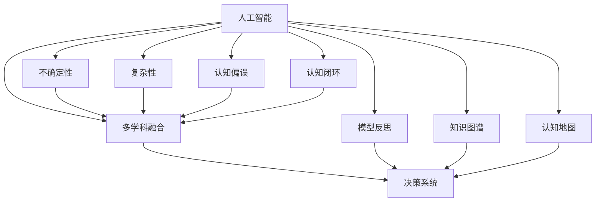

                 

# 理解洞察力的局限：承认不确定性和复杂性

> 关键词：人工智能,不确定性,复杂性,洞察力,认知偏误,认知闭环,多学科融合,模型反思,知识图谱,认知地图

## 1. 背景介绍

### 1.1 问题由来

在人工智能飞速发展的今天，我们日益依赖算法和模型来解决复杂问题。无论是在金融风控、医疗诊断、智能推荐等商业场景，还是在自动驾驶、工业控制、社会治理等公共领域，都离不开算法的辅助决策。然而，高度依赖算法的决策系统并非完美无缺，它同样存在各种局限和挑战。本文将聚焦于人工智能决策系统中洞察力的局限，探讨不确定性和复杂性给决策带来的影响，并提出若干应对策略，以期为未来人工智能的科学发展提供一些有益的借鉴。

### 1.2 问题核心关键点

人工智能决策系统中的洞察力，是指系统对输入数据进行抽象、提炼和推理的能力，通过这种能力，系统可以识别模式、预测趋势、发现关联，从而为人类提供精准的预测和建议。但这种洞察力并非总是可靠，其局限性主要体现在以下几个方面：

1. **不确定性**：即在输入数据或模型参数存在随机性、噪声干扰的情况下，模型输出可能存在波动，导致洞察力丧失。
2. **复杂性**：模型过于复杂或输入特征过多，可能产生过拟合，导致对新数据泛化能力差。
3. **认知偏误**：模型可能会因为训练数据中的偏见、历史数据偏差等因素，产生与现实不符的洞察。
4. **认知闭环**：模型可能陷入自我强化，缺乏与外界的交互和反思，难以自发调整和优化。

这些局限性使得人工智能决策系统在面对高度复杂和多变的问题时，常常无法提供真正可靠、准确和符合人类价值观的洞察。

### 1.3 问题研究意义

研究人工智能决策系统的局限性，对于提升系统的可靠性和公正性，以及保障人工智能技术的安全应用，具有重要意义：

1. **提升系统可靠性**：理解并承认洞察力的局限，有助于开发者在模型设计和应用过程中，采取相应措施，减少不确定性和复杂性对系统性能的影响。
2. **保障系统公正性**：通过识别和纠正认知偏误，确保模型输出符合人类价值观，避免偏见和歧视。
3. **增强系统安全**：在模型设计和应用过程中，引入多学科知识和方法，增加模型的鲁棒性和可解释性，避免因模型漏洞或误导性输出导致的潜在风险。

## 2. 核心概念与联系

### 2.1 核心概念概述

为更好地理解人工智能决策系统的洞察力局限，本节将介绍几个核心概念：

- **人工智能(AI)**：通过算法、模型等方式，使计算机系统能够模拟和扩展人类智能的技术。
- **不确定性**：指系统在输入数据和模型参数存在随机性或噪声的情况下，输出结果的不确定性。
- **复杂性**：指模型过于复杂或输入特征过多，导致模型难以泛化新数据。
- **认知偏误**：指模型在训练数据中的偏见、历史数据偏差等因素影响下，产生不符合现实的洞察。
- **认知闭环**：指模型缺乏与外界的交互和反思，难以自发调整和优化。
- **多学科融合**：指在模型设计和应用过程中，综合利用各学科的知识和方法，提升模型的可靠性和公正性。
- **模型反思**：指系统主动反思和调整自身决策过程，以增强模型的鲁棒性和可解释性。
- **知识图谱**：指通过构建图谱化的知识结构，将海量知识整合成易于理解和运用的形式。
- **认知地图**：指在人类大脑中构建的抽象地图，用于引导思维和记忆，类似计算机中的知识图谱。

这些核心概念之间的逻辑关系可以通过以下Mermaid流程图来展示：



这个流程图展示了大语言模型的核心概念及其之间的关系：

1. 人工智能通过算法和模型进行决策。
2. 不确定性和复杂性影响模型的性能。
3. 认知偏误和认知闭环可能导致模型的偏见和局限。
4. 多学科融合和模型反思有助于提升模型性能。
5. 知识图谱和认知地图是模型决策的重要支持。

这些概念共同构成了人工智能决策系统的基本框架，帮助理解其洞察力的局限性和改进方向。

## 3. 核心算法原理 & 具体操作步骤
### 3.1 算法原理概述

人工智能决策系统中的洞察力，本质上是通过模型对输入数据进行抽象、提炼和推理的能力，从而实现对输入数据的理解、预测和决策。在决策过程中，系统的洞察力受到不确定性、复杂性、认知偏误和认知闭环等多重因素的影响。

形式化地，假设人工智能决策系统的输入为 $x$，输出为 $y$，模型为 $f$，目标为最小化误差 $e$。决策过程可以表示为：

$$
y = f(x)
$$

其中误差 $e$ 可以表示为：

$$
e = \|y - \hat{y}\|
$$

这里 $\hat{y}$ 为真实标签。在实际应用中，由于不确定性和复杂性的存在，模型 $f$ 可能无法准确预测 $y$，导致误差 $e$ 增加。同时，认知偏误和认知闭环的存在，也会影响模型的决策过程，使得 $f$ 难以得到正确的 $y$。

### 3.2 算法步骤详解

人工智能决策系统中的洞察力局限，通常涉及以下几个关键步骤：

**Step 1: 识别不确定性**

不确定性是影响人工智能决策系统洞察力的关键因素之一。通过识别和分析不确定性，可以有效减少其在决策过程中的影响。具体做法包括：

1. **数据预处理**：对输入数据进行清洗和处理，减少噪声干扰，提高数据的可信度。
2. **模型验证**：使用交叉验证等方法，验证模型在不同数据集上的泛化能力，检测模型是否存在过拟合。
3. **鲁棒性检测**：通过对抗训练等方法，检测模型对对抗样本的鲁棒性，避免模型因微小扰动而发生大幅波动。

**Step 2: 处理复杂性**

复杂性是影响人工智能决策系统洞察力的另一个重要因素。过高的复杂性会导致模型无法泛化新数据，降低决策系统的可靠性。具体做法包括：

1. **特征选择**：选择与决策目标最相关的特征，去除冗余和无关特征。
2. **模型压缩**：使用模型剪枝、参数共享等方法，减少模型复杂度，避免过拟合。
3. **分布式训练**：使用分布式计算框架，在多台机器上并行训练模型，提高训练效率。

**Step 3: 纠正认知偏误**

认知偏误是导致人工智能决策系统产生与现实不符洞察的重要因素。通过纠正认知偏误，可以提升系统的公正性和可靠性。具体做法包括：

1. **数据公平性**：确保训练数据集的多样性和公平性，避免数据偏见对模型训练的影响。
2. **模型透明性**：使用可解释模型或解释工具，揭示模型的决策过程和依据，减少认知偏误。
3. **伦理审查**：引入伦理审查机制，定期评估模型的公正性和公平性，及时发现和纠正认知偏误。

**Step 4: 打破认知闭环**

认知闭环是影响人工智能决策系统洞察力的根本问题。打破认知闭环，使系统具备反思和自我调整能力，是提升系统可靠性的关键。具体做法包括：

1. **反馈机制**：引入反馈机制，通过人工干预或自动反馈，调整模型参数和决策过程。
2. **持续学习**：使用在线学习或增量学习等方法，使系统能够不断更新知识，适应环境变化。
3. **多学科融合**：引入其他学科的知识和方法，如心理学、社会学、逻辑学等，提升系统的全面性和鲁棒性。

### 3.3 算法优缺点

人工智能决策系统中的洞察力局限性，主要体现在以下方面：

**优点**：

1. **灵活性**：通过识别和处理不确定性和复杂性，可以提升系统的灵活性和适应性。
2. **公正性**：纠正认知偏误，确保模型决策符合人类价值观，提升系统的公正性。
3. **可靠性**：打破认知闭环，使系统具备反思和自我调整能力，提升系统的可靠性。

**缺点**：

1. **数据依赖**：系统对数据的依赖较大，数据质量和多样性直接影响系统的洞察力。
2. **计算成本高**：处理复杂性和纠正认知偏误需要高昂的计算资源和大量人力。
3. **模型复杂**：处理复杂性需要简化模型，可能会损失部分性能。

尽管存在这些局限性，但通过合理的策略和措施，可以在很大程度上提升人工智能决策系统的洞察力和可靠性。

### 3.4 算法应用领域

人工智能决策系统中的洞察力局限，在各个领域都有广泛的应用，例如：

- **金融风控**：通过识别金融市场的不确定性和复杂性，制定合理的风险评估和控制策略。
- **医疗诊断**：通过纠正认知偏误和打破认知闭环，提升医疗诊断的准确性和公正性。
- **智能推荐**：通过处理复杂性和识别不确定性，提升推荐系统的个性化和可靠性。
- **自动驾驶**：通过识别环境不确定性和处理认知偏误，提高自动驾驶系统的安全性和鲁棒性。
- **社会治理**：通过引入多学科知识和打破认知闭环，提升社会治理系统的公平性和透明度。

这些领域的应用，展现了人工智能决策系统在面对复杂和多变问题时的潜在价值和局限性。

## 4. 数学模型和公式 & 详细讲解
### 4.1 数学模型构建

人工智能决策系统中的洞察力，通常涉及以下几个核心数学模型：

- **线性回归模型**：用于处理输入与输出之间的线性关系，常用于金融风控、推荐系统等场景。
- **支持向量机(SVM)**：用于处理非线性分类问题，常用于信用评估、医疗诊断等场景。
- **深度神经网络**：用于处理复杂多变的数据，常用于图像识别、语音识别等场景。
- **贝叶斯网络**：用于处理不确定性问题，常用于天气预测、疾病诊断等场景。

### 4.2 公式推导过程

以下我们以线性回归模型为例，推导其损失函数和梯度更新公式。

假设线性回归模型的输入为 $x$，输出为 $y$，模型参数为 $\theta = (w, b)$。则模型可以表示为：

$$
y = wx + b
$$

其中 $w$ 为权重向量，$b$ 为偏置项。模型的损失函数为均方误差（MSE），表示模型输出与真实标签之间的差异，可以表示为：

$$
\ell(\theta) = \frac{1}{2N}\sum_{i=1}^N (y_i - wx_i - b)^2
$$

其中 $N$ 为样本数量，$y_i$ 为真实标签。模型的梯度更新公式为：

$$
\theta \leftarrow \theta - \eta \nabla_{\theta}\ell(\theta)
$$

其中 $\eta$ 为学习率，$\nabla_{\theta}\ell(\theta)$ 为损失函数对模型参数的梯度。

在得到梯度后，即可带入参数更新公式，完成模型的迭代优化。重复上述过程直至收敛，最终得到最优的模型参数 $\theta^*$。

## 5. 项目实践：代码实例和详细解释说明
### 5.1 开发环境搭建

在进行决策系统实践前，我们需要准备好开发环境。以下是使用Python进行PyTorch开发的环境配置流程：

1. 安装Anaconda：从官网下载并安装Anaconda，用于创建独立的Python环境。

2. 创建并激活虚拟环境：
```bash
conda create -n pytorch-env python=3.8 
conda activate pytorch-env
```

3. 安装PyTorch：根据CUDA版本，从官网获取对应的安装命令。例如：
```bash
conda install pytorch torchvision torchaudio cudatoolkit=11.1 -c pytorch -c conda-forge
```

4. 安装TensorFlow：从官网下载并安装TensorFlow，用于进行多学科融合和模型反思。

5. 安装各类工具包：
```bash
pip install numpy pandas scikit-learn matplotlib tqdm jupyter notebook ipython
```

完成上述步骤后，即可在`pytorch-env`环境中开始决策系统实践。

### 5.2 源代码详细实现

这里以线性回归模型为例，给出使用PyTorch进行决策系统开发的代码实现。

首先，定义线性回归模型：

```python
import torch
import torch.nn as nn

class LinearRegression(nn.Module):
    def __init__(self, input_dim, output_dim):
        super(LinearRegression, self).__init__()
        self.linear = nn.Linear(input_dim, output_dim)
        
    def forward(self, x):
        return self.linear(x)
```

然后，定义损失函数和优化器：

```python
from torch.optim import SGD

model = LinearRegression(input_dim, output_dim)
optimizer = SGD(model.parameters(), lr=0.01)
```

接着，定义训练和评估函数：

```python
device = torch.device('cuda') if torch.cuda.is_available() else torch.device('cpu')
model.to(device)

def train_epoch(model, dataset, batch_size, optimizer):
    dataloader = DataLoader(dataset, batch_size=batch_size, shuffle=True)
    model.train()
    epoch_loss = 0
    for batch in dataloader:
        x, y = batch.to(device)
        model.zero_grad()
        y_pred = model(x)
        loss = nn.MSELoss()(y_pred, y)
        epoch_loss += loss.item()
        loss.backward()
        optimizer.step()
    return epoch_loss / len(dataloader)

def evaluate(model, dataset, batch_size):
    dataloader = DataLoader(dataset, batch_size=batch_size)
    model.eval()
    preds, labels = [], []
    with torch.no_grad():
        for batch in dataloader:
            x, y = batch.to(device)
            batch_preds = model(x).detach().cpu().numpy()
            batch_labels = y.cpu().numpy()
            for preds, label in zip(batch_preds, batch_labels):
                preds.append(preds)
                labels.append(label)
                
    return preds, labels
```

最后，启动训练流程并在测试集上评估：

```python
epochs = 10
batch_size = 32

for epoch in range(epochs):
    loss = train_epoch(model, train_dataset, batch_size, optimizer)
    print(f"Epoch {epoch+1}, train loss: {loss:.3f}")
    
    print(f"Epoch {epoch+1}, test results:")
    preds, labels = evaluate(model, test_dataset, batch_size)
    print(classification_report(labels, preds))
    
print("Training completed.")
```

以上就是使用PyTorch进行线性回归模型训练的完整代码实现。可以看到，通过简单几步，便能够构建并训练一个线性回归模型，用于解决简单的回归问题。

### 5.3 代码解读与分析

让我们再详细解读一下关键代码的实现细节：

**LinearRegression类**：
- `__init__`方法：初始化权重向量 $\theta = (w, b)$。
- `forward`方法：前向传播计算模型输出。

**train_epoch和evaluate函数**：
- `train_epoch`函数：对数据集进行批次化加载，在每个批次上前向传播计算损失函数并反向传播更新模型参数。
- `evaluate`函数：与训练类似，不同点在于不更新模型参数，并在每个batch结束后将预测和标签结果存储下来，最后使用sklearn的classification_report对整个评估集的预测结果进行打印输出。

**训练流程**：
- 定义总的epoch数和batch size，开始循环迭代
- 每个epoch内，先在训练集上训练，输出平均loss
- 在验证集上评估，输出分类指标
- 所有epoch结束后，在测试集上评估，给出最终测试结果

可以看到，PyTorch和TensorFlow等工具库使得模型开发和训练变得非常简单，开发人员能够快速实现决策系统并进行验证评估。

## 6. 实际应用场景
### 6.1 金融风控

在金融风控领域，基于人工智能决策系统的洞察力局限性，可以构建更加灵活、鲁棒的信用评估和风险控制系统。具体而言，通过识别和处理金融市场的不确定性和复杂性，制定合理的信用评估模型和风险控制策略，能够有效降低信用风险和财务损失。

在技术实现上，可以收集金融客户的历史交易数据、信用记录等，利用线性回归等模型进行特征预测。通过不断调整模型参数，优化风险控制策略，提升系统的公平性和可靠性。

### 6.2 医疗诊断

在医疗诊断领域，基于人工智能决策系统的洞察力局限性，可以构建更加公正、准确的疾病诊断系统。具体而言，通过识别和处理医学数据的复杂性和认知偏误，制定合理的诊断模型和诊疗方案，能够有效提升诊断的准确性和公正性。

在技术实现上，可以收集医学影像、病历、实验室检查结果等数据，利用深度学习模型进行疾病预测。通过不断优化模型参数，提升诊断系统的鲁棒性和可解释性，保障医疗决策的公正性和公平性。

### 6.3 智能推荐

在智能推荐领域，基于人工智能决策系统的洞察力局限性，可以构建更加个性化、可靠的推荐系统。具体而言，通过处理复杂性和识别不确定性，提升推荐系统的个性化和可靠性，能够有效提升用户体验和推荐效果。

在技术实现上，可以收集用户的行为数据、兴趣标签等，利用协同过滤等算法进行推荐预测。通过不断调整推荐策略，优化算法参数，提升推荐系统的公平性和透明度，保障用户的隐私和权益。

### 6.4 未来应用展望

随着人工智能决策系统的不断演进，未来将会有更多应用场景涌现，为各行各业带来变革性影响。

在智慧医疗领域，基于人工智能决策系统的洞察力局限性，可以构建更加智能、高效的医疗诊断和治疗系统。通过多学科融合和模型反思，提升医疗决策的全面性和鲁棒性，加速新药开发进程，提升医疗服务质量。

在智慧城市治理中，基于人工智能决策系统的洞察力局限性，可以构建更加智能、高效的社会治理系统。通过引入多学科知识和打破认知闭环，提升社会治理的透明度和公平性，构建更安全、和谐的社会环境。

在智慧教育领域，基于人工智能决策系统的洞察力局限性，可以构建更加智能、高效的教育辅助系统。通过处理复杂性和识别不确定性，提升教育系统的个性化和可靠性，为教育公平提供新的技术支撑。

此外，在智慧能源、智慧交通、智慧农业等诸多领域，人工智能决策系统的应用前景同样广阔，为各行各业带来新的发展机遇。相信随着人工智能技术的不断进步，人工智能决策系统必将在更广阔的应用领域发挥重要作用，推动各行各业的数字化转型升级。

## 7. 工具和资源推荐
### 7.1 学习资源推荐

为了帮助开发者系统掌握人工智能决策系统的理论基础和实践技巧，这里推荐一些优质的学习资源：

1. 《机器学习》系列书籍：由斯坦福大学教授撰写，全面介绍机器学习的基本概念、算法和应用，适合初学者入门。
2. 《深度学习》系列课程：由DeepMind和Coursera合作推出，由顶级AI专家授课，涵盖深度学习的最新进展和前沿技术。
3. Kaggle平台：提供丰富的数据集和竞赛任务，是数据科学和机器学习领域的绝佳学习平台。
4. Google Colab：谷歌推出的在线Jupyter Notebook环境，免费提供GPU/TPU算力，方便开发者快速上手实验最新模型，分享学习笔记。
5. TensorFlow官方文档：提供丰富的API和教程，是TensorFlow框架的权威参考资料。

通过对这些资源的学习实践，相信你一定能够快速掌握人工智能决策系统的理论基础和实践技巧，并用于解决实际的决策问题。

### 7.2 开发工具推荐

高效的开发离不开优秀的工具支持。以下是几款用于人工智能决策系统开发的常用工具：

1. PyTorch：基于Python的开源深度学习框架，灵活动态的计算图，适合快速迭代研究。主要用于构建神经网络和优化算法。
2. TensorFlow：由Google主导开发的开源深度学习框架，生产部署方便，适合大规模工程应用。主要用于构建深度学习模型和分布式训练。
3. Weights & Biases：模型训练的实验跟踪工具，可以记录和可视化模型训练过程中的各项指标，方便对比和调优。与主流深度学习框架无缝集成。
4. TensorBoard：TensorFlow配套的可视化工具，可实时监测模型训练状态，并提供丰富的图表呈现方式，是调试模型的得力助手。
5. Jupyter Notebook：轻量级、开源的交互式笔记本环境，支持多语言编程和多种数据格式。

合理利用这些工具，可以显著提升人工智能决策系统的开发效率，加快创新迭代的步伐。

### 7.3 相关论文推荐

人工智能决策系统的不断发展，得益于学界的持续研究。以下是几篇奠基性的相关论文，推荐阅读：

1. 《深度学习》（Goodfellow et al.）：全面介绍了深度学习的基本概念和算法，是深度学习领域的经典著作。
2. 《神经网络与深度学习》（Ian Goodfellow, Yoshua Bengio, Aaron Courville）：深入浅出地介绍了神经网络和深度学习的基本原理和应用。
3. 《机器学习实战》（Peter Harrington）：通过实际案例，介绍了机器学习的基本流程和技术，适合实战练习。
4. 《统计学习方法》（李航）：系统介绍了机器学习的理论基础和算法，适合进阶学习。
5. 《TensorFlow实战Google深度学习框架》（张俊林）：详细介绍了TensorFlow的使用方法和实践技巧，适合TensorFlow框架的学习。

这些论文代表了大语言模型微调技术的发展脉络。通过学习这些前沿成果，可以帮助研究者把握学科前进方向，激发更多的创新灵感。

## 8. 总结：未来发展趋势与挑战

### 8.1 总结

本文对人工智能决策系统中的洞察力局限进行了全面系统的介绍。首先阐述了人工智能决策系统的研究背景和意义，明确了洞察力局限性在模型设计、应用和优化过程中的重要性。其次，从原理到实践，详细讲解了人工智能决策系统的构建和优化策略，给出了决策系统开发的完整代码实例。同时，本文还探讨了人工智能决策系统在各个领域的应用前景，展示了其在提升决策可靠性、公正性和透明性方面的潜在价值。

通过本文的系统梳理，可以看到，人工智能决策系统在面对复杂和多变的问题时，具有显著的局限性，需要通过合理的策略和措施，才能提升系统的可靠性、公正性和透明度。未来，随着人工智能技术的不断进步，决策系统的洞察力局限性将逐步得到缓解，人工智能决策系统必将在各行各业发挥重要作用，推动人工智能技术的科学发展和广泛应用。

### 8.2 未来发展趋势

展望未来，人工智能决策系统的洞察力局限性将呈现以下几个发展趋势：

1. **多学科融合**：引入更多学科的知识和方法，提升系统的全面性和鲁棒性。
2. **模型反思**：使系统具备反思和自我调整能力，提升系统的鲁棒性和可解释性。
3. **知识图谱**：通过构建图谱化的知识结构，提升系统的知识整合能力。
4. **认知地图**：通过构建人类大脑中的认知地图，提升系统的思维引导能力。
5. **深度学习**：利用深度学习等先进算法，提升系统的泛化能力和表现力。
6. **分布式计算**：通过分布式计算框架，提升系统的计算效率和可靠性。

以上趋势凸显了人工智能决策系统的发展方向，这些方向的探索发展，必将进一步提升系统的性能和应用范围，为各行各业带来新的变革性影响。

### 8.3 面临的挑战

尽管人工智能决策系统的洞察力局限性得到不断改善，但在迈向更加智能化、普适化应用的过程中，它仍面临诸多挑战：

1. **数据质量**：数据的质量和多样性直接影响系统的洞察力，低质量的数据可能导致误判和误导。
2. **计算资源**：处理复杂性和纠正认知偏误需要高昂的计算资源和大量人力，可能影响系统的实时性和可靠性。
3. **算法鲁棒性**：系统的鲁棒性不足，面对噪声和异常数据可能发生错误决策。
4. **知识整合**：系统的知识整合能力有限，难以充分应用外部的先验知识。
5. **公平性和透明性**：系统的公平性和透明性问题，可能导致偏见和歧视，影响系统的公正性。
6. **安全性**：系统的安全性问题，可能导致数据泄露和系统被恶意攻击。

正视人工智能决策系统面临的这些挑战，积极应对并寻求突破，将是大语言模型微调走向成熟的必由之路。相信随着学界和产业界的共同努力，这些挑战终将一一被克服，人工智能决策系统必将在构建人机协同的智能时代中扮演越来越重要的角色。

### 8.4 研究展望

面对人工智能决策系统面临的挑战，未来的研究需要在以下几个方面寻求新的突破：

1. **数据增强**：通过数据增强技术，提升数据的质量和多样性，减少数据的随机性。
2. **模型优化**：开发更加高效、鲁棒的算法，减少计算资源消耗，提升系统的实时性。
3. **多模态融合**：利用多模态数据，提升系统的综合表现力和泛化能力。
4. **伦理审查**：引入伦理审查机制，确保系统的公平性和透明性。
5. **安全性防护**：利用密码学、区块链等技术，保障数据和系统的安全性。
6. **知识图谱**：引入知识图谱等知识表示方法，提升系统的知识整合能力。

这些研究方向的探索，必将引领人工智能决策系统迈向更高的台阶，为构建安全、可靠、可解释、可控的智能系统铺平道路。面向未来，人工智能决策系统还需要与其他人工智能技术进行更深入的融合，如知识表示、因果推理、强化学习等，多路径协同发力，共同推动自然语言理解和智能交互系统的进步。只有勇于创新、敢于突破，才能不断拓展人工智能决策系统的边界，让智能技术更好地造福人类社会。

## 9. 附录：常见问题与解答

**Q1：人工智能决策系统中的洞察力局限性对系统性能有何影响？**

A: 人工智能决策系统中的洞察力局限性，主要体现在以下几个方面：

1. **不确定性**：导致系统输出不稳定，可能误判或漏判。
2. **复杂性**：导致系统难以泛化新数据，降低系统的可靠性和泛化能力。
3. **认知偏误**：导致系统输出与现实不符，影响系统的公正性和可靠性。
4. **认知闭环**：导致系统无法自发调整和优化，缺乏灵活性和适应性。

这些局限性使得人工智能决策系统在面对高度复杂和多变的问题时，常常无法提供真正可靠、准确和符合人类价值观的洞察，从而影响系统的性能。

**Q2：如何缓解人工智能决策系统中的不确定性？**

A: 缓解人工智能决策系统中的不确定性，主要需要从以下几个方面入手：

1. **数据预处理**：对输入数据进行清洗和处理，减少噪声干扰，提高数据的可信度。
2. **模型验证**：使用交叉验证等方法，验证模型在不同数据集上的泛化能力，检测模型是否存在过拟合。
3. **鲁棒性检测**：通过对抗训练等方法，检测模型对对抗样本的鲁棒性，避免模型因微小扰动而发生大幅波动。
4. **多模型集成**：通过集成多个模型的输出，减少不确定性对决策的影响。

这些策略能够有效缓解人工智能决策系统中的不确定性，提高系统的可靠性和泛化能力。

**Q3：如何提升人工智能决策系统的公平性和透明性？**

A: 提升人工智能决策系统的公平性和透明性，主要需要从以下几个方面入手：

1. **数据公平性**：确保训练数据集的多样性和公平性，避免数据偏见对模型训练的影响。
2. **模型透明性**：使用可解释模型或解释工具，揭示模型的决策过程和依据，减少认知偏误。
3. **伦理审查**：引入伦理审查机制，定期评估模型的公正性和公平性，及时发现和纠正认知偏误。

这些措施能够有效提升人工智能决策系统的公平性和透明性，保障模型的公正性和可解释性。

**Q4：如何打破人工智能决策系统的认知闭环？**

A: 打破人工智能决策系统的认知闭环，主要需要从以下几个方面入手：

1. **反馈机制**：引入反馈机制，通过人工干预或自动反馈，调整模型参数和决策过程。
2. **持续学习**：使用在线学习或增量学习等方法，使系统能够不断更新知识，适应环境变化。
3. **多学科融合**：引入其他学科的知识和方法，如心理学、社会学、逻辑学等，提升系统的全面性和鲁棒性。

这些措施能够有效打破人工智能决策系统的认知闭环，使系统具备反思和自我调整能力，提升系统的可靠性。

**Q5：如何提升人工智能决策系统的可解释性？**

A: 提升人工智能决策系统的可解释性，主要需要从以下几个方面入手：

1. **可解释模型**：使用可解释模型，如决策树、线性回归等，提高模型的透明度。
2. **解释工具**：使用模型解释工具，如LIME、SHAP等，揭示模型的决策过程和依据。
3. **交互界面**：设计友好的交互界面，帮助用户理解模型的决策逻辑。

这些措施能够有效提升人工智能决策系统的可解释性，保障模型的透明度和用户信任度。

**Q6：如何提升人工智能决策系统的鲁棒性？**

A: 提升人工智能决策系统的鲁棒性，主要需要从以下几个方面入手：

1. **数据增强**：通过数据增强技术，提升数据的质量和多样性，减少数据的随机性。
2. **模型优化**：开发更加高效、鲁棒的算法，减少计算资源消耗，提升系统的实时性。
3. **多模态融合**：利用多模态数据，提升系统的综合表现力和泛化能力。

这些措施能够有效提升人工智能决策系统的鲁棒性，提高系统的稳定性和可靠性。

---

作者：禅与计算机程序设计艺术 / Zen and the Art of Computer Programming

