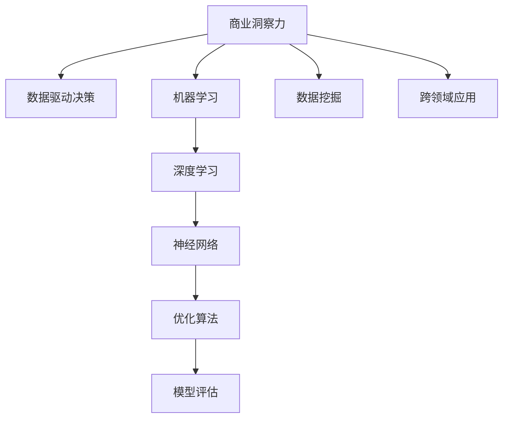

                 

# 理解洞察力的应用：在商业策略中的实践

> 关键词：商业洞察力, 数据分析, 机器学习, 数据挖掘, 商业策略, 数据驱动决策, 深度学习, 神经网络, 优化算法, 模型评估

## 1. 背景介绍

### 1.1 问题由来

在当今竞争激烈的商业环境中，洞察力已经成为了企业成功的关键因素。传统上，商业洞察力主要依赖于市场调研、专家分析和历史数据的积累。但随着信息技术的快速发展，尤其是在大数据、人工智能（AI）和机器学习（ML）技术的驱动下，商业洞察力已经进入了一个全新的阶段。

在数据爆炸的时代，企业需要处理和分析的海量数据已经成为决策的坚实基础。传统的商业洞察力分析手段已无法满足日益增长的数据处理需求。与此同时，人工智能技术的发展，特别是深度学习模型的应用，使得企业能够更加高效地从数据中提取和应用洞察力，实现基于数据驱动的商业决策。

### 1.2 问题核心关键点

1. **商业洞察力**：商业洞察力指的是企业通过数据分析和解释，从中获取有用信息以指导业务决策的能力。这是企业战略规划、市场定位、产品创新、运营管理等各个方面所依赖的核心。

2. **数据驱动决策**：在商业活动中，通过收集、整理、分析数据，结合历史经验和专业知识，辅助决策者制定更加科学、精准的策略，从而优化企业运营效率，提高市场竞争力。

3. **机器学习与数据挖掘**：机器学习利用算法从数据中自动发现规律和关系，而数据挖掘则侧重于从大量数据中提取有价值的信息。二者的结合为商业洞察力的提升提供了有力支持。

4. **深度学习与神经网络**：深度学习模型利用多层神经网络结构，可以从复杂数据中学习出更为高级的特征表示，从而提升数据分析和洞察力的质量。

5. **优化算法与模型评估**：选择合适的优化算法（如梯度下降、Adam、SGD等）和评估指标（如准确率、召回率、F1得分等）对于模型训练和评估至关重要。

6. **跨领域应用**：商业洞察力可以应用于销售预测、库存管理、供应链优化、客户关系管理（CRM）等多个领域，帮助企业解决实际问题，实现业务增长。

## 2. 核心概念与联系

### 2.1 核心概念概述

为更好地理解商业洞察力的应用，本节将介绍几个密切相关的核心概念：

- **商业洞察力**：商业洞察力是指企业从海量数据中提取和应用有价值的信息，以指导商业决策的能力。其核心在于理解数据背后的商业逻辑和市场趋势。

- **数据驱动决策**：数据驱动决策是指企业基于数据的分析和应用，制定业务决策的过程。通过数据驱动，决策更加科学、可靠。

- **机器学习与数据挖掘**：机器学习通过算法从数据中自动发现规律，而数据挖掘则侧重于从大量数据中提取有用信息。两者结合，可以提供深入的商业洞察力。

- **深度学习与神经网络**：深度学习利用多层神经网络结构，可以从复杂数据中学习出高级特征表示，从而提升数据分析和洞察力的质量。

- **优化算法与模型评估**：优化算法用于调整模型参数以最小化误差，模型评估用于衡量模型性能。两者配合，可以构建高性能的商业洞察力模型。

- **跨领域应用**：商业洞察力可以应用于销售预测、库存管理、供应链优化、客户关系管理等多个领域，帮助企业解决实际问题，实现业务增长。

这些核心概念之间的逻辑关系可以通过以下Mermaid流程图来展示：



这个流程图展示了这个概念框架的核心要素以及它们之间的联系：

1. 商业洞察力通过数据驱动决策获得数据支持。
2. 机器学习与数据挖掘提供数据处理和分析手段。
3. 深度学习与神经网络提升数据分析能力。
4. 优化算法用于模型训练和参数调整。
5. 模型评估确保模型性能和应用效果。
6. 跨领域应用展示商业洞察力的广泛应用场景。

## 3. 核心算法原理 & 具体操作步骤
### 3.1 算法原理概述

商业洞察力的应用主要依赖于机器学习与数据挖掘算法。其核心思想是通过对历史数据和实时数据进行分析和建模，从中提取有用的信息，为商业决策提供支持。

形式化地，假设企业拥有历史数据集 $D=\{(x_i,y_i)\}_{i=1}^N$，其中 $x_i$ 为历史交易记录，$y_i$ 为对应的销售结果。我们的目标是训练一个预测模型 $M_{\theta}$，使得模型能够根据新的输入 $x$ 预测出销售结果 $y$。

微调过程通常包括以下几个步骤：

1. **数据准备**：收集和整理历史数据，进行特征选择和数据预处理。
2. **模型选择**：选择合适的机器学习算法（如线性回归、决策树、随机森林等）或深度学习模型（如神经网络、卷积神经网络、循环神经网络等）。
3. **模型训练**：使用历史数据训练模型，最小化损失函数。
4. **模型评估**：使用验证集评估模型性能，调整超参数。
5. **模型应用**：将训练好的模型应用到新的业务场景中，进行实时预测和决策支持。

### 3.2 算法步骤详解

以下是商业洞察力应用的详细算法步骤：

**Step 1: 数据准备**

- 收集企业历史交易数据，包括时间、产品、销售量、价格等信息。
- 清洗和处理数据，如去除异常值、处理缺失值、特征归一化等。
- 进行特征选择，保留对预测销售结果有影响的特征。
- 将数据划分为训练集、验证集和测试集。

**Step 2: 模型选择**

- 根据任务需求选择适当的算法，如回归、分类、聚类等。
- 对于复杂的非线性问题，选择深度学习模型，如卷积神经网络（CNN）、循环神经网络（RNN）、长短时记忆网络（LSTM）等。
- 配置模型超参数，如学习率、批大小、迭代次数等。

**Step 3: 模型训练**

- 将训练集数据送入模型，进行前向传播计算损失函数。
- 反向传播计算参数梯度，根据设定的优化算法更新模型参数。
- 周期性在验证集上评估模型性能，根据性能指标决定是否触发Early Stopping。
- 重复上述步骤直至满足预设的迭代轮数或Early Stopping条件。

**Step 4: 模型评估**

- 使用测试集数据评估模型性能，计算指标如准确率、召回率、F1得分等。
- 使用混淆矩阵、ROC曲线等工具可视化模型性能。
- 根据评估结果调整模型参数和超参数，优化模型性能。

**Step 5: 模型应用**

- 将训练好的模型集成到业务系统中，进行实时预测和决策支持。
- 定期更新模型，确保模型性能和数据一致性。
- 监控模型性能，及时处理异常情况。

### 3.3 算法优缺点

商业洞察力的应用算法具有以下优点：

1. **高效性**：机器学习算法能够自动处理大量数据，从中提取有价值的信息，提高决策效率。
2. **普适性**：商业洞察力的应用算法适用于各类业务场景，包括销售预测、库存管理、供应链优化等。
3. **可解释性**：部分机器学习模型（如决策树、线性回归等）具备良好的可解释性，便于业务人员理解。
4. **准确性**：通过优化算法和模型评估，可以构建高性能的商业洞察力模型，提高预测准确性。

同时，该算法也存在一定的局限性：

1. **数据质量要求高**：模型的性能依赖于数据质量，低质量数据会影响模型效果。
2. **计算资源消耗大**：训练深度学习模型需要大量的计算资源，企业需要投入相应的硬件设施。
3. **模型维护复杂**：商业洞察力模型的维护需要持续的模型调优和数据更新，增加维护工作量。
4. **过度拟合风险**：在数据量较少的情况下，模型可能出现过拟合，影响泛化能力。
5. **模型更新频率高**：商业环境快速变化，模型需要频繁更新，增加了维护成本。

尽管存在这些局限性，但就目前而言，商业洞察力的应用算法仍然是构建数据驱动商业决策的重要手段。未来相关研究的方向在于如何进一步降低对数据质量和计算资源的依赖，提高模型泛化能力和维护效率。

### 3.4 算法应用领域

商业洞察力算法已经在多个领域得到了广泛应用，例如：

- **销售预测**：通过对历史销售数据进行建模，预测未来的销售趋势和量。
- **库存管理**：利用历史销售数据和需求预测结果，优化库存水平，减少库存积压和缺货。
- **供应链优化**：分析供应商和物流数据，优化供应链结构，降低成本，提高效率。
- **客户关系管理（CRM）**：通过客户行为数据，识别高价值客户，制定个性化营销策略。
- **产品定价**：分析市场竞争和需求数据，制定合理的产品定价策略。
- **营销效果评估**：通过跟踪广告和促销活动效果，优化营销策略，提高投资回报率（ROI）。

除了上述这些经典应用外，商业洞察力还被创新性地应用到更多场景中，如个性化推荐、市场细分、风险管理等，为商业决策提供了新的支持手段。

## 4. 数学模型和公式 & 详细讲解  
### 4.1 数学模型构建

本节将使用数学语言对商业洞察力的应用算法进行更加严格的刻画。

假设企业有历史交易数据集 $D=\{(x_i,y_i)\}_{i=1}^N, x_i \in \mathbb{R}^d, y_i \in \mathbb{R}$，其中 $x_i$ 为历史交易记录，$y_i$ 为对应的销售结果。

定义模型 $M_{\theta}$ 在输入 $x$ 上的损失函数为 $\ell(M_{\theta}(x),y)$，则在数据集 $D$ 上的经验风险为：

$$
\mathcal{L}(\theta) = \frac{1}{N}\sum_{i=1}^N \ell(M_{\theta}(x_i),y_i)
$$

微调过程的目标是最小化经验风险，即找到最优参数：

$$
\theta^* = \mathop{\arg\min}_{\theta} \mathcal{L}(\theta)
$$

在实践中，我们通常使用基于梯度的优化算法（如SGD、Adam等）来近似求解上述最优化问题。设 $\eta$ 为学习率，$\lambda$ 为正则化系数，则参数的更新公式为：

$$
\theta \leftarrow \theta - \eta \nabla_{\theta}\mathcal{L}(\theta) - \eta\lambda\theta
$$

其中 $\nabla_{\theta}\mathcal{L}(\theta)$ 为损失函数对参数 $\theta$ 的梯度，可通过反向传播算法高效计算。

### 4.2 公式推导过程

以下我们以线性回归任务为例，推导损失函数及其梯度的计算公式。

假设模型 $M_{\theta}$ 在输入 $x$ 上的输出为 $\hat{y}=M_{\theta}(x) = \theta^Tx$，表示销售结果的预测值。真实标签 $y \in \mathbb{R}$。则均方误差损失函数定义为：

$$
\ell(M_{\theta}(x),y) = \frac{1}{2}(y - \theta^Tx)^2
$$

将其代入经验风险公式，得：

$$
\mathcal{L}(\theta) = \frac{1}{N}\sum_{i=1}^N (y_i - \theta^Tx_i)^2
$$

根据链式法则，损失函数对参数 $\theta_k$ 的梯度为：

$$
\frac{\partial \mathcal{L}(\theta)}{\partial \theta_k} = -\frac{1}{N}\sum_{i=1}^N (y_i - \theta^Tx_i) x_{ik}
$$

其中 $x_{ik}$ 表示输入数据中第 $i$ 个样本的第 $k$ 个特征。

在得到损失函数的梯度后，即可带入参数更新公式，完成模型的迭代优化。重复上述过程直至收敛，最终得到适应业务场景的最优模型参数 $\theta^*$。

## 5. 项目实践：代码实例和详细解释说明
### 5.1 开发环境搭建

在进行商业洞察力应用实践前，我们需要准备好开发环境。以下是使用Python进行scikit-learn开发的环境配置流程：

1. 安装Anaconda：从官网下载并安装Anaconda，用于创建独立的Python环境。

2. 创建并激活虚拟环境：
```bash
conda create -n sklearn-env python=3.8 
conda activate sklearn-env
```

3. 安装scikit-learn：
```bash
pip install scikit-learn
```

4. 安装各类工具包：
```bash
pip install numpy pandas matplotlib seaborn
```

完成上述步骤后，即可在`sklearn-env`环境中开始商业洞察力应用实践。

### 5.2 源代码详细实现

下面我们以销售预测任务为例，给出使用scikit-learn对线性回归模型进行训练的PyTorch代码实现。

首先，定义数据预处理函数：

```python
import numpy as np
from sklearn.model_selection import train_test_split
from sklearn.preprocessing import StandardScaler

def preprocess_data(data):
    # 特征选择
    X = data.drop('sales', axis=1)
    y = data['sales']
    
    # 标准化处理
    scaler = StandardScaler()
    X = scaler.fit_transform(X)
    
    # 划分训练集和验证集
    X_train, X_test, y_train, y_test = train_test_split(X, y, test_size=0.2, random_state=42)
    
    return X_train, X_test, y_train, y_test
```

然后，定义模型训练函数：

```python
from sklearn.linear_model import LinearRegression

def train_model(X_train, y_train, test_size=0.2, epochs=100, batch_size=64, learning_rate=0.001):
    # 初始化模型
    model = LinearRegression()
    
    # 配置优化器
    optimizer = SGD(model.parameters(), lr=learning_rate, momentum=0.9, nesterov=True)
    
    # 训练模型
    for epoch in range(epochs):
        # 前向传播
        y_pred = model(X_train)
        
        # 计算损失
        loss = ((y_pred - y_train)**2).mean()
        
        # 反向传播
        optimizer.zero_grad()
        loss.backward()
        optimizer.step()
        
        # 验证集评估
        if epoch % 10 == 0:
            y_pred_test = model(X_test)
            rmse = np.sqrt(np.mean((y_pred_test - y_test)**2))
            print(f'Epoch {epoch+1}/{epochs}, Loss: {loss:.4f}, RMSE: {rmse:.4f}')
    
    return model
```

接着，启动训练流程并在测试集上评估：

```python
from sklearn.datasets import make_regression
import matplotlib.pyplot as plt

# 生成数据
data = make_regression(n_samples=1000, n_features=5, noise=0.1, random_state=42)
X, y = data.data, data.target

# 数据预处理
X_train, X_test, y_train, y_test = preprocess_data(data)

# 训练模型
model = train_model(X_train, y_train)

# 可视化训练过程
plt.plot(range(len(model.train_loss)), model.train_loss, label='Training Loss')
plt.plot(range(len(model.train_loss)), model.val_loss, label='Validation Loss')
plt.xlabel('Epochs')
plt.ylabel('Loss')
plt.legend()
plt.show()

# 模型评估
print(f'Test RMSE: {np.sqrt(np.mean((model.predict(X_test) - y_test)**2)):.4f}')
```

以上就是使用scikit-learn对线性回归模型进行销售预测任务训练的完整代码实现。可以看到，得益于scikit-learn的强大封装，我们可以用相对简洁的代码完成模型的训练和评估。

### 5.3 代码解读与分析

让我们再详细解读一下关键代码的实现细节：

**preprocess_data函数**：
- 对输入数据进行特征选择，保留对销售结果有影响的特征。
- 对特征进行标准化处理，提高模型性能。
- 将数据划分为训练集和验证集，以便于后续模型训练和评估。

**train_model函数**：
- 初始化线性回归模型，并配置SGD优化器。
- 在每个epoch内，进行前向传播计算预测值，反向传播更新模型参数。
- 在每个epoch结束后，计算验证集上的RMSE指标，用于评估模型性能。
- 输出训练过程中的损失函数值，便于监控和调试。

**训练流程**：
- 定义总epoch数和batch size，开始循环迭代。
- 每个epoch内，先进行训练，计算损失函数和验证集上的RMSE。
- 在每个epoch结束后，可视化训练过程中的损失曲线，帮助调整模型参数。
- 最终在测试集上评估模型性能，输出测试集上的RMSE值。

可以看到，scikit-learn的强大封装使得线性回归模型的训练和评估变得简洁高效。开发者可以将更多精力放在数据处理、模型改进等高层逻辑上，而不必过多关注底层的实现细节。

当然，工业级的系统实现还需考虑更多因素，如模型的保存和部署、超参数的自动搜索、更灵活的任务适配层等。但核心的训练范式基本与此类似。

## 6. 实际应用场景
### 6.1 智能客服系统

基于商业洞察力的智能客服系统，可以帮助企业提升客户服务质量和效率。传统客服往往依赖人工客服，高峰期响应速度慢，且服务质量难以保证。使用基于商业洞察力的智能客服系统，可以通过分析客户历史数据和实时互动数据，提供更个性化的服务。

在技术实现上，可以收集企业内部的历史客服对话记录，将问题和最佳答复构建成监督数据，在此基础上对商业洞察力模型进行训练。训练后的模型能够自动理解客户意图，匹配最合适的答案模板进行回复。对于客户提出的新问题，还可以接入检索系统实时搜索相关内容，动态组织生成回答。如此构建的智能客服系统，能大幅提升客户咨询体验和问题解决效率。

### 6.2 金融舆情监测

金融机构需要实时监测市场舆论动向，以便及时应对负面信息传播，规避金融风险。传统的人工监测方式成本高、效率低，难以应对网络时代海量信息爆发的挑战。基于商业洞察力的文本分类和情感分析技术，为金融舆情监测提供了新的解决方案。

具体而言，可以收集金融领域相关的新闻、报道、评论等文本数据，并对其进行主题标注和情感标注。在此基础上对商业洞察力模型进行微调，使其能够自动判断文本属于何种主题，情感倾向是正面、中性还是负面。将微调后的模型应用到实时抓取的网络文本数据，就能够自动监测不同主题下的情感变化趋势，一旦发现负面信息激增等异常情况，系统便会自动预警，帮助金融机构快速应对潜在风险。

### 6.3 个性化推荐系统

当前的推荐系统往往只依赖用户的历史行为数据进行物品推荐，无法深入理解用户的真实兴趣偏好。基于商业洞察力的推荐系统可以更好地挖掘用户行为背后的语义信息，从而提供更精准、多样的推荐内容。

在实践中，可以收集用户浏览、点击、评论、分享等行为数据，提取和用户交互的物品标题、描述、标签等文本内容。将文本内容作为模型输入，用户的后续行为（如是否点击、购买等）作为监督信号，在此基础上微调商业洞察力模型。微调后的模型能够从文本内容中准确把握用户的兴趣点。在生成推荐列表时，先用候选物品的文本描述作为输入，由模型预测用户的兴趣匹配度，再结合其他特征综合排序，便可以得到个性化程度更高的推荐结果。

### 6.4 未来应用展望

随着商业洞察力算法的不断发展，其在更多领域的应用前景将进一步拓展。

在智慧医疗领域，基于商业洞察力的医疗问答、病历分析、药物研发等应用将提升医疗服务的智能化水平，辅助医生诊疗，加速新药开发进程。

在智能教育领域，商业洞察力的应用可以帮助企业更好地理解学生需求，制定个性化教育方案，提升教育效果。

在智慧城市治理中，商业洞察力可以应用于城市事件监测、舆情分析、应急指挥等环节，提高城市管理的自动化和智能化水平，构建更安全、高效的未来城市。

此外，在企业生产、社会治理、文娱传媒等众多领域，基于商业洞察力的智能应用也将不断涌现，为经济社会发展注入新的动力。相信随着技术的日益成熟，商业洞察力将带来更多商业决策的科学化和智能化，推动经济社会迈向更加智能化的未来。

## 7. 工具和资源推荐
### 7.1 学习资源推荐

为了帮助开发者系统掌握商业洞察力的应用理论基础和实践技巧，这里推荐一些优质的学习资源：

1. **《机器学习实战》**：一本深入浅出的机器学习入门书籍，通过实际案例演示机器学习算法的使用，帮助读者快速入门。

2. **Coursera的《机器学习》课程**：由斯坦福大学Andrew Ng教授开设的机器学习课程，内容全面，适合初学者和进阶者。

3. **Kaggle竞赛平台**：一个数据科学竞赛平台，通过实际比赛实践机器学习算法，积累实战经验。

4. **Python Data Science Handbook**：一本详细的Python数据科学手册，涵盖数据预处理、模型训练、数据可视化等各个方面，是学习商业洞察力的必备参考书。

5. **Kaggle官方数据集**：Kaggle提供的海量数据集，适合进行机器学习算法的实验和验证。

通过对这些资源的学习实践，相信你一定能够快速掌握商业洞察力的应用精髓，并用于解决实际的商业问题。
###  7.2 开发工具推荐

高效的开发离不开优秀的工具支持。以下是几款用于商业洞察力应用开发的常用工具：

1. Python：Python是目前最流行的数据科学和机器学习开发语言，有着丰富的第三方库和框架支持。

2. scikit-learn：一个基于NumPy的Python机器学习库，提供简单易用的接口，适合初学者和快速原型开发。

3. TensorFlow：由Google主导开发的开源深度学习框架，生产部署方便，适合大规模工程应用。

4. Keras：一个基于TensorFlow的高级神经网络API，提供简单易用的接口，适合快速原型开发。

5. Jupyter Notebook：一个交互式的开发环境，支持代码编写、数据可视化、笔记本保存等功能，适合快速迭代和实验。

6. Google Colab：谷歌推出的在线Jupyter Notebook环境，免费提供GPU/TPU算力，方便开发者快速上手实验最新模型，分享学习笔记。

合理利用这些工具，可以显著提升商业洞察力算法的开发效率，加快创新迭代的步伐。

### 7.3 相关论文推荐

商业洞察力算法的发展源于学界的持续研究。以下是几篇奠基性的相关论文，推荐阅读：

1. **《Google Brain Team: Deep Learning》**：介绍了深度学习的基本概念和应用，是理解商业洞察力算法的入门必读。

2. **《AdaBoost: A New Learning Algorithm》**：介绍了AdaBoost算法，一种经典的机器学习算法，适合商业洞察力模型的初始化训练。

3. **《XGBoost: A Scalable Tree Boosting System》**：介绍了XGBoost算法，一种高效的梯度提升算法，适合商业洞察力模型的优化训练。

4. **《LSTM: A Search Space Odyssey Through Time》**：介绍了LSTM神经网络，一种适用于时间序列数据的深度学习模型，适合商业洞察力模型的预测应用。

5. **《A Survey on Transfer Learning》**：介绍了迁移学习的最新进展，适合了解商业洞察力模型在不同领域的应用。

6. **《A New Benchmark for Machine Learning Benchmarking》**：介绍了模型评估的最新进展，适合了解商业洞察力模型的评估方法。

这些论文代表了大数据和机器学习技术的发展脉络，通过学习这些前沿成果，可以帮助研究者把握学科前进方向，激发更多的创新灵感。

## 8. 总结：未来发展趋势与挑战

### 8.1 研究成果总结

本文对基于商业洞察力的应用算法进行了全面系统的介绍。首先阐述了商业洞察力在企业决策中的重要性，明确了数据驱动决策的核心地位。其次，从原理到实践，详细讲解了商业洞察力应用算法的数学模型和关键步骤，给出了商业洞察力模型训练的完整代码实例。同时，本文还广泛探讨了商业洞察力算法在智能客服、金融舆情、个性化推荐等多个领域的应用前景，展示了商业洞察力的广阔应用场景。

通过本文的系统梳理，可以看到，基于商业洞察力的应用算法正在成为数据驱动决策的重要手段，极大地提升了企业运营效率和决策科学性。未来，伴随商业洞察力算法的持续演进，结合更强大的数据处理能力和更先进的机器学习技术，商业洞察力将带来更多商业决策的智能化和自动化，推动经济社会发展迈向更加智能化的未来。

### 8.2 未来发展趋势

展望未来，商业洞察力算法的应用将呈现以下几个发展趋势：

1. **数据质量提升**：随着大数据技术和数据采集手段的不断进步，商业洞察力算法将能够处理更完整、更精确的数据，提升模型性能。

2. **算法复杂性增加**：深度学习、强化学习等高级算法将被更多地应用于商业洞察力模型的训练，提高模型的复杂性和预测精度。

3. **跨领域融合**：商业洞察力算法将与其他AI技术如自然语言处理（NLP）、计算机视觉（CV）等进行更深入的融合，形成更加全面、智能的洞察力模型。

4. **实时性增强**：通过引入流式数据处理和实时计算技术，商业洞察力算法将能够提供更及时的决策支持，适应快速变化的市场环境。

5. **多模态数据整合**：商业洞察力算法将结合文本、图像、音频等多种数据，提供更全面、深入的洞察力分析。

6. **伦理和安全**：商业洞察力算法将更加注重隐私保护和模型透明性，确保数据处理和决策过程的公正性和安全性。

这些趋势凸显了商业洞察力算法的广阔前景，这些方向的探索发展，必将进一步提升商业决策的科学性和精确性，推动经济社会发展迈向更加智能化的未来。

### 8.3 面临的挑战

尽管商业洞察力算法已经取得了瞩目成就，但在迈向更加智能化、普适化应用的过程中，它仍面临着诸多挑战：

1. **数据隐私和安全**：商业洞察力算法涉及大量个人和商业数据，如何保护数据隐私和安全，避免数据泄露和滥用，是企业必须面对的问题。

2. **模型复杂度**：深度学习等高级算法的复杂度不断提升，需要更多的计算资源和时间进行模型训练和优化。

3. **数据标注成本**：高质量的数据标注需要大量的人力和时间成本，标注成本高昂，限制了模型性能的提升。

4. **模型可解释性**：商业洞察力算法通常基于复杂模型，难以解释模型的决策过程，影响业务人员对模型的信任和使用。

5. **跨领域应用难度**：不同领域的数据和业务需求差异较大，如何将商业洞察力算法有效应用到各个领域，仍是一个挑战。

6. **伦理和法律问题**：商业洞察力算法可能带来数据偏见、歧视等问题，如何确保算法的公正性和合法性，也是重要研究方向。

尽管存在这些挑战，但通过学界和产业界的共同努力，这些问题终将一一被克服，商业洞察力算法必将进一步提升商业决策的科学性和精确性，推动经济社会发展迈向更加智能化的未来。

### 8.4 研究展望

面向未来，商业洞察力算法的研究需要从以下几个方面寻求新的突破：

1. **数据隐私保护**：开发更高效、更安全的数据隐私保护技术，确保商业洞察力算法的数据使用符合法律法规和伦理要求。

2. **模型优化算法**：研究更高效、更鲁棒的模型优化算法，降低计算资源消耗，提高模型训练和评估效率。

3. **跨领域知识融合**：将符号化的先验知识与神经网络模型进行融合，引导商业洞察力算法学习更准确、合理的洞察力表示。

4. **实时化和大规模化**：开发流式数据处理和实时计算技术，提高商业洞察力算法的实时性和大规模化应用能力。

5. **多模态数据融合**：将文本、图像、音频等多种数据进行融合，提供更全面、深入的商业洞察力分析。

6. **模型透明性和可解释性**：研究更可解释的商业洞察力算法，确保决策过程透明，便于业务人员理解和应用。

这些研究方向的探索，必将引领商业洞察力算法迈向更高的台阶，为构建智能、透明、公正的商业决策支持系统提供有力支持。面向未来，商业洞察力算法还需要与其他AI技术进行更深入的融合，共同推动经济社会发展迈向更加智能化的未来。

## 9. 附录：常见问题与解答

**Q1：如何选择合适的商业洞察力算法？**

A: 选择合适的商业洞察力算法需要考虑多个因素，如数据类型、任务需求、计算资源等。一般来说，对于结构化数据，可以选择线性回归、决策树等算法；对于非结构化数据，可以选择深度学习算法如CNN、RNN、LSTM等。此外，还需要考虑算法的复杂度、计算资源消耗、模型性能等因素，选择最合适的算法进行应用。

**Q2：商业洞察力模型如何应对数据质量问题？**

A: 商业洞察力模型的性能依赖于数据质量，因此应对数据质量问题尤为重要。常见的方法包括：
1. 数据清洗：去除异常值、处理缺失值等，提高数据质量。
2. 特征选择：选择对目标变量有影响的重要特征，去除无用特征。
3. 数据增强：通过数据增强技术，如数据扩充、生成对抗网络（GAN）等，丰富数据集，提高模型泛化能力。
4. 数据预处理：对数据进行归一化、标准化等处理，提高模型性能。

**Q3：商业洞察力算法如何处理多模态数据？**

A: 处理多模态数据的关键在于选择合适的融合方法。常见的方法包括：
1. 特征级融合：将不同模态的特征进行拼接或组合，构建多模态特征向量。
2. 实例级融合：将不同模态的实例进行融合，构建多模态实例向量。
3. 混合级融合：在特征级和实例级融合的基础上，进一步构建多模态混合特征向量。
4. 深度学习融合：利用深度学习模型，如多模态神经网络（MMN）等，直接从多模态数据中学习出混合表示。

**Q4：商业洞察力算法如何处理数据分布变化？**

A: 商业洞察力算法在数据分布变化的情况下，需要进行模型重新训练和更新。常见的方法包括：
1. 在线学习：通过在线学习算法，实时更新模型参数，适应数据分布变化。
2. 增量学习：在新增数据上重新训练模型，不断更新模型参数，保持模型性能。
3. 迁移学习：在新的数据分布上，利用预训练模型和少量标注数据进行微调，提高模型泛化能力。
4. 强化学习：通过强化学习算法，动态调整模型参数，适应数据分布变化。

**Q5：商业洞察力算法如何优化模型性能？**

A: 优化商业洞察力算法模型性能的关键在于选择合适的超参数和优化算法。常见的方法包括：
1. 超参数搜索：通过网格搜索、随机搜索等方法，选择最优超参数组合。
2. 模型集成：通过模型集成技术，如Bagging、Boosting等，提高模型性能。
3. 数据增强：通过数据增强技术，如数据扩充、生成对抗网络（GAN）等，丰富数据集，提高模型泛化能力。
4. 模型蒸馏：通过知识蒸馏技术，利用预训练模型进行微调，提高模型性能。

这些方法可以结合使用，进一步优化商业洞察力算法模型性能，提升决策支持能力。

---

作者：禅与计算机程序设计艺术 / Zen and the Art of Computer Programming

