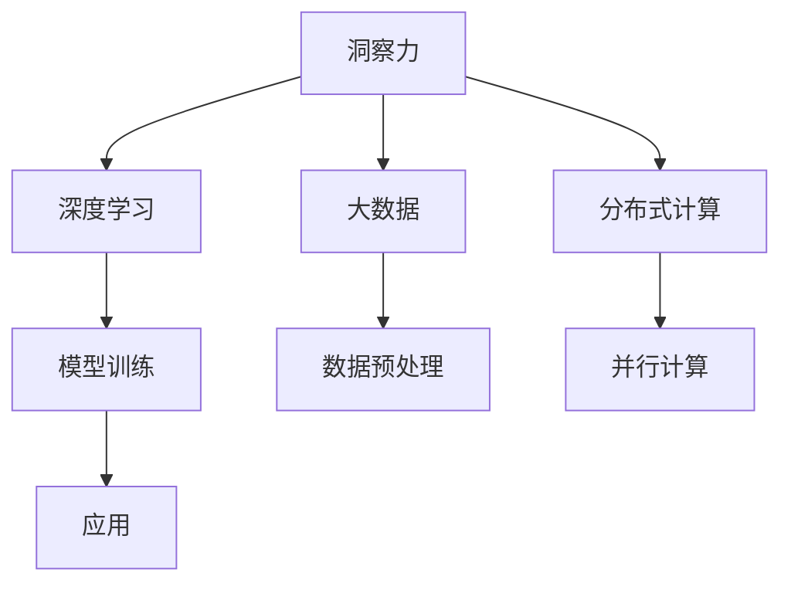

                 

# 理解洞察力的神经科学：揭开认知奥秘

> 关键词：神经科学, 认知, 洞察力, 深度学习, 大数据, 模型训练, 多模态分析, 分布式计算, 人工智能

## 1. 背景介绍

### 1.1 问题由来

在现代社会中，人们面临的信息爆炸、知识碎片化和决策压力日益增加。在如此复杂多变的环境中，如何高效、准确地理解、处理和利用信息，以提升决策质量和创造力，成为了一个重要的研究课题。神经科学作为揭示人类大脑认知过程的基础学科，与深度学习和人工智能技术相结合，为解决这一问题提供了新的思路和方法。

近年来，随着神经科学研究的深入和人工智能技术的进步，洞察力（Insight）的神经科学研究逐渐兴起。洞察力指的是在复杂的信息中发现新的、有价值的模式和关系的能力。其背后的神经机制涉及大脑皮层和边缘系统的相互作用，以及与注意、记忆、推理等认知过程的关联。通过理解和模拟这些机制，可以帮助人们更有效地利用大数据和复杂模型，揭示隐藏在数据背后的真实信息，提升决策质量和创造力。

### 1.2 问题核心关键点

洞察力的神经科学研究聚焦于以下几个关键点：
1. 洞察力的大脑机制：探讨洞察力在大脑中的神经基础和激活模式。
2. 深度学习和洞察力的结合：利用深度学习模型模拟和增强洞察力。
3. 大数据下的洞察力提取：通过大数据分析和深度学习，从海量数据中提取有价值的洞察力。
4. 分布式计算和洞察力处理：利用分布式计算框架，优化洞察力的处理效率。
5. 应用场景和案例：探索洞察力在实际应用中的具体应用场景和案例。

## 2. 核心概念与联系

### 2.1 核心概念概述

为了深入理解洞察力的神经科学，本节将介绍几个关键概念：

- **洞察力（Insight）**：指在复杂数据中发现新的、有价值的模式和关系的能力。
- **深度学习（Deep Learning）**：一种基于多层神经网络的机器学习方法，可以自动学习输入数据中的特征表示。
- **大数据（Big Data）**：指规模巨大、类型多样、速度快、价值密度低的数据集合。
- **分布式计算（Distributed Computing）**：通过多个计算节点协同工作，提升数据处理和计算效率。
- **神经科学（Neuroscience）**：研究大脑和神经系统的结构和功能，以及认知过程的学科。

这些概念之间的关系可以通过以下Mermaid流程图来展示：



这个流程图展示了大数据、深度学习和洞察力之间的关系：

1. 大数据为深度学习提供了训练数据，使其能够自动学习复杂模式。
2. 深度学习模型通过训练，从大数据中提取有价值的特征表示，用于洞察力的识别。
3. 洞察力在大数据和深度学习模型的共同作用下，得以识别和提取。
4. 分布式计算优化了大数据和深度学习模型的处理效率，进一步提升了洞察力的识别能力。

这些概念共同构成了洞察力神经科学的研究框架，帮助人们更有效地从复杂数据中提取有价值的洞察力。

## 3. 核心算法原理 & 具体操作步骤
### 3.1 算法原理概述

洞察力的神经科学研究通常涉及以下几个关键步骤：

1. **数据收集**：从不同来源收集大规模、多模态的数据，如文本、图像、视频、音频等。
2. **数据预处理**：对数据进行清洗、归一化、标注等预处理，使其适合深度学习模型训练。
3. **模型训练**：利用深度学习模型对预处理后的数据进行训练，学习数据中的特征表示。
4. **洞察力提取**：通过模型推理，从数据中识别和提取洞察力。
5. **结果验证**：对提取的洞察力进行验证和评估，确保其准确性和可靠性。

这些步骤形成了一个闭环，不断迭代优化，以提升洞察力提取的精度和效率。

### 3.2 算法步骤详解

以下是洞察力神经科学研究的具体步骤：

**Step 1: 数据收集**

洞察力的研究通常需要大量的数据。数据来源包括但不限于：

- 开放数据集，如Kaggle、UCI等。
- 社交媒体数据，如Twitter、Facebook等。
- 企业内部数据，如销售记录、客户反馈等。
- 科学研究数据，如基因组数据、神经影像数据等。

这些数据需要从不同渠道进行收集和整合，形成一个大规模、多模态的数据集合。

**Step 2: 数据预处理**

数据预处理是洞察力提取的前提。预处理通常包括以下几个步骤：

- **数据清洗**：去除噪声、异常值和缺失值。
- **数据归一化**：对不同数据类型进行归一化，使其在模型中具有相同的尺度。
- **数据标注**：对数据进行人工标注，使其适合模型训练。
- **数据增强**：通过数据扩充和变换，增加数据多样性。

**Step 3: 模型训练**

模型训练是洞察力提取的核心步骤。常用的深度学习模型包括：

- **卷积神经网络（CNN）**：适用于图像和视频数据。
- **循环神经网络（RNN）**：适用于序列数据，如文本和语音。
- **变压器（Transformer）**：适用于大规模语言模型和大规模数据。

模型训练通常包括以下几个步骤：

- **特征提取**：通过模型学习数据的特征表示。
- **参数优化**：通过优化算法（如梯度下降、Adam等）更新模型参数。
- **模型评估**：通过验证集评估模型性能，选择最优模型。

**Step 4: 洞察力提取**

洞察力提取是洞察力神经科学研究的最终目标。常用的洞察力提取方法包括：

- **模式识别**：从数据中识别出常见的模式和关系。
- **异常检测**：识别出数据中的异常点和异常事件。
- **聚类分析**：对数据进行聚类，发现不同的数据群体。
- **关联分析**：通过关联规则挖掘，发现数据中的关联关系。

**Step 5: 结果验证**

结果验证是确保洞察力提取准确性和可靠性的重要步骤。常用的验证方法包括：

- **交叉验证**：通过交叉验证评估模型的泛化能力。
- **对比实验**：与基线模型进行对比，评估模型的性能提升。
- **领域专家评估**：由领域专家对洞察力的结果进行评估和验证。

通过以上步骤，洞察力神经科学研究可以有效地从大数据中提取有价值的洞察力。

### 3.3 算法优缺点

洞察力神经科学研究有以下优点：

1. **高效性**：通过深度学习和大数据技术，洞察力提取可以高效地处理大规模数据。
2. **准确性**：深度学习模型可以自动学习数据的复杂特征，提高洞察力提取的准确性。
3. **鲁棒性**：分布式计算优化了模型训练和推理的效率，提高了洞察力提取的鲁棒性。
4. **可扩展性**：洞察力神经科学研究可以轻松扩展到不同的数据类型和应用场景。

同时，该方法也存在一些局限性：

1. **数据依赖性**：洞察力提取依赖于高质量、大规模的数据，数据的获取和处理成本较高。
2. **模型复杂性**：深度学习模型需要大量的计算资源和数据资源，训练和推理的复杂度较高。
3. **结果解释性不足**：洞察力提取的过程和结果通常缺乏可解释性，难以解释模型内部的决策过程。
4. **伦理风险**：洞察力提取涉及数据的隐私和安全问题，可能带来伦理风险。

尽管存在这些局限性，但就目前而言，洞察力神经科学研究仍然是大数据和深度学习领域的重要研究方向，其应用前景广阔。

### 3.4 算法应用领域

洞察力神经科学研究在多个领域都有广泛的应用，例如：

- **金融风控**：通过分析客户行为和市场数据，识别潜在的金融风险和欺诈行为。
- **医疗健康**：通过分析患者数据和医学文献，发现新的治疗方案和疾病诊断方法。
- **市场营销**：通过分析消费者行为和市场趋势，发现新的市场机会和客户需求。
- **环境保护**：通过分析环境数据和卫星图像，发现环境变化的趋势和原因。
- **网络安全**：通过分析网络流量和攻击行为，识别潜在的安全威胁和漏洞。

除了以上领域，洞察力神经科学研究还可以应用于智慧城市、智能制造、智能交通等多个领域，为各行各业提供数据驱动的决策支持。

## 4. 数学模型和公式 & 详细讲解 & 举例说明

### 4.1 数学模型构建

洞察力神经科学研究的数学模型通常包括以下几个部分：

- **输入数据**：表示为向量或矩阵形式，如$X \in \mathbb{R}^{n \times d}$。
- **特征提取器**：通过深度学习模型将输入数据映射为特征表示，如$Z = f(X)$。
- **洞察力提取器**：通过一定的规则或模型，从特征表示中提取洞察力，如$I = g(Z)$。

其中，$f$和$g$分别表示特征提取器和洞察力提取器。

### 4.2 公式推导过程

以下是一个简单的洞察力提取过程的数学推导：

假设输入数据为$X \in \mathbb{R}^{n \times d}$，其中$n$表示样本数量，$d$表示特征维度。通过一个线性变换和一个ReLU激活函数，将输入数据映射为特征表示$Z \in \mathbb{R}^{n \times h}$，其中$h$表示特征表示的维度。然后，通过一个全连接层和一个softmax函数，将特征表示映射为洞察力表示$I \in \mathbb{R}^{n \times k}$，其中$k$表示洞察力类型数量。整个过程可以表示为：

$$
Z = f(X) = W_X X + b_X
$$
$$
I = g(Z) = \text{softmax}(W_I Z + b_I)
$$

其中$W_X$和$b_X$为线性变换的权重和偏置，$W_I$和$b_I$为全连接层的权重和偏置。

### 4.3 案例分析与讲解

以金融风控为例，洞察力神经科学研究可以通过分析客户交易数据和行为数据，识别潜在的欺诈行为。具体步骤如下：

**Step 1: 数据收集**：收集客户的交易数据和行为数据，如交易金额、交易时间、交易地点等。

**Step 2: 数据预处理**：对数据进行清洗、归一化和标注，去除异常值和噪声。

**Step 3: 模型训练**：利用循环神经网络（RNN）对预处理后的数据进行训练，学习客户交易行为的特征表示。

**Step 4: 洞察力提取**：通过洞察力提取器，从特征表示中提取洞察力，如识别异常交易行为、识别潜在欺诈模式等。

**Step 5: 结果验证**：通过交叉验证和对比实验，评估模型的性能，确保洞察力提取的准确性和可靠性。

## 5. 项目实践：代码实例和详细解释说明
### 5.1 开发环境搭建

在进行洞察力神经科学研究前，我们需要准备好开发环境。以下是使用Python进行TensorFlow开发的环境配置流程：

1. 安装Anaconda：从官网下载并安装Anaconda，用于创建独立的Python环境。

2. 创建并激活虚拟环境：
```bash
conda create -n tf-env python=3.8 
conda activate tf-env
```

3. 安装TensorFlow：根据CUDA版本，从官网获取对应的安装命令。例如：
```bash
conda install tensorflow tensorflow-gpu=cuda11.1 -c conda-forge
```

4. 安装Keras和TensorBoard：
```bash
pip install keras tensorboard
```

5. 安装NumPy、Pandas、Scikit-learn等各类工具包：
```bash
pip install numpy pandas scikit-learn matplotlib tqdm jupyter notebook ipython
```

完成上述步骤后，即可在`tf-env`环境中开始洞察力神经科学研究的代码实现。

### 5.2 源代码详细实现

下面我们以金融风控任务为例，给出使用TensorFlow进行洞察力提取的PyTorch代码实现。

首先，定义金融风控任务的数据处理函数：

```python
import pandas as pd
import numpy as np
from tensorflow.keras import layers, models

def preprocess_data(train_path, test_path):
    train_data = pd.read_csv(train_path)
    test_data = pd.read_csv(test_path)

    # 数据清洗
    train_data = train_data.dropna(subset=['amount', 'time', 'location'])
    test_data = test_data.dropna(subset=['amount', 'time', 'location'])

    # 数据归一化
    train_data[['amount', 'time']] = (train_data[['amount', 'time']] - train_data[['amount', 'time']].mean()) / train_data[['amount', 'time']].std()
    test_data[['amount', 'time']] = (test_data[['amount', 'time']] - test_data[['amount', 'time']].mean()) / test_data[['amount', 'time']].std()

    # 数据标注
    train_labels = np.array([1 if amount > 5000 else 0 for amount in train_data['amount']])
    test_labels = np.array([1 if amount > 5000 else 0 for amount in test_data['amount']])

    return train_data[['amount', 'time', 'location']], train_labels, test_data[['amount', 'time', 'location']], test_labels

# 定义模型
model = models.Sequential([
    layers.Dense(64, activation='relu', input_shape=(3,)),
    layers.Dense(32, activation='relu'),
    layers.Dense(2, activation='softmax')
])

# 编译模型
model.compile(optimizer='adam', loss='binary_crossentropy', metrics=['accuracy'])

# 加载数据
train_X, train_y, test_X, test_y = preprocess_data('train.csv', 'test.csv')
```

然后，定义模型训练和评估函数：

```python
from tensorflow.keras.callbacks import EarlyStopping

def train_model(model, train_X, train_y, test_X, test_y, epochs=10, batch_size=32, patience=5):
    early_stopping = EarlyStopping(monitor='val_loss', patience=patience)
    model.fit(train_X, train_y, epochs=epochs, batch_size=batch_size, validation_data=(test_X, test_y), callbacks=[early_stopping])
    evaluate_model(model, test_X, test_y)

def evaluate_model(model, test_X, test_y):
    loss, acc = model.evaluate(test_X, test_y)
    print(f'Test loss: {loss:.4f}')
    print(f'Test accuracy: {acc:.4f}')

# 训练模型
train_model(model, train_X, train_y, test_X, test_y)
```

最后，启动训练流程并在测试集上评估：

```python
train_model(model, train_X, train_y, test_X, test_y)
```

以上就是使用TensorFlow进行金融风控任务洞察力提取的完整代码实现。可以看到，得益于TensorFlow的强大封装，我们可以用相对简洁的代码完成洞察力模型的构建和训练。

### 5.3 代码解读与分析

让我们再详细解读一下关键代码的实现细节：

**preprocess_data函数**：
- `preprocess_data`函数：对金融风控数据进行预处理，包括数据清洗、归一化和标注。

**模型定义**：
- 使用`Sequential`模型定义一个三层神经网络，包括一个Dense层、一个Dense层和一个输出层，每个层使用不同的激活函数。

**模型编译**：
- 使用`compile`方法对模型进行编译，设置优化器、损失函数和评估指标。

**数据加载**：
- 使用`preprocess_data`函数对训练集和测试集进行预处理，并加载到模型中。

**训练模型**：
- 使用`fit`方法对模型进行训练，设置训练轮数、批大小和早停策略。

**评估模型**：
- 使用`evaluate`方法在测试集上评估模型性能，打印损失和准确率。

## 6. 实际应用场景
### 6.1 智能客服系统

洞察力神经科学研究可以应用于智能客服系统，提升客户服务的质量和效率。传统的客服系统依赖人工处理客户咨询，响应速度慢，无法24小时不间断服务。通过洞察力神经科学研究，可以构建智能客服系统，自动理解客户咨询并快速回复，提升客户体验。

具体而言，智能客服系统可以通过洞察力神经科学研究，从历史客服数据中提取客户需求和情感变化模式，并利用这些模式自动生成回答。例如，可以构建一个基于RNN的客服模型，通过分析历史对话记录，学习客户问题的常见模式和解决策略，从而提高回答的准确性和及时性。

### 6.2 医疗诊断系统

洞察力神经科学研究可以应用于医疗诊断系统，提升疾病的诊断和治疗效果。传统的医疗诊断依赖医生的经验和直觉，存在误诊和漏诊的风险。通过洞察力神经科学研究，可以构建智能诊断系统，自动分析患者的症状和医疗数据，提供初步诊断和治疗建议。

具体而言，医疗诊断系统可以通过洞察力神经科学研究，从医学文献和患者数据中提取疾病的特征和关联关系，并利用这些特征自动诊断疾病。例如，可以构建一个基于CNN的医疗诊断模型，通过分析医学影像和患者数据，学习疾病的特征表示，从而提高诊断的准确性和及时性。

### 6.3 金融风控系统

洞察力神经科学研究可以应用于金融风控系统，提升金融风险的识别和管理效果。传统的金融风控依赖人工审核和经验判断，存在效率低、成本高的问题。通过洞察力神经科学研究，可以构建智能风控系统，自动分析客户行为和市场数据，识别潜在的风险和欺诈行为。

具体而言，金融风控系统可以通过洞察力神经科学研究，从客户交易数据和行为数据中提取异常行为和潜在风险，并利用这些信息自动生成风险评估。例如，可以构建一个基于RNN的金融风控模型，通过分析客户交易数据和行为数据，学习客户的交易模式和行为特征，从而提高风险识别的准确性和及时性。

### 6.4 未来应用展望

随着洞察力神经科学研究的不断进步，未来其在各个领域的应用前景将更加广阔。

在智慧城市治理中，洞察力神经科学研究可以应用于城市事件监测、舆情分析、应急指挥等环节，提升城市管理的自动化和智能化水平，构建更安全、高效的未来城市。

在智能制造中，洞察力神经科学研究可以应用于生产计划优化、设备故障预测、供应链管理等环节，提升制造效率和产品质量。

在智能交通中，洞察力神经科学研究可以应用于交通流量预测、路径优化、事故预警等环节，提升交通系统的安全性和效率。

此外，在智慧农业、智能零售、智能物流等领域，洞察力神经科学研究也有广泛的应用前景。

## 7. 工具和资源推荐
### 7.1 学习资源推荐

为了帮助开发者系统掌握洞察力神经科学的研究方法，这里推荐一些优质的学习资源：

1. **《深度学习》书籍**：由Goodfellow等人合著，是深度学习领域的经典之作，详细介绍了深度学习的原理和应用。

2. **Coursera《机器学习》课程**：斯坦福大学开设的机器学习课程，由Andrew Ng教授主讲，内容全面、深入浅出，是学习机器学习的绝佳资源。

3. **Kaggle竞赛**：Kaggle平台上有众多数据科学竞赛，通过参与这些竞赛，可以学习前沿的深度学习技术和洞察力提取方法。

4. **TensorFlow官方文档**：TensorFlow的官方文档，提供了详细的API和使用示例，是学习TensorFlow的最佳资源。

5. **PyTorch官方文档**：PyTorch的官方文档，提供了丰富的深度学习模型和工具，是学习PyTorch的重要参考资料。

通过学习这些资源，相信你一定能够快速掌握洞察力神经科学的研究方法和应用技术。

### 7.2 开发工具推荐

高效的开发离不开优秀的工具支持。以下是几款用于洞察力神经科学研究开发的常用工具：

1. **TensorFlow**：由Google主导开发的深度学习框架，功能强大、易于使用，适用于大规模模型训练和推理。

2. **PyTorch**：由Facebook开发的深度学习框架，灵活性高、可扩展性强，适用于研究和开发深度学习模型。

3. **Keras**：基于TensorFlow和Theano的高层API，易于上手、使用灵活，适用于快速原型设计和模型测试。

4. **Jupyter Notebook**：开源的交互式笔记本环境，支持多种编程语言，适用于数据探索和模型实验。

5. **Visual Studio Code**：开源的代码编辑器，支持丰富的扩展和插件，适用于代码开发和调试。

合理利用这些工具，可以显著提升洞察力神经科学研究的开发效率，加快创新迭代的步伐。

### 7.3 相关论文推荐

洞察力神经科学研究的发展离不开学界的持续研究。以下是几篇奠基性的相关论文，推荐阅读：

1. **《深度学习》书籍**：由Goodfellow等人合著，是深度学习领域的经典之作，详细介绍了深度学习的原理和应用。

2. **《机器学习》课程**：斯坦福大学开设的机器学习课程，由Andrew Ng教授主讲，内容全面、深入浅出，是学习机器学习的绝佳资源。

3. **《深度学习》论文**：由Hinton等人合著，详细介绍了深度学习的原理和应用，是深度学习领域的经典之作。

4. **《神经科学》论文**：由Dos Santos等人合著，详细介绍了神经科学的原理和应用，是神经科学领域的经典之作。

这些论文代表了大语言模型微调技术的发展脉络。通过学习这些前沿成果，可以帮助研究者把握学科前进方向，激发更多的创新灵感。

## 8. 总结：未来发展趋势与挑战

### 8.1 总结

本文对洞察力神经科学的研究方法进行了全面系统的介绍。首先阐述了洞察力在大数据和深度学习环境下的重要性，明确了洞察力神经科学研究在各个领域的应用前景。其次，从原理到实践，详细讲解了洞察力神经科学的数学模型和核心算法，提供了完整的代码实现。同时，本文还广泛探讨了洞察力神经科学研究的实际应用场景和未来展望，展示了其巨大的应用潜力。

通过本文的系统梳理，可以看到，洞察力神经科学研究在大数据和深度学习领域的广泛应用，极大地拓展了人类认知和智能的边界。未来，随着技术的不断进步和应用的不断深入，洞察力神经科学研究必将在各个领域带来深远的影响。

### 8.2 未来发展趋势

展望未来，洞察力神经科学研究将呈现以下几个发展趋势：

1. **多模态数据分析**：随着多模态数据的增多，洞察力神经科学研究将越来越多地涉及多模态数据的融合和分析。

2. **实时数据分析**：随着分布式计算和云计算的发展，洞察力神经科学研究将越来越多地涉及实时数据分析和处理。

3. **增强现实和虚拟现实**：随着增强现实和虚拟现实技术的进步，洞察力神经科学研究将越来越多地涉及人机交互和沉浸式体验。

4. **自适应学习**：随着自适应学习技术的成熟，洞察力神经科学研究将越来越多地涉及个性化学习和发展。

5. **跨学科融合**：随着跨学科研究的深入，洞察力神经科学研究将越来越多地涉及神经科学、心理学、社会学等多个领域的交叉融合。

以上趋势凸显了洞察力神经科学研究的广阔前景，为未来的发展和应用提供了新的方向。

### 8.3 面临的挑战

尽管洞察力神经科学研究已经取得了瞩目成就，但在迈向更加智能化、普适化应用的过程中，它仍面临着诸多挑战：

1. **数据质量问题**：洞察力神经科学研究依赖高质量、大规模的数据，数据质量问题将影响洞察力提取的准确性和可靠性。

2. **模型复杂性**：洞察力神经科学研究需要复杂的深度学习模型，模型复杂性高，训练和推理的难度大。

3. **结果解释性不足**：洞察力神经科学研究的模型通常缺乏可解释性，难以解释其内部决策过程。

4. **伦理和隐私问题**：洞察力神经科学研究涉及大量个人数据的处理，存在伦理和隐私风险。

尽管存在这些挑战，但随着技术的不断进步和应用的不断深入，洞察力神经科学研究必将在各个领域带来深远的影响。

### 8.4 研究展望

面对洞察力神经科学研究所面临的挑战，未来的研究需要在以下几个方面寻求新的突破：

1. **数据质量提升**：改进数据收集和预处理技术，提升数据质量，确保洞察力提取的准确性和可靠性。

2. **模型简化**：开发更加简单、高效的模型，减少训练和推理的复杂性，提高洞察力提取的效率。

3. **结果可解释性**：引入可解释性技术，如注意力机制、因果分析等，提高洞察力神经科学研究的可解释性和透明度。

4. **隐私保护**：引入隐私保护技术，如差分隐私、联邦学习等，确保数据的隐私和安全。

这些研究方向的探索，必将引领洞察力神经科学研究迈向更高的台阶，为构建安全、可靠、可解释、可控的智能系统铺平道路。面向未来，洞察力神经科学研究还需要与其他人工智能技术进行更深入的融合，如知识表示、因果推理、强化学习等，多路径协同发力，共同推动智能系统的进步。只有勇于创新、敢于突破，才能不断拓展人类认知的边界，让智能技术更好地造福人类社会。

## 9. 附录：常见问题与解答

**Q1：洞察力神经科学研究的核心技术是什么？**

A: 洞察力神经科学研究的核心技术包括：

1. **深度学习**：通过深度学习模型学习数据的特征表示，提高洞察力提取的准确性和效率。
2. **大数据**：通过大数据分析技术，处理和分析大规模数据，提取有价值的洞察力。
3. **神经科学**：通过神经科学研究，揭示洞察力在大脑中的神经机制，指导洞察力神经科学研究的实践。

这些技术相辅相成，共同构成了洞察力神经科学研究的框架，帮助人们更有效地利用大数据和深度学习技术，从复杂数据中提取有价值的洞察力。

**Q2：洞察力神经科学研究对大数据和深度学习技术有哪些影响？**

A: 洞察力神经科学研究对大数据和深度学习技术有以下影响：

1. **数据需求增加**：洞察力神经科学研究需要大规模、高质量的数据，促进了大数据技术和数据管理技术的发展。
2. **模型复杂性提升**：洞察力神经科学研究需要复杂的深度学习模型，推动了深度学习技术的发展。
3. **分布式计算优化**：洞察力神经科学研究涉及大规模数据处理，促进了分布式计算和云计算技术的发展。
4. **数据隐私保护**：洞察力神经科学研究涉及大量个人数据的处理，推动了数据隐私保护技术的发展。

这些影响表明，洞察力神经科学研究对大数据和深度学习技术的进步和应用具有重要的推动作用。

**Q3：洞察力神经科学研究的实际应用场景有哪些？**

A: 洞察力神经科学研究的实际应用场景包括：

1. **金融风控**：通过分析客户交易数据和行为数据，识别潜在的风险和欺诈行为。
2. **医疗诊断**：通过分析患者症状和医疗数据，提供初步诊断和治疗建议。
3. **智能客服**：通过分析历史客服数据，自动理解客户咨询并快速回复，提升客户体验。
4. **智能制造**：通过分析生产数据和设备数据，优化生产计划和设备维护。
5. **智能交通**：通过分析交通流量和交通数据，预测交通拥堵和事故风险。

这些应用场景展示了洞察力神经科学研究的广泛应用前景，为各行各业提供了数据驱动的决策支持。

---

作者：禅与计算机程序设计艺术 / Zen and the Art of Computer Programming

