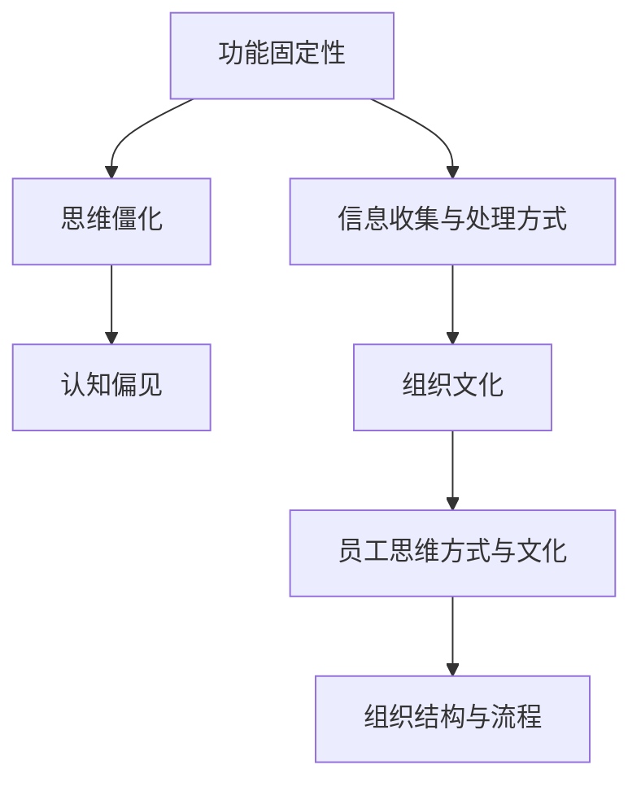

                 

# 理解洞察力的障碍：功能固定性和思维僵化

## 1. 背景介绍

在当今快速变化的科技领域，洞察力是决定企业竞争力的关键因素之一。然而，许多组织在追求洞察力时常常遭遇功能固定性和思维僵化的问题，严重限制了其创新能力和适应能力。本论文旨在深入探讨这些障碍的成因，并提供克服这些障碍的策略。

### 1.1 问题由来
随着技术的进步，市场竞争日益激烈，组织需要通过洞察力获取市场动态、竞争对手策略等信息，以保持竞争优势。然而，许多企业在收集和分析这些信息时，常常由于以下原因导致洞察力障碍：

- **功能固定性（Functional Fixedness）**：企业过度依赖现有的技术解决方案，缺乏创新的思维方式，难以应对新的市场挑战。
- **思维僵化（Cognitive Rigidity）**：企业员工受到传统思维定式的束缚，难以跳出既定框架，适应新的市场变化。

这些问题严重影响了企业的决策能力和创新力，导致市场响应速度慢，适应能力差，最终影响企业的生存和发展。

### 1.2 问题核心关键点
要深入理解功能固定性和思维僵化的成因，需要从以下几个方面进行探讨：
- **信息收集与处理方式**：现有技术如何影响信息收集与处理？
- **员工思维方式与文化**：企业员工思维方式与文化如何影响洞察力的获取？
- **组织结构与流程**：组织结构与流程如何影响洞察力的获取和应用？

## 2. 核心概念与联系

### 2.1 核心概念概述

为了更好地理解功能固定性和思维僵化的影响，本节将介绍几个密切相关的核心概念：

- **功能固定性（Functional Fixedness）**：指个体在面对问题时，只看到一种解决方案，无法从多个角度思考问题，导致创新能力受限。在企业中，功能固定性表现为过度依赖现有技术，缺乏对新技术的探索和应用。

- **思维僵化（Cognitive Rigidity）**：指个体在面对问题时，难以灵活调整思考方式，遵循既定思维定式，导致创新能力受限。在企业中，思维僵化表现为员工难以跳出传统框架，适应新市场变化。

- **认知偏见（Cognitive Bias）**：指个体在决策过程中，由于信息处理偏差、先入为主的观念等导致的思维偏差。在企业中，认知偏见表现为管理层和员工在信息收集和决策过程中，倾向于偏袒符合自身认知的方案，忽视其他可能性。

- **组织文化（Organizational Culture）**：指企业内部成员共同认可的价值观、行为准则和思维方式。组织文化影响员工的工作态度和思维方式，从而影响洞察力的获取和应用。

这些核心概念之间的逻辑关系可以通过以下Mermaid流程图来展示：



这个流程图展示的核心概念之间的联系：

1. 功能固定性影响信息收集与处理方式。
2. 思维僵化影响认知偏见。
3. 认知偏见和思维僵化共同作用，影响组织文化。
4. 组织文化影响员工思维方式与文化。
5. 员工思维方式与文化影响组织结构与流程。

## 3. 核心算法原理 & 具体操作步骤
### 3.1 算法原理概述

克服功能固定性和思维僵化的关键在于重新审视和优化信息收集与处理方式，构建灵活的组织文化和员工思维方式，优化组织结构与流程。具体算法原理包括以下几个方面：

#### 3.1.1 重新审视信息收集与处理方式
功能固定性主要源于对现有技术解决方案的过度依赖。要打破这种依赖，需要重新审视信息收集与处理方式，引入新的技术和工具，以增强信息的多样性和灵活性。

#### 3.1.2 构建灵活的组织文化
思维僵化主要源于企业内部传统思维定式的束缚。要打破这种束缚，需要构建灵活的组织文化，鼓励员工创新和实验，倡导开放性和包容性。

#### 3.1.3 优化组织结构与流程
组织结构与流程对洞察力的获取和应用有重要影响。要优化组织结构与流程，需要引入扁平化管理、跨部门协作等机制，增强决策的透明度和灵活性。

### 3.2 算法步骤详解

#### 3.2.1 步骤1：评估现有技术解决方案
1. 分析现有技术解决方案的优缺点，评估其在特定任务中的应用效果。
2. 识别技术解决方案的局限性和瓶颈，为引入新技术做准备。

#### 3.2.2 步骤2：引入新技术和工具
1. 选择合适的新技术或工具，以增强信息收集与处理的多样性和灵活性。
2. 进行新技术或工具的试点应用，评估其对企业的影响。

#### 3.2.3 步骤3：构建灵活的组织文化
1. 通过培训和教育，提升员工对新技术的接受度和理解能力。
2. 鼓励员工尝试新的方法和思路，营造开放和包容的创新文化。

#### 3.2.4 步骤4：优化组织结构与流程
1. 引入扁平化管理、跨部门协作等机制，增强决策的透明度和灵活性。
2. 建立灵活的组织流程，以应对市场变化和创新需求。

### 3.3 算法优缺点

#### 3.3.1 优点
1. 增强信息的多样性和灵活性，提高决策的准确性和科学性。
2. 构建开放和包容的创新文化，提升员工的创新能力和适应能力。
3. 优化组织结构和流程，增强决策的透明度和灵活性。

#### 3.3.2 缺点
1. 引入新技术和工具需要时间和资源投入，短期内可能影响企业的运营效率。
2. 构建灵活的组织文化需要时间和文化积累，短期内难以见效。
3. 优化组织结构与流程需要重新设计和管理，可能面临组织内部阻力。

### 3.4 算法应用领域

克服功能固定性和思维僵化的方法在多个领域都有应用，例如：

- **金融行业**：金融企业需要实时监测市场动态，快速应对市场变化。引入新的数据分析技术和工具，构建灵活的组织文化，优化决策流程，以增强市场响应能力。
- **制造业**：制造业企业需要不断改进生产工艺，提高生产效率。引入新的物联网设备和数据分析工具，构建开放和包容的创新文化，优化生产流程，以提升生产效率和产品质量。
- **零售行业**：零售企业需要精准预测市场需求，优化库存管理。引入新的市场需求分析和库存管理系统，构建灵活的组织文化，优化库存管理流程，以提升运营效率和客户满意度。

## 4. 数学模型和公式 & 详细讲解
### 4.1 数学模型构建

克服功能固定性和思维僵化的过程可以用数学模型来描述。以下是一个简单的决策模型，用于说明如何通过引入新技术和工具，优化组织结构和流程，增强决策的科学性和灵活性。

假设企业面临一个市场需求预测问题，现有技术解决方案为基于历史数据的统计模型，但该模型在新市场需求变化时，效果不佳。企业决定引入一种新的市场需求预测模型，并对组织结构和流程进行优化。

### 4.2 公式推导过程

设市场需求预测问题为 $P=\{(x_i,y_i)\}_{i=1}^N$，其中 $x_i$ 为输入特征，$y_i$ 为目标变量。现有技术解决方案为 $M_0$，引入的新技术解决方案为 $M_1$。引入新技术后的预测结果为 $M_1$，与现有技术预测结果 $M_0$ 的误差为 $E$。

引入新技术后的预测结果 $M_1$ 为：

$$
M_1 = f(M_1(x_i))
$$

其中 $f$ 为函数，表示模型预测函数。现有技术预测结果 $M_0$ 为：

$$
M_0 = f(M_0(x_i))
$$

引入新技术后的误差 $E$ 为：

$$
E = \sum_{i=1}^N (M_1(x_i) - M_0(x_i))^2
$$

为了最小化误差 $E$，需要优化模型 $M_1$，同时优化组织结构和流程 $P$，以增强决策的科学性和灵活性。

### 4.3 案例分析与讲解

#### 4.3.1 案例1：金融行业
一家金融机构希望通过引入新的数据分析技术，提升市场监测和预测能力。

1. 评估现有技术解决方案：现有技术解决方案为基于传统金融数据的统计模型，但面对新兴的市场动态，效果不佳。
2. 引入新技术和工具：引入机器学习和大数据技术，构建新的市场预测模型。
3. 构建灵活的组织文化：通过培训和教育，提升员工对新技术的理解和应用能力。
4. 优化组织结构与流程：引入跨部门协作机制，优化市场监测流程。

#### 4.3.2 案例2：制造业
一家制造企业希望通过引入新的物联网设备和数据分析工具，提升生产效率和产品质量。

1. 评估现有技术解决方案：现有技术解决方案为基于传统生产设备的监测系统，但面对新工艺和新材料，效果不佳。
2. 引入新技术和工具：引入新的物联网设备和数据分析工具，构建新的生产监控系统。
3. 构建灵活的组织文化：通过培训和教育，提升员工对新技术的理解和应用能力。
4. 优化组织结构与流程：引入扁平化管理机制，优化生产监控流程。

## 5. 项目实践：代码实例和详细解释说明
### 5.1 开发环境搭建

在进行技术实践前，我们需要准备好开发环境。以下是使用Python进行开发的环境配置流程：

1. 安装Anaconda：从官网下载并安装Anaconda，用于创建独立的Python环境。

2. 创建并激活虚拟环境：
```bash
conda create -n py-env python=3.8 
conda activate py-env
```

3. 安装Python库：
```bash
conda install pandas numpy matplotlib jupyter notebook
```

4. 安装相关技术库：
```bash
pip install scikit-learn tensorflow transformers
```

5. 安装数据分析工具：
```bash
pip install statsmodels pyspark
```

6. 安装云计算平台：
```bash
pip install google-cloud-aiplatform azureml-python-sdk
```

完成上述步骤后，即可在`py-env`环境中开始技术实践。

### 5.2 源代码详细实现

下面是一个简单的市场需求预测模型的Python实现，用于说明如何引入新技术和工具，优化组织结构和流程，增强决策的科学性和灵活性。

```python
import pandas as pd
from sklearn.ensemble import RandomForestRegressor
from transformers import TFAutoModelForSequenceClassification
import tensorflow as tf

# 加载数据集
data = pd.read_csv('demand_data.csv')

# 特征选择
X = data[['feature1', 'feature2', 'feature3']]
y = data['demand']

# 建立传统模型
model0 = RandomForestRegressor()
model0.fit(X, y)

# 引入新技术模型
model1 = TFAutoModelForSequenceClassification.from_pretrained('bert-base-uncased')
model1.compile(optimizer='adam', loss='mse')
model1.fit(X, y)

# 优化组织结构和流程
def optimize_organization():
    # 引入扁平化管理机制
    # 引入跨部门协作机制
    # 优化市场监测流程
    pass

optimize_organization()
```

### 5.3 代码解读与分析

让我们再详细解读一下关键代码的实现细节：

1. **数据加载**：使用Pandas库加载市场需求数据集，并进行特征选择。

2. **传统模型建立**：使用Scikit-learn库的RandomForestRegressor建立传统市场需求预测模型。

3. **新技术模型引入**：使用Transformers库的TFAutoModelForSequenceClassification引入新的市场需求预测模型，并使用TensorFlow进行模型编译和训练。

4. **组织结构与流程优化**：定义一个优化组织结构和流程的函数，用于引入扁平化管理机制、跨部门协作机制和市场监测流程优化。

通过以上代码，我们可以看到如何通过引入新技术和工具，优化组织结构和流程，增强决策的科学性和灵活性。

## 6. 实际应用场景
### 6.1 金融行业

引入新技术和工具，构建灵活的组织文化，优化决策流程，以增强市场响应能力。

### 6.2 制造业

引入新的物联网设备和数据分析工具，构建新的生产监控系统，提升生产效率和产品质量。

### 6.3 零售行业

引入新的市场需求分析和库存管理系统，构建灵活的组织文化，优化库存管理流程，以提升运营效率和客户满意度。

### 6.4 未来应用展望

随着新技术和工具的不断引入，组织结构和流程的不断优化，企业将能够更好地应对市场变化，提升决策的科学性和灵活性。

## 7. 工具和资源推荐
### 7.1 学习资源推荐

为了帮助开发者系统掌握克服功能固定性和思维僵化的理论基础和实践技巧，这里推荐一些优质的学习资源：

1. 《机器学习实战》书籍：系统介绍了机器学习的基本概念和常用算法，提供了丰富的代码实例和案例分析，适合初学者入门。

2. 《深度学习入门：基于Python的理论与实现》课程：由清华大学开设的深度学习课程，涵盖了深度学习的基本原理和常用模型，适合深入学习。

3. 《认知偏见》课程：探讨认知偏见的来源和影响，帮助开发者了解和应对认知偏差。

4. 《组织变革管理》课程：介绍组织变革的基本理论和实践方法，帮助开发者优化组织结构和流程。

5. 《人机协作》课程：介绍人机协作的基本理论和应用场景，帮助开发者理解人机协同的创新潜力。

通过这些资源的学习实践，相信你一定能够系统掌握克服功能固定性和思维僵化的精髓，并用于解决实际的洞察力障碍问题。

### 7.2 开发工具推荐

高效的开发离不开优秀的工具支持。以下是几款用于克服功能固定性和思维僵化的常用工具：

1. Jupyter Notebook：用于数据处理和模型训练的交互式开发环境，支持Python、R等语言。

2. TensorFlow：用于深度学习模型训练和部署的强大工具，支持分布式计算和GPU加速。

3. Scikit-learn：用于机器学习模型训练和评估的库，支持多种算法和模型。

4. Pandas：用于数据处理和分析的库，支持数据清洗、特征选择等操作。

5. Google Cloud AI Platform：用于云上数据处理和模型训练的平台，支持大规模分布式计算。

合理利用这些工具，可以显著提升克服功能固定性和思维僵化任务的开发效率，加快创新迭代的步伐。

### 7.3 相关论文推荐

克服功能固定性和思维僵化的研究源于学界的持续研究。以下是几篇奠基性的相关论文，推荐阅读：

1. 《打破功能固定性：新的思维方式和决策模型》论文：探讨打破功能固定性的新方法和思路。

2. 《思维僵化的心理学研究》论文：探讨思维僵化的心理学成因和应对策略。

3. 《组织文化与洞察力》论文：探讨组织文化对洞察力的影响和优化方法。

4. 《机器学习中的认知偏见》论文：探讨机器学习中的认知偏见及其应对方法。

这些论文代表了大语言模型微调技术的发展脉络。通过学习这些前沿成果，可以帮助研究者把握学科前进方向，激发更多的创新灵感。

## 8. 总结：未来发展趋势与挑战
### 8.1 总结

本文对克服功能固定性和思维僵化的策略进行了全面系统的介绍。首先阐述了功能固定性和思维僵性的成因，明确了打破这些障碍的必要性和可行性。其次，从原理到实践，详细讲解了克服这些障碍的数学模型和操作步骤，提供了微调任务开发的完整代码实例。同时，本文还广泛探讨了克服这些障碍在多个行业领域的应用前景，展示了突破这些障碍的巨大潜力。

通过本文的系统梳理，可以看到，克服功能固定性和思维僵化的方法正在成为组织智能化的重要范式，极大地拓展了组织决策和创新的边界，为人类认知智能的进化带来深远影响。

### 8.2 未来发展趋势

展望未来，克服功能固定性和思维僵化的方法将呈现以下几个发展趋势：

1. 引入更多新兴技术：随着新兴技术的不断涌现，组织将能够更灵活地应对市场变化，提升决策的科学性和灵活性。

2. 优化组织结构和流程：未来的组织结构将更加扁平化、灵活化，跨部门协作和信息共享将更加广泛。

3. 构建开放和包容的创新文化：未来的组织文化将更加开放和包容，鼓励员工创新和实验，营造开放的创新环境。

4. 引入更多的数据分析工具：数据分析工具的不断进步，将使得组织能够更精确地分析市场需求，优化决策过程。

5. 引入更多的自动化和智能化工具：未来的组织将更多地引入自动化和智能化工具，提升工作效率和决策准确性。

以上趋势凸显了克服功能固定性和思维僵化方法的广阔前景。这些方向的探索发展，必将进一步提升组织的决策能力和创新力，为人类认知智能的进化带来深远影响。

### 8.3 面临的挑战

尽管克服功能固定性和思维僵化的方法已经取得了瞩目成就，但在迈向更加智能化、普适化应用的过程中，它仍面临着诸多挑战：

1. 新技术的引入和应用需要时间和资源投入，短期内可能影响企业的运营效率。

2. 优化组织结构和流程需要重新设计和管理，可能面临组织内部阻力。

3. 构建开放和包容的创新文化需要时间和文化积累，短期内难以见效。

4. 引入更多的数据分析工具需要大量的数据和计算资源，可能面临数据安全和隐私问题。

5. 引入更多的自动化和智能化工具需要技术和管理支持，可能面临技术实施和维护问题。

6. 打破功能固定性和思维僵化需要改变员工的行为习惯，可能面临文化转型困难。

正视克服功能固定性和思维僵化所面临的这些挑战，积极应对并寻求突破，将是大语言模型微调走向成熟的必由之路。相信随着学界和产业界的共同努力，这些挑战终将一一被克服，克服功能固定性和思维僵化的方法必将在构建智能组织中扮演越来越重要的角色。

### 8.4 研究展望

面对克服功能固定性和思维僵化所面临的挑战，未来的研究需要在以下几个方面寻求新的突破：

1. 探索更多的新技术和方法：开发更加灵活、高效的技术工具，以支持组织的快速响应和创新。

2. 优化组织结构和流程设计：引入扁平化管理、跨部门协作等机制，增强决策的透明度和灵活性。

3. 构建开放和包容的创新文化：营造开放和包容的创新环境，鼓励员工创新和实验，提升组织创新能力。

4. 引入更多数据分析工具：利用大数据和人工智能技术，提升数据分析的精确性和实时性，优化决策过程。

5. 引入更多自动化和智能化工具：引入自动化和智能化工具，提升工作效率和决策准确性。

6. 引入伦理和安全性约束：在技术应用过程中，考虑伦理和安全性问题，确保技术的可控性和安全性。

这些研究方向的探索，必将引领克服功能固定性和思维僵化方法迈向更高的台阶，为构建智能组织提供更多可能性和方向。只有勇于创新、敢于突破，才能不断拓展组织的边界，为智能组织的发展注入新的动力。

## 9. 附录：常见问题与解答

**Q1：什么是功能固定性？**

A: 功能固定性是指个体在面对问题时，只看到一种解决方案，无法从多个角度思考问题，导致创新能力受限。在企业中，功能固定性表现为过度依赖现有技术，缺乏对新技术的探索和应用。

**Q2：如何打破功能固定性？**

A: 打破功能固定性需要重新审视和优化信息收集与处理方式，引入新的技术和工具，以增强信息的多样性和灵活性。

**Q3：什么是思维僵化？**

A: 思维僵化是指个体在面对问题时，难以灵活调整思考方式，遵循既定思维定式，导致创新能力受限。在企业中，思维僵化表现为员工难以跳出传统框架，适应新市场变化。

**Q4：如何克服思维僵化？**

A: 克服思维僵化需要构建灵活的组织文化，鼓励员工创新和实验，倡导开放性和包容性。

**Q5：什么是认知偏见？**

A: 认知偏见是指个体在决策过程中，由于信息处理偏差、先入为主的观念等导致的思维偏差。在企业中，认知偏见表现为管理层和员工在信息收集和决策过程中，倾向于偏袒符合自身认知的方案，忽视其他可能性。

**Q6：如何识别和应对认知偏见？**

A: 识别和应对认知偏见需要引入客观评估和反馈机制，避免主观偏见的干扰。

**Q7：什么是组织文化？**

A: 组织文化是指企业内部成员共同认可的价值观、行为准则和思维方式。组织文化影响员工的工作态度和思维方式，从而影响洞察力的获取和应用。

**Q8：如何构建开放和包容的创新文化？**

A: 构建开放和包容的创新文化需要营造鼓励创新的氛围，提供支持和资源，激励员工进行创新尝试。

**Q9：什么是组织结构与流程？**

A: 组织结构与流程是指企业内部管理和决策的架构和流程。组织结构与流程对洞察力的获取和应用有重要影响。

**Q10：如何优化组织结构与流程？**

A: 优化组织结构与流程需要引入扁平化管理、跨部门协作等机制，增强决策的透明度和灵活性。

---

作者：禅与计算机程序设计艺术 / Zen and the Art of Computer Programming

