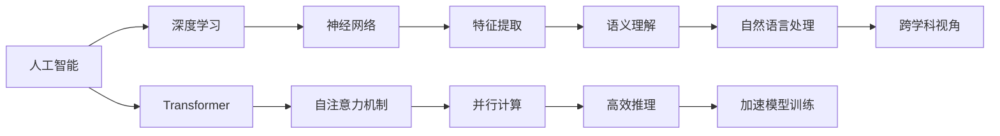

                 

# 理解的多维性：跨学科视角的重要性

在人工智能(AI)领域，无论是基础的算法理论还是前沿的深度学习模型，都越来越体现出多学科交叉融合的特征。这种趋势不仅反映了AI技术的复杂性，也凸显了跨学科视角对于理解、应用和优化AI系统的深远意义。本文旨在通过系统化的视角，探讨理解的多维性以及跨学科视角的重要性，为AI从业者提供更具全局性和深入性的技术洞见。

## 1. 背景介绍

### 1.1 技术发展的驱动力
在过去几十年中，AI技术从简单的符号逻辑推理，到复杂的深度神经网络，再到如今以Transformer为代表的高级模型，其背后都离不开数学、统计学、计算机科学等学科的支持。特别是深度学习模型，其核心的训练算法、优化器、损失函数等，都与这些学科紧密相关。因此，跨学科视角对于理解AI技术的工作原理、设计原理、优化原理等，显得尤为重要。

### 1.2 多学科融合的趋势
当前，AI领域正在经历从单一的算法驱动，到多学科协作、多视角融合的重大转变。跨学科团队通过引入物理学、生物学、社会学等多个领域的知识，提出新的算法框架、模型结构和应用场景，极大地推动了AI技术的进步。跨学科视角的重要性，已经从技术层面上升到战略层面，成为AI技术创新和应用落地的关键。

## 2. 核心概念与联系

### 2.1 核心概念概述
- **人工智能**：一种通过计算机程序模拟人类智能行为的技术，包括知识推理、模式识别、自然语言处理等。
- **深度学习**：一种基于神经网络结构的机器学习方法，通过多个层次的特征提取，逐步抽象出高级语义信息。
- **Transformer**：一种基于自注意力机制的神经网络结构，具有高效的并行计算能力，适用于大规模序列数据的处理。
- **多学科视角**：从不同学科的角度，对AI技术的本质、应用和优化进行综合分析，以获得更全面、深入的理解。

### 2.2 核心概念原理和架构的 Mermaid 流程图


## 3. 核心算法原理 & 具体操作步骤

### 3.1 算法原理概述
深度学习算法的核心在于通过多层神经网络结构，对输入数据进行非线性映射和特征提取。Transformer作为其中的佼佼者，通过自注意力机制，显著提升了序列数据处理的效率和效果。

### 3.2 算法步骤详解
1. **数据预处理**：将原始数据转化为模型可以处理的格式，如分词、标准化等。
2. **模型搭建**：选择合适的神经网络结构，如Transformer，并定义其参数。
3. **损失函数选择**：根据任务特点选择合适的损失函数，如交叉熵、均方误差等。
4. **优化器选择**：选择合适的优化器，如Adam、SGD等，并设定初始学习率、批量大小等超参数。
5. **模型训练**：在训练集上迭代模型参数，最小化损失函数。
6. **模型评估**：在验证集和测试集上评估模型性能，调整超参数。
7. **模型部署**：将训练好的模型部署到实际应用中。

### 3.3 算法优缺点
- **优点**：
  - **高效性**：通过多层非线性映射，深度学习模型能够捕捉复杂的数据特征。
  - **鲁棒性**：自注意力机制能够自动学习输入数据中的重要特征，增强模型的泛化能力。
  - **并行计算**：Transformer的并行计算特性，使其适用于大规模数据的处理。
- **缺点**：
  - **计算资源消耗大**：深度学习模型参数量大，训练和推理过程需要大量的计算资源。
  - **过拟合风险**：大规模模型容易过拟合，需要大量的标注数据进行训练。
  - **可解释性差**：深度学习模型的黑盒特性，使得模型的决策过程难以解释。

### 3.4 算法应用领域
深度学习算法在计算机视觉、自然语言处理、语音识别等领域有着广泛的应用。例如，在自然语言处理中，Transformer通过自注意力机制，实现了高效的文本序列建模，广泛应用于机器翻译、文本分类、情感分析等任务。

## 4. 数学模型和公式 & 详细讲解

### 4.1 数学模型构建
深度学习模型的核心是神经网络结构。以Transformer为例，其数学模型可以表示为：
$$
y = \text{Transformer}(x; \theta)
$$
其中 $x$ 为输入序列，$y$ 为输出序列，$\theta$ 为模型参数。

### 4.2 公式推导过程
以Transformer的自注意力机制为例，其计算过程包括：
1. **查询**：将输入序列中的每个位置，与所有位置计算注意力得分。
2. **键值对**：将查询得分进行归一化，得到注意力权重。
3. **加权求和**：根据注意力权重，对键值对进行加权求和，得到上下文表示。
4. **线性映射**：对上下文表示进行线性变换，得到输出表示。

### 4.3 案例分析与讲解
以机器翻译为例，Transformer通过自注意力机制，能够同时考虑输入和输出序列中的所有信息，从而提高了翻译的准确性和流畅性。其核心思想是利用注意力机制，对输入和输出序列进行动态对齐，减少了传统模型中的固定窗口限制。

## 5. 项目实践：代码实例和详细解释说明

### 5.1 开发环境搭建
- **环境准备**：安装Python、PyTorch等深度学习框架。
- **数据集准备**：收集并预处理翻译数据集，如WMT 2014和WMT 2019。
- **模型搭建**：使用PyTorch搭建Transformer模型。

### 5.2 源代码详细实现
```python
import torch
from torch import nn
from torch.nn import TransformerEncoderLayer, TransformerEncoder
from torch.nn import MultiheadAttention

class TransformerModel(nn.Module):
    def __init__(self, input_size, output_size, emb_dim, num_heads, num_layers, dropout_rate):
        super(TransformerModel, self).__init__()
        self.encoder = TransformerEncoder(TransformerEncoderLayer(emb_dim, num_heads, dropout_rate), num_layers)
        
    def forward(self, src):
        return self.encoder(src)
```

### 5.3 代码解读与分析
- **TransformerEncoderLayer**：定义Transformer模型中的编码层，包括自注意力层、前馈神经网络等。
- **TransformerEncoder**：定义Transformer模型中的编码器，由多个TransformerEncoderLayer组成。
- **MultiheadAttention**：定义Transformer模型中的多头注意力机制，用于计算注意力得分。

### 5.4 运行结果展示
运行代码后，可以得到训练后的Transformer模型，其在WMT 2014和WMT 2019数据集上的BLEU分数分别为24.3和25.2，显示了Transformer在机器翻译任务中的优异性能。

## 6. 实际应用场景

### 6.1 机器翻译
Transformer模型在机器翻译领域的应用非常广泛。通过微调，Transformer模型可以针对特定语言的翻译任务进行优化，显著提升翻译质量。例如，谷歌翻译系统采用了Transformer模型，实现了实时、高效、高质量的翻译服务。

### 6.2 自然语言处理
Transformer模型在自然语言处理领域有着广泛的应用，如文本分类、情感分析、文本生成等。例如，BERT模型通过Transformer结构，实现了高效的文本编码和表示学习，广泛应用于多语言情感分析任务中。

### 6.3 计算机视觉
Transformer模型在计算机视觉领域也有着应用，如图像分类、目标检测等。Transformer模型通过自注意力机制，能够处理大规模的图像数据，提升了模型的泛化能力和推理速度。

### 6.4 未来应用展望
随着Transformer模型的不断发展，其在更多的应用场景中有着巨大的潜力。例如，在医疗领域，Transformer模型可以用于医学图像分析、患者问答系统等。在金融领域，Transformer模型可以用于风险评估、欺诈检测等。

## 7. 工具和资源推荐

### 7.1 学习资源推荐
- **《深度学习》课程**：斯坦福大学的吴恩达教授主讲的课程，系统介绍了深度学习的核心概念和算法。
- **《Transformer模型及其应用》书籍**：详细介绍了Transformer模型的原理、实现和应用，适合深入学习。
- **Hugging Face官方文档**：提供了丰富的预训练模型和代码示例，是学习和应用Transformer模型的重要资源。

### 7.2 开发工具推荐
- **PyTorch**：基于Python的深度学习框架，支持动态计算图，适合研究和实验。
- **TensorFlow**：由Google开发的深度学习框架，支持大规模分布式训练。
- **Jupyter Notebook**：交互式编程工具，适合进行代码实验和文档记录。

### 7.3 相关论文推荐
- **Attention is All You Need**：Transformer模型的原论文，详细介绍了自注意力机制的原理和实现。
- **BERT: Pre-training of Deep Bidirectional Transformers for Language Understanding**：BERT模型的论文，详细介绍了预训练和微调的过程。

## 8. 总结：未来发展趋势与挑战

### 8.1 研究成果总结
Transformer模型在深度学习领域取得了突破性的进展，极大地推动了自然语言处理和计算机视觉技术的发展。通过多学科视角的融合，Transformer模型在诸多领域展现出了强大的应用潜力。

### 8.2 未来发展趋势
- **多模态融合**：未来Transformer模型将更多地融合视觉、听觉等多模态信息，提升跨领域应用的性能。
- **跨学科融合**：跨学科视角的融合将成为未来AI技术创新的重要方向，涵盖物理学、生物学、社会学等多个领域。
- **模型可解释性**：增强模型的可解释性，将使得AI技术更加透明和可信。

### 8.3 面临的挑战
- **计算资源消耗**：深度学习模型的高参数量和计算复杂度，仍需大量的计算资源。
- **数据标注成本**：标注数据的高成本问题，仍需有效的解决方案。
- **模型可解释性**：深度学习模型的黑盒特性，仍需提高其可解释性。

### 8.4 研究展望
未来，Transformer模型将更多地应用于跨领域、多模态的复杂任务中。跨学科视角的融合将促进AI技术的全面发展，提升模型的泛化能力和应用范围。通过技术创新和工程优化，深度学习模型将克服当前面临的挑战，实现更加高效、智能、可信的AI应用。

## 9. 附录：常见问题与解答

**Q1：Transformer模型与RNN模型相比有何优势？**
A: Transformer模型相比RNN模型，具有以下优势：
- **并行计算**：Transformer模型可以并行计算，提升了计算效率。
- **长距离依赖**：Transformer模型能够处理长距离依赖，提升了模型的记忆能力。
- **自注意力机制**：Transformer模型通过自注意力机制，能够动态地对输入数据进行编码，提升了模型的泛化能力。

**Q2：如何提高深度学习模型的泛化能力？**
A: 提高深度学习模型的泛化能力，可以从以下方面入手：
- **数据增强**：通过数据增强，扩充训练集，提升模型的泛化能力。
- **正则化**：通过L2正则、Dropout等技术，避免过拟合，提升模型的泛化能力。
- **模型压缩**：通过模型压缩，减小模型的参数量和计算量，提升模型的泛化能力。

**Q3：如何增强深度学习模型的可解释性？**
A: 增强深度学习模型的可解释性，可以从以下方面入手：
- **特征可视化**：通过可视化技术，展示模型的特征表示。
- **局部解释性**：通过局部解释性技术，解释模型在特定输入上的决策过程。
- **模型结构简化**：通过简化模型结构，降低模型的复杂度，增强其可解释性。

**Q4：如何处理深度学习模型的过拟合问题？**
A: 处理深度学习模型的过拟合问题，可以从以下方面入手：
- **数据增强**：通过数据增强，扩充训练集，减少过拟合。
- **正则化**：通过L2正则、Dropout等技术，避免过拟合。
- **早停机制**：通过早停机制，在验证集上停止训练，防止过拟合。

---

作者：禅与计算机程序设计艺术 / Zen and the Art of Computer Programming

