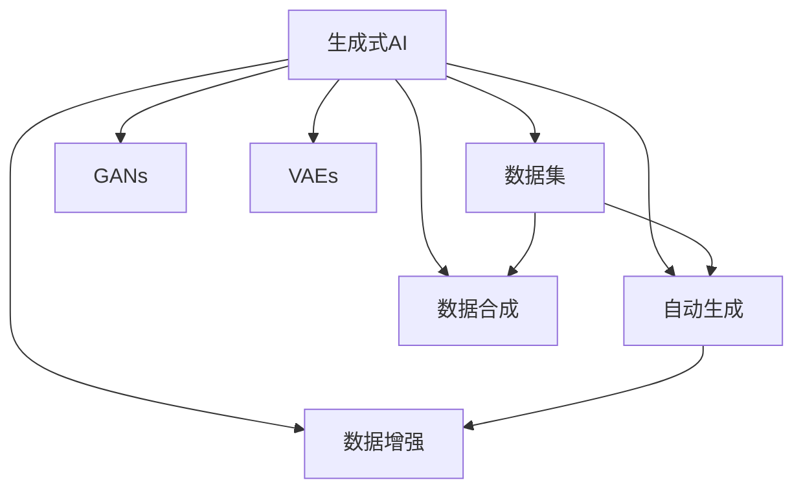
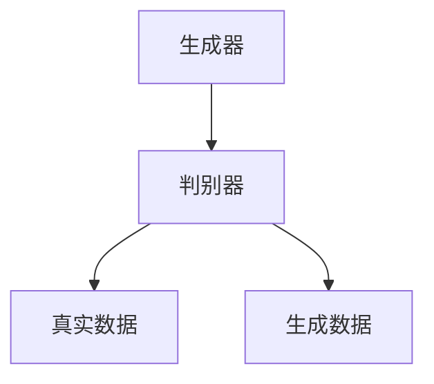

                 

# 生成式 AI：数据集的未来

> 关键词：生成式AI,数据集,未来,自动生成,深度学习,模型训练,数据增强,数据扩充,数据合成

## 1. 背景介绍

### 1.1 问题由来

随着人工智能技术的迅猛发展，生成式AI在图像、音频、文本等领域取得了令人瞩目的成果。特别是深度学习模型的广泛应用，使得自动生成高质量内容成为可能。然而，高质量数据的获取始终是生成式AI面临的巨大挑战。本节将探讨生成式AI数据集的现状、面临的挑战以及未来的发展趋势。

### 1.2 问题核心关键点

生成式AI的核心在于通过学习大量数据，生成新的、高质量的内容。数据集是生成式AI成功的基础，但现有数据集的规模和质量往往无法满足实际需求，且获取高质量数据的成本高昂。此外，生成式AI在实际应用中还需处理数据合成、数据增强等问题，如何在保持数据质量的同时，提升生成效果，是一个关键挑战。

## 2. 核心概念与联系

### 2.1 核心概念概述

为更好地理解生成式AI数据集的相关技术，本节将介绍几个关键概念：

- **生成式AI（Generative AI）**：指通过机器学习模型自动生成高质量内容的技术。包括但不限于生成图像、音频、文本等内容。
- **数据集（Dataset）**：指用于训练和评估生成式AI模型的数据集合。通常包含大量的样本数据，且每个样本都有一个或多个标签。
- **自动生成（Automatic Generation）**：指通过模型自动产生新的内容，而无需人工干预。
- **数据增强（Data Augmentation）**：指通过对现有数据进行变换、扩充，生成新的训练样本，以增强模型泛化能力。
- **数据合成（Data Synthesis）**：指利用生成模型自动合成新的数据，以弥补训练数据的不足。
- **对抗生成网络（GANs）**：一种生成式AI模型，通过对抗训练生成逼真的内容。
- **变分自编码器（VAEs）**：一种生成式模型，通过对隐变量的采样生成新的数据。

这些概念之间的逻辑关系可以通过以下Mermaid流程图来展示：



这个流程图展示了大语言模型的核心概念及其之间的关系：

1. 生成式AI依赖数据集进行模型训练。
2. 自动生成依赖于数据增强和数据合成技术，以提高生成质量。
3. 数据增强和数据合成技术可在GANs和VAEs模型的基础上实现。
4. 生成式AI可以通过GANs和VAEs等生成模型，实现高质量内容的自动生成。

## 3. 核心算法原理 & 具体操作步骤

### 3.1 算法原理概述

生成式AI的核心在于通过深度学习模型，学习数据集的统计特性，从而能够生成新的、逼真的数据。其算法原理包括以下几个步骤：

1. **数据准备**：收集和预处理训练数据集，确保数据的质量和多样性。
2. **模型训练**：通过深度学习模型学习数据集的特征，训练生成模型。
3. **数据增强**：对训练数据进行变换，生成新的训练样本，提升模型的泛化能力。
4. **数据合成**：利用生成模型生成新的数据，补充训练数据集，提升生成质量。
5. **模型评估**：通过测试数据集评估生成模型的性能，调整模型参数以提升生成效果。

### 3.2 算法步骤详解

以下是生成式AI数据集处理的详细步骤：

**Step 1: 数据准备**
- **数据收集**：从互联网、公共数据集、专业数据源等渠道收集所需的数据，确保数据的多样性和代表性。
- **数据清洗**：去除不完整、噪声数据，进行数据标准化、归一化等预处理。
- **数据标注**：为数据集中的每个样本添加标签，用于训练和评估模型。

**Step 2: 模型训练**
- **选择合适的生成模型**：如GANs、VAEs等，根据具体应用场景选择适合的生成模型。
- **设定训练参数**：如学习率、批量大小、迭代轮数等，设置合适的训练参数。
- **训练模型**：使用训练数据集对生成模型进行训练，最小化损失函数，优化模型参数。

**Step 3: 数据增强**
- **数据变换**：通过旋转、平移、缩放、裁剪等方式变换数据，生成新的训练样本。
- **数据扩充**：使用数据增强技术，如Mixup、Cutout、颜色抖动等，增加数据多样性。
- **训练模型**：使用增强后的数据重新训练模型，提升模型的泛化能力。

**Step 4: 数据合成**
- **生成新数据**：使用训练好的生成模型，生成新的数据样本，扩充训练集。
- **数据验证**：通过评估指标如FID、IS等，评估生成数据的逼真度和多样性。
- **优化模型**：根据生成数据的表现，调整生成模型的参数，优化生成效果。

**Step 5: 模型评估**
- **测试数据集**：收集独立的测试数据集，用于评估生成模型的性能。
- **评估指标**：使用IS、FID、SSIM等评估指标，评估生成数据的逼真度和多样性。
- **优化模型**：根据测试结果，调整生成模型参数，提升生成效果。

### 3.3 算法优缺点

生成式AI数据集处理的优势在于能够通过自动化技术生成大量高质量的数据，缓解数据获取的困难。同时，生成式AI在多领域、多任务上具有良好的泛化能力，可以大幅提升生成效果。

然而，生成式AI也存在一些缺点：

1. **数据质量难以控制**：生成的数据可能包含噪声、不真实的信息，难以保证数据质量。
2. **模型训练耗时耗资源**：训练大规模生成模型需要大量的计算资源和时间，成本较高。
3. **生成结果的可解释性不足**：生成的数据难以追溯生成过程，缺乏可解释性。
4. **对抗样本易被生成**：生成模型可能生成对抗样本，影响模型安全性。
5. **数据分布不一致**：生成的数据可能与真实数据分布不一致，导致模型泛化能力下降。

尽管存在这些局限性，但生成式AI数据集处理在大规模、高复杂度数据获取方面仍具有独特的优势，尤其是在缺乏高质量标注数据的情况下，能够通过生成式模型自动生成数据，提升模型的性能和应用范围。

### 3.4 算法应用领域

生成式AI数据集处理广泛应用于以下几个领域：

- **自动生成图像**：如人脸生成、图像生成、艺术作品生成等，通过GANs、VAEs等模型自动生成高质量的图像内容。
- **自动生成文本**：如文章生成、对话生成、摘要生成等，通过语言模型自动生成自然流畅的文本内容。
- **自动生成音频**：如音乐生成、语音合成、音频编辑等，通过WaveNet、VQ-VAE等模型自动生成逼真的音频内容。
- **数据增强**：在图像、文本、音频等多个领域，通过数据增强技术提升模型泛化能力。
- **数据合成**：在医疗、化工、环境监测等领域，通过生成模型自动合成新数据，弥补真实数据的不足。

以上领域展示了生成式AI数据集处理的广阔应用前景，未来随着技术的不断进步，生成式AI将在更多领域发挥重要作用。

## 4. 数学模型和公式 & 详细讲解 & 举例说明

### 4.1 数学模型构建

生成式AI数据集处理的数学模型通常基于生成对抗网络（GANs）、变分自编码器（VAEs）等深度学习框架。以GANs为例，其数学模型包括生成器和判别器两部分，如下所示：

$$
G(z) = \mu_{Z}(x|z), \quad D(x) = \mathbb{P}(G(z) \leq x) \approx \mathbb{P}(x \leq G(z))
$$

其中，$G$ 为生成器，$z$ 为隐变量，$D$ 为判别器，$x$ 为样本数据。

### 4.2 公式推导过程

以GANs为例，其损失函数定义如下：

$$
L_D = \mathbb{E}_{x \sim p_{\text{real}}(x)} [\log D(x)] + \mathbb{E}_{z \sim p_Z(z)} [\log(1 - D(G(z))]]
$$

其中，$p_{\text{real}}(x)$ 为真实数据分布，$G(z)$ 为生成器生成的数据。

生成器 $G(z)$ 的损失函数为：

$$
L_G = \mathbb{E}_{z \sim p_Z(z)} [\log D(G(z))]
$$

在实际训练中，GANs的损失函数可以通过优化算法（如Adam、SGD等）进行求解。

### 4.3 案例分析与讲解

以GANs在图像生成中的应用为例，下图展示了GANs的基本架构：



- **生成器**：将隐变量 $z$ 映射为生成数据 $G(z)$。
- **判别器**：区分真实数据 $C$ 和生成数据 $D$。

训练过程中，生成器和判别器通过对抗训练不断提升自身能力，最终实现高质量数据的自动生成。

## 5. 项目实践：代码实例和详细解释说明

### 5.1 开发环境搭建

在进行生成式AI数据集处理的实践前，我们需要准备好开发环境。以下是使用Python进行PyTorch开发的环境配置流程：

1. 安装Anaconda：从官网下载并安装Anaconda，用于创建独立的Python环境。

2. 创建并激活虚拟环境：
```bash
conda create -n pytorch-env python=3.8 
conda activate pytorch-env
```

3. 安装PyTorch：根据CUDA版本，从官网获取对应的安装命令。例如：
```bash
conda install pytorch torchvision torchaudio cudatoolkit=11.1 -c pytorch -c conda-forge
```

4. 安装TensorFlow：由Google主导开发的开源深度学习框架，生产部署方便，适合大规模工程应用。同样有丰富的预训练语言模型资源。

5. 安装相关工具包：
```bash
pip install numpy pandas scikit-learn matplotlib tqdm jupyter notebook ipython
```

完成上述步骤后，即可在`pytorch-env`环境中开始生成式AI数据集处理的实践。

### 5.2 源代码详细实现

这里我们以GANs在图像生成中的应用为例，给出使用PyTorch实现的代码示例。

```python
import torch
import torch.nn as nn
import torch.optim as optim
from torch.utils.data import DataLoader
from torchvision import datasets, transforms
import matplotlib.pyplot as plt

# 定义生成器模型
class Generator(nn.Module):
    def __init__(self, latent_dim, img_shape):
        super(Generator, self).__init__()
        self.model = nn.Sequential(
            nn.Linear(latent_dim, 256),
            nn.LeakyReLU(0.2),
            nn.Linear(256, 512),
            nn.LeakyReLU(0.2),
            nn.Linear(512, img_shape[0] * img_shape[1] * img_shape[2]),
            nn.Tanh()
        )
    
    def forward(self, z):
        img = self.model(z)
        return img.view(-1, img_shape[0], img_shape[1], img_shape[2])

# 定义判别器模型
class Discriminator(nn.Module):
    def __init__(self, img_shape):
        super(Discriminator, self).__init__()
        self.model = nn.Sequential(
            nn.Linear(img_shape[0] * img_shape[1] * img_shape[2], 512),
            nn.LeakyReLU(0.2),
            nn.Linear(512, 256),
            nn.LeakyReLU(0.2),
            nn.Linear(256, 1),
            nn.Sigmoid()
        )
    
    def forward(self, img):
        validity = self.model(img.view(-1, img_shape[0] * img_shape[1] * img_shape[2]))
        return validity

# 定义损失函数
def D_loss(D_real, D_fake):
    return torch.mean(torch.log(D_real)) + torch.mean(torch.log(1 - D_fake))

def G_loss(D_fake):
    return -torch.mean(torch.log(D_fake))

# 加载数据集
train_dataset = datasets.CIFAR10(root='./data', train=True, download=True, transform=transforms.ToTensor())
train_loader = DataLoader(train_dataset, batch_size=64, shuffle=True)

# 定义模型和优化器
latent_dim = 100
img_shape = (3, 32, 32)
G = Generator(latent_dim, img_shape)
D = Discriminator(img_shape)
G_optimizer = optim.Adam(G.parameters(), lr=0.0002)
D_optimizer = optim.Adam(D.parameters(), lr=0.0002)

# 训练模型
device = torch.device('cuda' if torch.cuda.is_available() else 'cpu')
G.to(device)
D.to(device)

for epoch in range(100):
    for i, (real_images, _) in enumerate(train_loader):
        real_images = real_images.to(device)

        # 生成伪造图像
        z = torch.randn(batch_size, latent_dim).to(device)
        fake_images = G(z)

        # 判别器损失
        D_real = D(real_images)
        D_fake = D(fake_images)
        d_loss = D_loss(D_real, D_fake)

        # 生成器损失
        G_loss = G_loss(D_fake)
        g_loss = G_loss + d_loss

        # 反向传播
        G_optimizer.zero_grad()
        G_loss.backward()
        G_optimizer.step()

        D_optimizer.zero_grad()
        d_loss.backward()
        D_optimizer.step()

        # 打印损失
        if (i+1) % 100 == 0:
            print(f'Epoch [{epoch+1}/{100}], Step [{i+1}/{len(train_loader)}], D_loss: {d_loss.item():.4f}, G_loss: {g_loss.item():.4f}')

# 可视化结果
fig, axes = plt.subplots(2, 5, figsize=(10, 10))
fig.suptitle('Generated Images')
for i, ax in enumerate(axes.flatten()):
    ax.axis('off')
    if i < 64:
        ax.imshow(train_images[i].numpy(), cmap='gray')
    else:
        ax.imshow(fake_images[i].numpy(), cmap='gray')
plt.show()
```

### 5.3 代码解读与分析

让我们再详细解读一下关键代码的实现细节：

**GANs实现**：
- **生成器**：使用线性变换、LeakyReLU激活函数、Tanh激活函数等构建生成器模型。
- **判别器**：使用线性变换、LeakyReLU激活函数、Sigmoid激活函数等构建判别器模型。
- **损失函数**：定义判别器的真实数据损失、生成数据的损失函数，以及生成器的损失函数。
- **数据加载**：使用CIFAR-10数据集，通过PyTorch的DataLoader实现批处理和随机化。
- **模型优化**：使用Adam优化器对生成器和判别器进行优化，设置合适的学习率。
- **训练流程**：对模型进行迭代训练，每100个步骤输出一次损失，可视化生成的图像。

**可视化结果**：
- 在训练过程中，每100个步骤可视化一次生成器生成的图像，以便观察模型的学习效果。

**数据增强**：
- 在实际应用中，可以使用数据增强技术进一步提升模型的泛化能力。例如，对输入图像进行随机裁剪、旋转、缩放、翻转等操作，生成新的训练样本。

**数据合成**：
- 在训练结束后，可以使用生成器模型生成新的数据，用于数据合成和扩充。

## 6. 实际应用场景

### 6.1 自动图像生成

自动图像生成是GANs在生成式AI中最典型的应用场景之一。在艺术创作、游戏设计、虚拟现实等领域，GANs能够自动生成高质量的图像内容，极大地提升了创作的效率和多样性。

### 6.2 医疗影像生成

在医疗领域，GANs能够自动生成高质量的医疗影像，如CT、MRI等，辅助医生进行诊断和治疗。通过数据增强和数据合成技术，GANs还能生成更多样化的影像数据，提升模型的泛化能力。

### 6.3 工业检测

在工业检测领域，GANs能够自动生成工业产品的缺陷图像，辅助机器学习模型进行缺陷检测和分类。通过数据增强技术，GANs还能生成更多样化的缺陷图像，提高检测模型的鲁棒性。

### 6.4 数据增强

数据增强技术在图像、文本、音频等多个领域都有广泛应用。例如，在图像领域，可以使用GANs生成更多的训练样本，提升模型的泛化能力。在文本领域，可以使用语言模型生成更多的训练数据，提升模型的语义理解能力。

### 6.5 数据合成

数据合成技术可以弥补训练数据的不足，提升模型的性能。例如，在医疗领域，可以使用GANs生成更多样化的患者数据，提升模型的诊断能力。在工业检测领域，可以使用GANs生成更多样化的产品数据，提高检测的准确性。

## 7. 工具和资源推荐

### 7.1 学习资源推荐

为了帮助开发者系统掌握生成式AI的相关技术，这里推荐一些优质的学习资源：

1. **《Deep Learning》by Ian Goodfellow**：经典深度学习教材，详细介绍了GANs、VAEs等生成模型的原理和应用。
2. **CS231n: Convolutional Neural Networks for Visual Recognition**：斯坦福大学开设的计算机视觉课程，涵盖GANs、VAEs等生成模型在图像生成中的应用。
3. **《Generative Adversarial Networks with TensorFlow》by Deep Learning A-Z**：使用TensorFlow实现GANs的实战教程，适合动手实践。
4. **GAN Zoo**：一个生成式AI模型的集合，包含多种类型的生成模型，便于快速学习和比较。
5. **arXiv**：深度学习领域的预印论文库，最新研究进展和代码实现通常在此发布。

通过对这些资源的学习实践，相信你一定能够快速掌握生成式AI的相关技术，并应用于实际项目中。

### 7.2 开发工具推荐

高效的开发离不开优秀的工具支持。以下是几款用于生成式AI开发的工具：

1. **PyTorch**：基于Python的开源深度学习框架，灵活动态的计算图，适合快速迭代研究。大部分生成模型都有PyTorch版本的实现。
2. **TensorFlow**：由Google主导开发的开源深度学习框架，生产部署方便，适合大规模工程应用。同样有丰富的生成模型资源。
3. **GAN Zoo**：一个生成式AI模型的集合，包含多种类型的生成模型，便于快速学习和比较。
4. **OpenAI Codex**：开源的生成式AI代码库，提供了多种生成模型的实现，适合快速实践。
5. **Jupyter Notebook**：免费的在线Jupyter Notebook环境，支持代码编写和可视化展示。

合理利用这些工具，可以显著提升生成式AI的开发效率，加快创新迭代的步伐。

### 7.3 相关论文推荐

生成式AI技术的发展源于学界的持续研究。以下是几篇奠基性的相关论文，推荐阅读：

1. **Generative Adversarial Nets**：Ian Goodfellow等人的经典论文，首次提出了GANs的概念，奠定了生成式AI的基础。
2. **Variance Reduction for Generative Adversarial Nets**：Ian Goodfellow等人的改进论文，提出了DENoise等方法，提升了GANs的稳定性。
3. **Semi-Supervised Learning with Generative Adversarial Nets**：Ian Goodfellow等人的论文，探讨了GANs在半监督学习中的应用。
4. **Conditional Image Synthesis with Auxiliary Classifier GANs**：Olivia et al.的论文，提出了条件GANs，用于生成有特定标签的图像。
5. **Improved Techniques for Training GANs**：Tim Salimans等人的改进论文，提出了WGAN、WGAN-GP等改进方法，提升了GANs的训练效果。

这些论文代表了大语言模型微调技术的发展脉络。通过学习这些前沿成果，可以帮助研究者把握学科前进方向，激发更多的创新灵感。

## 8. 总结：未来发展趋势与挑战

### 8.1 研究成果总结

生成式AI数据集处理在图像、文本、音频等领域取得了显著进展，广泛应用于自动生成、数据增强、数据合成等任务。GANs、VAEs等生成模型在生成高质量内容方面表现优异，推动了生成式AI技术的发展。

### 8.2 未来发展趋势

展望未来，生成式AI数据集处理将呈现以下几个发展趋势：

1. **数据生成质量提升**：随着生成模型的不断优化，生成的数据质量将逐步提升，逼真度、多样性等方面都将取得新的突破。
2. **多模态生成**：生成式AI将不仅仅局限于单一模态，未来的生成模型将能够生成视觉、语音、文本等多模态数据，增强模型的表现力。
3. **生成式增强**：生成式AI将与强化学习、因果推断等技术相结合，提升生成模型的智能水平和泛化能力。
4. **实时生成**：生成式AI将逐步实现实时生成，提高数据的实时性和交互性。
5. **元生成**：生成式AI将具备生成生成模型自身的学习能力，实现元生成和自适应生成，进一步提升生成效果。

### 8.3 面临的挑战

尽管生成式AI数据集处理已经取得了显著成果，但在迈向更加智能化、普适化应用的过程中，仍面临诸多挑战：

1. **数据质量控制**：生成的数据可能包含噪声、不真实的信息，难以保证数据质量。
2. **模型训练耗时**：训练大规模生成模型需要大量的计算资源和时间，成本较高。
3. **生成结果可解释性**：生成的数据难以追溯生成过程，缺乏可解释性。
4. **对抗样本生成**：生成模型可能生成对抗样本，影响模型安全性。
5. **数据分布不一致**：生成的数据可能与真实数据分布不一致，导致模型泛化能力下降。

### 8.4 研究展望

面对生成式AI数据集处理所面临的种种挑战，未来的研究需要在以下几个方面寻求新的突破：

1. **数据生成质量提升**：探索更多数据生成技术，提升生成的数据质量和多样性。
2. **生成模型优化**：开发更加高效的生成模型，减少计算资源消耗，提升生成效果。
3. **生成结果可解释性**：研究生成结果的可解释性技术，提升生成过程的可追溯性和可理解性。
4. **对抗样本防御**：研究对抗样本防御技术，提升生成模型的安全性。
5. **数据分布一致性**：探索生成模型与真实数据分布一致性的方法，提高模型的泛化能力。

这些研究方向将推动生成式AI数据集处理技术不断进步，为实际应用带来更多的可能性。相信随着学界和产业界的共同努力，生成式AI将会在更多领域发挥重要作用，为人类认知智能的进化带来深远影响。

## 9. 附录：常见问题与解答

**Q1：生成式AI数据集处理是否适用于所有应用场景？**

A: 生成式AI数据集处理在数据质量要求较高、训练数据获取困难的场景中尤为适用。例如，在缺乏高质量标注数据的情况下，可以通过生成式模型自动生成数据，提升模型的性能和应用范围。但在数据质量高、标注数据丰富的场景中，生成式AI可能不是最佳选择。

**Q2：生成式AI数据集处理的训练耗时和成本如何？**

A: 生成式AI数据集处理的训练耗时和成本较高，训练大规模生成模型需要大量的计算资源和时间。为了降低成本，可以采用分布式训练、硬件加速等技术手段。同时，通过迁移学习、预训练等技术，可以在少量数据上取得良好的效果，减少训练成本。

**Q3：如何保证生成数据的质量？**

A: 生成数据的质量控制主要依赖于生成模型的优化和训练。可以通过数据增强、对抗训练等技术手段，提升生成数据的质量和多样性。同时，可以通过模型评估指标如FID、IS等，实时监测生成数据的质量，调整模型参数以优化生成效果。

**Q4：生成式AI数据集处理在实际应用中有哪些难点？**

A: 生成式AI数据集处理在实际应用中面临数据分布不一致、生成结果可解释性不足、对抗样本生成等难点。需要结合多种技术手段，综合提升生成数据的质量和安全性。

**Q5：生成式AI数据集处理在应用中如何确保安全性？**

A: 生成式AI数据集处理的安全性依赖于生成模型的稳定性和鲁棒性。可以通过对抗训练、模型评估等手段，确保生成的数据符合实际需求，防止生成对抗样本等安全问题。同时，需要定期监控生成数据的质量和安全性，及时发现和解决潜在问题。

综上所述，生成式AI数据集处理在当前深度学习领域中具有重要的应用价值。通过不断优化生成模型和训练方法，提升生成数据的质量和多样性，未来生成式AI将会在更多领域发挥重要作用，为人类认知智能的进化带来深远影响。相信随着学界和产业界的共同努力，生成式AI将会在更多领域发挥重要作用，为人类认知智能的进化带来深远影响。

