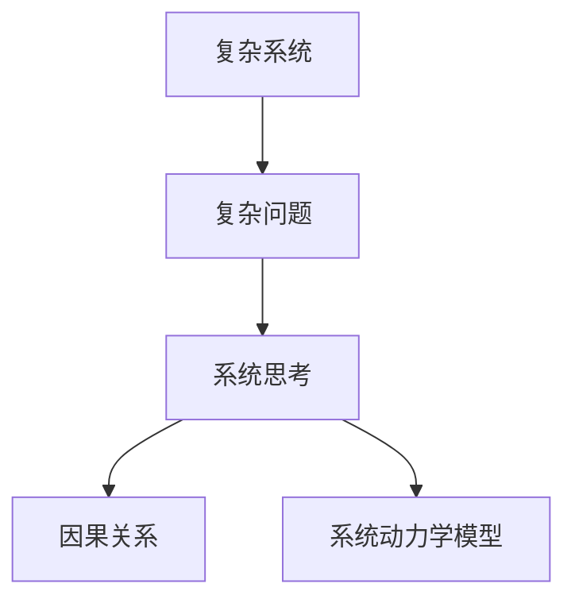

                 

# 用系统思考解决复杂问题

> 关键词：系统思考,复杂系统,复杂问题,自组织系统,因果关系,系统动力学模型

## 1. 背景介绍

### 1.1 问题由来
在信息技术飞速发展的今天，复杂系统（Complex Systems）已经在各个领域广泛存在，如互联网、生物系统、社会经济系统等。这些系统结构复杂、行为多样，难以通过传统的算法和工具进行有效的分析和管理。与此同时，复杂问题（Complex Problems）也越来越多地出现在我们的日常生活和工作中，如企业运营管理、环境污染治理、医疗健康管理等。如何处理这些复杂问题，成为了摆在科技工作者面前的重要课题。

复杂问题往往具有以下特点：
- 结构复杂：由多个子系统和子问题组成，各子系统之间存在复杂的相互作用。
- 行为多样：系统的动态行为难以预测，往往受到多种因素的共同影响。
- 目标多维：系统的优化目标往往是多方面的，如经济效益、环境保护、社会公正等，难以找到单一最优解。
- 环境影响：系统的运行受到外部环境条件的强烈制约，如政策法规、市场需求、技术进步等。

面对这些复杂问题，传统的算法和工具往往难以胜任。我们需要一种新的视角和方法来理解和处理这些系统，这就需要引入系统思考（Systems Thinking）这一理论和方法论。

## 2. 核心概念与联系

### 2.1 核心概念概述

为了更好地理解系统思考，首先需要了解几个核心概念：

- **复杂系统（Complex Systems）**：由大量子系统组成的系统，各子系统之间存在复杂的相互依赖和反馈关系。这些系统的行为和演化难以通过简单的数学模型进行描述和预测。
- **复杂问题（Complex Problems）**：具有结构复杂、行为多样、目标多维等特点的问题。解决这些问题需要考虑系统的各个组成部分和它们之间的相互作用。
- **系统思考（Systems Thinking）**：一种全面、动态、综合的思考方式，旨在通过理解系统的结构和动态行为，寻找系统问题的根本解决方案。
- **因果关系（Causal Relationships）**：系统中各个元素之间存在复杂的相互作用和因果关系。通过分析因果关系，可以揭示系统问题的本质和关键驱动因素。
- **系统动力学模型（System Dynamics Modeling）**：一种系统思考的工具，通过建立系统的数学模型，模拟系统的动态行为和演化过程，从而揭示系统的内在规律和优化路径。

这些概念之间的逻辑关系可以通过以下Mermaid流程图来展示：



这个流程图展示了几大核心概念之间的关系：

1. 复杂系统是由大量子系统组成的系统，各子系统之间存在复杂的相互依赖和反馈关系。
2. 复杂问题具有结构复杂、行为多样、目标多维等特点。
3. 系统思考是一种全面、动态、综合的思考方式，通过理解系统的结构和动态行为，寻找系统问题的根本解决方案。
4. 因果关系揭示了系统中各个元素之间的相互作用和因果关系。
5. 系统动力学模型通过建立系统的数学模型，模拟系统的动态行为和演化过程，揭示系统的内在规律和优化路径。

这些概念共同构成了系统思考的理论框架，为我们理解和处理复杂问题提供了新的视角和方法。

## 3. 核心算法原理 & 具体操作步骤
### 3.1 算法原理概述

系统思考的核心在于理解复杂系统的结构和动态行为，从而寻找系统问题的根本解决方案。这一过程可以通过建立系统的因果关系模型和动力学模型来实现。

### 3.2 算法步骤详解

建立系统动力学模型通常包括以下几个关键步骤：

**Step 1: 理解系统背景**
- 收集系统的各种数据和信息，包括系统结构、行为、目标、环境等。
- 识别系统中的关键子系统和元素，了解它们之间的相互作用和因果关系。
- 分析系统的长期行为和演化趋势，了解系统的动态特性。

**Step 2: 构建因果关系模型**
- 使用因果关系图（Causal Loop Diagram, CLD）等工具，建立系统的因果关系模型。
- 明确系统中各个元素之间的因果关系，如输入、输出、反馈等。
- 识别系统中的关键驱动因素和关键变量，以便后续建模和模拟。

**Step 3: 建立系统动力学模型**
- 基于因果关系模型，建立系统的数学模型。常用的模型包括微分方程模型、差分方程模型、系统动力学方程等。
- 通过参数分析和灵敏度分析，确定模型中的关键参数和不确定性因素。
- 使用Simulink、Vensim等系统动力学模拟软件，对模型进行仿真和验证。

**Step 4: 分析优化策略**
- 通过模拟和仿真，分析系统在不同条件下的行为和演化路径。
- 识别系统中的瓶颈和脆弱点，优化系统结构，提高系统的鲁棒性和稳定性。
- 提出多种优化策略，并进行比较和评估，选择最优方案。

**Step 5: 实施和验证**
- 根据优化策略，设计实施方案，并逐步实施。
- 对实施效果进行跟踪和评估，监测系统的动态行为和性能指标。
- 根据实施效果和反馈，不断调整优化策略，确保系统的长期稳定运行。

### 3.3 算法优缺点

系统动力学模型具有以下优点：
- 全面性：能够全面描述复杂系统的结构和动态行为。
- 综合性：综合考虑系统的各个组成部分和它们之间的相互作用。
- 动态性：能够模拟系统的长期行为和演化趋势。
- 预测性：通过仿真和验证，预测系统在不同条件下的行为和优化路径。

同时，该模型也存在一些局限性：
- 复杂性：模型构建和分析较为复杂，需要较高的专业知识和技能。
- 不确定性：系统动力学模型基于历史数据和假设，难以处理完全未知的情况。
- 多解性：系统动力学模型存在多种优化方案，难以确定最佳方案。
- 实际应用：模型构建和仿真需要大量时间和资源，难以在实际应用中快速实施。

尽管存在这些局限性，但系统动力学模型在处理复杂系统问题方面，仍然具有重要意义。通过对复杂系统的全面、动态、综合分析，系统动力学模型能够揭示系统的内在规律和优化路径，为复杂问题的解决提供了新的思路和方法。

### 3.4 算法应用领域

系统动力学模型广泛应用于各种复杂系统的分析和优化，如：

- 企业管理：优化企业运营流程，提高效率和效益。
- 环境治理：优化环境治理方案，改善生态环境。
- 医疗健康：优化医疗资源配置，提高医疗服务质量。
- 交通系统：优化交通网络，提高交通效率和安全性。
- 能源系统：优化能源配置，提高能源利用效率。

除了上述这些经典应用外，系统动力学模型还在城市规划、物流管理、公共安全等领域得到了广泛应用，为复杂问题的解决提供了新的思路和方法。

## 4. 数学模型和公式 & 详细讲解
### 4.1 数学模型构建

系统动力学模型通常建立在系统的因果关系模型基础上，通过建立系统的微分方程或差分方程来描述系统的动态行为。以一个简单的系统动力学模型为例，描述一个简单的企业库存管理系统。

假设系统中的变量包括：
- 当前库存量 $S(t)$
- 需求量 $D(t)$
- 供应量 $I(t)$
- 单位成本 $C$

根据系统的因果关系模型，可以建立以下微分方程：

$$
\frac{dS(t)}{dt} = -D(t) + I(t)
$$

其中，$-D(t)$ 表示库存消耗，$I(t)$ 表示库存增加。

### 4.2 公式推导过程

以库存管理系统的微分方程为例，进行公式推导：

假设系统的初始库存量为 $S_0$，需求量 $D$ 和供应量 $I$ 分别为常数 $d$ 和 $i$，则微分方程可以简化为：

$$
\frac{dS(t)}{dt} = -d + i
$$

解得：

$$
S(t) = S_0 + (i - d)t
$$

这表明，库存量随时间增加，初始库存量、每日需求量和供应量之间的差值决定了库存的变化速度。

### 4.3 案例分析与讲解

以一个简单的库存管理系统为例，分析系统动力学模型的应用：

假设一个企业每天的需求量为 100 个单位，供应量为 120 个单位，初始库存量为 200 个单位。使用系统动力学模型进行模拟，可以得出以下结果：

- 在第 30 天，库存量将降至 0。
- 在第 40 天，库存量将恢复至 200 个单位。
- 如果需求量和供应量保持不变，库存量将在 0 和 200 个单位之间周期性波动。

通过系统动力学模型的仿真和分析，可以发现，库存系统的波动主要是由于需求量和供应量之间的差异引起的。为了稳定库存水平，可以考虑增加供应量或减少需求量，或者在供应量不足时进行外部采购。

## 5. 项目实践：代码实例和详细解释说明
### 5.1 开发环境搭建

在进行系统动力学模型开发前，我们需要准备好开发环境。以下是使用Python进行System Dynamics库（JLabel）开发的环境配置流程：

1. 安装Anaconda：从官网下载并安装Anaconda，用于创建独立的Python环境。

2. 创建并激活虚拟环境：
```bash
conda create -n syssys-env python=3.8 
conda activate syssys-env
```

3. 安装System Dynamics库：
```bash
pip install jlabel
```

4. 安装各类工具包：
```bash
pip install numpy pandas scipy scikit-learn matplotlib seaborn jupyter notebook ipython
```

完成上述步骤后，即可在`syssys-env`环境中开始系统动力学模型的开发。

### 5.2 源代码详细实现

这里我们以库存管理系统为例，给出使用JLabel库对库存系统进行建模和仿真的Python代码实现。

首先，定义系统变量和微分方程：

```python
import jlabel as jl

# 定义系统变量
S = jl.ProcessVariable('S', '库存量', 200, 0, 400)  # 初始库存量为200
D = jl.ProcessVariable('D', '需求量', 100, 0, 300)  # 每日需求量为100
I = jl.ProcessVariable('I', '供应量', 120, 0, 400)  # 每日供应量为120

# 定义微分方程
equation = jl.DifferentialEquation(jl.diff(S, 't') + D - I)
```

然后，进行系统动力学模型仿真和结果可视化：

```python
# 定义仿真时间步长
step = 1

# 定义仿真时间范围
time_range = 50

# 进行系统仿真
model = jl.System(equation)
results = model.simulate(time_range, step)

# 绘制库存量随时间的变化曲线
jlabel.plot(results['s'], label='库存量')

# 绘制需求量和供应量随时间的变化曲线
jlabel.plot(results['D'], label='需求量')
jlabel.plot(results['I'], label='供应量')

# 显示图形
jlabel.show()
```

以上代码展示了使用JLabel库进行系统动力学模型建模和仿真的完整流程。通过定义系统变量和微分方程，使用JLabel库的Simulate函数进行仿真，并使用Plot函数绘制库存量、需求量和供应量随时间的变化曲线，最终通过Show函数展示图形。

### 5.3 代码解读与分析

让我们再详细解读一下关键代码的实现细节：

**ProcessVariable类**：
- 定义了系统变量，包括变量名称、初始值、范围和单位。在定义系统变量时，需要根据实际情况设置合理的取值范围和单位，以便后续进行仿真和分析。

**DifferentialEquation类**：
- 定义了微分方程，描述了系统中的动态行为。微分方程中的变量需要与系统变量一一对应。

**System类**：
- 通过定义系统方程，创建了系统动力学模型。创建模型后，可以使用Simulate函数进行仿真，得到系统变量的变化结果。

**Plot函数和Show函数**：
- 使用Plot函数绘制系统变量的变化曲线，可以使用Label函数添加标签和图例，使用Show函数展示图形。

在实际应用中，JLabel库可以结合图形用户界面(GUI)等工具，实现更灵活的模型构建和仿真操作。同时，JLabel库还支持多种仿真算法和优化方法，可以应对更加复杂和多样化的系统问题。

## 6. 实际应用场景
### 6.1 企业运营管理

系统动力学模型在企业运营管理中具有广泛应用，如供应链管理、库存管理、生产计划等。通过对企业的各项运营指标进行建模和仿真，可以优化企业的运营流程，提高效率和效益。

在供应链管理中，可以使用系统动力学模型对供应链各个环节进行建模，模拟和分析不同策略对供应链绩效的影响。例如，通过仿真库存系统、物流系统、生产系统等，可以优化企业的库存水平、生产计划和物流调度，提高供应链的整体效率。

### 6.2 环境治理

环境治理是一个典型的复杂系统问题，涉及到多个子系统之间的相互作用。系统动力学模型可以用于优化环境治理方案，改善生态环境。

例如，可以使用系统动力学模型对城市的污水处理系统进行建模，模拟和分析不同污水处理策略对环境的影响。通过仿真污水处理系统、水质监测系统、水资源利用系统等，可以优化污水处理方案，改善水质和生态环境。

### 6.3 医疗健康管理

医疗健康管理也是一个复杂的系统问题，涉及到医疗资源的配置、疾病的传播和防控等。系统动力学模型可以用于优化医疗资源的配置，提高医疗服务质量。

例如，可以使用系统动力学模型对医院的门诊就诊流程进行建模，模拟和分析不同就诊流程对患者体验和医院效率的影响。通过仿真门诊流程、就诊排队系统、医疗资源调度系统等，可以优化就诊流程，提高医院的工作效率和患者满意度。

### 6.4 未来应用展望

随着系统动力学模型的不断发展和完善，其在处理复杂系统问题方面将发挥越来越重要的作用。未来，系统动力学模型将会在以下几个方面得到更广泛的应用：

1. 实时仿真：利用实时数据进行系统仿真，实现对复杂系统动态行为的实时监测和预测。
2. 自适应控制：通过自适应控制算法，优化系统动力学模型，实现对复杂系统的高效控制。
3. 智能决策支持：结合人工智能技术，提供智能决策支持，帮助用户做出最优决策。
4. 跨领域应用：将系统动力学模型应用于更多领域，如金融系统、交通系统、城市规划等，为不同领域的复杂问题提供解决方案。
5. 多尺度建模：结合多尺度建模技术，建立更加全面和精确的系统动力学模型，提升模型的准确性和可靠性。

系统动力学模型作为一种全面、动态、综合的思考方式，将为处理复杂系统问题提供新的思路和方法。未来，通过不断探索和创新，系统动力学模型必将在更多领域得到应用，推动社会的可持续发展。

## 7. 工具和资源推荐
### 7.1 学习资源推荐

为了帮助开发者系统掌握系统动力学模型的理论基础和实践技巧，这里推荐一些优质的学习资源：

1. **《系统动力学：原理与实践》**：系统动力学领域的经典教材，详细介绍了系统动力学模型的基本原理、建模方法、仿真技术等内容。
2. **Simulink系统动力学建模教程**：Simulink是MATLAB的图形化仿真工具，支持系统动力学建模和仿真。该教程提供了丰富的系统动力学建模案例，帮助用户快速上手。
3. **Vensim系统动力学建模教程**：Vensim是一款系统动力学建模和仿真工具，支持丰富的建模和分析功能。该教程提供了详细的系统动力学建模案例，帮助用户深入理解系统动力学模型。
4. **JLabel官方文档**：JLabel是Java语言编写的系统动力学建模工具，支持丰富的建模和仿真功能。官方文档提供了详细的教程和示例，帮助用户快速上手。
5. **系统动力学模型与系统思考工作坊**：许多学术机构和培训机构提供系统动力学模型和系统思考的工作坊和课程，帮助用户系统掌握相关知识。

通过对这些资源的学习实践，相信你一定能够快速掌握系统动力学模型的精髓，并用于解决实际的复杂系统问题。

### 7.2 开发工具推荐

高效的开发离不开优秀的工具支持。以下是几款用于系统动力学模型开发常用的工具：

1. **MATLAB Simulink**：MATLAB的图形化仿真工具，支持系统动力学建模和仿真，具有丰富的图形化界面和功能。
2. **Vensim**：一款系统动力学建模和仿真工具，支持丰富的建模和分析功能，广泛应用于复杂系统建模和仿真。
3. **JLabel**：Java语言编写的系统动力学建模工具，支持丰富的建模和仿真功能，易于与其他Java应用程序集成。
4. **Python**：Python是一种功能强大的编程语言，支持多种系统动力学建模库，如PyLabel、ODESolver等。
5. **R**：R是一种数据分析和统计软件，支持多种系统动力学建模库，如R System Dynamics等。

合理利用这些工具，可以显著提升系统动力学模型的开发效率，加快创新迭代的步伐。

### 7.3 相关论文推荐

系统动力学模型和系统思考的研究始于20世纪70年代，许多经典论文奠定了这一领域的基础。以下是几篇奠基性的相关论文，推荐阅读：

1. **《系统动力学：理论、方法和应用》**：系统动力学领域的经典教材，由MIT教授Jay W. Forrester和Jos B. Onnesson撰写，介绍了系统动力学的基本原理和建模方法。
2. **《复杂系统建模与仿真》**：由MIT教授Jay W. Forrester和Jos B. Onnesson撰写，介绍了复杂系统建模和仿真的基本原理和方法。
3. **《系统动力学模型与决策》**：由MIT教授Jay W. Forrester撰写，介绍了系统动力学模型在决策分析中的应用，展示了系统思考在管理决策中的重要作用。
4. **《系统动力学建模与仿真实践》**：由MIT教授Jay W. Forrester和Jos B. Onnesson撰写，介绍了系统动力学建模和仿真的实践技巧和应用案例。
5. **《系统思考与复杂问题解决》**：由MIT教授Peter Senge撰写，介绍了系统思考在复杂问题解决中的应用，展示了系统思考的全面性和动态性。

这些论文代表了大系统动力学模型的发展脉络。通过学习这些前沿成果，可以帮助研究者把握学科前进方向，激发更多的创新灵感。

## 8. 总结：未来发展趋势与挑战
### 8.1 总结

本文对系统动力学模型的理论基础和实践技巧进行了全面系统的介绍。首先阐述了系统思考的基本概念和重要性，明确了系统动力学模型在处理复杂系统问题中的独特价值。其次，从原理到实践，详细讲解了系统动力学模型的数学模型构建和仿真过程，给出了系统动力学模型开发的完整代码实例。同时，本文还广泛探讨了系统动力学模型在企业运营管理、环境治理、医疗健康等多个领域的应用前景，展示了系统动力学模型的广泛应用潜力。此外，本文精选了系统动力学模型的各类学习资源，力求为读者提供全方位的技术指引。

通过本文的系统梳理，可以看到，系统动力学模型作为一种全面、动态、综合的思考方式，为处理复杂系统问题提供了新的思路和方法。未来，随着系统动力学模型的不断发展和完善，其在处理复杂系统问题方面将发挥越来越重要的作用。

### 8.2 未来发展趋势

展望未来，系统动力学模型将呈现以下几个发展趋势：

1. **实时仿真**：利用实时数据进行系统仿真，实现对复杂系统动态行为的实时监测和预测。
2. **自适应控制**：通过自适应控制算法，优化系统动力学模型，实现对复杂系统的高效控制。
3. **智能决策支持**：结合人工智能技术，提供智能决策支持，帮助用户做出最优决策。
4. **跨领域应用**：将系统动力学模型应用于更多领域，如金融系统、交通系统、城市规划等，为不同领域的复杂问题提供解决方案。
5. **多尺度建模**：结合多尺度建模技术，建立更加全面和精确的系统动力学模型，提升模型的准确性和可靠性。

这些趋势凸显了系统动力学模型在处理复杂系统问题方面的广阔前景。这些方向的探索发展，必将进一步提升系统动力学模型的性能和应用范围，为处理复杂系统问题提供新的思路和方法。

### 8.3 面临的挑战

尽管系统动力学模型已经取得了瞩目成就，但在迈向更加智能化、普适化应用的过程中，它仍面临着诸多挑战：

1. **数据获取困难**：系统动力学模型需要大量的数据进行建模和仿真，而获取高质量的数据往往需要较高的成本和资源。
2. **模型复杂性**：系统动力学模型通常较为复杂，难以建立和理解。如何简化模型结构，提高模型的可解释性和可操作性，还需要进一步探索。
3. **结果可解释性**：系统动力学模型的输出结果往往较为复杂，难以进行解释和理解。如何提高模型的可解释性，增强用户对模型结果的信任，还需要进一步研究。
4. **模型验证困难**：系统动力学模型的仿真和验证需要大量的实验和验证数据，难以在实际应用中快速验证。如何建立有效的模型验证方法，提高模型的可靠性，还需要进一步探索。
5. **跨学科挑战**：系统动力学模型涉及多学科知识，如何跨学科合作，共同解决复杂系统问题，还需要进一步探索。

尽管存在这些挑战，但系统动力学模型在处理复杂系统问题方面仍然具有重要意义。通过不断探索和创新，系统动力学模型必将在更多领域得到应用，推动社会的可持续发展。

### 8.4 研究展望

未来，在系统动力学模型的研究中，需要重点关注以下几个方面：

1. **数据获取和处理**：研究高效的数据获取和处理技术，提高系统动力学模型的数据质量和可用性。
2. **模型简化和优化**：研究简化和优化系统动力学模型的算法和技术，提高模型的可解释性和可操作性。
3. **模型验证和评估**：研究有效的模型验证和评估方法，提高模型的可靠性和准确性。
4. **跨学科合作**：推动多学科合作，共同解决复杂系统问题，提高模型的应用范围和效果。
5. **智能系统集成**：研究将系统动力学模型与其他智能系统集成的方法和技术，提高系统的综合能力和应用效果。

这些方向的研究将进一步推动系统动力学模型的发展和应用，为处理复杂系统问题提供新的思路和方法。相信在系统动力学模型的不断探索和发展中，系统思考的理论和方法将得到更广泛的应用，为处理复杂系统问题提供新的视角和方法。

## 9. 附录：常见问题与解答
----------------------------------------------------------------

**Q1：系统动力学模型是否适用于所有复杂系统？**

A: 系统动力学模型适用于具有明确因果关系和动态行为的复杂系统，如企业管理、环境治理、医疗健康等。但对于一些缺乏因果关系或动态行为的系统，如金融市场、气象系统等，系统动力学模型可能难以胜任。此时可以考虑结合其他方法，如机器学习、仿真模拟等。

**Q2：系统动力学模型如何处理不确定性因素？**

A: 系统动力学模型通常需要考虑不确定性因素，如需求量、供应量、环境变化等。为了处理不确定性因素，可以引入随机过程、蒙特卡罗模拟等方法，进行系统仿真的不确定性分析。此外，还可以通过多情景分析，探索不同情景下的系统行为和优化策略。

**Q3：系统动力学模型在实际应用中需要注意哪些问题？**

A: 在实际应用中，系统动力学模型需要注意以下问题：
1. 数据质量：确保数据的质量和完整性，减少数据获取和处理中的误差。
2. 模型简化：简化模型结构，提高模型的可解释性和可操作性。
3. 模型验证：通过实验和验证数据，确保模型的可靠性和准确性。
4. 用户接受度：提高用户对模型结果的理解和接受度，增强用户对模型的信任。
5. 跨学科合作：推动多学科合作，共同解决复杂系统问题，提高模型的应用范围和效果。

**Q4：系统动力学模型在处理复杂问题时有哪些优点和缺点？**

A: 系统动力学模型的优点包括：
1. 全面性：能够全面描述复杂系统的结构和动态行为。
2. 综合性：综合考虑系统的各个组成部分和它们之间的相互作用。
3. 动态性：能够模拟系统的长期行为和演化趋势。
4. 预测性：通过仿真和验证，预测系统在不同条件下的行为和优化路径。

系统动力学模型的缺点包括：
1. 复杂性：模型构建和分析较为复杂，需要较高的专业知识和技能。
2. 不确定性：系统动力学模型基于历史数据和假设，难以处理完全未知的情况。
3. 多解性：系统动力学模型存在多种优化方案，难以确定最佳方案。
4. 实际应用：模型构建和仿真需要大量时间和资源，难以在实际应用中快速实施。

尽管存在这些局限性，但系统动力学模型在处理复杂系统问题方面仍然具有重要意义。通过对复杂系统的全面、动态、综合分析，系统动力学模型能够揭示系统的内在规律和优化路径，为复杂问题的解决提供了新的思路和方法。

---

作者：禅与计算机程序设计艺术 / Zen and the Art of Computer Programming

