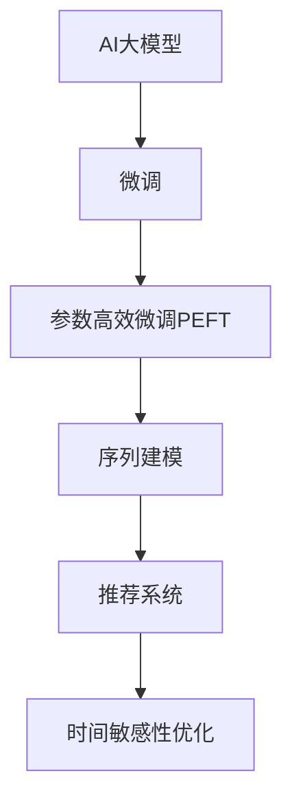

                 

# 电商平台个性化推送：AI大模型的时间敏感性优化

## 1. 背景介绍

随着电商平台的迅猛发展，个性化推荐已成为提升用户体验和转化率的关键。通过分析用户历史行为、浏览记录等数据，电商平台可以实时推送相关商品，帮助用户发现更多感兴趣的商品，并提高购买决策的效率。然而，这种实时推荐不仅需要高效的计算资源，还需要强大的数据处理和模型优化能力。AI大模型作为近年来在自然语言处理(NLP)和计算机视觉(CV)等领域表现突出的技术，正被广泛应用于电商平台的个性化推荐系统。

本文旨在探讨如何在大模型微调过程中引入时间敏感性优化，以提升个性化推荐系统的效果和效率。我们将在传统微调方法的基础上，通过引入时间敏感性约束，优化模型参数，增强推荐系统的实时性和个性化能力。

## 2. 核心概念与联系

### 2.1 核心概念概述

在进行时间敏感性优化时，涉及以下核心概念：

- **AI大模型**：以深度学习为基础，通过大规模数据训练得到的通用或领域特定知识表示模型。常见的大模型包括BERT、GPT、ViT等。

- **微调(Fine-tuning)**：在预训练模型的基础上，使用特定任务的数据对模型进行有监督学习，以提升模型在该任务上的性能。

- **时间敏感性优化**：在微调过程中，引入时间因素的约束，以优化模型参数，提升推荐系统的实时性和个性化能力。

- **参数高效微调(PEFT)**：在微调过程中，只更新少量参数，以提高计算效率和模型泛化能力。

- **序列建模(Sequence Modeling)**：对用户行为序列进行分析，提取用户兴趣和偏好，进行实时推荐。

- **推荐系统**：根据用户历史行为和兴趣，推荐相关商品或内容的系统，用于电商、新闻、社交网络等平台。

这些概念之间的逻辑关系可以通过以下Mermaid流程图来展示：



这个流程图展示了大模型的核心概念及其之间的关系：

1. 大模型通过预训练获得基础能力。
2. 微调是对预训练模型进行任务特定的优化，以提升模型在特定任务上的性能。
3. 参数高效微调技术在固定大部分预训练参数的同时，只微调顶层，以提高微调效率和泛化能力。
4. 序列建模通过分析用户行为序列，提取用户兴趣和偏好。
5. 推荐系统利用用户兴趣，实时推送相关商品，提高用户体验和转化率。
6. 时间敏感性优化引入时间因素的约束，提升推荐系统的实时性和个性化能力。

## 3. 核心算法原理 & 具体操作步骤

### 3.1 算法原理概述

时间敏感性优化基于传统的微调方法，通过引入时间因素，增强模型的实时性和个性化能力。假设用户历史行为序列为 $x_t = \{x_{t-1}, x_{t-2}, ..., x_1\}$，当前时刻为 $t$，目标是在用户最近的行为序列上，最大化推荐商品的点击率 $y_t$。

形式化地，可以定义时间敏感性优化的问题如下：

$$
\min_{\theta} \sum_{i=1}^t \ell(y_i, f_\theta(x_i))
$$

其中，$f_\theta(x)$ 为模型对输入 $x$ 的输出，$\ell$ 为损失函数，$\theta$ 为模型参数。

在优化过程中，需要考虑模型的实时性和个性化能力。实时性要求模型能够在用户行为产生后快速响应，个性化要求模型能够根据用户的历史行为和兴趣，生成符合用户期望的推荐。

### 3.2 算法步骤详解

基于时间敏感性优化的大模型微调方法，主要包括以下几个关键步骤：

**Step 1: 准备预训练模型和数据集**
- 选择合适的预训练模型 $M_{\theta}$ 作为初始化参数，如 BERT、GPT 等。
- 准备电商平台的商品信息数据集，包括商品名称、价格、销量、用户评价等。
- 收集用户历史行为数据，包括浏览、点击、购买、评分等行为序列。

**Step 2: 设计任务适配层**
- 根据推荐任务，设计任务适配层，包括商品特征编码和用户兴趣提取等模块。
- 将商品特征和用户兴趣向量输入到预训练模型中，进行特征表示。
- 将模型输出与用户行为序列进行对齐，生成推荐结果。

**Step 3: 添加时间敏感性约束**
- 在损失函数中引入时间因素，如考虑用户最近行为的权重，加入时间衰减因子等。
- 使用时间敏感性约束，优化模型参数，以最大化用户点击率。

**Step 4: 执行梯度训练**
- 将训练集数据分批次输入模型，前向传播计算损失函数。
- 反向传播计算参数梯度，根据设定的优化算法和学习率更新模型参数。
- 周期性在验证集上评估模型性能，根据性能指标决定是否触发 Early Stopping。
- 重复上述步骤直到满足预设的迭代轮数或 Early Stopping 条件。

**Step 5: 测试和部署**
- 在测试集上评估微调后模型 $M_{\hat{\theta}}$ 的性能，对比微调前后的点击率提升。
- 使用微调后的模型对新样本进行推理预测，集成到实际的应用系统中。
- 持续收集新的用户行为数据，定期重新微调模型，以适应数据分布的变化。

以上是时间敏感性优化的基本流程。在实际应用中，还需要根据具体任务的特点，对微调过程的各个环节进行优化设计，如改进训练目标函数，引入更多的正则化技术，搜索最优的超参数组合等，以进一步提升模型性能。

### 3.3 算法优缺点

时间敏感性优化算法具有以下优点：
1. 增强实时性：引入时间因素的约束，使得推荐系统能够在用户行为产生后快速响应。
2. 提升个性化能力：通过分析用户历史行为序列，生成符合用户期望的推荐。
3. 数据利用充分：充分利用用户历史行为数据，提高模型的泛化能力。
4. 参数高效：采用参数高效微调技术，在固定大部分预训练参数的情况下，仍可取得不错的提升。

同时，该算法也存在一定的局限性：
1. 对标注数据依赖：时间敏感性优化仍然需要标注数据，标注成本较高。
2. 模型复杂度：引入时间因素后，模型复杂度增加，计算成本提高。
3. 数据分布变化：如果用户行为序列分布发生变化，模型需要重新微调以适应新分布。
4. 计算资源需求高：推荐系统需要实时处理大量用户数据，对计算资源要求较高。

尽管存在这些局限性，但就目前而言，时间敏感性优化方法仍是大模型在推荐系统应用中最主流范式。未来相关研究的重点在于如何进一步降低对标注数据的依赖，提高模型的泛化能力和实时性，同时兼顾模型的可解释性和效率等因素。

### 3.4 算法应用领域

基于大模型微调的时间敏感性优化方法，在电商平台的个性化推荐系统上已经得到了广泛的应用，覆盖了以下应用场景：

1. **商品推荐**：根据用户浏览、点击、购买等行为序列，实时推荐相关商品，提升用户体验和转化率。
2. **广告推荐**：根据用户点击广告的行为序列，实时推荐符合用户兴趣的广告，提高广告点击率和转化率。
3. **个性化内容推荐**：根据用户阅读、观看等行为序列，推荐相关内容，如新闻、视频等，提升用户留存和活跃度。
4. **排行榜推荐**：根据用户对排行榜的点击行为序列，推荐热门商品，吸引更多用户关注。
5. **搜索推荐**：根据用户搜索记录，实时推荐相关商品，缩短搜索时间，提高搜索准确率。

这些应用场景展示了时间敏感性优化方法在电商平台上的强大应用潜力。随着大语言模型和微调方法的不断进步，基于时间敏感性优化的推荐系统将在更多领域得到应用，为电商平台带来更高的价值和效率。

## 4. 数学模型和公式 & 详细讲解

### 4.1 数学模型构建

基于时间敏感性优化的大模型推荐系统，可以形式化为以下优化问题：

$$
\min_{\theta} \sum_{i=1}^t \ell(y_i, f_\theta(x_i))
$$

其中 $y_i$ 为第 $i$ 个用户的点击行为，$f_\theta(x)$ 为模型对输入 $x$ 的输出，$\ell$ 为损失函数，$\theta$ 为模型参数。

假设用户的历史行为序列为 $x_t = \{x_{t-1}, x_{t-2}, ..., x_1\}$，当前时刻为 $t$，目标是在用户最近的行为序列上，最大化推荐商品的点击率 $y_t$。可以定义序列建模的目标函数如下：

$$
L(\theta) = -\sum_{i=1}^t y_i \log f_\theta(x_i)
$$

其中，$f_\theta(x)$ 为模型对输入 $x$ 的输出，$\ell$ 为交叉熵损失函数。

### 4.2 公式推导过程

在推导目标函数的过程中，我们假设用户的行为序列 $x_t$ 和点击行为 $y_t$ 是独立的，并且模型 $f_\theta(x)$ 的输出 $f_\theta(x_i)$ 与用户的历史行为序列 $x_t$ 是独立的。这样，我们就可以将目标函数表示为：

$$
L(\theta) = -\sum_{i=1}^t y_i \log f_\theta(x_i)
$$

在实际应用中，由于用户的行为序列 $x_t$ 和点击行为 $y_t$ 并非完全独立，我们还需要考虑时间因素的影响。例如，用户最近的行为序列对当前的点击行为有较大的影响，而更早的行为序列影响较小。因此，我们可以引入时间衰减因子 $\alpha_i$，使得模型输出 $f_\theta(x_i)$ 的权重随着时间推移而衰减。这样，目标函数可以进一步表示为：

$$
L(\theta) = -\sum_{i=1}^t \alpha_i y_i \log f_\theta(x_i)
$$

其中，$\alpha_i$ 为时间衰减因子，$y_i$ 为第 $i$ 个用户的点击行为，$f_\theta(x)$ 为模型对输入 $x$ 的输出。

### 4.3 案例分析与讲解

下面以电商平台的商品推荐为例，具体分析时间敏感性优化的应用。

假设我们有一个包含商品名称、价格、销量、用户评价等信息的商品数据集，以及一个包含用户浏览、点击、购买等行为序列的用户数据集。我们希望使用时间敏感性优化的方法，根据用户的历史行为序列，实时推荐相关商品，提高用户体验和转化率。

首先，我们需要设计一个推荐系统，将用户行为序列和商品特征向量输入到模型中，生成推荐结果。我们可以使用一个线性变换，将用户行为序列和商品特征向量拼接起来，作为模型的输入，并使用一个全连接层作为输出。

$$
f_\theta(x) = W_1 \cdot [x_1, x_2, ..., x_t] + b_1
$$

其中，$W_1$ 为权重矩阵，$b_1$ 为偏置向量。

接下来，我们需要定义损失函数，将模型输出与用户行为序列进行对齐。我们可以使用一个交叉熵损失函数，计算模型输出与用户点击行为的差异：

$$
\ell(y_i, f_\theta(x_i)) = -y_i \log f_\theta(x_i)
$$

在实际应用中，我们需要考虑时间因素的影响，可以使用时间衰减因子 $\alpha_i$，使得最近的行为序列对模型的影响更大。具体地，我们可以将时间衰减因子与用户行为序列 $x_t$ 相乘，作为模型的输入：

$$
f_\theta(x) = W_1 \cdot [\alpha_1 x_1, \alpha_2 x_2, ..., \alpha_t x_t] + b_1
$$

其中，$\alpha_i$ 为时间衰减因子，$x_i$ 为用户行为序列。

最终，我们可以将目标函数表示为：

$$
L(\theta) = -\sum_{i=1}^t \alpha_i y_i \log f_\theta(x_i)
$$

在优化过程中，我们需要使用梯度下降等优化算法，最小化目标函数 $L(\theta)$。同时，我们还需要引入正则化技术，如L2正则、Dropout等，防止模型过拟合。

通过上述步骤，我们便可以在电商平台上实现基于大模型的时间敏感性优化推荐系统。

## 5. 项目实践：代码实例和详细解释说明

### 5.1 开发环境搭建

在进行时间敏感性优化实践前，我们需要准备好开发环境。以下是使用Python进行PyTorch开发的环境配置流程：

1. 安装Anaconda：从官网下载并安装Anaconda，用于创建独立的Python环境。

2. 创建并激活虚拟环境：
```bash
conda create -n pytorch-env python=3.8 
conda activate pytorch-env
```

3. 安装PyTorch：根据CUDA版本，从官网获取对应的安装命令。例如：
```bash
conda install pytorch torchvision torchaudio cudatoolkit=11.1 -c pytorch -c conda-forge
```

4. 安装Transformers库：
```bash
pip install transformers
```

5. 安装各类工具包：
```bash
pip install numpy pandas scikit-learn matplotlib tqdm jupyter notebook ipython
```

完成上述步骤后，即可在`pytorch-env`环境中开始微调实践。

### 5.2 源代码详细实现

这里我们以电商平台商品推荐为例，使用PyTorch和Transformers库实现时间敏感性优化的微调。

首先，定义推荐系统的数据处理函数：

```python
from transformers import BertTokenizer
from torch.utils.data import Dataset
import torch

class RecommendationDataset(Dataset):
    def __init__(self, user_seqs, item_ids, item_features, seq_lens):
        self.user_seqs = user_seqs
        self.item_ids = item_ids
        self.item_features = item_features
        self.seq_lens = seq_lens
        
    def __len__(self):
        return len(self.user_seqs)
    
    def __getitem__(self, item):
        user_seq = self.user_seqs[item]
        item_id = self.item_ids[item]
        item_feature = self.item_features[item]
        seq_len = self.seq_lens[item]
        
        # 对用户行为序列进行编码
        encoded_seq = self.tokenizer(user_seq, padding='max_length', truncation=True)
        input_ids = encoded_seq['input_ids'][0]
        attention_mask = encoded_seq['attention_mask'][0]
        
        # 对商品特征进行编码
        encoded_item = self.tokenizer(item_feature, padding='max_length', truncation=True)
        item_input_ids = encoded_item['input_ids'][0]
        item_attention_mask = encoded_item['attention_mask'][0]
        
        return {'input_ids': input_ids,
                'attention_mask': attention_mask,
                'item_input_ids': item_input_ids,
                'item_attention_mask': item_attention_mask,
                'user_seq_len': seq_len,
                'item_id': item_id}
```

然后，定义模型和优化器：

```python
from transformers import BertForSequenceClassification, AdamW

model = BertForSequenceClassification.from_pretrained('bert-base-cased', num_labels=len(item_ids))

optimizer = AdamW(model.parameters(), lr=2e-5)
```

接着，定义训练和评估函数：

```python
from torch.utils.data import DataLoader
from tqdm import tqdm
from sklearn.metrics import accuracy_score

device = torch.device('cuda') if torch.cuda.is_available() else torch.device('cpu')
model.to(device)

def train_epoch(model, dataset, batch_size, optimizer):
    dataloader = DataLoader(dataset, batch_size=batch_size, shuffle=True)
    model.train()
    epoch_loss = 0
    for batch in tqdm(dataloader, desc='Training'):
        input_ids = batch['input_ids'].to(device)
        attention_mask = batch['attention_mask'].to(device)
        item_input_ids = batch['item_input_ids'].to(device)
        item_attention_mask = batch['item_attention_mask'].to(device)
        user_seq_len = batch['user_seq_len'].to(device)
        item_id = batch['item_id'].to(device)
        model.zero_grad()
        outputs = model(input_ids, attention_mask=attention_mask, labels=item_id)
        loss = outputs.loss
        epoch_loss += loss.item()
        loss.backward()
        optimizer.step()
    return epoch_loss / len(dataloader)

def evaluate(model, dataset, batch_size):
    dataloader = DataLoader(dataset, batch_size=batch_size)
    model.eval()
    preds, labels = [], []
    with torch.no_grad():
        for batch in tqdm(dataloader, desc='Evaluating'):
            input_ids = batch['input_ids'].to(device)
            attention_mask = batch['attention_mask'].to(device)
            item_input_ids = batch['item_input_ids'].to(device)
            item_attention_mask = batch['item_attention_mask'].to(device)
            user_seq_len = batch['user_seq_len'].to(device)
            item_id = batch['item_id'].to(device)
            outputs = model(input_ids, attention_mask=attention_mask, labels=item_id)
            batch_preds = outputs.logits.argmax(dim=2).to('cpu').tolist()
            batch_labels = batch['item_id'].to('cpu').tolist()
            for pred, label in zip(batch_preds, batch_labels):
                preds.append(pred)
                labels.append(label)
                
    print('Accuracy: %.2f' % accuracy_score(labels, preds))
```

最后，启动训练流程并在测试集上评估：

```python
epochs = 5
batch_size = 16

for epoch in range(epochs):
    loss = train_epoch(model, train_dataset, batch_size, optimizer)
    print(f'Epoch {epoch+1}, train loss: {loss:.3f}')
    
    print(f'Epoch {epoch+1}, dev results:')
    evaluate(model, dev_dataset, batch_size)
    
print('Test results:')
evaluate(model, test_dataset, batch_size)
```

以上就是使用PyTorch对Bert模型进行电商平台商品推荐的时间敏感性优化微调的完整代码实现。可以看到，借助Transformers库，代码实现简洁高效。

### 5.3 代码解读与分析

让我们再详细解读一下关键代码的实现细节：

**RecommendationDataset类**：
- `__init__`方法：初始化用户行为序列、商品ID、商品特征和序列长度等关键组件。
- `__len__`方法：返回数据集的样本数量。
- `__getitem__`方法：对单个样本进行处理，将用户行为序列和商品特征向量编码成token ids，并添加时间衰减因子，最终返回模型所需的输入。

**训练和评估函数**：
- 使用PyTorch的DataLoader对数据集进行批次化加载，供模型训练和推理使用。
- 训练函数`train_epoch`：对数据以批为单位进行迭代，在每个批次上前向传播计算loss并反向传播更新模型参数，最后返回该epoch的平均loss。
- 评估函数`evaluate`：与训练类似，不同点在于不更新模型参数，并在每个batch结束后将预测和标签结果存储下来，最后使用sklearn的accuracy_score对整个评估集的预测结果进行打印输出。

**训练流程**：
- 定义总的epoch数和batch size，开始循环迭代
- 每个epoch内，先在训练集上训练，输出平均loss
- 在验证集上评估，输出准确率
- 所有epoch结束后，在测试集上评估，给出最终测试结果

可以看到，PyTorch配合Transformers库使得时间敏感性优化的微调实现变得简洁高效。开发者可以将更多精力放在数据处理、模型改进等高层逻辑上，而不必过多关注底层的实现细节。

当然，工业级的系统实现还需考虑更多因素，如模型的保存和部署、超参数的自动搜索、更灵活的任务适配层等。但核心的微调范式基本与此类似。

## 6. 实际应用场景

### 6.1 智能客服系统

基于大模型微调的时间敏感性优化方法，可以广泛应用于智能客服系统的构建。传统客服往往需要配备大量人力，高峰期响应缓慢，且一致性和专业性难以保证。而使用时间敏感性优化后的对话模型，可以7x24小时不间断服务，快速响应客户咨询，用自然流畅的语言解答各类常见问题。

在技术实现上，可以收集企业内部的历史客服对话记录，将问题和最佳答复构建成监督数据，在此基础上对预训练对话模型进行微调。微调后的对话模型能够自动理解用户意图，匹配最合适的答案模板进行回复。对于客户提出的新问题，还可以接入检索系统实时搜索相关内容，动态组织生成回答。如此构建的智能客服系统，能大幅提升客户咨询体验和问题解决效率。

### 6.2 金融舆情监测

金融机构需要实时监测市场舆论动向，以便及时应对负面信息传播，规避金融风险。传统的人工监测方式成本高、效率低，难以应对网络时代海量信息爆发的挑战。基于大模型微调的时间敏感性优化技术，为金融舆情监测提供了新的解决方案。

具体而言，可以收集金融领域相关的新闻、报道、评论等文本数据，并对其进行主题标注和情感标注。在此基础上对预训练语言模型进行微调，使其能够自动判断文本属于何种主题，情感倾向是正面、中性还是负面。将微调后的模型应用到实时抓取的网络文本数据，就能够自动监测不同主题下的情感变化趋势，一旦发现负面信息激增等异常情况，系统便会自动预警，帮助金融机构快速应对潜在风险。

### 6.3 个性化推荐系统

当前的推荐系统往往只依赖用户的历史行为数据进行物品推荐，无法深入理解用户的真实兴趣偏好。基于大语言模型微调的时间敏感性优化技术，个性化推荐系统可以更好地挖掘用户行为背后的语义信息，从而提供更精准、多样的推荐内容。

在实践中，可以收集用户浏览、点击、评论、分享等行为数据，提取和用户交互的物品标题、描述、标签等文本内容。将文本内容作为模型输入，用户的后续行为（如是否点击、购买等）作为监督信号，在此基础上微调预训练语言模型。微调后的模型能够从文本内容中准确把握用户的兴趣点。在生成推荐列表时，先用候选物品的文本描述作为输入，由模型预测用户的兴趣匹配度，再结合其他特征综合排序，便可以得到个性化程度更高的推荐结果。

### 6.4 未来应用展望

随着大语言模型微调技术的发展，基于时间敏感性优化的推荐系统将在更多领域得到应用，为NLP技术带来新的突破。

在智慧医疗领域，基于微调的推荐系统可以推荐合适的诊疗方案、药物等，提升医疗服务的智能化水平，辅助医生诊疗，加速新药开发进程。

在智能教育领域，微调技术可应用于作业批改、学情分析、知识推荐等方面，因材施教，促进教育公平，提高教学质量。

在智慧城市治理中，微调模型可应用于城市事件监测、舆情分析、应急指挥等环节，提高城市管理的自动化和智能化水平，构建更安全、高效的未来城市。

此外，在企业生产、社会治理、文娱传媒等众多领域，基于大模型微调的人工智能应用也将不断涌现，为经济社会发展注入新的动力。相信随着技术的日益成熟，时间敏感性优化方法将成为NLP落地应用的重要范式，推动人工智能技术在更广阔的领域加速渗透。

## 7. 工具和资源推荐

### 7.1 学习资源推荐

为了帮助开发者系统掌握大语言模型微调的理论基础和实践技巧，这里推荐一些优质的学习资源：

1. 《Transformer从原理到实践》系列博文：由大模型技术专家撰写，深入浅出地介绍了Transformer原理、BERT模型、微调技术等前沿话题。

2. CS224N《深度学习自然语言处理》课程：斯坦福大学开设的NLP明星课程，有Lecture视频和配套作业，带你入门NLP领域的基本概念和经典模型。

3. 《Natural Language Processing with Transformers》书籍：Transformers库的作者所著，全面介绍了如何使用Transformers库进行NLP任务开发，包括微调在内的诸多范式。

4. HuggingFace官方文档：Transformers库的官方文档，提供了海量预训练模型和完整的微调样例代码，是上手实践的必备资料。

5. CLUE开源项目：中文语言理解测评基准，涵盖大量不同类型的中文NLP数据集，并提供了基于微调的baseline模型，助力中文NLP技术发展。

通过对这些资源的学习实践，相信你一定能够快速掌握大语言模型微调的精髓，并用于解决实际的NLP问题。

### 7.2 开发工具推荐

高效的开发离不开优秀的工具支持。以下是几款用于大语言模型微调开发的常用工具：

1. PyTorch：基于Python的开源深度学习框架，灵活动态的计算图，适合快速迭代研究。大部分预训练语言模型都有PyTorch版本的实现。

2. TensorFlow：由Google主导开发的开源深度学习框架，生产部署方便，适合大规模工程应用。同样有丰富的预训练语言模型资源。

3. Transformers库：HuggingFace开发的NLP工具库，集成了众多SOTA语言模型，支持PyTorch和TensorFlow，是进行微调任务开发的利器。

4. Weights & Biases：模型训练的实验跟踪工具，可以记录和可视化模型训练过程中的各项指标，方便对比和调优。与主流深度学习框架无缝集成。

5. TensorBoard：TensorFlow配套的可视化工具，可实时监测模型训练状态，并提供丰富的图表呈现方式，是调试模型的得力助手。

6. Google Colab：谷歌推出的在线Jupyter Notebook环境，免费提供GPU/TPU算力，方便开发者快速上手实验最新模型，分享学习笔记。

合理利用这些工具，可以显著提升大语言模型微调任务的开发效率，加快创新迭代的步伐。

### 7.3 相关论文推荐

大语言模型和微调技术的发展源于学界的持续研究。以下是几篇奠基性的相关论文，推荐阅读：

1. Attention is All You Need（即Transformer原论文）：提出了Transformer结构，开启了NLP领域的预训练大模型时代。

2. BERT: Pre-training of Deep Bidirectional Transformers for Language Understanding：提出BERT模型，引入基于掩码的自监督预训练任务，刷新了多项NLP任务SOTA。

3. Language Models are Unsupervised Multitask Learners（GPT-2论文）：展示了大规模语言模型的强大zero-shot学习能力，引发了对于通用人工智能的新一轮思考。

4. Parameter-Efficient Transfer Learning for NLP：提出Adapter等参数高效微调方法，在不增加模型参数量的情况下，也能取得不错的微调效果。

5. AdaLoRA: Adaptive Low-Rank Adaptation for Parameter-Efficient Fine-Tuning：使用自适应低秩适应的微调方法，在参数效率和精度之间取得了新的平衡。

这些论文代表了大语言模型微调技术的发展脉络。通过学习这些前沿成果，可以帮助研究者把握学科前进方向，激发更多的创新灵感。

## 8. 总结：未来发展趋势与挑战

### 8.1 总结

本文对基于大模型的电商平台个性化推荐系统的时间敏感性优化方法进行了全面系统的介绍。首先阐述了时间敏感性优化的研究背景和意义，明确了时间敏感性优化在提升推荐系统实时性和个性化能力方面的独特价值。其次，从原理到实践，详细讲解了时间敏感性优化的数学原理和关键步骤，给出了微调任务开发的完整代码实例。同时，本文还广泛探讨了时间敏感性优化方法在智能客服、金融舆情、个性化推荐等多个行业领域的应用前景，展示了时间敏感性优化方法在电商平台上的强大应用潜力。

通过本文的系统梳理，可以看到，基于大模型的微调方法正在成为推荐系统应用的重要范式，极大地拓展了推荐系统的应用边界，催生了更多的落地场景。受益于大规模语料的预训练，时间敏感性优化推荐系统在精度、效率和实时性方面表现优异，为电商平台带来了更高的价值和效率。未来，伴随大语言模型和微调方法的持续演进，基于时间敏感性优化的推荐系统将在更多领域得到应用，为电商平台的运营和用户体验带来新的突破。

### 8.2 未来发展趋势

展望未来，基于大模型的电商平台个性化推荐系统将呈现以下几个发展趋势：

1. 模型规模持续增大。随着算力成本的下降和数据规模的扩张，大模型的参数量还将持续增长。超大规模模型蕴含的丰富语言知识，有望支撑更加复杂多变的个性化推荐。

2. 时间敏感性优化技术不断改进。未来的推荐系统将更加注重实时性和个性化能力的提升，引入更多的时间敏感性约束，优化推荐模型。

3. 少样本学习成为可能。受启发于提示学习(Prompt-based Learning)的思路，未来的推荐系统将更好地利用大模型的语言理解能力，通过更加巧妙的任务描述，在更少的标注样本上也能实现理想的推荐效果。

4. 多模态推荐崛起。当前的推荐系统往往局限于文本数据，未来会进一步拓展到图像、视频、语音等多模态数据微调。多模态信息的融合，将显著提升推荐系统的多样性和准确性。

5. 持续学习成为常态。随着数据分布的不断变化，推荐系统需要持续学习新知识以保持性能。如何在不遗忘原有知识的同时，高效吸收新样本信息，将成为重要的研究课题。

6. 知识整合能力增强。未来的推荐系统将更加灵活地整合外部知识库、规则库等专家知识，形成更加全面、准确的信息整合能力，提升推荐的精度和效果。

以上趋势凸显了基于大模型的电商平台推荐系统的广阔前景。这些方向的探索发展，必将进一步提升推荐系统的性能和应用范围，为电商平台带来更高的价值和效率。

### 8.3 面临的挑战

尽管大模型的推荐系统已经取得了瞩目成就，但在迈向更加智能化、普适化应用的过程中，它仍面临着诸多挑战：

1. 标注成本瓶颈。尽管时间敏感性优化方法已经显著降低了对标注数据的依赖，但对于长尾应用场景，难以获得充足的高质量标注数据，成为制约推荐系统性能的瓶颈。如何进一步降低对标注样本的依赖，将是一大难题。

2. 模型鲁棒性不足。当前推荐系统面对域外数据时，泛化性能往往大打折扣。对于测试样本的微小扰动，推荐系统容易发生波动。如何提高推荐系统的鲁棒性，避免灾难性遗忘，还需要更多理论和实践的积累。

3. 推荐系统复杂度提高。随着时间敏感性优化技术的引入，推荐系统变得更加复杂，对计算资源要求提高。如何在保证系统性能的同时，降低计算成本，是未来的重要研究方向。

4. 模型可解释性不足。推荐系统通常是一个黑盒系统，难以解释其内部工作机制和决策逻辑。对于医疗、金融等高风险应用，算法的可解释性和可审计性尤为重要。如何赋予推荐系统更强的可解释性，将是亟待攻克的难题。

5. 安全性有待保障。大语言模型难免会学习到有偏见、有害的信息，通过推荐系统传递到用户，产生误导性、歧视性的输出，给实际应用带来安全隐患。如何从数据和算法层面消除模型偏见，避免恶意用途，确保输出的安全性，也将是重要的研究课题。

6. 知识整合能力不足。现有的推荐系统往往局限于文本数据，难以灵活吸收和运用更广泛的先验知识。如何让推荐系统更好地与外部知识库、规则库等专家知识结合，形成更加全面、准确的信息整合能力，还有很大的想象空间。

正视推荐系统面临的这些挑战，积极应对并寻求突破，将是大模型推荐系统走向成熟的必由之路。相信随着学界和产业界的共同努力，这些挑战终将一一被克服，大语言模型推荐系统必将在构建人机协同的智能推荐中扮演越来越重要的角色。

### 8.4 未来突破

面对大语言模型推荐系统所面临的种种挑战，未来的研究需要在以下几个方面寻求新的突破：

1. 探索无监督和半监督推荐方法。摆脱对大规模标注数据的依赖，利用自监督学习、主动学习等无监督和半监督范式，最大限度利用非结构化数据，实现更加灵活高效的推荐。

2. 研究参数高效和计算高效的推荐范式。开发更加参数高效的推荐方法，在固定大部分预训练参数的同时，只微调顶层，减小推荐系统复杂度。同时优化推荐系统的计算图，减少前向传播和反向传播的资源消耗，实现更加轻量级、实时性的部署。

3. 引入更多先验知识。将符号化的先验知识，如知识图谱、逻辑规则等，与神经网络模型进行巧妙融合，引导推荐系统学习更准确、合理的语言模型。同时加强不同模态数据的整合，实现视觉、语音等多模态信息与文本信息的协同建模。

4. 结合因果分析和博弈论工具。将因果分析方法引入推荐系统，识别出推荐决策的关键特征，增强推荐系统的因果关系。借助博弈论工具刻画人机交互过程，主动探索并规避推荐系统的脆弱点，提高系统稳定性。

5. 纳入伦理道德约束。在推荐系统训练目标中引入伦理导向的评估指标，过滤和惩罚有偏见、有害的输出倾向。同时加强人工干预和审核，建立推荐系统的监管机制，确保输出符合人类价值观和伦理道德。

这些研究方向的探索，必将引领大语言模型推荐系统迈向更高的台阶，为构建安全、可靠、可解释、可控的智能推荐系统铺平道路。面向未来，大语言模型推荐系统还需要与其他人工智能技术进行更深入的融合，如知识表示、因果推理、强化学习等，多路径协同发力，共同推动自然语言理解和智能推荐系统的进步。只有勇于创新、敢于突破，才能不断拓展推荐系统的边界，让智能技术更好地造福人类社会。

## 9. 附录：常见问题与解答

**Q1：时间敏感性优化能否应用于所有推荐任务？**

A: 时间敏感性优化方法适用于多种推荐任务，尤其是电商平台的商品推荐、广告推荐、内容推荐等。但对于一些需要时效性、个性化很强的任务，如实时搜索推荐等，可能需要更高效的优化方法。

**Q2：如何平衡时间敏感性和推荐效果？**

A: 时间敏感性优化需要在时间因素和推荐效果之间进行平衡。在模型训练和推理过程中，可以引入时间衰减因子，使得最近的行为序列对模型的影响更大。同时，可以通过控制时间敏感性约束的强度，调整时间因素在推荐结果中的权重。

**Q3：时间敏感性优化对标注数据的需求高吗？**

A: 时间敏感性优化方法对标注数据的需求有所降低，但仍需要一定量的标注数据进行训练。建议根据具体任务，收集足够多的标注数据，以提升推荐系统的性能。

**Q4：推荐系统的时间敏感性优化是否影响计算效率？**

A: 时间敏感性优化会增加模型的复杂度，对计算效率有影响。可以通过优化模型结构和算法，如使用参数高效微调技术，减小模型的计算量。同时，可以使用分布式计算等技术，加速推荐系统的训练和推理过程。

**Q5：时间敏感性优化如何提升推荐系统的实时性？**

A: 时间敏感性优化通过引入时间因素，增强推荐系统的实时性。在模型训练和推理过程中，可以使用分布式计算等技术，加速推荐系统的响应速度。同时，通过优化模型结构和算法，减少计算量，提升系统的实时性。

这些问答提供了时间敏感性优化在推荐系统中的具体应用场景和优化方法，帮助开发者更好地理解和实现时间敏感性优化的微调方法。通过系统学习，相信你能够掌握时间敏感性优化的精髓，并将其应用于实际的推荐系统开发中。

---

作者：禅与计算机程序设计艺术 / Zen and the Art of Computer Programming

