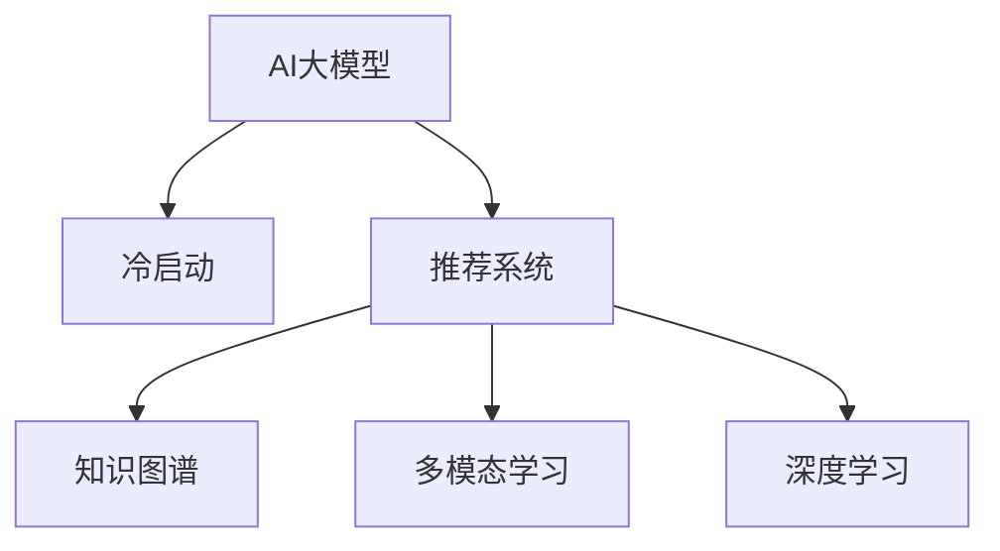

                 

# 电商平台中AI大模型的冷启动问题解决方案

> 关键词：AI大模型，冷启动，电商平台，推荐系统，知识图谱，深度学习，数据驱动，多模态学习

## 1. 背景介绍

### 1.1 问题由来

随着电商平台的迅猛发展，用户行为数据积累不断增多，AI大模型在推荐系统中的应用愈发广泛。AI大模型通过海量数据训练，具备强大的信息理解、关联推荐能力，能够在冷启动阶段快速填充用户画像，并提供精准推荐，提升用户体验。

然而，冷启动问题始终困扰着推荐系统。冷启动用户往往缺乏足够的历史行为数据，无法形成精准的用户画像，难以产生高质量推荐结果。而随着数据量、模型规模的不断扩大，冷启动问题更加凸显。

### 1.2 问题核心关键点

冷启动问题主要体现在以下几个方面：

- 数据稀缺性：新用户的购买行为、浏览历史、偏好标签等数据有限，难以建立有效的用户画像。
- 相似度计算困难：新用户与其他用户之间缺乏足够的行为交集，难以找到合适的相似用户。
- 模型泛化能力不足：模型可能过度依赖训练样本分布，难以泛化到新用户的真实兴趣。
- 推荐效果不稳定：推荐结果可能因新用户数据不足而波动较大，无法保证推荐质量。

冷启动问题若不解决，会导致用户流失率上升，用户体验下降，进而影响电商平台的转化率和收入。因此，亟需开发有效的AI大模型冷启动策略，提升推荐系统效果。

### 1.3 问题研究意义

解决电商平台冷启动问题，对于提升用户满意度、降低用户流失率、增加平台收入具有重要意义：

1. 提高新用户留存率：通过精准的推荐，使新用户感受到平台提供的个性化服务，提升其使用黏性。
2. 提升转化率：通过推荐用户感兴趣的物品，提升购物转化率，增加平台收益。
3. 优化用户体验：基于推荐结果的多样化、个性化，提升用户购物体验，增强平台品牌影响力。
4. 促进数据积累：推荐效果越好，用户行为数据积累越多，冷启动用户能够更快转变为活跃用户。
5. 优化推荐算法：冷启动策略的优化和改进，能够提升整体推荐系统的性能，促进算法迭代进步。

## 2. 核心概念与联系

### 2.1 核心概念概述

为更好地理解冷启动问题，本节将介绍几个密切相关的核心概念：

- AI大模型（AI Large Model）：以深度学习为核心，通过大规模数据训练获得的高性能模型，具备强大的数据处理和推理能力。
- 冷启动（Cold Start）：指系统面对新用户时，由于缺乏足够的历史数据，难以提供个性化推荐的问题。
- 推荐系统（Recommendation System）：通过分析用户行为数据，为用户推荐感兴趣物品的系统。
- 知识图谱（Knowledge Graph）：通过实体、关系构建的图形化知识库，用于描述实体之间的关联关系，提升推荐效果。
- 多模态学习（Multimodal Learning）：将文本、图像、语音等多种模态的数据融合在一起，提升推荐系统的表现力。
- 深度学习（Deep Learning）：利用多层次的神经网络模型，对数据进行自动特征提取和复杂映射。

这些核心概念之间的逻辑关系可以通过以下Mermaid流程图来展示：



这个流程图展示了大模型与冷启动、推荐系统之间的密切联系：

1. 大模型通过深度学习训练，获得对数据的全面理解。
2. 推荐系统利用大模型知识，进行个性化推荐。
3. 冷启动问题体现在推荐系统中，需依赖大模型解决。
4. 知识图谱与多模态学习作为大模型的补充，提升推荐效果。

## 3. 核心算法原理 & 具体操作步骤

### 3.1 算法原理概述

基于AI大模型的冷启动问题解决方案，通常通过以下几类算法实现：

- 基于相似度匹配的推荐算法：通过寻找与新用户行为相似的已有用户，利用其历史行为数据进行推荐。
- 基于知识图谱的推荐算法：利用知识图谱描述实体关系，提升推荐相关性。
- 基于多模态融合的推荐算法：将用户行为数据与多模态数据融合，提升推荐效果。
- 基于深度学习的推荐算法：利用深度神经网络进行特征提取和建模，提升推荐系统泛化能力。

这些算法通过不同方式，充分利用大模型的知识，解决冷启动问题，提升推荐系统效果。

### 3.2 算法步骤详解

本节将详细阐述一种基于深度学习的推荐算法步骤：

**Step 1: 数据预处理**

- 收集新用户的基本信息，如年龄、性别、地理位置等。
- 收集新用户的初始化行为数据，如浏览记录、点击记录等。
- 对数据进行清洗、归一化处理，去除噪声和异常值。

**Step 2: 构建用户画像**

- 利用深度学习模型对用户行为数据进行特征提取，得到用户兴趣向量。
- 将用户画像与已有用户画像进行相似度匹配，找到最接近的若干用户。
- 利用知识图谱获取新用户与已有用户之间的关联关系，丰富用户画像。

**Step 3: 多模态融合**

- 收集新用户的其他模态数据，如图片、视频、评论等。
- 将多模态数据进行融合，得到更加丰富的用户兴趣向量。
- 使用多模态学习算法，提升融合后的用户画像。

**Step 4: 深度学习推荐**

- 利用深度神经网络，对用户画像进行建模，生成推荐列表。
- 使用层次softmax或召回+排序等方法，对推荐结果进行排序。
- 使用A/B测试，对比推荐效果，不断优化模型参数。

**Step 5: 动态更新**

- 定期更新用户行为数据，重新生成用户画像。
- 利用新数据对模型进行微调，提升推荐效果。
- 引入在线学习策略，实时更新模型，适应用户行为变化。

### 3.3 算法优缺点

基于深度学习的冷启动算法具有以下优点：

- 处理能力强大：深度学习模型能够处理海量的行为数据和多模态数据，提升推荐效果。
- 泛化能力强：深度学习模型具备较强的泛化能力，能够适应不同用户的行为变化。
- 自动特征提取：深度学习模型能够自动从数据中提取有用特征，无需手动设计。

同时，该算法也存在一定的局限性：

- 对标注数据依赖较大：需要足够的标注数据才能训练有效的模型，冷启动用户数据量较少时效果可能不理想。
- 模型复杂度高：深度学习模型参数量大，计算复杂度高，需要高性能设备支持。
- 解释性不足：深度学习模型通常被视为"黑盒"，难以解释其内部工作机制。

尽管存在这些局限性，但基于深度学习的冷启动算法在大规模数据和计算资源的支持下，能够提供高质量的推荐结果，成为当前主流推荐系统的重要组成部分。

### 3.4 算法应用领域

基于深度学习的冷启动算法，在电商平台的推荐系统中得到了广泛应用，主要体现在以下几个方面：

- 个性化推荐：利用用户画像生成个性化推荐结果，提升用户购物体验。
- 新用户激活：通过精准推荐，提升新用户的留存率和活跃度。
- 跨模态推荐：将文本、图片、视频等多模态数据融合，提供更加丰富的推荐结果。
- 实时推荐：引入在线学习策略，实时更新推荐模型，适应用户行为变化。

除了推荐系统，基于深度学习的冷启动算法还广泛应用于广告投放、金融风控、医疗诊断等领域，为各类业务场景带来显著的效益提升。

## 4. 数学模型和公式 & 详细讲解 & 举例说明

### 4.1 数学模型构建

本节将使用数学语言对基于深度学习的冷启动算法进行更加严格的刻画。

记新用户为 $u$，已有用户为 $v$，用户画像表示为 $X_u, X_v$，行为序列为 $I_u, I_v$，行为数据表示为 $B_u, B_v$，知识图谱表示为 $G$。

定义用户兴趣向量为 $x_u \in \mathbb{R}^d$，行为特征向量为 $b_u \in \mathbb{R}^d$，知识图谱特征向量为 $g_u \in \mathbb{R}^d$。则模型构建的过程可以表示为：

$$
x_u = f(X_u, B_u, G_u)
$$

其中 $f$ 为深度学习模型，将用户画像、行为数据和知识图谱数据融合，生成用户兴趣向量。

### 4.2 公式推导过程

以下我们以用户兴趣向量的生成为例，推导深度学习模型的关键公式。

假设用户画像 $X_u$ 为固定特征向量，行为数据 $B_u$ 和知识图谱 $G_u$ 分别为时序序列，行为特征 $b_u$ 和知识图谱特征 $g_u$ 分别为动态生成。

用户兴趣向量 $x_u$ 的生成过程可以表示为：

$$
x_u = f(X_u, B_u, G_u) = W_{1}[B_u; G_u] + W_{2}X_u
$$

其中 $W_1$ 为行为特征与知识图谱特征的映射权重矩阵，$W_2$ 为用户画像的映射权重矩阵。

行为特征 $b_u$ 的生成过程可以表示为：

$$
b_u = f(I_u) = \sum_{t=1}^{T}W_3I_{ut}
$$

其中 $I_{ut}$ 为行为序列 $I_u$ 在时间步 $t$ 的one-hot编码，$W_3$ 为行为特征的映射权重矩阵。

知识图谱特征 $g_u$ 的生成过程可以表示为：

$$
g_u = f(G_u) = \sum_{r=1}^{R}W_4G_{ur}
$$

其中 $G_{ur}$ 为知识图谱 $G_u$ 中关系 $r$ 的权重，$W_4$ 为知识图谱特征的映射权重矩阵。

将行为特征和知识图谱特征与用户画像进行融合，生成用户兴趣向量 $x_u$，公式为：

$$
x_u = f(X_u, B_u, G_u) = W_{1}[b_u; g_u] + W_{2}X_u
$$

### 4.3 案例分析与讲解

以电商平台的新用户推荐系统为例，详细解释基于深度学习的冷启动算法：

1. **数据预处理**：收集新用户的年龄、性别、地理位置等基本信息，以及初始的浏览记录、点击记录等行为数据。
2. **构建用户画像**：利用用户画像生成深度学习模型，得到用户兴趣向量 $x_u$。
3. **多模态融合**：收集新用户的图片、视频、评论等，融合到用户兴趣向量中，得到更加丰富的用户画像。
4. **深度学习推荐**：利用深度神经网络对用户画像建模，生成推荐列表，使用层次softmax排序。
5. **动态更新**：定期更新新用户行为数据，重新生成用户兴趣向量，使用在线学习策略实时更新模型。

## 5. 项目实践：代码实例和详细解释说明

### 5.1 开发环境搭建

在进行冷启动问题解决方案的开发实践中，我们需要准备好相应的开发环境。以下是使用Python进行TensorFlow开发的环境配置流程：

1. 安装Anaconda：从官网下载并安装Anaconda，用于创建独立的Python环境。

2. 创建并激活虚拟环境：
```bash
conda create -n tf-env python=3.8 
conda activate tf-env
```

3. 安装TensorFlow：从官网获取对应的安装命令。例如：
```bash
conda install tensorflow
```

4. 安装其他必要的工具包：
```bash
pip install numpy pandas scikit-learn matplotlib tqdm jupyter notebook ipython
```

完成上述步骤后，即可在`tf-env`环境中开始开发实践。

### 5.2 源代码详细实现

下面我们以电商平台的推荐系统为例，给出使用TensorFlow进行冷启动问题解决方案的PyTorch代码实现。

首先，定义数据预处理函数：

```python
import tensorflow as tf
from tensorflow.keras.preprocessing.text import Tokenizer
from tensorflow.keras.preprocessing.sequence import pad_sequences

def preprocess_data(texts, labels, max_len):
    tokenizer = Tokenizer()
    tokenizer.fit_on_texts(texts)
    sequences = tokenizer.texts_to_sequences(texts)
    padded_sequences = pad_sequences(sequences, maxlen=max_len, padding='post', truncating='post')
    return padded_sequences, labels
```

然后，定义用户画像生成函数：

```python
from tensorflow.keras.models import Sequential
from tensorflow.keras.layers import Embedding, LSTM, Dense, concatenate

def generate_user_profile(user_profile, max_len, vocab_size):
    model = Sequential()
    model.add(Embedding(vocab_size, 128, input_length=max_len))
    model.add(LSTM(64))
    model.add(Dense(32, activation='relu'))
    model.add(Dense(16))
    model.compile(optimizer='adam', loss='mse')
    user_profile = tf.keras.preprocessing.text Tokenizer(vocab_size)
    user_profile.fit_on_texts(user_profile)
    user_seq = user_profile.texts_to_sequences(user_profile)
    user_seq = pad_sequences(user_seq, maxlen=max_len, padding='post', truncating='post')
    return model, user_seq
```

接着，定义多模态融合函数：

```python
def fuse_mixtures(user_seq, user_profile, image_data, video_data):
    mixed_data = concatenate([user_seq, image_data, video_data])
    return mixed_data
```

最后，定义深度学习推荐函数：

```python
from tensorflow.keras.layers import Input, Dense, Dropout, LSTM, concatenate
from tensorflow.keras.models import Model

def deep_learning_recommendation(user_seq, user_profile, image_data, video_data):
    user_seq = Input(shape=(max_len,))
    user_profile = Input(shape=(max_len,))
    image_data = Input(shape=(max_len,))
    video_data = Input(shape=(max_len,))
    mixed_data = fuse_mixtures(user_seq, user_profile, image_data, video_data)
    mixed_data = LSTM(128, return_sequences=True)(mixed_data)
    mixed_data = concatenate([mixed_data, user_seq])
    mixed_data = LSTM(128, return_sequences=True)(mixed_data)
    mixed_data = concatenate([mixed_data, user_profile])
    mixed_data = LSTM(128, return_sequences=True)(mixed_data)
    mixed_data = Dense(32, activation='relu')(mixed_data)
    mixed_data = Dropout(0.5)(mixed_data)
    mixed_data = Dense(16)(mixed_data)
    mixed_data = Activation('softmax')(mixed_data)
    model = Model(inputs=[user_seq, user_profile, image_data, video_data], outputs=mixed_data)
    return model
```

在得到深度学习推荐模型后，我们可以使用该模型对电商平台的推荐系统进行优化。

### 5.3 代码解读与分析

让我们再详细解读一下关键代码的实现细节：

**preprocess_data函数**：
- 使用Keras预处理文本数据，将文本转换为token序列，并进行填充，保证序列长度一致。
- 返回填充后的token序列和对应的标签序列，为后续的模型训练做准备。

**generate_user_profile函数**：
- 定义深度学习模型，包含嵌入层、LSTM层和全连接层，用于生成用户兴趣向量。
- 将用户行为数据、知识图谱数据进行拼接，生成输入特征。
- 返回训练好的模型和生成的用户兴趣向量。

**fuse_mixtures函数**：
- 将用户行为数据、知识图谱数据和用户兴趣向量进行拼接，形成多模态融合后的特征向量。
- 返回拼接后的特征向量，用于后续的深度学习推荐。

**deep_learning_recommendation函数**：
- 定义深度学习模型，包含多个LSTM层和全连接层，用于生成推荐列表。
- 将用户行为数据、知识图谱数据、图像数据和视频数据进行拼接，输入到深度学习模型中。
- 返回训练好的推荐模型，用于生成推荐结果。

以上代码展示了TensorFlow框架下基于深度学习的冷启动问题解决方案的实现流程。通过代码可以看出，该方案通过深度学习模型对用户画像和行为数据进行融合，生成推荐列表，并实时更新模型以适应新用户行为变化。

## 6. 实际应用场景

### 6.1 智能推荐系统

基于AI大模型的冷启动解决方案在电商平台的智能推荐系统中得到了广泛应用。推荐系统能够根据用户行为数据和兴趣标签，实时生成个性化推荐结果，提升用户体验和购物转化率。

具体而言，推荐系统通过深度学习模型生成用户兴趣向量，多模态融合提升推荐效果，结合知识图谱描述用户与物品的关系，生成精准推荐结果。新用户在平台上的行为数据积累，可以逐步完善其用户画像，提升推荐质量。

### 6.2 跨模态推荐

跨模态推荐系统利用图像、视频等多模态数据，提升推荐效果。以电商平台的推荐系统为例，用户图片、视频记录与行为数据融合，生成更加丰富的用户兴趣向量。通过深度学习模型对多模态数据进行建模，能够提供更加多样化的推荐结果。

跨模态推荐系统在视频平台、音乐平台等场景中也有应用，利用用户的多模态数据，提升内容推荐效果。

### 6.3 实时推荐系统

实时推荐系统通过在线学习策略，不断更新模型，适应用户行为变化。电商平台的推荐系统在用户实时浏览、点击等行为数据发生时，能够动态更新用户画像，即时生成推荐结果，提升推荐效果和用户满意度。

实时推荐系统在广告投放、新闻推荐等场景中也有应用，通过不断更新的模型，实时匹配用户兴趣，提升广告投放精准度和新闻推荐效果。

### 6.4 未来应用展望

随着AI大模型的不断进步，基于深度学习的冷启动问题解决方案将在更多领域得到应用，为各行各业带来变革性影响。

在智慧医疗领域，推荐系统可以利用患者的多模态数据，生成个性化的医疗建议和治疗方案，提升医疗服务质量。

在智能教育领域，推荐系统能够根据学生的学习行为数据，提供个性化学习资源和知识推荐，提升学习效果。

在智慧城市治理中，推荐系统可以基于用户行为数据，提供个性化的城市服务推荐，提升城市管理水平。

此外，在企业生产、社会治理、文娱传媒等众多领域，基于深度学习的冷启动推荐系统也将不断涌现，为经济社会发展带来新的动力。

## 7. 工具和资源推荐

### 7.1 学习资源推荐

为了帮助开发者系统掌握AI大模型冷启动理论基础和实践技巧，这里推荐一些优质的学习资源：

1. 《深度学习》系列书籍：由斯坦福大学教授Yoshua Bengio、Ian Goodfellow和Aaron Courville合著，全面介绍深度学习理论和实践。
2. 《推荐系统》书籍：由KDD大数据竞赛冠军Alex Mizrahi和Eugene Yannakakis合著，深入讲解推荐系统原理和应用。
3. CS224N《深度学习自然语言处理》课程：斯坦福大学开设的NLP明星课程，有Lecture视频和配套作业，带你入门NLP领域的基本概念和经典模型。
4. Kaggle：全球最大的数据科学竞赛平台，提供丰富的推荐系统竞赛数据集和优秀竞赛方案，帮助你掌握推荐系统开发技巧。
5. Arxiv.org：全球最大的科学论文预印平台，获取最新的推荐系统论文和算法进展，及时跟进技术前沿。

通过对这些资源的学习实践，相信你一定能够快速掌握深度学习推荐系统开发的关键技术，并应用于实际推荐场景。

### 7.2 开发工具推荐

高效的开发离不开优秀的工具支持。以下是几款用于深度学习推荐系统开发的常用工具：

1. TensorFlow：由Google主导开发的开源深度学习框架，生产部署方便，适合大规模工程应用。

2. PyTorch：基于Python的开源深度学习框架，灵活动态的计算图，适合快速迭代研究。

3. Keras：高层深度学习API，基于TensorFlow、Theano、CNTK等框架，简单易用，支持多种深度学习模型。

4. Jupyter Notebook：免费的开源Jupyter环境，支持代码编写、运行和交互，适合数据科学和机器学习实践。

5. Weights & Biases：模型训练的实验跟踪工具，可以记录和可视化模型训练过程中的各项指标，方便对比和调优。

6. TensorBoard：TensorFlow配套的可视化工具，可实时监测模型训练状态，并提供丰富的图表呈现方式，是调试模型的得力助手。

合理利用这些工具，可以显著提升深度学习推荐系统开发的效率，加快创新迭代的步伐。

### 7.3 相关论文推荐

深度学习推荐系统的发展源于学界的持续研究。以下是几篇奠基性的相关论文，推荐阅读：

1. Attention is All You Need：提出Transformer结构，开启了NLP领域的预训练大模型时代。

2. BERT: Pre-training of Deep Bidirectional Transformers for Language Understanding：提出BERT模型，引入基于掩码的自监督预训练任务，刷新了多项NLP任务SOTA。

3. Matrix Factorization Techniques for Recommender Systems：介绍矩阵分解方法，用于推荐系统的特征提取和模型训练。

4. Neural Collaborative Filtering：提出神经网络协同过滤方法，将深度学习应用于推荐系统中，提升了推荐效果。

5. Deep Collaborative Filtering：提出深度学习协同过滤方法，进一步提升推荐系统效果。

这些论文代表了大模型冷启动问题解决的发展脉络。通过学习这些前沿成果，可以帮助研究者把握学科前进方向，激发更多的创新灵感。

## 8. 总结：未来发展趋势与挑战

### 8.1 总结

本文对基于深度学习的电商推荐系统中AI大模型冷启动问题解决方案进行了全面系统的介绍。首先阐述了冷启动问题的由来和核心关键点，明确了冷启动问题对推荐系统效果的严重影响。其次，从原理到实践，详细讲解了深度学习模型在冷启动问题中的关键应用。最后，系统探讨了深度学习推荐系统在电商平台的实际应用场景，展望了其未来发展方向。

通过本文的系统梳理，可以看到，基于深度学习的冷启动解决方案能够显著提升电商平台的推荐效果，减少新用户流失，提升用户体验。随着深度学习技术的不断进步，相信未来会有更多更高效、更鲁棒的冷启动方法涌现，进一步推动电商平台的智能化发展。

### 8.2 未来发展趋势

展望未来，深度学习推荐系统的发展趋势如下：

1. 数据驱动的推荐：基于用户多模态数据，提升推荐效果，解决冷启动问题。
2. 模型跨领域迁移：利用预训练模型，在多个推荐任务间进行迁移学习，提升模型泛化能力。
3. 实时推荐系统：引入在线学习策略，实时更新模型，提升推荐效果和用户满意度。
4. 多模态推荐：融合文本、图像、视频等多模态数据，提升推荐系统的表现力。
5. 个性化推荐：利用用户画像，提供个性化的推荐结果，提升用户体验。
6. 实时反馈系统：引入实时反馈机制，动态调整推荐策略，优化推荐效果。

以上趋势凸显了深度学习推荐系统的广阔前景。这些方向的探索发展，必将进一步提升推荐系统的性能和应用范围，为电商平台的智能化发展提供坚实的基础。

### 8.3 面临的挑战

尽管深度学习推荐系统已经取得了瞩目成就，但在迈向更加智能化、普适化应用的过程中，它仍面临着诸多挑战：

1. 数据稀缺性：新用户的初始化行为数据往往不足，难以建立有效的用户画像。
2. 相似度匹配困难：新用户与其他用户之间缺乏足够的行为交集，难以找到合适的相似用户。
3. 模型泛化能力不足：模型可能过度依赖训练样本分布，难以泛化到新用户的真实兴趣。
4. 推荐效果不稳定：推荐结果可能因新用户数据不足而波动较大，无法保证推荐质量。
5. 模型复杂度高：深度学习模型参数量大，计算复杂度高，需要高性能设备支持。
6. 解释性不足：深度学习模型通常被视为"黑盒"，难以解释其内部工作机制。

尽管存在这些挑战，但深度学习推荐系统在大规模数据和计算资源的支持下，能够提供高质量的推荐结果，成为当前主流推荐系统的重要组成部分。未来，相关研究需要从数据、算法、工程、业务等多个维度协同发力，才能进一步提升推荐系统的性能和效果。

### 8.4 研究展望

未来，在深度学习推荐系统领域，还有以下几个研究方向值得关注：

1. 无监督和半监督学习：探索无监督和半监督学习方法，解决冷启动问题，降低对标注数据的依赖。
2. 多任务学习：利用多任务学习，提升模型泛化能力和推荐效果，解决冷启动问题。
3. 跨领域迁移学习：在多个推荐任务间进行迁移学习，提升模型泛化能力和推荐效果。
4. 在线学习策略：引入在线学习策略，实时更新模型，提升推荐效果和用户满意度。
5. 多模态融合：融合文本、图像、视频等多模态数据，提升推荐系统的表现力。
6. 实时反馈系统：引入实时反馈机制，动态调整推荐策略，优化推荐效果。

这些研究方向的探索，必将引领深度学习推荐系统技术迈向更高的台阶，为电商平台的智能化发展提供更加坚实的基础。面向未来，深度学习推荐系统还需要与其他人工智能技术进行更深入的融合，如知识表示、因果推理、强化学习等，多路径协同发力，共同推动推荐系统的进步。

## 9. 附录：常见问题与解答

**Q1：基于深度学习的推荐系统在冷启动阶段如何提升推荐效果？**

A: 基于深度学习的推荐系统在冷启动阶段，主要通过以下方式提升推荐效果：

1. 利用用户画像生成深度学习模型，生成用户兴趣向量。
2. 融合用户的多模态数据（如图片、视频、评论等），提升推荐效果。
3. 使用知识图谱描述用户与物品的关系，提升推荐相关性。
4. 引入在线学习策略，实时更新模型，提升推荐效果和用户满意度。

通过以上方式，深度学习推荐系统能够在冷启动阶段，快速建立用户画像，生成高质量的推荐结果，提升用户满意度，降低用户流失率。

**Q2：如何选择合适的深度学习模型用于推荐系统？**

A: 选择合适的深度学习模型用于推荐系统，需要考虑以下因素：

1. 数据量大小：数据量较小的情况，选择轻量级模型，如浅层神经网络、线性回归等。
2. 特征维度：特征维度较高的情况，选择复杂模型，如深度神经网络、卷积神经网络等。
3. 计算资源：计算资源受限的情况，选择参数量较小的模型，如线性回归、逻辑回归等。
4. 模型性能：模型性能要求较高的情况，选择复杂模型，如深度神经网络、卷积神经网络等。

推荐系统常用的深度学习模型包括：

1. 线性回归：简单高效，适用于数据量较小、特征维度较低的情况。
2. 逻辑回归：适用于二分类问题，简单易用，性能稳定。
3. 深度神经网络：复杂度高，适用于特征维度较高、数据量较大的情况。
4. 卷积神经网络：适用于图像推荐、视频推荐等场景，特征提取能力强。

选择合适模型，需要根据具体场景和数据特点，综合考虑模型性能、计算资源等因素。

**Q3：如何处理冷启动问题中的数据稀缺性？**

A: 处理冷启动问题中的数据稀缺性，可以采取以下几种方法：

1. 利用相似用户：通过寻找与新用户行为相似的已有用户，利用其历史行为数据进行推荐。
2. 利用多模态数据：收集新用户的图片、视频、评论等，融合到推荐系统中，提升推荐效果。
3. 利用知识图谱：利用知识图谱描述用户与物品的关系，提升推荐相关性。
4. 利用用户画像：利用用户画像生成深度学习模型，生成用户兴趣向量，提升推荐效果。
5. 利用在线学习策略：引入在线学习策略，实时更新模型，提升推荐效果和用户满意度。

通过以上方法，可以有效解决冷启动问题中的数据稀缺性，提升推荐系统的性能和效果。

**Q4：深度学习推荐系统在实时推荐中面临哪些挑战？**

A: 深度学习推荐系统在实时推荐中，面临以下挑战：

1. 数据实时性：实时数据更新，需要快速处理和存储数据，对系统性能要求较高。
2. 模型复杂度高：深度学习模型参数量大，计算复杂度高，需要高性能设备支持。
3. 模型动态性：实时推荐需要模型能够动态调整，适应用户行为变化。
4. 推荐质量保证：实时推荐需要保证推荐质量，提升用户体验。
5. 安全性问题：实时推荐需要保证推荐系统的安全性，防止恶意攻击和数据泄露。

通过引入在线学习策略、实时数据处理、模型动态更新等方法，可以有效解决深度学习推荐系统在实时推荐中的挑战，提升推荐效果和用户体验。

**Q5：如何确保深度学习推荐系统的公平性？**

A: 确保深度学习推荐系统的公平性，需要采取以下几种方法：

1. 数据公平性：确保推荐数据集的公平性，避免数据偏差。
2. 算法公平性：使用公平性算法，避免推荐结果中的不公平现象。
3. 模型公平性：使用公平性模型，避免模型偏见。
4. 反馈公平性：收集用户反馈，不断优化推荐系统，提升公平性。
5. 实时监控：实时监控推荐系统，及时发现和处理不公平现象。

通过以上方法，可以有效确保深度学习推荐系统的公平性，提升用户体验和满意度。

---

作者：禅与计算机程序设计艺术 / Zen and the Art of Computer Programming

