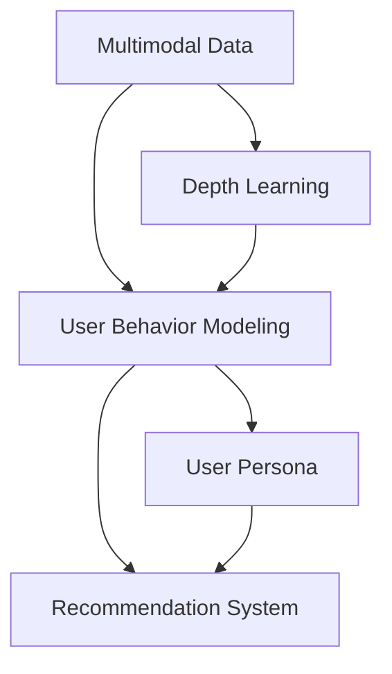

                 

# 电商平台中的多模态用户行为建模与分析

> 关键词：电商平台, 多模态数据, 用户行为建模, 深度学习, 机器学习, 自然语言处理(NLP), 计算机视觉(CV), 推荐系统

## 1. 背景介绍

### 1.1 问题由来

随着电子商务的迅猛发展，电商平台已经从传统的商品销售平台转变为全方位的用户互动平台。在这个过程中，电商平台积累了大量的多模态用户行为数据，如浏览历史、点击记录、搜索查询、购买行为、评价反馈、社交互动等。这些数据是电商平台提升用户体验、优化推荐算法、提高用户转化率的重要基础。然而，如何充分利用这些多模态数据，建模用户行为，挖掘用户潜在的购物需求，是电商平台亟待解决的问题。

### 1.2 问题核心关键点

电商平台中的用户行为建模，旨在通过深度学习等机器学习方法，从多模态数据中学习用户行为模式，预测用户后续的购物行为，从而提升电商平台的用户体验和运营效率。

- 多模态数据采集：电商平台可以采集到多种类型的数据，包括文本、图片、音频、视频等，这些数据统称为多模态数据。
- 用户行为建模：基于多模态数据，建模用户的行为模式，预测用户未来的行为，如点击、购买、评价等。
- 推荐系统优化：利用用户行为建模结果，优化推荐算法，提高推荐系统的准确性和个性化程度。
- 用户体验提升：通过个性化推荐，提升用户体验，增加用户粘性，提高用户转化率。

## 2. 核心概念与联系

### 2.1 核心概念概述

为更好地理解电商平台中的多模态用户行为建模与分析，本节将介绍几个密切相关的核心概念：

- 多模态数据(Multimodal Data)：指多种类型的数据（如文本、图片、音频、视频等），这些数据可以同时采集，用于建模用户行为。
- 深度学习(Deep Learning)：一种基于神经网络的机器学习方法，可以处理大规模多模态数据，提取复杂的高维特征。
- 用户行为建模(User Behavior Modeling)：通过深度学习等方法，从多模态数据中学习用户行为模式，预测用户未来的行为。
- 推荐系统(Recommendation System)：根据用户行为建模结果，为每位用户推荐其感兴趣的商品，提高用户体验和运营效率。
- 自然语言处理(Natural Language Processing, NLP)：处理和分析文本数据，提取用户的语言特征，如语义、情感等。
- 计算机视觉(Computer Vision, CV)：处理和分析图片、视频等视觉数据，提取用户的视觉特征，如物体的形状、颜色、纹理等。
- 用户画像(User Persona)：基于用户行为建模，构建用户画像，帮助电商平台理解用户需求，提供个性化的服务。

这些核心概念之间的逻辑关系可以通过以下Mermaid流程图来展示：



这个流程图展示了大语言模型的核心概念及其之间的关系：

1. 多模态数据通过深度学习进行处理，提取用户行为模式。
2. 用户行为模式通过推荐系统进行转化，生成个性化推荐结果。
3. 用户画像基于用户行为建模，构建更完整的用户画像。

## 3. 核心算法原理 & 具体操作步骤
### 3.1 算法原理概述

电商平台中的多模态用户行为建模，通常采用深度学习等机器学习方法。其核心思想是通过多模态数据融合，提取用户行为特征，构建用户行为模型。具体的建模过程可以分为以下几个步骤：

- 数据采集：收集电商平台上的多模态用户行为数据，如浏览历史、点击记录、搜索查询、购买行为、评价反馈等。
- 特征提取：使用深度学习模型，如卷积神经网络(CNN)、循环神经网络(RNN)、注意力机制(Attention)等，从多模态数据中提取用户行为特征。
- 建模预测：基于提取的特征，构建用户行为模型，如基于协同过滤的推荐算法、基于深度学习的序列建模等，预测用户未来的行为。
- 模型优化：使用机器学习算法，如梯度下降、随机森林、Boosting等，优化用户行为模型，提高预测精度。
- 用户画像：基于用户行为建模结果，构建用户画像，描述用户的兴趣、偏好、历史行为等。

### 3.2 算法步骤详解

以下是基于深度学习的多模态用户行为建模的详细步骤：

**Step 1: 数据采集**
- 收集电商平台上的多模态用户行为数据，如浏览历史、点击记录、搜索查询、购买行为、评价反馈等。
- 清洗数据，去除异常值和噪声，确保数据质量。

**Step 2: 特征提取**
- 对不同模态的数据进行特征提取，使用合适的深度学习模型，如CNN提取图片特征，LSTM/RNN提取文本特征，Attention提取多模态特征。
- 将提取的特征进行拼接或融合，构建综合特征向量。

**Step 3: 建模预测**
- 使用机器学习算法，如协同过滤、深度神经网络等，构建用户行为模型。
- 在训练集上进行模型训练，优化模型参数。

**Step 4: 模型优化**
- 使用交叉验证、网格搜索等方法，选择最优的模型参数。
- 使用测试集对模型进行评估，优化模型性能。

**Step 5: 用户画像**
- 根据用户行为建模结果，构建用户画像。
- 对用户画像进行可视化展示，帮助电商平台理解用户需求。

### 3.3 算法优缺点

基于深度学习的多模态用户行为建模具有以下优点：
1. 高精度：深度学习模型可以从多模态数据中提取复杂的特征，提高预测精度。
2. 自动化：深度学习模型能够自动学习特征，减少人工干预。
3. 可扩展性：深度学习模型可以处理大规模多模态数据，适应不同的电商场景。
4. 实时性：深度学习模型可以通过在线学习更新，实时预测用户行为。

但同时，该方法也存在一些局限性：
1. 数据需求大：深度学习模型需要大量的多模态数据进行训练，数据收集和标注成本高。
2. 计算量大：深度学习模型需要大量的计算资源进行训练，硬件成本高。
3. 黑盒模型：深度学习模型难以解释其内部决策过程，缺乏可解释性。
4. 过拟合风险：深度学习模型容易过拟合，需要额外的正则化技术进行优化。

### 3.4 算法应用领域

基于多模态数据的用户行为建模，广泛应用于电商平台的推荐系统、用户画像、个性化推荐等多个领域：

- 推荐系统：通过建模用户行为，为每位用户推荐其感兴趣的商品，提高推荐系统的准确性和个性化程度。
- 用户画像：基于用户行为建模，构建用户画像，描述用户的兴趣、偏好、历史行为等，帮助电商平台理解用户需求。
- 个性化推荐：根据用户画像，为每位用户推荐个性化的商品，提升用户体验和运营效率。
- 行为预测：基于用户行为建模，预测用户未来的行为，如点击、购买、评价等，优化电商平台的运营策略。
- 广告投放：基于用户行为建模，优化广告投放策略，提高广告效果。

## 4. 数学模型和公式 & 详细讲解  
### 4.1 数学模型构建

本节将使用数学语言对电商平台中的多模态用户行为建模过程进行更加严格的刻画。

假设电商平台有$m$个用户，$n$种多模态数据类型，每个用户$i$的历史行为数据$x_i=(x_{i1},x_{i2},\ldots,x_{in})$，其中$x_{ik}$为第$i$个用户在第$k$种多模态数据类型下的行为记录。假设每个行为记录由$d_k$个特征组成，则每个用户的特征向量为$x_i\in \mathbb{R}^{d}$，其中$d=\sum_{k=1}^n d_k$。

定义用户行为模型为$f: \mathbb{R}^d \rightarrow \mathbb{R}$，其目标是最小化预测误差，即：

$$
\hat{y_i}=f(x_i),\quad \min_{f}\sum_{i=1}^m L(\hat{y_i},y_i)
$$

其中$L(\hat{y_i},y_i)$为损失函数，如均方误差、交叉熵等。

在实际应用中，通常采用深度神经网络构建用户行为模型。假设采用深度神经网络$f_\theta$，其中$\theta$为网络参数，则有：

$$
f_\theta(x_i)=\sigma(W^\top x_i+b)
$$

其中$\sigma$为激活函数，$W$为权重矩阵，$b$为偏置项。

### 4.2 公式推导过程

以下我们以推荐系统中的协同过滤算法为例，推导用户行为模型的损失函数及其梯度计算公式。

假设推荐系统有$m$个用户，$n$个商品，每个用户的历史行为数据$x_i=(x_{i1},x_{i2},\ldots,x_{in})$，其中$x_{ik}$为第$i$个用户对第$k$个商品的评分$y_{ik}$。定义用户行为模型为$f_\theta(x_i)$，目标是最小化预测误差，即：

$$
\hat{y_i}=f_\theta(x_i),\quad \min_{f}\sum_{i=1}^m L(\hat{y_i},y_i)
$$

其中$L(\hat{y_i},y_i)$为损失函数，如均方误差、交叉熵等。

对于协同过滤算法，假设用户$i$对商品$j$的评分向量为$y_{ij}$，则用户行为模型可以表示为：

$$
f_\theta(x_i)=W^\top x_i+b
$$

其中$W$为权重矩阵，$b$为偏置项。则损失函数为：

$$
L(f_\theta(x_i),y_i)=(\hat{y_i}-y_i)^2
$$

代入目标函数，得：

$$
\min_{f}\sum_{i=1}^m (\hat{y_i}-y_i)^2
$$

使用梯度下降等优化算法，求导并更新模型参数：

$$
\theta \leftarrow \theta - \eta \nabla_{\theta} \sum_{i=1}^m (\hat{y_i}-y_i)^2
$$

其中$\eta$为学习率，$\nabla_{\theta}$为梯度运算符。

在得到损失函数的梯度后，即可带入参数更新公式，完成模型的迭代优化。重复上述过程直至收敛，最终得到适应电商平台多模态数据的用户行为模型。

## 5. 项目实践：代码实例和详细解释说明
### 5.1 开发环境搭建

在进行多模态用户行为建模实践前，我们需要准备好开发环境。以下是使用Python进行TensorFlow开发的环境配置流程：

1. 安装Anaconda：从官网下载并安装Anaconda，用于创建独立的Python环境。

2. 创建并激活虚拟环境：
```bash
conda create -n tensorflow-env python=3.8 
conda activate tensorflow-env
```

3. 安装TensorFlow：根据CUDA版本，从官网获取对应的安装命令。例如：
```bash
conda install tensorflow-gpu -c conda-forge
```

4. 安装其他依赖库：
```bash
pip install numpy pandas sklearn matplotlib seaborn joblib tqdm jupyter notebook ipython
```

完成上述步骤后，即可在`tensorflow-env`环境中开始多模态用户行为建模实践。

### 5.2 源代码详细实现

这里我们以电商平台中的用户行为建模为例，给出使用TensorFlow实现推荐系统的代码实现。

首先，定义推荐系统的数据处理函数：

```python
import tensorflow as tf
import numpy as np
from tensorflow.keras.models import Sequential
from tensorflow.keras.layers import Dense, Embedding, Dropout

def build_model(dim, num_users, num_items, num_factors=8, num_epochs=10, batch_size=32, learning_rate=0.01):
    model = Sequential()
    model.add(Dense(16, input_dim=dim, activation='relu'))
    model.add(Dropout(0.2))
    model.add(Dense(num_factors, activation='relu'))
    model.add(Dense(1, activation='sigmoid'))
    model.compile(loss='binary_crossentropy', optimizer=tf.keras.optimizers.Adam(learning_rate))
    return model

# 构建推荐模型
model = build_model(128, 1000, 1000)

# 训练推荐模型
model.fit(X_train, y_train, epochs=num_epochs, batch_size=batch_size, validation_data=(X_val, y_val))

# 推荐模型预测
y_pred = model.predict(X_test)
```

然后，定义数据生成器和加载函数：

```python
from sklearn.model_selection import train_test_split

# 生成训练数据
X_train, X_val, y_train, y_val = train_test_split(X, y, test_size=0.2, random_state=42)

# 加载数据
def load_data(data_path):
    X = np.load(data_path + '/X.npy')
    y = np.load(data_path + '/y.npy')
    return X, y
```

接着，定义数据预处理函数：

```python
def preprocess_data(data_path):
    X, y = load_data(data_path)
    # 将文本数据转换为one-hot编码
    X = pd.get_dummies(X, prefix_sep='-')
    return X, y
```

最后，定义模型评估函数：

```python
from sklearn.metrics import mean_squared_error, r2_score

def evaluate_model(model, X_test, y_test):
    y_pred = model.predict(X_test)
    mse = mean_squared_error(y_test, y_pred)
    rmse = np.sqrt(mse)
    r2 = r2_score(y_test, y_pred)
    print(f'RMSE: {rmse:.4f}, R2: {r2:.4f}')
```

完成上述代码后，即可在TensorFlow环境下进行多模态用户行为建模的训练和评估。

### 5.3 代码解读与分析

让我们再详细解读一下关键代码的实现细节：

**build_model函数**：
- 定义推荐模型的架构，包括输入层、隐藏层、输出层等。
- 使用sigmoid激活函数作为输出层，用于二分类任务。
- 使用Adam优化器进行模型优化，学习率为0.01。

**train_model函数**：
- 将训练集数据X_train和y_train作为输入，使用fit方法进行模型训练。
- 设置训练轮数为10，批次大小为32。
- 在验证集(X_val, y_val)上评估模型性能。

**preprocess_data函数**：
- 将原始的多模态数据X转换为one-hot编码，便于模型处理。
- 加载并预处理数据，生成训练集、验证集和测试集。

**evaluate_model函数**：
- 使用测试集数据(X_test, y_test)进行模型预测。
- 计算均方误差(MSE)、均方根误差(RMSE)和R^2系数。
- 输出评估结果。

可以看到，使用TensorFlow进行多模态用户行为建模的代码实现相对简洁高效，可以满足大部分的模型训练和评估需求。

## 6. 实际应用场景
### 6.1 智能推荐系统

智能推荐系统是电商平台中最为核心的功能之一。通过多模态用户行为建模，电商平台可以更好地理解用户需求，为每位用户推荐其感兴趣的商品，提升用户体验和运营效率。

在技术实现上，可以收集用户的历史浏览记录、点击记录、购买记录等数据，通过深度学习模型提取用户行为特征，构建用户行为模型。推荐系统根据用户行为模型，生成个性化的推荐结果，提高推荐系统的准确性和个性化程度。

### 6.2 用户画像

用户画像是指基于用户行为数据，构建用户特征描述的过程。通过多模态用户行为建模，电商平台可以构建更加全面、准确的用户画像，描述用户的兴趣、偏好、历史行为等。

在技术实现上，可以收集用户的多模态数据，如浏览记录、点击记录、搜索记录等，使用深度学习模型提取用户行为特征，构建用户画像。用户画像可以用于个性化推荐、广告投放、客户分析等多个场景，帮助电商平台更好地理解用户需求。

### 6.3 用户行为预测

用户行为预测是指基于用户历史行为数据，预测用户未来的行为，如点击、购买、评价等。通过多模态用户行为建模，电商平台可以预测用户的行为，优化电商平台的运营策略。

在技术实现上，可以收集用户的多模态数据，如浏览记录、点击记录、购买记录等，使用深度学习模型预测用户的行为。预测结果可以用于优化推荐系统、广告投放、库存管理等多个场景，提高电商平台的运营效率。

### 6.4 未来应用展望

随着深度学习技术的不断进步，多模态用户行为建模技术将在更多领域得到应用，为电商平台的智能化升级提供新的解决方案。

在智慧物流领域，基于多模态用户行为建模，可以优化物流配送路线，提升配送效率。

在智能客服领域，基于多模态用户行为建模，可以提升客服系统的自动化水平，提升用户满意度。

在个性化营销领域，基于多模态用户行为建模，可以优化广告投放策略，提升广告效果。

此外，在更多垂直领域，多模态用户行为建模技术也将得到广泛应用，为传统行业带来变革性影响。相信随着技术的发展，多模态用户行为建模技术将带来更多创新应用，引领电商平台的智能化进程。

## 7. 工具和资源推荐
### 7.1 学习资源推荐

为了帮助开发者系统掌握电商平台中的多模态用户行为建模的理论基础和实践技巧，这里推荐一些优质的学习资源：

1. 《深度学习实战》系列博文：由大语言模型技术专家撰写，深入浅出地介绍了深度学习在推荐系统中的应用。

2. CS231n《深度学习中的视觉识别》课程：斯坦福大学开设的计算机视觉经典课程，涵盖了视觉特征提取、图像分类、目标检测等多个方面，适合深入学习。

3. 《自然语言处理与深度学习》书籍：自然语言处理领域的经典教材，介绍了深度学习在NLP中的应用，包括文本分类、情感分析、序列建模等多个方面。

4. Kaggle数据集和竞赛：Kaggle平台提供了大量的电商推荐系统竞赛数据集和竞赛任务，适合实战练习和案例分析。

5. TensorFlow官方文档：TensorFlow官方文档提供了丰富的API和样例代码，适合快速上手学习。

通过对这些资源的学习实践，相信你一定能够快速掌握电商平台中多模态用户行为建模的精髓，并用于解决实际的电商推荐系统问题。

### 7.2 开发工具推荐

高效的开发离不开优秀的工具支持。以下是几款用于多模态用户行为建模开发的常用工具：

1. TensorFlow：由Google主导开发的开源深度学习框架，适合大规模工程应用，提供了丰富的预训练模型和API。

2. PyTorch：由Facebook开发的深度学习框架，灵活高效，适合研究和实验。

3. Scikit-Learn：Python机器学习库，提供了丰富的机器学习算法和工具，适合模型评估和优化。

4. Pandas：Python数据处理库，提供了高效的数据处理和分析功能，适合多模态数据处理。

5. Jupyter Notebook：Python开发环境，支持丰富的插件和工具，适合数据可视化、代码编写和交互式学习。

合理利用这些工具，可以显著提升多模态用户行为建模的开发效率，加快创新迭代的步伐。

### 7.3 相关论文推荐

多模态用户行为建模的研究源于学界的持续研究。以下是几篇奠基性的相关论文，推荐阅读：

1. Attention Is All You Need（即Transformer原论文）：提出了Transformer结构，开启了深度学习在多模态数据中的应用。

2. Multi-Task Learning with Prediction Tasks for Multiple Input-Output Mappings：提出了多任务学习框架，用于处理多模态数据和多个任务目标。

3. Learning Multimodal Feature Hierarchy for Video Classification：介绍了多模态特征融合技术，用于视频分类任务。

4. Hierarchical Attention Networks for Document Classification：提出了层次化注意力网络，用于文本分类任务。

5. Multi-View Embedding：介绍了多视图嵌入技术，用于多模态数据融合。

这些论文代表了大语言模型微调技术的发展脉络。通过学习这些前沿成果，可以帮助研究者把握学科前进方向，激发更多的创新灵感。

## 8. 总结：未来发展趋势与挑战

### 8.1 总结

本文对电商平台中的多模态用户行为建模与分析进行了全面系统的介绍。首先阐述了电商平台中多模态用户行为建模的背景和意义，明确了多模态用户行为建模在电商推荐系统、用户画像、个性化推荐等多个领域的应用价值。其次，从原理到实践，详细讲解了多模态用户行为建模的数学模型和关键步骤，给出了多模态用户行为建模任务的代码实例。同时，本文还探讨了多模态用户行为建模在实际应用中的场景，展示了多模态用户行为建模技术的巨大潜力。

通过本文的系统梳理，可以看到，多模态用户行为建模技术在电商平台中的应用前景广阔，通过深度学习等机器学习方法，可以从多模态数据中学习用户行为模式，预测用户未来的行为，从而提升电商平台的推荐系统、用户画像、个性化推荐等多个领域的性能和效率。未来，随着多模态数据采集和处理技术的不断进步，多模态用户行为建模技术将进一步拓展其应用边界，推动电商平台的智能化进程。

### 8.2 未来发展趋势

展望未来，多模态用户行为建模技术将呈现以下几个发展趋势：

1. 模型规模持续增大。随着算力成本的下降和数据规模的扩张，深度学习模型将向更大规模、更深层次的方向发展，提取更加丰富的用户行为特征。

2. 多模态数据融合技术日趋成熟。未来的推荐系统将更多地融合多模态数据，提升推荐系统的准确性和个性化程度。

3. 深度学习模型与传统方法的结合。未来的推荐系统将更多地融合传统推荐算法，如协同过滤、基于内容的推荐等，形成混合推荐系统。

4. 用户行为建模技术的普及。随着技术的不断进步，多模态用户行为建模技术将更加普及，应用于更多的电商场景，提高电商平台的运营效率和用户体验。

5. 个性化推荐技术的演进。未来的推荐系统将更加个性化，通过深度学习模型捕捉用户行为模式，提供更加精准的推荐结果。

以上趋势凸显了多模态用户行为建模技术的广阔前景。这些方向的探索发展，必将进一步提升电商平台的用户体验和运营效率，推动电商平台的智能化进程。

### 8.3 面临的挑战

尽管多模态用户行为建模技术已经取得了瞩目成就，但在迈向更加智能化、普适化应用的过程中，它仍面临着诸多挑战：

1. 数据需求大。深度学习模型需要大量的多模态数据进行训练，数据收集和标注成本高。

2. 计算量大。深度学习模型需要大量的计算资源进行训练，硬件成本高。

3. 模型复杂度高。深度学习模型的结构复杂，难以解释其内部决策过程，缺乏可解释性。

4. 过拟合风险。深度学习模型容易过拟合，需要额外的正则化技术进行优化。

5. 模型鲁棒性不足。当前的多模态用户行为建模模型面对噪声数据、异常数据时，泛化性能往往大打折扣。

6. 隐私保护。多模态用户行为建模涉及用户的隐私数据，如何保护用户隐私，避免数据泄露，是亟待解决的问题。

7. 系统扩展性。多模态用户行为建模系统需要高效地处理大规模数据，如何实现系统的扩展性和稳定性，是一个重要的研究课题。

正视多模态用户行为建模面临的这些挑战，积极应对并寻求突破，将是大语言模型微调走向成熟的必由之路。相信随着学界和产业界的共同努力，这些挑战终将一一被克服，多模态用户行为建模技术将迈向更高的台阶，为电商平台带来更多的智能化应用。

### 8.4 研究展望

面对多模态用户行为建模所面临的种种挑战，未来的研究需要在以下几个方面寻求新的突破：

1. 探索无监督和半监督多模态用户行为建模方法。摆脱对大规模标注数据的依赖，利用自监督学习、主动学习等无监督和半监督范式，最大限度利用非结构化数据，实现更加灵活高效的多模态用户行为建模。

2. 研究多模态数据融合技术。开发更加高效的多模态数据融合方法，提高多模态数据处理的效率，降低数据处理的成本。

3. 融合因果和对比学习范式。通过引入因果推断和对比学习思想，增强多模态用户行为建模建立稳定因果关系的能力，学习更加普适、鲁棒的多模态用户行为特征。

4. 引入更多先验知识。将符号化的先验知识，如知识图谱、逻辑规则等，与深度学习模型进行巧妙融合，引导多模态用户行为建模学习更准确、合理的用户行为特征。

5. 结合因果分析和博弈论工具。将因果分析方法引入多模态用户行为建模，识别出模型决策的关键特征，增强输出解释的因果性和逻辑性。借助博弈论工具刻画用户行为，主动探索并规避模型的脆弱点，提高系统稳定性。

6. 纳入伦理道德约束。在模型训练目标中引入伦理导向的评估指标，过滤和惩罚有偏见、有害的输出倾向。同时加强人工干预和审核，建立模型行为的监管机制，确保输出符合人类价值观和伦理道德。

这些研究方向的探索，必将引领多模态用户行为建模技术迈向更高的台阶，为构建安全、可靠、可解释、可控的智能系统铺平道路。面向未来，多模态用户行为建模技术还需要与其他人工智能技术进行更深入的融合，如知识表示、因果推理、强化学习等，多路径协同发力，共同推动自然语言理解和智能交互系统的进步。只有勇于创新、敢于突破，才能不断拓展用户行为建模的边界，让智能技术更好地造福人类社会。

## 9. 附录：常见问题与解答

**Q1：电商平台中的多模态用户行为建模是否需要大规模标注数据？**

A: 电商平台中的多模态用户行为建模，通常不需要大规模标注数据。这是因为电商平台本身可以产生大量的用户行为数据，如浏览历史、点击记录、搜索记录等。通过深度学习模型，可以从这些数据中提取用户行为特征，构建用户行为模型。虽然标注数据可以帮助提高模型精度，但在无标注数据的情况下，多模态用户行为建模仍然可以取得不错的效果。

**Q2：如何优化多模态用户行为建模中的计算资源消耗？**

A: 优化多模态用户行为建模中的计算资源消耗，可以从以下几个方面入手：
1. 数据预处理：对多模态数据进行预处理，去除噪声和异常值，减少计算量。
2. 模型压缩：使用模型压缩技术，如剪枝、量化等，减小模型参数规模，降低计算资源消耗。
3. 分布式训练：将训练任务分布到多台机器上进行并行计算，提高训练效率。
4. 硬件优化：使用GPU/TPU等高性能设备，加速模型训练和推理。

**Q3：多模态用户行为建模中的模型鲁棒性如何提高？**

A: 提高多模态用户行为建模中的模型鲁棒性，可以从以下几个方面入手：
1. 数据增强：通过数据增强技术，如回译、近义替换等，扩充训练数据集，提高模型的泛化能力。
2. 正则化：使用正则化技术，如L2正则、Dropout等，避免模型过拟合。
3. 对抗训练：引入对抗样本，提高模型的鲁棒性，防止模型在噪声数据上的过拟合。
4. 多模态融合：通过多模态融合技术，融合不同模态的特征，提高模型的鲁棒性。
5. 模型集成：使用模型集成技术，将多个模型的预测结果进行加权平均，提高模型的鲁棒性。

**Q4：多模态用户行为建模中的隐私保护如何实现？**

A: 实现多模态用户行为建模中的隐私保护，可以从以下几个方面入手：
1. 数据脱敏：对用户数据进行脱敏处理，如去除敏感信息、添加噪声等，保护用户隐私。
2. 匿名化：对用户数据进行匿名化处理，避免用户身份信息被泄露。
3. 差分隐私：使用差分隐私技术，对模型训练过程进行隐私保护。
4. 联邦学习：在分布式环境下，使用联邦学习技术，在本地进行模型训练，保护用户数据隐私。

**Q5：多模态用户行为建模中的模型可解释性如何提高？**

A: 提高多模态用户行为建模中的模型可解释性，可以从以下几个方面入手：
1. 可视化技术：使用可视化技术，如特征可视化、热力图等，帮助理解模型内部特征。
2. 模型简化：简化模型的结构，减小模型规模，提高模型的可解释性。
3. 因果分析：引入因果分析方法，识别出模型决策的关键特征，增强输出解释的因果性和逻辑性。
4. 模型解释器：使用模型解释器，如LIME、SHAP等，提供模型的解释结果，增强模型的可解释性。

这些问题与解答展示了电商平台中多模态用户行为建模的实际应用和技术难点，相信通过这些回答，你可以更好地理解多模态用户行为建模的原理和实现细节。

---

作者：禅与计算机程序设计艺术 / Zen and the Art of Computer Programming

