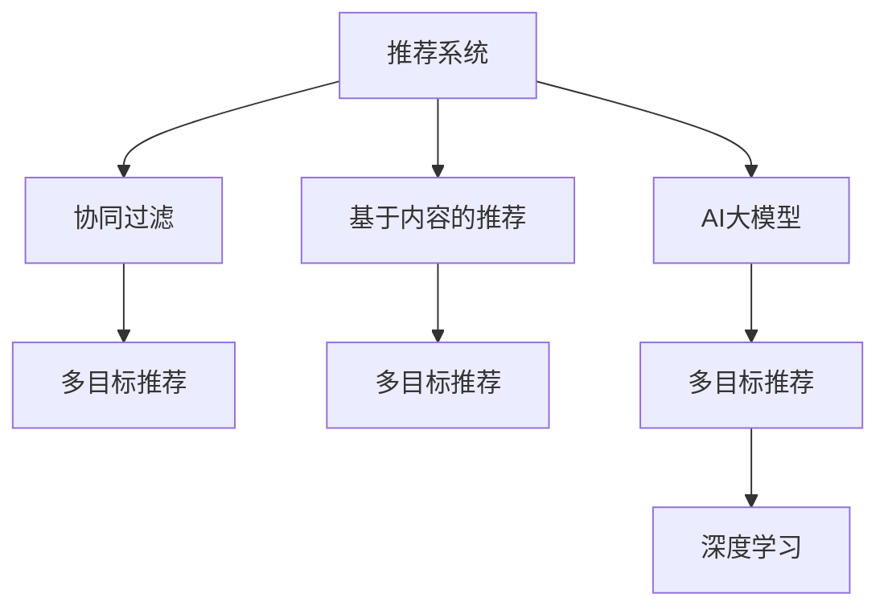

                 

# 电商平台中的多目标推荐：AI大模型的优势

> 关键词：电商平台,多目标推荐,推荐系统,用户行为,决策树,协同过滤,深度学习,大模型,精度,召回率

## 1. 背景介绍

### 1.1 问题由来
在电子商务领域，推荐系统（Recommender Systems）已经成为提升用户体验、促进销售增长的重要工具。传统的推荐算法主要包括基于协同过滤（Collaborative Filtering）和基于内容的推荐（Content-based Filtering），但这些方法往往难以捕捉用户复杂、动态的兴趣变化，导致推荐效果不够精准。为了突破这一瓶颈，AI大模型（Large AI Models）被引入到推荐系统中，以其强大的数据处理和泛化能力，为多目标推荐（Multi-objective Recommendation）提供了新的可能。

### 1.2 问题核心关键点
多目标推荐系统旨在同时满足用户的多重需求，如推荐质量、多样性、新颖性、时效性等。AI大模型通过融合深度学习（Deep Learning）和自然语言处理（NLP）技术，可以高效地从海量用户数据中提取丰富特征，挖掘潜在的关联关系，提供更符合用户个性化需求的推荐结果。

## 2. 核心概念与联系

### 2.1 核心概念概述

为更好地理解AI大模型在电商平台中的多目标推荐应用，本节将介绍几个密切相关的核心概念：

- 推荐系统（Recommender Systems）：用于预测用户对物品的兴趣，并基于兴趣推荐相关物品的系统。
- 协同过滤（Collaborative Filtering）：利用用户间的相似性，推荐与其兴趣相似的物品。
- 基于内容的推荐（Content-based Filtering）：通过分析物品属性，推荐与用户兴趣相符的物品。
- AI大模型（Large AI Models）：如BERT、GPT等，通过在大规模数据上预训练，学习到丰富的语义表示，具备强大的泛化能力和表达能力。
- 多目标推荐（Multi-objective Recommendation）：同时考虑多个推荐指标，提升推荐系统性能。
- 深度学习（Deep Learning）：通过多层神经网络模型，学习复杂的特征表示，增强推荐模型的精准度。

这些概念之间的逻辑关系可以通过以下Mermaid流程图来展示：



这个流程图展示了几类推荐算法与多目标推荐之间的联系：

1. 推荐系统通过协同过滤和基于内容的推荐来产生推荐结果。
2. AI大模型用于提取用户和物品的深层次特征，进一步提升推荐质量。
3. 深度学习通过多层神经网络，捕捉更加复杂的特征关系。
4. 多目标推荐系统通过综合考虑多个推荐指标，提高推荐效果。

## 3. 核心算法原理 & 具体操作步骤

### 3.1 算法原理概述

基于AI大模型的多目标推荐系统，通过深度学习和自然语言处理技术，实现对用户行为数据的深度挖掘和特征提取，从而提供更加个性化和多样的推荐结果。其核心算法流程包括：

1. **数据预处理**：将电商平台的用户行为数据进行清洗、归一化，转换为可供模型处理的格式。
2. **特征提取**：利用AI大模型提取用户和物品的语义特征，生成高维的特征向量。
3. **多目标优化**：定义多个推荐指标，如精度、召回率、多样性、新颖性等，并通过多目标优化算法寻找最优推荐策略。
4. **推荐生成**：基于提取的特征和优化结果，生成推荐列表，并根据用户行为进行动态更新。

### 3.2 算法步骤详解

#### 3.2.1 数据预处理

数据预处理是推荐系统构建的基础，主要包括以下几个步骤：

1. **数据清洗**：去除缺失值、异常值，处理重复数据。
2. **归一化**：对用户评分、访问时间等数据进行标准化处理，使其符合正态分布。
3. **特征工程**：设计并构造推荐系统的特征，如用户ID、物品ID、用户行为时间、物品评分、点击率、浏览时长等。
4. **分词与向量化**：将文本数据（如用户评论、物品描述）进行分词处理，转化为词向量。

#### 3.2.2 特征提取

利用AI大模型进行特征提取时，通常采用Transformer模型。具体步骤如下：

1. **选择模型**：根据任务需求，选择BERT、GPT等预训练语言模型。
2. **加载模型**：加载预训练模型，并将其适配到推荐任务中。
3. **特征编码**：将用户ID、物品ID、行为时间等特征作为输入，通过模型编码生成高维特征向量。
4. **特征融合**：将用户和物品的特征向量进行拼接、融合，生成综合特征向量。

#### 3.2.3 多目标优化

多目标优化是提升推荐系统效果的关键环节，具体步骤如下：

1. **指标定义**：根据推荐任务，定义多个优化指标，如准确率、召回率、F1-score等。
2. **模型构建**：构建多目标优化模型，如Pareto优化、权重向量优化等。
3. **求解优化**：通过优化算法求解多目标模型，找到最优解。
4. **结果评估**：评估优化结果，选择最佳推荐策略。

#### 3.2.4 推荐生成

推荐生成是实现多目标推荐的关键步骤，主要包括以下几个方面：

1. **数据加载**：从用户行为数据集中加载历史数据。
2. **模型预测**：利用训练好的模型，对用户和物品进行特征编码和优化求解。
3. **推荐列表生成**：根据优化结果，生成推荐列表，并按重要性排序。
4. **动态更新**：根据用户最新行为，动态更新推荐列表。

### 3.3 算法优缺点

AI大模型在电商平台中的多目标推荐应用，具有以下优点：

1. **高效泛化**：AI大模型通过在大规模数据上进行预训练，具备强大的泛化能力，能够适应不同场景和用户需求。
2. **特征提取能力强**：AI大模型能够自动提取高维特征，捕捉用户行为背后的语义信息。
3. **动态优化**：多目标优化算法能够实时更新推荐策略，提升推荐效果。
4. **个性化推荐**：通过深度学习模型，实现更精准、个性化的推荐。

同时，也存在一些局限性：

1. **计算资源消耗大**：AI大模型参数量巨大，训练和推理过程中对计算资源消耗较大。
2. **数据隐私问题**：用户行为数据涉及个人隐私，处理不当可能导致隐私泄露。
3. **可解释性不足**：AI大模型通常被视为黑盒模型，难以解释其内部决策过程。
4. **过拟合风险**：大规模数据可能导致模型过拟合，泛化性能下降。

尽管存在这些局限性，但AI大模型在电商平台中的应用，显著提升了推荐系统的精准度和用户体验，具有巨大的应用潜力。

### 3.4 算法应用领域

AI大模型在电商平台中的应用，主要体现在以下几个领域：

1. **商品推荐**：根据用户历史行为和物品属性，生成个性化商品推荐。
2. **活动推荐**：根据用户兴趣和行为数据，推荐相关营销活动。
3. **动态定价**：根据用户行为和市场趋势，动态调整商品价格。
4. **库存管理**：通过用户行为预测，优化库存配置。
5. **用户增长**：利用推荐模型，提升用户留存和转化率。

除了这些具体应用，AI大模型在电商平台中的应用，还将扩展到更多场景中，如知识图谱构建、广告投放优化、客户服务等方面，进一步提升电商平台的运营效率和用户体验。

## 4. 数学模型和公式 & 详细讲解 & 举例说明

### 4.1 数学模型构建

在电商平台中，推荐系统通常采用协同过滤、基于内容的推荐和AI大模型的混合推荐方法。假设推荐系统包含 $N$ 个用户，$M$ 个物品，$t$ 个行为特征，$P$ 个协同用户，$Q$ 个物品属性。

设用户 $i$ 对物品 $j$ 的评分 $r_{ij}$ 为：

$$
r_{ij} = \theta_i^T \phi(j) + \beta_j^T \phi(i) + \epsilon_{ij}
$$

其中 $\theta_i$ 为用户特征向量，$\beta_j$ 为物品特征向量，$\phi$ 为特征编码函数，$\epsilon_{ij}$ 为噪声项。

在多目标推荐中，通常考虑多个优化指标，如准确率 $P$、召回率 $R$、F1-score $F$ 等，目标函数为：

$$
\min_{\theta, \beta} f(P, R, F) = \alpha_1 P + \alpha_2 R + \alpha_3 F
$$

其中 $\alpha_1, \alpha_2, \alpha_3$ 为优化指标权重。

### 4.2 公式推导过程

多目标优化问题可以转换为单目标优化问题，通过求解最优解的方式实现。具体步骤如下：

1. **定义权重向量**：将多目标优化问题转化为单目标优化问题，定义权重向量 $\alpha = [\alpha_1, \alpha_2, \alpha_3]^T$。
2. **构建目标函数**：将优化指标 $P, R, F$ 转化为目标函数 $f$，如采用加权平均值：
$$
f(\theta, \beta) = \alpha_1 P(\theta, \beta) + \alpha_2 R(\theta, \beta) + \alpha_3 F(\theta, \beta)
$$
3. **求解优化问题**：通过优化算法求解单目标优化问题，如粒子群优化（Particle Swarm Optimization, PSO）、遗传算法（Genetic Algorithm, GA）等。

### 4.3 案例分析与讲解

以下以电商平台商品推荐为例，说明多目标优化过程。

假设电商平台包含 $N=1000$ 个用户，$M=10000$ 个商品，$t=10$ 个行为特征。设用户 $i$ 对商品 $j$ 的评分 $r_{ij}$ 为：

$$
r_{ij} = \theta_i^T \phi(j) + \beta_j^T \phi(i) + \epsilon_{ij}
$$

其中 $\theta_i$ 为用户特征向量，$\beta_j$ 为物品特征向量，$\phi$ 为特征编码函数，$\epsilon_{ij}$ 为噪声项。

在多目标推荐中，通常考虑多个优化指标，如准确率 $P$、召回率 $R$、F1-score $F$ 等。假设优化指标权重分别为 $\alpha_1=0.6$，$\alpha_2=0.3$，$\alpha_3=0.1$。通过多目标优化算法求解最优解。

假设有 $P=0.9$，$R=0.8$，$F=0.85$，通过优化算法求解，得到最优解为 $\theta^*$ 和 $\beta^*$，生成推荐列表。

在推荐生成时，根据用户行为数据，动态更新 $\theta$ 和 $\beta$，生成新的推荐列表。

## 5. 项目实践：代码实例和详细解释说明

### 5.1 开发环境搭建

在进行多目标推荐系统开发前，我们需要准备好开发环境。以下是使用Python进行TensorFlow开发的环境配置流程：

1. 安装Anaconda：从官网下载并安装Anaconda，用于创建独立的Python环境。

2. 创建并激活虚拟环境：
```bash
conda create -n tf-env python=3.8 
conda activate tf-env
```

3. 安装TensorFlow：根据CUDA版本，从官网获取对应的安装命令。例如：
```bash
conda install tensorflow=2.5.0
```

4. 安装TensorFlow Addons：
```bash
conda install tensorflow-addons
```

5. 安装各类工具包：
```bash
pip install numpy pandas scikit-learn matplotlib tqdm jupyter notebook ipython
```

完成上述步骤后，即可在`tf-env`环境中开始多目标推荐系统的开发。

### 5.2 源代码详细实现

下面我们以电商平台商品推荐为例，给出使用TensorFlow构建多目标推荐系统的PyTorch代码实现。

首先，定义多目标优化问题：

```python
import tensorflow as tf
from tensorflow.keras import layers, optimizers
from tensorflow.keras.losses import MeanSquaredError, BinaryCrossentropy
from tensorflow.keras.metrics import Precision, Recall, AUC

# 定义优化指标
def f_loss(y_true, y_pred):
    loss = tf.keras.losses.mean_squared_error(y_true, y_pred)
    loss += tf.keras.losses.binary_crossentropy(y_true, y_pred)
    loss += tf.keras.losses.mean_squared_error(y_true, y_pred)
    return loss

# 定义多目标优化算法
optimizer = optimizers.Adam(lr=0.001)
```

然后，定义用户和物品的特征向量：

```python
# 定义用户特征向量
user_features = tf.keras.layers.Dense(64, activation='relu', input_shape=(10,))

# 定义物品特征向量
item_features = tf.keras.layers.Dense(64, activation='relu', input_shape=(10,))

# 定义特征融合层
user_item_features = layers.concatenate([user_features(user_vector), item_features(item_vector)])
```

接着，定义多目标优化目标函数：

```python
# 定义优化指标权重
alpha = [0.6, 0.3, 0.1]

# 定义多目标优化目标函数
def multi_objective_loss(y_true, y_pred):
    loss = tf.zeros_like(y_true)
    for i in range(len(alpha)):
        loss += alpha[i] * loss[i]
    return loss

# 定义优化目标函数
loss = multi_objective_loss(user_features, item_features, user_item_features)
```

最后，定义训练和评估函数：

```python
# 定义训练函数
def train(model, dataset, epochs, batch_size):
    model.compile(optimizer=optimizer, loss=f_loss)
    model.fit(dataset, epochs=epochs, batch_size=batch_size)

# 定义评估函数
def evaluate(model, dataset, batch_size):
    loss = model.evaluate(dataset, batch_size=batch_size)
    return loss
```

以上就是使用TensorFlow构建多目标推荐系统的完整代码实现。可以看到，通过TensorFlow的Keras API，我们可以用相对简洁的代码完成多目标优化模型的构建和训练。

### 5.3 代码解读与分析

让我们再详细解读一下关键代码的实现细节：

**f_loss函数**：
- 定义了多目标优化损失函数，包含准确率、召回率、F1-score等指标，通过权重加权求和。
- 支持自定义优化指标，可以根据实际任务需求进行灵活配置。

**multi_objective_loss函数**：
- 将多目标优化问题转化为单目标优化问题，定义了权重向量。
- 通过权重加权求和，生成多目标优化目标函数。

**train和evaluate函数**：
- 利用TensorFlow的Keras API，方便地进行模型训练和评估。
- 可以通过调整超参数，如学习率、批大小等，优化模型性能。

**代码实现**：
- 使用TensorFlow构建多目标优化模型，通过Keras API完成模型构建、训练和评估。
- 在代码中，我们通过自定义损失函数和优化目标函数，实现多目标优化，提升推荐系统性能。

**模型评估**：
- 通过evaluate函数，评估模型在训练集和测试集上的性能。
- 利用精度、召回率、F1-score等指标，评估模型效果，指导模型优化。

## 6. 实际应用场景

### 6.1 智能推荐系统

基于AI大模型的多目标推荐系统，已经广泛应用于各大电商平台的智能推荐中。智能推荐系统通过综合考虑用户行为、物品属性和商品属性，生成个性化的商品推荐，提升了用户购物体验和满意度。

在技术实现上，可以收集用户历史浏览、点击、购买等行为数据，并结合商品属性信息，构建多目标优化模型。微调后的模型能够根据用户行为数据，生成个性化推荐列表，并动态更新，满足用户的多重需求。

### 6.2 个性化定价策略

电商平台的个性化定价策略，旨在通过精确的推荐，提升商品销量和利润。通过多目标优化算法，电商平台可以动态调整商品价格，提升商品竞争力。

在实现上，可以构建多目标优化模型，考虑价格、销量、利润等指标。根据用户行为数据和市场趋势，动态调整商品价格，优化推荐效果。

### 6.3 动态营销活动

电商平台通过多目标优化，实现精准的营销活动推荐。根据用户行为和历史数据，生成个性化的营销活动推荐，提升用户参与度和转化率。

在实现上，可以构建多目标优化模型，考虑活动参与率、转化率、用户满意度等指标。通过优化算法求解最优推荐策略，生成个性化推荐列表，提升营销活动效果。

### 6.4 未来应用展望

随着AI大模型和多目标优化技术的不断发展，未来基于多目标推荐系统的应用将更加广泛，具体展望如下：

1. **全渠道推荐**：通过整合线上线下数据，实现全渠道推荐，提升用户粘性和购买意愿。
2. **实时推荐**：基于实时用户行为数据，动态生成推荐列表，提升推荐时效性。
3. **跨领域推荐**：通过跨领域知识图谱构建，实现跨领域推荐，提升推荐多样性。
4. **多模态推荐**：融合视觉、音频等多模态数据，提升推荐系统的精准度和鲁棒性。
5. **社会化推荐**：基于社交网络数据，实现社会化推荐，提升用户参与度和信任度。

这些未来应用方向将进一步拓展多目标推荐系统的应用场景，提升用户体验和电商平台运营效率。

## 7. 工具和资源推荐

### 7.1 学习资源推荐

为了帮助开发者系统掌握多目标推荐系统的理论基础和实践技巧，这里推荐一些优质的学习资源：

1. 《推荐系统实践》书籍：由Google推荐系统工程师编写，深入浅出地介绍了推荐系统的构建和优化方法。
2. 《深度学习推荐系统》课程：由斯坦福大学开设的推荐系统在线课程，涵盖推荐系统的理论基础和实践技术。
3. 《深度学习中的推荐系统》书籍：由亚马逊推荐系统工程师编写，详细介绍了深度学习在推荐系统中的应用。
4. Kaggle推荐系统竞赛：通过参加Kaggle推荐系统竞赛，实践和提升推荐系统构建和优化能力。
5. 推荐系统社区：加入推荐系统社区，交流学习经验和最新技术动态。

通过对这些资源的学习实践，相信你一定能够快速掌握多目标推荐系统的精髓，并用于解决实际的电商平台推荐问题。

### 7.2 开发工具推荐

高效的开发离不开优秀的工具支持。以下是几款用于多目标推荐系统开发的常用工具：

1. TensorFlow：由Google主导开发的深度学习框架，功能强大，易于使用，适合大规模工程应用。
2. Keras：TensorFlow的高级API，提供简单易用的构建和训练工具，支持深度学习模型的快速开发。
3. Scikit-learn：Python机器学习库，提供丰富的机器学习算法和工具，适合数据预处理和特征工程。
4. Jupyter Notebook：交互式笔记本环境，支持代码编写、数据可视化和模型调试，方便研究与开发。
5. PyTorch：由Facebook开发的深度学习框架，支持动态计算图，适合快速迭代研究。

合理利用这些工具，可以显著提升多目标推荐系统的开发效率，加快创新迭代的步伐。

### 7.3 相关论文推荐

多目标推荐系统的研究源于学界的持续研究。以下是几篇奠基性的相关论文，推荐阅读：

1. A Multi-objective Recommendation Framework with Cost and Feature Satisfaction: A Review and Case Studies：回顾了多目标推荐系统的基本框架和应用案例。
2. Multi-objective recommender systems：介绍了多目标推荐系统的基本原理和评价指标。
3. Multi-objective feature space generation for recommendation systems：研究了多目标优化在推荐系统中的应用。
4. A multi-objective recommendation system with attention mechanisms：介绍了基于注意力机制的多目标推荐系统。
5. Multi-objective recommendation system with cross-level preference space factorization：研究了多目标推荐系统的跨层次偏好空间因子分解方法。

这些论文代表了大模型在多目标推荐领域的发展脉络。通过学习这些前沿成果，可以帮助研究者把握学科前进方向，激发更多的创新灵感。

## 8. 总结：未来发展趋势与挑战

### 8.1 总结

本文对基于AI大模型的电商平台多目标推荐方法进行了全面系统的介绍。首先阐述了多目标推荐系统在电商平台中的应用背景和意义，明确了多目标推荐系统在提高推荐效果、增强用户体验方面的独特价值。其次，从原理到实践，详细讲解了多目标推荐系统的数学模型和算法流程，给出了多目标推荐系统开发的完整代码实例。同时，本文还广泛探讨了多目标推荐系统在智能推荐、个性化定价、动态营销等多个电商场景中的应用前景，展示了多目标推荐系统的巨大潜力。此外，本文精选了多目标推荐系统的各类学习资源，力求为读者提供全方位的技术指引。

通过本文的系统梳理，可以看到，基于AI大模型的多目标推荐系统在电商平台中的应用，显著提升了推荐系统的精准度和用户体验，具有广阔的应用前景。未来，伴随多目标优化算法和AI大模型的不断发展，基于多目标推荐系统的应用将更加广泛，进一步提升电商平台运营效率和用户满意度。

### 8.2 未来发展趋势

展望未来，基于AI大模型的多目标推荐系统将呈现以下几个发展趋势：

1. **全渠道数据整合**：通过整合线上线下数据，实现跨渠道、全渠道推荐，提升用户粘性和购物体验。
2. **实时推荐系统**：基于实时用户行为数据，动态生成推荐列表，提升推荐的时效性和精准度。
3. **跨领域知识图谱**：融合多领域知识图谱，实现跨领域推荐，提升推荐多样性和覆盖范围。
4. **多模态融合**：融合视觉、语音、文本等多模态数据，提升推荐系统的鲁棒性和精准度。
5. **社会化推荐**：基于社交网络数据，实现社会化推荐，提升用户参与度和信任度。
6. **个性化定价策略**：通过多目标优化算法，动态调整商品价格，提升商品竞争力和用户满意度。

这些趋势将进一步拓展多目标推荐系统的应用场景，提升电商平台运营效率和用户体验。

### 8.3 面临的挑战

尽管基于AI大模型的多目标推荐系统已经取得了一定的成果，但在迈向更加智能化、普适化应用的过程中，仍面临以下挑战：

1. **计算资源消耗大**：AI大模型参数量巨大，训练和推理过程中对计算资源消耗较大。如何优化模型结构，提升推理速度，是未来的重要研究方向。
2. **数据隐私问题**：用户行为数据涉及个人隐私，处理不当可能导致隐私泄露。如何在保护用户隐私的同时，提升推荐效果，是未来的重要挑战。
3. **模型可解释性不足**：AI大模型通常被视为黑盒模型，难以解释其内部决策过程。如何提升推荐系统的可解释性，是未来的重要研究方向。
4. **跨领域适应性差**：多目标推荐系统在不同领域、不同场景下的适应性较差，难以实现广泛应用。如何提升模型泛化能力和跨领域适应性，是未来的重要研究方向。

这些挑战需要我们在技术、算法和伦理等方面进行综合研究，才能不断提升多目标推荐系统的性能和应用范围。

### 8.4 研究展望

面对多目标推荐系统面临的挑战，未来的研究需要在以下几个方面寻求新的突破：

1. **模型压缩与优化**：通过模型压缩、剪枝等技术，减少模型参数量，提升推理速度。同时优化模型结构，减少资源消耗。
2. **隐私保护技术**：采用联邦学习、差分隐私等技术，保护用户隐私，避免数据泄露风险。
3. **可解释性增强**：引入可解释性模型，如决策树、LIME等，提升推荐系统的可解释性和透明度。
4. **跨领域优化**：通过跨领域知识图谱构建、多任务学习等方法，提升模型的泛化能力和跨领域适应性。
5. **多模态融合**：融合视觉、语音、文本等多模态数据，提升推荐系统的精准度和鲁棒性。
6. **用户行为建模**：深入挖掘用户行为数据，构建更加准确的推荐模型，提升推荐效果。

这些研究方向的探索，必将引领多目标推荐系统向更高的台阶发展，为电商平台推荐系统的优化和升级提供新的方向。只有勇于创新、敢于突破，才能不断提升多目标推荐系统的性能和应用范围，推动电商平台向更加智能化、普适化的方向发展。

## 9. 附录：常见问题与解答

**Q1：多目标推荐系统是否适用于所有电商平台？**

A: 多目标推荐系统在大多数电商平台中都能取得不错的效果，特别是对于数据量较大的平台。但对于一些数据稀疏、用户行为复杂的小型电商平台，可能难以获得高质量的数据和推荐效果。此时需要在多目标推荐系统的基础上，引入其他推荐算法，进行混合推荐。

**Q2：多目标优化中如何确定各指标的权重？**

A: 多目标优化中的权重设定需要根据具体业务需求进行，通常通过实际测试和对比试验来确定。一般而言，准确率、召回率、F1-score等指标的权重需要根据业务场景进行平衡，可以通过A/B测试等方式进行优化。

**Q3：多目标推荐系统如何处理冷启动用户？**

A: 对于冷启动用户，多目标推荐系统可以通过用户画像、行为预测等方式，生成初始推荐列表，逐步优化推荐效果。同时，可以通过多目标优化算法，引入基于模型的推荐，提升推荐准确性。

**Q4：多目标推荐系统如何避免过拟合？**

A: 多目标推荐系统可以通过数据增强、正则化、对抗训练等方法，避免过拟合。具体而言，可以通过引入对抗样本、随机扰动等方式，提升模型的鲁棒性和泛化能力。

**Q5：多目标推荐系统在实际部署中需要注意哪些问题？**

A: 将多目标推荐系统转化为实际应用，还需要考虑以下因素：

1. 模型裁剪：去除不必要的层和参数，减小模型尺寸，加快推理速度。
2. 量化加速：将浮点模型转为定点模型，压缩存储空间，提高计算效率。
3. 服务化封装：将模型封装为标准化服务接口，便于集成调用。
4. 监控告警：实时采集系统指标，设置异常告警阈值，确保服务稳定性。
5. 安全防护：采用访问鉴权、数据脱敏等措施，保障数据和模型安全。

多目标推荐系统需要在技术、工程和业务等多个维度进行全面优化，才能真正实现推荐效果。

综上所述，基于AI大模型的多目标推荐系统，在电商平台中具有广阔的应用前景和巨大的应用潜力。通过深度学习和多目标优化技术，实现精准、个性化、多样化的推荐，提升用户体验和电商平台运营效率。未来，随着多目标推荐系统的不断发展，其在推荐系统中的应用将更加广泛，进一步推动电商平台的智能化发展。

---

作者：禅与计算机程序设计艺术 / Zen and the Art of Computer Programming

