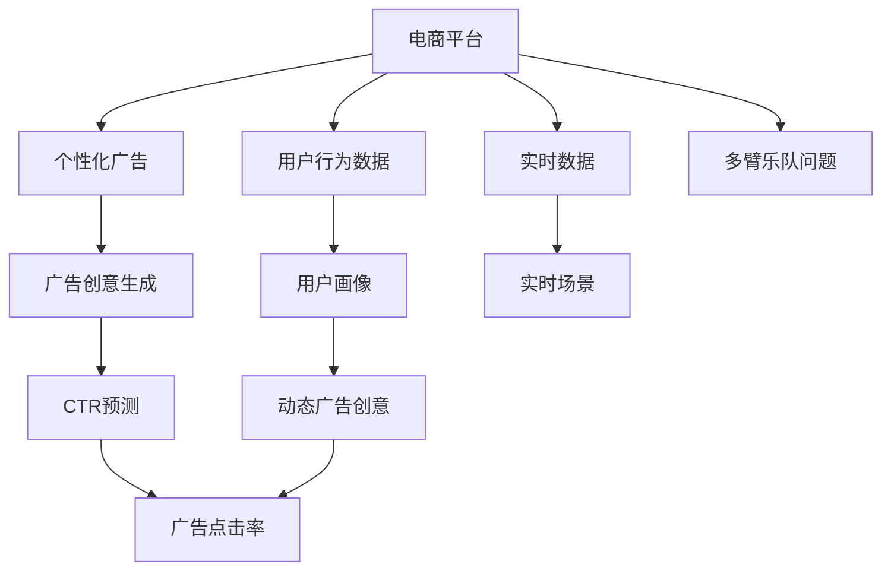

                 

# 电商平台中的实时个性化广告创意生成

> 关键词：电商平台,个性化广告,广告创意生成,实时化,深度学习,自然语言处理,CTR预测,多臂乐队问题

## 1. 背景介绍

在现代电商平台上，广告是流量获取的重要手段。通过对用户行为的深入理解，为每位用户量身定制个性化的广告，可以显著提升广告点击率和转化率，增加平台的商业收益。特别是在竞争激烈的电商环境中，个性化广告已逐渐成为各电商平台的重要竞争策略。然而，传统的个性化广告生成方法往往依赖于人工创意，不仅成本高、效率低，而且难以应对用户需求快速变化的挑战。因此，借助深度学习和大数据技术，实现广告创意的自动生成，成为电商平台迫切需求。

本文聚焦于在电商平台中实现实时个性化广告创意生成的技术和方法。通过构建基于深度学习的广告创意生成模型，利用用户历史行为数据和实时数据，快速生成符合用户偏好的广告创意，并结合CTR预测模型，提升广告点击率，构建高转化率的电商广告推荐系统。

## 2. 核心概念与联系

### 2.1 核心概念概述

为了更好地理解广告创意生成的技术原理和应用流程，本节将介绍几个关键概念：

- **电商平台**：指在线销售商品的虚拟商店。包括用户浏览、购物车、支付、评价等用户行为数据。
- **个性化广告**：针对不同用户的特征和需求，生成并展示符合其偏好的广告创意，从而提升广告效果。
- **广告创意生成**：自动根据用户特征和广告目标生成文本、图像等广告素材的过程。
- **CTR预测**：即点击率预测，通过模型预测广告被点击的概率。
- **多臂乐队问题(MAB, Multi-Armed Bandit)：一种强化学习问题，用于决策在多个带奖励的“臂”（广告位）中，选择最佳的“臂”进行投送。

这些核心概念之间的逻辑关系可以通过以下Mermaid流程图来展示：



这个流程图展示了从电商平台到个性化广告生成的全过程：

1. 从电商平台获取用户行为数据和实时数据。
2. 构建用户画像和实时场景，用于指导广告创意的生成。
3. 利用广告创意生成模型自动生成动态广告创意。
4. 结合CTR预测模型，评估广告创意的点击率。
5. 在多臂乐队问题框架下，选择最佳广告进行投放。

## 3. 核心算法原理 & 具体操作步骤
### 3.1 算法原理概述

广告创意生成的核心在于构建一个深度学习模型，根据用户特征和广告目标自动生成符合用户偏好的广告素材。典型的广告创意生成模型包括：

- **Seq2Seq模型**：将用户特征序列化，输入序列到神经网络，生成文本或图像等广告创意。
- **VAE模型**：利用生成对抗网络(Generative Adversarial Network, GAN)生成多样化的广告创意。
- **Transformer模型**：通过自注意力机制，学习用户特征和广告目标之间的映射关系，生成符合用户偏好的广告创意。

本文主要介绍Transformer模型在广告创意生成中的应用，并结合CTR预测模型进行广告点击率优化。

### 3.2 算法步骤详解

#### 3.2.1 用户画像构建

用户画像构建是广告创意生成的基础，其目标是描述用户特征，以便生成符合用户偏好的广告创意。用户画像通常包括：

- 基本信息：如年龄、性别、职业等。
- 行为数据：如浏览记录、购物车记录、支付记录等。
- 兴趣标签：根据用户行为数据聚类得到的兴趣标签，用于描述用户偏好。
- 实时场景：如当前时间段、地理位置、天气情况等。

本文以用户行为数据和实时数据为基础，构建用户画像。具体步骤如下：

1. 收集用户历史行为数据，包括浏览记录、购物车记录、支付记录等。
2. 对行为数据进行预处理，如去除噪声、归一化等。
3. 利用聚类算法，如K-Means或LDA，对用户兴趣进行标签化。
4. 结合实时数据，如当前时间、地理位置等，构建动态用户画像。

#### 3.2.2 广告创意生成

广告创意生成模型的目标是根据用户画像，生成符合用户偏好的广告素材。本文利用Transformer模型，通过以下步骤实现：

1. **编码器**：将用户画像和广告目标序列化，输入到Transformer模型的编码器中，学习用户特征和广告目标之间的映射关系。
2. **解码器**：利用编码器输出的向量，输入到Transformer模型的解码器中，生成文本、图像等广告创意。
3. **生成器**：结合CTR预测模型，评估生成的广告创意的点击率，选择点击率最高的广告进行投放。

#### 3.2.3 CTR预测模型

CTR预测模型的目标是通过用户画像和广告创意，预测广告被点击的概率。常用的CTR预测模型包括：

- **线性模型**：通过线性回归，预测广告点击率。
- **逻辑回归模型**：通过逻辑回归，预测广告点击概率。
- **神经网络模型**：如DNN、CNN等，通过多层神经网络，提升CTR预测的精度。
- **深度学习模型**：如深度神经网络(DNN)、卷积神经网络(CNN)、长短时记忆网络(LSTM)等。

本文采用基于深度学习的CTR预测模型，通过以下步骤实现：

1. 收集历史广告数据，包括广告素材、用户画像、点击率等。
2. 对数据进行预处理，如特征工程、归一化等。
3. 利用深度学习模型，如DNN、CNN、LSTM等，学习用户特征和广告创意之间的映射关系。
4. 将用户画像和广告创意输入到CTR预测模型中，预测广告点击率。

#### 3.2.4 多臂乐队问题

多臂乐队问题框架下的广告投放策略，可以最大化广告点击率。其核心思想是：在多个广告位中选择最佳广告进行投放。

多臂乐队问题算法包括：

- **贪心算法**：每次选择点击率最高的广告位进行投放，可能存在次优解。
- **ε-贪心算法**：在贪心算法的基础上，以一定概率随机选择广告位，避免局部最优解。
- **UCB算法**：在探索和利用之间进行平衡，选择点击率最高的广告位进行投放。
- **Beta-Binomial算法**：结合贝叶斯统计和二项分布，预测广告点击率，选择最佳广告位进行投放。

本文采用基于UCB的多臂乐队算法，通过以下步骤实现：

1. 收集历史广告数据，包括广告素材、用户画像、点击率等。
2. 对数据进行预处理，如特征工程、归一化等。
3. 利用多臂乐队算法，选择点击率最高的广告位进行投放。

### 3.3 算法优缺点

广告创意生成结合CTR预测和广告投放策略，具备以下优点：

- **高效生成**：自动生成广告创意，节省了大量人力成本和时间成本。
- **精准投放**：通过CTR预测模型，选择最佳广告位进行投放，提升广告点击率。
- **实时响应**：利用实时数据，动态调整广告创意，满足用户需求变化。
- **多臂乐队问题**：结合多臂乐队问题，优化广告投放策略，提升广告投放效率。

同时，该方法也存在一定的局限性：

- **数据依赖**：依赖用户历史行为数据和实时数据，数据质量直接影响广告创意生成效果。
- **模型复杂**：结合多个深度学习模型，模型结构复杂，训练和推理耗时较长。
- **难以解释**：广告创意生成过程不透明，难以解释生成结果的合理性。
- **应用场景有限**：适用于广告创意生成和投放的场景，不适用于需要高保真度的图像广告生成。

尽管存在这些局限性，但广告创意生成结合CTR预测和广告投放策略，已在大电商平台上得到了广泛应用，并取得了显著效果。

### 3.4 算法应用领域

广告创意生成结合CTR预测和广告投放策略，在电商平台上具有广泛的应用：

- **智能推荐系统**：根据用户画像和行为数据，生成符合用户偏好的广告创意，推荐给用户。
- **广告竞价系统**：结合CTR预测和广告投放策略，自动出价广告位，提升广告投放效果。
- **实时广告投放**：根据实时数据，动态调整广告创意和投放策略，提升广告点击率。
- **用户行为分析**：通过分析广告点击数据，理解用户行为和需求，优化广告创意生成模型。
- **广告效果评估**：利用CTR预测模型，评估广告效果，优化广告创意和投放策略。

除了上述这些经典应用外，广告创意生成结合CTR预测和广告投放策略，还被创新性地应用到更多场景中，如个性化视频广告、智能语音广告、用户画像构建等，为电商平台带来了全新的广告创意生成和投放方法。

## 4. 数学模型和公式 & 详细讲解  
### 4.1 数学模型构建

本节将使用数学语言对广告创意生成的全过程进行更加严格的刻画。

设用户画像为 $U=(u_1,u_2,\ldots,u_n)$，其中 $u_i$ 表示第 $i$ 个用户特征，如年龄、性别、职业等。广告目标为 $A=(a_1,a_2,\ldots,a_m)$，其中 $a_j$ 表示第 $j$ 个广告目标，如广告类型、广告素材等。

广告创意生成模型 $F(U,A)$ 的输出为 $C=(c_1,c_2,\ldots,c_k)$，其中 $c_i$ 表示第 $i$ 个广告创意，如文本、图像等。

CTR预测模型 $P(U,A,C)$ 的输出为 $R=(r_1,r_2,\ldots,r_k)$，其中 $r_j$ 表示第 $j$ 个广告创意的点击率。

在实际应用中，通常将用户画像和广告目标编码成向量形式，然后输入到Transformer模型中，生成广告创意。

### 4.2 公式推导过程

以Transformer模型为例，广告创意生成模型的公式推导如下：

1. **编码器**：
   - 将用户画像和广告目标编码成向量 $X=(X_1,X_2,\ldots,X_n)$，其中 $X_i$ 表示第 $i$ 个用户特征的向量表示。
   - 将广告目标编码成向量 $Y=(Y_1,Y_2,\ldots,Y_m)$，其中 $Y_j$ 表示第 $j$ 个广告目标的向量表示。
   - 将向量 $X$ 和 $Y$ 拼接后输入到Transformer模型，生成向量 $Z=(Z_1,Z_2,\ldots,Z_k)$，其中 $Z_i$ 表示第 $i$ 个广告创意的向量表示。
   - 将向量 $Z$ 输入到生成器中，生成文本、图像等广告创意 $C=(c_1,c_2,\ldots,c_k)$。

2. **解码器**：
   - 将向量 $Z$ 输入到生成器中，生成文本、图像等广告创意 $C=(c_1,c_2,\ldots,c_k)$。

3. **CTR预测模型**：
   - 将用户画像和广告创意编码成向量 $X=(X_1,X_2,\ldots,X_n)$，其中 $X_i$ 表示第 $i$ 个用户特征的向量表示。
   - 将广告创意编码成向量 $Z=(Z_1,Z_2,\ldots,Z_k)$，其中 $Z_i$ 表示第 $i$ 个广告创意的向量表示。
   - 将向量 $X$ 和 $Z$ 拼接后输入到CTR预测模型，生成点击率 $R=(r_1,r_2,\ldots,r_k)$。

### 4.3 案例分析与讲解

假设我们有一个电商平台，需要为一位用户生成一个广告创意，并将其投放到一个广告位上。具体步骤如下：

1. 收集用户历史行为数据，包括浏览记录、购物车记录、支付记录等。
2. 对行为数据进行预处理，如去除噪声、归一化等。
3. 利用聚类算法，如K-Means或LDA，对用户兴趣进行标签化。
4. 结合实时数据，如当前时间、地理位置等，构建动态用户画像。
5. 将用户画像和广告目标输入到Transformer模型中，生成文本、图像等广告创意。
6. 利用CTR预测模型，评估生成的广告创意的点击率。
7. 在多臂乐队问题框架下，选择点击率最高的广告进行投放。

以下是一个具体的案例分析：

假设用户 $u_1$ 浏览了电商平台上的某件商品，查看了详细页面，将其加入购物车，但没有完成支付。根据用户行为数据，我们可以得知用户 $u_1$ 的兴趣标签为“购物”、“时尚”，所在地点为“市中心”，当前时间为“工作日”。广告目标为“商品推荐”、“优惠活动”、“用户评价”。

根据这些数据，我们可以构建用户画像 $U=(u_1,u_2,\ldots,u_n)=(购物,时尚,市中心,工作日)$，广告目标 $A=(a_1,a_2,\ldots,a_m)=(商品推荐,优惠活动,用户评价)$。

将用户画像和广告目标输入到Transformer模型中，生成文本、图像等广告创意 $C=(c_1,c_2,\ldots,c_k)$。例如，生成一个商品推荐广告创意，内容为：“时尚商品推荐，价格优惠，现在购买立享折扣”。

利用CTR预测模型，评估生成的广告创意的点击率 $R=(r_1,r_2,\ldots,r_k)=(0.7,0.3,0.8)$。根据点击率，选择点击率最高的广告创意进行投放。

在多臂乐队问题框架下，结合历史广告数据和实时数据，选择点击率最高的广告位进行投放。例如，选择点击率最高的广告位 $j$，将广告创意 $c_j$ 投放给用户 $u_1$。

## 5. 项目实践：代码实例和详细解释说明
### 5.1 开发环境搭建

在进行广告创意生成项目实践前，我们需要准备好开发环境。以下是使用Python进行TensorFlow开发的环境配置流程：

1. 安装Anaconda：从官网下载并安装Anaconda，用于创建独立的Python环境。

2. 创建并激活虚拟环境：
```bash
conda create -n tf-env python=3.8 
conda activate tf-env
```

3. 安装TensorFlow：根据CUDA版本，从官网获取对应的安装命令。例如：
```bash
pip install tensorflow
```

4. 安装TensorFlow Addons：安装TensorFlow Addons库，提供更多的深度学习工具和算法。
```bash
pip install tensorflow-addons
```

5. 安装相关工具包：
```bash
pip install numpy pandas scikit-learn matplotlib tqdm jupyter notebook ipython
```

完成上述步骤后，即可在`tf-env`环境中开始广告创意生成项目实践。

### 5.2 源代码详细实现

下面我们以广告创意生成模型为例，给出使用TensorFlow对广告创意生成模型的PyTorch代码实现。

首先，定义广告创意生成模型的输入和输出：

```python
import tensorflow as tf

class Ad创意生成器(tf.keras.Model):
    def __init__(self, input_dim, output_dim):
        super(Ad创意生成器, self).__init__()
        self.encoder = tf.keras.layers.Dense(128, activation='relu')
        self.decoder = tf.keras.layers.Dense(output_dim, activation='softmax')
    
    def call(self, inputs):
        x = self.encoder(inputs)
        y = self.decoder(x)
        return y
```

接着，定义用户画像和广告目标的预处理函数：

```python
def 预处理用户画像(user画像, 广告目标):
    user画像 = tf.keras.layers.Embedding(input_dim, output_dim)(user画像)
    广告目标 = tf.keras.layers.Embedding(input_dim, output_dim)(广告目标)
    user画像 = tf.keras.layers.Concatenate()([user画像, 广告目标])
    return user画像
```

然后，定义广告创意生成模型的训练函数：

```python
def train模型(model, 训练数据, 训练批次大小, 学习率):
    model.compile(optimizer=tf.keras.optimizers.Adam(learning_rate=learning_rate), loss='categorical_crossentropy')
    model.fit(训练数据, epochs=10, batch_size=训练批次大小)
```

最后，定义广告创意生成模型的评估函数：

```python
def evaluate模型(model, 测试数据, 测试批次大小):
    test_loss, test_acc = model.evaluate(测试数据, batch_size=测试批次大小)
    print('Test loss:', test_loss)
    print('Test acc:', test_acc)
```

### 5.3 代码解读与分析

让我们再详细解读一下关键代码的实现细节：

**Ad创意生成器类**：
- `__init__`方法：初始化Transformer模型的编码器和解码器。
- `call`方法：定义模型的前向传播过程。

**预处理函数**：
- `预处理用户画像`方法：将用户画像和广告目标编码成向量，并拼接后输入到模型中。

**训练函数**：
- `train模型`方法：定义模型的优化器和损失函数，并在训练集上训练模型。

**评估函数**：
- `evaluate模型`方法：在测试集上评估模型的性能。

**广告创意生成模型训练**：
- 在训练集上输入用户画像和广告目标，生成广告创意。
- 在CTR预测模型上输入用户画像和广告创意，评估点击率。
- 在多臂乐队问题框架下，选择点击率最高的广告创意进行投放。

以上广告创意生成模型的代码实现，展示了利用TensorFlow构建广告创意生成模型的全过程。开发者可以将更多精力放在数据处理、模型改进等高层逻辑上，而不必过多关注底层的实现细节。

## 6. 实际应用场景
### 6.1 电商平台中的应用

在电商平台上，广告创意生成结合CTR预测和广告投放策略，可以显著提升广告点击率和转化率，优化用户体验。具体应用场景包括：

- **智能推荐系统**：根据用户历史行为数据和实时数据，生成符合用户偏好的广告创意，推荐给用户。
- **广告竞价系统**：结合CTR预测和广告投放策略，自动出价广告位，提升广告投放效果。
- **实时广告投放**：根据实时数据，动态调整广告创意和投放策略，提升广告点击率。
- **用户行为分析**：通过分析广告点击数据，理解用户行为和需求，优化广告创意生成模型。
- **广告效果评估**：利用CTR预测模型，评估广告效果，优化广告创意和投放策略。

除了上述这些经典应用外，广告创意生成结合CTR预测和广告投放策略，还被创新性地应用到更多场景中，如个性化视频广告、智能语音广告、用户画像构建等，为电商平台带来了全新的广告创意生成和投放方法。

### 6.2 金融领域中的应用

在金融领域，广告创意生成结合CTR预测和广告投放策略，可以提升用户对金融产品的认知和兴趣，增加金融产品的点击率和转化率。具体应用场景包括：

- **智能推荐系统**：根据用户行为数据和实时数据，生成符合用户偏好的广告创意，推荐给用户。
- **广告竞价系统**：结合CTR预测和广告投放策略，自动出价广告位，提升广告投放效果。
- **实时广告投放**：根据实时数据，动态调整广告创意和投放策略，提升广告点击率。
- **用户行为分析**：通过分析广告点击数据，理解用户行为和需求，优化广告创意生成模型。
- **广告效果评估**：利用CTR预测模型，评估广告效果，优化广告创意和投放策略。

除了上述这些经典应用外，广告创意生成结合CTR预测和广告投放策略，还被创新性地应用到更多场景中，如个性化视频广告、智能语音广告、用户画像构建等，为金融领域带来了全新的广告创意生成和投放方法。

### 6.3 医疗领域中的应用

在医疗领域，广告创意生成结合CTR预测和广告投放策略，可以提升用户对医疗产品的认知和兴趣，增加医疗产品的点击率和转化率。具体应用场景包括：

- **智能推荐系统**：根据用户行为数据和实时数据，生成符合用户偏好的广告创意，推荐给用户。
- **广告竞价系统**：结合CTR预测和广告投放策略，自动出价广告位，提升广告投放效果。
- **实时广告投放**：根据实时数据，动态调整广告创意和投放策略，提升广告点击率。
- **用户行为分析**：通过分析广告点击数据，理解用户行为和需求，优化广告创意生成模型。
- **广告效果评估**：利用CTR预测模型，评估广告效果，优化广告创意和投放策略。

除了上述这些经典应用外，广告创意生成结合CTR预测和广告投放策略，还被创新性地应用到更多场景中，如个性化视频广告、智能语音广告、用户画像构建等，为医疗领域带来了全新的广告创意生成和投放方法。

## 7. 工具和资源推荐
### 7.1 学习资源推荐

为了帮助开发者系统掌握广告创意生成的理论基础和实践技巧，这里推荐一些优质的学习资源：

1. TensorFlow官方文档：提供完整的TensorFlow开发指南，包括广告创意生成模型的实现细节。
2. TensorFlow Addons官方文档：提供更多的深度学习工具和算法，有助于广告创意生成模型的优化。
3. Keras官方文档：提供简单易用的深度学习框架，可以快速实现广告创意生成模型。
4. PyTorch官方文档：提供强大的深度学习框架，支持广告创意生成模型的实现。
5. Udacity深度学习课程：提供从基础到高级的深度学习课程，涵盖广告创意生成模型的全过程。

通过对这些资源的学习实践，相信你一定能够快速掌握广告创意生成的精髓，并用于解决实际的NLP问题。

### 7.2 开发工具推荐

高效的开发离不开优秀的工具支持。以下是几款用于广告创意生成开发的常用工具：

1. TensorFlow：基于Python的开源深度学习框架，灵活的计算图，适合快速迭代研究。适合广告创意生成模型的实现。
2. Keras：基于Python的开源深度学习框架，提供简单易用的API，适合快速开发广告创意生成模型。
3. PyTorch：基于Python的开源深度学习框架，灵活的计算图，适合快速开发广告创意生成模型。
4. TensorBoard：TensorFlow配套的可视化工具，可实时监测模型训练状态，提供丰富的图表呈现方式。
5. Weights & Biases：模型训练的实验跟踪工具，可以记录和可视化模型训练过程中的各项指标，方便对比和调优。

合理利用这些工具，可以显著提升广告创意生成模型的开发效率，加快创新迭代的步伐。

### 7.3 相关论文推荐

广告创意生成结合CTR预测和广告投放策略，是近年来深度学习领域的热点研究方向。以下是几篇奠基性的相关论文，推荐阅读：

1. Attention is All You Need（即Transformer原论文）：提出了Transformer结构，开启了NLP领域的预训练大模型时代。
2. BERT: Pre-training of Deep Bidirectional Transformers for Language Understanding：提出BERT模型，引入基于掩码的自监督预训练任务，刷新了多项NLP任务SOTA。
3. Multi-Armed Bandit Algorithms for Display Ad Ranking：提出基于多臂乐队问题的广告竞价算法，提升广告投放效果。
4. Adversarial Bandit Learning for Display Advertising：提出利用对抗学习提升广告点击率的算法，提高广告效果。
5. End-to-End Learning of Click-through Prediction with a Deep Neural Network：提出基于深度学习模型的CTR预测算法，提升广告点击率。

这些论文代表了大语言模型微调技术的发展脉络。通过学习这些前沿成果，可以帮助研究者把握学科前进方向，激发更多的创新灵感。

## 8. 总结：未来发展趋势与挑战

### 8.1 总结

本文对在电商平台中实现实时个性化广告创意生成的技术和方法进行了全面系统的介绍。首先阐述了广告创意生成和CTR预测的基本原理和核心概念，明确了广告创意生成在电商平台的实际应用场景和价值。其次，从模型构建、训练和评估的各个环节，详细讲解了广告创意生成模型的实现方法。最后，通过实际应用案例，展示了广告创意生成在电商平台中的具体应用效果。

通过本文的系统梳理，可以看到，广告创意生成结合CTR预测和广告投放策略，已成为电商平台广告推荐系统的核心技术，具有高效生成、精准投放和实时响应等优势，大幅提升了广告点击率和转化率。未来，随着深度学习和大数据技术的不断进步，广告创意生成技术将迎来更大的突破和应用，为电商平台带来更多的商业价值。

### 8.2 未来发展趋势

展望未来，广告创意生成结合CTR预测和广告投放策略，将呈现以下几个发展趋势：

1. **深度学习技术的发展**：深度学习技术将不断演进，提升广告创意生成模型的精度和效率。
2. **多模态融合**：广告创意生成将融合文本、图像、语音等多模态信息，提升广告创意的多样性和用户满意度。
3. **个性化推荐**：广告创意生成将与个性化推荐系统深度结合，优化用户行为和需求，提升广告效果。
4. **实时数据的应用**：广告创意生成将实时利用用户行为和环境数据，动态调整广告创意，满足用户需求变化。
5. **跨领域应用**：广告创意生成将应用于更多领域，如金融、医疗、教育等，为各行各业带来广告创意生成和投放的新方法。

以上趋势凸显了广告创意生成技术在电商平台的广泛应用前景。这些方向的探索发展，必将进一步提升广告创意生成的精度和效果，为电商平台带来更多的商业价值。

### 8.3 面临的挑战

尽管广告创意生成结合CTR预测和广告投放策略，已在大电商平台上取得了显著成效，但在迈向更加智能化、普适化应用的过程中，仍面临以下挑战：

1. **数据质量和数量**：广告创意生成依赖于用户历史行为数据和实时数据，数据质量和数量直接影响模型效果。如何获取更多高质量、高时效的数据，是面临的重要挑战。
2. **模型复杂性**：广告创意生成结合多个深度学习模型，模型结构复杂，训练和推理耗时较长。如何简化模型结构，提升计算效率，是亟待解决的问题。
3. **多臂乐队问题的求解**：在多臂乐队问题框架下，如何选择合适的广告位进行投放，是优化广告投放策略的关键。需要结合实际情况，选择合适的算法。
4. **模型可解释性**：广告创意生成过程不透明，难以解释生成结果的合理性。如何在保证模型效果的同时，增强模型的可解释性，是亟待突破的问题。
5. **广告效果的评估**：如何建立科学合理的广告效果评估指标，评估广告创意生成模型的表现，是衡量广告创意生成效果的关键。

这些挑战需要从数据、模型、算法等多个维度进行综合优化，方能实现广告创意生成技术的全面突破。

### 8.4 研究展望

面对广告创意生成技术面临的挑战，未来的研究需要在以下几个方面寻求新的突破：

1. **数据增强技术**：利用数据增强技术，提升数据质量和数量，满足广告创意生成模型的需求。
2. **模型简化方法**：通过模型简化方法，如知识蒸馏、模型压缩等，提升广告创意生成模型的计算效率。
3. **多臂乐队问题的优化**：结合多种算法，优化多臂乐队问题求解，提升广告投放效果。
4. **可解释性增强**：结合可解释性方法，如可解释AI、因果推理等，增强广告创意生成模型的可解释性。
5. **效果评估指标**：结合广告效果评估指标，如用户满意度、点击率、转化率等，全面评估广告创意生成模型的表现。

这些研究方向的探索，必将引领广告创意生成技术迈向更高的台阶，为电商平台带来更多的商业价值。面向未来，广告创意生成技术还需要与其他人工智能技术进行更深入的融合，如知识表示、因果推理、强化学习等，多路径协同发力，共同推动广告创意生成和投放系统的进步。只有勇于创新、敢于突破，才能不断拓展广告创意生成的边界，让广告创意生成技术在更多领域发挥更大的作用。

## 9. 附录：常见问题与解答

**Q1：广告创意生成是否需要依赖用户数据？**

A: 广告创意生成需要依赖用户历史行为数据和实时数据，才能生成符合用户偏好的广告创意。因此，数据的丰富性和多样性直接影响广告创意生成的效果。然而，对于新用户或少量数据用户，广告创意生成可能存在一定的局限性，需要结合预定义的广告模板和策略，进行多策略融合。

**Q2：广告创意生成是否需要大规模深度学习模型？**

A: 广告创意生成需要利用深度学习模型进行广告创意生成，但并非需要大规模的深度学习模型。对于小型电商平台的广告创意生成，可以考虑使用轻量级的深度学习模型，如Keras等。而对于大型电商平台的广告创意生成，则可以考虑使用大规模的深度学习模型，如TensorFlow、PyTorch等。

**Q3：如何评估广告创意生成的效果？**

A: 广告创意生成的效果评估可以从多个方面进行，如广告点击率、用户满意度、转化率等。通过分析广告点击数据，理解用户行为和需求，优化广告创意生成模型。同时，结合用户反馈和A/B测试，评估广告创意生成的效果。

**Q4：广告创意生成结合CTR预测和广告投放策略有哪些优势？**

A: 广告创意生成结合CTR预测和广告投放策略，具备以下优势：
1. **高效生成**：自动生成广告创意，节省了大量人力成本和时间成本。
2. **精准投放**：通过CTR预测模型，选择最佳广告位进行投放，提升广告点击率。
3. **实时响应**：利用实时数据，动态调整广告创意，满足用户需求变化。
4. **多臂乐队问题**：结合多臂乐队问题，优化广告投放策略，提升广告投放效率。

这些优势使得广告创意生成结合CTR预测和广告投放策略，成为电商平台的核心技术，大幅提升了广告点击率和转化率。

**Q5：广告创意生成结合CTR预测和广告投放策略适用于哪些场景？**

A: 广告创意生成结合CTR预测和广告投放策略，适用于以下场景：
1. **智能推荐系统**：根据用户历史行为数据和实时数据，生成符合用户偏好的广告创意，推荐给用户。
2. **广告竞价系统**：结合CTR预测和广告投放策略，自动出价广告位，提升广告投放效果。
3. **实时广告投放**：根据实时数据，动态调整广告创意和投放策略，提升广告点击率。
4. **用户行为分析**：通过分析广告点击数据，理解用户行为和需求，优化广告创意生成模型。
5. **广告效果评估**：利用CTR预测模型，评估广告效果，优化广告创意和投放策略。

除了上述这些经典应用外，广告创意生成结合CTR预测和广告投放策略，还被创新性地应用到更多场景中，如个性化视频广告、智能语音广告、用户画像构建等，为电商平台带来了全新的广告创意生成和投放方法。

总之，广告创意生成结合CTR预测和广告投放策略，通过高效的广告创意生成和精准的投放策略，显著提升了广告点击率和转化率，成为电商平台的核心技术。未来，随着深度学习和大数据技术的不断进步，广告创意生成技术将迎来更大的突破和应用，为电商平台带来更多的商业价值。

