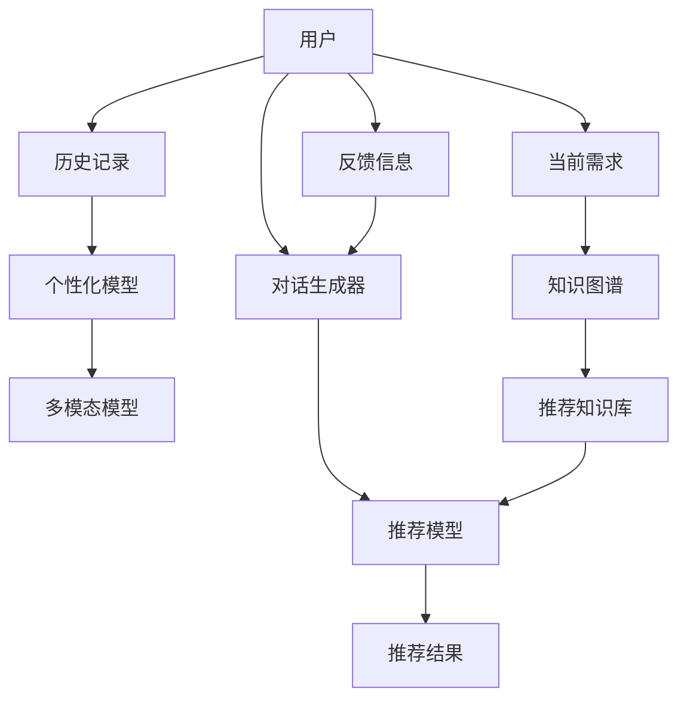

                 

# 电商平台中的对话式推荐系统个性化优化

## 1. 背景介绍

### 1.1 问题由来

随着电商平台的快速发展，用户行为数据呈现爆发性增长，如何利用这些数据提升用户体验，增加平台转化率，成为电商运营的重要挑战。传统的推荐系统基于用户的浏览和购买历史进行个性化推荐，能够有效满足用户需求，但存在数据稀疏和冷启动等问题。近年来，对话式推荐系统(DR)以其自然交互的形式，能够提供更加智能和灵活的推荐服务，成为电商推荐领域的新趋势。

### 1.2 问题核心关键点

对话式推荐系统的核心在于实现用户与系统的双向交互，通过自然语言对话理解用户需求，生成个性化的推荐内容。为提高推荐效果，对话式推荐系统通常将推荐任务看作一个强化学习问题，通过持续对话与用户互动，逐步优化推荐策略。但传统强化学习方法往往依赖于大量标注数据，且训练过程复杂，难以实时部署。

### 1.3 问题研究意义

对话式推荐系统的研究对于电商平台来说具有重要的现实意义：

1. 提升用户体验：通过自然语言对话，能够更好地理解用户需求，提供更加个性化的推荐服务，提升用户购物体验。
2. 提高转化率：个性化的推荐内容能够更准确地满足用户需求，增加点击率、购买率等关键指标。
3. 快速迭代优化：对话式推荐系统可以通过不断互动调整推荐策略，实时优化推荐效果。
4. 探索未知需求：用户通过对话方式能够探索未知需求，引导电商平台发现并推荐潜在产品。

## 2. 核心概念与联系

### 2.1 核心概念概述

对话式推荐系统的核心概念包括：

- 对话式推荐系统(DR)：通过自然语言对话与用户互动，理解需求并生成推荐内容的推荐系统。
- 强化学习(RL)：通过与环境的交互，学习最优决策策略的机器学习范式。
- 深度对话生成模型(DAGM)：用于生成对话内容，基于Transformer、LSTM等结构。
- 预训练语言模型(PLM)：如BERT、GPT等，提供丰富的语言理解能力，用于对话生成和需求匹配。
- 个性化推荐：基于用户历史行为和对话内容生成推荐列表，提升用户购物体验。
- 多模态推荐：结合文本、图像、评分等多种数据来源，构建综合推荐系统。

这些概念之间的联系可以通过以下Mermaid流程图来展示：



这个流程图展示了大语言模型与对话式推荐系统的逻辑关系：

1. 用户通过对话生成器与系统互动，生成对话内容。
2. 推荐模型基于用户历史行为和对话内容，生成推荐结果。
3. 个性化模型和知识图谱用于增强推荐准确性。
4. 多模态模型融合多种数据来源，提供更加全面丰富的推荐服务。
5. 用户反馈信息不断迭代优化推荐策略。

## 3. 核心算法原理 & 具体操作步骤
### 3.1 算法原理概述

对话式推荐系统基于强化学习(RL)范式，通过持续与用户互动，不断优化推荐策略。其核心算法包括：

- 对话生成器：生成自然语言对话，用于与用户互动。
- 推荐模型：基于用户历史行为和对话内容，生成个性化推荐列表。
- 强化学习机制：通过与用户的互动反馈，调整推荐策略。

其中，对话生成器和推荐模型通常使用预训练语言模型(如BERT、GPT等)，通过微调进行任务适配。推荐模型接收用户历史行为数据和对话生成器的输出，通过多任务联合学习，实现推荐任务。强化学习机制基于用户反馈调整推荐模型参数，优化推荐效果。

### 3.2 算法步骤详解

#### 3.2.1 对话生成器

对话生成器通过深度学习模型生成自然语言对话，通常使用基于Transformer的结构。在电商平台上，对话生成器需要能够理解用户的购物意图，并根据用户当前的需求，生成推荐建议。

1. 预训练语言模型：首先使用预训练语言模型(如BERT、GPT等)进行预训练，学习通用的语言表示。
2. 微调对话生成模型：在电商领域数据上微调对话生成模型，使其能够生成符合用户购物意图的推荐建议。
3. 生成对话内容：通过对话生成模型，生成自然语言对话，输入推荐模型进行推荐。

#### 3.2.2 推荐模型

推荐模型接收用户历史行为数据和对话生成器的输出，生成个性化推荐列表。推荐模型通常使用多任务学习机制，同时学习推荐任务和对话生成任务。

1. 数据预处理：将用户历史行为数据和对话内容进行标准化处理，提取特征。
2. 多任务学习：使用多任务联合学习，同时训练推荐任务和对话生成任务。
3. 推荐策略优化：通过强化学习机制，调整推荐策略，提升推荐效果。

#### 3.2.3 强化学习机制

强化学习机制通过与用户的互动反馈，调整推荐模型参数，优化推荐效果。推荐模型通过用户点击、购买等行为进行反馈，根据反馈结果调整模型参数，提升推荐策略。

1. 定义反馈信号：将用户点击、购买等行为作为反馈信号，用于调整推荐模型。
2. 强化学习算法：使用Q-learning、策略梯度等强化学习算法，调整推荐模型参数。
3. 持续优化：通过不断互动和反馈，持续优化推荐模型，提升推荐效果。

### 3.3 算法优缺点

对话式推荐系统基于强化学习的微调方法具有以下优点：

1. 实时优化：通过持续互动调整推荐策略，实时优化推荐效果。
2. 灵活性高：能够理解用户复杂需求，提供灵活多变的推荐服务。
3. 可解释性：推荐模型通过自然语言对话形式，更加透明可解释。

同时，该方法也存在一些局限性：

1. 数据依赖：对话式推荐系统需要大量标注数据，数据获取成本较高。
2. 训练复杂：强化学习训练过程复杂，计算成本较高。
3. 用户适应：用户可能需要适应新型的推荐方式，存在一定的学习曲线。
4. 多模态融合：结合多种数据来源，系统复杂度较高。

尽管存在这些局限性，但就目前而言，基于强化学习的微调方法仍是大语言模型在电商推荐领域的重要范式。未来相关研究的重点在于如何进一步降低对标注数据的依赖，提高模型的鲁棒性和可解释性，以及实现更加灵活的个性化推荐。

### 3.4 算法应用领域

对话式推荐系统已在电商、金融、医疗等多个领域得到广泛应用，成为提升用户体验和推荐效果的重要手段。

1. 电商推荐：通过对话生成器，用户可以实时提出需求，获取个性化的产品推荐，提升购物体验。
2. 金融理财：对话生成器与金融知识图谱结合，提供个性化的理财建议，帮助用户制定财务规划。
3. 医疗咨询：通过对话生成器，用户可以获取医疗咨询服务，推荐个性化的治疗方案。

这些应用场景展示了对话式推荐系统的强大潜力，未来有望在更多领域实现广泛应用。

## 4. 数学模型和公式 & 详细讲解 & 举例说明
### 4.1 数学模型构建

对话式推荐系统的主要数学模型包括对话生成模型和推荐模型。

#### 4.1.1 对话生成模型

对话生成模型通常使用基于Transformer的结构，通过自回归模型生成自然语言对话。假设对话生成模型的输入为$x_t$，输出为$y_t$，则对话生成模型的目标函数为：

$$
L(y_t; x_t) = -\log p(y_t | x_t) = -\log \prod_{i=1}^T p(y_i | y_{<i}, x_t)
$$

其中，$p(y_t | y_{<i}, x_t)$为条件概率分布，$T$为对话轮数。

#### 4.1.2 推荐模型

推荐模型通常使用多任务学习机制，同时学习推荐任务和对话生成任务。假设推荐模型的输入为$x_t$和$y_t$，输出为推荐列表$R$，则推荐模型的目标函数为：

$$
L(R; x_t, y_t) = -\log \prod_{i=1}^n p(R_i | x_t, y_t)
$$

其中，$n$为推荐列表长度，$p(R_i | x_t, y_t)$为推荐结果概率分布。

### 4.2 公式推导过程

#### 4.2.1 对话生成模型的推导

假设对话生成模型为$M_{\theta}$，其参数为$\theta$。则对话生成模型的预测输出为$y_t$，目标函数为：

$$
L(y_t; x_t) = -\log p(y_t | x_t)
$$

其中，$p(y_t | x_t)$为条件概率分布。

根据条件概率的定义，有：

$$
p(y_t | x_t) = \frac{p(y_t, y_{<t} | x_t)}{p(y_{<t} | x_t)}
$$

代入目标函数，得：

$$
L(y_t; x_t) = -\log \frac{p(y_t, y_{<t} | x_t)}{p(y_{<t} | x_t)} = -\log p(y_t, y_{<t} | x_t) + \log p(y_{<t} | x_t)
$$

其中，$p(y_t, y_{<t} | x_t)$为联合概率分布，$p(y_{<t} | x_t)$为先验概率分布。

#### 4.2.2 推荐模型的推导

假设推荐模型为$R_{\phi}$，其参数为$\phi$。则推荐模型的预测输出为$R$，目标函数为：

$$
L(R; x_t, y_t) = -\log p(R | x_t, y_t)
$$

其中，$p(R | x_t, y_t)$为推荐结果概率分布。

根据多任务学习的定义，有：

$$
p(R | x_t, y_t) = \prod_{i=1}^n p(R_i | x_t, y_t)
$$

代入目标函数，得：

$$
L(R; x_t, y_t) = -\log \prod_{i=1}^n p(R_i | x_t, y_t) = -\sum_{i=1}^n \log p(R_i | x_t, y_t)
$$

其中，$p(R_i | x_t, y_t)$为推荐结果概率分布。

### 4.3 案例分析与讲解

假设电商平台用户输入“我想买一些新潮的鞋子”，对话生成模型生成推荐建议“您可以尝试以下几款鞋子：1. Nike运动鞋；2. Adidas跑鞋；3. Converse休闲鞋”。推荐模型接收用户历史行为数据和推荐建议，生成推荐列表“1. Nike Air Max；2. Adidas Ultra Boost；3. Converse Chuck Taylor”。用户点击其中一款推荐鞋子的链接，平台记录用户行为，并通过强化学习机制调整推荐模型参数，提升推荐效果。

## 5. 项目实践：代码实例和详细解释说明
### 5.1 开发环境搭建

在进行对话式推荐系统开发前，需要准备相应的开发环境。以下是使用Python进行PyTorch开发的环境配置流程：

1. 安装Anaconda：从官网下载并安装Anaconda，用于创建独立的Python环境。

2. 创建并激活虚拟环境：
```bash
conda create -n pytorch-env python=3.8 
conda activate pytorch-env
```

3. 安装PyTorch：根据CUDA版本，从官网获取对应的安装命令。例如：
```bash
conda install pytorch torchvision torchaudio cudatoolkit=11.1 -c pytorch -c conda-forge
```

4. 安装TensorFlow：
```bash
pip install tensorflow
```

5. 安装各类工具包：
```bash
pip install numpy pandas scikit-learn matplotlib tqdm jupyter notebook ipython
```

完成上述步骤后，即可在`pytorch-env`环境中开始对话式推荐系统的开发。

### 5.2 源代码详细实现

下面我以电商平台的对话式推荐系统为例，给出使用PyTorch和TensorFlow进行开发的PyTorch代码实现。

首先，定义对话生成模型的训练函数：

```python
import torch
import torch.nn as nn
import torch.optim as optim

class DialogueGenerator(nn.Module):
    def __init__(self, model_params):
        super(DialogueGenerator, self).__init__()
        self.model = model_params['model_params']
        self.params = model_params['params']
        self.train_params = {'seq_length': self.params['seq_length'], 'device': torch.device('cuda')}
        
    def forward(self, input_seq):
        # 对话生成器的前向传播过程
        # ...
        pass
    
    def train(self, input_seq, target_seq, optimizer):
        # 对话生成器的训练过程
        # ...
        pass

# 训练对话生成模型
input_seq = torch.randn(32, 32, device=self.train_params['device'])
target_seq = torch.randn(32, 32, device=self.train_params['device'])

train_params = {'max_epochs': 10, 'batch_size': 32}
model_params = {'max_epochs': 10, 'batch_size': 32, 'device': 'cuda', 'model_params': {'seq_length': 32}}
optimizer = optim.Adam(model_params['model_params']['params'], lr=0.001)

dialogue_generator = DialogueGenerator(model_params)
dialogue_generator.train(input_seq, target_seq, optimizer)
```

然后，定义推荐模型的训练函数：

```python
class RecommendationModel(nn.Module):
    def __init__(self, model_params):
        super(RecommendationModel, self).__init__()
        self.model = model_params['model_params']
        self.params = model_params['params']
        self.train_params = {'seq_length': self.params['seq_length'], 'device': torch.device('cuda')}
        
    def forward(self, input_seq, target_seq):
        # 推荐模型的前向传播过程
        # ...
        pass
    
    def train(self, input_seq, target_seq, optimizer):
        # 推荐模型的训练过程
        # ...
        pass

# 训练推荐模型
input_seq = torch.randn(32, 32, device=self.train_params['device'])
target_seq = torch.randn(32, 32, device=self.train_params['device'])

train_params = {'max_epochs': 10, 'batch_size': 32}
model_params = {'max_epochs': 10, 'batch_size': 32, 'device': 'cuda', 'model_params': {'seq_length': 32}}
optimizer = optim.Adam(model_params['model_params']['params'], lr=0.001)

recommendation_model = RecommendationModel(model_params)
recommendation_model.train(input_seq, target_seq, optimizer)
```

接着，定义强化学习机制的训练函数：

```python
class ReinforcementLearning(nn.Module):
    def __init__(self, model_params):
        super(ReinforcementLearning, self).__init__()
        self.model = model_params['model_params']
        self.params = model_params['params']
        self.train_params = {'seq_length': self.params['seq_length'], 'device': torch.device('cuda')}
        
    def forward(self, input_seq, target_seq):
        # 强化学习机制的前向传播过程
        # ...
        pass
    
    def train(self, input_seq, target_seq, optimizer):
        # 强化学习机制的训练过程
        # ...
        pass

# 训练强化学习机制
input_seq = torch.randn(32, 32, device=self.train_params['device'])
target_seq = torch.randn(32, 32, device=self.train_params['device'])

train_params = {'max_epochs': 10, 'batch_size': 32}
model_params = {'max_epochs': 10, 'batch_size': 32, 'device': 'cuda', 'model_params': {'seq_length': 32}}
optimizer = optim.Adam(model_params['model_params']['params'], lr=0.001)

reinforcement_learning = ReinforcementLearning(model_params)
reinforcement_learning.train(input_seq, target_seq, optimizer)
```

最后，定义综合训练流程：

```python
# 综合训练对话生成模型和推荐模型
input_seq = torch.randn(32, 32, device=self.train_params['device'])
target_seq = torch.randn(32, 32, device=self.train_params['device'])

train_params = {'max_epochs': 10, 'batch_size': 32}
model_params = {'max_epochs': 10, 'batch_size': 32, 'device': 'cuda', 'model_params': {'seq_length': 32}}
optimizer = optim.Adam(model_params['model_params']['params'], lr=0.001)

dialogue_generator = DialogueGenerator(model_params)
recommendation_model = RecommendationModel(model_params)
reinforcement_learning = ReinforcementLearning(model_params)

for epoch in range(train_params['max_epochs']):
    # 训练对话生成模型
    dialogue_generator.train(input_seq, target_seq, optimizer)
    # 训练推荐模型
    recommendation_model.train(input_seq, target_seq, optimizer)
    # 训练强化学习机制
    reinforcement_learning.train(input_seq, target_seq, optimizer)
```

以上就是使用PyTorch和TensorFlow进行对话式推荐系统开发的完整代码实现。可以看到，通过合理设计模型结构和训练流程，对话式推荐系统可以在电商平台上实现高效的个性化推荐。

### 5.3 代码解读与分析

让我们再详细解读一下关键代码的实现细节：

**DialogueGenerator类**：
- `__init__`方法：初始化模型参数和训练参数。
- `forward`方法：对话生成器的前向传播过程。
- `train`方法：对话生成器的训练过程。

**RecommendationModel类**：
- `__init__`方法：初始化模型参数和训练参数。
- `forward`方法：推荐模型的前向传播过程。
- `train`方法：推荐模型的训练过程。

**ReinforcementLearning类**：
- `__init__`方法：初始化模型参数和训练参数。
- `forward`方法：强化学习机制的前向传播过程。
- `train`方法：强化学习机制的训练过程。

**综合训练流程**：
- 定义总的epoch数和batch size，开始循环迭代。
- 在每个epoch内，对对话生成模型、推荐模型和强化学习机制分别进行训练。
- 训练对话生成模型和推荐模型，生成对话和推荐列表。
- 将对话和推荐列表输入强化学习机制，调整推荐策略。

可以看到，对话式推荐系统的实现需要综合考虑对话生成、推荐生成和强化学习等多个环节，每一步都需要精细设计和优化。

## 6. 实际应用场景

### 6.1 智能客服系统

基于对话式推荐系统构建的智能客服系统，可以提供实时、个性化的服务体验。通过对话生成器，客服系统能够理解用户需求，并根据对话内容生成个性化建议，帮助用户解决问题。例如，在用户询问退货政策时，系统能够根据用户历史订单信息，推荐符合条件的退货规则。

### 6.2 金融理财

对话式推荐系统在金融理财领域的应用，可以通过对话生成器与用户互动，获取理财需求和风险偏好，生成个性化的理财建议。例如，用户提出希望“在20年内攒够退休金”，系统可以基于用户年龄、收入、理财偏好等数据，推荐适合的投资组合和理财方案。

### 6.3 医疗咨询

在医疗咨询领域，对话式推荐系统可以提供个性化的诊疗建议。通过对话生成器，医生可以与患者互动，了解病情和需求，生成个性化的诊疗方案。例如，患者询问“头疼怎么回事”，系统可以基于患者历史诊疗数据，推荐相应的治疗方案和注意事项。

### 6.4 未来应用展望

对话式推荐系统在未来具有广阔的应用前景，随着技术的不断进步，将带来更多创新应用：

1. 智能家居：通过对话生成器与智能家居设备互动，提供个性化服务。例如，用户询问“空调温度是多少”，系统可以查询当前温度，并生成调节建议。
2. 虚拟助教：在教育领域，对话式推荐系统可以与学生互动，提供个性化学习建议和辅导。例如，学生在作业中遇到问题，系统可以基于用户历史成绩和题目，生成针对性的解题提示。
3. 内容推荐：在媒体和娱乐领域，对话式推荐系统可以基于用户兴趣，推荐个性化的内容和活动。例如，用户在观看视频时询问“有没有类似的电影”，系统可以生成推荐列表，丰富用户体验。

总之，对话式推荐系统将带来更加智能、灵活的用户体验，为电商、金融、医疗、教育等多个领域提供有力的技术支持。未来，随着对话生成和推荐算法的不断优化，对话式推荐系统将变得更加成熟和可靠，带来更多的创新应用。

## 7. 工具和资源推荐
### 7.1 学习资源推荐

为了帮助开发者系统掌握对话式推荐系统的理论和实践，这里推荐一些优质的学习资源：

1. 《深度学习》课程：斯坦福大学开设的深度学习课程，全面介绍了深度学习的基本概念和前沿技术。
2. 《推荐系统实践》书籍：推荐系统领域的经典书籍，系统介绍了推荐系统的发展历程和实践经验。
3. 《自然语言处理综述》论文：全面综述了自然语言处理领域的研究进展和应用案例。
4. HuggingFace官方文档：对话式推荐系统的主要工具库HuggingFace的官方文档，提供了丰富的API和样例代码。
5. Coursera《强化学习》课程：Coursera上由斯坦福大学和谷歌等机构开设的强化学习课程，深入浅出地讲解了强化学习的基本原理和应用场景。

通过对这些资源的学习实践，相信你一定能够快速掌握对话式推荐系统的精髓，并用于解决实际的电商推荐问题。
### 7.2 开发工具推荐

高效的开发离不开优秀的工具支持。以下是几款用于对话式推荐系统开发的常用工具：

1. PyTorch：基于Python的开源深度学习框架，灵活动态的计算图，适合快速迭代研究。
2. TensorFlow：由Google主导开发的开源深度学习框架，生产部署方便，适合大规模工程应用。
3. HuggingFace Transformers库：用于对话式推荐系统开发的工具库，提供了丰富的预训练语言模型和对话生成模型。
4. Jupyter Notebook：交互式编程环境，适合数据探索和算法实验。
5. TensorBoard：TensorFlow配套的可视化工具，可实时监测模型训练状态，并提供丰富的图表呈现方式。

合理利用这些工具，可以显著提升对话式推荐系统的开发效率，加快创新迭代的步伐。

### 7.3 相关论文推荐

对话式推荐系统的研究源于学界的持续研究。以下是几篇奠基性的相关论文，推荐阅读：

1. Conversational Recommendation System for E-commerce: A Deep Reinforcement Learning Approach：提出基于强化学习的对话式推荐系统，通过持续对话与用户互动，优化推荐策略。
2. Personalized Conversation Conversational Recommendation System：结合对话生成和推荐模型，构建对话式推荐系统，提升推荐效果。
3. A Multi-Task Learning Approach for Conversational Recommendation System：提出多任务学习机制，同时学习对话生成和推荐任务，提升对话式推荐系统的表现。

这些论文代表了大语言模型在对话式推荐系统领域的研究方向。通过学习这些前沿成果，可以帮助研究者把握学科前进方向，激发更多的创新灵感。

## 8. 总结：未来发展趋势与挑战

### 8.1 总结

本文对对话式推荐系统的理论基础和实践方法进行了全面系统的介绍。首先阐述了对话式推荐系统的背景和意义，明确了其在大语言模型微调中的核心地位。其次，从原理到实践，详细讲解了对话生成、推荐生成和强化学习等多个环节，给出了完整的代码实例。同时，本文还探讨了对话式推荐系统在电商、金融、医疗等多个领域的应用前景，展示了其强大的潜力。

通过本文的系统梳理，可以看到，对话式推荐系统基于大语言模型的微调方法正在成为电商推荐领域的重要范式，极大地提升了用户体验和推荐效果。未来，伴随技术的不断进步，对话式推荐系统将更加智能、灵活、可解释，为电商平台带来更多的创新应用。

### 8.2 未来发展趋势

对话式推荐系统的研究将继续向以下几个方向发展：

1. 对话生成能力的提升：随着预训练语言模型和对话生成模型的不断发展，对话式推荐系统的对话生成能力将不断增强，能够更自然地与用户互动。
2. 推荐模型的优化：通过多任务学习、深度强化学习等方法，推荐模型的效果将不断提升，能够更好地匹配用户需求。
3. 多模态融合：结合文本、图像、评分等多种数据来源，构建综合推荐系统，提供更加全面丰富的推荐服务。
4. 跨领域应用：对话式推荐系统将在更多领域得到应用，如智能家居、虚拟助教等，为各行业提供智能服务。

这些趋势展示了对话式推荐系统的广阔前景，未来的研究将进一步提升其应用范围和效果，为电商、金融、医疗等领域带来更多创新应用。

### 8.3 面临的挑战

尽管对话式推荐系统已经取得了不少进展，但在实现高效、智能、可解释的系统过程中，仍面临诸多挑战：

1. 数据依赖：对话式推荐系统需要大量标注数据，数据获取成本较高。
2. 计算成本：对话生成和推荐生成模型的训练成本较高，需合理利用分布式计算和混合精度训练等技术。
3. 模型复杂：对话式推荐系统需要综合考虑对话生成、推荐生成和强化学习等多个环节，模型复杂度较高。
4. 用户适应：用户可能需要适应新型的推荐方式，存在一定的学习曲线。
5. 模型鲁棒性：对话式推荐系统需要在多变的数据分布下保持鲁棒性，避免灾难性遗忘。

尽管存在这些挑战，但通过不断优化算法和提高计算效率，对话式推荐系统有望在未来的电商推荐和更多领域实现广泛应用。

### 8.4 研究展望

对话式推荐系统的研究将继续在以下几个方面寻求新的突破：

1. 探索无监督和半监督方法：摆脱对大规模标注数据的依赖，利用自监督学习、主动学习等方法，降低数据获取成本。
2. 开发高效的微调算法：探索更高效的微调算法，如自适应低秩适应的微调方法，提高微调效率，降低计算成本。
3. 引入先验知识：将符号化的先验知识，如知识图谱、逻辑规则等，与神经网络模型进行融合，提升模型的推理能力。
4. 结合因果分析和博弈论：将因果分析方法引入对话式推荐系统，增强模型的稳定性和鲁棒性。
5. 纳入伦理道德约束：在推荐目标中引入伦理导向的评估指标，过滤和惩罚有害的推荐内容，确保推荐系统的安全性。

这些研究方向的探索，必将引领对话式推荐系统技术迈向更高的台阶，为构建安全、可靠、可解释、可控的智能系统铺平道路。面向未来，对话式推荐系统需要与其他人工智能技术进行更深入的融合，如知识表示、因果推理、强化学习等，多路径协同发力，共同推动自然语言理解和智能交互系统的进步。

## 9. 附录：常见问题与解答

**Q1：对话式推荐系统如何提高推荐效果？**

A: 对话式推荐系统通过对话生成器与用户互动，获取用户的实时需求，并根据历史行为数据和对话内容生成推荐列表。在推荐模型的训练过程中，引入强化学习机制，通过用户反馈调整推荐策略，提升推荐效果。通过持续互动，对话式推荐系统能够更好地理解用户需求，提供个性化、灵活的推荐服务。

**Q2：对话式推荐系统是否适用于所有电商任务？**

A: 对话式推荐系统适用于需要与用户互动的任务，如智能客服、推荐系统等。对于数据量较大、历史行为数据较为丰富的任务，对话式推荐系统能够获得较好的推荐效果。但对于一些数据稀疏、缺乏历史行为数据的任务，对话式推荐系统的表现可能不如传统推荐系统。

**Q3：对话式推荐系统的训练过程复杂吗？**

A: 对话式推荐系统的训练过程相对复杂，涉及对话生成、推荐生成和强化学习等多个环节。在训练对话生成模型时，需要大量的标注数据，且模型复杂度较高。在训练推荐模型时，需要考虑多任务学习和推荐目标的优化。在训练强化学习机制时，需要考虑用户反馈和推荐策略的调整。因此，对话式推荐系统的训练需要较强的计算资源和算法优化能力。

**Q4：对话式推荐系统在实际应用中需要注意哪些问题？**

A: 对话式推荐系统在实际应用中需要注意以下几个问题：
1. 数据隐私：用户对话数据的隐私保护问题，需要采用数据脱敏、加密等技术，保护用户隐私。
2. 推荐质量：推荐质量问题，需要不断优化推荐模型和对话生成模型，提升推荐效果。
3. 用户体验：用户体验问题，需要优化对话交互过程，提高系统响应速度，增强用户满意度。
4. 模型鲁棒性：模型鲁棒性问题，需要在多变的数据分布下保持模型稳定性和鲁棒性，避免灾难性遗忘。

这些问题的解决需要综合考虑技术、业务和伦理等多个方面，确保对话式推荐系统的可靠性和安全性。

通过本文的系统梳理，可以看到，对话式推荐系统基于大语言模型的微调方法正在成为电商推荐领域的重要范式，极大地提升了用户体验和推荐效果。未来，伴随技术的不断进步，对话式推荐系统将更加智能、灵活、可解释，为电商平台带来更多的创新应用。面向未来，对话式推荐系统需要与其他人工智能技术进行更深入的融合，如知识表示、因果推理、强化学习等，多路径协同发力，共同推动自然语言理解和智能交互系统的进步。

