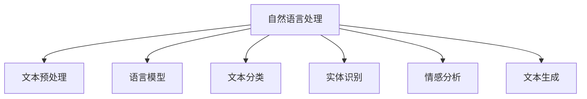

                 

# 电商平台中的自然语言处理应用实践

> 关键词：自然语言处理(NLP), 电子商务, 客户服务, 搜索推荐, 商品评价, 情感分析, 自动回复, 聊天机器人

## 1. 背景介绍

### 1.1 问题由来

随着电商平台的迅猛发展，如何更好地理解和满足用户需求，提升用户体验，成为了各大电商平台亟待解决的关键问题。传统的文本处理技术如关键词匹配、简单的文本分类等已难以应对用户输入的多样性和复杂性，自然语言处理(NLP)技术应运而生。NLP通过解析和理解用户的自然语言文本，可以帮助电商平台构建更为智能、个性化的交互体验。

### 1.2 问题核心关键点

电商平台中NLP技术的应用主要集中在以下几个方面：

1. **客户服务**：自动化处理用户咨询和投诉，提高服务效率和满意度。
2. **搜索推荐**：通过分析用户查询和评价，提供个性化的商品推荐。
3. **商品评价**：自动分析和生成商品评价，提升评价管理效率。
4. **情感分析**：分析用户情感倾向，指导产品优化和市场策略调整。
5. **自动回复**：构建智能聊天机器人，提升用户交互体验。

NLP技术在电商平台中的应用，不仅提高了运营效率，还增强了用户体验，为电商平台带来了显著的商业价值。

### 1.3 问题研究意义

研究电商平台中的NLP技术应用，对于提升电商平台的智能化水平，优化用户体验，加速电商行业的发展具有重要意义：

1. **提升服务效率**：自动化处理大量客户咨询，减轻人工客服压力，提高响应速度。
2. **个性化推荐**：通过理解用户需求，提供更符合用户兴趣的商品推荐，增加用户粘性。
3. **精准营销**：分析用户情感和评价，指导产品优化和市场营销策略，提升品牌形象。
4. **增强用户体验**：通过智能聊天机器人，提升用户交互体验，增强用户满意度。
5. **降低运营成本**：减少人工客服和内容审核成本，提高电商平台的盈利能力。

## 2. 核心概念与联系

### 2.1 核心概念概述

为更好地理解电商平台中的NLP应用，本节将介绍几个密切相关的核心概念：

- **自然语言处理(NLP)**：涉及语言模型的建立、语义理解、文本分类、实体识别、情感分析等技术。NLP通过解析和理解用户输入的文本信息，实现自动化的信息处理和决策。
- **文本预处理**：包括分词、去除停用词、词性标注等预处理步骤，为后续的模型训练和文本分析打下基础。
- **语言模型**：如LSTM、RNN、Transformer等，用于处理和生成文本，预测下一个词的概率分布。
- **文本分类**：将文本分为预定义的类别，如商品分类、情感分类等。
- **实体识别**：从文本中识别出人名、地名、机构名等实体，用于信息抽取和关系建模。
- **情感分析**：通过分析文本的情感倾向，判断用户对产品或服务的情感态度。
- **文本生成**：生成自然流畅的文本，如自动回复、商品描述等。

这些核心概念之间的逻辑关系可以通过以下Mermaid流程图来展示：



这个流程图展示了大语言模型中的核心概念及其之间的关系：

1. 自然语言处理通过解析和理解文本信息，实现自动化的信息处理和决策。
2. 文本预处理包括分词、去除停用词、词性标注等步骤，为后续的模型训练和文本分析打下基础。
3. 语言模型用于处理和生成文本，预测下一个词的概率分布。
4. 文本分类将文本分为预定义的类别，如商品分类、情感分类等。
5. 实体识别从文本中识别出人名、地名、机构名等实体，用于信息抽取和关系建模。
6. 情感分析通过分析文本的情感倾向，判断用户对产品或服务的情感态度。
7. 文本生成生成自然流畅的文本，如自动回复、商品描述等。

这些核心概念共同构成了电商平台中NLP技术的应用框架，使其能够实现从文本输入到决策输出的全流程自动化处理。

## 3. 核心算法原理 & 具体操作步骤
### 3.1 算法原理概述

电商平台中的NLP应用，主要以监督学习、非监督学习、半监督学习等方法为核心，通过训练模型对用户输入的文本信息进行处理和分析。以下是几个主要的算法原理：

- **监督学习**：通过标记好的文本数据集训练模型，使其能够识别和分类文本信息。常见的算法包括逻辑回归、支持向量机、神经网络等。
- **非监督学习**：在未标记的数据集上进行训练，通过聚类、降维等方法发现数据的内在结构。常见的算法包括K-means、LDA等。
- **半监督学习**：结合标记数据和未标记数据进行训练，通过使用少量标记数据和大量未标记数据，提升模型的泛化能力。常见的算法包括自训练、标签传播等。

这些算法在电商平台中的应用，主要集中在以下几个方面：

- **客户服务**：通过自动回复和智能聊天机器人，自动化处理用户咨询和投诉，提高服务效率和满意度。
- **搜索推荐**：通过分析用户查询和评价，提供个性化的商品推荐，增加用户粘性。
- **商品评价**：自动分析和生成商品评价，提升评价管理效率。
- **情感分析**：分析用户情感倾向，指导产品优化和市场策略调整。

### 3.2 算法步骤详解

以下是几个主要算法的详细步骤：

#### 3.2.1 监督学习算法

监督学习算法的步骤主要包括：

1. **数据准备**：收集和标注文本数据集，将文本分为训练集和测试集。
2. **模型选择**：选择合适的模型，如朴素贝叶斯、逻辑回归、支持向量机等。
3. **特征提取**：将文本转化为模型可以处理的特征，如TF-IDF、Word2Vec、BERT等。
4. **模型训练**：使用训练集对模型进行训练，调整模型参数，最小化损失函数。
5. **模型评估**：使用测试集对模型进行评估，计算模型的准确率、召回率、F1值等指标。
6. **模型部署**：将训练好的模型部署到实际应用中，处理用户输入的文本信息。

#### 3.2.2 非监督学习算法

非监督学习算法的步骤主要包括：

1. **数据准备**：收集未标记的文本数据集，将数据分为训练集和测试集。
2. **特征提取**：将文本转化为模型可以处理的特征，如TF-IDF、LDA等。
3. **模型训练**：使用训练集对模型进行训练，发现数据的内在结构，如聚类、降维等。
4. **模型评估**：使用测试集对模型进行评估，计算模型的准确率、召回率、F1值等指标。
5. **模型部署**：将训练好的模型部署到实际应用中，处理用户输入的文本信息。

#### 3.2.3 半监督学习算法

半监督学习算法的步骤主要包括：

1. **数据准备**：收集少量标记数据和大量未标记数据，将数据分为训练集和测试集。
2. **特征提取**：将文本转化为模型可以处理的特征，如TF-IDF、Word2Vec、BERT等。
3. **模型训练**：使用少量标记数据和大量未标记数据进行训练，调整模型参数，最小化损失函数。
4. **模型评估**：使用测试集对模型进行评估，计算模型的准确率、召回率、F1值等指标。
5. **模型部署**：将训练好的模型部署到实际应用中，处理用户输入的文本信息。

### 3.3 算法优缺点

电商平台中的NLP应用，主要以监督学习、非监督学习和半监督学习为核心，各有优缺点：

**监督学习**的优点在于：

- 可以处理分类问题，精度较高。
- 数据集容易获取，标注成本较低。

**监督学习**的缺点在于：

- 对标注数据依赖较大，标注成本高。
- 模型泛化能力有限，容易过拟合。

**非监督学习**的优点在于：

- 对标注数据依赖较小，无需标注数据。
- 可以发现数据的内在结构，提高模型的泛化能力。

**非监督学习**的缺点在于：

- 精度较低，无法处理分类问题。
- 需要选择合适的特征提取方法，复杂度较高。

**半监督学习**的优点在于：

- 结合标记数据和未标记数据，提升模型的泛化能力。
- 标记数据需求较少，标注成本较低。

**半监督学习**的缺点在于：

- 需要处理标记数据和未标记数据的融合，复杂度较高。
- 对特征提取方法的要求较高，需要选择合适的特征。

这些算法的优缺点需要根据具体场景进行选择和优化，以达到最佳的应用效果。

### 3.4 算法应用领域

电商平台中的NLP技术，主要应用于以下几个领域：

1. **客户服务**：自动化处理用户咨询和投诉，提高服务效率和满意度。
2. **搜索推荐**：通过分析用户查询和评价，提供个性化的商品推荐，增加用户粘性。
3. **商品评价**：自动分析和生成商品评价，提升评价管理效率。
4. **情感分析**：分析用户情感倾向，指导产品优化和市场策略调整。
5. **自动回复**：构建智能聊天机器人，提升用户交互体验。

这些领域的应用，展示了NLP技术在电商平台中的广泛适用性和重要价值。

## 4. 数学模型和公式 & 详细讲解  
### 4.1 数学模型构建

以情感分析为例，构建数学模型。假设文本表示为 $x$，情感标签表示为 $y$，模型参数为 $\theta$，则情感分析的数学模型为：

$$
P(y|x;\theta) = \frac{e^{\theta^T\phi(x)}}{\sum_{y'} e^{\theta^T\phi(x)}}
$$

其中，$\phi(x)$ 表示将文本 $x$ 转化为模型可以处理的特征，$\theta$ 表示模型参数。

### 4.2 公式推导过程

以逻辑回归为例，推导情感分析的数学模型。假设文本表示为 $x$，情感标签表示为 $y$，模型参数为 $\theta$，则逻辑回归的数学模型为：

$$
P(y|x;\theta) = \sigma(\theta^T\phi(x))
$$

其中，$\sigma(x)$ 表示sigmoid函数，$\phi(x)$ 表示将文本 $x$ 转化为模型可以处理的特征，$\theta$ 表示模型参数。

### 4.3 案例分析与讲解

以商品评价为例，假设评价文本表示为 $x$，评价情感表示为 $y$，模型参数为 $\theta$，则基于监督学习的情感分析模型可以表示为：

$$
P(y|x;\theta) = \frac{e^{\theta^T\phi(x)}}{\sum_{y'} e^{\theta^T\phi(x)}}
$$

其中，$\phi(x)$ 表示将文本 $x$ 转化为模型可以处理的特征，$\theta$ 表示模型参数。

训练过程中，使用交叉熵损失函数，计算模型的预测结果和实际结果之间的差异，更新模型参数：

$$
\mathcal{L}(\theta) = -\frac{1}{N}\sum_{i=1}^N [y_i\log P(y_i|x_i;\theta)+(1-y_i)\log(1-P(y_i|x_i;\theta))]
$$

通过优化算法，最小化损失函数 $\mathcal{L}(\theta)$，更新模型参数 $\theta$，使得模型预测的情感分类结果与实际结果一致。

## 5. 项目实践：代码实例和详细解释说明
### 5.1 开发环境搭建

在进行NLP项目实践前，我们需要准备好开发环境。以下是使用Python进行NLP开发的环境配置流程：

1. 安装Anaconda：从官网下载并安装Anaconda，用于创建独立的Python环境。

2. 创建并激活虚拟环境：
```bash
conda create -n nlp-env python=3.8 
conda activate nlp-env
```

3. 安装必要的依赖：
```bash
conda install numpy pandas scikit-learn matplotlib tqdm jupyter notebook ipython
```

4. 安装NLP工具包：
```bash
pip install nltk spacy transformers
```

5. 下载并配置语料库和模型：
```bash
python -m nltk.downloader punkt spacy英文语料库
python -m spacy download en_core_web_sm
```

完成上述步骤后，即可在`nlp-env`环境中开始NLP实践。

### 5.2 源代码详细实现

下面我们以情感分析任务为例，给出使用PyTorch和Transformers库进行NLP任务开发的PyTorch代码实现。

首先，定义情感分析任务的数据处理函数：

```python
from transformers import BertTokenizer
from torch.utils.data import Dataset
import torch

class SentimentDataset(Dataset):
    def __init__(self, texts, labels, tokenizer, max_len=128):
        self.texts = texts
        self.labels = labels
        self.tokenizer = tokenizer
        self.max_len = max_len
        
    def __len__(self):
        return len(self.texts)
    
    def __getitem__(self, item):
        text = self.texts[item]
        label = self.labels[item]
        
        encoding = self.tokenizer(text, return_tensors='pt', max_length=self.max_len, padding='max_length', truncation=True)
        input_ids = encoding['input_ids'][0]
        attention_mask = encoding['attention_mask'][0]
        
        # 对标签进行one-hot编码
        encoded_label = [0, 1][label]
        labels = torch.tensor(encoded_label, dtype=torch.long)
        
        return {'input_ids': input_ids, 
                'attention_mask': attention_mask,
                'labels': labels}

# 标签编码
label_to_id = {'positive': 1, 'negative': 0}
id_to_label = {v: k for k, v in label_to_id.items()}

# 创建dataset
tokenizer = BertTokenizer.from_pretrained('bert-base-cased')

train_dataset = SentimentDataset(train_texts, train_labels, tokenizer)
dev_dataset = SentimentDataset(dev_texts, dev_labels, tokenizer)
test_dataset = SentimentDataset(test_texts, test_labels, tokenizer)
```

然后，定义模型和优化器：

```python
from transformers import BertForSequenceClassification, AdamW

model = BertForSequenceClassification.from_pretrained('bert-base-cased', num_labels=len(label_to_id))

optimizer = AdamW(model.parameters(), lr=2e-5)
```

接着，定义训练和评估函数：

```python
from torch.utils.data import DataLoader
from tqdm import tqdm
from sklearn.metrics import classification_report

device = torch.device('cuda') if torch.cuda.is_available() else torch.device('cpu')
model.to(device)

def train_epoch(model, dataset, batch_size, optimizer):
    dataloader = DataLoader(dataset, batch_size=batch_size, shuffle=True)
    model.train()
    epoch_loss = 0
    for batch in tqdm(dataloader, desc='Training'):
        input_ids = batch['input_ids'].to(device)
        attention_mask = batch['attention_mask'].to(device)
        labels = batch['labels'].to(device)
        model.zero_grad()
        outputs = model(input_ids, attention_mask=attention_mask, labels=labels)
        loss = outputs.loss
        epoch_loss += loss.item()
        loss.backward()
        optimizer.step()
    return epoch_loss / len(dataloader)

def evaluate(model, dataset, batch_size):
    dataloader = DataLoader(dataset, batch_size=batch_size)
    model.eval()
    preds, labels = [], []
    with torch.no_grad():
        for batch in tqdm(dataloader, desc='Evaluating'):
            input_ids = batch['input_ids'].to(device)
            attention_mask = batch['attention_mask'].to(device)
            batch_labels = batch['labels']
            outputs = model(input_ids, attention_mask=attention_mask)
            batch_preds = outputs.logits.argmax(dim=1).to('cpu').tolist()
            batch_labels = batch_labels.to('cpu').tolist()
            for pred, label in zip(batch_preds, batch_labels):
                preds.append(pred)
                labels.append(label)
                
    print(classification_report(labels, preds))
```

最后，启动训练流程并在测试集上评估：

```python
epochs = 5
batch_size = 16

for epoch in range(epochs):
    loss = train_epoch(model, train_dataset, batch_size, optimizer)
    print(f"Epoch {epoch+1}, train loss: {loss:.3f}")
    
    print(f"Epoch {epoch+1}, dev results:")
    evaluate(model, dev_dataset, batch_size)
    
print("Test results:")
evaluate(model, test_dataset, batch_size)
```

以上就是使用PyTorch和Transformers库对BERT模型进行情感分析任务微调的完整代码实现。可以看到，得益于Transformers库的强大封装，我们可以用相对简洁的代码完成BERT模型的加载和微调。

### 5.3 代码解读与分析

让我们再详细解读一下关键代码的实现细节：

**SentimentDataset类**：
- `__init__`方法：初始化文本、标签、分词器等关键组件。
- `__len__`方法：返回数据集的样本数量。
- `__getitem__`方法：对单个样本进行处理，将文本输入编码为token ids，将标签进行one-hot编码，并对其进行定长padding，最终返回模型所需的输入。

**label_to_id和id_to_label字典**：
- 定义了标签与数字id之间的映射关系，用于将预测结果解码回真实的标签。

**训练和评估函数**：
- 使用PyTorch的DataLoader对数据集进行批次化加载，供模型训练和推理使用。
- 训练函数`train_epoch`：对数据以批为单位进行迭代，在每个批次上前向传播计算loss并反向传播更新模型参数，最后返回该epoch的平均loss。
- 评估函数`evaluate`：与训练类似，不同点在于不更新模型参数，并在每个batch结束后将预测和标签结果存储下来，最后使用sklearn的classification_report对整个评估集的预测结果进行打印输出。

**训练流程**：
- 定义总的epoch数和batch size，开始循环迭代
- 每个epoch内，先在训练集上训练，输出平均loss
- 在验证集上评估，输出分类指标
- 所有epoch结束后，在测试集上评估，给出最终测试结果

可以看到，PyTorch配合Transformers库使得BERT微调的代码实现变得简洁高效。开发者可以将更多精力放在数据处理、模型改进等高层逻辑上，而不必过多关注底层的实现细节。

当然，工业级的系统实现还需考虑更多因素，如模型的保存和部署、超参数的自动搜索、更灵活的任务适配层等。但核心的微调范式基本与此类似。

## 6. 实际应用场景
### 6.1 智能客服系统

基于NLP技术的智能客服系统，可以显著提高电商平台的客户服务效率和质量。传统的客服系统需要大量人力，响应时间长，容易产生疲劳和错误。而智能客服系统可以通过自然语言处理技术，自动化处理客户咨询和投诉，提升客户满意度和忠诚度。

在技术实现上，可以收集客服历史聊天记录，提取常见问题和答案，构建知识库。然后通过微调模型，使得模型能够理解用户输入的自然语言文本，并从知识库中匹配最合适的答案进行回复。对于无法匹配的情况，系统可以接入人工客服，形成人机协作的智能客服系统。

### 6.2 搜索推荐系统

搜索推荐系统是电商平台的重要组成部分，通过分析用户查询和评价，推荐符合用户兴趣的商品，提升用户体验和转化率。传统的关键词匹配算法难以处理复杂的查询意图，而基于NLP技术的推荐系统可以通过文本理解，更精准地匹配用户需求，提高推荐效果。

在具体实现中，可以收集用户查询和评价，提取其中的关键词和情感倾向，构建商品-文本矩阵。然后通过微调模型，使得模型能够根据用户输入的文本，预测用户对不同商品的兴趣程度，从而进行个性化推荐。

### 6.3 商品评价管理系统

商品评价管理系统是电商平台的重要功能之一，通过自动分析和生成商品评价，可以提升评价管理效率，减少人工审核成本。传统的评价管理系统需要人工审核，容易产生主观性和误差。而基于NLP技术的评价管理系统可以通过文本分类和情感分析，自动识别和分类用户评价，生成评价摘要和评分，提升评价管理效率和准确性。

在具体实现中，可以收集用户评价文本，提取其中的情感倾向和关键词，构建评价文本矩阵。然后通过微调模型，使得模型能够自动识别和分类用户评价，生成评价摘要和评分。

### 6.4 未来应用展望

随着NLP技术的不断进步，其在电商平台中的应用前景将更加广阔。

1. **个性化推荐**：通过深入理解用户需求，提供更符合用户兴趣的商品推荐，增加用户粘性。
2. **情感分析**：通过分析用户情感倾向，指导产品优化和市场策略调整，提升品牌形象。
3. **智能客服**：通过构建智能聊天机器人，提升用户交互体验，增强用户满意度。
4. **内容审核**：通过自然语言处理技术，自动识别和过滤不合法内容，提升平台内容安全。

## 7. 工具和资源推荐
### 7.1 学习资源推荐

为了帮助开发者系统掌握NLP技术的应用，这里推荐一些优质的学习资源：

1. 《自然语言处理综论》课程：斯坦福大学开设的NLP明星课程，涵盖NLP的基本概念和经典模型，适合初学者入门。
2. CS224N《深度学习自然语言处理》课程：斯坦福大学开设的NLP明星课程，有Lecture视频和配套作业，带你深入了解NLP的前沿技术。
3. 《自然语言处理与深度学习》书籍：Transformer库的作者所著，全面介绍了使用深度学习处理自然语言的基本方法和技术。
4. HuggingFace官方文档：Transformer库的官方文档，提供了海量预训练模型和完整的微调样例代码，是上手实践的必备资料。
5. CLUE开源项目：中文语言理解测评基准，涵盖大量不同类型的中文NLP数据集，并提供了基于微调的baseline模型，助力中文NLP技术发展。

通过对这些资源的学习实践，相信你一定能够快速掌握NLP技术的应用，并用于解决实际的NLP问题。

### 7.2 开发工具推荐

高效的开发离不开优秀的工具支持。以下是几款用于NLP开发常用的工具：

1. PyTorch：基于Python的开源深度学习框架，灵活动态的计算图，适合快速迭代研究。大部分预训练语言模型都有PyTorch版本的实现。
2. TensorFlow：由Google主导开发的开源深度学习框架，生产部署方便，适合大规模工程应用。同样有丰富的预训练语言模型资源。
3. Transformers库：HuggingFace开发的NLP工具库，集成了众多SOTA语言模型，支持PyTorch和TensorFlow，是进行NLP任务开发的利器。
4. Weights & Biases：模型训练的实验跟踪工具，可以记录和可视化模型训练过程中的各项指标，方便对比和调优。与主流深度学习框架无缝集成。
5. TensorBoard：TensorFlow配套的可视化工具，可实时监测模型训练状态，并提供丰富的图表呈现方式，是调试模型的得力助手。
6. Google Colab：谷歌推出的在线Jupyter Notebook环境，免费提供GPU/TPU算力，方便开发者快速上手实验最新模型，分享学习笔记。

合理利用这些工具，可以显著提升NLP任务的开发效率，加快创新迭代的步伐。

### 7.3 相关论文推荐

NLP技术的发展源于学界的持续研究。以下是几篇奠基性的相关论文，推荐阅读：

1. Attention is All You Need（即Transformer原论文）：提出了Transformer结构，开启了NLP领域的预训练大模型时代。
2. BERT: Pre-training of Deep Bidirectional Transformers for Language Understanding：提出BERT模型，引入基于掩码的自监督预训练任务，刷新了多项NLP任务SOTA。
3. Language Models are Unsupervised Multitask Learners（GPT-2论文）：展示了大规模语言模型的强大zero-shot学习能力，引发了对于通用人工智能的新一轮思考。
4. Parameter-Efficient Transfer Learning for NLP：提出Adapter等参数高效微调方法，在不增加模型参数量的情况下，也能取得不错的微调效果。
5. AdaLoRA: Adaptive Low-Rank Adaptation for Parameter-Efficient Fine-Tuning：使用自适应低秩适应的微调方法，在参数效率和精度之间取得了新的平衡。
6. Robust Pre-Training for NLP：提出基于对抗样本的预训练方法，增强模型的鲁棒性和泛化能力。

这些论文代表了大语言模型微调技术的发展脉络。通过学习这些前沿成果，可以帮助研究者把握学科前进方向，激发更多的创新灵感。

## 8. 总结：未来发展趋势与挑战

### 8.1 总结

本文对电商平台中的NLP技术应用进行了全面系统的介绍。首先阐述了NLP技术在电商平台中的应用背景和意义，明确了NLP技术在提升用户服务效率、个性化推荐、商品评价管理等方面的重要价值。其次，从原理到实践，详细讲解了监督学习、非监督学习和半监督学习等算法原理和操作步骤，给出了NLP任务开发的完整代码实现。同时，本文还广泛探讨了NLP技术在智能客服、搜索推荐、商品评价等多个电商应用场景中的实际应用，展示了NLP技术在电商平台中的广泛适用性和重要价值。

通过本文的系统梳理，可以看到，NLP技术在电商平台中的应用已经取得了显著的效果，未来仍有巨大的发展潜力。NLP技术有望成为电商平台上不可或缺的重要组件，为电商平台带来更高的智能化水平和用户体验。

### 8.2 未来发展趋势

展望未来，NLP技术在电商平台中的应用将呈现以下几个发展趋势：

1. **个性化推荐**：通过深入理解用户需求，提供更符合用户兴趣的商品推荐，增加用户粘性。
2. **情感分析**：通过分析用户情感倾向，指导产品优化和市场策略调整，提升品牌形象。
3. **智能客服**：通过构建智能聊天机器人，提升用户交互体验，增强用户满意度。
4. **内容审核**：通过自然语言处理技术，自动识别和过滤不合法内容，提升平台内容安全。
5. **跨语言处理**：随着全球化电商的兴起，跨语言处理能力将成为电商平台的重要需求。

以上趋势凸显了NLP技术在电商平台中的广阔前景。这些方向的探索发展，必将进一步提升电商平台的智能化水平，优化用户体验，加速电商行业的发展。

### 8.3 面临的挑战

尽管NLP技术在电商平台中的应用已经取得了显著的效果，但在迈向更加智能化、普适化应用的过程中，仍面临诸多挑战：

1. **标注数据依赖**：传统的NLP任务通常依赖大量标注数据，而标注数据获取和维护成本较高。如何在少量标注数据的情况下，仍然获得较好的NLP效果，是一个重要研究方向。
2. **模型泛化能力**：NLP模型在不同领域和场景下的泛化能力有限，对于非结构化数据和噪声数据的适应能力较弱。如何提升模型的泛化能力，是一个亟待解决的问题。
3. **计算资源消耗**：NLP任务通常需要较大的计算资源，特别是在大模型微调的情况下，计算资源消耗较大。如何优化模型结构，减少计算资源消耗，是一个重要的研究方向。
4. **用户隐私保护**：NLP技术需要处理大量用户隐私数据，如何在保护用户隐私的前提下，利用这些数据进行NLP模型训练和应用，是一个重要研究课题。
5. **模型鲁棒性**：NLP模型在面对异常输入和对抗样本时，容易产生误判。如何提高模型的鲁棒性，减少误判，是一个重要的研究方向。

这些挑战需要进一步的研究和探索，只有不断突破这些瓶颈，NLP技术才能在电商平台中发挥更大的作用，为电商行业带来更大的商业价值。

### 8.4 研究展望

面对NLP技术在电商平台中面临的挑战，未来的研究需要在以下几个方面寻求新的突破：

1. **无监督和半监督学习**：摆脱对大规模标注数据的依赖，利用自监督学习、主动学习等无监督和半监督范式，最大限度利用非结构化数据，实现更加灵活高效的NLP模型。
2. **参数高效微调**：开发更加参数高效的NLP微调方法，在固定大部分预训练参数的情况下，只更新极少量的任务相关参数。同时优化模型计算图，减少前向传播和反向传播的资源消耗，实现更加轻量级、实时性的部署。
3. **模型结构优化**：通过优化模型结构，减少计算资源消耗，提高模型的计算效率和推理速度。如使用轻量级模型、模型压缩、剪枝等技术。
4. **用户隐私保护**：研究如何在保护用户隐私的前提下，利用NLP技术进行数据处理和分析，提升平台数据安全性。
5. **模型鲁棒性增强**：通过引入对抗训练、鲁棒性优化等技术，提高NLP模型的鲁棒性和泛化能力，减少模型在面对异常输入和对抗样本时的误判。

这些研究方向的探索，必将引领NLP技术在电商平台中迈向更高的台阶，为电商行业带来更高的智能化水平和用户体验。

## 9. 附录：常见问题与解答

**Q1：在NLP任务中，如何选择最优的模型和算法？**

A: 选择最优的模型和算法需要考虑以下几个方面：

1. **任务类型**：不同类型的NLP任务需要不同的模型和算法。例如，情感分析通常使用逻辑回归、SVM等分类算法；机器翻译通常使用Seq2Seq模型和Transformer模型。
2. **数据规模**：数据规模较大时，使用深度学习模型可以获得更好的效果。数据规模较小时，可以使用简单的机器学习算法。
3. **计算资源**：计算资源丰富时，可以使用大模型进行微调；计算资源有限时，可以使用轻量级模型进行快速迭代。
4. **模型复杂度**：模型复杂度较高时，需要更多的计算资源进行训练和推理。模型复杂度较低时，训练和推理速度较快。

因此，选择最优的模型和算法需要综合考虑任务类型、数据规模、计算资源和模型复杂度等因素。

**Q2：在NLP任务中，如何进行数据预处理？**

A: 数据预处理是NLP任务中的重要环节，包括以下几个步骤：

1. **分词**：将文本分解为单词或词语，为后续的特征提取和模型训练做准备。
2. **去除停用词**：去除常用的停用词，如“的”、“是”等，减少噪音。
3. **词性标注**：为每个词语标注其词性，如名词、动词等，提高模型的语义理解能力。
4. **特征提取**：将文本转化为模型可以处理的特征，如TF-IDF、Word2Vec、BERT等。

这些预处理步骤可以提高模型的训练效率和效果，使得模型更容易理解用户输入的自然语言文本。

**Q3：在NLP任务中，如何进行模型训练？**

A: 模型训练通常包括以下几个步骤：

1. **数据划分**：将数据集分为训练集、验证集和测试集，用于模型训练、调参和评估。
2. **模型选择**：选择合适的模型，如朴素贝叶斯、逻辑回归、支持向量机等。
3. **特征提取**：将文本转化为模型可以处理的特征，如TF-IDF、Word2Vec、BERT等。
4. **模型训练**：使用训练集对模型进行训练，调整模型参数，最小化损失函数。
5. **模型评估**：使用验证集对模型进行评估，计算模型的准确率、召回率、F1值等指标。
6. **模型优化**：根据评估结果，调整模型参数，优化模型性能。
7. **模型部署**：将训练好的模型部署到实际应用中，处理用户输入的文本信息。

通过这些步骤，可以训练出性能优秀的NLP模型，应用于实际任务中。

**Q4：在NLP任务中，如何进行模型评估？**

A: 模型评估通常包括以下几个步骤：

1. **数据划分**：将数据集分为训练集、验证集和测试集，用于模型训练、调参和评估。
2. **模型选择**：选择合适的模型，如朴素贝叶斯、逻辑回归、支持向量机等。
3. **特征提取**：将文本转化为模型可以处理的特征，如TF-IDF、Word2Vec、BERT等。
4. **模型评估**：使用测试集对模型进行评估，计算模型的准确率、召回率、F1值等指标。
5. **模型优化**：根据评估结果，调整模型参数，优化模型性能。
6. **模型部署**：将训练好的模型部署到实际应用中，处理用户输入的文本信息。

通过这些步骤，可以评估模型的性能，判断模型是否适用于实际任务。

---

作者：禅与计算机程序设计艺术 / Zen and the Art of Computer Programming

