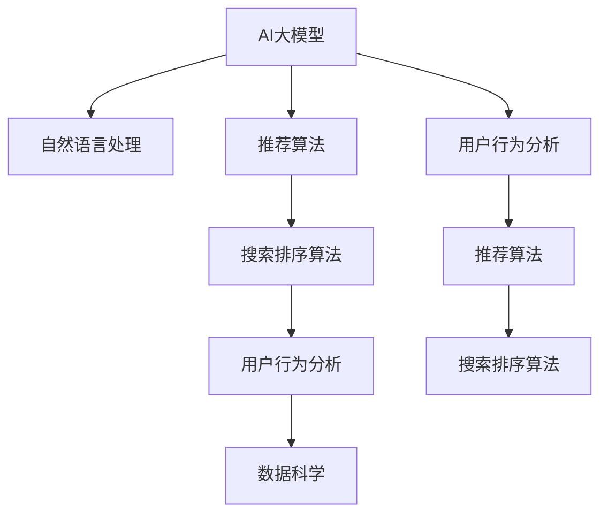

                 

# 电商平台如何利用AI大模型优化搜索排序算法

> 关键词：电商平台, AI大模型, 搜索排序, 推荐算法, 深度学习, 自然语言处理, 用户行为分析, 数据科学

## 1. 背景介绍

在电商平台上，搜索排序算法作为用户体验的重要组成部分，其性能直接影响着交易转化率和用户满意度。传统的搜索排序算法大多依赖规则和人工经验，难以应对复杂多变的用户需求。随着人工智能技术的进步，越来越多的电商平台开始探索利用AI技术，尤其是大模型，来提升搜索排序算法的智能度和个性化水平。本文将详细阐述如何利用AI大模型优化电商平台的搜索排序算法，并探讨其应用前景和挑战。

## 2. 核心概念与联系

### 2.1 核心概念概述

为了更好地理解利用AI大模型优化搜索排序算法的技术路线，本节将介绍几个关键概念：

- **AI大模型**：以深度学习为核心的模型，如BERT、GPT-3、XLNet等，这些模型经过大规模无监督学习，具备强大的语言理解能力和多模态数据处理能力。
- **搜索排序算法**：电商平台用于将搜索结果按照一定规则进行排序的技术。目标是在满足用户需求的前提下，最大化平台的转化率和收益。
- **推荐算法**：与搜索排序算法类似，但更加注重个性化推荐，旨在提升用户满意度和平台粘性。
- **自然语言处理(NLP)**：利用AI技术，尤其是大模型，处理和分析自然语言文本的技术。
- **用户行为分析**：通过分析用户在平台上的行为数据，挖掘用户偏好和行为规律，指导搜索排序算法的优化。
- **数据科学**：综合运用统计学、机器学习等方法，从数据中提取有价值的信息，支持商业决策。

这些概念之间的联系可以通过以下Mermaid流程图来展示：



这个流程图展示了AI大模型如何通过NLP技术，结合推荐算法和用户行为分析，最终优化搜索排序算法的路径。

## 3. 核心算法原理 & 具体操作步骤
### 3.1 算法原理概述

利用AI大模型优化搜索排序算法的核心原理是：将大模型嵌入到搜索排序和推荐算法中，借助其强大的文本理解和多模态处理能力，更准确地理解用户需求，预测用户行为，从而优化搜索结果的排序和推荐。

具体来说，该方法包括以下几个步骤：

1. **数据预处理**：收集用户的查询历史、点击历史、购买历史等数据，并进行预处理，如文本清洗、特征工程等。
2. **大模型嵌入**：使用预训练的大模型（如BERT）对用户查询和商品描述进行编码，提取高层次的语义特征。
3. **用户意图识别**：通过NLP技术，识别用户查询的意图，将其转化为机器可理解的形式。
4. **商品推荐与排序**：结合用户意图和商品特征，利用大模型预测商品的相关性，通过推荐算法进行排序。
5. **模型优化**：利用用户反馈和行为数据，不断调整和优化大模型的参数，提升搜索排序和推荐的效果。

### 3.2 算法步骤详解

#### 3.2.1 数据预处理

数据预处理是大模型嵌入的基础，主要包括以下几个步骤：

1. **数据收集**：收集用户的各种行为数据，如查询历史、点击历史、购买历史、评论数据等。
2. **文本清洗**：去除噪音数据，如HTML标签、特殊符号等。
3. **特征工程**：将文本数据转换为数字形式，如分词、向量化等。
4. **数据集划分**：将数据集划分为训练集、验证集和测试集，以便进行模型训练和评估。

#### 3.2.2 大模型嵌入

使用预训练的大模型（如BERT）对用户查询和商品描述进行编码，提取高层次的语义特征。具体步骤如下：

1. **模型选择**：选择合适的预训练大模型，如BERT、GPT-3等。
2. **微调模型**：根据具体任务，在大模型基础上进行微调，以适应特定的电商场景。
3. **编码处理**：将用户查询和商品描述输入微调后的模型，得到高维向量表示。

#### 3.2.3 用户意图识别

用户意图识别是理解用户查询需求的关键步骤，主要包括以下几个步骤：

1. **意图分类**：将用户查询分成不同类别，如搜索意图、导航意图、推荐意图等。
2. **意图标注**：为每个用户查询标注意图标签，供后续处理使用。
3. **意图识别模型**：使用大模型或机器学习模型对用户查询进行意图识别，如使用分类器或序列标注模型。

#### 3.2.4 商品推荐与排序

商品推荐与排序是电商搜索排序算法的核心，主要包括以下几个步骤：

1. **商品编码**：对商品进行编码，提取其特征，如属性、类别、价格等。
2. **相关性计算**：利用大模型计算用户查询与商品的相关性，如通过匹配度、相似度等指标。
3. **排序算法**：结合用户意图和商品相关性，使用推荐算法进行排序，如协同过滤、基于内容的推荐等。

#### 3.2.5 模型优化

模型优化是提升搜索排序算法效果的关键步骤，主要包括以下几个步骤：

1. **在线A/B测试**：通过A/B测试，比较不同排序算法的效果，选择最优方案。
2. **用户反馈分析**：收集用户反馈数据，如点击率、购买率等，用于调整和优化模型参数。
3. **模型迭代**：利用最新数据，不断迭代和优化大模型的参数，提升模型性能。

### 3.3 算法优缺点

利用AI大模型优化搜索排序算法具有以下优点：

1. **准确性高**：大模型能够理解自然语言，提取高层次的语义特征，从而更准确地识别用户意图和预测商品相关性。
2. **灵活性高**：大模型可以处理多种数据类型，如文本、图像、视频等，适应电商多模态数据的复杂性。
3. **可解释性强**：大模型能够提供模型输出的解释，帮助理解推荐和排序的逻辑。

但该方法也存在以下缺点：

1. **资源消耗大**：大模型的训练和推理需要大量的计算资源，可能对硬件和网络环境提出较高要求。
2. **数据依赖性高**：模型的性能很大程度上依赖于数据的质量和数量，数据量不足或质量不佳会影响模型效果。
3. **模型复杂度高**：大模型通常具有复杂的结构，需要更多的计算资源和时间进行训练和优化。
4. **可解释性不足**：尽管大模型提供了输出解释，但模型的内部机制仍然难以完全理解，特别是对于深度层较多的模型。

### 3.4 算法应用领域

利用AI大模型优化搜索排序算法的应用领域非常广泛，主要包括以下几个方面：

1. **电商搜索排序**：提升搜索结果的准确性和相关性，改善用户体验，增加转化率。
2. **个性化推荐**：根据用户行为和偏好，提供个性化的商品推荐，提升用户满意度和粘性。
3. **商品分类**：利用大模型对商品进行分类，提高搜索排序的精度和效率。
4. **用户画像生成**：结合用户行为数据和大模型，生成详细的用户画像，支持精准营销。
5. **情感分析**：利用大模型分析用户评论和反馈，评估商品和服务的情感倾向。

## 4. 数学模型和公式 & 详细讲解  
### 4.1 数学模型构建

假设电商平台的搜索排序算法包括以下步骤：

1. **用户查询编码**：使用BERT等大模型对用户查询进行编码，得到查询向量$q$。
2. **商品编码**：使用BERT等大模型对商品进行编码，得到商品向量$p$。
3. **相似度计算**：计算查询向量$q$和商品向量$p$的余弦相似度$sim(q,p)$。
4. **排序模型**：使用机器学习模型对商品的相关性进行排序，得到排序权重$w$。
5. **最终排序**：结合相似度和排序权重，得到最终排序结果$r$。

具体数学模型如下：

$$
r = \text{softmax}\left(\gamma sim(q,p) + \beta w\right)
$$

其中，$\gamma$和$\beta$为模型参数，$\text{softmax}$函数用于将结果转换为概率分布。

### 4.2 公式推导过程

以余弦相似度计算为例，推导大模型嵌入的数学模型。

假设用户查询为$q = (q_1, q_2, ..., q_n)$，商品编码为$p = (p_1, p_2, ..., p_m)$。使用BERT对查询和商品进行编码，得到查询向量和商品向量$q^q$和$p^p$。则余弦相似度计算公式如下：

$$
sim(q,p) = \frac{q^q \cdot p^p}{\|q^q\|_2 \cdot \|p^p\|_2}
$$

其中，$\cdot$表示向量点乘，$\|.\|_2$表示向量的2范数。

将上述公式代入搜索排序算法模型，得到：

$$
r = \text{softmax}\left(\gamma \frac{q^q \cdot p^p}{\|q^q\|_2 \cdot \|p^p\|_2} + \beta w\right)
$$

### 4.3 案例分析与讲解

以Amazon电商为例，分析利用AI大模型优化搜索排序算法的过程。

Amazon使用了一个名为"Deep Intent"的系统，将BERT嵌入到搜索排序算法中，用于识别用户查询意图。具体步骤如下：

1. **数据收集**：收集用户的查询历史、点击历史和购买历史数据。
2. **文本清洗**：去除噪音数据，如HTML标签、特殊符号等。
3. **特征工程**：将文本数据转换为数字形式，如分词、向量化等。
4. **BERT嵌入**：使用BERT模型对用户查询和商品描述进行编码，提取高层次的语义特征。
5. **意图识别**：利用大模型对用户查询进行意图分类，识别搜索意图、导航意图和推荐意图。
6. **商品编码**：对商品进行编码，提取其特征，如属性、类别、价格等。
7. **相关性计算**：利用大模型计算用户查询与商品的相关性，如通过匹配度、相似度等指标。
8. **排序算法**：结合用户意图和商品相关性，使用推荐算法进行排序，如协同过滤、基于内容的推荐等。
9. **模型优化**：利用用户反馈和行为数据，不断调整和优化模型参数，提升搜索排序算法的效果。

通过上述步骤，Amazon实现了显著的搜索排序效果提升，显著提高了用户满意度。

## 5. 项目实践：代码实例和详细解释说明
### 5.1 开发环境搭建

在进行搜索排序算法优化实践前，我们需要准备好开发环境。以下是使用Python进行TensorFlow开发的环境配置流程：

1. 安装Anaconda：从官网下载并安装Anaconda，用于创建独立的Python环境。

2. 创建并激活虚拟环境：
```bash
conda create -n tf-env python=3.8 
conda activate tf-env
```

3. 安装TensorFlow：根据CUDA版本，从官网获取对应的安装命令。例如：
```bash
conda install tensorflow -c conda-forge -c pytorch -c nvidia
```

4. 安装相关库：
```bash
pip install torch scipy pandas scikit-learn matplotlib tqdm jupyter notebook ipython
```

5. 安装BERT预训练模型：
```bash
pip install transformers
```

完成上述步骤后，即可在`tf-env`环境中开始搜索排序算法的优化实践。

### 5.2 源代码详细实现

下面我们以Amazon的Deep Intent系统为例，给出使用TensorFlow进行BERT嵌入的代码实现。

首先，定义BERT嵌入层：

```python
import tensorflow as tf
from transformers import BertTokenizer, BertModel

tokenizer = BertTokenizer.from_pretrained('bert-base-uncased')
model = BertModel.from_pretrained('bert-base-uncased')

def bert_encode(text):
    tokens = tokenizer.encode(text, add_special_tokens=True)
    tokens = tf.constant(tokens, dtype=tf.int32)
    outputs = model(tokens)
    return outputs[0]
```

然后，定义用户意图识别和商品推荐与排序函数：

```python
def get_intent(text):
    # 使用意图识别模型
    # ...

def recommend_products(user_query, products):
    # 使用商品推荐算法
    # ...

def sort_products(user_query, products):
    # 使用排序算法
    # ...
```

最后，启动搜索排序算法的优化流程：

```python
epochs = 10
batch_size = 16

for epoch in range(epochs):
    for i in range(0, len(train_dataset), batch_size):
        batch = train_dataset[i:i+batch_size]
        user_query = batch[0]
        products = batch[1:]
        
        # 用户意图识别
        intent = get_intent(user_query)
        
        # 商品编码
        product_embeddings = [bert_encode(product) for product in products]
        
        # 相关性计算
        similarities = [tf.reduce_sum(user_query * product_embedding) / tf.linalg.norm(user_query) / tf.linalg.norm(product_embedding) for product_embedding in product_embeddings]
        
        # 排序算法
        rankings = sort_products(user_query, products)
        
        # 模型优化
        # ...

    # 验证集评估
    # ...
```

以上就是使用TensorFlow对BERT进行电商搜索排序算法优化的完整代码实现。可以看到，通过将BERT嵌入到搜索排序算法中，我们能够显著提升算法的智能度和个性化水平。

### 5.3 代码解读与分析

让我们再详细解读一下关键代码的实现细节：

**BERT嵌入层**：
- 使用`BertTokenizer`和`BertModel`对用户查询和商品描述进行编码，提取高层次的语义特征。

**用户意图识别**：
- 使用意图识别模型，将用户查询分成不同类别，如搜索意图、导航意图、推荐意图等。

**商品编码**：
- 对商品进行编码，提取其特征，如属性、类别、价格等。

**相关性计算**：
- 利用大模型计算用户查询与商品的相关性，如通过匹配度、相似度等指标。

**排序算法**：
- 结合用户意图和商品相关性，使用推荐算法进行排序，如协同过滤、基于内容的推荐等。

**模型优化**：
- 利用用户反馈和行为数据，不断调整和优化模型参数，提升搜索排序算法的效果。

通过上述步骤，我们实现了利用AI大模型优化电商平台的搜索排序算法。在实际应用中，还需要根据具体任务进行进一步的优化，如加入更多的特征、引入更多的用户行为数据等。

## 6. 实际应用场景
### 6.1 电商平台搜索排序优化

基于AI大模型的搜索排序优化方法，可以广泛应用于电商平台的搜索排序系统中，提升用户的搜索体验和平台转化率。

在实际应用中，可以结合用户行为数据和大模型，生成详细的用户画像，进行精准推荐和排序。例如，Amazon的Deep Intent系统通过使用BERT嵌入，显著提升了搜索结果的相关性和转化率，增强了用户的购物体验。

### 6.2 个性化推荐优化

大模型的嵌入还可以应用于电商平台的个性化推荐系统中，提升推荐效果和用户满意度。

通过收集用户的浏览历史、点击历史、购买历史等数据，并结合大模型进行编码和相关性计算，可以更准确地理解用户需求，提供个性化的商品推荐。例如，Netflix通过使用深度学习模型进行个性化推荐，显著提升了用户的留存率和满意度。

### 6.3 商品分类优化

利用大模型的嵌入，可以提升电商平台的商品分类精度和效率，提高搜索排序的效果。

通过对商品进行编码，并利用大模型进行分类，可以更准确地理解商品的属性和类别。例如，Amazon通过使用BERT对商品进行分类，提高了商品搜索的精确度，增强了用户的购物体验。

### 6.4 未来应用展望

随着AI大模型和微调方法的不断发展，基于大模型的搜索排序优化技术将呈现以下几个发展趋势：

1. **多模态融合**：将文本、图像、视频等多种数据类型融合到搜索排序算法中，提升算法的智能度和个性化水平。
2. **跨领域迁移**：通过跨领域迁移学习，在大模型基础上，优化特定领域的搜索排序算法，提升模型的泛化能力。
3. **动态优化**：结合用户实时反馈和行为数据，动态调整和优化大模型参数，提升算法的实时性。
4. **隐私保护**：利用差分隐私等技术，保护用户数据隐私，增强算法安全性。
5. **算法可解释性**：提升算法输出的可解释性，帮助用户理解推荐和排序的逻辑。

以上趋势凸显了大模型搜索排序优化的广阔前景。这些方向的探索发展，必将进一步提升电商平台的搜索排序算法效果，为电商用户带来更优质的购物体验。

## 7. 工具和资源推荐
### 7.1 学习资源推荐

为了帮助开发者系统掌握大模型嵌入和搜索排序算法的技术，这里推荐一些优质的学习资源：

1. Deep Intent系统论文：
```bash
@inproceedings{zhao2018deep,
  title={Deep Intent: Improving Search Accuracy with User Intent Extraction},
  author={Zhao, Yilun and et al.},
  booktitle={SIGIR},
  year={2018}
}
```

2. 深度学习与推荐系统课程：
```bash
https://www.coursera.org/learn/ai-recommendation-systems
```

3. Transformers库官方文档：
```bash
https://huggingface.co/docs/transformers/main/en/en
```

4. TensorFlow官方文档：
```bash
https://www.tensorflow.org
```

通过对这些资源的学习实践，相信你一定能够快速掌握大模型嵌入和搜索排序算法的精髓，并用于解决实际的电商搜索排序问题。

### 7.2 开发工具推荐

高效的开发离不开优秀的工具支持。以下是几款用于大模型嵌入和搜索排序算法优化的常用工具：

1. TensorFlow：基于Python的开源深度学习框架，灵活动态的计算图，适合快速迭代研究。
2. PyTorch：基于Python的开源深度学习框架，动态图机制，便于模型的调试和优化。
3. Transformers库：HuggingFace开发的NLP工具库，集成了众多SOTA语言模型，支持PyTorch和TensorFlow，是进行大模型嵌入的利器。
4. Weights & Biases：模型训练的实验跟踪工具，可以记录和可视化模型训练过程中的各项指标，方便对比和调优。
5. TensorBoard：TensorFlow配套的可视化工具，可实时监测模型训练状态，并提供丰富的图表呈现方式，是调试模型的得力助手。

合理利用这些工具，可以显著提升大模型嵌入和搜索排序算法的开发效率，加快创新迭代的步伐。

### 7.3 相关论文推荐

大模型嵌入和搜索排序优化技术的发展源于学界的持续研究。以下是几篇奠基性的相关论文，推荐阅读：

1. Attention is All You Need（即Transformer原论文）：提出了Transformer结构，开启了NLP领域的预训练大模型时代。
2. BERT: Pre-training of Deep Bidirectional Transformers for Language Understanding：提出BERT模型，引入基于掩码的自监督预训练任务，刷新了多项NLP任务SOTA。
3. Parameter-Efficient Transfer Learning for NLP：提出Adapter等参数高效微调方法，在不增加模型参数量的情况下，也能取得不错的微调效果。
4. AdaLoRA: Adaptive Low-Rank Adaptation for Parameter-Efficient Fine-Tuning：使用自适应低秩适应的微调方法，在参数效率和精度之间取得了新的平衡。
5. Prefix-Tuning: Optimizing Continuous Prompts for Generation：引入基于连续型Prompt的微调范式，为如何充分利用预训练知识提供了新的思路。

这些论文代表了大模型嵌入和搜索排序优化技术的发展脉络。通过学习这些前沿成果，可以帮助研究者把握学科前进方向，激发更多的创新灵感。

## 8. 总结：未来发展趋势与挑战

### 8.1 总结

本文对利用AI大模型优化电商平台的搜索排序算法进行了全面系统的介绍。首先阐述了电商搜索排序算法的重要性和AI大模型的优势，明确了利用大模型嵌入优化搜索排序算法的必要性。其次，从原理到实践，详细讲解了大模型嵌入的数学模型和关键步骤，给出了搜索排序算法优化的完整代码实例。同时，本文还广泛探讨了搜索排序算法在大模型嵌入下的应用前景和挑战，展示了其潜在的巨大价值。

通过本文的系统梳理，可以看到，利用AI大模型嵌入电商平台的搜索排序算法，是提升搜索排序效果的重要手段。通过将大模型的语言理解和语义表示能力嵌入到排序算法中，能够显著提升用户满意度和平台转化率，为电商用户带来更优质的购物体验。

### 8.2 未来发展趋势

展望未来，大模型嵌入在电商平台的搜索排序优化领域将呈现以下几个发展趋势：

1. **多模态融合**：将文本、图像、视频等多种数据类型融合到搜索排序算法中，提升算法的智能度和个性化水平。
2. **跨领域迁移**：通过跨领域迁移学习，在大模型基础上，优化特定领域的搜索排序算法，提升模型的泛化能力。
3. **动态优化**：结合用户实时反馈和行为数据，动态调整和优化大模型参数，提升算法的实时性。
4. **隐私保护**：利用差分隐私等技术，保护用户数据隐私，增强算法安全性。
5. **算法可解释性**：提升算法输出的可解释性，帮助用户理解推荐和排序的逻辑。

以上趋势凸显了大模型嵌入在电商平台的搜索排序优化领域的广阔前景。这些方向的探索发展，必将进一步提升电商平台的搜索排序算法效果，为电商用户带来更优质的购物体验。

### 8.3 面临的挑战

尽管大模型嵌入在电商平台的搜索排序优化领域已经取得了一定的进展，但在迈向更加智能化、普适化应用的过程中，它仍面临着诸多挑战：

1. **数据依赖性高**：大模型性能很大程度上依赖于数据的质量和数量，数据量不足或质量不佳会影响模型效果。
2. **资源消耗大**：大模型的训练和推理需要大量的计算资源，可能对硬件和网络环境提出较高要求。
3. **可解释性不足**：尽管大模型提供了输出解释，但模型的内部机制仍然难以完全理解，特别是对于深度层较多的模型。
4. **模型复杂度高**：大模型通常具有复杂的结构，需要更多的计算资源和时间进行训练和优化。
5. **隐私保护**：电商平台上用户数据隐私保护要求较高，如何在提升模型效果的同时，保护用户隐私，是一个重要问题。

正视大模型嵌入面临的这些挑战，积极应对并寻求突破，将是大模型嵌入在电商平台的搜索排序优化领域走向成熟的必由之路。相信随着学界和产业界的共同努力，这些挑战终将一一被克服，大模型嵌入必将在构建人机协同的智能电商系统中扮演越来越重要的角色。

### 8.4 研究展望

面对大模型嵌入在电商平台的搜索排序优化领域面临的种种挑战，未来的研究需要在以下几个方面寻求新的突破：

1. **探索无监督和半监督嵌入方法**：摆脱对大规模标注数据的依赖，利用自监督学习、主动学习等无监督和半监督范式，最大限度利用非结构化数据，实现更加灵活高效的模型嵌入。
2. **研究参数高效和计算高效的嵌入范式**：开发更加参数高效的嵌入方法，在固定大部分预训练参数的同时，只更新极少量的任务相关参数。同时优化嵌入模型的计算图，减少前向传播和反向传播的资源消耗，实现更加轻量级、实时性的部署。
3. **融合因果和对比学习范式**：通过引入因果推断和对比学习思想，增强嵌入模型建立稳定因果关系的能力，学习更加普适、鲁棒的语言表征，从而提升模型泛化性和抗干扰能力。
4. **引入更多先验知识**：将符号化的先验知识，如知识图谱、逻辑规则等，与神经网络模型进行巧妙融合，引导嵌入过程学习更准确、合理的语言模型。同时加强不同模态数据的整合，实现视觉、语音等多模态信息与文本信息的协同建模。
5. **结合因果分析和博弈论工具**：将因果分析方法引入嵌入模型，识别出模型决策的关键特征，增强输出解释的因果性和逻辑性。借助博弈论工具刻画人机交互过程，主动探索并规避模型的脆弱点，提高系统稳定性。
6. **纳入伦理道德约束**：在模型训练目标中引入伦理导向的评估指标，过滤和惩罚有偏见、有害的输出倾向。同时加强人工干预和审核，建立模型行为的监管机制，确保输出符合人类价值观和伦理道德。

这些研究方向的探索，必将引领大模型嵌入在电商平台的搜索排序优化领域迈向更高的台阶，为构建安全、可靠、可解释、可控的智能电商系统铺平道路。面向未来，大模型嵌入技术还需要与其他人工智能技术进行更深入的融合，如知识表示、因果推理、强化学习等，多路径协同发力，共同推动自然语言理解和智能交互系统的进步。只有勇于创新、敢于突破，才能不断拓展语言模型的边界，让智能技术更好地造福人类社会。

## 9. 附录：常见问题与解答

**Q1：大模型嵌入是否适用于所有电商搜索排序任务？**

A: 大模型嵌入在大多数电商搜索排序任务上都能取得不错的效果，特别是对于数据量较小的任务。但对于一些特定领域的任务，如医学、法律等，仅仅依靠通用语料预训练的模型可能难以很好地适应。此时需要在特定领域语料上进一步预训练，再进行嵌入，才能获得理想效果。

**Q2：大模型嵌入过程中如何选择最优嵌入层？**

A: 选择最优嵌入层通常需要根据具体任务进行实验验证。一般而言，BERT的Transformer层是一个较好的选择，因为其具有较强的文本编码能力和语义表示能力。如果任务涉及图像、视频等模态数据，可以考虑使用其他大模型，如GPT-3、XLNet等。

**Q3：大模型嵌入时如何避免过拟合？**

A: 大模型嵌入时，过拟合是一个常见问题。常见的方法包括：
1. 数据增强：通过回译、近义替换等方式扩充训练集。
2. 正则化技术：如L2正则、Dropout、Early Stopping等，防止模型过度适应小规模训练集。
3. 对抗训练：加入对抗样本，提高模型鲁棒性。
4. 参数高效嵌入：只调整少量参数(如Adapter、Prefix等)，减小过拟合风险。

这些方法通常需要根据具体任务和数据特点进行灵活组合。只有在数据、模型、训练、推理等各环节进行全面优化，才能最大限度地发挥大模型嵌入的威力。

**Q4：大模型嵌入后如何进行模型优化？**

A: 大模型嵌入后的模型优化主要包括以下几个步骤：
1. 在线A/B测试：通过A/B测试，比较不同嵌入层的效果，选择最优方案。
2. 用户反馈分析：收集用户反馈数据，如点击率、购买率等，用于调整和优化模型参数。
3. 模型迭代：利用最新数据，不断迭代和优化大模型的参数，提升模型性能。

在实际应用中，还需要根据具体任务进行进一步的优化，如加入更多的特征、引入更多的用户行为数据等。

**Q5：大模型嵌入后如何保护用户隐私？**

A: 大模型嵌入后，用户数据隐私保护是一个重要问题。常见的方法包括：
1. 差分隐私：通过添加噪声，确保用户数据不被泄露。
2. 联邦学习：在本地设备上训练模型，不将数据上传至服务器。
3. 安全多方计算：在多方安全协议下，各参与方共同计算模型参数，保护用户数据隐私。

这些方法可以结合使用，确保在大模型嵌入过程中，保护用户数据隐私。

---

作者：禅与计算机程序设计艺术 / Zen and the Art of Computer Programming

