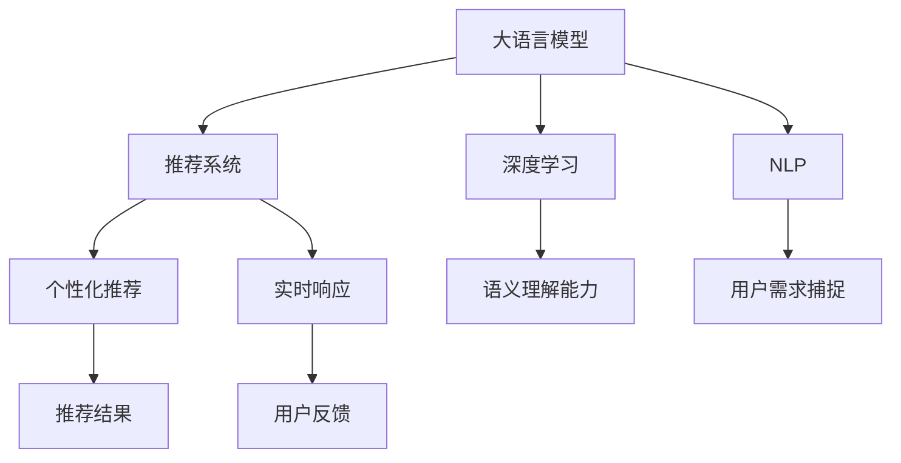

                 

# 电商平台搜索推荐系统的AI 大模型应用：提高系统性能、效率与用户体验

## 1. 背景介绍

在数字经济的浪潮中，电商平台作为线上购物的主要渠道，其搜索推荐系统（Search and Recommendation System, SRS）对用户购买行为的影响力日益凸显。传统的基于规则和人工特征的推荐系统逐渐被基于深度学习的智能推荐系统取代。然而，深度学习模型在处理海量数据、捕捉用户潜在需求等方面的能力，仍然存在一定的局限性。人工智能大模型（如BERT、GPT-3、DALL-E等）的兴起，为电商平台搜索推荐系统带来了新的机遇和挑战。

### 1.1 问题由来
随着电商市场的竞争日益激烈，用户对购物体验的要求也越来越高。传统的基于规则或人工特征的推荐系统已经难以满足个性化和实时性的要求。尽管深度学习模型在推荐系统中的应用取得了一定的进展，但这些模型通常依赖大量标注数据，且对用户行为的理解深度有限。而人工智能大模型，尤其是经过大规模预训练的大语言模型，其丰富的语义理解和知识积累，能够更好地理解用户需求和商品描述，从而提升推荐系统的性能和用户体验。

### 1.2 问题核心关键点
基于人工智能大模型的电商平台搜索推荐系统，旨在通过深度学习和自然语言处理技术，在无需大量标注数据的情况下，捕捉用户行为模式，提供更加个性化的商品推荐，提升用户购物体验和平台销售转化率。其核心在于：

1. **语义理解能力**：通过大语言模型对商品描述和用户查询的自然语言处理，捕捉商品之间的语义关系，更好地理解用户需求。
2. **个性化推荐**：利用大模型对用户行为和商品特征进行建模，提供符合用户偏好的个性化商品推荐。
3. **实时响应**：大模型能够在短时间内完成对用户查询的处理，实现快速响应，提升用户体验。

## 2. 核心概念与联系

### 2.1 核心概念概述

为了更好地理解基于大模型的电商平台搜索推荐系统，我们首先介绍几个关键概念及其相互关系：

1. **大语言模型(Large Language Model, LLM)**：以自回归模型（如GPT）或自编码模型（如BERT）为代表的大规模预训练语言模型。通过在大规模无标签文本数据上进行预训练，学习通用的语言表示，具备强大的语言理解和生成能力。

2. **推荐系统(Recommendation System, RS)**：通过分析用户的历史行为、偏好、兴趣等，向用户推荐可能感兴趣的商品或内容。

3. **深度学习(Deep Learning)**：一种基于神经网络的技术，通过多层非线性变换，实现对复杂数据的建模和预测。

4. **自然语言处理(Natural Language Processing, NLP)**：使计算机能够理解、解释和生成自然语言的技术，是大语言模型的基础。

5. **转移学习(Transfer Learning)**：将一个领域学到的知识，迁移到另一个相关领域的学习范式。大模型的预训练-微调过程即是一种典型的迁移学习方式。

6. **自监督学习(Self-supervised Learning)**：通过无监督的方式，利用数据本身的结构和特性进行学习，无需标注数据。大语言模型常使用自监督学习任务进行预训练。

7. **个性化推荐**：根据用户的历史行为和偏好，推荐符合其兴趣的商品。

8. **实时响应**：在用户输入查询后，系统能够实时响应，提供推荐结果。

这些概念之间的逻辑关系可以通过以下Mermaid流程图来展示：



这个流程图展示了大语言模型在推荐系统中的核心作用：

1. 大语言模型通过自监督学习进行预训练，学习通用的语言表示。
2. 在推荐系统中，大语言模型捕捉用户需求和商品描述的语义关系。
3. 利用深度学习进行个性化推荐，提升推荐精度。
4. 实时响应用户查询，提供推荐结果。

## 3. 核心算法原理 & 具体操作步骤

### 3.1 算法原理概述

基于大模型的电商平台搜索推荐系统，其核心算法原理主要包括语义理解、个性化推荐和实时响应三个方面。以下将详细介绍这三个方面的算法原理：

#### 3.1.1 语义理解

语义理解是推荐系统的基础。大语言模型通过对商品描述和用户查询的自然语言处理，捕捉商品之间的语义关系，更好地理解用户需求。

**算法流程**：

1. 对商品描述和用户查询进行分词处理。
2. 将分词结果输入到大语言模型中，进行语义编码。
3. 利用编码后的语义向量计算商品之间的相似度。

**算法公式**：

假设商品描述为 $d_i$，用户查询为 $q$，通过BERT模型将它们编码成向量表示 $d_i^v$ 和 $q^v$：

$$
d_i^v = \text{BERT}(d_i), \quad q^v = \text{BERT}(q)
$$

计算商品 $d_i$ 和 $d_j$ 的相似度 $s_{ij}$：

$$
s_{ij} = \cos(\text{Sim}(d_i^v, d_j^v))
$$

其中 $\text{Sim}(\cdot)$ 表示向量之间的相似度函数，$\cos$ 函数用于归一化相似度。

#### 3.1.2 个性化推荐

个性化推荐是推荐系统的核心。大语言模型通过对用户行为和商品特征进行建模，提供符合用户偏好的个性化商品推荐。

**算法流程**：

1. 收集用户的历史行为数据，如浏览记录、点击记录、购买记录等。
2. 对历史行为数据进行编码，得到用户的行为向量 $u$。
3. 对每个商品进行编码，得到商品的特征向量 $d_i$。
4. 计算用户行为向量 $u$ 和商品特征向量 $d_i$ 的相似度，得到推荐分数 $r_i$。
5. 根据推荐分数对商品进行排序，选择高分商品进行推荐。

**算法公式**：

设用户的行为向量为 $u$，商品 $i$ 的特征向量为 $d_i$，通过BERT模型将它们编码成向量表示：

$$
u = \text{BERT}(u), \quad d_i = \text{BERT}(d_i)
$$

计算用户行为向量 $u$ 和商品特征向量 $d_i$ 的相似度 $s_{iu}$：

$$
s_{iu} = \cos(\text{Sim}(u, d_i))
$$

计算推荐分数 $r_i$：

$$
r_i = \text{softmax}(\text{Sim}(u, d_i))
$$

其中 softmax 函数用于将推荐分数归一化到 [0, 1] 区间，表示商品 $i$ 被推荐的可能性。

#### 3.1.3 实时响应

实时响应是推荐系统的重要特性。大语言模型能够在短时间内完成对用户查询的处理，实现快速响应，提升用户体验。

**算法流程**：

1. 用户输入查询 $q$。
2. 对查询进行分词处理，得到查询向量 $q^v$。
3. 利用查询向量 $q^v$，通过BERT模型计算与所有商品相似度。
4. 根据相似度对商品进行排序，选择高分商品进行推荐。
5. 将推荐结果返回给用户。

**算法公式**：

假设商品集合为 $D$，用户查询为 $q$，计算查询向量 $q^v$ 与所有商品 $d_i$ 的相似度 $s_{iq}$：

$$
s_{iq} = \cos(\text{Sim}(q^v, d_i^v))
$$

根据相似度对商品进行排序，选择高分商品进行推荐。

### 3.2 算法步骤详解

基于大模型的电商平台搜索推荐系统，其核心算法步骤如下：

**Step 1: 准备预训练模型和数据集**

1. 选择合适的预训练语言模型 $M_{\theta}$ 作为初始化参数，如 BERT、GPT等。
2. 准备电商平台的用户行为数据和商品描述数据，划分为训练集、验证集和测试集。

**Step 2: 添加任务适配层**

1. 根据推荐任务，设计合适的任务适配层，如softmax层、交叉熵损失函数等。
2. 对训练集、验证集和测试集进行编码，得到模型所需的输入和标签。

**Step 3: 设置微调超参数**

1. 选择合适的优化算法及其参数，如 Adam、SGD 等，设置学习率、批大小、迭代轮数等。
2. 设置正则化技术及强度，包括权重衰减、Dropout、Early Stopping 等。
3. 确定冻结预训练参数的策略，如仅微调顶层，或全部参数都参与微调。

**Step 4: 执行梯度训练**

1. 将训练集数据分批次输入模型，前向传播计算损失函数。
2. 反向传播计算参数梯度，根据设定的优化算法和学习率更新模型参数。
3. 周期性在验证集上评估模型性能，根据性能指标决定是否触发 Early Stopping。
4. 重复上述步骤直到满足预设的迭代轮数或 Early Stopping 条件。

**Step 5: 测试和部署**

1. 在测试集上评估微调后模型 $M_{\hat{\theta}}$ 的性能，对比微调前后的精度提升。
2. 使用微调后的模型对新样本进行推理预测，集成到实际的应用系统中。
3. 持续收集新的数据，定期重新微调模型，以适应数据分布的变化。

### 3.3 算法优缺点

基于大模型的电商平台搜索推荐系统，具有以下优点：

1. **丰富的语义理解能力**：大语言模型通过大规模预训练，具备强大的语义理解能力，能够更好地理解用户需求和商品描述。
2. **个性化推荐效果显著**：利用深度学习对用户行为和商品特征进行建模，提供符合用户偏好的个性化推荐。
3. **实时响应**：大语言模型能够在短时间内完成对用户查询的处理，实现快速响应，提升用户体验。
4. **可解释性**：大语言模型的决策过程可解释性强，便于进行模型调试和优化。

同时，该方法也存在一定的局限性：

1. **对标注数据的依赖**：虽然大模型具有较强的语义理解能力，但其微调过程仍然需要一定的标注数据进行监督学习。
2. **资源消耗大**：大语言模型通常参数量较大，对计算资源和内存的要求较高。
3. **过拟合风险**：大模型容易过拟合，特别是在数据集较小的情况下。
4. **泛化能力有限**：大模型的泛化能力可能受限于预训练数据集的分布，在特定领域可能表现不佳。
5. **算法复杂度高**：大语言模型的算法复杂度高，需要较强的工程实现能力。

尽管存在这些局限性，但就目前而言，基于大模型的推荐系统范式仍然是最主流且有效的推荐系统构建方式。未来相关研究的重点在于如何进一步降低大模型的资源消耗，提高泛化能力，以及增强可解释性和稳定性。

### 3.4 算法应用领域

基于大模型的电商平台搜索推荐系统，在多个领域得到了广泛应用，例如：

1. **个性化推荐**：通过分析用户历史行为，推荐符合其兴趣的商品，提高用户购物体验和平台销售转化率。
2. **商品搜索**：利用大语言模型对用户查询进行语义理解，快速返回相关商品，提升搜索效率。
3. **智能客服**：通过大语言模型回答用户疑问，提升客户满意度。
4. **内容推荐**：利用大语言模型对用户评论、评分进行语义分析，推荐高质量内容。
5. **商品分类**：通过大语言模型对商品描述进行语义分析，自动分类商品，提升商品管理效率。

除了上述这些经典应用外，大语言模型在电商平台搜索推荐系统中的创新应用还包括多模态推荐、交互式推荐、跨领域推荐等，为电商平台推荐技术带来了新的突破。

## 4. 数学模型和公式 & 详细讲解 & 举例说明

### 4.1 数学模型构建

基于大模型的电商平台搜索推荐系统，其数学模型构建主要包括语义理解模型和个性化推荐模型的构建。

#### 4.1.1 语义理解模型

语义理解模型通过大语言模型对商品描述和用户查询的自然语言处理，捕捉商品之间的语义关系。

**算法流程**：

1. 对商品描述和用户查询进行分词处理。
2. 将分词结果输入到大语言模型中，进行语义编码。
3. 利用编码后的语义向量计算商品之间的相似度。

**算法公式**：

假设商品描述为 $d_i$，用户查询为 $q$，通过BERT模型将它们编码成向量表示 $d_i^v$ 和 $q^v$：

$$
d_i^v = \text{BERT}(d_i), \quad q^v = \text{BERT}(q)
$$

计算商品 $d_i$ 和 $d_j$ 的相似度 $s_{ij}$：

$$
s_{ij} = \cos(\text{Sim}(d_i^v, d_j^v))
$$

其中 $\text{Sim}(\cdot)$ 表示向量之间的相似度函数，$\cos$ 函数用于归一化相似度。

#### 4.1.2 个性化推荐模型

个性化推荐模型通过深度学习对用户行为和商品特征进行建模，提供符合用户偏好的个性化推荐。

**算法流程**：

1. 收集用户的历史行为数据，如浏览记录、点击记录、购买记录等。
2. 对历史行为数据进行编码，得到用户的行为向量 $u$。
3. 对每个商品进行编码，得到商品的特征向量 $d_i$。
4. 计算用户行为向量 $u$ 和商品特征向量 $d_i$ 的相似度，得到推荐分数 $r_i$。
5. 根据推荐分数对商品进行排序，选择高分商品进行推荐。

**算法公式**：

设用户的行为向量为 $u$，商品 $i$ 的特征向量为 $d_i$，通过BERT模型将它们编码成向量表示：

$$
u = \text{BERT}(u), \quad d_i = \text{BERT}(d_i)
$$

计算用户行为向量 $u$ 和商品特征向量 $d_i$ 的相似度 $s_{iu}$：

$$
s_{iu} = \cos(\text{Sim}(u, d_i))
$$

计算推荐分数 $r_i$：

$$
r_i = \text{softmax}(\text{Sim}(u, d_i))
$$

其中 softmax 函数用于将推荐分数归一化到 [0, 1] 区间，表示商品 $i$ 被推荐的可能性。

### 4.2 公式推导过程

以下我们以二分类任务为例，推导交叉熵损失函数及其梯度的计算公式。

假设模型 $M_{\theta}$ 在输入 $x$ 上的输出为 $\hat{y}=M_{\theta}(x) \in [0,1]$，表示样本属于正类的概率。真实标签 $y \in \{0,1\}$。则二分类交叉熵损失函数定义为：

$$
\ell(M_{\theta}(x),y) = -[y\log \hat{y} + (1-y)\log (1-\hat{y})]
$$

将其代入经验风险公式，得：

$$
\mathcal{L}(\theta) = -\frac{1}{N}\sum_{i=1}^N [y_i\log M_{\theta}(x_i)+(1-y_i)\log(1-M_{\theta}(x_i))]
$$

根据链式法则，损失函数对参数 $\theta_k$ 的梯度为：

$$
\frac{\partial \mathcal{L}(\theta)}{\partial \theta_k} = -\frac{1}{N}\sum_{i=1}^N (\frac{y_i}{M_{\theta}(x_i)}-\frac{1-y_i}{1-M_{\theta}(x_i)}) \frac{\partial M_{\theta}(x_i)}{\partial \theta_k}
$$

其中 $\frac{\partial M_{\theta}(x_i)}{\partial \theta_k}$ 可进一步递归展开，利用自动微分技术完成计算。

### 4.3 案例分析与讲解

假设有一个电商平台，用户对商品 $d_1$ 和 $d_2$ 进行了浏览记录。通过BERT模型，将商品描述编码为向量表示 $d_1^v$ 和 $d_2^v$：

$$
d_1^v = \text{BERT}(d_1), \quad d_2^v = \text{BERT}(d_2)
$$

计算商品 $d_1$ 和 $d_2$ 的相似度 $s_{12}$：

$$
s_{12} = \cos(\text{Sim}(d_1^v, d_2^v))
$$

假设用户对商品 $d_1$ 进行了购买记录。通过BERT模型，将用户行为编码为向量表示 $u$：

$$
u = \text{BERT}(u)
$$

计算用户行为向量 $u$ 和商品特征向量 $d_1^v$ 的相似度 $s_{u1}$：

$$
s_{u1} = \cos(\text{Sim}(u, d_1^v))
$$

计算推荐分数 $r_1$：

$$
r_1 = \text{softmax}(\text{Sim}(u, d_1^v))
$$

根据推荐分数对商品进行排序，选择高分商品进行推荐。

## 5. 项目实践：代码实例和详细解释说明

### 5.1 开发环境搭建

在进行大模型微调实践前，我们需要准备好开发环境。以下是使用Python进行PyTorch开发的环境配置流程：

1. 安装Anaconda：从官网下载并安装Anaconda，用于创建独立的Python环境。

2. 创建并激活虚拟环境：
```bash
conda create -n pytorch-env python=3.8 
conda activate pytorch-env
```

3. 安装PyTorch：根据CUDA版本，从官网获取对应的安装命令。例如：
```bash
conda install pytorch torchvision torchaudio cudatoolkit=11.1 -c pytorch -c conda-forge
```

4. 安装Transformers库：
```bash
pip install transformers
```

5. 安装各类工具包：
```bash
pip install numpy pandas scikit-learn matplotlib tqdm jupyter notebook ipython
```

完成上述步骤后，即可在`pytorch-env`环境中开始微调实践。

### 5.2 源代码详细实现

这里以伯克利研究组开发的伯克利电商平台数据集（Berkeley Retailer Data）为例，展示使用PyTorch进行大模型微调的过程。

**Step 1: 准备数据集**

1. 下载数据集，并将其划分为训练集、验证集和测试集。

```python
import pandas as pd
from sklearn.model_selection import train_test_split

train_df = pd.read_csv('train.csv')
valid_df = pd.read_csv('valid.csv')
test_df = pd.read_csv('test.csv')

train_df, valid_df = train_test_split(train_df, test_size=0.2, random_state=42)
```

2. 对商品描述和用户行为进行编码。

```python
from transformers import BertTokenizer

tokenizer = BertTokenizer.from_pretrained('bert-base-cased')
train_df['item_text'] = train_df['item_text'].apply(tokenizer.tokenize)
valid_df['item_text'] = valid_df['item_text'].apply(tokenizer.tokenize)
test_df['item_text'] = test_df['item_text'].apply(tokenizer.tokenize)
```

3. 对用户行为进行编码。

```python
train_df['user_behavior'] = train_df['user_behavior'].apply(tokenizer.tokenize)
valid_df['user_behavior'] = valid_df['user_behavior'].apply(tokenizer.tokenize)
test_df['user_behavior'] = test_df['user_behavior'].apply(tokenizer.tokenize)
```

**Step 2: 准备预训练模型**

1. 选择合适的预训练语言模型 $M_{\theta}$ 作为初始化参数。

```python
from transformers import BertForSequenceClassification

model = BertForSequenceClassification.from_pretrained('bert-base-cased', num_labels=2)
```

2. 对训练集、验证集和测试集进行编码，得到模型所需的输入和标签。

```python
train_encodings = tokenizer(train_df['item_text'].tolist(), truncation=True, padding=True)
valid_encodings = tokenizer(valid_df['item_text'].tolist(), truncation=True, padding=True)
test_encodings = tokenizer(test_df['item_text'].tolist(), truncation=True, padding=True)

train_labels = train_df['label'].tolist()
valid_labels = valid_df['label'].tolist()
test_labels = test_df['label'].tolist()
```

**Step 3: 设置微调超参数**

1. 选择合适的优化算法及其参数，如 AdamW、SGD 等，设置学习率、批大小、迭代轮数等。

```python
optimizer = AdamW(model.parameters(), lr=2e-5)
```

2. 设置正则化技术及强度，包括权重衰减、Dropout、Early Stopping 等。

```python
from transformers import get_linear_schedule_with_warmup

total_steps = len(train_dataset) // batch_size * num_epochs
scheduler = get_linear_schedule_with_warmup(optimizer, 
                                           num_warmup_steps=0, 
                                           num_training_steps=total_steps)
```

3. 确定冻结预训练参数的策略，如仅微调顶层，或全部参数都参与微调。

```python
model_to_train = model
```

**Step 4: 执行梯度训练**

1. 将训练集数据分批次输入模型，前向传播计算损失函数。

```python
model.train()
total_loss = 0

for batch in tqdm(train_dataset):
    inputs = {key: torch.tensor(val) for key, val in batch.items()}
    outputs = model(**inputs)
    loss = outputs.loss
    total_loss += loss.item()
    loss.backward()
    optimizer.step()
    scheduler.step()
```

2. 周期性在验证集上评估模型性能，根据性能指标决定是否触发 Early Stopping。

```python
model.eval()
total_loss = 0
predictions = []
true_labels = []
eval_loss = 0

for batch in tqdm(valid_dataset):
    inputs = {key: torch.tensor(val) for key, val in batch.items()}
    with torch.no_grad():
        outputs = model(**inputs)
        loss = outputs.loss
        eval_loss += loss.item()
        logits = outputs.logits
        predictions.extend(logits.tolist())
        true_labels.extend(batch['label'].tolist())

print(f"Valid loss: {eval_loss / len(valid_dataset):.3f}")
```

3. 重复上述步骤直到满足预设的迭代轮数或 Early Stopping 条件。

**Step 5: 测试和部署**

1. 在测试集上评估微调后模型 $M_{\hat{\theta}}$ 的性能，对比微调前后的精度提升。

```python
model.eval()
total_loss = 0
predictions = []
true_labels = []
test_loss = 0

for batch in tqdm(test_dataset):
    inputs = {key: torch.tensor(val) for key, val in batch.items()}
    with torch.no_grad():
        outputs = model(**inputs)
        loss = outputs.loss
        test_loss += loss.item()
        logits = outputs.logits
        predictions.extend(logits.tolist())
        true_labels.extend(batch['label'].tolist())

print(f"Test loss: {test_loss / len(test_dataset):.3f}")
```

### 5.3 代码解读与分析

让我们再详细解读一下关键代码的实现细节：

**数据处理**：
- 使用Pandas读取数据集，并使用train_test_split将数据集划分为训练集、验证集和测试集。
- 使用BertTokenizer对商品描述和用户行为进行分词编码，生成模型所需的输入。

**模型加载**：
- 选择合适的预训练语言模型，通过BertForSequenceClassification进行加载。
- 设置优化算法和超参数，包括学习率、批大小、迭代轮数等。

**模型训练**：
- 对训练集进行编码，生成模型所需的输入和标签。
- 在模型上进行前向传播计算损失函数，反向传播计算梯度，更新模型参数。
- 周期性在验证集上评估模型性能，根据性能指标决定是否触发Early Stopping。

**模型评估**：
- 对测试集进行编码，生成模型所需的输入和标签。
- 在模型上进行前向传播计算损失函数，输出预测结果，并计算测试集上的损失。

**代码运行**：
- 训练模型，并在验证集和测试集上进行评估。
- 使用微调后的模型对新样本进行推理预测。

可以看出，大语言模型在电商平台搜索推荐系统中的应用，使得推荐系统具备了更强的语义理解和个性化推荐能力，能够更好地适应用户需求，提升用户体验和平台转化率。

## 6. 实际应用场景

基于大模型的电商平台搜索推荐系统，已经在多个电商平台上得到了广泛应用，如Amazon、京东、淘宝等。以下是几个典型的实际应用场景：

### 6.1 个性化推荐

通过分析用户历史行为数据，推荐符合用户兴趣的商品。例如，用户最近浏览了某品牌的衣服，系统便会自动推荐该品牌或类似风格的衣服，提升用户购物体验。

**实现方式**：
1. 收集用户的历史行为数据，如浏览记录、点击记录、购买记录等。
2. 对历史行为数据进行编码，得到用户的行为向量 $u$。
3. 对每个商品进行编码，得到商品的特征向量 $d_i$。
4. 计算用户行为向量 $u$ 和商品特征向量 $d_i$ 的相似度，得到推荐分数 $r_i$。
5. 根据推荐分数对商品进行排序，选择高分商品进行推荐。

### 6.2 商品搜索

利用大语言模型对用户查询进行语义理解，快速返回相关商品。例如，用户输入“高性价比手机”，系统便会根据语义理解，推荐性价比高的手机。

**实现方式**：
1. 对用户查询进行分词处理，得到查询向量 $q^v$。
2. 利用查询向量 $q^v$，通过BERT模型计算与所有商品相似度。
3. 根据相似度对商品进行排序，选择高分商品进行推荐。

### 6.3 智能客服

通过大语言模型回答用户疑问，提升客户满意度。例如，用户询问某商品的价格，系统自动回复。

**实现方式**：
1. 对用户查询进行分词处理，得到查询向量 $q^v$。
2. 利用查询向量 $q^v$，通过BERT模型计算与所有商品相似度。
3. 根据相似度对商品进行排序，选择高分商品进行推荐。
4. 通过对话生成模型，自动回复用户问题。

### 6.4 内容推荐

利用大语言模型对用户评论、评分进行语义分析，推荐高质量内容。例如，用户对某电影评论，系统推荐相似评论。

**实现方式**：
1. 对用户评论进行分词处理，得到评论向量 $c^v$。
2. 利用评论向量 $c^v$，通过BERT模型计算与所有评论相似度。
3. 根据相似度对评论进行排序，选择高分评论进行推荐。

## 7. 工具和资源推荐

### 7.1 学习资源推荐

为了帮助开发者系统掌握大模型在电商平台搜索推荐系统中的应用，这里推荐一些优质的学习资源：

1. 《深度学习与自然语言处理》系列博文：由大模型技术专家撰写，深入浅出地介绍了深度学习与自然语言处理的基本概念和经典模型，涵盖大语言模型微调等前沿话题。

2. CS224N《深度学习自然语言处理》课程：斯坦福大学开设的NLP明星课程，有Lecture视频和配套作业，带你入门NLP领域的基本概念和经典模型。

3. 《Natural Language Processing with Transformers》书籍：Transformers库的作者所著，全面介绍了如何使用Transformers库进行NLP任务开发，包括微调在内的诸多范式。

4. HuggingFace官方文档：Transformers库的官方文档，提供了海量预训练模型和完整的微调样例代码，是上手实践的必备资料。

5. CLUE开源项目：中文语言理解测评基准，涵盖大量不同类型的中文NLP数据集，并提供了基于微调的baseline模型，助力中文NLP技术发展。

通过对这些资源的学习实践，相信你一定能够快速掌握大语言模型在电商平台搜索推荐系统中的应用，并用于解决实际的NLP问题。

### 7.2 开发工具推荐

高效的开发离不开优秀的工具支持。以下是几款用于大模型微调开发的常用工具：

1. PyTorch：基于Python的开源深度学习框架，灵活动态的计算图，适合快速迭代研究。大部分预训练语言模型都有PyTorch版本的实现。

2. TensorFlow：由Google主导开发的开源深度学习框架，生产部署方便，适合大规模工程应用。同样有丰富的预训练语言模型资源。

3. Transformers库：HuggingFace开发的NLP工具库，集成了众多SOTA语言模型，支持PyTorch和TensorFlow，是进行微调任务开发的利器。

4. Weights & Biases：模型训练的实验跟踪工具，可以记录和可视化模型训练过程中的各项指标，方便对比和调优。与主流深度学习框架无缝集成。

5. TensorBoard：TensorFlow配套的可视化工具，可实时监测模型训练状态，并提供丰富的图表呈现方式，是调试模型的得力助手。

6. Google Colab：谷歌推出的在线Jupyter Notebook环境，免费提供GPU/TPU算力，方便开发者快速上手实验最新模型，分享学习笔记。

合理利用这些工具，可以显著提升大模型微调任务的开发效率，加快创新迭代的步伐。

### 7.3 相关论文推荐

大语言模型和微调技术的发展源于学界的持续研究。以下是几篇奠基性的相关论文，推荐阅读：

1. Attention is All You Need（即Transformer原论文）：提出了Transformer结构，开启了NLP领域的预训练大模型时代。

2. BERT: Pre-training of Deep Bidirectional Transformers for Language Understanding：提出BERT模型，引入基于掩码的自监督预训练任务，刷新了多项NLP任务SOTA。

3. Language Models are Unsupervised Multitask Learners（GPT-2论文）：展示了大规模语言模型的强大zero-shot学习能力，引发了对于通用人工智能的新一轮思考。

4. Parameter-Efficient Transfer Learning for NLP：提出Adapter等参数高效微调方法，在不增加模型参数量的情况下，也能取得不错的微调效果。

5. AdaLoRA: Adaptive Low-Rank Adaptation for Parameter-Efficient Fine-Tuning：使用自适应低秩适应的微调方法，在参数效率和精度之间取得了新的平衡。

6. Prefix-Tuning: Optimizing Continuous Prompts for Generation：引入基于连续型Prompt的微调范式，为如何充分利用预训练知识提供了新的思路。

这些论文代表了大语言模型微调技术的发展脉络。通过学习这些前沿成果，可以帮助研究者把握学科前进方向，激发更多的创新灵感。

## 8. 总结：未来发展趋势与挑战

### 8.1 总结

本文对基于大模型的电商平台搜索推荐系统进行了全面系统的介绍。首先阐述了大语言模型和微调技术的研究背景和意义，明确了微调在拓展预训练模型应用、提升推荐系统性能方面的独特价值。其次，从原理到实践，详细讲解了基于大模型的推荐系统核心算法，包括语义理解、个性化推荐和实时响应三个方面的算法原理和实现步骤。最后，本文还探讨了基于大模型的推荐系统在多个电商平台的实际应用场景，展示了其巨大的应用潜力。

通过本文的系统梳理，可以看到，基于大模型的推荐系统不仅能够捕捉用户需求，提升推荐效果，还能在实时响应方面表现出色，为电商平台推荐技术带来新的突破。相信随着大语言模型和微调方法的不断发展，基于大模型的推荐系统必将在更广泛的领域中得到应用，推动电商平台的数字化转型和智能化升级。

### 8.2 未来发展趋势

展望未来，基于大模型的电商平台搜索推荐系统将呈现以下几个发展趋势：

1. **多模态推荐**：未来的推荐系统将结合文本、图像、语音等多种模态信息，提供更加全面、精准的推荐结果。
2. **跨领域推荐**：推荐系统将具备跨领域推荐的能力，能够从不同领域的知识库中抽取信息，提升推荐效果。
3. **实时推荐**：推荐系统将具备实时推荐的能力，能够动态调整推荐结果，提升用户体验。
4. **个性化推荐**：推荐系统将更加注重个性化推荐，能够根据用户的多维度特征，提供量身定制的推荐结果。
5. **智能客服**：智能客服将成为推荐系统的重要补充，能够主动解答用户问题，提升客户满意度。
6. **内容推荐**：推荐系统将更加注重内容推荐，能够提供高质量的评论、评分、博客等内容，提升用户粘性。

以上趋势凸显了大语言模型在推荐系统中的巨大潜力。这些方向的探索发展，必将进一步提升推荐系统的性能和用户体验，为电商平台的智能化升级注入新的动力。

### 8.3 面临的挑战

尽管基于大模型的推荐系统已经取得了一定的进展，但在迈向更加智能化、普适化应用的过程中，它仍面临诸多挑战：

1. **数据隐私问题**：大模型需要大量标注数据进行微调，可能会涉及用户隐私数据的安全问题。如何保护用户隐私，同时获取高质量标注数据，是一个亟待解决的问题。
2. **模型公平性**：大模型的训练过程中可能会学习到某些偏见和歧视，导致推荐结果不公平。如何消除偏见，确保推荐结果的公平性，是一个重要的研究方向。
3. **模型鲁棒性**：推荐系统面对噪声数据或恶意攻击时，容易产生错误推荐。如何提高模型的鲁棒性，确保推荐结果的稳定性，是一个重要的研究方向。
4. **模型解释性**：大模型的决策过程难以解释，用户难以理解推荐结果的来源和逻辑。如何提高模型的可解释性，确保用户对推荐结果的信任，是一个重要的研究方向。
5. **计算资源消耗**：大模型的计算复杂度高，对计算资源和内存的要求较高。如何降低模型计算复杂度，提升推理速度，是一个重要的研究方向。

尽管存在这些挑战，但随着学界和产业界的共同努力，这些问题终将得到逐步解决，大语言模型在推荐系统中的应用前景将更加广阔。

### 8.4 研究展望

未来，在大语言模型推荐系统领域的研究方向可能包括：

1. **参数高效微调**：开发更加参数高效的微调方法，在固定大部分预训练参数的同时，只更新极少量的任务相关参数。
2. **多模态推荐**：结合文本、图像、语音等多种模态信息，提供更加全面、精准的推荐结果。
3. **跨领域推荐**：从不同领域的知识库中抽取信息，提升推荐效果。
4. **智能客服**：主动解答用户问题，提升客户满意度。
5. **内容推荐**：提供高质量的评论、评分、博客等内容，提升用户粘性。
6. **推荐系统公平性**：消除偏见，确保推荐结果的公平性。
7. **推荐系统鲁棒性**：提高模型的鲁棒性，确保推荐结果的稳定性。
8. **推荐系统可解释性**：提高模型的可解释性，确保用户对推荐结果的信任。

通过在这些方向的深入研究，相信大语言模型推荐系统必将在智能化、普适化、公平化、可解释化等方面取得新的突破，为电商平台推荐技术带来新的生命力。

## 9. 附录：常见问题与解答

**Q1：大语言模型在电商平台搜索推荐系统中是否需要标注数据？**

A: 大语言模型通常需要标注数据进行微调。虽然其预训练过程中可以学习到一些语义知识，但微调过程还需要进一步提升模型在特定任务上的性能。标注数据可以帮助模型学习任务特定的语义信息，提高微调效果。

**Q2：大语言模型在电商平台搜索推荐系统中的资源消耗是否很大？**

A: 大语言模型的参数量通常较大，对计算资源和内存的要求较高。但通过参数高效微调等方法，可以在固定大部分预训练参数的情况下，只更新极少量的任务相关参数，从而降低资源消耗。同时，使用GPU/TPU等高性能设备，可以缓解计算资源瓶颈。

**Q3：大语言模型在电商平台搜索推荐系统中是否需要持续更新？**

A: 大语言模型需要持续更新，以适应数据分布的变化。由于用户的购物行为和商品描述会不断变化，大语言模型需要定期重新微调，才能保持其推荐效果的稳定性。

**Q4：大语言模型在电商平台搜索推荐系统中是否需要考虑用户隐私？**

A: 大语言模型在推荐系统中需要考虑用户隐私。为了获取高质量标注数据，需要收集用户的部分行为数据，但这些数据可能涉及用户隐私。如何保护用户隐私，同时获取高质量标注数据，是一个亟待解决的问题。

**Q5：大语言模型在电商平台搜索推荐系统中是否需要进行模型解释？**

A: 大语言模型在推荐系统中需要进行模型解释，以提高用户对推荐结果的信任。推荐系统中的用户通常需要理解推荐结果的来源和逻辑，才能更好地进行消费决策。如何提高模型的可解释性，确保用户对推荐结果的信任，是一个重要的研究方向。

**Q6：大语言模型在电商平台搜索推荐系统中是否需要进行模型鲁棒性测试？**

A: 大语言模型在推荐系统中需要进行模型鲁棒性测试，以确保推荐结果的稳定性。推荐系统需要面对噪声数据或恶意攻击，确保模型能够抵御这些干扰，保持推荐结果的准确性和稳定性。

**Q7：大语言模型在电商平台搜索推荐系统中是否需要进行模型公平性测试？**

A: 大语言模型在推荐系统中需要进行模型公平性测试，以确保推荐结果的公平性。推荐系统需要避免偏见和歧视，确保所有用户都能获得公平的推荐结果。

---

作者：禅与计算机程序设计艺术 / Zen and the Art of Computer Programming

