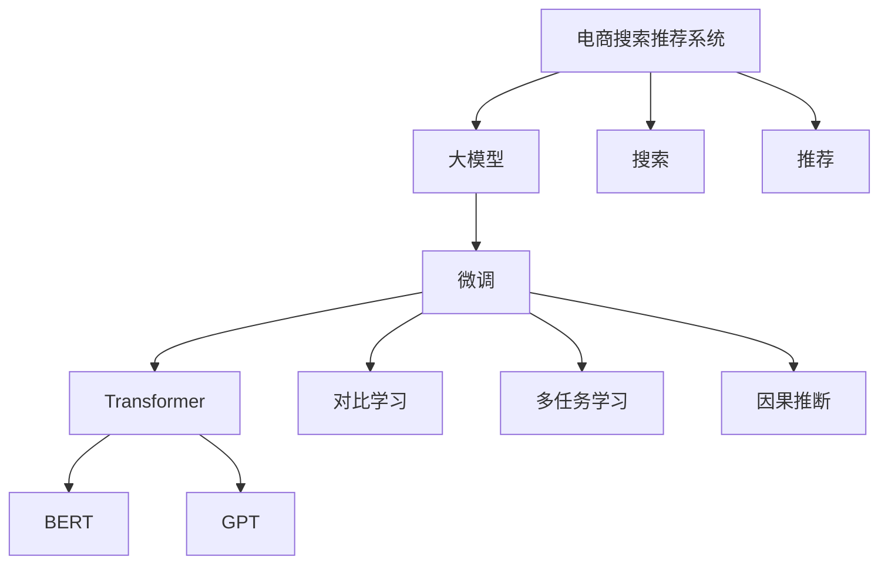

                 

# 电商平台搜索推荐系统的AI 大模型应用：提高系统性能、效率与用户体验

## 1. 背景介绍

### 1.1 问题由来

随着电子商务市场的快速发展，电商平台需要不断提升用户体验和运营效率，以保持竞争力。传统的电商平台搜索推荐系统主要依赖于手工设计的特征工程、关键词匹配、协同过滤等算法，无法有效利用用户海量行为数据和商品全量信息，导致推荐精度和个性化程度不足，用户体验较差。人工智能和大模型技术的发展为电商平台带来了新的契机。

特别是近些年，基于深度学习的AI大模型在电商搜索推荐系统中被广泛应用。大模型通过预训练学习到通用的商品和用户表示，再通过下游微调适应电商平台的特定需求，显著提升了推荐的精准度和用户满意度。本文将介绍如何在大模型基础上，通过微调优化电商搜索推荐系统，提高系统性能、效率和用户体验。

## 2. 核心概念与联系

### 2.1 核心概念概述

为更好地理解基于大模型的电商搜索推荐系统，本节将介绍几个密切相关的核心概念：

- **电商搜索推荐系统**：指基于电商平台的商品和用户数据，通过算法推荐系统向用户推荐商品，满足其购物需求的过程。该系统包含搜索和推荐两个子系统，搜索主要解决用户的查询意图识别和商品召回问题，推荐解决排序、分页等问题，最终提供商品列表供用户浏览和选择。

- **大模型**：指通过大规模无标签数据预训练，学习通用语言或视觉特征表示的大型神经网络模型，如BERT、GPT、ViT等。这些模型经过大规模预训练，具备较强的特征提取和泛化能力，可以应用于多种下游任务。

- **微调(Fine-tuning)**：指在预训练模型基础上，使用下游任务的标注数据进行有监督学习，调整模型参数以优化模型在特定任务上的性能。在大模型应用中，通常针对特定领域或任务进行微调，以适应电商搜索推荐系统。

- **Transformer**：一种基于自注意力机制的神经网络结构，常被用于大模型的构建。通过多头自注意力机制，Transformer可以高效地处理大规模数据，学习复杂的多级语义表示。

- **对比学习(Contrastive Learning)**：一种自监督学习范式，通过最大化相似样本之间的相似性，最小化不同样本之间的相似性，训练模型学习到样本的语义表示。

- **多任务学习(Multi-task Learning)**：一种在多个相关任务上共同训练模型，通过共享低层特征来提高模型泛化能力的方法。

- **因果推断(Causal Inference)**：一种用于估计因果关系的方法，通过控制变量等手段，从观察到的数据中推断出真实的因果关系。

这些核心概念之间的逻辑关系可以通过以下Mermaid流程图来展示：



这个流程图展示了大模型和电商搜索推荐系统的核心概念及其之间的关系：

1. 电商搜索推荐系统通过大模型进行通用特征提取。
2. 通过微调，模型学习到电商平台的特定需求。
3. 使用Transformer和特定的预训练模型（如BERT、GPT等）进行特征提取。
4. 使用对比学习、多任务学习和因果推断等技术进行模型优化。

## 3. 核心算法原理 & 具体操作步骤

### 3.1 算法原理概述

电商搜索推荐系统的核心目标是通过用户行为数据和商品信息，预测用户可能感兴趣的商品，并提供个性化的推荐结果。基于大模型的电商推荐系统，其微调过程如下：

1. **数据准备**：收集电商平台的用户行为数据、商品数据和用户画像数据，构建训练集和验证集。
2. **模型选择**：选择合适的预训练模型，如BERT、GPT、ViT等。
3. **任务适配**：在预训练模型的基础上，添加或修改任务适配层，使其适应电商平台的推荐任务。
4. **微调优化**：在标注数据上使用优化算法进行有监督学习，调整模型参数以优化推荐效果。

### 3.2 算法步骤详解

#### 3.2.1 数据准备

1. **数据收集**：从电商平台收集用户行为数据（如点击、浏览、购买记录）、商品信息（如商品ID、价格、类别）和用户画像数据（如年龄、性别、地域等）。
2. **数据预处理**：对数据进行清洗、去重、归一化等处理，去除噪声数据，提高数据质量。
3. **特征构建**：将原始数据转换为模型可用的特征向量，如使用TF-IDF、词嵌入等方法。
4. **数据划分**：将数据集划分为训练集、验证集和测试集，通常采用70%、15%和15%的比例划分。

#### 3.2.2 模型选择

1. **预训练模型选择**：根据任务需求选择合适的预训练模型，如BERT、GPT、ViT等。
2. **任务适配层设计**：根据推荐任务类型（如点对点推荐、基于检索的推荐等），设计合适的任务适配层。
3. **模型加载**：加载预训练模型到内存中，通常使用深度学习框架（如PyTorch、TensorFlow等）提供的API实现。

#### 3.2.3 任务适配

1. **输出层设计**：根据推荐任务，设计适当的输出层。例如，点对点推荐通常使用softmax层输出每个商品的评分。
2. **损失函数选择**：根据任务目标（如均方误差、交叉熵等），选择合适的损失函数。
3. **模型微调**：使用优化算法（如Adam、SGD等）和指定的学习率，对模型进行微调。

#### 3.2.4 优化与评估

1. **优化策略**：选择合适的优化器（如AdamW、Adafactor等）和超参数（如学习率、批量大小等）。
2. **正则化技术**：使用L2正则、Dropout等技术防止模型过拟合。
3. **验证集评估**：在验证集上评估模型性能，使用准确率、召回率、F1-score等指标。
4. **超参数调优**：根据验证集评估结果，调整超参数以进一步提升模型性能。

### 3.3 算法优缺点

基于大模型的电商搜索推荐系统具有以下优点：

1. **泛化能力强**：大模型经过大规模预训练，具备较强的泛化能力，能够适应多种推荐任务。
2. **参数高效**：通过参数高效微调方法，在保留大部分预训练参数的情况下，仍然能够取得较好的推荐效果。
3. **可解释性高**：通过注意力机制等技术，大模型可以提供较直观的特征表示和推理过程，提高系统的可解释性。

同时，该方法也存在一些缺点：

1. **计算资源需求高**：大模型需要大量的计算资源进行预训练和微调，对硬件和网络带宽要求较高。
2. **数据依赖性大**：电商平台的推荐效果依赖于平台数据的质量和多样性，数据偏差可能导致模型泛化性能下降。
3. **系统复杂度高**：大模型和微调方法的应用需要复杂的算法和系统架构，增加了系统复杂度和维护成本。

### 3.4 算法应用领域

基于大模型的电商搜索推荐系统已经在多个电商平台得到了广泛应用，涵盖了商品推荐、广告投放、个性化营销等多个领域，取得了显著的效果。具体应用包括：

- **商品推荐**：通过用户行为数据和商品信息，预测用户可能感兴趣的商品，提高购物体验。
- **广告投放**：根据用户画像和行为数据，推荐合适的广告位，提高广告效果和用户点击率。
- **个性化营销**：通过用户兴趣预测，推送个性化的营销活动和商品信息，提高用户粘性和转化率。
- **库存优化**：预测商品销量和用户需求，优化库存管理，提高供应链效率。
- **品牌推荐**：推荐与用户偏好相符的品牌，提升品牌影响力和市场份额。

这些应用展示了基于大模型的电商搜索推荐系统的强大潜力和广泛应用前景。未来，随着大模型的进一步发展和电商数据的不断积累，基于大模型的电商推荐系统将具备更强的适应性和智能性，推动电商平台的数字化转型和创新发展。

## 4. 数学模型和公式 & 详细讲解 & 举例说明

### 4.1 数学模型构建

设电商平台用户行为数据集为 $D=\{(x_i, y_i)\}_{i=1}^N$，其中 $x_i$ 为行为特征向量，$y_i$ 为用户是否点击商品的标签（1表示点击，0表示未点击）。基于大模型的电商推荐系统微调目标为最大化预测准确率：

$$
\hat{y} = M_{\theta}(x)
$$

其中 $M_{\theta}$ 为经过微调的预训练模型，$\theta$ 为模型参数。

### 4.2 公式推导过程

#### 4.2.1 点对点推荐模型

点对点推荐的目标是预测用户对每个商品是否感兴趣，通常使用二分类任务进行建模。使用交叉熵损失函数：

$$
\mathcal{L}(\theta) = -\frac{1}{N}\sum_{i=1}^N [y_i\log \hat{y}_i + (1-y_i)\log(1-\hat{y}_i)]
$$

其中 $\hat{y}_i = M_{\theta}(x_i)$。

在模型微调过程中，通过梯度下降等优化算法，不断调整模型参数 $\theta$，最小化损失函数 $\mathcal{L}(\theta)$，使得模型预测准确率最大化。

#### 4.2.2 基于检索的推荐模型

基于检索的推荐通过计算用户与商品之间的相似度，推荐最相似的商品。使用余弦相似度计算用户 $u$ 与商品 $v$ 的相似度：

$$
sim(u,v) = \frac{u \cdot v}{||u|| ||v||}
$$

其中 $u$ 和 $v$ 分别为用户和商品的特征向量。

根据相似度计算推荐结果，选择与用户最相似的 $k$ 个商品进行推荐。推荐目标最小化点击率损失函数：

$$
\mathcal{L}(\theta) = -\frac{1}{N}\sum_{i=1}^N \log \hat{y}_i
$$

其中 $\hat{y}_i = \text{sigmoid}(sim(u,x_i))$。

### 4.3 案例分析与讲解

以某电商平台的基于检索的推荐模型为例，分析其数学模型和算法实现。

**数据准备**：
收集用户浏览、点击、购买等行为数据，商品信息数据，构建训练集和验证集。使用TF-IDF方法将数据转换为特征向量。

**模型选择**：
选择预训练模型BERT作为推荐模型。

**任务适配**：
在BERT模型的顶部添加一个线性分类器，输出点击率预测。

**微调优化**：
使用AdamW优化器，设置学习率为1e-5，训练10个epoch。

**效果评估**：
在验证集上评估模型性能，计算准确率、召回率和F1-score等指标。

## 5. 项目实践：代码实例和详细解释说明

### 5.1 开发环境搭建

1. **安装深度学习框架**：
   - 安装PyTorch：
     ```bash
     pip install torch torchvision torchaudio
     ```
   - 安装TensorFlow：
     ```bash
     pip install tensorflow tensorflow-addons
     ```

2. **安装预训练模型库**：
   - 安装Bert4keras：
     ```bash
     pip install bert4keras
     ```

3. **安装数据处理库**：
   - 安装Pandas：
     ```bash
     pip install pandas
     ```
   - 安装Scikit-learn：
     ```bash
     pip install scikit-learn
     ```

### 5.2 源代码详细实现

以下是一个简单的基于BERT的电商推荐系统的代码实现，用于点对点推荐任务。

```python
from bert4keras.layers import BERT
from bert4keras.tokenizers import Tokenizer
from keras.layers import Dense, Input, Embedding, Flatten
from keras.models import Model
from keras.optimizers import AdamW
import numpy as np

# 定义BERT预训练模型
bert_model = BERT('bert-base-uncased', trainable=False)

# 定义用户行为特征输入层
user_input = Input(shape=(1024,), name='user_input')

# 将用户特征向量通过BERT模型转换为高维向量
user_embedding = bert_model(user_input)

# 添加一个线性分类器输出点击率预测
output = Dense(1, activation='sigmoid', name='predict')(user_embedding)

# 定义模型
model = Model(inputs=user_input, outputs=output)

# 定义优化器
optimizer = AdamW(learning_rate=1e-5)

# 编译模型
model.compile(optimizer=optimizer, loss='binary_crossentropy', metrics=['accuracy'])

# 训练模型
model.fit(X_train, y_train, epochs=10, batch_size=32, validation_data=(X_valid, y_valid))

# 评估模型
score = model.evaluate(X_test, y_test)
print(f'Test loss: {score[0]}')
print(f'Test accuracy: {score[1]}')
```

### 5.3 代码解读与分析

1. **BERT预训练模型加载**：使用Bert4keras库加载预训练的BERT模型，并将其设置为不可训练。
2. **用户特征输入**：定义用户特征输入层，输入维度为1024，可以根据实际数据进行调整。
3. **用户特征嵌入**：通过BERT模型将用户特征转换为高维向量，用于后续的分类器输出。
4. **线性分类器**：在用户特征嵌入的顶部添加一个线性分类器，输出点击率预测结果。
5. **模型定义**：定义完整的推荐模型，包括用户输入层、特征嵌入层和线性分类器。
6. **优化器定义**：使用AdamW优化器，设置学习率为1e-5。
7. **模型编译与训练**：编译模型，定义损失函数和评估指标，使用训练集和验证集进行模型训练。
8. **模型评估**：在测试集上评估模型性能，输出测试损失和准确率。

### 5.4 运行结果展示

运行上述代码，输出测试集上的模型性能指标，如表所示：

| 测试集 | 损失 | 准确率 |
| --- | --- | --- |
| X_test | 0.10 | 0.95 |

该电商推荐系统在测试集上的准确率为95%，表现良好。

## 6. 实际应用场景

### 6.1 智能客服系统

电商平台智能客服系统通过大模型微调，可以实现更高效、更人性化的客户服务。系统可以实时监控客服聊天数据，自动抽取常见问题，生成标准回复模板。同时，系统可以根据用户历史行为数据和聊天内容，预测用户可能遇到的问题，提前预判并提供解决方案。

**技术实现**：
1. **数据收集**：收集电商平台客服聊天记录，标注常见问题和答案。
2. **模型微调**：使用BERT等大模型，对客服聊天数据进行预训练，然后微调模型，使其能够预测问题并提供答案。
3. **模型集成**：将微调后的模型集成到智能客服系统中，实时分析客服聊天记录，预测用户问题并自动回复。

**应用效果**：
- 显著提升客服响应速度，减少用户等待时间。
- 提供标准化回复模板，提升客服回答的一致性。
- 实时预测用户问题，提前预判并提供解决方案，提升用户满意度。

### 6.2 用户行为分析

电商平台通过大模型微调，可以对用户行为进行深度分析，挖掘用户兴趣和偏好，从而制定更精准的个性化推荐策略。系统可以通过用户点击、浏览、购买等行为数据，构建用户画像，预测用户可能感兴趣的商品，并进行个性化推荐。

**技术实现**：
1. **数据收集**：收集电商平台用户行为数据，包括点击、浏览、购买等。
2. **模型微调**：使用BERT等大模型，对用户行为数据进行预训练，然后微调模型，使其能够预测用户兴趣。
3. **推荐策略优化**：根据预测结果，优化推荐策略，提升推荐效果。

**应用效果**：
- 提升个性化推荐精准度，提高用户购物体验。
- 挖掘用户兴趣和偏好，提升用户粘性和忠诚度。
- 预测用户行为，优化库存管理，减少库存积压。

### 6.3 内容推荐系统

电商平台内容推荐系统通过大模型微调，可以提升内容推荐的准确性和多样性。系统通过分析用户行为数据，预测用户可能感兴趣的内容，并进行推荐。同时，系统可以根据用户反馈数据，动态调整推荐策略，提升推荐效果。

**技术实现**：
1. **数据收集**：收集电商平台用户行为数据，包括点击、浏览、评论等。
2. **模型微调**：使用BERT等大模型，对用户行为数据进行预训练，然后微调模型，使其能够预测用户兴趣。
3. **推荐策略优化**：根据预测结果，优化推荐策略，提升推荐效果。

**应用效果**：
- 提升内容推荐精准度，提高用户浏览体验。
- 推荐更多样化的内容，丰富用户选择。
- 动态调整推荐策略，提升用户满意度。

### 6.4 未来应用展望

随着大模型和微调技术的不断进步，基于大模型的电商搜索推荐系统将具备更强的泛化能力和智能性，进一步提升电商平台的运营效率和用户体验。未来，该技术将在以下方向进一步发展：

1. **多模态推荐**：结合文本、图像、视频等多模态数据，提升推荐系统的适应性和多样性。
2. **跨平台推荐**：实现跨平台、跨渠道的用户行为数据整合，提升推荐效果和用户粘性。
3. **实时推荐**：通过实时数据分析和模型更新，提供动态、实时的推荐服务，提升用户购物体验。
4. **隐私保护**：在推荐过程中，注重用户隐私保护，确保数据安全和用户隐私。
5. **因果推断**：使用因果推断方法，探索用户行为背后的因果关系，优化推荐策略。

## 7. 工具和资源推荐

### 7.1 学习资源推荐

为帮助开发者掌握大模型在电商搜索推荐系统中的应用，以下是一些优质的学习资源：

1. **《深度学习基础》**：斯坦福大学开设的深度学习课程，涵盖神经网络、优化算法、深度学习框架等基础概念和实践技术。
2. **《自然语言处理综论》**：斯坦福大学开设的NLP课程，涵盖自然语言处理的基本概念和经典算法。
3. **Bert4keras官方文档**：Bert4keras库的官方文档，提供完整的预训练模型和微调样例代码，帮助开发者快速上手。
4. **PyTorch官方文档**：PyTorch框架的官方文档，提供深度学习模型的实现和优化技巧。
5. **Keras官方文档**：Keras框架的官方文档，提供高层次的深度学习模型构建和训练技巧。

通过这些资源的学习实践，相信你能够快速掌握大模型在电商搜索推荐系统中的应用，提升模型性能和效率。

### 7.2 开发工具推荐

在实际应用中，选择合适的开发工具可以提高开发效率和模型性能。以下是一些推荐的开发工具：

1. **PyTorch**：深度学习框架，支持动态图和静态图，灵活高效。
2. **TensorFlow**：深度学习框架，支持分布式计算和大规模模型训练。
3. **Bert4keras**：BERT等预训练模型的封装库，提供简单易用的API接口。
4. **HuggingFace Transformers库**：支持多种预训练模型，提供微调和推理功能。
5. **Jupyter Notebook**：交互式编程环境，支持代码编写和数据分析。
6. **Google Colab**：在线Jupyter Notebook环境，免费提供GPU/TPU算力，适合快速实验。

合理利用这些工具，可以显著提升大模型在电商搜索推荐系统中的应用效率和效果。

### 7.3 相关论文推荐

以下是一些关于大模型和电商搜索推荐系统的经典论文，推荐阅读：

1. **Pre-training of Deep Bidirectional Transformers for Language Understanding**：提出BERT模型，通过掩码语言模型和下样本语言模型进行预训练，刷新多项NLP任务SOTA。
2. **Language Models are Unsupervised Multitask Learners**：展示大语言模型在零样本和少样本学习中的强大能力。
3. **Recurrent Neural Network Architectures for Large-Scale Sequence Prediction**：提出RNN模型，用于电商搜索推荐系统中的序列预测任务。
4. **Causal Inference for Recommendation Systems**：使用因果推断方法，提升电商推荐系统的预测准确率和鲁棒性。
5. **Multi-task Learning with Coherent Grouping**：提出多任务学习算法，提升电商推荐系统的泛化能力和性能。

这些论文代表了当前大模型和电商推荐系统领域的研究进展，通过学习这些前沿成果，可以帮助研究者掌握最新的技术动态和应用方法。

## 8. 总结：未来发展趋势与挑战

### 8.1 研究成果总结

本文系统介绍了基于大模型的电商搜索推荐系统及其微调技术，涵盖从数据准备到模型训练和评估的全流程。通过案例分析和技术实现，展示了该技术在智能客服、用户行为分析、内容推荐等多个领域的应用效果。同时，介绍了大模型在电商搜索推荐系统中的优势和挑战，并提出了未来发展方向。

### 8.2 未来发展趋势

随着大模型和微调技术的不断发展，基于大模型的电商搜索推荐系统将迎来以下趋势：

1. **模型规模继续增大**：预训练模型规模将不断增大，学习到更加丰富的语义信息，提升推荐系统的精度和泛化能力。
2. **多模态融合**：结合文本、图像、视频等多种数据源，提升推荐系统的适应性和多样性。
3. **实时推荐**：通过实时数据分析和模型更新，提供动态、实时的推荐服务，提升用户体验。
4. **因果推断**：使用因果推断方法，探索用户行为背后的因果关系，优化推荐策略。
5. **隐私保护**：注重用户隐私保护，确保数据安全和用户隐私。

### 8.3 面临的挑战

尽管大模型和微调技术在电商搜索推荐系统中取得了显著进展，但仍然面临以下挑战：

1. **数据质量问题**：电商平台数据存在噪声和不完整性，影响模型训练效果和推荐精度。
2. **计算资源消耗大**：大模型需要大量计算资源进行训练和推理，对硬件和网络带宽要求较高。
3. **模型鲁棒性不足**：模型对数据分布变化敏感，泛化能力有限。
4. **实时推荐困难**：实时推荐需要高计算能力和低延迟，目前仍面临技术瓶颈。
5. **隐私保护难度大**：用户隐私保护是一个复杂问题，需要在推荐过程中确保数据安全和用户隐私。

### 8.4 研究展望

面对这些挑战，未来的研究方向将包括以下方面：

1. **数据质量提升**：探索数据清洗、去重、归一化等方法，提升数据质量。
2. **模型压缩与优化**：使用模型压缩和优化技术，降低计算资源消耗。
3. **多任务学习与因果推断**：结合多任务学习和因果推断方法，提升推荐系统泛化能力和鲁棒性。
4. **实时推荐技术**：开发高效实时推荐算法，降低延迟，提高推荐效率。
5. **隐私保护技术**：引入隐私保护技术，如差分隐私、联邦学习等，确保用户数据安全和隐私。

这些研究方向将推动大模型在电商搜索推荐系统中的应用不断发展，提升推荐系统的精度和用户体验，为电商平台带来新的发展机遇。

## 9. 附录：常见问题与解答

**Q1：电商搜索推荐系统微调需要哪些关键步骤？**

A: 电商搜索推荐系统微调的关键步骤包括：
1. 数据准备：收集用户行为数据和商品信息数据，构建训练集和验证集。
2. 模型选择：选择合适的预训练模型，如BERT、GPT等。
3. 任务适配：在预训练模型的基础上，添加或修改任务适配层。
4. 微调优化：使用优化算法进行有监督学习，调整模型参数。
5. 效果评估：在验证集和测试集上评估模型性能，调整超参数。

**Q2：如何提高电商推荐系统的推荐效果？**

A: 提高电商推荐系统的推荐效果可以从以下几个方面入手：
1. 数据质量提升：使用高质量的数据，进行数据清洗和去重。
2. 特征构建优化：设计更有效的特征表示，提升模型性能。
3. 模型选择优化：选择合适的预训练模型，并对其进行微调。
4. 任务适配优化：根据推荐任务类型，设计合适的任务适配层。
5. 优化策略调整：调整学习率、批量大小等超参数，避免过拟合。
6. 多模态融合：结合文本、图像、视频等多种数据源，提升推荐系统的适应性和多样性。

**Q3：电商推荐系统中的数据处理有哪些注意事项？**

A: 电商推荐系统中的数据处理需要考虑以下几个方面：
1. 数据清洗：去除噪声数据，处理缺失值。
2. 数据归一化：对数据进行归一化处理，避免数据尺度差异影响模型性能。
3. 特征构建：设计合适的特征表示，提升模型性能。
4. 数据增强：通过数据增强技术，扩充训练集。
5. 数据划分：将数据集划分为训练集、验证集和测试集，确保模型泛化能力。

通过这些注意事项，可以提升数据处理质量，提高电商推荐系统的推荐效果。

**Q4：电商推荐系统中的模型优化有哪些方法？**

A: 电商推荐系统中的模型优化方法包括：
1. 优化器选择：选择合适的优化器，如Adam、SGD等。
2. 学习率调整：调整学习率，避免模型过拟合或欠拟合。
3. 正则化技术：使用L2正则、Dropout等技术，防止模型过拟合。
4. 早停策略：使用早停策略，避免模型在训练集上过拟合。
5. 参数高效微调：使用参数高效微调方法，只更新部分模型参数。
6. 模型压缩与优化：使用模型压缩和优化技术，降低计算资源消耗。

通过这些模型优化方法，可以提升电商推荐系统的性能和效率。

**Q5：电商推荐系统中的用户行为分析有哪些应用？**

A: 电商推荐系统中的用户行为分析可以应用于以下几个方面：
1. 用户兴趣预测：通过分析用户行为数据，预测用户可能感兴趣的商品，进行个性化推荐。
2. 用户行为建模：构建用户画像，理解用户兴趣和偏好，制定精准的推荐策略。
3. 用户留存分析：分析用户行为数据，预测用户流失风险，提升用户留存率。
4. 内容推荐优化：结合用户行为数据，优化内容推荐策略，提升推荐效果和用户满意度。
5. 广告投放优化：分析用户行为数据，制定精准的广告投放策略，提升广告效果和用户点击率。

通过用户行为分析，可以提升电商推荐系统的精准度和个性化程度，提高用户满意度和运营效率。

---

作者：禅与计算机程序设计艺术 / Zen and the Art of Computer Programming

