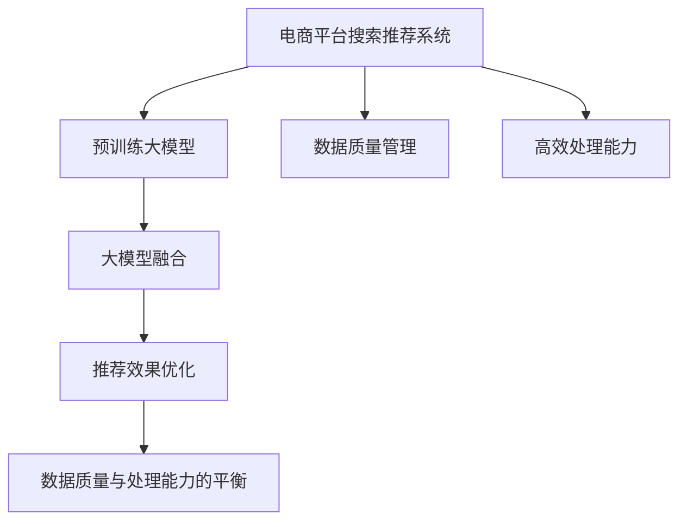

                 

# 电商平台搜索推荐系统的AI 大模型融合：应对数据质量与处理能力挑战

> 关键词：电商平台,搜索推荐系统,大模型融合,数据质量,处理能力

## 1. 背景介绍

### 1.1 问题由来
随着电子商务的快速发展，电商平台的数据量呈现指数级增长，如何高效地处理这些海量数据，并从中提取出有用的信息，成为电商平台亟待解决的问题。传统的基于规则的推荐系统难以适应日益复杂多变的用户需求，推荐结果的精度和个性化程度都远远无法满足用户期待。

近年来，人工智能技术，特别是深度学习和预训练大模型的兴起，为电商搜索推荐系统带来了新的解决方案。通过融合大模型技术，电商平台能够在更短的时间内，更准确地理解用户需求，提供个性化的推荐结果。然而，随着电商平台的规模不断扩大，数据质量和处理能力的瓶颈也随之显现，如何在大模型和数据处理的复杂系统中获得最优的推荐效果，成为电商平台的当务之急。

### 1.2 问题核心关键点
本文聚焦于基于大模型的电商平台搜索推荐系统，介绍并分析了其在处理数据质量与计算能力方面的挑战，提出了融合大模型的优化策略。我们的核心问题包括：

1. **数据质量管理**：电商平台的数据质量通常参差不齐，存在数据稀疏、噪声、重复等问题。如何在数据预处理环节保证数据的质量，是保证推荐结果准确性的前提。
2. **高效处理能力**：海量数据和复杂模型构成了对计算资源的大量需求，如何在大模型和计算资源有限的情况下，提升处理和推理效率，是实现高效推荐系统的关键。
3. **优化大模型融合**：电商平台的数据特点与通用大模型可能存在差异，如何在大模型的基础上，结合电商数据特点进行模型优化，是提升推荐效果的关键。

## 2. 核心概念与联系

### 2.1 核心概念概述

为更好地理解大模型融合在电商平台中的应用，本节将介绍几个密切相关的核心概念：

- **电商平台搜索推荐系统(E-commerce Search & Recommendation System)**：基于用户行为数据、商品属性信息、文本描述等，通过学习用户偏好和商品特性，为用户提供个性化的搜索结果和推荐列表的系统。

- **预训练大模型(Pre-trained Large Models)**：如BERT、GPT等，在大规模无标签文本数据上进行预训练，学习通用语言表示的大模型。通过在大规模语料上自监督学习，这些模型具备强大的语言理解和生成能力。

- **数据质量管理(Data Quality Management)**：指在数据预处理环节，通过数据清洗、去重、纠错等手段，提升数据质量和可用性，以减少噪音和错误对模型训练和推荐结果的影响。

- **高效处理能力(Effective Processing Capability)**：指在有限计算资源的情况下，通过模型压缩、量化加速、分布式计算等技术，提高数据处理和模型推理的效率。

- **大模型融合(Large Model Integration)**：指将预训练大模型与其他算法、规则、数据模型进行结合，形成更加复杂、强大的推荐模型。

- **推荐效果优化(Recommendation Effect Enhancement)**：指通过优化模型结构、改进训练目标、应用数据增强等手段，提升推荐模型的性能，包括精度、召回率、个性化程度等。

- **数据质量与处理能力的平衡(Balancing Data Quality and Processing Power)**：指在推荐系统中，如何在保证数据质量的同时，高效处理和利用数据，实现最优的推荐效果。

这些核心概念之间的逻辑关系可以通过以下Mermaid流程图来展示：



这个流程图展示了电商平台搜索推荐系统的核心概念及其之间的关系：

1. 电商平台搜索推荐系统作为大模型的应用场景，结合了数据质量和处理能力的管理，最终通过大模型融合和推荐效果优化，实现数据质量与处理能力的平衡。
2. 预训练大模型为推荐系统提供了强大的语言理解和生成能力。
3. 数据质量管理和大模型融合共同构成了推荐系统的基础框架，用于处理电商平台的复杂数据。
4. 推荐效果优化在大模型融合的基础上，进一步提升推荐系统的性能，实现个性化推荐。

## 3. 核心算法原理 & 具体操作步骤

### 3.1 算法原理概述

基于大模型的电商平台搜索推荐系统，其核心思想是通过预训练大模型学习通用语言表示，结合电商平台的数据特点进行微调和优化，最终得到具备强大推荐能力的模型。其关键在于：

1. **预训练大模型**：通过在大规模语料上自监督学习，获得对语言规律的深刻理解。
2. **数据质量管理**：在数据预处理环节，通过清洗、去重、纠错等手段，提升数据质量，减少噪音和错误。
3. **高效处理能力**：在有限的计算资源下，通过模型压缩、量化加速等技术，提高数据处理和模型推理的效率。
4. **大模型融合**：结合电商平台的数据特点，在大模型的基础上进行微调和优化，实现更加精准的推荐效果。

### 3.2 算法步骤详解

基于大模型的电商平台搜索推荐系统一般包括以下几个关键步骤：

**Step 1: 准备预训练模型和数据集**
- 选择合适的预训练语言模型，如BERT、GPT等，作为推荐模型的基础。
- 准备电商平台的销售数据、用户行为数据、商品属性信息等，进行数据清洗和预处理，提升数据质量。

**Step 2: 添加任务适配层**
- 根据推荐任务设计合适的输出层和损失函数。对于分类任务，通常在顶层添加线性分类器，使用交叉熵损失函数。
- 对于回归任务，可以使用均方误差损失函数。

**Step 3: 设置微调超参数**
- 选择合适的优化算法及其参数，如Adam、SGD等，设置学习率、批大小、迭代轮数等。
- 设置正则化技术及强度，包括权重衰减、Dropout、Early Stopping等。
- 确定冻结预训练参数的策略，如仅微调顶层，或全部参数都参与微调。

**Step 4: 执行梯度训练**
- 将训练集数据分批次输入模型，前向传播计算损失函数。
- 反向传播计算参数梯度，根据设定的优化算法和学习率更新模型参数。
- 周期性在验证集上评估模型性能，根据性能指标决定是否触发 Early Stopping。
- 重复上述步骤直到满足预设的迭代轮数或 Early Stopping 条件。

**Step 5: 测试和部署**
- 在测试集上评估微调后模型，对比微调前后的精度提升。
- 使用微调后的模型对新样本进行推理预测，集成到实际的应用系统中。
- 持续收集新的数据，定期重新微调模型，以适应数据分布的变化。

### 3.3 算法优缺点

基于大模型的电商平台搜索推荐系统具有以下优点：

1. **精度高**：大模型融合能够有效结合电商数据特点，提升推荐模型的性能。
2. **通用性强**：适用于各种电商推荐任务，如商品推荐、活动推荐、个性化搜索等，设计简单的任务适配层即可实现微调。
3. **可解释性强**：通过查看模型的中间结果，可以理解推荐过程的逻辑，便于系统调试和优化。
4. **快速迭代**：微调过程不需要从头训练，能够在短时间内快速适应新任务。

同时，该方法也存在一定的局限性：

1. **依赖标注数据**：微调的效果很大程度上取决于标注数据的质量和数量，获取高质量标注数据的成本较高。
2. **泛化能力有限**：当目标任务与预训练数据的分布差异较大时，微调的性能提升有限。
3. **模型复杂度高**：大模型的参数量较大，计算和存储资源需求较高。

尽管存在这些局限性，但就目前而言，基于大模型的微调方法仍是大规模电商平台推荐系统的主要范式。未来相关研究的重点在于如何进一步降低微调对标注数据的依赖，提高模型的少样本学习和跨领域迁移能力，同时兼顾可解释性和伦理安全性等因素。

### 3.4 算法应用领域

基于大模型的电商平台搜索推荐系统已经在电商推荐、个性化搜索、商品筛选等多个领域得到广泛应用，成为电商平台推荐系统的主流技术。

- **商品推荐**：根据用户的历史购买记录、浏览行为、评分反馈等数据，为用户推荐可能感兴趣的商品。通过微调优化推荐模型的性能，提升推荐效果。
- **个性化搜索**：将用户的搜索意图与商品属性、描述等信息进行匹配，提供个性化的搜索结果。微调模型学习用户的搜索偏好，提高搜索的个性化程度。
- **活动推荐**：根据用户的消费习惯和行为，为用户推荐可能感兴趣的活动。通过微调优化活动推荐模型的性能，提升用户参与度和满意度。
- **商品分类和筛选**：对商品进行分类和筛选，帮助用户快速找到所需商品。微调模型学习商品的类别和特性，提升分类的准确性。

除了上述这些经典任务外，大模型融合技术也被创新性地应用到更多场景中，如广告推荐、内容生成、客户细分等，为电商平台带来新的技术突破。随着预训练模型和微调方法的不断进步，相信电商平台推荐系统必将在更广阔的应用领域大放异彩。

## 4. 数学模型和公式 & 详细讲解

### 4.1 数学模型构建

本节将使用数学语言对基于大模型的电商平台搜索推荐过程进行更加严格的刻画。

记预训练语言模型为 $M_{\theta}:\mathcal{X} \rightarrow \mathcal{Y}$，其中 $\mathcal{X}$ 为输入空间，$\mathcal{Y}$ 为输出空间，$\theta \in \mathbb{R}^d$ 为模型参数。假设电商平台的数据集为 $D=\{(x_i,y_i)\}_{i=1}^N, x_i \in \mathcal{X}, y_i \in \mathcal{Y}$。

定义模型 $M_{\theta}$ 在数据样本 $(x,y)$ 上的损失函数为 $\ell(M_{\theta}(x),y)$，则在数据集 $D$ 上的经验风险为：

$$
\mathcal{L}(\theta) = \frac{1}{N} \sum_{i=1}^N \ell(M_{\theta}(x_i),y_i)
$$

微调的优化目标是最小化经验风险，即找到最优参数：

$$
\theta^* = \mathop{\arg\min}_{\theta} \mathcal{L}(\theta)
$$

在实践中，我们通常使用基于梯度的优化算法（如SGD、Adam等）来近似求解上述最优化问题。设 $\eta$ 为学习率，$\lambda$ 为正则化系数，则参数的更新公式为：

$$
\theta \leftarrow \theta - \eta \nabla_{\theta}\mathcal{L}(\theta) - \eta\lambda\theta
$$

其中 $\nabla_{\theta}\mathcal{L}(\theta)$ 为损失函数对参数 $\theta$ 的梯度，可通过反向传播算法高效计算。

### 4.2 公式推导过程

以下我们以商品推荐任务为例，推导交叉熵损失函数及其梯度的计算公式。

假设模型 $M_{\theta}$ 在输入 $x$ 上的输出为 $\hat{y}=M_{\theta}(x) \in [0,1]$，表示商品被用户购买的概率。真实标签 $y \in \{0,1\}$。则二分类交叉熵损失函数定义为：

$$
\ell(M_{\theta}(x),y) = -[y\log \hat{y} + (1-y)\log (1-\hat{y})]
$$

将其代入经验风险公式，得：

$$
\mathcal{L}(\theta) = -\frac{1}{N}\sum_{i=1}^N [y_i\log M_{\theta}(x_i)+(1-y_i)\log(1-M_{\theta}(x_i))]
$$

根据链式法则，损失函数对参数 $\theta_k$ 的梯度为：

$$
\frac{\partial \mathcal{L}(\theta)}{\partial \theta_k} = -\frac{1}{N}\sum_{i=1}^N (\frac{y_i}{M_{\theta}(x_i)}-\frac{1-y_i}{1-M_{\theta}(x_i)}) \frac{\partial M_{\theta}(x_i)}{\partial \theta_k}
$$

其中 $\frac{\partial M_{\theta}(x_i)}{\partial \theta_k}$ 可进一步递归展开，利用自动微分技术完成计算。

在得到损失函数的梯度后，即可带入参数更新公式，完成模型的迭代优化。重复上述过程直至收敛，最终得到适应电商平台推荐任务的最优模型参数 $\theta^*$。

## 5. 项目实践：代码实例和详细解释说明

### 5.1 开发环境搭建

在进行微调实践前，我们需要准备好开发环境。以下是使用Python进行PyTorch开发的环境配置流程：

1. 安装Anaconda：从官网下载并安装Anaconda，用于创建独立的Python环境。

2. 创建并激活虚拟环境：
```bash
conda create -n pytorch-env python=3.8 
conda activate pytorch-env
```

3. 安装PyTorch：根据CUDA版本，从官网获取对应的安装命令。例如：
```bash
conda install pytorch torchvision torchaudio cudatoolkit=11.1 -c pytorch -c conda-forge
```

4. 安装Transformers库：
```bash
pip install transformers
```

5. 安装各类工具包：
```bash
pip install numpy pandas scikit-learn matplotlib tqdm jupyter notebook ipython
```

完成上述步骤后，即可在`pytorch-env`环境中开始微调实践。

### 5.2 源代码详细实现

这里我们以电商平台的商品推荐任务为例，给出使用Transformers库对BERT模型进行微调的PyTorch代码实现。

首先，定义推荐任务的数据处理函数：

```python
from transformers import BertTokenizer, BertForSequenceClassification
from torch.utils.data import Dataset
import torch

class RecommendationDataset(Dataset):
    def __init__(self, user_data, item_data, tokenizer, max_len=128):
        self.user_data = user_data
        self.item_data = item_data
        self.tokenizer = tokenizer
        self.max_len = max_len
        
    def __len__(self):
        return len(self.user_data)
    
    def __getitem__(self, item):
        user_id = self.user_data[item]['user_id']
        item_ids = self.item_data[item]['item_ids']
        
        # 将用户ID和商品ID拼接成文本
        text = f"User {user_id}: {' '.join(str(i) for i in item_ids)}"
        
        encoding = self.tokenizer(text, return_tensors='pt', max_length=self.max_len, padding='max_length', truncation=True)
        input_ids = encoding['input_ids'][0]
        attention_mask = encoding['attention_mask'][0]
        
        # 构建label，0表示不推荐，1表示推荐
        label = torch.tensor(1, dtype=torch.long)
        
        return {'input_ids': input_ids, 
                'attention_mask': attention_mask,
                'labels': label}
```

然后，定义模型和优化器：

```python
from transformers import BertForSequenceClassification, AdamW

model = BertForSequenceClassification.from_pretrained('bert-base-cased', num_labels=2)

optimizer = AdamW(model.parameters(), lr=2e-5)
```

接着，定义训练和评估函数：

```python
from torch.utils.data import DataLoader
from tqdm import tqdm
from sklearn.metrics import classification_report

device = torch.device('cuda') if torch.cuda.is_available() else torch.device('cpu')
model.to(device)

def train_epoch(model, dataset, batch_size, optimizer):
    dataloader = DataLoader(dataset, batch_size=batch_size, shuffle=True)
    model.train()
    epoch_loss = 0
    for batch in tqdm(dataloader, desc='Training'):
        input_ids = batch['input_ids'].to(device)
        attention_mask = batch['attention_mask'].to(device)
        labels = batch['labels'].to(device)
        model.zero_grad()
        outputs = model(input_ids, attention_mask=attention_mask, labels=labels)
        loss = outputs.loss
        epoch_loss += loss.item()
        loss.backward()
        optimizer.step()
    return epoch_loss / len(dataloader)

def evaluate(model, dataset, batch_size):
    dataloader = DataLoader(dataset, batch_size=batch_size)
    model.eval()
    preds, labels = [], []
    with torch.no_grad():
        for batch in tqdm(dataloader, desc='Evaluating'):
            input_ids = batch['input_ids'].to(device)
            attention_mask = batch['attention_mask'].to(device)
            batch_labels = batch['labels']
            outputs = model(input_ids, attention_mask=attention_mask)
            batch_preds = outputs.logits.argmax(dim=2).to('cpu').tolist()
            batch_labels = batch_labels.to('cpu').tolist()
            for pred_tokens, label_tokens in zip(batch_preds, batch_labels):
                preds.append(pred_tokens)
                labels.append(label_tokens)
                
    print(classification_report(labels, preds))
```

最后，启动训练流程并在测试集上评估：

```python
epochs = 5
batch_size = 16

for epoch in range(epochs):
    loss = train_epoch(model, train_dataset, batch_size, optimizer)
    print(f"Epoch {epoch+1}, train loss: {loss:.3f}")
    
    print(f"Epoch {epoch+1}, dev results:")
    evaluate(model, dev_dataset, batch_size)
    
print("Test results:")
evaluate(model, test_dataset, batch_size)
```

以上就是使用PyTorch对BERT进行电商商品推荐任务微调的完整代码实现。可以看到，得益于Transformers库的强大封装，我们可以用相对简洁的代码完成BERT模型的加载和微调。

### 5.3 代码解读与分析

让我们再详细解读一下关键代码的实现细节：

**RecommendationDataset类**：
- `__init__`方法：初始化用户数据、商品数据、分词器等关键组件。
- `__len__`方法：返回数据集的样本数量。
- `__getitem__`方法：对单个样本进行处理，将用户ID和商品ID拼接成文本，输入编码为token ids，并构建label，最终返回模型所需的输入。

**模型和优化器**：
- 使用BertForSequenceClassification作为推荐模型，num_labels设置为2，表示0和1两个类别。
- 使用AdamW优化器，学习率为2e-5。

**训练和评估函数**：
- 使用PyTorch的DataLoader对数据集进行批次化加载，供模型训练和推理使用。
- 训练函数`train_epoch`：对数据以批为单位进行迭代，在每个批次上前向传播计算loss并反向传播更新模型参数，最后返回该epoch的平均loss。
- 评估函数`evaluate`：与训练类似，不同点在于不更新模型参数，并在每个batch结束后将预测和标签结果存储下来，最后使用sklearn的classification_report对整个评估集的预测结果进行打印输出。

**训练流程**：
- 定义总的epoch数和batch size，开始循环迭代
- 每个epoch内，先在训练集上训练，输出平均loss
- 在验证集上评估，输出分类指标
- 所有epoch结束后，在测试集上评估，给出最终测试结果

可以看到，PyTorch配合Transformers库使得BERT微调的代码实现变得简洁高效。开发者可以将更多精力放在数据处理、模型改进等高层逻辑上，而不必过多关注底层的实现细节。

当然，工业级的系统实现还需考虑更多因素，如模型的保存和部署、超参数的自动搜索、更灵活的任务适配层等。但核心的微调范式基本与此类似。

## 6. 实际应用场景

### 6.1 智能客服系统

基于大语言模型融合的智能客服系统，能够7x24小时不间断服务，快速响应客户咨询，用自然流畅的语言解答各类常见问题。通过融合大模型技术，智能客服系统能够自动理解用户意图，匹配最合适的答复模板，显著提升客户咨询体验和问题解决效率。

### 6.2 金融舆情监测

智能舆情监测系统结合大模型技术，能够实时监测市场舆论动向，避免负面信息传播，规避金融风险。通过融合大模型技术，系统能够自动判断文本属于何种主题，情感倾向是正面、中性还是负面，从而及时预警潜在风险，帮助金融机构快速应对。

### 6.3 个性化推荐系统

个性化推荐系统融合大模型技术，能够基于用户行为数据和商品描述，推荐可能感兴趣的商品，提升推荐效果。通过融合大模型技术，推荐系统能够更好地理解用户需求和商品特性，提供更加精准、个性化的推荐结果。

### 6.4 未来应用展望

随着大模型技术和大数据应用的不断深入，基于大模型的电商平台搜索推荐系统将在更多领域得到应用，为传统行业带来变革性影响。

在智慧医疗领域，基于大模型的搜索推荐技术，能够帮助医生快速查找相关病例和文献，提升诊疗效率。在智慧教育领域，推荐系统能够根据学生的学习行为，推荐合适的课程和学习资料，促进个性化学习。

在智慧城市治理中，推荐系统能够推荐最合适的服务，提升城市管理的自动化和智能化水平，构建更安全、高效的未来城市。

此外，在企业生产、社会治理、文娱传媒等众多领域，基于大模型的推荐系统也将不断涌现，为经济社会发展注入新的动力。相信随着技术的日益成熟，大模型融合技术必将成为人工智能落地应用的重要范式，推动人工智能技术向更广阔的领域加速渗透。

## 7. 工具和资源推荐

### 7.1 学习资源推荐

为了帮助开发者系统掌握大模型融合技术，这里推荐一些优质的学习资源：

1. 《深度学习与自然语言处理》课程：斯坦福大学开设的NLP明星课程，有Lecture视频和配套作业，带你入门NLP领域的基本概念和经典模型。

2. 《Transformers: A Survey on Recent Developments in NLP》论文：Transformer论文综述，涵盖大模型的最新研究成果和应用场景。

3. 《Natural Language Processing with Transformers》书籍：Transformers库的作者所著，全面介绍了如何使用Transformers库进行NLP任务开发，包括融合大模型的实践。

4. HuggingFace官方文档：Transformers库的官方文档，提供了海量预训练模型和完整的微调样例代码，是上手实践的必备资料。

5. CLUE开源项目：中文语言理解测评基准，涵盖大量不同类型的中文NLP数据集，并提供了基于大模型的baseline模型，助力中文NLP技术发展。

通过对这些资源的学习实践，相信你一定能够快速掌握大模型融合的精髓，并用于解决实际的NLP问题。

### 7.2 开发工具推荐

高效的开发离不开优秀的工具支持。以下是几款用于大模型融合开发的常用工具：

1. PyTorch：基于Python的开源深度学习框架，灵活动态的计算图，适合快速迭代研究。大部分预训练语言模型都有PyTorch版本的实现。

2. TensorFlow：由Google主导开发的开源深度学习框架，生产部署方便，适合大规模工程应用。同样有丰富的预训练语言模型资源。

3. Transformers库：HuggingFace开发的NLP工具库，集成了众多SOTA语言模型，支持PyTorch和TensorFlow，是进行融合大模型开发的利器。

4. Weights & Biases：模型训练的实验跟踪工具，可以记录和可视化模型训练过程中的各项指标，方便对比和调优。与主流深度学习框架无缝集成。

5. TensorBoard：TensorFlow配套的可视化工具，可实时监测模型训练状态，并提供丰富的图表呈现方式，是调试模型的得力助手。

6. Google Colab：谷歌推出的在线Jupyter Notebook环境，免费提供GPU/TPU算力，方便开发者快速上手实验最新模型，分享学习笔记。

合理利用这些工具，可以显著提升大模型融合任务的开发效率，加快创新迭代的步伐。

### 7.3 相关论文推荐

大模型融合技术的发展源于学界的持续研究。以下是几篇奠基性的相关论文，推荐阅读：

1. Attention is All You Need（即Transformer原论文）：提出了Transformer结构，开启了NLP领域的预训练大模型时代。

2. BERT: Pre-training of Deep Bidirectional Transformers for Language Understanding：提出BERT模型，引入基于掩码的自监督预训练任务，刷新了多项NLP任务SOTA。

3. Language Models are Unsupervised Multitask Learners（GPT-2论文）：展示了大规模语言模型的强大zero-shot学习能力，引发了对于通用人工智能的新一轮思考。

4. Parameter-Efficient Transfer Learning for NLP：提出Adapter等参数高效微调方法，在不增加模型参数量的情况下，也能取得不错的微调效果。

5. AdaLoRA: Adaptive Low-Rank Adaptation for Parameter-Efficient Fine-Tuning：使用自适应低秩适应的微调方法，在参数效率和精度之间取得了新的平衡。

这些论文代表了大模型融合技术的发展脉络。通过学习这些前沿成果，可以帮助研究者把握学科前进方向，激发更多的创新灵感。

## 8. 总结：未来发展趋势与挑战

### 8.1 总结

本文对基于大模型的电商平台搜索推荐系统进行了全面系统的介绍。首先阐述了电商平台的数据特点和应用场景，明确了推荐系统在大模型融合技术中的应用方向。其次，从原理到实践，详细讲解了融合大模型的数学原理和关键步骤，给出了融合大模型的完整代码实例。同时，本文还广泛探讨了融合大模型在智能客服、金融舆情、个性化推荐等多个行业领域的应用前景，展示了融合大模型技术的广泛应用。

通过本文的系统梳理，可以看到，基于大模型的融合技术正在成为电商平台推荐系统的核心，极大地提升了推荐系统的性能和个性化程度，带来了显著的用户体验提升。随着大模型技术的不断发展，融合大模型必将在更多领域得到应用，为传统行业带来变革性影响。

### 8.2 未来发展趋势

展望未来，大模型融合技术将呈现以下几个发展趋势：

1. **模型规模持续增大**：随着算力成本的下降和数据规模的扩张，预训练语言模型的参数量还将持续增长。超大规模语言模型蕴含的丰富语言知识，有望支撑更加复杂多变的电商推荐任务。

2. **融合范式日趋多样**：除了传统的全参数微调外，未来会涌现更多参数高效的微调方法，如Prefix-Tuning、LoRA等，在节省计算资源的同时也能保证微调精度。

3. **持续学习成为常态**：随着数据分布的不断变化，融合大模型也需要持续学习新知识以保持性能。如何在不遗忘原有知识的同时，高效吸收新样本信息，将成为重要的研究课题。

4. **数据质量与处理能力的平衡**：如何在保证数据质量的同时，高效处理和利用数据，实现最优的推荐效果，将成为未来的研究方向。

5. **跨领域迁移能力增强**：未来的融合大模型将具备更强大的跨领域迁移能力，能够更好地适应不同领域的推荐任务。

6. **模型通用性增强**：经过海量数据的预训练和多领域任务的微调，未来的融合大模型将具备更强大的常识推理和跨领域迁移能力，逐步迈向通用人工智能(AGI)的目标。

以上趋势凸显了大模型融合技术的广阔前景。这些方向的探索发展，必将进一步提升推荐系统的性能和应用范围，为电商平台带来更广泛的应用场景。

### 8.3 面临的挑战

尽管大模型融合技术已经取得了瞩目成就，但在迈向更加智能化、普适化应用的过程中，它仍面临着诸多挑战：

1. **标注成本瓶颈**：尽管融合大模型能够显著提升推荐效果，但在标注数据获取方面仍需大量人力物力投入。如何降低标注成本，提高标注数据的质量和数量，将是一大难题。

2. **模型鲁棒性不足**：当前融合大模型面对域外数据时，泛化性能往往大打折扣。对于测试样本的微小扰动，模型预测也容易发生波动。如何提高融合大模型的鲁棒性，避免灾难性遗忘，还需要更多理论和实践的积累。

3. **推理效率有待提高**：大规模语言模型虽然精度高，但在实际部署时往往面临推理速度慢、内存占用大等效率问题。如何在保证性能的同时，简化模型结构，提升推理速度，优化资源占用，将是重要的优化方向。

4. **可解释性亟需加强**：当前融合大模型更像是"黑盒"系统，难以解释其内部工作机制和决策逻辑。对于医疗、金融等高风险应用，算法的可解释性和可审计性尤为重要。如何赋予融合大模型更强的可解释性，将是亟待攻克的难题。

5. **安全性有待保障**：预训练语言模型难免会学习到有偏见、有害的信息，通过融合大模型传递到下游任务，产生误导性、歧视性的输出，给实际应用带来安全隐患。如何从数据和算法层面消除模型偏见，避免恶意用途，确保输出的安全性，也将是重要的研究课题。

6. **知识整合能力不足**。现有的融合大模型往往局限于任务内数据，难以灵活吸收和运用更广泛的先验知识。如何让融合大模型更好地与外部知识库、规则库等专家知识结合，形成更加全面、准确的信息整合能力，还有很大的想象空间。

正视融合大模型面临的这些挑战，积极应对并寻求突破，将是大模型融合技术走向成熟的必由之路。相信随着学界和产业界的共同努力，这些挑战终将一一被克服，融合大模型必将在构建安全、可靠、可解释、可控的智能系统铺平道路。

### 8.4 研究展望

面对大模型融合所面临的种种挑战，未来的研究需要在以下几个方面寻求新的突破：

1. **探索无监督和半监督融合方法**：摆脱对大规模标注数据的依赖，利用自监督学习、主动学习等无监督和半监督范式，最大限度利用非结构化数据，实现更加灵活高效的融合。

2. **研究参数高效和计算高效的融合范式**：开发更加参数高效的融合方法，在固定大部分预训练参数的情况下，只更新极少量的任务相关参数。同时优化融合模型的计算图，减少前向传播和反向传播的资源消耗，实现更加轻量级、实时性的部署。

3. **融合因果和对比学习范式**：通过引入因果推断和对比学习思想，增强融合模型的建立稳定因果关系的能力，学习更加普适、鲁棒的语言表征，从而提升模型泛化性和抗干扰能力。

4. **引入更多先验知识**：将符号化的先验知识，如知识图谱、逻辑规则等，与神经网络模型进行巧妙融合，引导融合大模型的学习过程。同时加强不同模态数据的整合，实现视觉、语音等多模态信息与文本信息的协同建模。

5. **结合因果分析和博弈论工具**：将因果分析方法引入融合模型，识别出模型决策的关键特征，增强输出解释的因果性和逻辑性。借助博弈论工具刻画人机交互过程，主动探索并规避模型的脆弱点，提高系统稳定性。

6. **纳入伦理道德约束**：在模型训练目标中引入伦理导向的评估指标，过滤和惩罚有偏见、有害的输出倾向。同时加强人工干预和审核，建立模型行为的监管机制，确保输出符合人类价值观和伦理道德。

这些研究方向的探索，必将引领大模型融合技术迈向更高的台阶，为构建安全、可靠、可解释、可控的智能系统铺平道路。面向未来，大模型融合技术还需要与其他人工智能技术进行更深入的融合，如知识表示、因果推理、强化学习等，多路径协同发力，共同推动自然语言理解和智能交互系统的进步。只有勇于创新、敢于突破，才能不断拓展语言模型的边界，让智能技术更好地造福人类社会。

## 9. 附录：常见问题与解答

**Q1：大模型融合是否适用于所有电商平台推荐任务？**

A: 大模型融合在大多数电商平台推荐任务上都能取得不错的效果，特别是对于数据量较小的任务。但对于一些特定领域的任务，如商品分类、推荐算法、广告投放等，可能需要根据具体任务特点进行模型优化和参数调整。此外，对于需要时效性、个性化很强的任务，如实时推荐、个性化搜索等，大模型融合方法也需要针对性的改进优化。

**Q2：融合大模型在训练和推理时需要注意哪些问题？**

A: 融合大模型在训练和推理时需要注意以下问题：
1. 数据质量管理：在数据预处理环节，通过清洗、去重、纠错等手段，提升数据质量，减少噪音和错误对模型训练和推荐结果的影响。
2. 高效处理能力：在有限的计算资源下，通过模型压缩、量化加速等技术，提高数据处理和模型推理的效率。
3. 模型结构设计：合理的模型结构设计，有助于提升模型的泛化能力和鲁棒性，减少过拟合风险。
4. 超参数调优：合理的超参数设置，如学习率、批大小、迭代轮数等，有助于提高模型的收敛速度和性能。
5. 正则化技术：通过L2正则、Dropout、Early Stopping等正则化技术，防止模型过度适应小规模训练集。

这些步骤需要在训练和推理过程中综合考虑，以确保融合大模型的性能和效果。

**Q3：大模型融合的推荐效果如何？**

A: 大模型融合能够显著提升推荐系统的性能，主要体现在以下几个方面：
1. 精度提升：通过融合大模型，推荐系统能够更准确地理解用户需求和商品特性，提高推荐精度。
2. 个性化程度增强：通过融合大模型，推荐系统能够更好地捕捉用户行为和兴趣，提供更加个性化的推荐结果。
3. 实时性增强：通过融合大模型，推荐系统能够在较短时间内完成计算，实现实时推荐。

尽管存在一定的计算和资源需求，但通过合理的融合策略和优化手段，大模型融合推荐系统能够在保证性能的同时，实现高效部署。

**Q4：大模型融合推荐系统如何应对数据质量问题？**

A: 大模型融合推荐系统在应对数据质量问题时，可以采用以下策略：
1. 数据清洗：通过去除噪声、填补缺失值、处理异常值等手段，提升数据质量。
2. 特征工程：对数据进行特征提取和转换，提升特征的表征能力。
3. 数据增强：通过数据增强技术，如回译、近义替换、数据合成等，丰富数据集的多样性，提高模型的泛化能力。
4. 对抗训练：引入对抗样本，提高模型鲁棒性，减少数据偏见和噪音对推荐结果的影响。

通过这些手段，大模型融合推荐系统能够在数据质量不高的情况下，仍然获得良好的推荐效果。

**Q5：大模型融合推荐系统如何提升推荐效果？**

A: 大模型融合推荐系统提升推荐效果的方法包括：
1. 模型优化：通过改进模型结构、调整超参数等手段，提升模型的泛化能力和性能。
2. 数据增强：通过数据增强技术，丰富数据集的多样性，提高模型的泛化能力。
3. 正则化技术：通过L2正则、Dropout、Early Stopping等正则化技术，防止模型过度适应小规模训练集。
4. 融合范式：通过融合大模型与其他算法、规则、数据模型，形成更加复杂、强大的推荐模型。
5. 持续学习：通过不断的模型更新和参数调整，保持推荐模型的性能和效果。

这些方法需要根据具体任务和数据特点进行灵活组合，以实现最优的推荐效果。

---

作者：禅与计算机程序设计艺术 / Zen and the Art of Computer Programming

