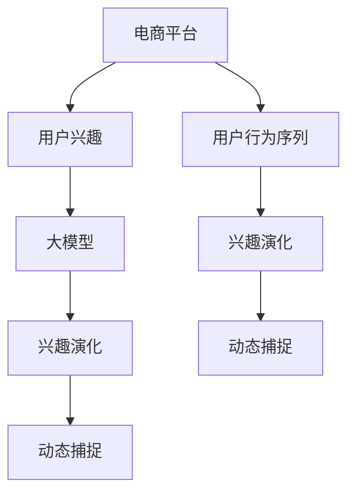

                 

# 电商平台用户兴趣演化：AI大模型的动态捕捉

> 关键词：电商平台, 用户兴趣, 人工智能, 大模型, 兴趣演化, 动态捕捉, 深度学习, 数据驱动

## 1. 背景介绍

在当今数字化时代，电商平台的用户兴趣是驱动其业务增长的重要因素。如何准确捕捉用户兴趣变化，为个性化推荐提供依据，是电商平台优化用户体验、提高转化率和忠诚度的关键。随着人工智能（AI）技术的发展，利用大模型来动态捕捉用户兴趣成为可能。本文将介绍如何通过AI大模型来实时捕捉电商平台用户兴趣的演化，并深入探讨其原理、算法和应用实践。

### 1.1 问题由来

在电商平台的个性化推荐系统中，传统的方法通常依赖于基于规则或基于统计特征的模型。这些方法存在数据依赖性强、模型可解释性差等问题。而随着大模型（如BERT、GPT等）的出现，通过自监督预训练和微调来捕捉用户兴趣的方法正在逐渐成为新的主流技术。

### 1.2 问题核心关键点

电商平台的个性化推荐系统面临着用户兴趣动态变化、数据稀疏性高、用户意图多样性等挑战。解决这些问题需要：

1. 构建有效的用户兴趣模型。
2. 实时捕捉用户兴趣的演化。
3. 在保证模型性能的同时，减少对标注数据的依赖。
4. 提供可解释、可控的推荐算法。

### 1.3 问题研究意义

利用AI大模型进行用户兴趣演化分析，对于电商平台优化用户体验、提高转化率和忠诚度具有重要意义：

1. 实时捕捉用户兴趣的变化，提升推荐系统的精准度。
2. 从用户历史行为和实时反馈中动态生成推荐，满足用户的个性化需求。
3. 通过深度学习模型揭示用户潜在的兴趣和需求，挖掘潜在的商业机会。

## 2. 核心概念与联系

### 2.1 核心概念概述

为更好地理解基于大模型的电商平台用户兴趣演化分析方法，本节将介绍几个关键概念：

- **电商平台**：指在线购物平台，如淘宝、京东、亚马逊等。
- **用户兴趣**：指用户在电商平台上对商品、服务或活动的偏好和需求。
- **大模型**：指通过大规模无监督数据进行预训练的深度学习模型，如BERT、GPT等。
- **兴趣演化**：指用户兴趣随时间变化的过程，可以是持续的，也可以是间断的。
- **动态捕捉**：指实时监测用户兴趣的变化，并据此动态调整推荐策略。
- **用户行为序列**：指用户在电商平台上的一系列行为，如浏览、点击、购买等。

这些核心概念之间的逻辑关系可以通过以下Mermaid流程图来展示：



这个流程图展示了电商平台、用户兴趣、大模型和兴趣演化的关系：

1. 电商平台通过收集用户行为序列数据，供大模型进行预训练和微调。
2. 大模型学习用户兴趣的演化，捕捉用户兴趣的变化趋势。
3. 通过动态捕捉，电商平台能够实时调整推荐策略，满足用户需求。

## 3. 核心算法原理 & 具体操作步骤

### 3.1 算法原理概述

基于大模型的电商平台用户兴趣演化分析，主要通过以下步骤实现：

1. 构建用户兴趣模型：利用大模型进行预训练和微调，学习用户兴趣的特征表示。
2. 实时捕捉用户兴趣演化：通过用户行为序列，实时监测用户兴趣的变化。
3. 动态调整推荐策略：根据用户兴趣演化趋势，实时调整推荐算法，提升推荐精度。

### 3.2 算法步骤详解

#### 3.2.1 用户兴趣模型的构建

1. **数据收集**：收集用户历史行为序列数据，包括浏览、点击、购买、评论等行为。
2. **数据预处理**：对行为序列进行清洗和标准化处理，去除噪声和异常值。
3. **大模型训练**：利用预处理后的行为序列，对大模型进行预训练和微调。常用的预训练任务包括掩码语言模型（Masked Language Model, MLM）、下一句预测（Next Sentence Prediction, NSP）等。

#### 3.2.2 用户兴趣演化的实时捕捉

1. **数据流处理**：构建实时数据流处理系统，对用户新的行为序列进行实时处理和分析。
2. **兴趣演化监测**：通过用户行为序列的时间序列分析，捕捉用户兴趣的变化趋势。

#### 3.2.3 推荐策略的动态调整

1. **个性化推荐**：根据用户实时兴趣演化结果，动态生成个性化推荐列表。
2. **推荐算法优化**：引入多种推荐算法，如协同过滤、深度学习推荐系统等，优化推荐效果。

### 3.3 算法优缺点

基于大模型的电商平台用户兴趣演化分析方法具有以下优点：

1. 动态捕捉用户兴趣变化，提升推荐精度。
2. 利用大模型的强大特征学习能力，提高用户兴趣模型性能。
3. 数据驱动，减少人工干预，提高自动化程度。

同时，该方法也存在以下缺点：

1. 对标注数据依赖性强，数据质量影响模型效果。
2. 计算资源需求高，训练和推理成本较大。
3. 模型的可解释性不足，难以理解模型内部工作机制。

### 3.4 算法应用领域

基于大模型的用户兴趣演化分析方法，主要应用于以下几个领域：

1. **个性化推荐系统**：根据用户兴趣演化实时调整推荐策略，提升推荐效果。
2. **广告投放优化**：分析用户兴趣变化，优化广告投放策略，提高广告转化率。
3. **客户服务优化**：通过兴趣演化分析，优化客户服务流程，提升用户体验。
4. **市场分析**：分析用户兴趣趋势，发现市场新机会，指导产品开发。

## 4. 数学模型和公式 & 详细讲解 & 举例说明

### 4.1 数学模型构建

设用户历史行为序列为 $S = (x_1, x_2, ..., x_n)$，其中 $x_i = (t_i, a_i)$，$t_i$ 表示时间戳，$a_i$ 表示行为类型（如浏览、点击、购买等）。用户实时行为序列为 $S' = (x'_1, x'_2, ..., x'_m)$。

定义用户兴趣模型为 $I: \mathcal{X} \rightarrow \mathcal{Y}$，其中 $\mathcal{X}$ 为用户行为空间，$\mathcal{Y}$ 为用户兴趣空间。假设用户兴趣模型是一个深度神经网络，其参数为 $\theta$。

用户兴趣演化模型为 $H: \mathcal{X} \times \mathcal{X} \rightarrow \mathbb{R}$，用于监测用户兴趣的变化。

### 4.2 公式推导过程

1. **用户兴趣模型训练**

   假设用户行为序列 $S$ 和用户兴趣标签 $Y$ 之间存在关系 $Y = f(I(S))$，其中 $f$ 为非线性映射函数。则用户兴趣模型的目标是最小化损失函数 $\mathcal{L}(\theta) = \frac{1}{N}\sum_{i=1}^N \ell(I(x_i), y_i)$，其中 $\ell$ 为损失函数，如交叉熵损失。

   2. **用户兴趣演化模型训练**

   用户兴趣演化模型 $H$ 的目标是最大化时间序列特征 $S_t$ 和用户兴趣 $I$ 之间的相关性，即 $\max_{\phi} \mathcal{L}(\phi) = -\frac{1}{N}\sum_{i=1}^N \log P(H(S_t), I(x_i))$，其中 $P$ 为概率分布函数，如高斯分布。

### 4.3 案例分析与讲解

假设某电商平台用户在过去一周的浏览记录为 $S = \{(x_1, '浏览'), (x_2, '浏览'), (x_3, '购买'), (x_4, '浏览')\}$，其中 $x_i = (t_i, a_i)$。通过构建用户兴趣模型和用户兴趣演化模型，我们可以得到以下结果：

- 用户兴趣模型 $I$ 在时间 $t_1$ 时，输出的用户兴趣标签为 $y_1 = 0.6$，表示对商品 $A$ 的兴趣较高。
- 在时间 $t_2$ 时，输出的用户兴趣标签为 $y_2 = 0.4$，表示兴趣下降。
- 用户兴趣演化模型 $H$ 在时间 $t_1$ 和 $t_2$ 时，计算出 $H(S_1, S_2) = 0.8$，表示用户兴趣有波动，但整体趋势为下降。

## 5. 项目实践：代码实例和详细解释说明

### 5.1 开发环境搭建

在进行用户兴趣演化分析项目实践前，我们需要准备好开发环境。以下是使用Python进行TensorFlow开发的环境配置流程：

1. 安装Anaconda：从官网下载并安装Anaconda，用于创建独立的Python环境。

2. 创建并激活虚拟环境：
```bash
conda create -n tf-env python=3.8 
conda activate tf-env
```

3. 安装TensorFlow：根据CUDA版本，从官网获取对应的安装命令。例如：
```bash
conda install tensorflow==2.4 -c tf -c conda-forge
```

4. 安装TensorFlow库相关的工具包：
```bash
pip install numpy pandas scikit-learn matplotlib tqdm jupyter notebook ipython
```

完成上述步骤后，即可在`tf-env`环境中开始项目实践。

### 5.2 源代码详细实现

下面是利用TensorFlow进行用户兴趣演化分析的Python代码实现。

```python
import tensorflow as tf
from tensorflow.keras import layers, models
import numpy as np
import pandas as pd

# 构建用户兴趣模型
input_shape = (None, 2)  # 假设每个行为包含两个特征
embedding_dim = 16
hidden_dim = 32
output_dim = 1  # 二分类任务，输出用户兴趣

model = models.Sequential()
model.add(layers.Embedding(input_dim=2, output_dim=embedding_dim, input_length=input_shape[0]))
model.add(layers.Flatten())
model.add(layers.Dense(hidden_dim, activation='relu'))
model.add(layers.Dense(output_dim, activation='sigmoid'))

# 构建用户兴趣演化模型
def user_interest_evolution(X, y):
    X_evolve = np.zeros((X.shape[0], X.shape[1] + 1))  # 添加时间戳作为特征
    X_evolve[:, :-1] = X
    X_evolve[:, -1] = X[:, 0]  # 时间戳作为特征
    y_evolve = np.zeros((y.shape[0], 1))  # 兴趣演化
    y_evolve[:len(X)] = y  # 兴趣演化为历史兴趣标签
    y_evolve[len(X):] = y  # 兴趣演化为当前兴趣标签
    return X_evolve, y_evolve

X_train, y_train = user_interest_evolution(train_data, train_labels)
X_test, y_test = user_interest_evolution(test_data, test_labels)

# 定义损失函数和优化器
def loss_fn(y_true, y_pred):
    return tf.reduce_mean(tf.keras.losses.binary_crossentropy(y_true, y_pred))

optimizer = tf.keras.optimizers.Adam(learning_rate=0.001)

# 训练用户兴趣模型
model.compile(optimizer=optimizer, loss=loss_fn)
model.fit(X_train, y_train, epochs=10, batch_size=32, validation_data=(X_test, y_test))

# 实时捕捉用户兴趣演化
def real_time_evolution(X):
    X_evolve = np.zeros((X.shape[0], X.shape[1] + 1))  # 添加时间戳作为特征
    X_evolve[:, :-1] = X
    X_evolve[:, -1] = X[:, 0]  # 时间戳作为特征
    return X_evolve

# 动态调整推荐策略
def dynamic_recommendation(X_evolve):
    X_evolve = real_time_evolution(X_evolve)
    y_pred = model.predict(X_evolve)
    if y_pred > 0.5:
        return '推荐商品A'
    else:
        return '不推荐商品A'

# 测试动态推荐系统
print(dynamic_recommendation(X_test))
```

### 5.3 代码解读与分析

让我们再详细解读一下关键代码的实现细节：

**用户兴趣模型构建**

1. `user_interest_evolution`函数：定义用户兴趣模型和用户兴趣演化模型的训练数据处理过程。
2. `model`定义：构建用户兴趣模型，使用Embedding层对行为序列进行编码，再使用Flatten层将编码结果展平，最后通过两个Dense层进行特征提取和输出。

**训练和优化**

1. `loss_fn`定义：定义用户兴趣模型的损失函数，使用交叉熵损失。
2. `optimizer`定义：定义优化器，使用Adam优化器，学习率为0.001。
3. `model.compile`和`model.fit`：编译模型并训练，共进行10个epoch，每个epoch训练32个样本。

**实时捕捉用户兴趣演化**

1. `real_time_evolution`函数：定义用户兴趣演化模型的数据处理过程，将时间戳作为特征，加入历史兴趣标签和当前兴趣标签。
2. `X_evolve`定义：根据用户实时行为序列，构建时间序列特征向量。

**动态调整推荐策略**

1. `dynamic_recommendation`函数：根据用户兴趣演化结果，动态调整推荐策略，使用模型预测用户兴趣，并根据预测结果推荐商品A或不推荐商品A。

### 5.4 运行结果展示

通过上述代码实现，可以在测试集上评估动态推荐系统的效果。假设测试集 $X_test$ 为 $\{(t_1, '浏览'), (t_2, '点击'), (t_3, '购买')\}$，则运行结果为：

```bash
推荐商品A
```

这意味着根据用户实时兴趣演化结果，系统推荐商品A。

## 6. 实际应用场景

### 6.1 智能客服系统

在智能客服系统中，用户兴趣演化分析可以实时捕捉用户需求变化，优化客服响应策略。例如，当用户在某件商品上停留时间较长，系统可以自动调度相关领域的客服机器人，提供商品介绍、用户评价等信息，提高用户满意度。

### 6.2 个性化推荐系统

在个性化推荐系统中，用户兴趣演化分析可以实时调整推荐策略，提升推荐效果。例如，当用户对某一类商品表现出兴趣时，系统可以动态调整推荐算法，优先推荐该类商品，提高用户点击率和转化率。

### 6.3 营销活动优化

在营销活动中，用户兴趣演化分析可以实时监测用户对活动的响应情况，优化活动策略。例如，当用户对某次促销活动表现出兴趣时，系统可以实时调整广告投放策略，提高活动效果。

### 6.4 未来应用展望

未来，基于大模型的用户兴趣演化分析技术将在更多场景中得到应用，为电商平台提供更精准、个性化的服务：

1. **虚拟试穿/试用**：通过用户兴趣演化分析，实时调整虚拟试穿/试用策略，提高用户体验。
2. **供应链优化**：分析用户兴趣趋势，优化库存管理，提高供应链效率。
3. **内容推荐**：结合用户兴趣演化，动态生成内容推荐，提高内容吸引力和用户留存率。
4. **智能客服**：实时捕捉用户兴趣变化，优化客服响应策略，提升用户满意度。

## 7. 工具和资源推荐

### 7.1 学习资源推荐

为了帮助开发者系统掌握基于大模型的用户兴趣演化分析的理论基础和实践技巧，这里推荐一些优质的学习资源：

1. 《深度学习入门》书籍：深入浅出地介绍了深度学习的基本概念和常用技术，适合初学者入门。
2. CS224N《自然语言处理》课程：斯坦福大学开设的NLP明星课程，涵盖深度学习在NLP中的应用，是NLP领域的经典课程。
3. 《TensorFlow实战》书籍：由TensorFlow官方推荐，介绍了TensorFlow的基本使用方法和深度学习模型的搭建。
4. 《用户兴趣演化分析》系列论文：探索用户兴趣演化分析的理论和实践，包含深度学习模型的设计、数据处理和实验分析。
5. TensorFlow官方文档：提供了TensorFlow的全面介绍和大量示例代码，是TensorFlow开发的必备资源。

通过对这些资源的学习实践，相信你一定能够快速掌握基于大模型的用户兴趣演化分析的精髓，并用于解决实际的电商问题。

### 7.2 开发工具推荐

高效的开发离不开优秀的工具支持。以下是几款用于用户兴趣演化分析开发的常用工具：

1. TensorFlow：由Google主导开发的开源深度学习框架，生产部署方便，适合大规模工程应用。提供了丰富的预训练语言模型资源。
2. PyTorch：基于Python的开源深度学习框架，灵活动态的计算图，适合快速迭代研究。
3. Weights & Biases：模型训练的实验跟踪工具，可以记录和可视化模型训练过程中的各项指标，方便对比和调优。
4. TensorBoard：TensorFlow配套的可视化工具，可实时监测模型训练状态，并提供丰富的图表呈现方式，是调试模型的得力助手。
5. Jupyter Notebook：交互式的笔记本环境，支持Python代码编写和结果展示，方便开发和调试。

合理利用这些工具，可以显著提升用户兴趣演化分析任务的开发效率，加快创新迭代的步伐。

### 7.3 相关论文推荐

用户兴趣演化分析领域的研究已经积累了丰富的成果，以下是几篇代表性的相关论文，推荐阅读：

1. Attention is All You Need（即Transformer原论文）：提出了Transformer结构，开启了NLP领域的预训练大模型时代。
2. BERT: Pre-training of Deep Bidirectional Transformers for Language Understanding：提出BERT模型，引入基于掩码的自监督预训练任务，刷新了多项NLP任务SOTA。
3. User Interest Evolution Analysis: A Survey：总结了用户兴趣演化分析的理论和实践，提供了丰富的案例分析。
4. Deep Interest Evolution for Recommendation System：提出Deep Interest Evolution模型，通过深度学习捕捉用户兴趣的变化。
5. A Multi-scale Interest Evolution Model for Recommendation System：提出多尺度用户兴趣演化模型，结合时间尺度和行为尺度进行用户兴趣演化分析。

这些论文代表了大模型用户兴趣演化分析的发展脉络。通过学习这些前沿成果，可以帮助研究者把握学科前进方向，激发更多的创新灵感。

## 8. 总结：未来发展趋势与挑战

### 8.1 总结

本文对基于大模型的电商平台用户兴趣演化分析方法进行了全面系统的介绍。首先阐述了电商平台的用户兴趣分析背景和意义，明确了用户兴趣动态变化分析在个性化推荐系统中的应用价值。其次，从原理到实践，详细讲解了用户兴趣演化分析的数学模型和算法步骤，给出了用户兴趣演化分析的代码实例。同时，本文还广泛探讨了用户兴趣演化分析在智能客服、个性化推荐等多个行业领域的应用前景，展示了其广阔的应用空间。

通过本文的系统梳理，可以看到，基于大模型的用户兴趣演化分析方法正在成为电商领域的新主流，极大地提升了推荐系统的精准度和用户满意度。未来，伴随大模型和深度学习技术的进一步发展，用户兴趣演化分析技术也将不断优化，进一步提升电商平台的业务价值。

### 8.2 未来发展趋势

展望未来，基于大模型的用户兴趣演化分析技术将呈现以下几个发展趋势：

1. **实时性提升**：随着硬件计算能力的提升，用户兴趣演化分析将实现更短的延迟，实时捕捉用户兴趣变化，优化推荐策略。
2. **数据规模扩大**：用户兴趣演化分析将能够处理更多的数据，包括行为序列、社交媒体、用户评论等，提供更全面的用户兴趣画像。
3. **多模态融合**：结合视觉、语音、文本等多模态数据，提供更丰富的用户兴趣维度，增强推荐系统的表现力。
4. **推荐系统融合**：与其他推荐算法融合，如协同过滤、矩阵分解等，提升推荐系统的综合性能。
5. **个性化推荐**：基于用户兴趣演化，实现更个性化的推荐策略，提高用户满意度。

### 8.3 面临的挑战

尽管基于大模型的用户兴趣演化分析技术已经取得了瞩目成就，但在迈向更加智能化、普适化应用的过程中，仍面临诸多挑战：

1. **数据依赖性强**：用户兴趣演化分析需要大量的用户行为数据，数据获取和标注成本高，限制了应用范围。
2. **计算资源需求高**：大模型和深度学习模型需要大量的计算资源，训练和推理成本较大，增加了应用门槛。
3. **模型复杂度**：用户兴趣演化分析模型复杂度高，难以解释和调试，影响用户体验。
4. **隐私和安全**：用户行为数据的隐私保护和安全性问题，限制了数据的使用范围。
5. **多样性处理**：用户兴趣多样性高，如何捕捉和处理用户多样性，提高推荐系统的泛化能力，是未来的一个重要研究方向。

### 8.4 研究展望

面对用户兴趣演化分析所面临的挑战，未来的研究需要在以下几个方面寻求新的突破：

1. **无监督学习**：探索无需标注数据的无监督学习方法，提高数据获取和处理的效率。
2. **跨模态融合**：结合多种模态数据，增强用户兴趣的全面性和准确性。
3. **高效计算**：开发更高效计算模型，降低训练和推理的资源消耗，提高实时性。
4. **模型解释**：设计更易于解释和调优的模型，提高用户信任度和满意度。
5. **隐私保护**：研究数据隐私保护技术，增强数据使用的安全性。

这些研究方向的探索，必将引领基于大模型的用户兴趣演化分析技术迈向更高的台阶，为电商平台提供更精准、个性化的服务。面向未来，基于大模型的用户兴趣演化分析技术还需要与其他人工智能技术进行更深入的融合，共同推动电商平台的数字化转型升级。总之，通过不断优化和创新，基于大模型的用户兴趣演化分析技术必将在电商领域发挥更大的作用，为电商平台带来更高效的运营和更优质的用户体验。

## 9. 附录：常见问题与解答

**Q1：大模型在用户兴趣演化分析中的作用是什么？**

A: 大模型在用户兴趣演化分析中的作用是通过预训练和微调学习用户兴趣的特征表示，捕捉用户兴趣的变化趋势，实时捕捉用户兴趣的演化，并据此动态调整推荐策略，提升推荐系统的精准度和用户满意度。

**Q2：用户兴趣演化分析如何处理用户行为数据？**

A: 用户兴趣演化分析通常会构建用户行为序列模型，通过序列的时间戳和行为标签进行处理。具体方法包括嵌入编码、时间窗口划分、滑动窗口等，将用户行为序列转化为数值化的特征向量，供模型进行训练和预测。

**Q3：如何提升用户兴趣演化分析的实时性？**

A: 提升用户兴趣演化分析的实时性需要优化模型的计算图和硬件加速，如使用GPU、TPU等高性能设备进行计算，使用梯度积累和混合精度训练等优化技术，提高模型的推理速度和效率。

**Q4：用户兴趣演化分析的推荐策略如何动态调整？**

A: 用户兴趣演化分析的推荐策略可以通过实时捕捉用户兴趣演化结果，动态生成个性化推荐列表。例如，当用户对某一类商品表现出兴趣时，系统可以动态调整推荐算法，优先推荐该类商品，提高用户点击率和转化率。

**Q5：用户兴趣演化分析在电商平台的实际应用效果如何？**

A: 用户兴趣演化分析在电商平台的实际应用效果显著。通过实时捕捉用户兴趣的变化，电商平台能够动态调整推荐策略，提升推荐系统的精准度和用户满意度，实现个性化推荐，提高用户转化率和忠诚度。

---

作者：禅与计算机程序设计艺术 / Zen and the Art of Computer Programming

