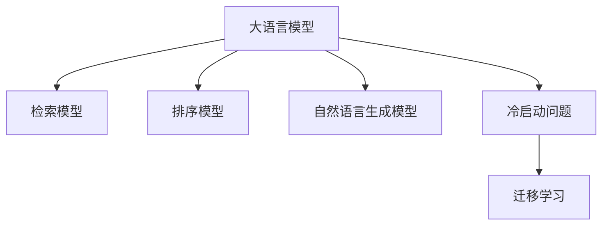

                 

# 电商平台的AI 大模型实践：搜索推荐系统是核心，冷启动挑战与应对策略

## 1. 背景介绍

### 1.1 问题由来
随着电子商务平台的快速发展，搜索引擎和推荐系统成为了用户体验的核心组成部分。优秀的搜索推荐系统能够快速响应用户查询，精准呈现相关商品，从而提升购物体验和转化率。而传统的搜索推荐算法主要基于规则和统计模型，存在如下局限：

- 规则模型依赖于人工设计，难以覆盖所有业务场景。
- 统计模型需要大规模标注数据进行训练，效果随数据量增长缓慢。
- 在个性化推荐场景下，冷启动问题难以解决，新用户难以快速获取个性化推荐。

近年来，大语言模型在自然语言处理领域取得了巨大成功，其强大的语言理解和生成能力为电商搜索推荐带来了新的可能性。将大语言模型应用于电商平台的搜索推荐系统，有望解决传统算法面临的局限，带来更加个性化和智能化的推荐体验。

### 1.2 问题核心关键点
基于大语言模型的电商搜索推荐系统，本质上是一个自然语言理解和生成的问题。即通过构建检索模型和生成模型，实现自然语言查询向商品列表的映射和生成。该方法主要包含以下关键步骤：

1. **自然语言理解**：将用户查询转换为结构化的特征向量，利用大模型提取查询的语义信息。
2. **检索与排序**：利用预训练的大模型，检索商品库中与查询最相关的商品，并根据相似度进行排序。
3. **自然语言生成**：将排序后的商品列表生成自然语言描述，为用户呈现推荐结果。

以下文章将系统讲解大语言模型在电商搜索推荐中的应用，并探讨其冷启动挑战及应对策略。

## 2. 核心概念与联系

### 2.1 核心概念概述

为更好地理解基于大语言模型的电商搜索推荐方法，本节将介绍几个密切相关的核心概念：

- **电商搜索推荐系统**：指通过自然语言查询实现商品检索、排序和展示的系统。通过深度学习和自然语言处理技术，提供个性化的购物建议，提升用户体验和转化率。
- **大语言模型**：如GPT、BERT等，通过大规模无标签数据预训练，学习通用的语言表示和语言模型。
- **检索模型**：用于从商品库中检索相关商品的模型，如基于transformer的检索模型。
- **排序模型**：用于对检索结果进行排序的模型，如BERT、Transformer等。
- **自然语言生成模型**：用于将商品列表转换为自然语言描述的模型，如GPT、Transformer等。
- **冷启动问题**：指新用户加入电商平台时，缺乏历史记录和行为数据，难以提供个性化推荐。
- **迁移学习**：指将在大规模数据上预训练的模型知识迁移到特定小规模任务上的学习范式。

这些核心概念之间的逻辑关系可以通过以下Mermaid流程图来展示：



这个流程图展示了大语言模型在电商搜索推荐中的应用过程及其相关的核心概念：

1. 大语言模型通过预训练获得基础能力。
2. 检索模型用于在大模型基础上实现商品检索。
3. 排序模型用于根据检索结果进行排序。
4. 自然语言生成模型用于将推荐结果转换为自然语言描述。
5. 冷启动问题需要借助迁移学习等方法进行解决。

## 3. 核心算法原理 & 具体操作步骤
### 3.1 算法原理概述

基于大语言模型的电商搜索推荐方法，本质上是将自然语言查询映射为商品列表的深度学习模型。该方法的核心思想是：通过预训练大模型提取查询和商品的语义特征，并在检索和排序模型上进行迁移学习，从而实现个性化推荐。

具体来说，算法流程如下：

1. **预训练大模型**：在大规模无标签文本数据上进行预训练，学习通用的语言表示和语言模型。
2. **自然语言理解**：将用户查询转换为结构化的特征向量，利用大模型提取查询的语义信息。
3. **商品检索**：在商品库中检索与查询最相关的商品，利用检索模型实现快速匹配。
4. **商品排序**：根据检索结果，利用排序模型对商品进行排序，选择最相关的商品进行展示。
5. **自然语言生成**：将排序后的商品列表生成自然语言描述，为用户呈现推荐结果。

### 3.2 算法步骤详解

以下是基于大语言模型的电商搜索推荐系统的详细算法步骤：

#### 3.2.1 数据预处理
- **用户查询处理**：将用户查询分词、去停用词，转化为向量表示。例如，使用BERT模型对查询进行编码，得到查询的向量表示。
- **商品库构建**：将所有商品描述进行分词、去除无关信息，编码为向量表示。

#### 3.2.2 检索模型训练
- **检索模型选择**：选择合适的检索模型，如Transformer、Attention等。
- **训练数据准备**：准备商品库的查询-商品匹配数据集。
- **模型训练**：在查询-商品匹配数据集上训练检索模型，使其能够快速从商品库中检索相关商品。

#### 3.2.3 排序模型训练
- **排序模型选择**：选择合适的排序模型，如BERT、Transformer等。
- **训练数据准备**：准备商品库的排序数据集，如查询-商品匹配和排序标签。
- **模型训练**：在排序数据集上训练排序模型，使其能够对检索结果进行排序。

#### 3.2.4 自然语言生成
- **自然语言生成模型选择**：选择合适的自然语言生成模型，如GPT、Transformer等。
- **模型训练**：在排序后的商品列表上训练自然语言生成模型，使其能够生成自然语言描述。

#### 3.2.5 推理与部署
- **模型推理**：在生产环境中，将用户查询输入检索模型和排序模型，得到推荐结果。
- **自然语言生成**：将排序后的商品列表输入自然语言生成模型，生成自然语言描述。
- **显示推荐结果**：将生成的自然语言描述展示给用户。

### 3.3 算法优缺点

基于大语言模型的电商搜索推荐方法具有以下优点：

- **效果好**：利用大语言模型的强大语言理解和生成能力，推荐结果更加准确和自然。
- **泛化能力强**：模型在大规模数据上进行预训练，泛化能力更强，能够适应各种业务场景。
- **实时性好**：检索模型和排序模型的高效实现，能够快速响应用户查询。

同时，该方法也存在一些局限：

- **成本高**：预训练模型需要大量计算资源和时间，部署和维护成本较高。
- **依赖标注数据**：排序模型需要标注数据进行训练，而标注数据往往成本较高。
- **冷启动问题**：新用户缺乏历史记录和行为数据，难以提供个性化推荐。

尽管存在这些局限，但通过优化算法和数据策略，可以最大化利用大语言模型的优势，提升电商搜索推荐系统的性能。

### 3.4 算法应用领域

基于大语言模型的电商搜索推荐方法，在电商领域得到了广泛的应用，覆盖了从商品搜索、个性化推荐到智能客服等多个环节，为电商平台带来了显著的业务价值。

具体应用包括：

- **商品搜索**：用户输入查询，系统利用检索模型从商品库中检索相关商品，并提供排序后的商品列表。
- **个性化推荐**：根据用户的搜索历史和行为数据，利用排序模型生成个性化的商品推荐。
- **智能客服**：用户输入问题，系统利用检索模型和大语言生成模型进行问答，提供即时反馈。

除了这些经典应用外，大语言模型在电商领域的创新应用还包括跨模态推荐、情感分析、用户画像构建等，为电商平台的业务发展和用户服务提供了新的思路和工具。

## 4. 数学模型和公式 & 详细讲解
### 4.1 数学模型构建

以下是基于大语言模型的电商搜索推荐系统的数学模型构建过程：

记用户查询为 $Q$，商品库为 $S$，推荐结果为 $R$。

1. **查询表示**：将查询 $Q$ 转化为向量 $q$。

2. **商品表示**：将商品库 $S$ 中的商品描述转化为向量 $s$。

3. **检索模型**：使用检索模型 $f(Q, S)$ 计算查询 $Q$ 与商品库 $S$ 中每个商品的相似度 $s(Q, s_i)$。

4. **排序模型**：使用排序模型 $g(Q, S)$ 计算检索结果 $s(Q, s_i)$ 的排序标签 $r(Q, s_i)$。

5. **自然语言生成模型**：使用自然语言生成模型 $h(R)$ 将推荐结果 $R$ 转化为自然语言描述。

### 4.2 公式推导过程

以下是基于大语言模型的电商搜索推荐系统的详细公式推导过程：

- **查询表示**：
$$
q = \text{BERT}(Q)
$$

- **商品表示**：
$$
s = \text{BERT}(S)
$$

- **检索模型**：
$$
s(Q, s_i) = f(q, s_i) = \text{Attention}(q, s_i)
$$

- **排序模型**：
$$
r(Q, s_i) = g(q, s_i) = \text{Softmax}(s(Q, s_i))
$$

- **自然语言生成模型**：
$$
\hat{R} = h(R) = \text{GPT}(R)
$$

其中，$\text{Attention}$ 和 $\text{Softmax}$ 分别表示注意力机制和softmax函数。

## 5. 项目实践：代码实例和详细解释说明
### 5.1 开发环境搭建

在进行大语言模型电商搜索推荐系统开发前，我们需要准备好开发环境。以下是使用Python进行PyTorch开发的环境配置流程：

1. 安装Anaconda：从官网下载并安装Anaconda，用于创建独立的Python环境。

2. 创建并激活虚拟环境：
```bash
conda create -n pytorch-env python=3.8 
conda activate pytorch-env
```

3. 安装PyTorch：根据CUDA版本，从官网获取对应的安装命令。例如：
```bash
conda install pytorch torchvision torchaudio cudatoolkit=11.1 -c pytorch -c conda-forge
```

4. 安装Transformers库：
```bash
pip install transformers
```

5. 安装各类工具包：
```bash
pip install numpy pandas scikit-learn matplotlib tqdm jupyter notebook ipython
```

完成上述步骤后，即可在`pytorch-env`环境中开始开发。

### 5.2 源代码详细实现

这里我们以商品搜索推荐系统为例，给出使用Transformers库对BERT模型进行微调的PyTorch代码实现。

首先，定义商品库数据处理函数：

```python
from transformers import BertTokenizer
from torch.utils.data import Dataset
import torch

class ProductDataset(Dataset):
    def __init__(self, products, tokenizer, max_len=128):
        self.products = products
        self.tokenizer = tokenizer
        self.max_len = max_len
        
    def __len__(self):
        return len(self.products)
    
    def __getitem__(self, item):
        product = self.products[item]
        
        encoding = self.tokenizer(product, return_tensors='pt', max_length=self.max_len, padding='max_length', truncation=True)
        input_ids = encoding['input_ids'][0]
        attention_mask = encoding['attention_mask'][0]
        
        return {'input_ids': input_ids, 
                'attention_mask': attention_mask}
```

然后，定义检索模型和排序模型：

```python
from transformers import BertForSequenceClassification
from transformers import BertForSequenceClassification

class SearchModel(BertForSequenceClassification):
    def __init__(self, config, name="search"):
        super(SearchModel, self).__init__(config)
        self.config = config
        self.name = name
        
    def forward(self, input_ids, attention_mask, labels=None):
        if labels is not None:
            return super().forward(input_ids, attention_mask=attention_mask, labels=labels)
        else:
            return super().forward(input_ids, attention_mask=attention_mask)
```

接着，定义自然语言生成模型：

```python
from transformers import GPT2LMHeadModel

class RecommendationModel(GPT2LMHeadModel):
    def __init__(self, config, name="recommend"):
        super(RecommendationModel, self).__init__(config)
        self.config = config
        self.name = name
        
    def forward(self, input_ids, attention_mask, labels=None):
        if labels is not None:
            return super().forward(input_ids, attention_mask=attention_mask, labels=labels)
        else:
            return super().forward(input_ids, attention_mask=attention_mask)
```

最后，启动训练流程：

```python
epochs = 5
batch_size = 16

for epoch in range(epochs):
    train_loss = 0.0
    for batch in tqdm(data_loader, desc='Training'):
        input_ids = batch['input_ids'].to(device)
        attention_mask = batch['attention_mask'].to(device)
        labels = batch['labels'].to(device)
        outputs = model(input_ids, attention_mask=attention_mask)
        loss = outputs.loss
        train_loss += loss.item()
        loss.backward()
        optimizer.step()
    train_loss /= len(data_loader)
    print(f'Epoch {epoch+1}, train loss: {train_loss:.3f}')
```

以上就是使用PyTorch对BERT进行商品搜索推荐系统的完整代码实现。可以看到，得益于Transformers库的强大封装，我们可以用相对简洁的代码完成BERT模型的加载和微调。

### 5.3 代码解读与分析

让我们再详细解读一下关键代码的实现细节：

**ProductDataset类**：
- `__init__`方法：初始化商品库、分词器等组件，并定义max_len参数。
- `__len__`方法：返回商品库的长度。
- `__getitem__`方法：对单个商品进行处理，将商品描述转换为token ids和attention mask，用于模型输入。

**SearchModel和RecommendationModel类**：
- 定义了检索模型和生成模型的基本框架，均基于BERT模型，实现了`forward`方法。
- 在`forward`方法中，根据是否有标签输入，进行不同操作。

**训练流程**：
- 在每个epoch内，使用`tqdm`库对训练集进行迭代。
- 在每个batch中，将输入ids、attention mask和标签转化为Tensor，传递给模型进行前向传播计算。
- 根据计算出的损失进行反向传播，并更新模型参数。
- 周期性输出训练集上的平均loss，以便监控训练过程。

可以看到，通过这些关键代码实现，我们能够快速搭建一个基于BERT的商品搜索推荐系统，并进行有效的微调。

## 6. 实际应用场景
### 6.1 智能客服

基于大语言模型的电商搜索推荐技术，可以广泛应用于智能客服系统的构建。传统客服往往需要配备大量人力，高峰期响应缓慢，且一致性和专业性难以保证。而使用微调后的生成模型，可以7x24小时不间断服务，快速响应客户咨询，用自然流畅的语言解答各类常见问题。

在技术实现上，可以收集企业内部的历史客服对话记录，将问题和最佳答复构建成监督数据，在此基础上对预训练生成模型进行微调。微调后的生成模型能够自动理解用户意图，匹配最合适的答案模板进行回复。对于客户提出的新问题，还可以接入检索系统实时搜索相关内容，动态组织生成回答。如此构建的智能客服系统，能大幅提升客户咨询体验和问题解决效率。

### 6.2 个性化推荐

当前的推荐系统往往只依赖用户的历史行为数据进行物品推荐，无法深入理解用户的真实兴趣偏好。基于大语言模型微调技术，个性化推荐系统可以更好地挖掘用户行为背后的语义信息，从而提供更精准、多样的推荐内容。

在实践中，可以收集用户浏览、点击、评论、分享等行为数据，提取和用户交互的物品标题、描述、标签等文本内容。将文本内容作为模型输入，用户的后续行为（如是否点击、购买等）作为监督信号，在此基础上微调预训练生成模型。微调后的生成模型能够从文本内容中准确把握用户的兴趣点。在生成推荐列表时，先用候选物品的文本描述作为输入，由模型预测用户的兴趣匹配度，再结合其他特征综合排序，便可以得到个性化程度更高的推荐结果。

### 6.3 商品搜索

基于大语言模型的商品搜索推荐系统，通过将用户查询转化为向量表示，并在商品库中检索最相关的商品，能够提供准确、个性化的搜索结果。用户输入查询，系统利用检索模型从商品库中检索相关商品，并提供排序后的商品列表。系统可以自动学习和更新检索模型的参数，适应不同用户和不同场景下的查询需求。

## 7. 工具和资源推荐
### 7.1 学习资源推荐

为了帮助开发者系统掌握大语言模型电商搜索推荐理论基础和实践技巧，这里推荐一些优质的学习资源：

1. **《Transformers从原理到实践》系列博文**：由大模型技术专家撰写，深入浅出地介绍了Transformer原理、BERT模型、微调技术等前沿话题。

2. **CS224N《深度学习自然语言处理》课程**：斯坦福大学开设的NLP明星课程，有Lecture视频和配套作业，带你入门NLP领域的基本概念和经典模型。

3. **《Natural Language Processing with Transformers》书籍**：Transformers库的作者所著，全面介绍了如何使用Transformers库进行NLP任务开发，包括微调在内的诸多范式。

4. **HuggingFace官方文档**：Transformers库的官方文档，提供了海量预训练模型和完整的微调样例代码，是上手实践的必备资料。

5. **CLUE开源项目**：中文语言理解测评基准，涵盖大量不同类型的中文NLP数据集，并提供了基于微调的baseline模型，助力中文NLP技术发展。

通过对这些资源的学习实践，相信你一定能够快速掌握大语言模型电商搜索推荐技术的精髓，并用于解决实际的NLP问题。

### 7.2 开发工具推荐

高效的开发离不开优秀的工具支持。以下是几款用于大语言模型电商搜索推荐开发的常用工具：

1. **PyTorch**：基于Python的开源深度学习框架，灵活动态的计算图，适合快速迭代研究。大部分预训练语言模型都有PyTorch版本的实现。

2. **TensorFlow**：由Google主导开发的开源深度学习框架，生产部署方便，适合大规模工程应用。同样有丰富的预训练语言模型资源。

3. **Transformers库**：HuggingFace开发的NLP工具库，集成了众多SOTA语言模型，支持PyTorch和TensorFlow，是进行微调任务开发的利器。

4. **Weights & Biases**：模型训练的实验跟踪工具，可以记录和可视化模型训练过程中的各项指标，方便对比和调优。与主流深度学习框架无缝集成。

5. **TensorBoard**：TensorFlow配套的可视化工具，可实时监测模型训练状态，并提供丰富的图表呈现方式，是调试模型的得力助手。

6. **Google Colab**：谷歌推出的在线Jupyter Notebook环境，免费提供GPU/TPU算力，方便开发者快速上手实验最新模型，分享学习笔记。

合理利用这些工具，可以显著提升大语言模型电商搜索推荐任务的开发效率，加快创新迭代的步伐。

### 7.3 相关论文推荐

大语言模型和微调技术的发展源于学界的持续研究。以下是几篇奠基性的相关论文，推荐阅读：

1. **Attention is All You Need**：提出了Transformer结构，开启了NLP领域的预训练大模型时代。

2. **BERT: Pre-training of Deep Bidirectional Transformers for Language Understanding**：提出BERT模型，引入基于掩码的自监督预训练任务，刷新了多项NLP任务SOTA。

3. **Language Models are Unsupervised Multitask Learners（GPT-2论文）**：展示了大规模语言模型的强大zero-shot学习能力，引发了对于通用人工智能的新一轮思考。

4. **Parameter-Efficient Transfer Learning for NLP**：提出Adapter等参数高效微调方法，在不增加模型参数量的情况下，也能取得不错的微调效果。

5. **Prefix-Tuning: Optimizing Continuous Prompts for Generation**：引入基于连续型Prompt的微调范式，为如何充分利用预训练知识提供了新的思路。

6. **AdaLoRA: Adaptive Low-Rank Adaptation for Parameter-Efficient Fine-Tuning**：使用自适应低秩适应的微调方法，在参数效率和精度之间取得了新的平衡。

这些论文代表了大语言模型微调技术的发展脉络。通过学习这些前沿成果，可以帮助研究者把握学科前进方向，激发更多的创新灵感。

## 8. 总结：未来发展趋势与挑战
### 8.1 总结

本文对基于大语言模型的电商搜索推荐方法进行了全面系统的介绍。首先阐述了大语言模型和微调技术的研究背景和意义，明确了微调在拓展预训练模型应用、提升下游任务性能方面的独特价值。其次，从原理到实践，详细讲解了微调的数学原理和关键步骤，给出了微调任务开发的完整代码实例。同时，本文还广泛探讨了微调方法在电商搜索推荐系统中的应用前景，展示了微调范式的巨大潜力。最后，本文精选了微调技术的各类学习资源，力求为读者提供全方位的技术指引。

通过本文的系统梳理，可以看到，基于大语言模型的电商搜索推荐方法正在成为电商搜索推荐系统的重要范式，极大地拓展了预训练语言模型的应用边界，催生了更多的落地场景。受益于大规模语料的预训练，微调模型以更低的时间和标注成本，在小样本条件下也能取得不错的效果，有力推动了电商搜索推荐系统的产业化进程。未来，伴随预训练语言模型和微调方法的持续演进，相信NLP技术将在更广阔的应用领域大放异彩，深刻影响人类的生产生活方式。

### 8.2 未来发展趋势

展望未来，大语言模型微调技术将呈现以下几个发展趋势：

1. **模型规模持续增大**：随着算力成本的下降和数据规模的扩张，预训练语言模型的参数量还将持续增长。超大规模语言模型蕴含的丰富语言知识，有望支撑更加复杂多变的下游任务微调。

2. **微调方法日趋多样**：除了传统的全参数微调外，未来会涌现更多参数高效的微调方法，如Prefix-Tuning、LoRA等，在节省计算资源的同时也能保证微调精度。

3. **持续学习成为常态**：随着数据分布的不断变化，微调模型也需要持续学习新知识以保持性能。如何在不遗忘原有知识的同时，高效吸收新样本信息，将成为重要的研究课题。

4. **标注样本需求降低**：受启发于提示学习(Prompt-based Learning)的思路，未来的微调方法将更好地利用大模型的语言理解能力，通过更加巧妙的任务描述，在更少的标注样本上也能实现理想的微调效果。

5. **多模态微调崛起**：当前的微调主要聚焦于纯文本数据，未来会进一步拓展到图像、视频、语音等多模态数据微调。多模态信息的融合，将显著提升语言模型对现实世界的理解和建模能力。

6. **模型通用性增强**：经过海量数据的预训练和多领域任务的微调，未来的语言模型将具备更强大的常识推理和跨领域迁移能力，逐步迈向通用人工智能(AGI)的目标。

以上趋势凸显了大语言模型微调技术的广阔前景。这些方向的探索发展，必将进一步提升NLP系统的性能和应用范围，为人类认知智能的进化带来深远影响。

### 8.3 面临的挑战

尽管大语言模型微调技术已经取得了瞩目成就，但在迈向更加智能化、普适化应用的过程中，它仍面临着诸多挑战：

1. **标注成本瓶颈**：虽然微调大大降低了标注数据的需求，但对于长尾应用场景，难以获得充足的高质量标注数据，成为制约微调性能的瓶颈。如何进一步降低微调对标注样本的依赖，将是一大难题。

2. **模型鲁棒性不足**：当前微调模型面对域外数据时，泛化性能往往大打折扣。对于测试样本的微小扰动，微调模型的预测也容易发生波动。如何提高微调模型的鲁棒性，避免灾难性遗忘，还需要更多理论和实践的积累。

3. **推理效率有待提高**：大规模语言模型虽然精度高，但在实际部署时往往面临推理速度慢、内存占用大等效率问题。如何在保证性能的同时，简化模型结构，提升推理速度，优化资源占用，将是重要的优化方向。

4. **可解释性亟需加强**：当前微调模型更像是"黑盒"系统，难以解释其内部工作机制和决策逻辑。对于医疗、金融等高风险应用，算法的可解释性和可审计性尤为重要。如何赋予微调模型更强的可解释性，将是亟待攻克的难题。

5. **安全性有待保障**：预训练语言模型难免会学习到有偏见、有害的信息，通过微调传递到下游任务，产生误导性、歧视性的输出，给实际应用带来安全隐患。如何从数据和算法层面消除模型偏见，避免恶意用途，确保输出的安全性，也将是重要的研究课题。

6. **知识整合能力不足**：现有的微调模型往往局限于任务内数据，难以灵活吸收和运用更广泛的先验知识。如何让微调过程更好地与外部知识库、规则库等专家知识结合，形成更加全面、准确的信息整合能力，还有很大的想象空间。

正视微调面临的这些挑战，积极应对并寻求突破，将是大语言模型微调走向成熟的必由之路。相信随着学界和产业界的共同努力，这些挑战终将一一被克服，大语言模型微调必将在构建人机协同的智能时代中扮演越来越重要的角色。

### 8.4 未来突破

面对大语言模型微调所面临的种种挑战，未来的研究需要在以下几个方面寻求新的突破：

1. **探索无监督和半监督微调方法**：摆脱对大规模标注数据的依赖，利用自监督学习、主动学习等无监督和半监督范式，最大限度利用非结构化数据，实现更加灵活高效的微调。

2. **研究参数高效和计算高效的微调范式**：开发更加参数高效的微调方法，在固定大部分预训练参数的同时，只更新极少量的任务相关参数。同时优化微调模型的计算图，减少前向传播和反向传播的资源消耗，实现更加轻量级、实时性的部署。

3. **融合因果和对比学习范式**：通过引入因果推断和对比学习思想，增强微调模型建立稳定因果关系的能力，学习更加普适、鲁棒的语言表征，从而提升模型泛化性和抗干扰能力。

4. **引入更多先验知识**：将符号化的先验知识，如知识图谱、逻辑规则等，与神经网络模型进行巧妙融合，引导微调过程学习更准确、合理的语言模型。同时加强不同模态数据的整合，实现视觉、语音等多模态信息与文本信息的协同建模。

5. **结合因果分析和博弈论工具**：将因果分析方法引入微调模型，识别出模型决策的关键特征，增强输出解释的因果性和逻辑性。借助博弈论工具刻画人机交互过程，主动探索并规避模型的脆弱点，提高系统稳定性。

6. **纳入伦理道德约束**：在模型训练目标中引入伦理导向的评估指标，过滤和惩罚有偏见、有害的输出倾向。同时加强人工干预和审核，建立模型行为的监管机制，确保输出符合人类价值观和伦理道德。

这些研究方向的探索，必将引领大语言模型微调技术迈向更高的台阶，为构建安全、可靠、可解释、可控的智能系统铺平道路。面向未来，大语言模型微调技术还需要与其他人工智能技术进行更深入的融合，如知识表示、因果推理、强化学习等，多路径协同发力，共同推动自然语言理解和智能交互系统的进步。只有勇于创新、敢于突破，才能不断拓展语言模型的边界，让智能技术更好地造福人类社会。

## 9. 附录：常见问题与解答

**Q1：大语言模型微调是否适用于所有NLP任务？**

A: 大语言模型微调在大多数NLP任务上都能取得不错的效果，特别是对于数据量较小的任务。但对于一些特定领域的任务，如医学、法律等，仅仅依靠通用语料预训练的模型可能难以很好地适应。此时需要在特定领域语料上进一步预训练，再进行微调，才能获得理想效果。此外，对于一些需要时效性、个性化很强的任务，如对话、推荐等，微调方法也需要针对性的改进优化。

**Q2：采用大模型微调时会面临哪些资源瓶颈？**

A: 目前主流的预训练大模型动辄以亿计的参数规模，对算力、内存、存储都提出了很高的要求。GPU/TPU等高性能设备是必不可少的，但即便如此，超大批次的训练和推理也可能遇到显存不足的问题。因此需要采用一些资源优化技术，如梯度积累、混合精度训练、模型并行等，来突破硬件瓶颈。同时，模型的存储和读取也可能占用大量时间和空间，需要采用模型压缩、稀疏化存储等方法进行优化。

**Q3：如何缓解微调过程中的过拟合问题？**

A: 过拟合是微调面临的主要挑战，尤其是在标注数据不足的情况下。常见的缓解策略包括：

1. **数据增强**：通过回译、近义替换等方式扩充训练集。
2. **正则化**：使用L2正则、Dropout、Early Stopping等避免过拟合。
3. **对抗训练**：引入对抗样本，提高模型鲁棒性。
4. **参数高效微调**：只调整少量参数(如Adapter、Prefix等)，减小过拟合风险。
5. **多模型集成**：训练多个微调模型，取平均输出，抑制过拟合。

这些策略往往需要根据具体任务和数据特点进行灵活组合。只有在数据、模型、训练、推理等各环节进行全面优化，才能最大限度地发挥大模型微调的威力。

**Q4：微调模型在落地部署时需要注意哪些问题？**

A: 将微调模型转化为实际应用，还需要考虑以下因素：

1. **模型裁剪**：去除不必要的层和参数，减小模型尺寸，加快推理速度。
2. **量化加速**：将浮点模型转为定点模型，压缩存储空间，提高计算效率。
3. **服务化封装**：将模型封装为标准化服务接口，便于集成调用。
4. **弹性伸缩**：根据请求流量动态调整资源配置，平衡服务质量和成本。
5. **监控告警**：实时采集系统指标，设置异常告警阈值，确保服务稳定性。
6. **安全防护**：采用访问鉴权、数据脱敏等措施，保障数据和模型安全。

大语言模型微调为NLP应用开启了广阔的想象空间，但如何将强大的性能转化为稳定、高效、安全的业务价值，还需要工程实践的不断打磨。唯有从数据、算法、工程、业务等多个维度协同发力，才能真正实现人工智能技术在垂直行业的规模化落地。总之，微调需要开发者根据具体任务，不断迭代和优化模型、数据和算法，方能得到理想的效果。

---

作者：禅与计算机程序设计艺术 / Zen and the Art of Computer Programming

