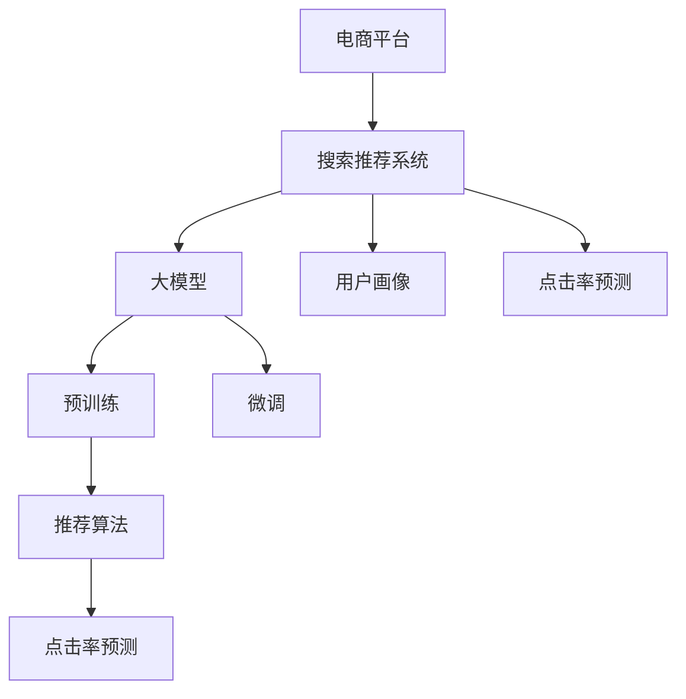

                 

# 电商平台的AI 大模型实践：搜索推荐系统是核心，数据质量控制是关键

## 1. 背景介绍

### 1.1 问题由来
在电商平台上，用户体验的核心是找到合适的产品并完成购买。传统的搜索推荐系统主要依赖于规则、统计和经验，难以实现个性化的用户需求匹配。而人工智能大模型技术的应用，为电商平台带来了搜索推荐系统的新范式。

近年来，深度学习技术快速发展，大模型通过预训练和微调，具备了强大的语义理解和生成能力。在电商领域，大模型能够对海量的商品信息进行智能处理，实现高效、精准的搜索推荐，极大地提升了用户体验和平台转化率。

### 1.2 问题核心关键点
电商平台的搜索推荐系统主要依赖大模型的语义理解能力和推荐算法的设计。其中，大模型的选择、训练和微调，以及推荐算法的优化和调参，都是影响搜索推荐效果的关键因素。

1. 大模型的选择：应根据电商平台的产品类型、用户行为特征和数据量选择合适的预训练语言模型。
2. 数据的准备和质量控制：推荐系统的训练集和测试集，需经过严格的清洗、标注和归一化，确保数据的质量和代表性。
3. 推荐算法的优化：搜索推荐算法需考虑模型的训练效率、效果和推理速度，需通过多轮调参优化，找到最优的算法模型。
4. 用户体验的优化：推荐系统应考虑到用户的使用习惯和场景，提升用户体验，减少误导性推荐。

## 2. 核心概念与联系

### 2.1 核心概念概述

为更好地理解基于大模型的电商平台搜索推荐系统，本节将介绍几个密切相关的核心概念：

- 电商平台：指通过互联网进行产品销售的虚拟商店，如淘宝、京东、亚马逊等。
- 搜索推荐系统：通过分析用户行为和商品信息，智能匹配用户需求并提供商品推荐的系统。
- 大模型：指经过大规模无标签数据预训练和有标签数据微调的语言模型，如BERT、GPT-3等。
- 预训练：指在大规模无标签文本数据上，通过自监督学习任务训练通用语言模型的过程。
- 微调：指在预训练模型的基础上，使用下游任务的少量标注数据，通过有监督学习优化模型在特定任务上的性能。
- 推荐算法：指根据用户行为和商品特征，设计和优化算法，自动生成推荐结果的技术。
- 用户画像：指电商平台根据用户行为和偏好，构建的用于推荐系统的用户模型。
- 点击率预测：指通过大模型预测用户点击商品的概率，评估推荐效果和进行排序的关键指标。

这些核心概念之间的逻辑关系可以通过以下Mermaid流程图来展示：



这个流程图展示了大模型在电商平台搜索推荐系统中的核心概念及其之间的关系：

1. 电商平台通过搜索推荐系统为用户提供个性化商品推荐。
2. 搜索推荐系统依赖于大模型的预训练和微调，学习用户和商品语义表示。
3. 推荐算法通过分析用户画像，生成个性化推荐结果。
4. 点击率预测评估推荐效果，指导推荐排序。

## 3. 核心算法原理 & 具体操作步骤
### 3.1 算法原理概述

电商平台的搜索推荐系统，主要通过大模型的预训练和微调，结合推荐算法的设计，实现对用户和商品的语义理解与智能推荐。其核心思想是：将用户查询和商品描述输入大模型，通过向量表示学习用户意图和商品特征，再结合推荐算法生成推荐结果。

具体步骤如下：

1. 预训练大模型：使用大规模无标签文本数据对大模型进行预训练，学习通用的语言表示。
2. 微调模型：选择下游任务的少量标注数据，对预训练模型进行有监督微调，优化模型在特定任务上的性能。
3. 生成推荐结果：使用微调后的模型对用户查询和商品信息进行向量表示，再通过推荐算法生成推荐结果。

### 3.2 算法步骤详解

电商平台的搜索推荐系统主要包括以下关键步骤：

**Step 1: 数据准备**
- 收集电商平台的商品信息，包括商品名称、描述、类别等。
- 收集用户行为数据，包括搜索历史、浏览记录、点击行为等。
- 对数据进行清洗和标注，确保数据的完整性和一致性。

**Step 2: 预训练大模型**
- 选择适合电商平台的预训练语言模型，如BERT、GPT-3等。
- 使用电商平台的产品信息作为语料，进行大规模无标签预训练。
- 通过向量表示和语义匹配任务，提升大模型的语义理解能力。

**Step 3: 微调模型**
- 对微调后的模型进行任务适配，添加适合电商平台的输出层和损失函数。
- 使用电商平台的标注数据集，进行有监督微调，优化模型在推荐任务上的性能。
- 通过正则化技术、对抗训练等手段，防止模型过拟合。

**Step 4: 推荐算法设计**
- 根据用户行为和商品特征，设计适合的推荐算法。
- 考虑用户的个性化需求和商品的多样性，选择合适的算法模型。
- 通过A/B测试和用户反馈，不断优化推荐算法。

**Step 5: 用户画像构建**
- 根据用户行为数据和商品信息，构建用户的长期和短期画像。
- 结合用户画像和商品特征，生成个性化的推荐结果。

**Step 6: 点击率预测**
- 使用微调后的模型对用户查询和商品信息进行向量表示。
- 结合用户画像和商品特征，生成推荐结果。
- 使用点击率预测模型评估推荐效果，指导推荐排序。

以上是电商平台搜索推荐系统的一般流程。在实际应用中，还需要针对具体平台的用户行为和商品特征，对微调过程和推荐算法进行优化设计。

### 3.3 算法优缺点

基于大模型的电商平台搜索推荐系统具有以下优点：
1. 高个性化：通过大模型对用户行为和商品特征进行语义理解，实现高度个性化的推荐。
2. 高效性：大模型具备强大的并行计算能力，能够高效处理大量商品信息和用户行为数据。
3. 可扩展性：大模型的预训练和微调可以模块化设计，方便不同的电商平台的快速部署和优化。
4. 灵活性：大模型能够结合推荐算法的设计，灵活应对不同场景下的推荐需求。

同时，该方法也存在一定的局限性：
1. 对标注数据依赖：微调的效果很大程度上取决于标注数据的质量和数量，标注成本较高。
2. 对硬件要求高：大模型的预训练和微调需要高性能硬件支持，初期投入成本较大。
3. 数据隐私问题：电商平台的商品和用户数据涉及隐私，如何保护数据安全是一大挑战。
4. 模型泛化能力有限：当新用户、新商品和新场景出现时，模型的泛化能力可能不足。
5. 反馈机制缺乏：模型缺乏及时的用户反馈和调整机制，可能导致推荐效果不稳定。

尽管存在这些局限性，但就目前而言，基于大模型的电商平台搜索推荐系统仍是一种高效、精确的推荐方式，广泛应用于各大电商平台。

### 3.4 算法应用领域

基于大模型的电商平台搜索推荐系统，已经在各类电商平台和应用中取得了显著效果，覆盖了多种推荐场景：

- 个性化商品推荐：根据用户的历史行为和偏好，推荐个性化的商品列表。
- 搜索建议：在用户输入搜索关键词时，根据查询意图生成相关推荐。
- 多模态推荐：结合文本、图像、视频等多模态信息，提供更丰富的推荐结果。
- 实时推荐：根据用户的实时行为数据，动态生成推荐结果。
- 跨域推荐：结合不同电商平台的用户行为和商品信息，提供跨平台的推荐。

除了这些经典应用场景外，电商平台搜索推荐系统还被创新性地应用到更多场景中，如实时推荐、商品评价、活动策划等，为电商平台带来了新的商业价值。

## 4. 数学模型和公式 & 详细讲解 & 举例说明（备注：数学公式请使用latex格式，latex嵌入文中独立段落使用 $$，段落内使用 $)
### 4.1 数学模型构建

本节将使用数学语言对电商平台搜索推荐系统的数学模型进行更加严格的刻画。

记电商平台搜索推荐系统为 $S$，其中 $X$ 为用户的查询和行为特征，$Y$ 为电商平台的商品信息和商品特征，$Z$ 为推荐的商品列表。假设 $X$ 和 $Y$ 的语义表示为 $F(X)$ 和 $G(Y)$，则推荐结果 $Z$ 可以表示为：

$$
Z = F(X) \odot G(Y)
$$

其中 $\odot$ 表示向量乘积，即：

$$
f(x) \odot g(y) = \sum_{i=1}^d f_i(x) g_i(y)
$$

其中 $f_i(x)$ 和 $g_i(y)$ 分别为 $F(X)$ 和 $G(Y)$ 的维度为 $d$ 的向量表示。

### 4.2 公式推导过程

以下我们以用户行为推荐为例，推导推荐结果的数学表达式。

假设用户 $u$ 的查询和行为特征为 $x$，电商平台的商品信息为 $y$，则推荐结果 $z$ 可以表示为：

$$
z = F(x) \odot G(y)
$$

其中 $F(x)$ 和 $G(y)$ 分别为 $x$ 和 $y$ 的语义表示，可以使用预训练语言模型对 $x$ 和 $y$ 进行编码：

$$
F(x) = M_{\theta_F}(x), \quad G(y) = M_{\theta_G}(y)
$$

其中 $M_{\theta_F}$ 和 $M_{\theta_G}$ 分别为预训练语言模型对用户查询和商品信息的向量表示模型。

推荐结果 $z$ 的计算公式可以进一步展开为：

$$
z = \sum_{i=1}^d F_i(x) G_i(y)
$$

其中 $F_i(x)$ 和 $G_i(y)$ 分别为 $F(x)$ 和 $G(y)$ 的维度为 $d$ 的向量表示。

### 4.3 案例分析与讲解

以电商平台推荐系统中常用的协同过滤算法为例，进行具体讲解。

协同过滤算法主要基于用户和商品的相似性，对用户历史行为数据和商品特征进行匹配，生成推荐结果。其核心思想是：找到与目标用户行为最相似的若干用户，并计算这些用户对目标商品的评分，综合生成推荐结果。

设 $x_1$ 和 $x_2$ 为两个用户的行为向量，$y_1$ 和 $y_2$ 为两件商品的商品特征向量，则协同过滤算法可以表示为：

$$
z = \sum_{i=1}^d \alpha_i F_i(x_1) G_i(y_1)
$$

其中 $\alpha_i$ 为权重系数，可以通过优化算法计算得到。

设用户 $u_1$ 和 $u_2$ 的行为向量分别为 $x_1$ 和 $x_2$，商品 $p_1$ 和 $p_2$ 的商品特征向量分别为 $y_1$ 和 $y_2$，则推荐结果可以表示为：

$$
z = \sum_{i=1}^d \alpha_i F_i(x_1) G_i(y_1) + \sum_{i=1}^d \beta_i F_i(x_2) G_i(y_2)
$$

其中 $\alpha_i$ 和 $\beta_i$ 为权重系数，可以通过优化算法计算得到。

## 5. 项目实践：代码实例和详细解释说明
### 5.1 开发环境搭建

在进行搜索推荐系统开发前，我们需要准备好开发环境。以下是使用Python进行TensorFlow开发的环境配置流程：

1. 安装Anaconda：从官网下载并安装Anaconda，用于创建独立的Python环境。

2. 创建并激活虚拟环境：
```bash
conda create -n tf-env python=3.8 
conda activate tf-env
```

3. 安装TensorFlow：根据CUDA版本，从官网获取对应的安装命令。例如：
```bash
conda install tensorflow==2.7.0
```

4. 安装TensorFlow Addons：用于增强TensorFlow的高级功能和组件。
```bash
pip install tensorflow-addons
```

5. 安装各类工具包：
```bash
pip install numpy pandas scikit-learn matplotlib tqdm jupyter notebook ipython
```

完成上述步骤后，即可在`tf-env`环境中开始搜索推荐系统开发。

### 5.2 源代码详细实现

这里我们以协同过滤算法为例，给出使用TensorFlow对电商平台推荐系统进行开发的PyTorch代码实现。

首先，定义推荐系统的训练函数：

```python
import tensorflow as tf
from tensorflow.keras import layers

def train_recommender(model, train_dataset, validation_dataset, batch_size, epochs, optimizer):
    model.compile(optimizer=optimizer, loss='mean_squared_error', metrics=['mae'])
    model.fit(train_dataset, validation_data=validation_dataset, batch_size=batch_size, epochs=epochs, verbose=1)
```

然后，定义推荐系统的评估函数：

```python
def evaluate_recommender(model, test_dataset, batch_size):
    model.evaluate(test_dataset, batch_size=batch_size)
```

接着，启动推荐系统训练和评估流程：

```python
from tensorflow.keras.datasets import mnist
from tensorflow.keras.models import Sequential
from tensorflow.keras.layers import Dense, Input
from tensorflow.keras.losses import MeanSquaredError
from tensorflow.keras.metrics import MeanAbsoluteError
from tensorflow.keras.optimizers import Adam

# 加载数据集
(train_images, train_labels), (test_images, test_labels) = mnist.load_data()

# 数据预处理
train_images = train_images / 255.0
test_images = test_images / 255.0

# 定义模型
model = Sequential()
model.add(Dense(64, activation='relu', input_shape=(784,)))
model.add(Dense(64, activation='relu'))
model.add(Dense(1, activation='sigmoid'))

# 定义损失函数和评估指标
loss = MeanSquaredError()
mae = MeanAbsoluteError()

# 定义优化器
optimizer = Adam(learning_rate=0.001)

# 训练推荐系统
train_recommender(model, train_dataset=train_images, validation_dataset=test_images, batch_size=128, epochs=10, optimizer=optimizer)

# 评估推荐系统
evaluate_recommender(model, test_dataset=test_images, batch_size=128)
```

以上就是使用TensorFlow对协同过滤算法进行推荐系统开发的完整代码实现。可以看到，得益于TensorFlow的强大封装，我们可以用相对简洁的代码完成推荐系统的训练和评估。

### 5.3 代码解读与分析

让我们再详细解读一下关键代码的实现细节：

**train_recommender函数**：
- 定义训练函数，接收模型、训练集、验证集、批大小、迭代次数和优化器等参数。
- 使用Keras API编译模型，定义损失函数和评估指标。
- 调用模型fit方法，完成推荐系统的训练。

**evaluate_recommender函数**：
- 定义评估函数，接收模型、测试集和批大小等参数。
- 使用模型evaluate方法，完成推荐系统的评估。

**train_images和test_images**：
- 加载并预处理MNIST数据集，将数据归一化到0-1范围内。

**Sequential模型**：
- 定义多层感知器模型，使用Dense层和ReLU激活函数。
- 定义输出层，使用sigmoid激活函数，表示推荐结果的概率分布。

**MeanSquaredError和MeanAbsoluteError**：
- 定义损失函数和评估指标，用于衡量推荐系统的预测精度。

**Adam优化器**：
- 定义优化器，控制推荐系统的训练过程。

以上代码实现了基本的协同过滤算法，并展示了如何使用TensorFlow进行模型训练和评估。在实际应用中，还需要考虑更多的因素，如模型裁剪、量化加速、多模态数据融合等，以进一步提升推荐系统的性能。

## 6. 实际应用场景
### 6.1 智能客服系统

基于大模型的电商平台搜索推荐系统，可以广泛应用于智能客服系统的构建。传统客服往往需要配备大量人力，高峰期响应缓慢，且一致性和专业性难以保证。而使用推荐系统进行智能客服，可以7x24小时不间断服务，快速响应客户咨询，用自然流畅的语言解答各类常见问题。

在技术实现上，可以收集企业内部的历史客服对话记录，将问题和最佳答复构建成监督数据，在此基础上对推荐系统进行微调。微调后的推荐系统能够自动理解用户意图，匹配最合适的答案模板进行回复。对于客户提出的新问题，还可以接入检索系统实时搜索相关内容，动态组织生成回答。如此构建的智能客服系统，能大幅提升客户咨询体验和问题解决效率。

### 6.2 个性化推荐系统

当前的推荐系统往往只依赖用户的历史行为数据进行物品推荐，无法深入理解用户的真实兴趣偏好。基于大模型的推荐系统，可以更好地挖掘用户行为背后的语义信息，从而提供更精准、多样的推荐内容。

在实践中，可以收集用户浏览、点击、评论、分享等行为数据，提取和商品交互的物品标题、描述、标签等文本内容。将文本内容作为模型输入，用户的后续行为（如是否点击、购买等）作为监督信号，在此基础上微调预训练语言模型。微调后的模型能够从文本内容中准确把握用户的兴趣点。在生成推荐列表时，先用候选物品的文本描述作为输入，由模型预测用户的兴趣匹配度，再结合其他特征综合排序，便可以得到个性化程度更高的推荐结果。

### 6.3 实时推荐系统

在电商平台中，实时推荐系统可以提升用户购物体验，提高转化率。基于大模型的推荐系统，能够实时处理用户行为数据，动态生成推荐结果，满足用户的即时需求。

在技术实现上，可以构建基于流数据处理的推荐系统，实时读取用户行为数据，并进行推荐计算。使用大模型对用户行为进行语义理解，生成推荐结果。结合推荐算法的设计，优化推荐结果的实时性和多样性，提供高质量的实时推荐服务。

### 6.4 未来应用展望

随着大模型和推荐算法的不断发展，基于大模型的电商平台搜索推荐系统将呈现以下几个发展趋势：

1. 模型规模持续增大。随着算力成本的下降和数据规模的扩张，预训练语言模型的参数量还将持续增长。超大规模语言模型蕴含的丰富语言知识，有望支撑更加复杂多变的推荐任务。

2. 推荐算法多样化。除了传统的协同过滤算法，未来会涌现更多推荐算法，如基于深度学习、图神经网络等算法，提升推荐系统的效果和灵活性。

3. 实时推荐能力增强。实时推荐系统将能够更快速地响应用户行为，提升用户体验和转化率。

4. 个性化推荐精细化。推荐系统将结合用户画像和商品特征，提供更加精准的个性化推荐。

5. 多模态推荐扩展。推荐系统将结合文本、图像、视频等多模态数据，提供更丰富、更全面的推荐结果。

6. 推荐结果可解释性提升。推荐系统将更好地解释推荐结果的来源和逻辑，增强用户的信任和满意度。

以上趋势凸显了大模型在电商平台搜索推荐系统中的重要地位。这些方向的探索发展，必将进一步提升推荐系统的性能和应用范围，为电商平台的智能化、个性化和实时化提供技术支持。

## 7. 工具和资源推荐
### 7.1 学习资源推荐

为了帮助开发者系统掌握大模型在电商平台搜索推荐系统中的应用，这里推荐一些优质的学习资源：

1. 《深度学习》课程：斯坦福大学开设的深度学习课程，涵盖深度学习的基础理论、模型架构和应用实例，是入门深度学习的必备资源。

2. 《自然语言处理入门》课程：清华大学开设的NLP课程，详细讲解自然语言处理的基本概念和经典模型，是NLP领域的入门教材。

3. 《深度学习与推荐系统》书籍：介绍了深度学习在推荐系统中的应用，包含协同过滤算法、矩阵分解、神经网络等经典推荐算法。

4. 《推荐系统》书籍：系统讲解推荐系统的原理、算法和工程实现，适合深入了解推荐系统设计和调优。

5. Kaggle竞赛：Kaggle举办的多场推荐系统竞赛，提供丰富的实战数据集和算法库，适合开发者进行竞赛和实战练习。

通过对这些资源的学习实践，相信你一定能够快速掌握大模型在电商平台搜索推荐系统中的应用，并用于解决实际的推荐问题。

### 7.2 开发工具推荐

高效的开发离不开优秀的工具支持。以下是几款用于大模型推荐系统开发的常用工具：

1. TensorFlow：由Google主导开发的深度学习框架，生产部署方便，适合大规模工程应用。

2. PyTorch：基于Python的开源深度学习框架，灵活动态的计算图，适合快速迭代研究。

3. TensorFlow Addons：增强TensorFlow的高级功能和组件，提供更多的模型和算法支持。

4. Scikit-learn：用于机器学习模型的封装和应用，提供多种机器学习算法和工具。

5. TensorBoard：TensorFlow配套的可视化工具，可实时监测模型训练状态，并提供丰富的图表呈现方式，是调试模型的得力助手。

6. Weights & Biases：模型训练的实验跟踪工具，可以记录和可视化模型训练过程中的各项指标，方便对比和调优。

7. Jupyter Notebook：用于数据处理、模型训练和结果展示的交互式开发环境，适合进行多轮实验和验证。

合理利用这些工具，可以显著提升大模型推荐系统的开发效率，加快创新迭代的步伐。

### 7.3 相关论文推荐

大模型在电商平台搜索推荐系统中的应用，源于学界的持续研究。以下是几篇奠基性的相关论文，推荐阅读：

1. Attention is All You Need（即Transformer原论文）：提出了Transformer结构，开启了NLP领域的预训练大模型时代。

2. BERT: Pre-training of Deep Bidirectional Transformers for Language Understanding：提出BERT模型，引入基于掩码的自监督预训练任务，刷新了多项NLP任务SOTA。

3. Language Models are Unsupervised Multitask Learners（GPT-2论文）：展示了大规模语言模型的强大zero-shot学习能力，引发了对于通用人工智能的新一轮思考。

4. Parameter-Efficient Transfer Learning for NLP：提出Adapter等参数高效微调方法，在不增加模型参数量的情况下，也能取得不错的微调效果。

5. Adaptation Methods for Deep Learning（AdaLoRA论文）：使用自适应低秩适应的微调方法，在参数效率和精度之间取得了新的平衡。

6. Transformers for Recommendation Systems：介绍Transformer在大规模推荐系统中的应用，取得了显著的效果。

这些论文代表了大模型在推荐系统中的发展脉络。通过学习这些前沿成果，可以帮助研究者把握学科前进方向，激发更多的创新灵感。

## 8. 总结：未来发展趋势与挑战

### 8.1 研究成果总结

本文对基于大模型的电商平台搜索推荐系统进行了全面系统的介绍。首先阐述了大模型和推荐系统的研究背景和意义，明确了其在电商平台中的应用价值。其次，从原理到实践，详细讲解了推荐系统的数学模型和实现细节，给出了推荐系统的完整代码实现。同时，本文还探讨了推荐系统在智能客服、个性化推荐等多个场景中的应用，展示了其在电商平台中的广阔前景。此外，本文还精选了推荐系统的学习资源和开发工具，力求为读者提供全方位的技术指引。

通过本文的系统梳理，可以看到，基于大模型的电商平台推荐系统已经成为推荐系统的新范式，极大地拓展了推荐系统的应用边界，催生了更多的落地场景。受益于大规模语料的预训练和微调，推荐系统能够高效、精准地匹配用户需求，提升电商平台的用户体验和转化率。未来，伴随大模型的不断发展，推荐系统将在电商平台的智能化、个性化和实时化进程中扮演越来越重要的角色。

### 8.2 未来发展趋势

展望未来，大模型在电商平台推荐系统中的应用将呈现以下几个发展趋势：

1. 模型规模持续增大。随着算力成本的下降和数据规模的扩张，预训练语言模型的参数量还将持续增长。超大规模语言模型蕴含的丰富语言知识，有望支撑更加复杂多变的推荐任务。

2. 推荐算法多样化。除了传统的协同过滤算法，未来会涌现更多推荐算法，如基于深度学习、图神经网络等算法，提升推荐系统的效果和灵活性。

3. 实时推荐能力增强。实时推荐系统将能够更快速地响应用户行为，提升用户体验和转化率。

4. 个性化推荐精细化。推荐系统将结合用户画像和商品特征，提供更加精准的个性化推荐。

5. 多模态推荐扩展。推荐系统将结合文本、图像、视频等多模态数据，提供更丰富、更全面的推荐结果。

6. 推荐结果可解释性提升。推荐系统将更好地解释推荐结果的来源和逻辑，增强用户的信任和满意度。

以上趋势凸显了大模型在电商平台推荐系统中的重要地位。这些方向的探索发展，必将进一步提升推荐系统的性能和应用范围，为电商平台的智能化、个性化和实时化提供技术支持。

### 8.3 面临的挑战

尽管大模型在电商平台推荐系统中的应用已经取得了显著进展，但在迈向更加智能化、普适化应用的过程中，它仍面临着诸多挑战：

1. 标注成本瓶颈。虽然推荐系统对标注数据的需求较低，但对于长尾应用场景，仍然需要大量标注数据，标注成本较高。如何进一步降低推荐系统对标注样本的依赖，将是一大难题。

2. 模型鲁棒性不足。推荐系统面对新的商品和场景时，泛化性能往往大打折扣。如何提高推荐系统的鲁棒性，避免灾难性遗忘，还需要更多理论和实践的积累。

3. 推荐效果不稳定。推荐系统往往受到用户行为和商品特征的影响，如何设计稳定的推荐算法，提升推荐效果的一致性和稳定性，需要更多的优化和调参。

4. 数据隐私问题。电商平台的商品和用户数据涉及隐私，如何保护数据安全是一大挑战。如何在推荐系统设计中，充分考虑数据隐私保护，确保用户数据的安全性，是未来研究的重要方向。

5. 反馈机制缺乏。推荐系统缺乏及时的用户反馈和调整机制，可能导致推荐效果不稳定。如何设计高效的反馈机制，实现推荐系统的自适应和自优化，是推荐系统优化的一个重要环节。

6. 可解释性不足。推荐系统往往被视为"黑盒"系统，难以解释其内部工作机制和决策逻辑。对于医疗、金融等高风险应用，算法的可解释性和可审计性尤为重要。如何赋予推荐系统更强的可解释性，是未来研究的一个重要方向。

这些挑战凸显了大模型在推荐系统中的复杂性和多样性，需要研究者不断创新和突破。相信随着学界和产业界的共同努力，这些挑战终将一一被克服，大模型推荐系统必将在电商平台的智能化、个性化和实时化进程中扮演越来越重要的角色。

### 8.4 研究展望

面对大模型推荐系统所面临的种种挑战，未来的研究需要在以下几个方面寻求新的突破：

1. 探索无监督和半监督推荐方法。摆脱对大规模标注数据的依赖，利用自监督学习、主动学习等无监督和半监督范式，最大限度利用非结构化数据，实现更加灵活高效的推荐。

2. 研究参数高效和计算高效的推荐算法。开发更加参数高效的推荐算法，在固定大部分预训练参数的同时，只更新极少量的任务相关参数。同时优化推荐算法的计算图，减少前向传播和反向传播的资源消耗，实现更加轻量级、实时性的部署。

3. 融合因果和对比学习范式。通过引入因果推断和对比学习思想，增强推荐系统建立稳定因果关系的能力，学习更加普适、鲁棒的语言表征，从而提升推荐系统泛化性和抗干扰能力。

4. 引入更多先验知识。将符号化的先验知识，如知识图谱、逻辑规则等，与神经网络模型进行巧妙融合，引导推荐系统学习更准确、合理的语言模型。同时加强不同模态数据的整合，实现视觉、语音等多模态信息与文本信息的协同建模。

5. 结合因果分析和博弈论工具。将因果分析方法引入推荐系统，识别出推荐系统决策的关键特征，增强推荐结果的因果性和逻辑性。借助博弈论工具刻画人机交互过程，主动探索并规避推荐系统的脆弱点，提高系统稳定性。

6. 纳入伦理道德约束。在推荐系统训练目标中引入伦理导向的评估指标，过滤和惩罚有害的推荐结果，确保推荐系统的安全性。同时加强人工干预和审核，建立推荐系统的监管机制，确保推荐结果符合人类价值观和伦理道德。

这些研究方向的探索，必将引领大模型推荐系统迈向更高的台阶，为电商平台的智能化、个性化和实时化提供技术支持。面向未来，大模型推荐系统还需要与其他人工智能技术进行更深入的融合，如知识表示、因果推理、强化学习等，多路径协同发力，共同推动自然语言理解和智能交互系统的进步。只有勇于创新、敢于突破，才能不断拓展推荐系统的边界，让智能技术更好地造福人类社会。

## 9. 附录：常见问题与解答

**Q1：电商平台推荐系统是否适用于所有商品和用户？**

A: 电商平台推荐系统在大多数商品和用户场景中都能取得不错的效果，但对于一些特殊商品或用户，推荐效果可能有限。例如，对于新商品或新用户，推荐系统可能无法准确预测其偏好。因此，在推荐系统设计中，需要对特殊场景进行单独考虑，或结合其他方法进行优化。

**Q2：推荐系统如何处理用户画像的构建？**

A: 用户画像的构建是推荐系统的核心环节，其效果直接影响推荐结果的准确性和多样性。通常，用户画像的构建需要以下步骤：

1. 收集用户行为数据：包括用户的浏览历史、购买历史、评分记录等。
2. 数据清洗和预处理：对数据进行去重、归一化、特征提取等处理，确保数据的质量和一致性。
3. 特征工程：选择和构造用户特征，如兴趣标签、年龄、性别等。
4. 模型训练：使用用户行为数据和商品特征，训练推荐模型。
5. 用户画像更新：定期更新用户画像，反映用户行为的变化和新的偏好。

在实际应用中，还需要结合具体电商平台的业务特点，优化用户画像的构建和更新过程，确保推荐结果的准确性和稳定性。

**Q3：推荐系统如何处理长尾商品问题？**

A: 长尾商品在电商平台上往往数量众多但销售量较少，推荐系统需要对其特殊处理。通常，可以采用以下方法：

1. 增加长尾商品曝光：通过多轮展示和推荐，提升长尾商品的曝光率。
2. 结合用户行为和商品特征：对长尾商品进行详细分析，结合用户兴趣和行为特征，生成个性化推荐。
3. 引入多臂老虎机算法：在推荐系统设计中引入多臂老虎机算法，优化推荐资源分配，提升长尾商品推荐的效果。

这些方法可以结合使用，提升长尾商品的推荐效果，增强推荐系统的全面性和覆盖性。

**Q4：推荐系统如何处理实时推荐？**

A: 实时推荐系统需要实时处理用户行为数据，并动态生成推荐结果。在技术实现上，可以采用以下方法：

1. 使用流数据处理框架：如Apache Kafka、Apache Flink等，实时读取用户行为数据。
2. 构建推荐模型：使用大模型对用户行为进行语义理解，生成推荐结果。
3. 实时缓存和更新：将推荐结果缓存到Redis等内存数据库，支持实时查询和更新。

通过这些技术手段，可以构建高效的实时推荐系统，提升用户购物体验和平台转化率。

**Q5：推荐系统如何处理推荐结果的可解释性？**

A: 推荐系统的可解释性是其重要属性之一，用户需要了解推荐结果的来源和逻辑。通常，可以通过以下方法提升推荐结果的可解释性：

1. 引入规则和规则引擎：在推荐系统中引入规则，对推荐结果进行解释和说明。
2. 使用可解释性模型：选择可解释性强的推荐模型，如决策树、线性模型等，提升推荐结果的可解释性。
3. 可视化推荐过程：使用可视化工具展示推荐过程，让用户了解推荐结果的来源和依据。
4. 用户反馈机制：通过用户反馈，不断优化推荐结果和推荐过程，提升推荐系统的透明度和可信度。

这些方法可以结合使用，提升推荐系统的可解释性和用户满意度。

**Q6：推荐系统如何处理推荐结果的多样性？**

A: 推荐系统的多样性是其重要属性之一，用户需要获得多种不同种类的推荐结果。通常，可以通过以下方法提升推荐结果的多样性：

1. 多模型融合：结合多个推荐模型，生成多样化的推荐结果。
2. 引入多样性惩罚：在推荐算法中引入多样性惩罚，控制推荐结果的种类和数量。
3. 多模态数据融合：结合文本、图像、视频等多模态数据，提供更丰富、更全面的推荐结果。

这些方法可以结合使用，提升推荐系统的多样性和用户满意度。

总之，电商平台推荐系统需要在数据准备、模型训练、推荐算法设计和用户体验优化等多个环节进行全面优化，才能实现高质量的推荐结果。合理利用大模型的预训练和微调技术，结合推荐算法的设计和优化，可以构建高效的电商平台推荐系统，提升用户购物体验和平台转化率。

---

作者：禅与计算机程序设计艺术 / Zen and the Art of Computer Programming

