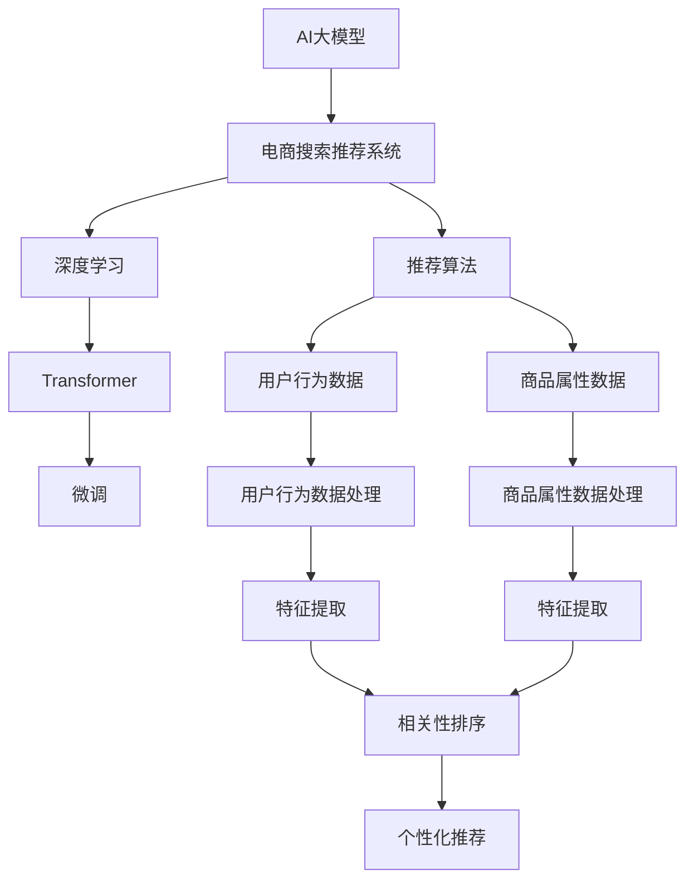

                 

# 电商平台的AI 大模型转型：搜索推荐系统是核心，数据质量与处理效率

> 关键词：AI大模型,电商平台,搜索推荐系统,数据质量,处理效率,深度学习

## 1. 背景介绍

### 1.1 问题由来
随着电商平台的迅猛发展，用户体验日益成为电商平台竞争力的关键。传统的电商平台依靠算法推荐、个性化展示等方式提升用户购买转化率和满意度，但这些方法对用户行为的预测准确性仍需进一步提高。近年来，AI大模型在电商平台的落地应用成为热点，其中以搜索推荐系统为核心的AI技术，显著提升了电商平台的个性化服务水平。

### 1.2 问题核心关键点
大模型在电商平台的应用主要集中在搜索推荐系统中，其核心思想是通过大规模预训练获得广泛的领域知识，结合用户行为数据进行有监督微调，实现对商品的相关性排序和个性化推荐。电商平台的搜索推荐系统对数据的质量与处理效率提出了极高的要求。

### 1.3 问题研究意义
研究电商平台中搜索推荐系统的AI大模型转型，对于电商平台优化用户体验、提升运营效率、增强竞争力具有重要意义。一方面，基于大模型的推荐系统能够大幅提高推荐的个性化和相关性，提升用户满意度。另一方面，AI大模型在数据处理上的高效性，能够显著减轻平台运营负担，为电商平台的智能化转型奠定基础。

## 2. 核心概念与联系

### 2.1 核心概念概述

为更好地理解电商平台搜索推荐系统中的AI大模型应用，本节将介绍几个密切相关的核心概念：

- **AI大模型**：以Transformer等架构为代表的预训练语言模型，通过在大规模无标签数据上进行自监督学习，获得对语言和领域的广泛知识。在电商平台的搜索推荐系统中，大模型可以作为"特征提取器"，提取商品特征，实现相关性排序和推荐。

- **电商平台**：指线上购物的商业平台，如淘宝、京东、亚马逊等。电商平台的核心业务是商品展示、搜索、推荐、购买等，通过AI大模型提升用户体验和运营效率。

- **搜索推荐系统**：基于用户行为数据和商品属性数据，利用AI技术实现对商品的排序和推荐，提升用户购物体验，增加交易转化率。

- **深度学习**：一种基于人工神经网络的机器学习方法，通过多层非线性变换学习数据的复杂特征，实现对各种问题的预测和优化。

- **Transformer**：一种注意力机制的神经网络架构，主要用于处理序列数据，如自然语言处理、图像处理等。

- **推荐算法**：在电商平台的搜索推荐系统中，用于预测用户对商品兴趣和购买行为的算法。

- **大模型微调**：在电商平台的搜索推荐系统中，使用大模型作为初始化参数，在少量标注数据上进行有监督微调，适应特定电商平台的商品结构和用户行为。

这些核心概念之间的逻辑关系可以通过以下Mermaid流程图来展示：



这个流程图展示了大模型在电商平台搜索推荐系统中的核心概念及其之间的关系：

1. 大模型通过自监督学习获得广泛知识。
2. 大模型在推荐系统中作为"特征提取器"，结合用户行为数据和商品属性数据进行特征提取。
3. 推荐算法利用特征提取结果进行商品排序和推荐。
4. 电商平台的运营数据，经过清洗、特征提取等步骤，输入大模型进行微调。
5. 微调后的模型用于电商平台的具体推荐系统。

## 3. 核心算法原理 & 具体操作步骤

### 3.1 算法原理概述

电商平台的搜索推荐系统主要依赖深度学习技术，尤其是基于大模型的微调方法。其核心思想是通过大规模预训练获得对商品语义、用户行为等领域的广泛知识，再结合电商平台的具体数据进行有监督微调，优化模型的相关性排序和推荐能力。

具体来说，电商平台的搜索推荐系统通常分为以下几个步骤：

1. **用户行为数据收集**：通过点击、浏览、收藏等行为，收集用户对商品的态度和偏好。
2. **商品属性数据收集**：收集商品的图片、描述、价格等信息，用于商品的特征表示。
3. **数据预处理**：对用户行为数据和商品属性数据进行清洗、标准化、归一化等处理，生成特征向量。
4. **特征提取**：使用大模型作为"特征提取器"，对预处理后的数据进行特征提取，生成商品和用户的语义表示。
5. **相关性排序**：结合用户行为数据和商品属性数据，构建推荐模型，进行相关性排序。
6. **个性化推荐**：根据排序结果，选择最符合用户兴趣的商品进行推荐。

### 3.2 算法步骤详解

**Step 1: 准备预训练模型和数据集**

电商平台的搜索推荐系统通常使用预训练大模型如BERT、RoBERTa、Deberta等作为初始化参数。这些模型通过在大规模无标签文本语料上进行预训练，学习到丰富的语言知识和领域信息。

- **选择预训练模型**：根据平台业务需求和资源限制，选择合适的预训练模型。例如，BERT适用于自然语言处理任务，RoBERTa适用于更长的文本，Deberta适用于大规模语料预训练。
- **收集数据集**：收集电商平台的商品属性数据和用户行为数据。属性数据包括商品类别、价格、品牌等，行为数据包括点击、浏览、收藏等行为。
- **数据预处理**：对数据进行清洗、标准化、归一化等处理，生成特征向量。

**Step 2: 添加任务适配层**

电商平台的搜索推荐系统通常使用任务适配层，将预训练模型的输出转换为相关性排序和推荐。

- **构建相关性排序模型**：在预训练模型的顶层，添加线性分类器和交叉熵损失函数，用于相关性排序。
- **构建推荐模型**：根据具体业务需求，选择不同的推荐算法，如基于排序的推荐、基于协同过滤的推荐、基于深度学习的推荐等。

**Step 3: 设置微调超参数**

电商平台的搜索推荐系统在微调过程中，通常需要调整一些关键参数以优化模型性能。

- **优化器**：选择合适的优化算法及其参数，如AdamW、SGD等，设置学习率、批大小、迭代轮数等。
- **正则化技术**：使用L2正则、Dropout、Early Stopping等技术，防止模型过拟合。
- **数据增强**：通过对训练样本改写、回译等方式丰富训练集多样性。
- **对抗训练**：加入对抗样本，提高模型鲁棒性。
- **提示学习**：通过精心设计输入文本的格式，引导模型按期望方式输出，减少微调参数。

**Step 4: 执行梯度训练**

电商平台的搜索推荐系统在微调过程中，需要在大规模数据集上进行有监督学习。

- **数据批处理**：将数据以批为单位输入模型，前向传播计算损失函数。
- **反向传播**：计算参数梯度，根据设定的优化算法和学习率更新模型参数。
- **验证集评估**：周期性在验证集上评估模型性能，根据性能指标决定是否触发Early Stopping。
- **迭代优化**：重复上述步骤直至满足预设的迭代轮数或Early Stopping条件。

**Step 5: 测试和部署**

电商平台的搜索推荐系统在微调完成后，需要在实际应用中进行测试和部署。

- **测试集评估**：在测试集上评估微调后模型，对比微调前后的精度提升。
- **实时推荐**：将微调后的模型集成到电商平台的推荐系统中，实时进行商品推荐。
- **持续学习**：定期重新微调模型，以适应数据分布的变化。

### 3.3 算法优缺点

基于大模型微调的搜索推荐系统具有以下优点：

1. **性能提升显著**：通过大规模预训练和微调，模型能够有效利用领域知识，显著提升推荐的相关性和个性化。
2. **可解释性强**：大模型提供对用户行为和商品语义的深入理解，推荐过程可解释性强。
3. **适应性强**：大模型能够适应电商平台的业务特性，灵活调整特征提取方式和推荐策略。

但同时也存在一些局限性：

1. **数据依赖性强**：微调效果很大程度上取决于标注数据的质量和数量，获取高质量标注数据的成本较高。
2. **资源消耗大**：大规模预训练和微调需要高性能的计算资源，对算力和内存要求较高。
3. **模型鲁棒性不足**：面对噪声数据和异常情况，模型的鲁棒性有待提高。
4. **可解释性差**：大模型的复杂性使得其决策过程难以理解和调试。

尽管存在这些局限性，但基于大模型的搜索推荐系统在电商平台的落地应用已经取得了显著效果，成为平台优化用户体验和运营效率的重要手段。

### 3.4 算法应用领域

基于大模型的搜索推荐系统已经在电商平台的各个场景中得到了广泛应用，例如：

- **商品搜索**：利用大模型对用户查询进行语义理解，匹配最相关的商品。
- **商品推荐**：结合用户行为数据和商品属性数据，生成个性化推荐列表。
- **广告推荐**：根据用户兴趣和行为，精准投放广告。
- **库存管理**：利用推荐系统预测商品需求，优化库存管理。
- **客户服务**：通过推荐系统提供商品咨询服务，提高客户满意度。

除了上述这些经典场景外，搜索推荐系统还被创新性地应用到更多电商业务中，如商品搭配推荐、个性化优惠券、跨品类的关联推荐等，为电商平台带来了新的商业价值和用户体验。

## 4. 数学模型和公式 & 详细讲解 & 举例说明

### 4.1 数学模型构建

电商平台的搜索推荐系统通常使用深度学习模型进行相关性排序和推荐。以下以基于Transformers的深度学习模型为例，构建搜索推荐系统的数学模型。

假设电商平台的搜索推荐系统使用BERT模型作为初始化参数，用户行为数据为 $x$，商品属性数据为 $y$，预训练模型的输出为 $z$。模型的目标是最小化用户行为数据和商品属性数据之间的相关性损失，即：

$$
\min_{\theta} \sum_{i=1}^N \ell(z_i, y_i)
$$

其中 $\ell$ 为相关性损失函数，如均方误差损失、交叉熵损失等。

### 4.2 公式推导过程

以均方误差损失函数为例，进行相关性排序的推导：

假设模型 $M_{\theta}$ 的输出为 $z \in \mathbb{R}^d$，与商品属性数据 $y$ 之间的相关性可以表示为：

$$
s = z \cdot y
$$

其中 $s$ 为相关性得分，$\cdot$ 表示点积。相关性损失函数可以表示为：

$$
\ell(z,y) = \frac{1}{N} \sum_{i=1}^N (z_i \cdot y_i - s)^2
$$

在电商平台的搜索推荐系统中，相关性排序的目标是最小化上述损失函数。为了最小化损失，需要使用梯度下降等优化算法更新模型参数 $\theta$：

$$
\theta \leftarrow \theta - \eta \nabla_{\theta} \ell(z,y) - \eta \lambda \theta
$$

其中 $\eta$ 为学习率，$\lambda$ 为正则化系数，$\nabla_{\theta} \ell(z,y)$ 为损失函数对模型参数 $\theta$ 的梯度。

### 4.3 案例分析与讲解

以基于BERT的电商推荐系统为例，进行具体分析：

假设电商平台使用BERT模型进行推荐，首先将用户行为数据 $x$ 和商品属性数据 $y$ 输入到BERT模型中，得到商品和用户的语义表示 $z$。然后，根据商品属性数据和用户行为数据，构建推荐模型 $M_{\theta}$。假设推荐模型使用线性分类器和交叉熵损失函数，相关性损失函数可以表示为：

$$
\ell(z,y) = -\frac{1}{N} \sum_{i=1}^N \log \sigma(z_i \cdot y_i)
$$

其中 $\sigma$ 为sigmoid函数。在微调过程中，通过反向传播计算参数梯度，根据优化算法和学习率更新模型参数。经过多次迭代后，模型将优化为最小化相关性损失，生成最佳推荐列表。

## 5. 项目实践：代码实例和详细解释说明

### 5.1 开发环境搭建

在进行电商搜索推荐系统的AI大模型转型时，需要准备以下开发环境：

1. 安装Python：使用Anaconda或Miniconda安装Python 3.8或更高版本。
2. 安装PyTorch：使用pip安装PyTorch 1.6或更高版本。
3. 安装Transformers库：使用pip安装Transformers 4.7或更高版本。
4. 安装Jupyter Notebook：使用pip安装Jupyter Notebook 6.0或更高版本。
5. 安装其他相关库：使用pip安装numpy、pandas、scikit-learn、matplotlib等库。

安装完成后，可以通过以下命令创建虚拟环境：

```bash
conda create -n ecommerce-env python=3.8
conda activate ecommerce-env
```

### 5.2 源代码详细实现

以下是一个基于BERT的电商推荐系统的PyTorch代码实现：

```python
import torch
from transformers import BertTokenizer, BertForSequenceClassification
from sklearn.model_selection import train_test_split
from sklearn.metrics import accuracy_score

# 1. 准备数据集
# 假设data包含用户行为数据和商品属性数据
# 数据集分为训练集和测试集
train_data, test_data = train_test_split(data, test_size=0.2)

# 2. 预训练模型初始化
tokenizer = BertTokenizer.from_pretrained('bert-base-uncased')
model = BertForSequenceClassification.from_pretrained('bert-base-uncased', num_labels=num_labels)

# 3. 数据预处理
def tokenize_data(data):
    inputs = tokenizer(data, return_tensors='pt', padding=True, truncation=True)
    inputs = {k: v.to(device) for k, v in inputs.items()}
    return inputs

# 4. 构建模型和损失函数
model.to(device)
criterion = torch.nn.CrossEntropyLoss()

# 5. 训练过程
def train_model(model, train_loader, optimizer):
    model.train()
    for batch in train_loader:
        inputs = tokenize_data(batch)
        outputs = model(**inputs)
        loss = criterion(outputs.logits, batch['labels'])
        optimizer.zero_grad()
        loss.backward()
        optimizer.step()

# 6. 测试过程
def test_model(model, test_loader):
    model.eval()
    predictions, true_labels = [], []
    with torch.no_grad():
        for batch in test_loader:
            inputs = tokenize_data(batch)
            outputs = model(**inputs)
            predictions.append(outputs.logits.argmax(dim=1))
            true_labels.append(batch['labels'])
    return predictions, true_labels

# 7. 评估过程
def evaluate_model(predictions, true_labels):
    return accuracy_score(true_labels, predictions)

# 8. 微调过程
optimizer = torch.optim.AdamW(model.parameters(), lr=1e-5)
train_loader = DataLoader(train_data, batch_size=32)
test_loader = DataLoader(test_data, batch_size=32)
epochs = 5

for epoch in range(epochs):
    train_model(model, train_loader, optimizer)
    predictions, true_labels = test_model(model, test_loader)
    accuracy = evaluate_model(predictions, true_labels)
    print(f'Epoch {epoch+1}, Accuracy: {accuracy:.4f}')
```

### 5.3 代码解读与分析

以上代码实现了基于BERT的电商推荐系统，具体解释如下：

**Step 1: 数据准备**
- 使用sklearn的train_test_split方法将数据集分为训练集和测试集。

**Step 2: 预训练模型初始化**
- 使用BertTokenizer从预训练模型中加载分词器。
- 使用BertForSequenceClassification从预训练模型中加载推荐模型。

**Step 3: 数据预处理**
- 定义tokenize_data函数，使用BertTokenizer对输入数据进行分词和标准化处理，生成模型所需的输入。

**Step 4: 模型和损失函数构建**
- 将模型移动到指定设备（如GPU）。
- 定义交叉熵损失函数criterion。

**Step 5: 训练过程**
- 定义train_model函数，对模型进行训练。

**Step 6: 测试过程**
- 定义test_model函数，对模型进行测试。

**Step 7: 评估过程**
- 定义evaluate_model函数，计算模型预测准确率。

**Step 8: 微调过程**
- 定义优化器optimizer，使用AdamW优化器。
- 定义训练和测试数据加载器train_loader和test_loader。
- 定义迭代次数epochs。

在实际应用中，可以根据具体的业务需求和数据特点，对上述代码进行进一步优化。例如，可以使用更高级的优化算法，如Adafactor、LAMB等，优化模型参数。可以引入数据增强、对抗训练等技术，增强模型的鲁棒性。可以设计更合理的任务适配层，提高推荐效果。

## 6. 实际应用场景

### 6.1 搜索推荐系统
电商平台的搜索推荐系统基于AI大模型，能够实现对用户行为的高效预测和商品相关性的精准匹配，提升用户体验和购买转化率。例如，淘宝使用基于BERT的推荐系统，通过分析用户点击、浏览、收藏等行为，推荐最相关的商品。京东使用RoBERTa模型，结合商品属性数据和用户行为数据，生成个性化推荐列表。亚马逊使用Deberta模型，实现跨品类推荐和广告投放。

### 6.2 库存管理
电商平台的库存管理需要预测商品的销售情况，以优化库存水平。基于AI大模型的推荐系统能够根据历史销售数据和用户行为数据，预测商品的需求量，帮助平台进行库存管理。例如，利用基于BERT的推荐系统，预测商品在未来的销售量，合理调整库存，避免缺货或过剩。

### 6.3 客户服务
电商平台的客户服务需要实时响应用户咨询，提供精准的商品信息。基于AI大模型的推荐系统能够根据用户查询生成相关商品推荐，提升客户服务的效率和质量。例如，利用基于RoBERTa的推荐系统，根据用户输入的查询词，实时推荐相关商品，帮助用户快速找到所需商品。

### 6.4 未来应用展望

随着AI大模型的不断演进，电商平台的搜索推荐系统将具备更强的通用性和适应性。未来，大模型在电商平台的落地应用将更加广泛，带来更多的商业价值和用户体验提升。

1. **多模态融合**：电商平台的推荐系统将融合图像、视频、语音等多种模态数据，提供更全面的商品展示和用户体验。例如，通过结合图像和文本信息，推荐最合适的商品图片，增强用户购买意愿。

2. **实时更新**：基于AI大模型的推荐系统将具备实时更新能力，能够根据最新的用户行为数据和商品信息，动态调整推荐列表。例如，实时更新商品库存信息，提高推荐的准确性。

3. **跨领域应用**：基于AI大模型的推荐系统将不仅仅应用于电商领域，还将扩展到金融、医疗、教育等多个领域。例如，通过结合金融数据和用户行为，实现个性化理财推荐，帮助用户进行投资决策。

4. **知识图谱融合**：基于AI大模型的推荐系统将与知识图谱进行融合，增强推荐内容的深度和广度。例如，结合商品属性和知识图谱中的关系，生成更精准的推荐结果。

5. **伦理道德约束**：基于AI大模型的推荐系统将引入伦理道德约束，确保推荐内容的公正性和安全性。例如，通过引入公平性评估指标，过滤掉有偏见或有歧视的商品推荐。

6. **对抗攻击防御**：基于AI大模型的推荐系统将具备更强的对抗攻击防御能力，避免恶意攻击影响推荐效果。例如，通过引入对抗样本训练，提高模型的鲁棒性。

## 7. 工具和资源推荐

### 7.1 学习资源推荐

为了帮助开发者系统掌握电商搜索推荐系统的AI大模型应用，这里推荐一些优质的学习资源：

1. 《深度学习》书籍：Ian Goodfellow等著，全面介绍深度学习的基本概念和核心算法，涵盖神经网络、优化算法、正则化技术等。
2. 《Transformers: A Survey》论文：Jacob Devlin等，全面综述Transformer架构及其应用，适合了解大模型的核心原理和最新进展。
3. 《自然语言处理入门》课程：斯坦福大学Coursera平台，涵盖NLP基本概念和前沿技术，适合初学者入门。
4. 《自然语言处理》课程：李航等著，系统介绍NLP领域的各种技术，包括搜索引擎、文本分类、机器翻译等。
5. 《自然语言处理大模型》博客：Hugging Face博客，详细介绍各类大模型的应用场景和优化技巧，适合日常学习。

通过对这些资源的学习实践，相信你一定能够快速掌握电商搜索推荐系统中的AI大模型应用，并用于解决实际的NLP问题。

### 7.2 开发工具推荐

高效的开发离不开优秀的工具支持。以下是几款用于电商搜索推荐系统的AI大模型转型的常用工具：

1. PyTorch：基于Python的开源深度学习框架，灵活动态的计算图，适合快速迭代研究。
2. TensorFlow：由Google主导开发的开源深度学习框架，生产部署方便，适合大规模工程应用。
3. Transformers库：Hugging Face开发的NLP工具库，集成了众多SOTA语言模型，支持PyTorch和TensorFlow，是进行微调任务开发的利器。
4. Jupyter Notebook：交互式编程环境，支持Python和R等语言，适合做数据分析和模型验证。
5. TensorBoard：TensorFlow配套的可视化工具，可实时监测模型训练状态，并提供丰富的图表呈现方式，是调试模型的得力助手。
6. Weights & Biases：模型训练的实验跟踪工具，可以记录和可视化模型训练过程中的各项指标，方便对比和调优。

合理利用这些工具，可以显著提升电商搜索推荐系统的开发效率，加快创新迭代的步伐。

### 7.3 相关论文推荐

电商平台的搜索推荐系统对AI大模型的应用研究，主要集中在以下几个方面：

1. Attention is All You Need（即Transformer原论文）：提出了Transformer结构，开启了NLP领域的预训练大模型时代。
2. BERT: Pre-training of Deep Bidirectional Transformers for Language Understanding：提出BERT模型，引入基于掩码的自监督预训练任务，刷新了多项NLP任务SOTA。
3. Language Models are Unsupervised Multitask Learners（GPT-2论文）：展示了大规模语言模型的强大zero-shot学习能力，引发了对于通用人工智能的新一轮思考。
4. Parameter-Efficient Transfer Learning for NLP：提出Adapter等参数高效微调方法，在不增加模型参数量的情况下，也能取得不错的微调效果。
5. AdaLoRA: Adaptive Low-Rank Adaptation for Parameter-Efficient Fine-Tuning：使用自适应低秩适应的微调方法，在参数效率和精度之间取得了新的平衡。

这些论文代表了大模型在电商平台搜索推荐系统中的应用进展。通过学习这些前沿成果，可以帮助研究者把握学科前进方向，激发更多的创新灵感。

## 8. 总结：未来发展趋势与挑战

### 8.1 总结

本文对电商平台搜索推荐系统中的AI大模型转型进行了全面系统的介绍。首先阐述了电商平台的业务需求和AI大模型应用的场景，明确了搜索推荐系统在大模型应用中的核心地位。其次，从原理到实践，详细讲解了电商搜索推荐系统的AI大模型微调过程，包括预训练模型选择、数据集构建、任务适配层设计、微调超参数设置、梯度训练执行等关键步骤。同时，本文还探讨了电商搜索推荐系统的实际应用场景和未来发展趋势，展示了AI大模型在电商平台的巨大潜力。

### 8.2 未来发展趋势

展望未来，电商平台搜索推荐系统的AI大模型应用将呈现以下几个发展趋势：

1. **模型规模持续增大**：随着算力成本的下降和数据规模的扩张，预训练语言模型的参数量还将持续增长。超大规模语言模型蕴含的丰富语言知识，有望支撑更加复杂多变的电商推荐任务。

2. **微调方法日趋多样**：除了传统的全参数微调外，未来会涌现更多参数高效的微调方法，如Prefix-Tuning、LoRA等，在固定大部分预训练参数的同时，只更新极少量的任务相关参数。同时优化微调模型的计算图，减少前向传播和反向传播的资源消耗，实现更加轻量级、实时性的部署。

3. **持续学习成为常态**：随着数据分布的不断变化，微调模型也需要持续学习新知识以保持性能。如何在不遗忘原有知识的同时，高效吸收新样本信息，将成为重要的研究课题。

4. **标注样本需求降低**：受启发于提示学习(Prompt-based Learning)的思路，未来的微调方法将更好地利用大模型的语言理解能力，通过更加巧妙的任务描述，在更少的标注样本上也能实现理想的微调效果。

5. **多模态微调崛起**：当前的微调主要聚焦于纯文本数据，未来会进一步拓展到图像、视频、语音等多模态数据微调。多模态信息的融合，将显著提升语言模型对现实世界的理解和建模能力。

6. **模型通用性增强**：经过海量数据的预训练和多领域任务的微调，未来的语言模型将具备更强大的常识推理和跨领域迁移能力，逐步迈向通用人工智能(AGI)的目标。

以上趋势凸显了电商平台搜索推荐系统中的AI大模型应用的广阔前景。这些方向的探索发展，必将进一步提升电商平台的智能化水平，为电商平台提供更优质的用户体验和更高效的运营效率。

### 8.3 面临的挑战

尽管电商平台搜索推荐系统中的AI大模型应用已经取得了显著效果，但在迈向更加智能化、普适化应用的过程中，它仍面临诸多挑战：

1. **标注成本瓶颈**：尽管微调可以降低对标注样本的需求，但对于长尾应用场景，获取高质量标注数据的成本仍然较高。如何进一步降低微调对标注样本的依赖，将是一大难题。

2. **模型鲁棒性不足**：面对噪声数据和异常情况，模型的鲁棒性有待提高。如何在保证推荐相关性的同时，增强模型的泛化能力和鲁棒性，仍需进一步研究。

3. **资源消耗大**：大规模预训练和微调需要高性能的计算资源，对算力和内存要求较高。如何在资源受限的情况下，实现高效的模型训练和推理，仍然是一个挑战。

4. **可解释性差**：大模型的复杂性使得其决策过程难以理解和调试。如何在保证模型效果的同时，增强模型的可解释性和可调试性，还需要更多研究。

5. **数据隐私问题**：电商平台的用户数据涉及隐私保护，如何在使用大模型时保护用户隐私，仍然是一个重要的问题。

6. **伦理道德约束**：基于AI大模型的推荐系统需要引入伦理道德约束，确保推荐内容的公正性和安全性。如何在使用大模型时避免偏见和歧视，确保算法的公平性，仍需进一步研究。

正视这些挑战，积极应对并寻求突破，将是大模型在电商平台落地应用的重要方向。相信随着学界和产业界的共同努力，这些挑战终将一一被克服，AI大模型将在电商平台中发挥更大的作用。

### 8.4 研究展望

面对电商平台的搜索推荐系统中的AI大模型应用面临的挑战，未来的研究需要在以下几个方面寻求新的突破：

1. **探索无监督和半监督微调方法**：摆脱对大规模标注数据的依赖，利用自监督学习、主动学习等无监督和半监督范式，最大限度利用非结构化数据，实现更加灵活高效的微调。

2. **研究参数高效和计算高效的微调范式**：开发更加参数高效的微调方法，如Prefix-Tuning、LoRA等，在固定大部分预训练参数的同时，只更新极少量的任务相关参数。同时优化微调模型的计算图，减少前向传播和反向传播的资源消耗，实现更加轻量级、实时性的部署。

3. **引入因果分析和博弈论工具**：将因果分析方法引入微调模型，识别出模型决策的关键特征，增强输出解释的因果性和逻辑性。借助博弈论工具刻画人机交互过程，主动探索并规避模型的脆弱点，提高系统稳定性。

4. **纳入伦理道德约束**：在模型训练目标中引入伦理导向的评估指标，过滤和惩罚有偏见、有害的输出倾向。同时加强人工干预和审核，建立模型行为的监管机制，确保输出符合人类价值观和伦理道德。

5. **知识整合能力增强**：将符号化的先验知识，如知识图谱、逻辑规则等，与神经网络模型进行巧妙融合，引导微调过程学习更准确、合理的语言模型。同时加强不同模态数据的整合，实现视觉、语音等多模态信息与文本信息的协同建模。

6. **知识图谱融合**：基于AI大模型的推荐系统将与知识图谱进行融合，增强推荐内容的深度和广度。例如，结合商品属性和知识图谱中的关系，生成更精准的推荐结果。

这些研究方向的探索，必将引领大模型在电商平台搜索推荐系统中的AI大模型应用走向更高的台阶，为电商平台的智能化转型带来新的动力。相信随着技术的不断演进，AI大模型将在电商平台上发挥更大的作用，推动电商平台的智能化进程。

## 9. 附录：常见问题与解答

**Q1：电商平台搜索推荐系统中的AI大模型微调是否适用于所有推荐任务？**

A: 电商平台搜索推荐系统中的AI大模型微调在大多数推荐任务上都能取得不错的效果，特别是对于数据量较小的任务。但对于一些特定领域的任务，如医药、法律等，仅仅依靠通用语料预训练的模型可能难以很好地适应。此时需要在特定领域语料上进一步预训练，再进行微调，才能获得理想效果。

**Q2：电商平台搜索推荐系统中的AI大模型微调如何选择合适的学习率？**

A: 电商平台搜索推荐系统中的AI大模型微调的学习率一般要比预训练时小1-2个数量级，如果使用过大的学习率，容易破坏预训练权重，导致过拟合。一般建议从1e-5开始调参，逐步减小学习率，直至收敛。也可以使用warmup策略，在开始阶段使用较小的学习率，再逐渐过渡到预设值。需要注意的是，不同的优化器(如AdamW、Adafactor等)以及不同的学习率调度策略，可能需要设置不同的学习率阈值。

**Q3：电商平台搜索推荐系统中的AI大模型微调过程中如何缓解过拟合问题？**

A: 过拟合是电商平台搜索推荐系统中的AI大模型微调面临的主要挑战，尤其是在标注数据不足的情况下。常见的缓解策略包括：

1. 数据增强：通过回译、近义替换等方式扩充训练集。
2. 正则化：使用L2正则、Dropout、Early Stopping等技术，防止模型过拟合。
3. 对抗训练：引入对抗样本，提高模型鲁棒性。
4. 参数高效微调：只调整少量参数(如Adapter、Prefix等)，减小过拟合风险。
5. 多模型集成：训练多个微调模型，取平均输出，抑制过拟合。

这些策略往往需要根据具体任务和数据特点进行灵活组合。只有在数据、模型、训练、推理等各环节进行全面优化，才能最大限度地发挥大模型微调的威力。

**Q4：电商平台搜索推荐系统中的AI大模型微调在落地部署时需要注意哪些问题？**

A: 将微调模型转化为实际应用，还需要考虑以下因素：

1. 模型裁剪：去除不必要的层和参数，减小模型尺寸，加快推理速度。
2. 量化加速：将浮点模型转为定点模型，压缩存储空间，提高计算效率。
3. 服务化封装：将模型封装为标准化服务接口，便于集成调用。
4. 弹性伸缩：根据请求流量动态调整资源配置，平衡服务质量和成本。
5. 监控告警：实时采集系统指标，设置异常告警阈值，确保服务稳定性。
6. 安全防护：采用访问鉴权、数据脱敏等措施，保障数据和模型安全。

大模型微调为电商平台的推荐系统带来了显著的提升，但如何将强大的性能转化为稳定、高效、安全的业务价值，还需要工程实践的不断打磨。

**Q5：电商平台搜索推荐系统中的AI大模型微调在落地部署时，如何选择合适的大模型？**

A: 电商平台搜索推荐系统中的AI大模型微调需要选择合适的大模型，以适应具体的业务需求和数据特点。一般需要考虑以下几个方面：

1. 数据规模：如果数据量较小，可以选择参数量较少的模型，如BERT。如果数据量较大，可以选择参数量较大的模型，如RoBERTa、Deberta等。
2. 任务类型：不同的推荐任务对模型性能的要求不同，需要根据任务类型选择合适的大模型。例如，对于文本相关性排序，可以选择RoBERTa；对于图像推荐，可以选择ViT等视觉大模型。
3. 资源限制：选择大模型时需要考虑计算资源和内存资源的限制。如果资源有限，可以选择参数量较少的模型，如BERT、DistilBERT等。
4. 性能需求：需要根据具体业务需求，评估大模型的性能表现，选择最适合的模型。可以通过实验比较不同模型的效果，选择最优模型。

通过综合考虑以上因素，可以选择合适的大模型，提高电商平台的搜索推荐系统的效果。

---

作者：禅与计算机程序设计艺术 / Zen and the Art of Computer Programming

