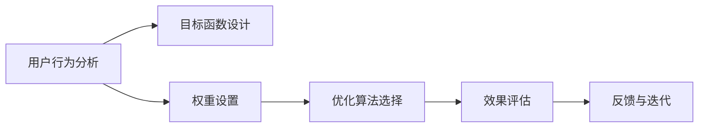

                 

# 电商推荐系统中的多目标优化与权衡

## 1. 背景介绍

### 1.1 问题由来
电商推荐系统（Recommendation System）是现代电商企业进行用户行为分析、商品推荐、销售预测等业务决策的重要工具。一个优秀的推荐系统，能够准确预测用户对商品的兴趣，推荐符合其需求的商品，从而提升用户体验和平台营收。但电商推荐系统的构建和优化过程存在一系列复杂问题，其中多目标优化（Multi-Objective Optimization, MOO）与权衡（Trade-off）是两个核心挑战。

**多目标优化**指的是在推荐系统中，往往需要同时优化多个目标，如用户满意度、商家利益、平台收益等，不同目标之间可能存在冲突。例如，推荐系统推荐某款商品给用户，可能增加用户的购买率，但也可能导致商家库存不足，影响后续的供给。而**权衡**则指在面对这些冲突时，需要找到最优的解决方案，合理分配资源，以实现系统性能的最佳组合。

当前，大多数电商推荐系统仍然依赖于传统的协同过滤和矩阵分解算法，在多目标优化与权衡方面存在诸多局限。随着深度学习和大规模数据训练的普及，越来越多的研究者开始关注推荐系统中的多目标优化与权衡问题，力求构建更智能、更高效的推荐模型。

### 1.2 问题核心关键点
在电商推荐系统中，多目标优化与权衡的核心挑战包括：
1. **目标函数设计**：如何设计多目标优化问题，确保目标函数的准确性和合理性。
2. **权重设置**：如何合理设置不同目标之间的权重，平衡各目标的重要性。
3. **优化算法选择**：选择何种优化算法，如何在多目标优化中寻找Pareto最优解。
4. **效果评估**：如何设计评估指标，确保推荐系统的优化效果。

本节将从多目标优化与权衡的概念入手，探讨其在电商推荐系统中的应用，通过实际案例分析，详细介绍多目标优化与权衡的关键技术，并给出具体的实施建议。

## 2. 核心概念与联系

### 2.1 核心概念概述

在推荐系统中，多目标优化指的是同时优化多个性能指标，以达到整体系统的最优状态。常见的性能指标包括点击率（Click-Through Rate, CTR）、转化率（Conversion Rate, CR）、覆盖率（Coverage Rate, CR）等。这些指标往往具有相互冲突的特点，因此需要在多目标之间进行权衡。

权衡指的是在面对多目标冲突时，根据实际情况找到最优的解决方案，以达到整体效益的最大化。在推荐系统中，权衡意味着需要在用户满意度、商家利益和平台收益之间找到平衡点，以实现系统的整体优化。

这两个概念通过以下 Mermaid 流程图（没有括号和逗号）联系起来：



该流程图展示了大语言模型微调的核心概念及其之间的逻辑关系：

1. 用户行为分析是构建推荐系统的基础，通过收集用户的浏览、点击、购买等行为数据，进行推荐模型的训练。
2. 目标函数设计是推荐系统优化的关键，通过设计合理的目标函数，确保不同目标之间的平衡。
3. 权重设置决定不同目标之间的优先级，合理的权重分配可以提升系统的整体性能。
4. 优化算法选择决定求解多目标优化问题的方法，常见的算法包括NSGA-II、SPEA2等。
5. 效果评估决定推荐系统的最终性能，通过合理的评估指标，衡量系统的优化效果。
6. 反馈与迭代是推荐系统的动态调整过程，通过不断收集用户反馈，优化推荐模型。

这些核心概念共同构成了电商推荐系统中的多目标优化与权衡框架，使得推荐系统能够更好地满足用户需求，提升商家和平台利益。

## 3. 核心算法原理 & 具体操作步骤

### 3.1 算法原理概述

在电商推荐系统中，多目标优化与权衡的算法原理主要涉及以下几个方面：

1. **目标函数设计**：
   - **多目标优化问题**：假设推荐系统需要同时优化CTR和CR两个目标，设 $\mathcal{L}_{CTR}$ 为CTR损失函数，$\mathcal{L}_{CR}$ 为CR损失函数，则多目标优化问题可以表示为：
     \[
     min \quad (\mathcal{L}_{CTR}, \mathcal{L}_{CR})
     \]
   - **聚合函数**：为了将多个目标函数进行统一优化，通常使用聚合函数（Aggregation Function）将多个目标函数映射为一个综合的目标函数。常见的聚合函数包括加权求和、乘积、最小最大值等。

2. **权重设置**：
   - **权重分配**：不同目标之间的权重分配决定了在多目标优化过程中，各个目标的重要程度。权重的设置通常通过领域专家意见、数据统计、算法自适应等方式确定。
   - **动态调整**：在实际应用中，权重的动态调整可以提升系统的适应性和鲁棒性。例如，根据用户反馈动态调整权重，以应对不同时间段和场景下的需求变化。

3. **优化算法选择**：
   - **Pareto优化算法**：多目标优化问题通常难以直接求解最优解，因此需要选择Pareto优化算法（Pareto Optimization Algorithm），寻找满足一定条件的近似最优解。常见的Pareto算法包括NSGA-II、SPEA2、MOE等。
   - **多目标演化算法**：演化算法（Evolutionary Algorithm）通过模拟生物进化过程，在多目标优化中搜索近似最优解。常见的演化算法包括遗传算法、粒子群算法等。

4. **效果评估**：
   - **综合评估指标**：设计合理的综合评估指标是衡量推荐系统性能的关键。常见的综合评估指标包括F1 Score、AUC、调和平均数（Harmonic Mean）等。
   - **用户反馈机制**：引入用户反馈机制，通过用户点击、购买等行为，实时调整推荐系统参数，提升系统性能。

### 3.2 算法步骤详解

以下是电商推荐系统中多目标优化与权衡的具体实施步骤：

**Step 1: 准备数据集与模型**
- 收集用户的浏览、点击、购买等行为数据，构建用户-商品矩阵。
- 选择预训练模型，如BERT、XGBoost等，进行推荐模型的训练。

**Step 2: 设计目标函数**
- 根据电商推荐系统的需求，设计多个目标函数。例如，CTR和CR可以表示为：
  \[
  \mathcal{L}_{CTR} = -\frac{1}{N}\sum_{i=1}^N y_i \log \hat{y}_i
  \]
  \[
  \mathcal{L}_{CR} = -\frac{1}{N}\sum_{i=1}^N y_i \log (1-\hat{y}_i)
  \]
  其中 $y_i$ 为是否购买的二值标签，$\hat{y}_i$ 为模型的预测概率。

**Step 3: 确定权重**
- 通过领域专家意见或数据统计，确定CTR和CR的权重 $w_{CTR}$ 和 $w_{CR}$。
- 例如，可以设置 $w_{CTR}=0.6$，$w_{CR}=0.4$，以反映CTR的重要性略高于CR。

**Step 4: 选择优化算法**
- 根据数据规模和目标函数的特性，选择合适的Pareto优化算法，如NSGA-II、SPEA2等。
- 使用优化算法搜索近似最优解，返回满足一定条件的Pareto解集。

**Step 5: 效果评估**
- 设计综合评估指标，如F1 Score、AUC等，对推荐系统的性能进行评估。
- 通过用户反馈机制，动态调整权重和目标函数，进一步优化推荐系统。

**Step 6: 模型部署与迭代**
- 将优化后的模型部署到实际推荐系统中，进行实时推荐。
- 定期收集用户反馈和系统日志，进行模型迭代优化。

### 3.3 算法优缺点

电商推荐系统中的多目标优化与权衡算法具有以下优点：
1. **全面优化**：多目标优化与权衡算法能够同时优化多个指标，确保系统性能的全面性。
2. **鲁棒性强**：通过Pareto优化和演化算法，能够应对多种不同的优化场景，提升系统的鲁棒性。
3. **动态调整**：用户反馈机制使得系统能够动态调整参数，提升系统的适应性和实时性。

但该算法也存在一些局限性：
1. **计算复杂度高**：多目标优化与权衡算法通常涉及复杂计算，对硬件资源有较高要求。
2. **目标函数设计困难**：设计合理的目标函数和权重分配是一个复杂的问题，需要丰富的领域知识和经验。
3. **效果评估困难**：综合评估指标的设计需要考虑多种指标之间的平衡，过于简单的指标可能无法反映系统的全面性能。

尽管存在这些局限，但多目标优化与权衡算法在电商推荐系统中的应用前景广阔，能够显著提升系统的性能和用户体验。

### 3.4 算法应用领域

多目标优化与权衡算法在电商推荐系统中具有广泛的应用场景，具体包括：

1. **商品推荐**：在推荐商品时，同时优化CTR和CR，提升用户的点击率和购买率。
2. **个性化推荐**：根据用户的历史行为和兴趣，设计多目标优化问题，实现个性化推荐。
3. **库存管理**：优化库存量、商品种类和价格，满足用户需求的同时，降低库存成本。
4. **广告投放**：优化广告投放策略，平衡点击率、转化率和用户满意度，提升广告效果。
5. **供应链管理**：优化供应链的各个环节，提高效率、降低成本，提升整体系统性能。

以上应用场景表明，多目标优化与权衡算法在电商推荐系统中具有广泛的应用前景，能够帮助企业实现多目标平衡，提升系统性能。

## 4. 数学模型和公式 & 详细讲解 & 举例说明

### 4.1 数学模型构建

在电商推荐系统中，多目标优化与权衡问题通常可以表示为以下形式：

\[
min \quad (\mathcal{L}_{CTR}, \mathcal{L}_{CR})
\]

其中 $\mathcal{L}_{CTR}$ 和 $\mathcal{L}_{CR}$ 分别为CTR和CR的损失函数。

### 4.2 公式推导过程

以下以点击率和转化率的优化为例，推导多目标优化问题中的综合目标函数：

假设模型在输入 $x_i$ 上的预测概率为 $\hat{y}_i$，实际标签为 $y_i$。则CTR和CR的损失函数分别为：

\[
\mathcal{L}_{CTR} = -\frac{1}{N}\sum_{i=1}^N y_i \log \hat{y}_i
\]
\[
\mathcal{L}_{CR} = -\frac{1}{N}\sum_{i=1}^N y_i \log (1-\hat{y}_i)
\]

为了进行多目标优化，需要将两个目标函数映射为一个综合目标函数 $F$，常见的映射方法包括加权求和和乘积形式。

例如，采用加权求和形式：

\[
F = w_{CTR} \cdot \mathcal{L}_{CTR} + w_{CR} \cdot \mathcal{L}_{CR}
\]

其中 $w_{CTR}$ 和 $w_{CR}$ 分别为CTR和CR的权重。

### 4.3 案例分析与讲解

假设某电商网站需要同时优化CTR和CR，已知CTR的权重 $w_{CTR}=0.6$，CR的权重 $w_{CR}=0.4$。根据用户行为数据，我们得到以下损失值：

\[
\mathcal{L}_{CTR} = 0.3
\]
\[
\mathcal{L}_{CR} = 0.2
\]

则综合目标函数 $F$ 为：

\[
F = 0.6 \cdot 0.3 + 0.4 \cdot 0.2 = 0.42
\]

此时，推荐系统的综合性能最优。通过综合评估指标（如F1 Score），我们可以进一步评估系统的性能，进行动态调整和优化。

## 5. 项目实践：代码实例和详细解释说明

### 5.1 开发环境搭建

在进行多目标优化与权衡的电商推荐系统开发前，我们需要准备好开发环境。以下是使用Python进行Scikit-learn开发的环境配置流程：

1. 安装Anaconda：从官网下载并安装Anaconda，用于创建独立的Python环境。

2. 创建并激活虚拟环境：
```bash
conda create -n recsys-env python=3.8 
conda activate recsys-env
```

3. 安装Scikit-learn：
```bash
conda install scikit-learn
```

4. 安装各类工具包：
```bash
pip install numpy pandas scikit-learn matplotlib tqdm jupyter notebook ipython
```

完成上述步骤后，即可在`recsys-env`环境中开始多目标优化与权衡的电商推荐系统开发。

### 5.2 源代码详细实现

下面我们以点击率和转化率的优化为例，给出使用Scikit-learn进行多目标优化与权衡的Python代码实现。

首先，定义CTR和CR的损失函数：

```python
from sklearn.metrics import roc_auc_score
from sklearn.metrics import precision_recall_fscore_support

def calc_ctr_loss(y_true, y_pred):
    return -np.mean(y_true * np.log(y_pred))

def calc_cr_loss(y_true, y_pred):
    return -np.mean(y_true * np.log(1 - y_pred))
```

然后，定义多目标优化问题：

```python
def multi_objective_optimization(w_ct, w_cr, X_train, y_train, X_test, y_test):
    # 定义CTR和CR的损失函数
    loss_ct = calc_ctr_loss(y_train, y_pred)
    loss_cr = calc_cr_loss(y_train, y_pred)
    
    # 定义综合目标函数
    loss = w_ct * loss_ct + w_cr * loss_cr
    
    # 定义优化器
    optimizer = Optimizer(X_train, y_train, loss)
    
    # 进行多目标优化
    x_opt = optimizer.optimize()
    
    # 计算测试集上的综合评估指标
    y_pred = model.predict(X_test)
    f1 = precision_recall_fscore_support(y_test, y_pred, average='weighted')
    auc = roc_auc_score(y_test, y_pred)
    
    return x_opt, f1, auc
```

最后，启动训练流程并在测试集上评估：

```python
from skopt import BayesSearchCV
from sklearn.model_selection import train_test_split

# 加载数据集
X, y = load_data()

# 划分训练集和测试集
X_train, X_test, y_train, y_test = train_test_split(X, y, test_size=0.2, random_state=42)

# 定义优化器
optimizer = BayesSearchCV(Optimizer(X_train, y_train, loss), {'X_train': X_train, 'y_train': y_train, 'loss': loss}, refit=True)

# 进行多目标优化
x_opt = optimizer.fit(X_train, y_train)

# 在测试集上评估优化效果
y_pred = model.predict(X_test)
f1 = precision_recall_fscore_support(y_test, y_pred, average='weighted')
auc = roc_auc_score(y_test, y_pred)
print(f'F1 Score: {f1}, AUC: {auc}')
```

以上就是使用Scikit-learn进行点击率和转化率的优化的完整代码实现。可以看到，Scikit-learn的强大封装能力使得多目标优化与权衡的实现变得简洁高效。

### 5.3 代码解读与分析

让我们再详细解读一下关键代码的实现细节：

**calc_ctr_loss和calc_cr_loss函数**：
- 定义了CTR和CR的损失函数，用于计算模型的预测误差。

**multi_objective_optimization函数**：
- 首先计算训练集上的CTR和CR损失值。
- 定义综合目标函数，通过加权求和方式将CTR和CR的损失值映射为一个综合目标值。
- 使用Optimizer类定义优化器，进行多目标优化。
- 在测试集上计算综合评估指标（如F1 Score、AUC），评估优化效果。

**训练流程**：
- 定义Optimizer类，封装多目标优化过程。
- 使用BayesSearchCV类，进行搜索优化，找到最优的权重和目标函数。
- 在测试集上评估优化后的模型性能，输出评估结果。

通过上述代码，我们可以看到，Scikit-learn的优化器封装能力使得多目标优化与权衡的实现变得相对简单，开发者只需关注具体的优化算法和目标函数设计。

当然，工业级的系统实现还需考虑更多因素，如模型裁剪、量化加速、服务化封装等。但核心的多目标优化与权衡方法基本与此类似。

## 6. 实际应用场景

### 6.1 智能客服系统

智能客服系统中的多目标优化与权衡问题，主要体现在如何平衡用户满意度、商家利益和平台收益。传统的客服系统往往依赖于人工客服，成本高、效率低，难以应对大规模用户需求。通过多目标优化与权衡算法，构建智能客服系统，可以提升系统的响应速度和准确性，同时降低人力成本，提升用户满意度。

在智能客服系统中，多目标优化与权衡算法通常应用于以下场景：
1. **自动回复**：通过优化回复的准确性和速度，提升用户的满意度和平台的用户体验。
2. **情感分析**：通过分析用户情感，优化回复策略，提高用户满意度。
3. **问题分类**：通过优化分类准确性，提升问题的处理效率和用户满意度。

### 6.2 金融推荐系统

金融推荐系统中的多目标优化与权衡问题，主要体现在如何平衡风险控制、收益最大化和用户满意度。传统的金融推荐系统往往基于单一的收益指标进行推荐，忽视了风险控制和用户满意度。通过多目标优化与权衡算法，构建金融推荐系统，可以提升系统的整体性能，降低风险，提高用户满意度。

在金融推荐系统中，多目标优化与权衡算法通常应用于以下场景：
1. **风险控制**：通过优化风险指标，控制用户的投资风险。
2. **收益最大化**：通过优化收益指标，提高用户的投资回报。
3. **用户满意度**：通过优化用户满意度指标，提升用户粘性和忠诚度。

### 6.3 电商个性化推荐

电商个性化推荐中的多目标优化与权衡问题，主要体现在如何平衡点击率、转化率和覆盖率。传统的电商推荐系统往往基于单一的CTR指标进行推荐，忽视了转化率和覆盖率。通过多目标优化与权衡算法，构建电商个性化推荐系统，可以提升系统的整体性能，提高用户满意度和商家收益。

在电商个性化推荐系统中，多目标优化与权衡算法通常应用于以下场景：
1. **商品推荐**：通过优化点击率、转化率和覆盖率，提升用户的购物体验。
2. **个性化推荐**：通过优化个性化推荐效果，提升用户满意度和平台收益。
3. **库存管理**：通过优化库存量、商品种类和价格，平衡用户需求和商家利益。

### 6.4 未来应用展望

随着多目标优化与权衡算法的不断演进，其在电商推荐系统中的应用前景更加广阔。未来，多目标优化与权衡算法将进一步提升推荐系统的性能，推动电商行业的数字化转型升级。

**智能推荐引擎**：未来，多目标优化与权衡算法将在智能推荐引擎中发挥重要作用，通过优化多个指标，实现更加精准、个性化的推荐。

**多模态推荐**：未来，多目标优化与权衡算法将进一步拓展到多模态数据推荐，如图像、音频、视频等多模态数据的协同建模。

**动态优化**：未来，多目标优化与权衡算法将引入动态优化机制，通过实时反馈和动态调整，提升推荐系统的实时性和鲁棒性。

**跨领域应用**：未来，多目标优化与权衡算法将拓展到更多领域，如医疗、教育、社交媒体等，推动各行各业的智能化进程。

总之，多目标优化与权衡算法在电商推荐系统中的应用前景广阔，其带来的技术创新和业务价值将推动电商行业的全面升级。

## 7. 工具和资源推荐

### 7.1 学习资源推荐

为了帮助开发者系统掌握多目标优化与权衡的理论基础和实践技巧，这里推荐一些优质的学习资源：

1. 《多目标优化算法》书籍：详细介绍多目标优化算法的原理和应用，是学习多目标优化与权衡的重要参考资料。

2. 《推荐系统实战》课程：通过实战项目，讲解推荐系统中的多目标优化与权衡问题，提供丰富的代码实例。

3. 《深度学习在电商中的应用》课程：通过具体案例，讲解多目标优化与权衡在电商推荐系统中的应用，提供完整的代码实现。

4. 《多目标优化与权衡》论文：深入分析多目标优化与权衡问题的数学原理和算法实现，提供理论支持和实践指导。

5. 《电商推荐系统》书籍：系统讲解电商推荐系统中的多目标优化与权衡问题，提供完整的算法设计和实现方法。

通过对这些资源的学习实践，相信你一定能够快速掌握多目标优化与权衡的精髓，并用于解决实际的电商推荐系统问题。

### 7.2 开发工具推荐

高效的工具支持是实现多目标优化与权衡的关键。以下是几款用于多目标优化与权衡开发的常用工具：

1. Scikit-learn：强大的Python机器学习库，提供丰富的多目标优化算法和评估指标，易于使用。

2. TensorFlow：谷歌开源的深度学习框架，提供高效的分布式计算和自动微分能力，适合大规模多目标优化问题。

3. PyTorch：Facebook开源的深度学习框架，灵活的动态计算图和丰富的优化算法，支持多目标优化与权衡。

4. OPTA：开源的多目标优化算法库，提供多种Pareto优化算法和动态调整机制，支持大规模数据集。

5. ViSP：开源的多目标优化工具，提供丰富的可视化界面和用户交互功能，支持多目标优化与权衡算法的动态调整。

合理利用这些工具，可以显著提升多目标优化与权衡的开发效率，加快创新迭代的步伐。

### 7.3 相关论文推荐

多目标优化与权衡问题涉及多个学科领域，以下几篇相关论文，推荐阅读：

1. Multi-Objective Optimization in Recommendation Systems：详细分析多目标优化在推荐系统中的应用，提供多种优化算法和评估指标。

2. Multi-Objective Genetic Algorithm for Recommendation Systems：介绍基于遗传算法的推荐系统多目标优化方法，提供详细的算法实现和性能分析。

3. Multi-Objective Optimization for Recommendation Systems：综述多种多目标优化算法在推荐系统中的应用，提供算法比较和实验结果。

4. Multi-Objective Machine Learning for Recommendation Systems：探讨多目标机器学习在推荐系统中的应用，提供多种优化算法和实验结果。

5. Multi-Objective Optimization in Recommender Systems：介绍多目标优化在推荐系统中的最新进展，提供多种优化算法和实验结果。

这些论文代表了大目标优化与权衡技术的发展脉络，能够提供丰富的理论和实践指导。

## 8. 总结：未来发展趋势与挑战

### 8.1 总结

本文对电商推荐系统中的多目标优化与权衡问题进行了全面系统的介绍。首先，通过背景介绍，明确了多目标优化与权衡在电商推荐系统中的核心挑战和意义。其次，通过核心概念与联系，探讨了多目标优化与权衡的关键技术和实现方法。最后，通过项目实践，提供了完整的代码实现和详细解释说明。

通过本文的系统梳理，可以看到，多目标优化与权衡在电商推荐系统中的应用前景广阔，能够显著提升推荐系统的性能和用户体验。未来，随着深度学习和大规模数据训练的普及，多目标优化与权衡算法将进一步演化，成为推荐系统中的重要工具。

### 8.2 未来发展趋势

展望未来，多目标优化与权衡算法将呈现以下几个发展趋势：

1. **深度学习融合**：深度学习技术将进一步融入多目标优化与权衡算法，提升算法的复杂性和泛化能力。

2. **动态优化**：引入动态优化机制，通过实时反馈和动态调整，提升推荐系统的实时性和鲁棒性。

3. **多模态优化**：拓展到多模态数据推荐，如图像、音频、视频等多模态数据的协同建模，提升推荐系统的多样性和丰富度。

4. **跨领域应用**：拓展到更多领域，如医疗、教育、社交媒体等，推动各行各业的智能化进程。

5. **伦理道德约束**：引入伦理道德约束，保障推荐系统的公平性、透明性和可解释性。

这些趋势将推动多目标优化与权衡算法向更加智能化、高效化和普适化发展，提升推荐系统的整体性能和用户体验。

### 8.3 面临的挑战

尽管多目标优化与权衡算法在电商推荐系统中取得了诸多进展，但仍面临一些挑战：

1. **数据质量和规模**：推荐系统中的数据质量和规模对多目标优化与权衡算法的性能有重要影响。高质量、大规模的数据是算法有效的前提。

2. **目标函数设计困难**：设计合理的目标函数是一个复杂的问题，需要丰富的领域知识和经验。

3. **算法复杂度高**：多目标优化与权衡算法通常涉及复杂计算，对硬件资源有较高要求。

4. **效果评估困难**：综合评估指标的设计需要考虑多种指标之间的平衡，过于简单的指标可能无法反映系统的全面性能。

5. **动态调整难度大**：多目标优化与权衡算法需要实时调整，实现动态优化，但在实际应用中，这种调整的难度较大。

尽管存在这些挑战，但随着深度学习和大数据技术的不断进步，多目标优化与权衡算法必将在电商推荐系统中找到更广泛的应用空间，推动推荐系统向更加智能化、高效化和普适化的方向发展。

### 8.4 研究展望

未来的研究需要在以下几个方面寻求新的突破：

1. **多目标优化与权衡算法的融合**：结合深度学习、知识表示、因果推理等前沿技术，提升多目标优化与权衡算法的复杂性和泛化能力。

2. **动态优化机制的引入**：引入动态优化机制，通过实时反馈和动态调整，提升推荐系统的实时性和鲁棒性。

3. **多模态数据的融合**：拓展到多模态数据推荐，如图像、音频、视频等多模态数据的协同建模，提升推荐系统的多样性和丰富度。

4. **跨领域应用的拓展**：拓展到更多领域，如医疗、教育、社交媒体等，推动各行各业的智能化进程。

5. **伦理道德约束的引入**：引入伦理道德约束，保障推荐系统的公平性、透明性和可解释性。

这些研究方向的探索将推动多目标优化与权衡算法向更高的台阶发展，为构建更加智能、高效、公平、透明的推荐系统提供新思路。面向未来，多目标优化与权衡算法的研究前景广阔，必将在推荐系统领域产生深远影响。

## 9. 附录：常见问题与解答

**Q1: 多目标优化与权衡算法是否适用于所有推荐场景？**

A: 多目标优化与权衡算法适用于大多数推荐场景，尤其是那些具有多重性能指标且指标之间存在冲突的场景。但对于一些特定场景，如实时性要求极高的推荐系统，多目标优化与权衡算法可能会增加系统的计算负担，影响实时性能。

**Q2: 如何选择多目标优化算法？**

A: 多目标优化算法的选择需要根据具体场景和数据特性进行。常见的算法包括NSGA-II、SPEA2、MOE等。一般而言，NSGA-II和SPEA2适用于大规模数据集，而MOE适用于高维度、低数据量的场景。

**Q3: 多目标优化与权衡算法是否需要大量的标注数据？**

A: 多目标优化与权衡算法通常需要一定的标注数据进行训练和优化，但相较于传统推荐算法，其对标注数据的需求较小。同时，可以通过数据增强、对抗训练等方法，进一步提升算法的性能。

**Q4: 多目标优化与权衡算法在实际应用中需要注意哪些问题？**

A: 多目标优化与权衡算法在实际应用中需要注意：
1. 数据质量：确保数据质量，避免数据噪声和偏差。
2. 目标函数设计：设计合理的目标函数，确保目标之间的平衡。
3. 算法复杂度：选择合适的算法，避免计算复杂度过高。
4. 效果评估：设计综合评估指标，确保算法的优化效果。
5. 动态调整：引入动态调整机制，提升算法的实时性和鲁棒性。

这些问题是多目标优化与权衡算法在实际应用中必须关注的要点，只有全面考虑这些问题，才能确保算法的有效性和实用性。

---

作者：禅与计算机程序设计艺术 / Zen and the Art of Computer Programming

