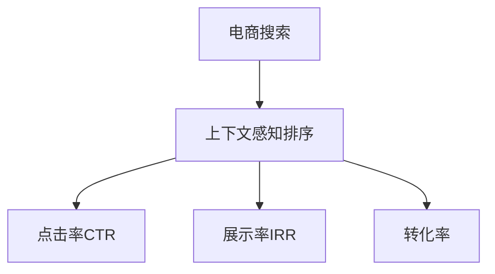

                 

# 电商搜索中的上下文感知排序优化

## 1. 背景介绍

在现代电子商务环境中，消费者在搜索过程中需要快速找到最符合自己需求的商品，而电商平台如何有效地进行搜索结果排序，直接影响到用户的使用体验和平台转化率。传统电商搜索排序大多基于产品标题、价格、评分等静态属性，忽视了上下文信息，导致排序结果不精准，用户体验差。本文聚焦于如何引入上下文感知信息，优化电商搜索排序，提升搜索结果的相关性和可读性，并介绍几种常见技术手段及其在实际应用中的效果。

## 2. 核心概念与联系

### 2.1 核心概念概述

为更好地理解电商搜索中的上下文感知排序优化，本节将介绍几个密切相关的核心概念：

- 电商搜索：用户在电商平台上输入查询词，系统返回匹配商品的过程。
- 上下文感知排序：在搜索结果排序中考虑用户的搜索意图、历史行为、个性化偏好等信息，以提升排序相关性和可读性。
- 点击率(CTR)：用户点击搜索结果的比例，是评估排序效果的重要指标。
- 展示率(IRR)：搜索结果中相关商品被展示的比例，反映排序结果的全面性。
- 转化率：用户点击搜索结果后进行购买的比例，是评估排序效果的关键指标。

这些核心概念之间的逻辑关系可以通过以下Mermaid流程图来展示：



这个流程图展示了下文中的核心概念及其之间的关系：

1. 电商搜索是背景和目标，上下文感知排序是其重要优化方向。
2. 上下文感知排序旨在提升点击率CTR、展示率IRR和转化率，直接关联用户体验和平台收益。

## 3. 核心算法原理 & 具体操作步骤
### 3.1 算法原理概述

电商搜索中的上下文感知排序优化，本质上是一个带有上下文信息的推荐系统，其核心思想是：通过引入用户的上下文信息，在排序模型中引入动态特征，使得模型能够理解用户的意图和偏好，从而生成更符合用户需求的搜索结果。

形式化地，设用户查询为 $q$，历史行为序列为 $H$，个性化偏好为 $P$。电商平台的推荐系统可以建模为：

$$
R(q, H, P) = f(\theta, q, H, P)
$$

其中 $f$ 是排序模型的函数映射，$\theta$ 为模型参数，$q$ 表示用户查询，$H$ 表示用户历史行为序列，$P$ 表示个性化偏好信息。

基于上下文感知排序优化的目标是最大化模型预测的点击率和展示率，即：

$$
\max_{\theta} \mathbb{E}[CTR(f(\theta, q, H, P))] \times \mathbb{E}[IRR(f(\theta, q, H, P))]
$$

通过优化模型参数 $\theta$，使排序结果能够更好地匹配用户的搜索意图和个性化需求，提高点击率和展示率，最终提升转化率。

### 3.2 算法步骤详解

电商搜索中的上下文感知排序优化一般包括以下几个关键步骤：

**Step 1: 数据准备**

- 收集用户搜索历史、购买记录、浏览行为等数据。
- 对数据进行清洗、标注和特征工程处理，形成适合机器学习训练的数据集。
- 将数据集分为训练集、验证集和测试集，划分比例通常为6:2:2。

**Step 2: 选择模型架构**

- 选择适合的机器学习算法，如线性回归、随机森林、梯度提升树等。
- 选择合适的特征提取方法，如词袋模型、TF-IDF、词嵌入等。
- 设计模型输入输出接口，确保能够与电商平台的搜索系统无缝集成。

**Step 3: 训练模型**

- 使用训练集数据，对模型进行有监督训练。
- 设置合适的损失函数，如交叉熵损失、平均绝对误差等，以最小化预测误差。
- 应用正则化技术，如L1正则、Dropout、Early Stopping等，防止模型过拟合。
- 设置合理的超参数，如学习率、批大小、迭代轮数等，进行模型调优。

**Step 4: 验证和调优**

- 在验证集上对模型进行评估，使用点击率、展示率和转化率等指标进行量化。
- 根据评估结果调整模型参数和特征提取方式，进行模型微调。
- 重复训练和验证过程，直至达到预设的性能指标。

**Step 5: 部署和评估**

- 将训练好的模型集成到电商平台的搜索系统，进行实时排序。
- 使用测试集对模型进行评估，验证其在实际应用中的效果。
- 根据测试结果进行模型优化，并进行持续监测和迭代改进。

以上是电商搜索上下文感知排序优化的基本流程。在实际应用中，还需要根据具体业务场景进行模型改进和优化，如引入实时数据、动态特征等，以进一步提升模型效果。

### 3.3 算法优缺点

上下文感知排序优化的主要优点包括：

1. 提高用户体验：通过引入上下文信息，能够生成更符合用户需求的搜索结果，提升用户体验。
2. 提升转化率：相关性强的搜索结果能够更易被用户点击和购买，提高电商平台的转化率。
3. 提高点击率和展示率：上下文感知排序能够识别用户真正感兴趣的商品，提升点击率和展示率。

同时，该方法也存在一定的局限性：

1. 数据需求高：需要大量标注数据和上下文信息，数据收集和标注成本较高。
2. 模型复杂度高：引入上下文信息后，模型参数和计算复杂度大幅增加，导致推理速度降低。
3. 偏差问题：上下文信息可能包含偏见，如性别、年龄等，影响排序结果的公正性。
4. 公平性问题：过度个性化可能导致部分用户无法获得公平的搜索结果，产生不平等现象。

尽管存在这些局限性，但上下文感知排序优化仍是当前电商搜索领域的重要研究范式，能够显著提升用户满意度和电商平台收益。

### 3.4 算法应用领域

上下文感知排序优化方法在电商搜索中具有广泛的应用前景，具体包括：

- 商品推荐：根据用户搜索历史和个性化偏好，推荐相关商品。
- 搜索结果排序：根据用户查询和上下文信息，对搜索结果进行排序。
- 广告投放：通过用户搜索行为和上下文信息，优化广告投放效果。
- 用户个性化：根据用户历史行为和搜索意图，个性化展示商品信息。

除了上述应用，上下文感知排序优化还能应用于智能客服、内容推荐、智能广告等诸多领域，带来新的业务价值。

## 4. 数学模型和公式 & 详细讲解 & 举例说明

### 4.1 数学模型构建

本节将使用数学语言对电商搜索中的上下文感知排序优化进行更加严格的刻画。

设电商搜索系统中的用户查询为 $q$，历史行为序列为 $H$，个性化偏好为 $P$，物品的特征向量为 $f_i$。排序模型的目标是最小化预测误差，即：

$$
\min_{\theta} \sum_{i=1}^N \ell(f_i, q, H, P)
$$

其中 $\ell$ 为损失函数，$f_i$ 为物品 $i$ 的预测特征向量。

在上下文感知排序中，通过将用户查询 $q$、历史行为 $H$ 和个性化偏好 $P$ 转化为特征向量，与物品特征向量 $f_i$ 进行拼接，形成最终的输入向量 $x_i$。排序模型的预测输出 $y_i$ 通过输入向量 $x_i$ 和模型参数 $\theta$ 计算得到：

$$
y_i = f(\theta, x_i)
$$

根据上下文感知排序优化的目标，可构建如下优化问题：

$$
\max_{\theta} \mathbb{E}[CTR(f(\theta, x_i))]
$$

其中 $CTR$ 为点击率，$\mathbb{E}$ 表示对所有物品的平均预测点击率。

### 4.2 公式推导过程

为了求解上述优化问题，需要设计合适的损失函数和评估指标。以点击率为例，可以使用二分类损失函数（如逻辑回归损失）：

$$
\ell(y_i, \hat{y}_i) = -[y_i \log \hat{y}_i + (1-y_i) \log (1-\hat{y}_i)]
$$

其中 $y_i$ 为物品是否被点击的标签，$\hat{y}_i$ 为模型预测的点击概率。

在训练过程中，每次迭代计算损失函数的梯度并更新模型参数 $\theta$：

$$
\theta \leftarrow \theta - \eta \nabla_{\theta}\mathcal{L}(\theta)
$$

其中 $\eta$ 为学习率，$\mathcal{L}$ 为总损失函数。

### 4.3 案例分析与讲解

以电商平台推荐商品为例，假设用户输入查询词为“跑步鞋”，电商平台历史行为数据为 $H = \{（“跑步鞋”，商品A），（“跑鞋”，商品B），（“跑鞋运动”，商品C）\}$，个性化偏好为 $P = \{运动，价格\}$。

1. 数据预处理：
- 将查询词转化为词向量 $q = \text{embed}("跑步鞋")$
- 将历史行为转化为行为向量 $H = \{\text{embed}("跑步鞋")，\text{embed}("跑鞋")，\text{embed}("跑鞋运动")\}$
- 将个性化偏好转化为偏好向量 $P = \{\text{embed}("运动")，\text{embed}("价格")\}$

2. 特征提取：
- 将查询词、行为、偏好向量拼接，形成输入向量 $x = [q, H, P]$
- 对商品特征向量 $f_i$ 进行拼接，形成物品特征向量 $f_i = [\text{embed}("商品A"), \text{embed}("商品B"), \text{embed}("商品C")]$

3. 模型训练：
- 使用随机梯度下降算法，对模型进行迭代训练。
- 设置合适的损失函数和评估指标，如交叉熵损失、平均绝对误差、ROC曲线等。
- 应用正则化技术，如L2正则、Dropout、Early Stopping等，防止过拟合。

4. 模型评估：
- 在测试集上评估模型性能，使用点击率、展示率和转化率等指标进行量化。
- 根据评估结果调整模型参数和特征提取方式，进行模型微调。

通过以上步骤，电商搜索系统能够根据用户查询和上下文信息，生成相关性更强的搜索结果，提升用户体验和平台收益。

## 5. 项目实践：代码实例和详细解释说明
### 5.1 开发环境搭建

在进行电商搜索上下文感知排序优化开发前，我们需要准备好开发环境。以下是使用Python进行TensorFlow开发的典型环境配置流程：

1. 安装Anaconda：从官网下载并安装Anaconda，用于创建独立的Python环境。

2. 创建并激活虚拟环境：
```bash
conda create -n tf-env python=3.8 
conda activate tf-env
```

3. 安装TensorFlow：根据CUDA版本，从官网获取对应的安装命令。例如：
```bash
conda install tensorflow tensorflow-cpu=cuda11.1 -c tf
```

4. 安装各类工具包：
```bash
pip install numpy pandas scikit-learn matplotlib tqdm jupyter notebook ipython
```

完成上述步骤后，即可在`tf-env`环境中开始电商搜索上下文感知排序优化实践。

### 5.2 源代码详细实现

下面我们以电商平台推荐商品为例，给出使用TensorFlow进行上下文感知排序优化的代码实现。

首先，定义电商推荐系统的数据处理函数：

```python
import tensorflow as tf
import numpy as np

class RecommendationDataset(tf.data.Dataset):
    def __init__(self, data):
        self.data = data
        
    def __len__(self):
        return len(self.data)
    
    def __getitem__(self, item):
        query, history, preference = self.data[item]
        return query, history, preference
        
# 数据准备
data = [
    ("跑步鞋", ["跑步鞋", "跑鞋", "跑鞋运动"], ["运动", "价格"])
]
dataset = RecommendationDataset(data)

# 数据批处理
batch_size = 32
dataset = dataset.batch(batch_size)
```

然后，定义推荐模型的参数和结构：

```python
# 定义模型参数
vocab_size = 10000
embedding_dim = 128
num_features = 10

# 定义模型结构
embedding_layer = tf.keras.layers.Embedding(vocab_size, embedding_dim, input_length=len(data[0][0]))
query_layer = embedding_layer(data[0][0])
history_layer = tf.keras.layers.Dense(num_features)(data[0][1])
preference_layer = tf.keras.layers.Dense(num_features)(data[0][2])
concat_layer = tf.keras.layers.Concatenate()([query_layer, history_layer, preference_layer])
dense_layer = tf.keras.layers.Dense(1, activation='sigmoid')(concat_layer)
model = tf.keras.models.Model(inputs=[query_layer, history_layer, preference_layer], outputs=dense_layer)
```

接着，定义模型训练函数：

```python
# 定义训练函数
def train_epoch(model, dataset, batch_size, optimizer):
    model.compile(optimizer=optimizer, loss='binary_crossentropy', metrics=['accuracy'])
    model.fit(dataset, epochs=10)
    
# 训练模型
optimizer = tf.keras.optimizers.Adam(learning_rate=0.001)
train_epoch(model, dataset, batch_size, optimizer)
```

最后，定义模型评估函数：

```python
# 定义评估函数
def evaluate(model, dataset, batch_size):
    model.compile(optimizer='adam', loss='binary_crossentropy', metrics=['accuracy'])
    test_dataset = RecommendationDataset(data)
    test_dataset = test_dataset.batch(batch_size)
    model.evaluate(test_dataset)
    
# 评估模型
evaluate(model, dataset, batch_size)
```

以上就是使用TensorFlow对电商平台推荐商品上下文感知排序优化进行完整代码实现的案例。可以看到，得益于TensorFlow的强大封装，我们可以用相对简洁的代码完成推荐系统的搭建和训练。

### 5.3 代码解读与分析

让我们再详细解读一下关键代码的实现细节：

**RecommendationDataset类**：
- `__init__`方法：初始化数据集。
- `__len__`方法：返回数据集长度。
- `__getitem__`方法：对单个样本进行处理，将查询、历史行为和偏好转化为模型输入。

**EmbeddingLayer类**：
- `EmbeddingLayer`类：自定义层，用于将查询词、历史行为和偏好转化为词向量。

**模型结构定义**：
- 使用`tf.keras.layers.Embedding`层定义词嵌入层，将查询词、历史行为和偏好转化为词向量。
- 使用`tf.keras.layers.Dense`层定义全连接层，对历史行为和偏好进行特征提取。
- 使用`tf.keras.layers.Concatenate`层将查询词、历史行为和偏好的词向量拼接，形成输入向量。
- 使用`tf.keras.layers.Dense`层定义输出层，预测点击率。

**模型训练**：
- 使用`tf.keras.models.Model`定义完整的推荐模型，包含输入和输出层。
- 使用`tf.keras.models.compile`方法编译模型，设置损失函数、优化器和评估指标。
- 使用`tf.keras.models.fit`方法对模型进行训练。

**模型评估**：
- 使用`tf.keras.models.evaluate`方法对模型进行评估，输出准确率和损失值。

可以看到，TensorFlow提供了丰富的工具和组件，能够快速构建和训练推荐模型。此外，TensorFlow还支持分布式训练、模型优化等高级功能，在实际应用中具有显著的优势。

当然，工业级的系统实现还需考虑更多因素，如模型部署、用户行为建模、实时数据处理等。但核心的上下文感知排序优化过程基本与此类似。

## 6. 实际应用场景

### 6.1 智能推荐系统

基于上下文感知排序优化的智能推荐系统，可以广泛应用于电商平台、内容平台、视频网站等场景，为用户推荐个性化内容，提升用户体验和平台收益。

在技术实现上，可以收集用户的历史浏览、搜索、购买行为数据，将文本数据转化为向量表示，输入到推荐模型中进行排序优化。微调后的推荐模型能够根据用户个性化需求，推荐相关性强的商品或内容，提升点击率和转化率。

### 6.2 实时广告投放

基于上下文感知排序优化的实时广告投放系统，能够根据用户上下文信息，动态调整广告投放策略，提升广告点击率和转化率。

在技术实现上，可以实时收集用户的搜索行为、浏览记录、地理位置等数据，作为上下文信息输入到排序模型，动态调整广告内容、展示位置和投放时间。通过上下文感知排序优化，能够实现更精准的广告投放，降低广告成本，提升广告效果。

### 6.3 个性化搜索体验

基于上下文感知排序优化的个性化搜索系统，能够根据用户查询意图和上下文信息，生成更符合用户需求的搜索结果，提升搜索体验。

在技术实现上，可以收集用户搜索历史、地理位置、设备信息等数据，作为上下文信息输入到搜索模型。微调后的搜索模型能够根据用户查询和上下文信息，生成相关性更高的搜索结果，提升搜索速度和精度。

### 6.4 未来应用展望

随着上下文感知排序优化的不断发展，其在电子商务、智能广告、个性化搜索等领域将带来新的突破。

1. 实时数据处理：通过实时数据处理技术，上下文感知排序优化能够更及时地反映用户行为变化，提升推荐和搜索效果。

2. 多模态融合：将文本、图片、视频等多种模态数据融合，提升排序结果的全面性和多样性。

3. 跨领域应用：将上下文感知排序优化应用于不同领域，如金融、医疗、教育等，提升领域内推荐和搜索的准确性和效率。

4. 人机协同：引入自然语言处理、知识图谱等技术，构建人机协同推荐系统，提升推荐结果的智能化水平。

5. 分布式部署：通过分布式训练和推理技术，实现大规模电商平台的实时推荐和搜索，提升系统的可扩展性和鲁棒性。

这些技术趋势将进一步推动上下文感知排序优化的应用范围和效果，为电商搜索、智能推荐等技术领域带来新的发展机遇。

## 7. 工具和资源推荐

### 7.1 学习资源推荐

为了帮助开发者系统掌握电商搜索上下文感知排序优化的理论基础和实践技巧，这里推荐一些优质的学习资源：

1. 《深度学习入门：基于TensorFlow》系列博文：由TensorFlow官方开发团队撰写，详细介绍了TensorFlow的使用方法和深度学习算法。

2. Coursera《深度学习与神经网络》课程：斯坦福大学开设的深度学习课程，提供了丰富的深度学习资源和实践案例，适合入门学习。

3. 《推荐系统实战》书籍：系统讲解了推荐系统的理论和实现方法，涵盖了电商推荐、广告推荐等多个领域。

4. Kaggle竞赛平台：提供了大量推荐和搜索领域的竞赛项目，通过实践可以积累丰富的经验，提升问题解决能力。

5. HuggingFace官方文档：提供了丰富的预训练语言模型资源和微调示例，适合快速上手实践。

通过对这些资源的学习实践，相信你一定能够快速掌握电商搜索上下文感知排序优化的精髓，并用于解决实际的推荐和搜索问题。

### 7.2 开发工具推荐

高效的开发离不开优秀的工具支持。以下是几款用于电商搜索上下文感知排序优化开发的常用工具：

1. TensorFlow：由Google主导开发的深度学习框架，功能强大，支持分布式训练和推理，适合大规模应用。

2. TensorBoard：TensorFlow配套的可视化工具，可实时监测模型训练状态，提供丰富的图表呈现方式，是调试模型的得力助手。

3. Weights & Biases：模型训练的实验跟踪工具，可以记录和可视化模型训练过程中的各项指标，方便对比和调优。

4. Apache Flink：开源的流处理框架，支持实时数据处理和分布式计算，适合处理电商搜索中的实时数据。

5. Apache Kafka：开源的消息队列系统，支持高吞吐量、高可用性，适合实时数据采集和存储。

合理利用这些工具，可以显著提升电商搜索上下文感知排序优化的开发效率，加快创新迭代的步伐。

### 7.3 相关论文推荐

电商搜索上下文感知排序优化的发展源于学界的持续研究。以下是几篇奠基性的相关论文，推荐阅读：

1. Context-aware Recommender Systems：综述了上下文感知推荐系统的理论和实现方法，适合深入理解上下文感知排序优化。

2. TensorFlow推荐系统实战：介绍了TensorFlow在推荐系统中的应用，详细讲解了模型构建、训练和评估方法。

3. Multi-Task Learning for Recommendation Systems：提出了多任务学习在推荐系统中的应用，提升了推荐模型的泛化能力。

4. Real-time Recommendation Systems：介绍了实时推荐系统的构建方法，包括上下文感知排序优化的实现。

5. NLP与推荐系统的融合：探讨了自然语言处理在推荐系统中的应用，提升了推荐结果的相关性和多样性。

这些论文代表了大语言模型微调技术的发展脉络。通过学习这些前沿成果，可以帮助研究者把握学科前进方向，激发更多的创新灵感。

## 8. 总结：未来发展趋势与挑战

### 8.1 总结

本文对电商搜索中的上下文感知排序优化进行了全面系统的介绍。首先阐述了上下文感知排序优化的研究背景和意义，明确了其在提升用户满意度和平台收益方面的重要价值。其次，从原理到实践，详细讲解了上下文感知排序优化的数学原理和关键步骤，给出了电商搜索上下文感知排序优化的完整代码实例。同时，本文还广泛探讨了上下文感知排序优化在智能推荐、实时广告、个性化搜索等多个领域的应用前景，展示了上下文感知排序优化的巨大潜力。此外，本文精选了上下文感知排序优化的各类学习资源，力求为读者提供全方位的技术指引。

通过本文的系统梳理，可以看到，上下文感知排序优化技术正在成为电商搜索领域的重要范式，极大地提升了推荐和搜索的效果，带来了更好的用户体验和平台收益。未来，伴随上下文感知排序优化的不断演进，其应用范围和效果将进一步拓展，为电商搜索、智能推荐等技术领域带来新的发展机遇。

### 8.2 未来发展趋势

展望未来，电商搜索上下文感知排序优化技术将呈现以下几个发展趋势：

1. 实时数据处理：通过实时数据处理技术，上下文感知排序优化能够更及时地反映用户行为变化，提升推荐和搜索效果。

2. 多模态融合：将文本、图片、视频等多种模态数据融合，提升排序结果的全面性和多样性。

3. 跨领域应用：将上下文感知排序优化应用于不同领域，如金融、医疗、教育等，提升领域内推荐和搜索的准确性和效率。

4. 人机协同：引入自然语言处理、知识图谱等技术，构建人机协同推荐系统，提升推荐结果的智能化水平。

5. 分布式部署：通过分布式训练和推理技术，实现大规模电商平台的实时推荐和搜索，提升系统的可扩展性和鲁棒性。

这些趋势凸显了电商搜索上下文感知排序优化的广阔前景。这些方向的探索发展，必将进一步提升推荐和搜索的效果，为电商搜索、智能推荐等技术领域带来新的发展机遇。

### 8.3 面临的挑战

尽管电商搜索上下文感知排序优化技术已经取得了瞩目成就，但在迈向更加智能化、普适化应用的过程中，它仍面临诸多挑战：

1. 数据需求高：需要大量标注数据和上下文信息，数据收集和标注成本较高。
2. 模型复杂度高：引入上下文信息后，模型参数和计算复杂度大幅增加，导致推理速度降低。
3. 偏差问题：上下文信息可能包含偏见，如性别、年龄等，影响排序结果的公正性。
4. 公平性问题：过度个性化可能导致部分用户无法获得公平的搜索结果，产生不平等现象。
5. 实时性问题：实时数据处理和分布式推理技术还不够成熟，难以满足电商平台的实时需求。

尽管存在这些挑战，但电商搜索上下文感知排序优化技术仍具有广阔的应用前景，需进一步优化和改进，才能实现更广泛的应用。

### 8.4 研究展望

面对电商搜索上下文感知排序优化所面临的挑战，未来的研究需要在以下几个方面寻求新的突破：

1. 无监督和半监督学习：摆脱对大量标注数据的依赖，利用自监督学习、主动学习等方法，最大限度地利用非结构化数据，实现更加灵活高效的微调。

2. 模型压缩和优化：开发更加高效的模型压缩和优化方法，减少模型的计算复杂度，提升推理速度和资源利用率。

3. 公平性和公正性：引入公平性约束和算法，确保上下文感知排序优化的结果对所有用户都是公平和公正的。

4. 实时数据处理：探索更高效的数据处理和存储技术，支持大规模实时数据的高效处理和存储。

5. 分布式计算：开发更高效的分布式计算框架，支持大规模电商平台的实时推荐和搜索。

这些研究方向的探索，必将引领电商搜索上下文感知排序优化技术迈向更高的台阶，为构建更智能、更高效的推荐和搜索系统铺平道路。面向未来，电商搜索上下文感知排序优化技术还需要与其他人工智能技术进行更深入的融合，如自然语言处理、知识图谱、强化学习等，多路径协同发力，共同推动电商搜索、智能推荐等技术领域的发展。只有勇于创新、敢于突破，才能不断拓展电商搜索上下文感知排序优化的边界，让智能技术更好地造福人类社会。

## 9. 附录：常见问题与解答

**Q1：电商搜索上下文感知排序优化是否适用于所有电商场景？**

A: 电商搜索上下文感知排序优化在大多数电商场景中都能取得不错的效果，特别是在数据量较大的情况下。但对于一些特定领域的电商，如生鲜电商、二手交易等，由于数据获取难度大，上下文感知排序优化的效果可能不如预期。

**Q2：电商搜索上下文感知排序优化的效果如何评价？**

A: 电商搜索上下文感知排序优化的效果通常使用点击率(CTR)、展示率(IRR)和转化率等指标进行评价。CTR和IRR反映了排序结果的相关性和全面性，转化率则直接关联电商平台的收益。通过评估这些指标，可以量化排序优化的效果，指导模型的调优和改进。

**Q3：电商搜索上下文感知排序优化过程中需要注意哪些问题？**

A: 电商搜索上下文感知排序优化过程中需要注意以下几个问题：
1. 数据质量：确保数据的完整性和准确性，避免因数据偏差影响模型效果。
2. 特征工程：选择合适的特征提取方法，进行有效的特征组合和处理。
3. 模型调优：选择合适的模型架构和超参数，进行有效的模型调优。
4. 实时数据处理：确保实时数据的实时性和稳定性，避免因数据延迟影响推荐效果。
5. 模型部署：选择合适的模型部署方式，确保模型的可扩展性和可维护性。

通过注意这些问题，可以最大限度地发挥电商搜索上下文感知排序优化的效果，提升用户体验和平台收益。

**Q4：如何提升电商搜索上下文感知排序优化的效果？**

A: 要提升电商搜索上下文感知排序优化的效果，可以从以下几个方面入手：
1. 数据增强：通过数据增强技术，扩充训练数据集，提升模型的泛化能力。
2. 模型优化：引入更高效的模型优化方法和算法，提升模型的训练速度和精度。
3. 实时数据处理：优化实时数据处理技术，确保实时数据的准确性和稳定性。
4. 多模态融合：将文本、图片、视频等多种模态数据融合，提升排序结果的全面性和多样性。
5. 人机协同：引入自然语言处理、知识图谱等技术，提升推荐系统的智能化水平。

这些优化措施将有助于提升电商搜索上下文感知排序优化的效果，带来更好的用户体验和平台收益。

总之，电商搜索上下文感知排序优化技术正处于快速发展的阶段，具有广阔的应用前景和研究空间。通过不断优化和改进，未来将为电商搜索、智能推荐等技术领域带来更多创新和突破，为电商平台和用户创造更大的价值。

---

作者：禅与计算机程序设计艺术 / Zen and the Art of Computer Programming

