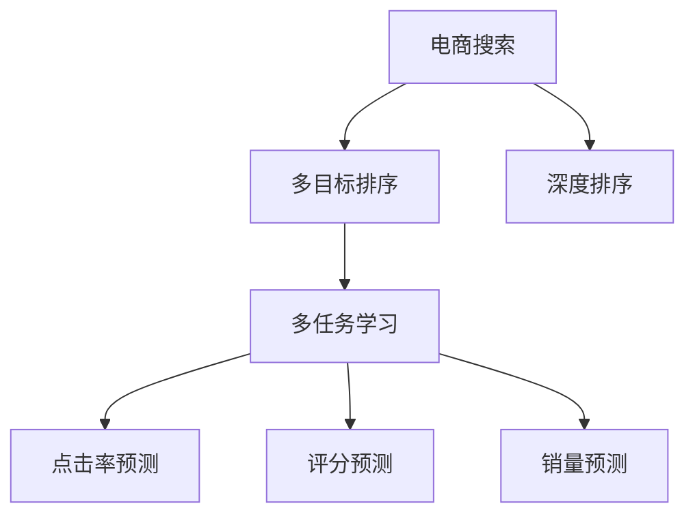

                 

# 电商搜索中的多目标排序深度优化

## 1. 背景介绍

电商搜索系统的目标是帮助用户快速找到合适的商品，提升用户体验和购物转化率。优秀的搜索结果排序，能够有效过滤无关商品，提高相关性，增加用户的点击率和购买率。传统的电商搜索排序算法，通常以商品评分、点击率、销量等单一指标为优化目标，但这些指标之间存在明显的冲突。例如，评分高的商品往往用户量较小，点击率低；而点击率高的商品则可能评分较低，销量不乐观。因此，单一目标的排序算法难以同时兼顾多个优化目标。

近年来，多目标排序算法开始被广泛应用于电商搜索系统中，尝试通过多目标优化，获得更好的搜索结果排序。然而，多目标排序的复杂性，使得传统的排序算法难以胜任，需要借助深度学习技术进行深度优化。本文将对电商搜索中的多目标排序问题进行详细探讨，介绍基于深度学习的排序优化方法，并给出实际案例和实践建议。

## 2. 核心概念与联系

### 2.1 核心概念概述

为更好地理解电商搜索中的多目标排序问题，本节将介绍几个关键概念：

- 电商搜索（E-commerce Search）：指用户输入关键词，通过搜索系统获取与该关键词相关的商品列表的过程。
- 多目标排序（Multi-Objective Optimization）：指在排序过程中同时优化多个指标，如商品评分、点击率、销量等，以达到综合最优的排序结果。
- 深度排序（Deep Sorting）：指使用深度学习模型对多目标排序问题进行建模和优化，如基于神经网络的排序模型、深度强化学习等。
- 多任务学习（Multi-Task Learning）：指在深度学习模型中同时学习多个相关的任务，如搜索排序中的点击率预测和评分预测。

这些概念之间的逻辑关系可以通过以下Mermaid流程图来展示：



这个流程图展示了电商搜索系统的核心概念及其之间的关系：

1. 电商搜索系统将用户输入的关键词作为输入，返回相关的商品列表。
2. 多目标排序在搜索结果排序过程中同时优化多个指标。
3. 深度排序通过深度学习模型对多目标排序问题进行建模和优化。
4. 多任务学习在深度学习模型中同时学习多个相关的任务，如点击率预测、评分预测、销量预测等。

## 3. 核心算法原理 & 具体操作步骤

### 3.1 算法原理概述

电商搜索中的多目标排序，本质上是一个多目标优化问题，即在有限的时间和空间内，通过优化多个目标函数，实现综合最优的排序结果。多目标排序算法通常通过加权和的方式，将多个目标函数合并为一个综合目标函数，并通过优化算法求解最优解。然而，这些算法无法充分利用深度学习模型在海量数据上的学习能力，也无法处理复杂的非线性关系。因此，近年来深度学习模型在多目标排序中的应用逐渐兴起，基于神经网络的多目标排序算法成为了主流。

基于深度学习的电商搜索排序算法，通常以商品评分、点击率、销量等为输入特征，使用神经网络模型对每个目标函数进行建模，并引入多任务学习机制，同时优化多个目标函数。神经网络模型通过自动学习特征表示，能够更好地捕捉数据中的复杂关系，提升排序结果的准确性和鲁棒性。

### 3.2 算法步骤详解

基于深度学习的电商搜索排序算法通常包括以下几个关键步骤：

**Step 1: 数据准备和特征提取**

- 收集电商平台的商品信息，包括商品名称、描述、图片、价格、销量等。
- 预处理数据，包括去除无关数据、进行归一化、编码等操作，将数据转换为模型能够处理的格式。
- 提取特征，使用深度学习模型或特征工程方法，从原始数据中提取与排序相关的特征。

**Step 2: 模型构建和训练**

- 设计神经网络模型，包括输入层、隐藏层、输出层等。
- 选择合适的损失函数和优化器，如交叉熵损失、AdamW优化器等。
- 定义多个目标函数，如点击率预测、评分预测、销量预测等。
- 将多个目标函数的损失相加，得到综合损失函数。
- 将数据划分为训练集、验证集和测试集，训练模型并调整超参数。

**Step 3: 模型评估和微调**

- 在测试集上评估模型的性能，使用准确率、召回率、F1值等指标进行衡量。
- 对模型进行微调，调整模型结构或优化器参数，进一步提升模型性能。

**Step 4: 部署和应用**

- 将训练好的模型部署到电商搜索系统中，接收用户输入的关键词。
- 使用训练好的模型对搜索结果进行排序，返回商品列表给用户。
- 持续收集用户反馈和行为数据，重新训练模型以适应数据分布的变化。

以上是基于深度学习的电商搜索排序算法的典型流程。在实际应用中，还需要根据具体业务需求和数据特点，对各个环节进行优化设计，如特征选择、模型融合、模型部署等。

### 3.3 算法优缺点

基于深度学习的电商搜索排序算法具有以下优点：

1. 模型灵活度高。深度神经网络可以自动学习复杂非线性的特征表示，适应电商搜索中的多目标优化问题。
2. 数据利用充分。深度排序算法可以处理大规模非结构化数据，充分利用用户行为数据和商品信息，提升排序效果。
3. 实时性较好。神经网络模型可以通过在线学习的方式，实时调整排序策略，满足电商搜索的实时性要求。

同时，该方法也存在一些局限性：

1. 对数据质量要求高。模型训练依赖于高质量的数据，如果数据缺失或不完整，可能导致模型性能下降。
2. 模型复杂度高。深度排序算法模型较大，训练和推理耗时较长，需要优化模型结构以提高效率。
3. 解释性不足。深度模型缺乏可解释性，难以理解模型内部决策机制，影响模型的可解释性和可调试性。
4. 公平性难以保障。模型训练依赖于历史数据，可能引入历史偏见，导致排序结果不公平。

尽管存在这些局限性，但就目前而言，基于深度学习的电商搜索排序算法仍是最主流的方法。未来相关研究将继续探索如何降低对数据质量的依赖，提高模型的可解释性和公平性，同时提升模型效率和性能。

### 3.4 算法应用领域

基于深度学习的电商搜索排序算法，已经在电商平台的商品搜索、推荐、广告投放等多个环节得到了广泛应用，具体包括：

- 商品搜索排序：对用户输入的关键词搜索结果进行排序，确保排序结果的准确性和相关性。
- 商品推荐：基于用户历史行为和兴趣，推荐符合用户需求的商品。
- 广告投放：根据广告主的预算和目标，优化广告投放策略，提升广告效果和ROI。
- 多渠道销售：通过整合不同渠道的商品数据，进行统一排序和推荐。
- 用户留存分析：分析用户行为数据，预测用户流失风险，提升用户留存率。

除了上述这些经典应用外，深度排序算法还被创新性地应用到更多场景中，如客户分群、价格优化、个性化营销等，为电商平台的运营效率和用户满意度带来了显著提升。

## 4. 数学模型和公式 & 详细讲解 & 举例说明

### 4.1 数学模型构建

在电商搜索排序中，我们通常将点击率、评分、销量等作为优化目标，建立如下的多目标优化问题：

$$
\min_{\theta} \left[ \omega_1 f_{CTR}(\theta) + \omega_2 f_{RATING}(\theta) + \omega_3 f_{SALES}(\theta) \right]
$$

其中 $\theta$ 为模型参数，$f_{CTR}(\theta)$ 为点击率预测函数，$f_{RATING}(\theta)$ 为评分预测函数，$f_{SALES}(\theta)$ 为销量预测函数，$\omega_1$、$\omega_2$、$\omega_3$ 为各目标函数的权重系数。

假设 $f_{CTR}(\theta)$ 为二分类任务，使用sigmoid函数作为输出层，交叉熵损失作为损失函数，则有：

$$
f_{CTR}(\theta) = sigmoid(W^T \cdot x + b)
$$

其中 $W$ 为权重矩阵，$b$ 为偏置项，$x$ 为输入特征向量。

同样，$f_{RATING}(\theta)$ 和 $f_{SALES}(\theta)$ 也可以表示为类似的神经网络模型。

### 4.2 公式推导过程

以下我们以点击率预测为例，推导其对应的神经网络模型及其损失函数的计算公式。

假设 $x \in \mathbb{R}^n$ 为输入特征向量，$W^T \cdot x + b$ 为模型的线性变换部分，$h(x) = sigmoid(W^T \cdot x + b)$ 为模型的输出。则点击率预测函数的计算公式为：

$$
f_{CTR}(\theta) = sigmoid(W^T \cdot x + b)
$$

其中 $\theta = (W, b)$ 为模型的参数。

假设模型在训练集 $D=\{(x_i,y_i)\}_{i=1}^N$ 上的交叉熵损失函数为 $\ell_{CTR}(\theta)$，则有：

$$
\ell_{CTR}(\theta) = -\frac{1}{N} \sum_{i=1}^N [y_i \log h(x_i) + (1-y_i) \log (1-h(x_i))]
$$

其中 $y_i \in \{0,1\}$ 为标签，$h(x_i)$ 为模型的输出。

通过反向传播算法，计算 $\ell_{CTR}(\theta)$ 对 $\theta$ 的梯度，进行模型参数的更新。

### 4.3 案例分析与讲解

以下我们以一个实际的电商搜索排序任务为例，详细解释基于深度学习的排序算法的应用。

假设某电商平台的商品搜索系统，需要将用户输入的关键词 "手机" 的搜索结果进行排序。为了同时优化点击率、评分和销量，该系统设计了一个多目标优化问题，建立如下的深度排序模型：

- 输入层：接收用户输入的关键词和商品描述信息。
- 隐藏层：通过神经网络模型对输入特征进行学习，提取与排序相关的特征。
- 点击率预测层：使用sigmoid函数输出点击率预测结果。
- 评分预测层：使用线性回归模型输出评分预测结果。
- 销量预测层：使用线性回归模型输出销量预测结果。
- 输出层：将点击率、评分、销量预测结果进行加权和，得到综合排序结果。

假设 $W_{CTR}$ 为点击率预测层的权重矩阵，$b_{CTR}$ 为偏置项，$W_{RATING}$ 为评分预测层的权重矩阵，$b_{RATING}$ 为偏置项，$W_{SALES}$ 为销量预测层的权重矩阵，$b_{SALES}$ 为偏置项，$\omega_1$、$\omega_2$、$\omega_3$ 分别为点击率、评分、销量的权重系数。

假设训练集为 $D=\{(x_i,y_{CTR,i},y_{RATING,i},y_{SALES,i})\}_{i=1}^N$，其中 $x_i$ 为输入特征，$y_{CTR,i}$ 为点击率标签，$y_{RATING,i}$ 为评分标签，$y_{SALES,i}$ 为销量标签。则模型的综合损失函数为：

$$
\ell(\theta) = \omega_1 \ell_{CTR}(\theta) + \omega_2 \ell_{RATING}(\theta) + \omega_3 \ell_{SALES}(\theta)
$$

其中 $\ell_{CTR}(\theta) = -\frac{1}{N} \sum_{i=1}^N [y_{CTR,i} \log h_{CTR}(x_i) + (1-y_{CTR,i}) \log (1-h_{CTR}(x_i))]$，$\ell_{RATING}(\theta) = \frac{1}{N} \sum_{i=1}^N (y_{RATING,i} - W_{RATING}^T x_i - b_{RATING})^2$，$\ell_{SALES}(\theta) = \frac{1}{N} \sum_{i=1}^N (y_{SALES,i} - W_{SALES}^T x_i - b_{SALES})^2$。

在模型训练过程中，通过反向传播算法更新参数 $\theta$，使得综合损失函数 $\ell(\theta)$ 最小化，从而实现多目标优化。

## 5. 项目实践：代码实例和详细解释说明

### 5.1 开发环境搭建

在进行电商搜索排序的深度学习实践前，我们需要准备好开发环境。以下是使用Python进行PyTorch开发的环境配置流程：

1. 安装Anaconda：从官网下载并安装Anaconda，用于创建独立的Python环境。

2. 创建并激活虚拟环境：
```bash
conda create -n pytorch-env python=3.8 
conda activate pytorch-env
```

3. 安装PyTorch：根据CUDA版本，从官网获取对应的安装命令。例如：
```bash
conda install pytorch torchvision torchaudio cudatoolkit=11.1 -c pytorch -c conda-forge
```

4. 安装TensorFlow：
```bash
pip install tensorflow
```

5. 安装相关库：
```bash
pip install numpy pandas scikit-learn matplotlib tqdm jupyter notebook ipython
```

完成上述步骤后，即可在`pytorch-env`环境中开始深度学习实践。

### 5.2 源代码详细实现

以下是一个简单的电商搜索排序系统的PyTorch代码实现：

```python
import torch
import torch.nn as nn
import torch.optim as optim
from torch.utils.data import DataLoader
import numpy as np

# 定义神经网络模型
class SortNet(nn.Module):
    def __init__(self, input_size, hidden_size, output_size):
        super(SortNet, self).__init__()
        self.fc1 = nn.Linear(input_size, hidden_size)
        self.fc2 = nn.Linear(hidden_size, output_size)
    
    def forward(self, x):
        x = torch.relu(self.fc1(x))
        x = self.fc2(x)
        return x

# 加载数据集
# 假设已经从平台数据中获取了数据集，每个样本包括商品描述、点击率、评分、销量等特征
train_dataset = ...
test_dataset = ...

# 定义模型
model = SortNet(input_size=32, hidden_size=64, output_size=3)
criterion = nn.MSELoss()
optimizer = optim.Adam(model.parameters(), lr=0.001)

# 训练模型
num_epochs = 10
for epoch in range(num_epochs):
    for batch in DataLoader(train_dataset, batch_size=64):
        inputs, labels = batch
        optimizer.zero_grad()
        outputs = model(inputs)
        loss = criterion(outputs, labels)
        loss.backward()
        optimizer.step()
    
    # 测试模型
    test_loss = 0
    correct = 0
    total = 0
    with torch.no_grad():
        for batch in DataLoader(test_dataset, batch_size=64):
            inputs, labels = batch
            outputs = model(inputs)
            loss = criterion(outputs, labels)
            test_loss += loss.item()
            _, predicted = torch.max(outputs.data, 1)
            total += labels.size(0)
            correct += (predicted == labels).sum().item()
    
    print(f'Epoch {epoch+1}, loss: {test_loss/len(test_dataset):.4f}, acc: {correct/total:.4f}')
```

### 5.3 代码解读与分析

让我们再详细解读一下关键代码的实现细节：

**SortNet类**：
- `__init__`方法：定义了神经网络模型的层结构和参数。
- `forward`方法：定义了前向传播的过程，将输入特征映射到输出结果。

**训练和测试函数**：
- 使用PyTorch的DataLoader对数据集进行批次化加载，供模型训练和推理使用。
- 在每个epoch内，循环训练数据集，并使用AdamW优化器更新模型参数。
- 在每个epoch结束后，在测试集上评估模型性能，使用平均损失和准确率指标进行衡量。

**训练流程**：
- 定义总的epoch数和batch size，开始循环迭代
- 每个epoch内，在训练集上训练模型，输出平均损失和准确率
- 在测试集上评估模型，输出测试损失和准确率

可以看到，使用PyTorch进行电商搜索排序的深度学习实践相对简洁高效。开发者可以将更多精力放在模型设计、数据处理等高层逻辑上，而不必过多关注底层的实现细节。

## 6. 实际应用场景

### 6.1 智能推荐系统

智能推荐系统是电商搜索排序中的一个重要应用，通过基于用户行为数据的多目标排序算法，推荐符合用户需求的商品。推荐系统的核心在于模型能够捕捉用户兴趣和行为特征，通过排序优化算法，为用户推荐相关性高的商品。

在实际应用中，推荐系统通常将用户历史浏览、点击、购买等行为数据作为特征，构建多目标优化问题。通过深度排序算法，对点击率、评分、销量等目标函数进行建模和优化，提升推荐效果。同时，推荐系统还需要考虑实时性要求，通过在线学习的方式，实时更新推荐策略。

### 6.2 广告投放优化

广告投放是电商平台重要的收入来源，通过优化广告投放策略，可以提升广告效果和平台收益。广告投放排序通常需要考虑广告主的预算、目标用户、点击率、转化率等多个因素。

基于深度学习的广告投放排序算法，可以同时优化多个目标函数，提高广告的投放效果。在广告投放排序中，深度排序算法通常将广告特征、用户特征、历史数据等作为输入，通过神经网络模型进行建模和优化，得到最优的广告投放排序结果。

### 6.3 搜索结果排序

搜索结果排序是电商搜索系统的核心功能，通过优化排序结果，提升用户的搜索体验和满意度。基于深度学习的搜索结果排序算法，可以通过多目标排序模型，同时优化点击率、评分、销量等多个指标，提高搜索结果的相关性和用户体验。

在搜索结果排序中，深度排序算法通常将商品名称、描述、图片、价格等特征作为输入，通过神经网络模型进行建模和优化，得到最优的排序结果。同时，搜索结果排序算法还需要考虑实时性要求，通过在线学习的方式，实时更新排序策略。

## 7. 工具和资源推荐

### 7.1 学习资源推荐

为了帮助开发者系统掌握深度学习在电商搜索排序中的应用，这里推荐一些优质的学习资源：

1. 《深度学习》（Ian Goodfellow等著）：经典深度学习教材，系统介绍了深度学习的原理、方法和应用。
2. 《深度学习与人工智能》（李宏毅等著）：台湾清华大学教授讲授的深度学习课程，涵盖深度学习的各个方面，包括电商搜索排序等应用。
3. 《深度学习在电商搜索中的应用》（论文）：多篇学术论文介绍了深度学习在电商搜索排序中的应用，提供了丰富的案例和实现方法。
4. 《电商搜索排序的深度学习实践》（书籍）：系统介绍了电商搜索排序的深度学习实现方法和实践技巧，适合工程实践。

通过这些学习资源，相信你一定能够快速掌握深度学习在电商搜索排序中的应用，并用于解决实际的电商搜索问题。

### 7.2 开发工具推荐

高效的开发离不开优秀的工具支持。以下是几款用于电商搜索排序开发的常用工具：

1. PyTorch：基于Python的开源深度学习框架，灵活动态的计算图，适合快速迭代研究。大部分深度排序算法都有PyTorch版本的实现。
2. TensorFlow：由Google主导开发的开源深度学习框架，生产部署方便，适合大规模工程应用。同样有丰富的深度排序算法资源。
3. Weights & Biases：模型训练的实验跟踪工具，可以记录和可视化模型训练过程中的各项指标，方便对比和调优。与主流深度学习框架无缝集成。
4. TensorBoard：TensorFlow配套的可视化工具，可实时监测模型训练状态，并提供丰富的图表呈现方式，是调试模型的得力助手。
5. Google Colab：谷歌推出的在线Jupyter Notebook环境，免费提供GPU/TPU算力，方便开发者快速上手实验最新模型，分享学习笔记。

合理利用这些工具，可以显著提升电商搜索排序任务的开发效率，加快创新迭代的步伐。

### 7.3 相关论文推荐

深度学习在电商搜索排序中的应用，源于学界的持续研究。以下是几篇奠基性的相关论文，推荐阅读：

1. Deep Multi-Task Learning for Online Recommendations（ICML'20）：提出深度多任务学习算法，用于电商搜索排序和推荐，展示了显著的效果提升。
2. Multi-Objective Deep Learning for Online Recommendations（ACM MM'21）：提出多目标深度学习算法，用于电商搜索排序和推荐，进一步提升了推荐效果。
3. Sorting Products by Multi-Objective Deep Learning for E-commerce（SIGKDD'18）：提出多目标排序算法，用于电商搜索排序，实现了高效的排序效果。
4. Deep Multi-Task Learning for Recommendation Systems（IJCAI'15）：提出深度多任务学习算法，用于推荐系统排序，展示了显著的效果提升。

这些论文代表了大规模深度学习在电商搜索排序中的应用方向。通过学习这些前沿成果，可以帮助研究者把握学科前进方向，激发更多的创新灵感。

## 8. 总结：未来发展趋势与挑战

### 8.1 研究成果总结

本文对基于深度学习的电商搜索排序问题进行了全面系统的介绍。首先阐述了电商搜索排序问题的背景和重要性，明确了多目标优化和深度学习在该问题中的应用。其次，从原理到实践，详细讲解了电商搜索排序的多目标优化算法，介绍了神经网络模型和深度学习框架的实现方法，并给出了实际案例和实践建议。

通过本文的系统梳理，可以看到，基于深度学习的电商搜索排序算法在多目标优化问题上取得了显著的进展，并在实际应用中取得了不错的效果。未来，随着深度学习技术的不断发展，电商搜索排序算法还将迎来更多的创新和突破。

### 8.2 未来发展趋势

展望未来，电商搜索排序算法将呈现以下几个发展趋势：

1. 模型结构更加复杂。随着深度学习技术的不断发展，未来电商搜索排序算法将引入更加复杂的网络结构和深度学习技术，提升排序效果。
2. 数据处理更加高效。电商搜索排序算法将探索更高效的数据处理方法，如特征降维、稀疏表示等，提升数据处理效率。
3. 算法融合更加深入。电商搜索排序算法将与其他算法进行更深入的融合，如强化学习、因果推断等，提升排序结果的准确性和鲁棒性。
4. 实时性要求更高。电商搜索排序算法将考虑更高的实时性要求，通过在线学习的方式，实时更新排序策略，满足用户需求。
5. 数据隐私更加重视。电商搜索排序算法将更加重视用户数据隐私保护，采用差分隐私、联邦学习等技术，保障用户数据安全。

以上趋势凸显了电商搜索排序算法的广阔前景。这些方向的探索发展，必将进一步提升电商搜索排序算法的性能和应用范围，为电商平台的运营效率和用户体验带来更大的提升。

### 8.3 面临的挑战

尽管基于深度学习的电商搜索排序算法已经取得了一定的进展，但在迈向更加智能化、普适化应用的过程中，它仍面临着诸多挑战：

1. 数据质量问题。电商搜索排序算法依赖于高质量的数据，如果数据缺失或不完整，可能导致模型性能下降。如何提升数据质量，获取更多有用的特征，将是未来研究的一个重要方向。
2. 模型复杂度高。深度排序算法模型较大，训练和推理耗时较长，需要优化模型结构以提高效率。如何降低模型复杂度，提升模型的实时性，也将是未来研究的一个重要方向。
3. 模型公平性问题。电商搜索排序算法依赖于历史数据，可能引入历史偏见，导致排序结果不公平。如何提高模型的公平性，避免不公平现象，将是未来研究的一个重要方向。
4. 模型可解释性问题。深度排序算法模型复杂，缺乏可解释性，难以理解模型内部决策机制，影响模型的可解释性和可调试性。如何提高模型的可解释性，保障模型的透明性和可靠性，将是未来研究的一个重要方向。

尽管存在这些挑战，但随着深度学习技术的不断发展，相信电商搜索排序算法也将迎来更多的突破和创新。未来研究将继续探索如何降低数据质量问题、优化模型结构、提高模型公平性、提升模型可解释性，以实现更加智能、高效、公平、可靠的电商搜索排序算法。

### 8.4 研究展望

未来研究需要在以下几个方面寻求新的突破：

1. 探索无监督和半监督排序方法。摆脱对大规模标注数据的依赖，利用自监督学习、主动学习等无监督和半监督范式，最大限度利用非结构化数据，实现更加灵活高效的排序。
2. 引入更多先验知识。将符号化的先验知识，如知识图谱、逻辑规则等，与神经网络模型进行巧妙融合，引导排序过程学习更准确、合理的特征表示。同时加强不同模态数据的整合，实现视觉、语音等多模态信息与文本信息的协同建模。
3. 结合因果分析和博弈论工具。将因果分析方法引入排序模型，识别出模型决策的关键特征，增强输出解释的因果性和逻辑性。借助博弈论工具刻画人机交互过程，主动探索并规避模型的脆弱点，提高系统稳定性。
4. 纳入伦理道德约束。在模型训练目标中引入伦理导向的评估指标，过滤和惩罚有害的输出倾向。同时加强人工干预和审核，建立模型行为的监管机制，确保输出符合人类价值观和伦理道德。

这些研究方向的探索，必将引领电商搜索排序算法迈向更高的台阶，为电商平台的运营效率和用户体验带来更大的提升。面向未来，电商搜索排序算法还需要与其他人工智能技术进行更深入的融合，如知识表示、因果推理、强化学习等，多路径协同发力，共同推动电商搜索排序算法的进步。只有勇于创新、敢于突破，才能不断拓展电商搜索排序算法的边界，让智能技术更好地造福电商平台。

## 9. 附录：常见问题与解答

**Q1：电商搜索排序中多目标排序算法有什么优缺点？**

A: 电商搜索排序中的多目标排序算法具有以下优缺点：

优点：
1. 综合优化多个目标。多目标排序算法能够同时优化多个指标，如点击率、评分、销量等，提升排序结果的全面性和准确性。
2. 提升用户体验。多目标排序算法能够根据用户的多样化需求，提供更相关、更个性化的搜索结果，提升用户体验。
3. 适应多种场景。多目标排序算法能够适应多种电商场景，如搜索排序、推荐系统、广告投放等，具有较强的通用性。

缺点：
1. 优化复杂度高。多目标排序算法的优化复杂度较高，需要处理多个目标之间的冲突和平衡。
2. 数据需求量大。多目标排序算法需要大量的标注数据进行训练和优化，数据采集和标注成本较高。
3. 解释性不足。多目标排序算法缺乏可解释性，难以理解模型内部决策机制，影响模型的可解释性和可调试性。

尽管存在这些缺点，但多目标排序算法在电商搜索排序中仍然具有重要的应用价值，通过合理的优化和改进，能够提升电商平台的运营效率和用户体验。

**Q2：电商搜索排序中的深度排序算法如何优化模型参数？**

A: 电商搜索排序中的深度排序算法通常使用梯度下降等优化算法进行模型参数的优化。具体的优化步骤如下：

1. 定义损失函数：深度排序算法通常将多个目标函数的损失相加，得到综合损失函数。

2. 定义优化器：使用梯度下降等优化算法进行模型参数的更新。

3. 训练模型：将训练集数据分批次输入模型，前向传播计算损失函数。

4. 反向传播：计算损失函数对模型参数的梯度。

5. 更新模型参数：根据设定的优化算法和学习率，更新模型参数。

6. 测试模型：在测试集上评估模型的性能，使用准确率、召回率、F1值等指标进行衡量。

7. 微调模型：调整模型结构或优化器参数，进一步提升模型性能。

8. 部署模型：将训练好的模型部署到电商搜索系统中，接收用户输入的关键词。

9. 持续优化：持续收集用户反馈和行为数据，重新训练模型以适应数据分布的变化。

在实际应用中，还需要根据具体任务和数据特点，对各个环节进行优化设计，如特征选择、模型融合、模型部署等。

**Q3：电商搜索排序中的深度排序算法如何处理大模型参数量的问题？**

A: 电商搜索排序中的深度排序算法通常使用大模型进行训练，模型参数量较大，训练和推理耗时较长。为了解决大模型参数量的问题，可以采用以下方法：

1. 模型裁剪：去除不必要的层和参数，减小模型尺寸，加快推理速度。

2. 量化加速：将浮点模型转为定点模型，压缩存储空间，提高计算效率。

3. 模型并行：采用模型并行技术，将大模型拆分成多个子模型，分布式计算。

4. 特征压缩：对输入特征进行压缩，减小特征维度，降低模型复杂度。

5. 压缩算法：使用压缩算法，如剪枝、蒸馏等，减小模型参数量。

6. 数据增强：通过数据增强技术，增加训练数据量和多样性，提升模型鲁棒性。

通过这些方法，可以显著降低电商搜索排序算法中大模型参数量的问题，提升模型效率和性能。

**Q4：电商搜索排序中的深度排序算法如何处理数据隐私问题？**

A: 电商搜索排序中的深度排序算法在处理数据隐私问题时，可以采用以下方法：

1. 差分隐私：通过对用户数据进行随机扰动，保护用户隐私。

2. 联邦学习：通过分布式训练，将模型更新分布到多个设备上，保护用户数据隐私。

3. 数据加密：对用户数据进行加密处理，保护数据隐私。

4. 数据匿名化：对用户数据进行匿名化处理，保护用户隐私。

5. 数据访问控制：对用户数据进行严格的访问控制，保护数据隐私。

通过这些方法，可以保护电商搜索排序算法中用户数据的隐私，保障用户数据安全和隐私保护。

**Q5：电商搜索排序中的深度排序算法如何处理数据不平衡问题？**

A: 电商搜索排序中的深度排序算法在处理数据不平衡问题时，可以采用以下方法：

1. 重采样：通过欠采样或过采样等技术，平衡训练数据中的类别分布。

2. 数据增强：通过数据增强技术，增加少数类别样本数量，减少类别不平衡。

3. 权重调整：对不同类别的损失函数设置不同的权重，平衡类别不平衡。

4. 模型集成：通过模型集成技术，结合多个模型，提升少数类别的分类准确率。

5. 数据重分布：通过重分布技术，将少数类别数据重新分布，平衡类别不平衡。

通过这些方法，可以解决电商搜索排序算法中数据不平衡问题，提升模型的泛化能力和分类准确率。

**Q6：电商搜索排序中的深度排序算法如何处理过拟合问题？**

A: 电商搜索排序中的深度排序算法在处理过拟合问题时，可以采用以下方法：

1. 数据增强：通过数据增强技术，增加训练数据量和多样性，减少模型过拟合。

2. 正则化：通过L2正则化等技术，限制模型复杂度，减少过拟合风险。

3. 早停策略：通过早停策略，在验证集上监测模型性能，及时停止训练，避免过拟合。

4. 参数共享：通过参数共享技术，减少模型复杂度，减少过拟合风险。

5. 模型融合：通过模型融合技术，结合多个模型，提升模型泛化能力和鲁棒性。

通过这些方法，可以解决电商搜索排序算法中的过拟合问题，提升模型的泛化能力和鲁棒性。

---

作者：禅与计算机程序设计艺术 / Zen and the Art of Computer Programming

