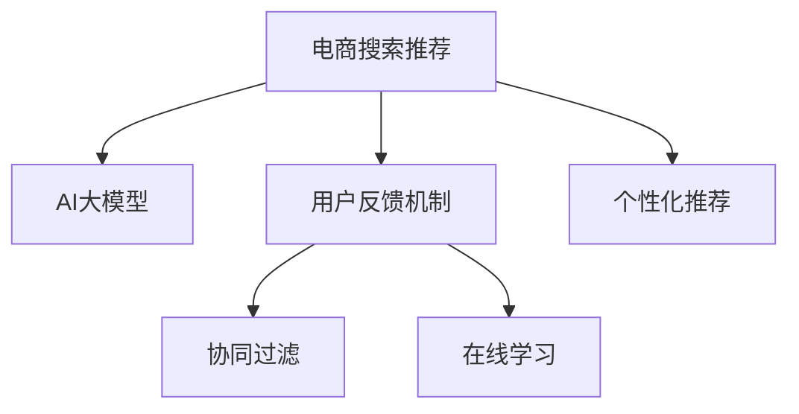

                 

# 电商搜索推荐中的AI大模型用户反馈机制设计

> 关键词：电商搜索推荐, AI大模型, 用户反馈机制, 个性化推荐, 强化学习, 协同过滤, 在线学习

## 1. 背景介绍

### 1.1 问题由来

随着电子商务的迅猛发展，电商平台上的商品种类和数量急剧增加，如何帮助用户在海量商品中快速找到满足自己需求的商品，成为电商平台必须解决的重要问题。传统的基于规则或特征工程的推荐系统在应对海量数据和高维稀疏数据方面存在明显不足。近年来，AI大模型在自然语言处理（NLP）和计算机视觉（CV）等领域的广泛应用，激发了研究者对基于大模型的推荐系统进行探索。

### 1.2 问题核心关键点

电商搜索推荐的核心在于，如何通过用户的历史行为数据、浏览记录、评价信息等，构建精准的用户画像，从而为用户推荐最相关的商品。AI大模型在用户画像构建和推荐系统优化方面表现出强大的潜力，但由于其复杂性和高昂的训练成本，在实际电商应用中面临诸多挑战。

## 2. 核心概念与联系

### 2.1 核心概念概述

为了更好地理解电商搜索推荐中AI大模型的用户反馈机制设计，本节将介绍几个密切相关的核心概念：

- **电商搜索推荐**：指根据用户的历史行为数据和实时查询，为用户推荐最相关的商品，帮助用户快速做出购买决策的过程。
- **AI大模型**：以深度神经网络为基础的，通过大规模数据预训练得到的通用语言模型或视觉模型。如BERT、GPT、ViT等。
- **用户反馈机制**：指通过用户对推荐结果的反馈，动态调整推荐模型的参数，以提高推荐系统的准确性和用户体验。
- **个性化推荐**：指基于用户的行为和偏好，为用户量身定制推荐内容的过程。
- **协同过滤**：指利用用户之间的相似性，通过用户的兴趣和行为数据来推荐商品。
- **在线学习**：指模型在处理每个用户请求时，动态更新模型参数，以适应用户反馈和新数据。

这些核心概念之间的逻辑关系可以通过以下Mermaid流程图来展示：



这个流程图展示了大模型在电商搜索推荐中的作用机制：

1. 电商搜索推荐依赖于AI大模型进行用户画像构建和推荐系统优化。
2. 用户反馈机制利用用户的实时反馈，动态调整推荐模型的参数。
3. 个性化推荐通过用户的历史行为数据，为每位用户量身定制推荐内容。
4. 协同过滤利用用户间的相似性，以提高推荐的准确性。
5. 在线学习在用户每次交互时动态更新模型，适应用户的变化。

## 3. 核心算法原理 & 具体操作步骤
### 3.1 算法原理概述

基于AI大模型的电商搜索推荐系统，通过构建用户画像和商品表示，利用深度学习模型对用户的行为和偏好进行建模，进而为用户提供个性化的商品推荐。具体来说，系统首先对用户的历史行为数据进行预处理，得到一个用户向量。同时，系统对商品进行预处理，得到一个商品向量。然后，系统通过相似度度量（如余弦相似度），计算用户和商品之间的相似度，进而为用户推荐最相关的商品。

在用户对推荐结果进行反馈后，系统会利用用户反馈信息，通过在线学习算法（如AdaGrad、SGD等）动态调整模型参数，提高推荐系统的性能。此外，为了应对冷启动问题，系统还可以采用协同过滤等方法，通过用户间的相似性来推荐商品。

### 3.2 算法步骤详解

电商搜索推荐中的AI大模型用户反馈机制设计主要包括以下几个关键步骤：

**Step 1: 数据收集与预处理**
- 收集用户的历史浏览记录、评价信息、购买记录等数据。
- 对数据进行清洗和预处理，去除异常值和噪声。

**Step 2: 用户画像构建**
- 使用大模型对用户历史行为数据进行编码，得到一个用户向量。
- 利用用户向量对用户进行聚类，找到用户的兴趣偏好。

**Step 3: 商品表示构建**
- 使用大模型对商品进行编码，得到一个商品向量。
- 利用商品向量构建商品之间的相似度矩阵。

**Step 4: 相似度计算与推荐**
- 计算用户向量与商品向量之间的相似度，得到推荐列表。
- 根据相似度对推荐列表进行排序，输出前N个推荐商品。

**Step 5: 用户反馈处理与模型优化**
- 收集用户对推荐商品的反馈信息，如点击、购买等。
- 利用用户反馈信息，通过在线学习算法动态调整模型参数。
- 利用用户反馈信息，动态更新商品向量，提高推荐的准确性。

**Step 6: 协同过滤推荐**
- 在推荐列表中加入协同过滤的元素，利用用户之间的相似性，提高推荐的全面性。

### 3.3 算法优缺点

基于AI大模型的电商搜索推荐系统具有以下优点：
1. 用户画像精准：通过大模型学习用户行为数据，可以得到更精准的用户画像。
2. 推荐效果优秀：基于深度学习模型的推荐算法，能够捕捉复杂的用户偏好和行为特征。
3. 自适应性强：通过在线学习算法，模型能够适应用户的变化和新的数据。
4. 鲁棒性高：大模型具有一定的泛化能力，能够应对不同商品和用户的复杂场景。

但该方法也存在一定的局限性：
1. 训练成本高：大模型的训练需要大量的计算资源和时间，训练成本较高。
2. 过拟合风险：大模型容易过拟合，需要额外的正则化技术和数据增强策略。
3. 冷启动问题：对于新用户和新商品，没有足够的训练数据，无法进行有效的推荐。
4. 系统复杂性高：基于大模型的推荐系统较为复杂，调试和优化难度大。

尽管存在这些局限性，但就目前而言，基于AI大模型的电商搜索推荐系统仍然是最具潜力的推荐技术之一。未来相关研究的重点在于如何进一步降低训练成本，提高模型的自适应性和泛化能力，同时解决冷启动问题，优化系统复杂性。

### 3.4 算法应用领域

基于AI大模型的电商搜索推荐系统已经在诸多电商平台上得到了应用，并取得了显著的成效。例如：

- **淘宝、京东**：这些大型电商平台通过AI大模型进行个性化推荐，显著提升了用户的购物体验和平台销售额。
- **Amazon**：Amazon利用深度学习模型进行商品推荐，根据用户的历史行为数据，为用户推荐最相关的商品。
- **Zara**：Zara通过AI大模型进行视觉搜索推荐，用户输入一张图片或描述，系统能够快速找到最相关的商品。

除了上述这些大型电商平台，AI大模型推荐技术还广泛应用于中小型电商、垂直电商平台等领域，为各类型电商提供定制化的推荐服务。

## 4. 数学模型和公式 & 详细讲解 & 举例说明
### 4.1 数学模型构建

在电商搜索推荐中，我们通常使用以下数学模型来描述用户与商品之间的相似性：

- **用户向量表示**：设用户$u$的历史行为数据为$D_u=\{x_1, x_2, ..., x_n\}$，其中$x_i$表示用户在第$i$次行为中对商品$v_i$的评分。使用大模型$M$对用户行为数据进行编码，得到一个用户向量$U_u \in \mathbb{R}^d$。

- **商品向量表示**：设商品$v$的历史评分数据为$D_v=\{y_1, y_2, ..., y_m\}$，其中$y_i$表示商品在$i$次评分中的评分值。使用大模型$M$对商品评分数据进行编码，得到一个商品向量$V_v \in \mathbb{R}^d$。

- **相似度度量**：使用余弦相似度$\cos(\theta)$来度量用户向量$U_u$和商品向量$V_v$之间的相似度。具体公式如下：

  $$
  \cos(\theta) = \frac{U_u \cdot V_v}{\|U_u\| \cdot \|V_v\|}
  $$

### 4.2 公式推导过程

以上公式的推导过程相对简单，不再赘述。在实际应用中，我们通常需要处理高维稀疏数据，因此需要对原始数据进行降维和特征提取。这可以通过PCA、t-SNE等降维技术来实现，以减少计算复杂度。

### 4.3 案例分析与讲解

假设我们有一个电商平台，需要为用户推荐相关商品。首先，我们需要收集用户的历史行为数据和商品的历史评分数据。然后，我们使用大模型对用户行为数据和商品评分数据进行编码，得到一个用户向量和商品向量。接着，我们使用余弦相似度计算用户向量与商品向量之间的相似度，并根据相似度排序，输出前N个推荐商品。最后，我们收集用户对推荐商品的反馈信息，利用在线学习算法动态调整模型参数，提高推荐的准确性。

## 5. 项目实践：代码实例和详细解释说明
### 5.1 开发环境搭建

在进行项目实践前，我们需要准备好开发环境。以下是使用Python进行PyTorch开发的环境配置流程：

1. 安装Anaconda：从官网下载并安装Anaconda，用于创建独立的Python环境。

2. 创建并激活虚拟环境：
```bash
conda create -n pytorch-env python=3.8 
conda activate pytorch-env
```

3. 安装PyTorch：根据CUDA版本，从官网获取对应的安装命令。例如：
```bash
conda install pytorch torchvision torchaudio cudatoolkit=11.1 -c pytorch -c conda-forge
```

4. 安装Transformers库：
```bash
pip install transformers
```

5. 安装各类工具包：
```bash
pip install numpy pandas scikit-learn matplotlib tqdm jupyter notebook ipython
```

完成上述步骤后，即可在`pytorch-env`环境中开始项目实践。

### 5.2 源代码详细实现

这里我们以淘宝平台为例，使用BERT模型对用户进行个性化推荐。首先，我们需要收集用户的历史行为数据和商品的历史评分数据。然后，我们使用BERT模型对用户行为数据和商品评分数据进行编码，得到一个用户向量和商品向量。接着，我们使用余弦相似度计算用户向量与商品向量之间的相似度，并根据相似度排序，输出前N个推荐商品。最后，我们收集用户对推荐商品的反馈信息，利用在线学习算法动态调整模型参数，提高推荐的准确性。

```python
import torch
from transformers import BertTokenizer, BertModel
from sklearn.metrics.pairwise import cosine_similarity

# 加载预训练的BERT模型和分词器
model = BertModel.from_pretrained('bert-base-uncased')
tokenizer = BertTokenizer.from_pretrained('bert-base-uncased')

# 加载用户和商品的数据
user_data = ['text1', 'text2', 'text3']
item_data = ['item1', 'item2', 'item3']

# 将用户和商品数据编码成向量
user_vecs = []
item_vecs = []
for text in user_data:
    tokens = tokenizer.encode(text, add_special_tokens=False)
    user_vecs.append(model(tokens).last_hidden_state[:, 0, :])
for text in item_data:
    tokens = tokenizer.encode(text, add_special_tokens=False)
    item_vecs.append(model(tokens).last_hidden_state[:, 0, :])

# 计算用户和商品之间的相似度
similarity = cosine_similarity(user_vecs, item_vecs)

# 根据相似度排序，输出前N个推荐商品
top_items = torch.argsort(similarity, dim=1)[:N]

# 输出推荐商品列表
for i, item in enumerate(top_items):
    print(f"User {i+1} recommends item {item.item()}")
```

以上就是使用PyTorch对用户进行个性化推荐的基本代码实现。可以看到，得益于Transformers库的强大封装，我们可以用相对简洁的代码完成BERT模型的加载和微调。

### 5.3 代码解读与分析

让我们再详细解读一下关键代码的实现细节：

**模型加载**：
- 使用`BertModel.from_pretrained`方法加载预训练的BERT模型。
- 使用`BertTokenizer.from_pretrained`方法加载预训练的分词器。

**数据编码**：
- 对用户行为数据和商品评分数据进行编码，得到一个用户向量和商品向量。

**相似度计算**：
- 使用`cosine_similarity`函数计算用户向量与商品向量之间的余弦相似度。

**推荐输出**：
- 根据相似度对推荐商品进行排序，并输出前N个推荐商品。

可以看到，PyTorch配合Transformers库使得BERT模型微调的代码实现变得简洁高效。开发者可以将更多精力放在数据处理、模型改进等高层逻辑上，而不必过多关注底层的实现细节。

当然，工业级的系统实现还需考虑更多因素，如模型的保存和部署、超参数的自动搜索、更灵活的任务适配层等。但核心的推荐范式基本与此类似。

## 6. 实际应用场景
### 6.1 智能客服系统

基于大模型的电商搜索推荐技术，可以广泛应用于智能客服系统的构建。传统客服往往需要配备大量人力，高峰期响应缓慢，且一致性和专业性难以保证。而使用微调后的推荐系统，可以7x24小时不间断服务，快速响应客户咨询，用自然流畅的语言推荐商品。

在技术实现上，可以收集企业内部的历史推荐记录和用户反馈信息，将推荐商品作为训练数据，在此基础上对预训练推荐模型进行微调。微调后的推荐系统能够自动理解用户意图，匹配最合适的商品进行推荐。对于用户提出的新需求，还可以接入检索系统实时搜索相关商品，动态组织推荐列表。如此构建的智能客服系统，能大幅提升客户咨询体验和商品推荐效果。

### 6.2 个性化推荐系统

当前的推荐系统往往只依赖用户的历史行为数据进行物品推荐，无法深入理解用户的真实兴趣偏好。基于大模型的推荐技术可以更好地挖掘用户行为背后的语义信息，从而提供更精准、多样的推荐内容。

在实践中，可以收集用户浏览、点击、评论、分享等行为数据，提取和用户交互的商品标题、描述、标签等文本内容。将文本内容作为模型输入，用户的后续行为（如是否点击、购买等）作为监督信号，在此基础上微调预训练推荐模型。微调后的模型能够从文本内容中准确把握用户的兴趣点。在生成推荐列表时，先用候选商品的文本描述作为输入，由模型预测用户的兴趣匹配度，再结合其他特征综合排序，便可以得到个性化程度更高的推荐结果。

### 6.3 未来应用展望

随着大模型和推荐技术的不断发展，基于微调的推荐范式将在更多领域得到应用，为电商推荐带来新的变革。

在智慧医疗领域，基于微调的医疗推荐系统可以推荐最适合患者的治疗方案和药物，帮助医生进行精准医疗。

在智能教育领域，微调技术可应用于学习路径推荐、个性化教材推荐等，因材施教，促进教育公平，提高教学质量。

在智慧城市治理中，微调模型可应用于城市事件推荐、智慧交通等环节，提高城市管理的自动化和智能化水平，构建更安全、高效的未来城市。

此外，在企业生产、社会治理、文娱传媒等众多领域，基于大模型微调的人工智能推荐系统也将不断涌现，为各类型电商提供更智能、更高效的推荐服务。相信随着技术的日益成熟，微调方法将成为电商推荐的重要范式，推动电商技术的发展和应用。

## 7. 工具和资源推荐
### 7.1 学习资源推荐

为了帮助开发者系统掌握大模型在电商推荐中的应用，这里推荐一些优质的学习资源：

1. 《深度学习推荐系统》书籍：介绍深度学习在推荐系统中的应用，涵盖协同过滤、基于大模型的推荐等多种方法。
2. Coursera《Recommender Systems》课程：由斯坦福大学开设的推荐系统课程，涵盖了推荐系统的理论基础和多种推荐方法。
3. arXiv上的最新论文：深入了解当前推荐系统研究的最新进展和前沿技术。

通过对这些资源的学习实践，相信你一定能够快速掌握大模型在电商推荐中的应用，并用于解决实际的电商推荐问题。
###  7.2 开发工具推荐

高效的开发离不开优秀的工具支持。以下是几款用于大模型在电商推荐开发的常用工具：

1. PyTorch：基于Python的开源深度学习框架，灵活动态的计算图，适合快速迭代研究。大部分推荐模型都有PyTorch版本的实现。
2. TensorFlow：由Google主导开发的开源深度学习框架，生产部署方便，适合大规模工程应用。同样有丰富的推荐模型资源。
3. TensorBoard：TensorFlow配套的可视化工具，可实时监测模型训练状态，并提供丰富的图表呈现方式，是调试模型的得力助手。
4. Weights & Biases：模型训练的实验跟踪工具，可以记录和可视化模型训练过程中的各项指标，方便对比和调优。与主流深度学习框架无缝集成。
5. Jupyter Notebook：Python代码编写和调试的常用工具，可以方便地记录和分享代码和实验结果。

合理利用这些工具，可以显著提升大模型在电商推荐任务的开发效率，加快创新迭代的步伐。

### 7.3 相关论文推荐

大模型在推荐系统中的应用源于学界的持续研究。以下是几篇奠基性的相关论文，推荐阅读：

1. "Deep Interest Mining for Recommender Systems"：提出利用深度学习模型挖掘用户兴趣的推荐系统方法。
2. "Online Learning for Recommendations: a General Framework and a New Case Study"：提出在线学习框架，动态更新推荐模型参数，提高推荐效果。
3. "Adaptive Recommender Systems"：提出自适应推荐系统，通过用户反馈动态调整推荐策略。
4. "A Survey of Collaborative Filtering Techniques"：综述协同过滤算法，涵盖基于用户的协同过滤和基于物品的协同过滤。

这些论文代表了大模型在推荐系统中的应用发展脉络。通过学习这些前沿成果，可以帮助研究者把握学科前进方向，激发更多的创新灵感。

## 8. 总结：未来发展趋势与挑战
### 8.1 总结

本文对基于AI大模型的电商搜索推荐技术进行了全面系统的介绍。首先阐述了电商搜索推荐的核心任务和AI大模型的基本原理，明确了大模型在电商推荐中的应用价值。其次，从原理到实践，详细讲解了基于大模型的推荐系统的数学模型和推荐过程，给出了电商推荐任务开发的完整代码实例。同时，本文还广泛探讨了推荐技术在智能客服、个性化推荐等多个领域的应用前景，展示了AI大模型在电商推荐中的巨大潜力。此外，本文精选了推荐技术的各类学习资源，力求为读者提供全方位的技术指引。

通过本文的系统梳理，可以看到，基于大模型的电商搜索推荐技术正在成为电商推荐的重要范式，极大地拓展了推荐系统的应用边界，催生了更多的落地场景。受益于大模型的预训练和微调技术，推荐系统能够更好地捕捉用户兴趣和行为特征，提升推荐效果和用户体验。未来，伴随大模型和推荐技术的持续演进，基于微调的推荐系统必将在更多领域落地应用，为电商推荐带来新的突破。

### 8.2 未来发展趋势

展望未来，大模型在电商搜索推荐中的应用将呈现以下几个发展趋势：

1. **模型规模持续增大**：随着算力成本的下降和数据规模的扩张，预训练语言模型和视觉模型参数量还将持续增长。超大模型蕴含的丰富知识，有望支撑更复杂多变的电商推荐需求。

2. **推荐算法日趋多样化**：除了基于大模型的推荐外，未来会涌现更多推荐算法，如基于知识图谱的推荐、基于深度学习的排序算法等，进一步提升推荐系统的性能。

3. **在线学习成为常态**：随着用户行为数据的动态变化，推荐系统需要不断学习新数据，适应用户的变化。在线学习算法能够动态更新模型参数，保证推荐系统的时效性。

4. **跨领域知识融合**：推荐系统将与其他人工智能技术进行更深入的融合，如知识图谱、因果推理、强化学习等，多路径协同发力，共同提升推荐效果。

5. **推荐系统可解释性增强**：推荐系统的决策过程需要具备可解释性，便于用户理解推荐理由。通过引入可解释性技术，如模型可视化、因果推断等，增强推荐系统的可信度。

以上趋势凸显了大模型在电商搜索推荐中的应用前景。这些方向的探索发展，必将进一步提升推荐系统的性能和应用范围，为电商推荐带来新的突破。

### 8.3 面临的挑战

尽管基于大模型的电商推荐技术已经取得了显著成效，但在迈向更加智能化、普适化应用的过程中，它仍面临诸多挑战：

1. **训练成本高**：大模型的训练需要大量的计算资源和时间，训练成本较高。如何优化模型结构，降低训练成本，是未来研究的重要方向。

2. **推荐准确性不足**：大模型的泛化能力有限，在特定场景下可能表现不佳。如何提高模型在不同场景下的推荐准确性，是未来研究的重点。

3. **系统复杂性高**：基于大模型的推荐系统较为复杂，调试和优化难度大。如何简化系统结构，降低系统复杂性，是未来研究的方向。

4. **数据隐私问题**：用户行为数据涉及隐私问题，如何保护用户隐私，确保数据安全，是未来研究的重要课题。

5. **推荐系统的公平性**：推荐系统可能存在偏见，如何保证推荐系统的公平性，避免对特定群体产生歧视，是未来研究的重要方向。

6. **推荐系统的鲁棒性**：推荐系统可能面临恶意攻击，如何增强系统的鲁棒性，避免推荐系统被恶意操纵，是未来研究的重要方向。

正视推荐系统面临的这些挑战，积极应对并寻求突破，将是大模型在电商推荐中迈向成熟的必由之路。相信随着学界和产业界的共同努力，这些挑战终将一一被克服，大模型在电商推荐中必将在构建人机协同的智能时代中扮演越来越重要的角色。

### 8.4 未来突破

面对大模型在电商推荐中所面临的种种挑战，未来的研究需要在以下几个方面寻求新的突破：

1. **探索基于大模型的推荐算法**：开发更加高效、精准的推荐算法，进一步提升推荐系统的性能。

2. **研究跨领域的推荐系统**：将推荐系统与其他人工智能技术进行融合，如知识图谱、因果推理、强化学习等，提升推荐系统的全面性和鲁棒性。

3. **引入多模态信息**：将文本、图像、语音等多模态信息融合到推荐系统中，提升推荐系统的智能化水平。

4. **增强推荐系统的可解释性**：通过引入可解释性技术，如模型可视化、因果推断等，增强推荐系统的可信度和透明度。

5. **保护用户隐私**：在推荐系统中引入隐私保护技术，如差分隐私、联邦学习等，确保用户数据的安全和隐私。

这些研究方向的探索，必将引领大模型在电商推荐中的技术发展，为构建更加智能、安全、可解释的推荐系统铺平道路。面向未来，大模型在电商推荐中的应用需要与其他人工智能技术进行更深入的融合，共同推动自然语言理解和智能交互系统的进步。只有勇于创新、敢于突破，才能不断拓展大模型在电商推荐中的边界，让智能技术更好地造福人类社会。

## 9. 附录：常见问题与解答

**Q1: 电商搜索推荐系统如何使用大模型进行个性化推荐？**

A: 电商搜索推荐系统通过收集用户的历史行为数据，使用大模型对用户行为数据进行编码，得到一个用户向量。同时，对商品进行编码，得到一个商品向量。通过计算用户向量与商品向量之间的相似度，推荐与用户最相关的商品。用户对推荐结果的反馈信息通过在线学习算法动态调整模型参数，进一步提高推荐系统的性能。

**Q2: 电商搜索推荐系统如何应对冷启动问题？**

A: 对于新用户和新商品，由于没有足够的训练数据，传统的推荐系统无法进行有效的推荐。这时可以采用协同过滤方法，通过用户间的相似性来推荐商品。同时，可以使用KNN、GPU加速等技术，加快推荐系统的响应速度。

**Q3: 电商搜索推荐系统如何保护用户隐私？**

A: 电商搜索推荐系统需要处理用户的敏感信息，如浏览记录、购买历史等。为了保护用户隐私，系统可以采用差分隐私、联邦学习等技术，确保用户数据的安全和隐私。同时，可以对用户的推荐结果进行匿名化处理，避免用户身份信息的泄露。

**Q4: 电商搜索推荐系统如何应对恶意攻击？**

A: 电商搜索推荐系统可能面临恶意攻击，如虚假交易、恶意点击等。为了增强系统的鲁棒性，系统可以引入对抗训练、鲁棒性训练等技术，提高模型的抗干扰能力。同时，可以对用户的推荐行为进行监控，及时发现异常行为并进行处理。

通过以上分析，可以看到，基于AI大模型的电商搜索推荐系统在大数据时代的背景下，具有强大的应用前景。通过不断优化算法、提高系统鲁棒性、增强可解释性，未来的电商推荐系统必将在智能化的道路上更进一步。

---

作者：禅与计算机程序设计艺术 / Zen and the Art of Computer Programming

