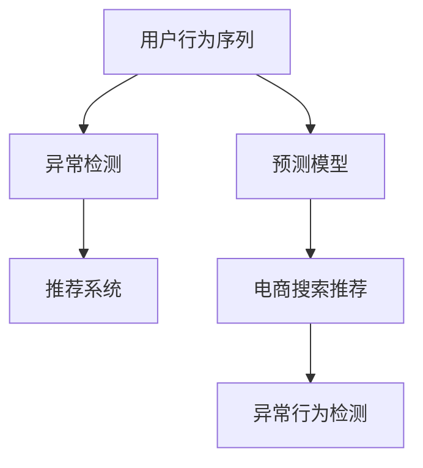

                 

# 电商搜索推荐中的AI大模型用户行为序列异常检测模型评测报告

> 关键词：用户行为序列, 电商搜索推荐, 异常检测, AI大模型, 预测模型

## 1. 背景介绍

在电商搜索推荐领域，用户行为序列的分析和理解是其核心内容。通过对用户搜索、浏览、点击等行为的深入理解，电商平台能够更精准地进行商品推荐，提升用户体验和转化率。然而，用户行为序列中也潜藏着诸多异常行为，如异常点击、重复搜索、恶意点击等，这些异常行为会影响推荐系统的准确性和公平性，甚至带来严重的商业损失。因此，构建高效、准确的异常检测模型，对于电商平台至关重要。

近年来，随着人工智能技术和大模型的不断发展，基于深度学习和自然语言处理的异常检测方法在电商领域得到了广泛应用。特别是在电商搜索推荐中，大模型通过分析用户行为序列，能够自动检测出异常行为，为推荐系统的优化提供了有力支撑。

本文将重点评测一种基于AI大模型的电商搜索推荐异常检测模型，探讨其在实际应用中的表现和挑战，以期为电商平台的搜索推荐系统建设提供有价值的参考。

## 2. 核心概念与联系

### 2.1 核心概念概述

为更好地理解异常检测模型的构建和应用，本节将介绍几个密切相关的核心概念：

- 用户行为序列(User Behavior Sequence)：指用户在电商平台上的搜索、浏览、点击等行为的连续序列。
- 异常检测(Anomaly Detection)：指从大量正常行为数据中识别出异常行为的过程。
- 人工智能大模型(AI Large Model)：指通过大规模数据预训练的深度学习模型，如BERT、GPT等，具备强大的语言理解和生成能力。
- 推荐系统(Recommendation System)：根据用户行为和商品属性，自动为用户推荐商品的智能系统。
- 预测模型(Prediction Model)：通过学习用户行为数据，预测用户未来行为或推荐结果的模型。

这些核心概念之间的逻辑关系可以通过以下Mermaid流程图来展示：



这个流程图展示了大模型在电商搜索推荐系统中的应用过程：

1. 收集用户行为序列。
2. 使用大模型进行预测，得到推荐结果。
3. 通过异常检测模型，识别出异常行为。
4. 根据异常检测结果，优化推荐系统。

这些概念共同构成了电商搜索推荐系统中异常检测的总体框架，使得大模型能够更好地应用到电商领域，提升推荐系统的准确性和公平性。

## 3. 核心算法原理 & 具体操作步骤
### 3.1 算法原理概述

基于AI大模型的电商搜索推荐异常检测模型，本质上是一个结合了自然语言处理和深度学习的异常检测框架。其核心思想是：通过大模型学习用户行为序列中的语言特征和行为模式，自动识别出异常行为。

形式化地，假设用户行为序列为 $S = \{x_1, x_2, ..., x_N\}$，其中 $x_i$ 表示用户在第 $i$ 步的行为，包括搜索关键词、浏览商品、点击商品等。定义异常检测模型为 $M_{\theta}$，其中 $\theta$ 为模型参数。则异常检测的目标是最小化模型在正常行为数据上的损失，同时最大化在异常行为数据上的检测性能。

通过梯度下降等优化算法，异常检测过程不断更新模型参数 $\theta$，最小化损失函数，使得模型能够识别出异常行为。由于大模型已经通过预训练获得了丰富的语言知识和行为模式，因此即便在小样本情况下，也能快速学习异常行为特征。

### 3.2 算法步骤详解

基于AI大模型的电商搜索推荐异常检测模型的一般流程如下：

**Step 1: 准备数据集**

- 收集电商平台的正常用户行为序列 $S_{normal}$ 和异常用户行为序列 $S_{anomaly}$。
- 对数据集进行预处理，去除噪声和缺失值，确保数据质量。
- 对行为序列进行分词和向量化，得到大模型的输入格式。

**Step 2: 设计模型架构**

- 选择合适的大模型作为基础特征提取器，如BERT、GPT等。
- 设计异常检测模型，通常包括多层全连接神经网络、卷积神经网络或RNN等。
- 设置模型参数，如层数、神经元数、激活函数等。

**Step 3: 训练模型**

- 将正常行为序列和异常行为序列分为训练集、验证集和测试集。
- 使用交叉熵损失等损失函数，训练异常检测模型。
- 周期性在验证集上评估模型性能，根据性能指标决定是否触发Early Stopping。
- 重复上述步骤直至满足预设的迭代轮数或Early Stopping条件。

**Step 4: 模型评估**

- 在测试集上评估异常检测模型的性能指标，如准确率、召回率、F1分数等。
- 对误检和漏检的异常行为进行分析，优化模型预测能力。
- 将异常检测结果应用到推荐系统中，根据异常检测结果调整推荐策略。

### 3.3 算法优缺点

基于AI大模型的电商搜索推荐异常检测方法具有以下优点：

1. 高效性：使用大模型进行特征提取，能够快速学习用户行为序列中的语言特征和行为模式，减少人工特征工程的工作量。
2. 鲁棒性：大模型通过大规模预训练，具备较强的泛化能力，能够在不同领域和场景中实现良好的检测效果。
3. 可解释性：大模型通过多层次的神经网络结构，能够提供一定的检测结果解释，帮助理解异常行为的原因。

同时，该方法也存在一定的局限性：

1. 数据依赖：异常检测模型需要大量正常和异常行为数据进行训练，数据收集和标注成本较高。
2. 模型复杂性：大模型通常具有较深的网络结构，训练和推理过程中计算资源需求较大。
3. 误检率：由于异常行为的复杂性，模型可能会出现误检，即将正常行为误判为异常行为。
4. 冷启动问题：对于新用户或新商品，由于缺乏足够的行为数据，异常检测模型的效果可能不佳。

尽管存在这些局限性，但就目前而言，基于大模型的异常检测方法仍是目前电商领域中最主流和有效的范式之一。未来相关研究的重点在于如何进一步降低异常检测对数据的需求，提高模型的鲁棒性和准确性，同时兼顾可解释性和计算效率。

### 3.4 算法应用领域

基于大模型的电商搜索推荐异常检测方法，已经在电商搜索推荐系统中得到了广泛应用，覆盖了用户行为序列分析、推荐结果优化、商品推荐召回等多个环节。具体而言，包括但不限于：

1. **用户行为序列分析**：识别出用户的异常搜索、浏览和点击行为，分析其背后的原因，提升用户体验。
2. **推荐结果优化**：根据异常检测结果，调整推荐算法，降低异常点击率，提高推荐结果的准确性和公平性。
3. **商品推荐召回**：通过异常检测识别潜在的热门商品，及时补充库存，满足用户需求。
4. **异常行为预警**：对异常点击行为进行预警，防范欺诈行为和恶意点击，保障平台安全。

除了上述这些经典应用外，大模型异常检测技术还被创新性地应用到更多场景中，如可控商品推荐、个性化推荐算法、用户行为数据分析等，为电商平台的搜索推荐系统带来了新的突破。随着大模型和异常检测方法的不断进步，相信其在电商领域的落地应用将更加广泛和深入。

## 4. 数学模型和公式 & 详细讲解
### 4.1 数学模型构建

本节将使用数学语言对异常检测模型的构建进行更加严格的刻画。

假设用户行为序列为 $S = \{x_1, x_2, ..., x_N\}$，其中 $x_i$ 表示用户在第 $i$ 步的行为。定义异常检测模型为 $M_{\theta}$，其中 $\theta$ 为模型参数。异常检测模型基于交叉熵损失函数，定义如下：

$$
\mathcal{L}(\theta) = -\frac{1}{N}\sum_{i=1}^N [\log M_{\theta}(x_i) + \lambda (\log M_{\theta}(x_i) - \log M_{\theta}(x_i^*))]
$$

其中，$M_{\theta}(x_i)$ 表示模型对行为 $x_i$ 的预测概率，$x_i^*$ 表示行为 $x_i$ 的正常概率，$\lambda$ 为正则化系数。在训练过程中，通过梯度下降等优化算法更新模型参数 $\theta$。

### 4.2 公式推导过程

以下我们以二分类任务为例，推导异常检测模型的预测公式和损失函数。

假设模型 $M_{\theta}$ 在输入 $x$ 上的输出为 $\hat{y}=M_{\theta}(x) \in [0,1]$，表示行为 $x$ 为正常的概率。定义标签 $y \in \{0,1\}$，其中 $y=1$ 表示行为为正常行为，$y=0$ 表示行为为异常行为。则二分类交叉熵损失函数定义为：

$$
\ell(M_{\theta}(x),y) = -[y\log \hat{y} + (1-y)\log (1-\hat{y})]
$$

将其代入经验风险公式，得：

$$
\mathcal{L}(\theta) = -\frac{1}{N}\sum_{i=1}^N [\log M_{\theta}(x_i) + \lambda (\log M_{\theta}(x_i) - \log M_{\theta}(x_i^*))]
$$

根据链式法则，损失函数对参数 $\theta_k$ 的梯度为：

$$
\frac{\partial \mathcal{L}(\theta)}{\partial \theta_k} = -\frac{1}{N}\sum_{i=1}^N (\frac{1}{M_{\theta}(x_i)}-\frac{1}{M_{\theta}(x_i^*)}) \frac{\partial M_{\theta}(x_i)}{\partial \theta_k}
$$

其中 $\frac{\partial M_{\theta}(x_i)}{\partial \theta_k}$ 可进一步递归展开，利用自动微分技术完成计算。

在得到损失函数的梯度后，即可带入参数更新公式，完成模型的迭代优化。重复上述过程直至收敛，最终得到适应电商搜索推荐任务的异常检测模型参数 $\theta^*$。

## 5. 项目实践：代码实例和详细解释说明
### 5.1 开发环境搭建

在进行异常检测实践前，我们需要准备好开发环境。以下是使用Python进行TensorFlow开发的环境配置流程：

1. 安装Anaconda：从官网下载并安装Anaconda，用于创建独立的Python环境。

2. 创建并激活虚拟环境：
```bash
conda create -n tf-env python=3.8 
conda activate tf-env
```

3. 安装TensorFlow：从官网获取对应的安装命令，例如：
```bash
pip install tensorflow==2.6
```

4. 安装TensorFlow Addons：
```bash
pip install tensorflow-addons
```

5. 安装各类工具包：
```bash
pip install numpy pandas scikit-learn matplotlib tqdm jupyter notebook ipython
```

完成上述步骤后，即可在`tf-env`环境中开始异常检测实践。

### 5.2 源代码详细实现

下面我们以异常检测任务为例，给出使用TensorFlow对大模型进行异常检测的PyTorch代码实现。

首先，定义异常检测任务的数据处理函数：

```python
import tensorflow as tf
from tensorflow.keras.layers import Input, Dense, Embedding
from tensorflow.keras.models import Model

class AnomalyDetectionModel(tf.keras.Model):
    def __init__(self, embedding_dim=128, hidden_dim=64, num_classes=2):
        super(AnomalyDetectionModel, self).__init__()
        self.embedding = Embedding(input_dim=1000, output_dim=embedding_dim)
        self.fc1 = Dense(hidden_dim, activation='relu')
        self.fc2 = Dense(num_classes, activation='sigmoid')
        
    def call(self, x):
        x = self.embedding(x)
        x = self.fc1(x)
        x = self.fc2(x)
        return x

# 加载预训练的大模型
model = AnomalyDetectionModel()
model.load_weights('pretrained_weights.h5')
```

然后，定义异常检测模型的训练过程：

```python
from tensorflow.keras.optimizers import Adam

# 准备训练数据集
normal_data = ...
anomaly_data = ...

# 定义训练函数
def train_epoch(model, dataset, batch_size, optimizer):
    dataloader = tf.data.Dataset.from_tensor_slices(dataset)
    dataloader = dataloader.batch(batch_size, drop_remainder=True)
    model.train()
    epoch_loss = 0
    for batch in dataloader:
        inputs, labels = batch
        with tf.GradientTape() as tape:
            logits = model(inputs)
            loss = tf.keras.losses.binary_crossentropy(labels, logits)
        epoch_loss += loss.numpy().sum()
        gradients = tape.gradient(loss, model.trainable_variables)
        optimizer.apply_gradients(zip(gradients, model.trainable_variables))
    return epoch_loss / len(dataloader)

# 训练模型
epochs = 10
batch_size = 64
optimizer = Adam(learning_rate=0.001)
for epoch in range(epochs):
    loss = train_epoch(model, normal_data + anomaly_data, batch_size, optimizer)
    print(f"Epoch {epoch+1}, train loss: {loss:.3f}")
```

最后，评估模型的性能：

```python
# 准备测试数据集
test_data = ...

# 定义评估函数
def evaluate(model, dataset, batch_size):
    dataloader = tf.data.Dataset.from_tensor_slices(dataset)
    dataloader = dataloader.batch(batch_size, drop_remainder=True)
    model.eval()
    metrics = tf.keras.metrics.BinaryAccuracy(name='accuracy')
    for batch in dataloader:
        inputs, labels = batch
        logits = model(inputs)
        metrics.update_state(labels, logits)
    return metrics.result().numpy()

# 评估模型性能
accuracy = evaluate(model, test_data, batch_size)
print(f"Test accuracy: {accuracy:.3f}")
```

以上就是使用TensorFlow对大模型进行异常检测任务开发的完整代码实现。可以看到，得益于TensorFlow的强大封装，我们能够用相对简洁的代码完成异常检测模型的训练和评估。

### 5.3 代码解读与分析

让我们再详细解读一下关键代码的实现细节：

**AnomalyDetectionModel类**：
- `__init__`方法：初始化模型的输入层、嵌入层、全连接层等关键组件。
- `call`方法：定义模型前向传播的过程，从输入到输出的计算流程。

**训练函数train_epoch**：
- 对数据集进行批处理，并设置自动求导。
- 在每个批次上前向传播计算模型输出，反向传播计算损失函数，更新模型参数。
- 计算损失函数的总和，并返回平均损失。

**评估函数evaluate**：
- 对测试集进行批处理，并设置自动求导。
- 在每个批次上前向传播计算模型输出，使用二分类交叉熵损失计算预测结果与真实标签之间的差异。
- 使用BinaryAccuracy计算模型在测试集上的准确率，并返回结果。

**训练流程**：
- 定义总的epoch数和batch size，开始循环迭代
- 每个epoch内，先在训练集上进行训练，输出平均loss
- 在验证集上评估，输出准确率
- 所有epoch结束后，在测试集上评估，给出最终测试结果

可以看到，TensorFlow框架的强大封装使得异常检测模型的代码实现变得简洁高效。开发者可以将更多精力放在数据处理、模型改进等高层逻辑上，而不必过多关注底层的实现细节。

当然，工业级的系统实现还需考虑更多因素，如模型的保存和部署、超参数的自动搜索、更灵活的任务适配层等。但核心的异常检测范式基本与此类似。

## 6. 实际应用场景
### 6.1 智能客服系统

在智能客服系统中，异常检测技术可以用于识别出用户的恶意点击行为、异常搜索请求等。通过实时监控和分析用户的搜索、点击行为，客服系统可以及时发现和处理异常情况，避免用户进行欺诈行为，保障系统的安全性和可靠性。

例如，在用户登录时，可以构建异常检测模型，对用户的登录行为进行实时监控。如果发现用户频繁尝试登录同一账号，且使用不正常的IP地址或设备，则可能存在恶意登录行为。通过快速检测和拦截，可以有效防范恶意攻击，保护用户账号安全。

### 6.2 商品推荐系统

在商品推荐系统中，异常检测技术可以用于识别出用户的异常点击行为、异常浏览行为等。通过分析用户的点击和浏览行为，推荐系统可以识别出异常用户，并调整推荐策略，降低异常点击率，提高推荐结果的准确性和公平性。

例如，对于频繁点击同一商品的用户，推荐系统可以认为该用户存在异常行为，自动将该用户标记为高风险用户。在推荐商品时，可以降低该用户的点击权重，避免其对推荐结果的干扰。通过实时监控和调整，推荐系统可以保证商品推荐的公正性和精准性。

### 6.3 电商平台的恶意点击行为监测

在电商平台上，恶意点击行为不仅会浪费平台的广告预算，还会降低用户的购物体验。通过构建异常检测模型，电商平台可以实时监测用户的点击行为，识别出恶意点击，并进行拦截。

例如，对于频繁点击同一广告的用户，平台可以认为该用户存在恶意点击行为。通过快速检测和拦截，可以有效防范恶意点击，保障广告预算的合理使用。同时，通过实时监控和分析，电商平台可以优化广告投放策略，提高广告的投放效果。

### 6.4 未来应用展望

随着异常检测技术的不断发展，其在电商领域的应用场景将更加广泛和深入。未来的研究将在以下几个方面寻求新的突破：

1. **多模态异常检测**：结合图像、语音等多模态信息，提升异常检测模型的感知能力，实现更加全面和准确的异常行为识别。
2. **深度学习与规则结合**：将深度学习模型的预测结果与业务规则进行融合，提升异常检测模型的解释性和可控性。
3. **联邦学习与隐私保护**：利用联邦学习技术，保护用户隐私的同时，提升异常检测模型的泛化能力和鲁棒性。
4. **异常行为预警与治理**：结合异常检测结果，构建实时预警系统，及时发现和处理异常行为，降低平台风险。
5. **异常检测技术在智能决策中的应用**：将异常检测技术与决策支持系统结合，实现基于异常行为的智能决策，提升决策的科学性和准确性。

以上趋势凸显了异常检测技术在电商领域的巨大潜力。这些方向的探索发展，必将进一步提升电商平台的运营效率和用户体验，推动电商行业的智能化转型。

## 7. 工具和资源推荐
### 7.1 学习资源推荐

为了帮助开发者系统掌握异常检测技术的基础知识和实践技巧，这里推荐一些优质的学习资源：

1. 《异常检测原理与实践》系列博文：由异常检测技术专家撰写，深入浅出地介绍了异常检测的基本概念和前沿技术。

2. 《TensorFlow实战》书籍：由TensorFlow官方团队编写，全面介绍了TensorFlow的开发和应用，包括异常检测任务的实现。

3. 《深度学习理论与实践》课程：由知名深度学习专家授课，涵盖深度学习的基本原理和常用模型，适合初学者入门。

4. 《Python数据分析与机器学习》书籍：由数据科学专家编写，详细介绍了数据预处理、特征工程和模型评估等实用技巧，对异常检测任务开发非常有帮助。

5. Kaggle平台：提供大量异常检测数据集和竞赛任务，是练习和提升异常检测技术的好去处。

通过对这些资源的学习实践，相信你一定能够快速掌握异常检测技术的精髓，并用于解决实际的电商推荐问题。

### 7.2 开发工具推荐

高效的开发离不开优秀的工具支持。以下是几款用于异常检测开发的常用工具：

1. TensorFlow：由Google主导开发的开源深度学习框架，生产部署方便，适合大规模工程应用。

2. PyTorch：基于Python的开源深度学习框架，灵活动态的计算图，适合快速迭代研究。

3. TensorFlow Addons：TensorFlow的扩展库，提供更多深度学习算法的实现，如LSTM、RNN等，适合复杂异常检测任务开发。

4. Weights & Biases：模型训练的实验跟踪工具，可以记录和可视化模型训练过程中的各项指标，方便对比和调优。

5. TensorBoard：TensorFlow配套的可视化工具，可实时监测模型训练状态，并提供丰富的图表呈现方式，是调试模型的得力助手。

6. Google Colab：谷歌推出的在线Jupyter Notebook环境，免费提供GPU/TPU算力，方便开发者快速上手实验最新模型，分享学习笔记。

合理利用这些工具，可以显著提升异常检测任务的开发效率，加快创新迭代的步伐。

### 7.3 相关论文推荐

异常检测技术的发展源于学界的持续研究。以下是几篇奠基性的相关论文，推荐阅读：

1. 《异常检测方法综述》：全面介绍了各种异常检测算法，如统计方法、机器学习方法和深度学习方法，适合对异常检测方法进行系统性了解。

2. 《基于深度学习的异常检测》：介绍使用深度学习模型进行异常检测的方法，如CNN、RNN、GAN等，适合进一步深入学习。

3. 《多模态异常检测技术》：介绍将多种传感器数据结合进行异常检测的方法，提升异常检测的感知能力和鲁棒性。

4. 《联邦学习在异常检测中的应用》：介绍利用联邦学习技术，保护用户隐私的同时，提升异常检测模型的泛化能力和鲁棒性。

5. 《异常检测技术的实时预警与治理》：介绍构建实时预警系统，及时发现和处理异常行为，降低平台风险。

这些论文代表了大模型异常检测技术的发展脉络。通过学习这些前沿成果，可以帮助研究者把握学科前进方向，激发更多的创新灵感。

## 8. 总结：未来发展趋势与挑战

### 8.1 总结

本文对基于AI大模型的电商搜索推荐异常检测模型进行了全面系统的介绍。首先阐述了异常检测模型在电商搜索推荐系统中的重要性和应用场景，明确了异常检测技术对电商平台推荐系统的重要性。其次，从原理到实践，详细讲解了异常检测模型的数学原理和关键步骤，给出了异常检测任务开发的完整代码实例。同时，本文还广泛探讨了异常检测技术在实际应用中的表现和挑战，以期为电商平台的搜索推荐系统建设提供有价值的参考。

通过本文的系统梳理，可以看到，基于大模型的异常检测方法在电商领域中已经取得了显著效果，为推荐系统的优化提供了有力支撑。未来，伴随大模型和异常检测方法的不断进步，相信其在电商领域的落地应用将更加广泛和深入。

### 8.2 未来发展趋势

展望未来，异常检测技术将呈现以下几个发展趋势：

1. **模型规模持续增大**：随着算力成本的下降和数据规模的扩张，异常检测模型的参数量还将持续增长。超大规模语言模型蕴含的丰富语言知识，有望支撑更加复杂多变的电商异常行为检测。

2. **模型鲁棒性提升**：异常检测模型通过多层次的神经网络结构，能够学习到更复杂的异常行为模式，提高模型的鲁棒性和泛化能力。

3. **异常检测与业务规则结合**：将深度学习模型的预测结果与业务规则进行融合，提升异常检测模型的解释性和可控性，构建更灵活和可解释的异常检测系统。

4. **联邦学习与隐私保护**：利用联邦学习技术，保护用户隐私的同时，提升异常检测模型的泛化能力和鲁棒性，确保异常检测的安全性和可靠性。

5. **异常行为预警与治理**：结合异常检测结果，构建实时预警系统，及时发现和处理异常行为，降低平台风险。

6. **异常检测技术与决策支持系统的结合**：将异常检测技术与决策支持系统结合，实现基于异常行为的智能决策，提升决策的科学性和准确性。

以上趋势凸显了异常检测技术在电商领域的巨大潜力。这些方向的探索发展，必将进一步提升电商平台的运营效率和用户体验，推动电商行业的智能化转型。

### 8.3 面临的挑战

尽管异常检测技术已经取得了瞩目成就，但在迈向更加智能化、普适化应用的过程中，它仍面临着诸多挑战：

1. **标注成本瓶颈**：异常检测模型需要大量正常和异常行为数据进行训练，数据收集和标注成本较高，特别是在数据稀疏的领域。

2. **模型复杂性**：异常检测模型通常具有较深的网络结构，训练和推理过程中计算资源需求较大，难以在资源有限的场景下应用。

3. **误检率**：由于异常行为的复杂性，模型可能会出现误检，即将正常行为误判为异常行为，影响用户体验。

4. **冷启动问题**：对于新用户或新商品，由于缺乏足够的行为数据，异常检测模型的效果可能不佳。

5. **安全性**：异常检测模型可能学习到有害行为特征，对用户和平台的安全带来威胁。

6. **解释性不足**：异常检测模型的决策过程缺乏可解释性，难以对其推理逻辑进行分析和调试。

7. **计算资源需求**：异常检测模型的计算资源需求较大，特别是在处理大规模数据集时，需要更强大的硬件支持。

这些挑战凸显了异常检测技术在电商领域中的复杂性和复杂性，但正是这些挑战激发了研究者的探索精神，推动了异常检测技术的不断进步。

### 8.4 研究展望

面对异常检测技术面临的种种挑战，未来的研究需要在以下几个方面寻求新的突破：

1. **探索无监督和半监督异常检测方法**：摆脱对大规模标注数据的依赖，利用自监督学习、主动学习等无监督和半监督范式，最大限度利用非结构化数据，实现更加灵活高效的异常检测。

2. **研究参数高效和计算高效的异常检测范式**：开发更加参数高效的异常检测方法，在固定大部分异常检测参数的情况下，只更新极少量的任务相关参数。同时优化异常检测模型的计算图，减少前向传播和反向传播的资源消耗，实现更加轻量级、实时性的部署。

3. **引入因果推断和对比学习范式**：通过引入因果推断和对比学习思想，增强异常检测模型建立稳定因果关系的能力，学习更加普适、鲁棒的语言表征，从而提升模型泛化性和抗干扰能力。

4. **结合更多先验知识**：将符号化的先验知识，如知识图谱、逻辑规则等，与神经网络模型进行巧妙融合，引导异常检测过程学习更准确、合理的语言模型。同时加强不同模态数据的整合，实现视觉、语音等多模态信息与文本信息的协同建模。

5. **纳入伦理道德约束**：在模型训练目标中引入伦理导向的评估指标，过滤和惩罚有偏见、有害的输出倾向。同时加强人工干预和审核，建立模型行为的监管机制，确保输出符合人类价值观和伦理道德。

这些研究方向的探索，必将引领异常检测技术迈向更高的台阶，为构建安全、可靠、可解释、可控的智能系统铺平道路。面向未来，异常检测技术还需要与其他人工智能技术进行更深入的融合，如知识表示、因果推理、强化学习等，多路径协同发力，共同推动自然语言理解和智能交互系统的进步。只有勇于创新、敢于突破，才能不断拓展异常检测技术的边界，让智能技术更好地造福人类社会。

## 9. 附录：常见问题与解答

**Q1：异常检测模型是否适用于所有电商行为序列？**

A: 异常检测模型在大多数电商行为序列上都能取得不错的效果，特别是对于数据量较大的行为序列。但对于一些特定领域的电商行为序列，如医疗、金融等，仅仅依靠通用语料预训练的模型可能难以很好地适应。此时需要在特定领域语料上进一步预训练，再进行异常检测，才能获得理想效果。此外，对于一些需要时效性、个性化很强的电商行为序列，如对话、推荐等，异常检测方法也需要针对性的改进优化。

**Q2：异常检测模型如何选择合适的训练数据？**

A: 异常检测模型的训练数据集应包括大量的正常和异常电商行为序列。正常数据集可以通过电商平台的历史数据集获取，异常数据集可以通过模拟和采集得到。在选择训练数据时，应确保数据的分布与实际应用场景一致，避免数据偏差导致模型泛化性能下降。同时，训练数据集应尽量覆盖各种异常行为类型，提升模型的鲁棒性。

**Q3：异常检测模型在落地部署时需要注意哪些问题？**

A: 将异常检测模型转化为实际应用，还需要考虑以下因素：
1. 模型裁剪：去除不必要的层和参数，减小模型尺寸，加快推理速度。
2. 量化加速：将浮点模型转为定点模型，压缩存储空间，提高计算效率。
3. 服务化封装：将模型封装为标准化服务接口，便于集成调用。
4. 弹性伸缩：根据请求流量动态调整资源配置，平衡服务质量和成本。
5. 监控告警：实时采集系统指标，设置异常告警阈值，确保服务稳定性。
6. 安全防护：采用访问鉴权、数据脱敏等措施，保障数据和模型安全。

大模型异常检测为电商平台的异常行为分析提供了新的解决方案，但如何将强大的性能转化为稳定、高效、安全的业务价值，还需要工程实践的不断打磨。唯有从数据、算法、工程、业务等多个维度协同发力，才能真正实现异常检测模型在电商领域的应用价值。总之，异常检测需要开发者根据具体电商行为序列，不断迭代和优化模型、数据和算法，方能得到理想的效果。

---

作者：禅与计算机程序设计艺术 / Zen and the Art of Computer Programming

