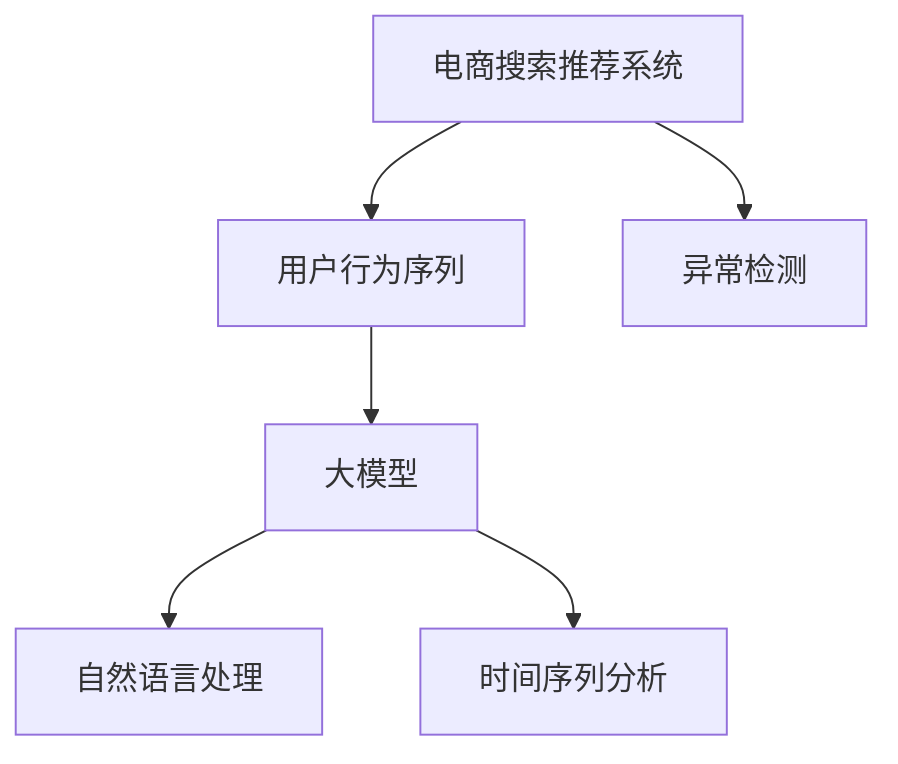

                 

# 电商搜索推荐中的AI大模型用户行为序列异常检测算法选择

> 关键词：电商推荐系统,用户行为序列,异常检测,大模型,自然语言处理,时间序列分析

## 1. 背景介绍

在电商搜索推荐系统中，用户的行为序列能够反映其偏好和需求，是推荐算法重要的数据基础。然而，用户行为序列常常受各种外部因素干扰，可能存在异常或噪声，影响推荐效果。传统的方法往往依赖手工规则或固定阈值进行异常检测，难以处理复杂多变的异常情况。因此，引入先进的大模型技术，成为提升电商推荐系统效果的必然选择。

### 1.1 问题由来
电商搜索推荐系统中，用户行为序列（User Behavior Sequences, UBS）是用户与产品交互的记录，包含用户浏览、点击、购买等行为，这些行为数据可以反映用户对产品的兴趣和偏好。通过分析这些数据，电商推荐系统可以为用户推荐符合其兴趣的商品，提升用户体验和转化率。

然而，用户行为序列受多方面因素影响，可能包含异常行为或噪声。例如：
- 用户的点击行为可能受广告影响，而非对商品的兴趣。
- 用户的购买行为可能受促销活动或产品打折的影响，而非对商品的实际需求。
- 用户的浏览行为可能受竞争产品的干扰，而非对当前产品的偏好。

这些异常行为和噪声数据如果未能及时识别和处理，会影响推荐算法的准确性和公平性，降低推荐效果。

### 1.2 问题核心关键点
电商搜索推荐系统中的用户行为序列异常检测，旨在从用户行为数据中识别和剔除异常行为，提取真实用户需求，为推荐算法提供干净、准确的输入数据。核心关键点包括：
- 如何有效识别异常行为和噪声数据。
- 如何保证异常检测的准确性和鲁棒性。
- 如何将异常检测与电商推荐算法进行无缝集成。

这些问题需要通过引入大模型技术，结合自然语言处理和统计学习方法进行解决。

### 1.3 问题研究意义
电商搜索推荐系统中的用户行为序列异常检测，有助于提高推荐系统的准确性和个性化程度，带来更高的商业价值。具体意义包括：
1. 提升用户体验：识别并过滤异常行为，提供更加符合用户需求的商品推荐，提升用户满意度。
2. 提高转化率：确保用户点击和购买行为的数据质量，提高推荐精准度，提升电商平台的销售转化率。
3. 优化运营策略：准确识别异常行为，辅助电商平台优化营销策略，提升广告投放效果。
4. 应对数据噪声：通过异常检测技术，减少数据中的噪声干扰，保障推荐系统性能稳定。
5. 增强数据安全性：通过异常行为监控，及时发现并阻止恶意行为，保障用户数据安全。

## 2. 核心概念与联系

### 2.1 核心概念概述

为更好地理解电商搜索推荐系统中的用户行为序列异常检测方法，本节将介绍几个密切相关的核心概念：

- **电商搜索推荐系统 (E-commerce Search Recommendation System)**：利用用户行为数据进行商品推荐，提升用户体验和转化率。
- **用户行为序列 (User Behavior Sequence, UBS)**：用户与产品交互的历史记录，包含浏览、点击、购买等行为。
- **异常检测 (Anomaly Detection)**：识别数据中的异常或噪声，保障数据质量。
- **大模型 (Large Model)**：如BERT、GPT等，通过大规模预训练学习丰富的语言知识，具备强大的语言理解和生成能力。
- **自然语言处理 (Natural Language Processing, NLP)**：处理和理解人类语言的技术，包括文本分类、命名实体识别、情感分析等任务。
- **时间序列分析 (Time Series Analysis)**：对按时间顺序排列的数据进行统计、分析和建模。

这些核心概念之间的逻辑关系可以通过以下Mermaid流程图来展示：



这个流程图展示了大语言模型在电商推荐系统中的作用：

1. 电商推荐系统通过用户行为序列，进行商品推荐。
2. 用户行为序列中可能包含异常行为和噪声数据。
3. 通过大语言模型进行异常检测，提升行为数据的质量。
4. 自然语言处理技术用于理解行为数据中的文本信息。
5. 时间序列分析技术用于处理行为数据中的时间特性。

## 3. 核心算法原理 & 具体操作步骤
### 3.1 算法原理概述

电商搜索推荐系统中的用户行为序列异常检测，本质是一个异常检测问题，目标是识别用户行为序列中的异常或噪声数据。其核心算法包括：

- **基于统计的异常检测方法**：如Z-score、IQR、HMM等，通过统计量或概率模型进行异常检测。
- **基于机器学习的异常检测方法**：如kNN、SVM、随机森林等，通过分类器或回归器进行异常检测。
- **基于深度学习的异常检测方法**：如Autoencoder、GAN、大语言模型等，通过深度神经网络进行异常检测。

其中，基于深度学习的异常检测方法，由于能够学习到更丰富的特征表示和模式，通常在复杂数据集上表现优异。

### 3.2 算法步骤详解

以下是基于深度学习的大语言模型在电商推荐系统中进行用户行为序列异常检测的具体操作步骤：

**Step 1: 数据准备**
- 收集电商平台的商品浏览、点击、购买等行为数据，形成用户行为序列。
- 将用户行为序列进行预处理，包括缺失值填充、文本清洗、归一化等。

**Step 2: 特征工程**
- 提取用户行为序列的关键特征，如浏览时间、点击次数、购买金额等。
- 对行为序列进行编码，将文本信息转化为模型能够处理的数字特征。
- 设计时间序列特征，捕捉行为序列中的时间特性。

**Step 3: 模型训练**
- 选择合适的预训练大模型，如BERT、GPT等，加载并适配到电商推荐系统数据集。
- 在标注数据上训练异常检测模型，优化模型参数，最小化异常损失。

**Step 4: 异常检测**
- 对电商平台的实时用户行为序列进行推理，判断其是否包含异常行为。
- 通过阈值判断或模型预测，对异常行为进行标记和剔除。

**Step 5: 结果反馈**
- 将检测结果反馈给推荐算法，重新进行推荐排序。
- 对异常行为进行记录和分析，及时发现并解决异常数据来源。

### 3.3 算法优缺点

基于深度学习的大语言模型进行用户行为序列异常检测，具有以下优点：
1. 学习能力强：通过大规模预训练，能够学习到丰富的行为特征和模式。
2. 泛化性强：适应复杂多变的电商推荐场景，识别各类异常行为。
3. 实时性好：基于深度学习模型的推理速度快，能够实时检测异常行为。

同时，该方法也存在以下缺点：
1. 数据依赖性强：需要大量标注数据进行训练，数据获取成本较高。
2. 模型复杂度高：深度学习模型结构复杂，训练和推理资源消耗大。
3. 解释性差：深度学习模型作为黑盒，难以解释异常检测的决策过程。
4. 对抗样本敏感：深度模型对输入的噪声和扰动敏感，容易被对抗样本攻击。

尽管存在这些局限性，但就目前而言，基于大语言模型的异常检测方法仍是最先进的技术手段，广泛应用于电商推荐系统等场景中。未来相关研究的重点在于如何进一步降低数据依赖，提高模型的实时性和鲁棒性，同时兼顾可解释性和伦理安全性等因素。

### 3.4 算法应用领域

基于大语言模型进行电商推荐系统中的用户行为序列异常检测，在实际应用中，已经在以下几个领域取得了显著效果：

- **商品推荐排序**：对用户行为序列进行异常检测，提升推荐排序的准确性和个性化程度。
- **广告点击率优化**：识别和剔除恶意点击行为，优化广告投放效果。
- **用户行为分析**：分析用户行为序列中的异常行为，辅助电商平台优化运营策略。
- **用户画像构建**：构建用户画像，识别潜在高价值用户，提升电商平台的客单价和回购率。

除了上述这些典型应用外，大语言模型在电商推荐系统中的应用还在不断拓展，如商品评价分析、库存管理等，为电商平台带来更多的商业价值。

## 4. 数学模型和公式 & 详细讲解 & 举例说明

### 4.1 数学模型构建

电商推荐系统中的用户行为序列异常检测，可以构建如下数学模型：

设用户行为序列为 $x = (x_1, x_2, \ldots, x_t)$，其中 $x_t$ 表示用户在第 $t$ 步的行为数据。异常检测的目标是识别出包含异常行为的数据点，将其标记为异常 $y=1$，其余标记为正常 $y=0$。

通过构建异常检测模型 $f(x; \theta)$，对用户行为序列进行异常评分，得到预测结果 $\hat{y} = f(x; \theta)$。然后，通过阈值 $T$ 将预测结果转换为异常标签 $y_{pred} = \mathbb{I}(\hat{y} \geq T)$。

其中，$\mathbb{I}(\cdot)$ 为指示函数，若条件成立则返回1，否则返回0。

### 4.2 公式推导过程

基于深度学习的大语言模型进行异常检测时，通常使用Autoencoder（自编码器）模型。Autoencoder模型由编码器和解码器两部分组成，其中编码器将输入映射为潜在表示，解码器将潜在表示映射回输入空间。通过最小化重构误差，学习到输入和潜在表示之间的映射关系。

设输入为 $x = (x_1, x_2, \ldots, x_t)$，潜在表示为 $z = (z_1, z_2, \ldots, z_t)$，重构误差为 $e(x; \theta) = \|x - \hat{x}\|_2$，其中 $\hat{x}$ 为解码器输出的重构结果。

编码器 $f$ 的输出为潜在表示 $z = f(x; \theta_1)$，解码器 $g$ 的输出为重构结果 $\hat{x} = g(z; \theta_2)$，模型参数为 $\theta = (\theta_1, \theta_2)$。异常检测模型 $f(x; \theta)$ 通过重构误差 $e(x; \theta)$ 映射到潜在表示空间 $z$，即：

$$
f(x; \theta) = \|z\|
$$

异常检测模型的训练目标是最小化重构误差和潜在表示的L2正则化，即：

$$
\mathcal{L}(\theta) = \frac{1}{N}\sum_{i=1}^N e(x_i; \theta) + \lambda \|z\|^2
$$

其中 $\lambda$ 为正则化系数，控制重构误差和潜在表示的权重。

### 4.3 案例分析与讲解

假设电商平台的商品点击行为数据为 $x = (x_1, x_2, \ldots, x_t)$，其中 $x_t$ 表示用户在第 $t$ 步的点击行为。通过BERT模型进行编码，得到潜在表示 $z = BERT(x; \theta_1)$。

编码器输出的潜在表示 $z$ 通过解码器 $g$ 生成重构结果 $\hat{x}$，重构误差为 $e(x; \theta) = \|x - \hat{x}\|_2$。假设模型参数 $\theta = (\theta_1, \theta_2)$，异常检测模型的输出为：

$$
f(x; \theta) = \|z\|
$$

训练过程中，最小化重构误差和潜在表示的L2正则化，即：

$$
\mathcal{L}(\theta) = \frac{1}{N}\sum_{i=1}^N e(x_i; \theta) + \lambda \|z\|^2
$$

训练完成后，将用户行为序列 $x$ 输入到异常检测模型 $f(x; \theta)$ 中，得到异常评分 $f(x; \theta)$。通过阈值 $T$ 进行二值化处理，得到预测结果 $y_{pred} = \mathbb{I}(f(x; \theta) \geq T)$。

例如，对于电商平台的商品点击行为数据，通过BERT模型进行编码，得到潜在表示 $z = BERT(x; \theta_1)$。然后，通过解码器 $g$ 生成重构结果 $\hat{x}$，计算重构误差 $e(x; \theta) = \|x - \hat{x}\|_2$。最后，将用户行为序列输入到异常检测模型 $f(x; \theta)$ 中，得到异常评分 $f(x; \theta)$，通过阈值 $T$ 进行二值化处理，得到预测结果 $y_{pred} = \mathbb{I}(f(x; \theta) \geq T)$。

## 5. 项目实践：代码实例和详细解释说明
### 5.1 开发环境搭建

在进行电商推荐系统中的用户行为序列异常检测实践前，我们需要准备好开发环境。以下是使用Python进行PyTorch开发的环境配置流程：

1. 安装Anaconda：从官网下载并安装Anaconda，用于创建独立的Python环境。

2. 创建并激活虚拟环境：
```bash
conda create -n pytorch-env python=3.8 
conda activate pytorch-env
```

3. 安装PyTorch：根据CUDA版本，从官网获取对应的安装命令。例如：
```bash
conda install pytorch torchvision torchaudio cudatoolkit=11.1 -c pytorch -c conda-forge
```

4. 安装HuggingFace Transformers库：
```bash
pip install transformers
```

5. 安装各类工具包：
```bash
pip install numpy pandas scikit-learn matplotlib tqdm jupyter notebook ipython
```

完成上述步骤后，即可在`pytorch-env`环境中开始异常检测实践。

### 5.2 源代码详细实现

下面我们以商品点击行为数据为例，给出使用Transformers库对BERT模型进行异常检测的PyTorch代码实现。

首先，定义异常检测的数据处理函数：

```python
from transformers import BertTokenizer, BertModel
from torch.utils.data import Dataset
import torch

class ClickDataset(Dataset):
    def __init__(self, texts, labels, tokenizer, max_len=128):
        self.texts = texts
        self.labels = labels
        self.tokenizer = tokenizer
        self.max_len = max_len
        
    def __len__(self):
        return len(self.texts)
    
    def __getitem__(self, item):
        text = self.texts[item]
        label = self.labels[item]
        
        encoding = self.tokenizer(text, return_tensors='pt', max_length=self.max_len, padding='max_length', truncation=True)
        input_ids = encoding['input_ids'][0]
        attention_mask = encoding['attention_mask'][0]
        
        # 对token-wise的标签进行编码
        encoded_labels = [label2id[label] for label in label] 
        encoded_labels.extend([label2id['normal']] * (self.max_len - len(encoded_labels)))
        labels = torch.tensor(encoded_labels, dtype=torch.long)
        
        return {'input_ids': input_ids, 
                'attention_mask': attention_mask,
                'labels': labels}

# 标签与id的映射
label2id = {'normal': 0, 'anomaly': 1}
id2label = {v: k for k, v in label2id.items()}

# 创建dataset
tokenizer = BertTokenizer.from_pretrained('bert-base-cased')

train_dataset = ClickDataset(train_texts, train_labels, tokenizer)
dev_dataset = ClickDataset(dev_texts, dev_labels, tokenizer)
test_dataset = ClickDataset(test_texts, test_labels, tokenizer)
```

然后，定义模型和优化器：

```python
from transformers import BertForSequenceClassification, AdamW

model = BertForSequenceClassification.from_pretrained('bert-base-cased', num_labels=len(label2id))

optimizer = AdamW(model.parameters(), lr=2e-5)
```

接着，定义训练和评估函数：

```python
from torch.utils.data import DataLoader
from tqdm import tqdm
from sklearn.metrics import classification_report

device = torch.device('cuda') if torch.cuda.is_available() else torch.device('cpu')
model.to(device)

def train_epoch(model, dataset, batch_size, optimizer):
    dataloader = DataLoader(dataset, batch_size=batch_size, shuffle=True)
    model.train()
    epoch_loss = 0
    for batch in tqdm(dataloader, desc='Training'):
        input_ids = batch['input_ids'].to(device)
        attention_mask = batch['attention_mask'].to(device)
        labels = batch['labels'].to(device)
        model.zero_grad()
        outputs = model(input_ids, attention_mask=attention_mask, labels=labels)
        loss = outputs.loss
        epoch_loss += loss.item()
        loss.backward()
        optimizer.step()
    return epoch_loss / len(dataloader)

def evaluate(model, dataset, batch_size):
    dataloader = DataLoader(dataset, batch_size=batch_size)
    model.eval()
    preds, labels = [], []
    with torch.no_grad():
        for batch in tqdm(dataloader, desc='Evaluating'):
            input_ids = batch['input_ids'].to(device)
            attention_mask = batch['attention_mask'].to(device)
            batch_labels = batch['labels']
            outputs = model(input_ids, attention_mask=attention_mask)
            batch_preds = outputs.logits.argmax(dim=2).to('cpu').tolist()
            batch_labels = batch_labels.to('cpu').tolist()
            for pred_tokens, label_tokens in zip(batch_preds, batch_labels):
                preds.append(pred_tokens[:len(label_tokens)])
                labels.append(label_tokens)
                
    print(classification_report(labels, preds))
```

最后，启动训练流程并在测试集上评估：

```python
epochs = 5
batch_size = 16

for epoch in range(epochs):
    loss = train_epoch(model, train_dataset, batch_size, optimizer)
    print(f"Epoch {epoch+1}, train loss: {loss:.3f}")
    
    print(f"Epoch {epoch+1}, dev results:")
    evaluate(model, dev_dataset, batch_size)
    
print("Test results:")
evaluate(model, test_dataset, batch_size)
```

以上就是使用PyTorch对BERT进行商品点击行为数据异常检测的完整代码实现。可以看到，得益于Transformers库的强大封装，我们可以用相对简洁的代码完成BERT模型的加载和异常检测。

### 5.3 代码解读与分析

让我们再详细解读一下关键代码的实现细节：

**ClickDataset类**：
- `__init__`方法：初始化文本、标签、分词器等关键组件。
- `__len__`方法：返回数据集的样本数量。
- `__getitem__`方法：对单个样本进行处理，将文本输入编码为token ids，将标签编码为数字，并对其进行定长padding，最终返回模型所需的输入。

**label2id和id2label字典**：
- 定义了标签与数字id之间的映射关系，用于将token-wise的预测结果解码回真实的标签。

**训练和评估函数**：
- 使用PyTorch的DataLoader对数据集进行批次化加载，供模型训练和推理使用。
- 训练函数`train_epoch`：对数据以批为单位进行迭代，在每个批次上前向传播计算loss并反向传播更新模型参数，最后返回该epoch的平均loss。
- 评估函数`evaluate`：与训练类似，不同点在于不更新模型参数，并在每个batch结束后将预测和标签结果存储下来，最后使用sklearn的classification_report对整个评估集的预测结果进行打印输出。

**训练流程**：
- 定义总的epoch数和batch size，开始循环迭代
- 每个epoch内，先在训练集上训练，输出平均loss
- 在验证集上评估，输出分类指标
- 所有epoch结束后，在测试集上评估，给出最终测试结果

可以看到，PyTorch配合Transformers库使得BERT异常检测的代码实现变得简洁高效。开发者可以将更多精力放在数据处理、模型改进等高层逻辑上，而不必过多关注底层的实现细节。

当然，工业级的系统实现还需考虑更多因素，如模型的保存和部署、超参数的自动搜索、更灵活的任务适配层等。但核心的异常检测范式基本与此类似。

## 6. 实际应用场景
### 6.1 智能客服系统

在智能客服系统中，用户行为序列能够反映其与客服的交互过程，记录用户的问题和回答。通过对用户行为序列进行异常检测，可以识别异常客服交互，提升客服响应速度和质量。

在技术实现上，可以收集客服系统的对话记录，将用户问题和客服回答构建成监督数据，在此基础上对预训练模型进行微调。微调后的模型能够自动理解用户问题，生成最合适的回答。对于异常交互，模型能够自动识别并标记为异常，辅助客服系统进行及时处理。

### 6.2 金融舆情监测

金融机构需要实时监测市场舆论动向，以便及时应对负面信息传播，规避金融风险。通过收集用户对金融产品的评论数据，分析用户行为序列中的异常行为，可以发现潜在风险，及时采取措施。

具体而言，可以收集用户在金融平台上对股票、基金等金融产品的评论数据，并将评论与股票价格数据进行关联分析。利用BERT等大语言模型进行异常检测，识别对金融产品负面的评论和异常的交易行为，及时预警，帮助金融机构规避风险。

### 6.3 个性化推荐系统

在个性化推荐系统中，用户行为序列是推荐算法的重要输入。通过对用户行为序列进行异常检测，可以排除用户行为中的异常数据，提升推荐排序的准确性和个性化程度。

在技术实现上，可以收集用户在电商平台上对商品、内容等的浏览、点击、购买等行为数据，并将行为数据转化为时间序列特征。利用BERT等大语言模型进行异常检测，识别用户行为中的异常点击、恶意购买等行为，确保推荐系统输入数据的真实性，提升推荐效果。

### 6.4 未来应用展望

随着大语言模型和异常检测方法的发展，基于微调范式将在更多领域得到应用，为传统行业带来变革性影响。

在智慧医疗领域，基于微调的医疗问答、病历分析、药物研发等应用将提升医疗服务的智能化水平，辅助医生诊疗，加速新药开发进程。

在智能教育领域，微调技术可应用于作业批改、学情分析、知识推荐等方面，因材施教，促进教育公平，提高教学质量。

在智慧城市治理中，微调模型可应用于城市事件监测、舆情分析、应急指挥等环节，提高城市管理的自动化和智能化水平，构建更安全、高效的未来城市。

此外，在企业生产、社会治理、文娱传媒等众多领域，基于大模型微调的人工智能应用也将不断涌现，为经济社会发展注入新的动力。相信随着技术的日益成熟，微调方法将成为人工智能落地应用的重要范式，推动人工智能技术在垂直行业的规模化落地。

## 7. 工具和资源推荐
### 7.1 学习资源推荐

为了帮助开发者系统掌握大语言模型异常检测的理论基础和实践技巧，这里推荐一些优质的学习资源：

1. 《Transformers from Principle to Practice》系列博文：由大模型技术专家撰写，深入浅出地介绍了Transformer原理、BERT模型、异常检测技术等前沿话题。

2. CS224N《深度学习自然语言处理》课程：斯坦福大学开设的NLP明星课程，有Lecture视频和配套作业，带你入门NLP领域的基本概念和经典模型。

3. 《Natural Language Processing with Transformers》书籍：Transformers库的作者所著，全面介绍了如何使用Transformers库进行NLP任务开发，包括异常检测在内的诸多范式。

4. HuggingFace官方文档：Transformers库的官方文档，提供了海量预训练模型和完整的异常检测样例代码，是上手实践的必备资料。

5. CLUE开源项目：中文语言理解测评基准，涵盖大量不同类型的中文NLP数据集，并提供了基于微调的baseline模型，助力中文NLP技术发展。

通过对这些资源的学习实践，相信你一定能够快速掌握大语言模型异常检测的精髓，并用于解决实际的NLP问题。
###  7.2 开发工具推荐

高效的开发离不开优秀的工具支持。以下是几款用于大语言模型异常检测开发的常用工具：

1. PyTorch：基于Python的开源深度学习框架，灵活动态的计算图，适合快速迭代研究。大部分预训练语言模型都有PyTorch版本的实现。

2. TensorFlow：由Google主导开发的开源深度学习框架，生产部署方便，适合大规模工程应用。同样有丰富的预训练语言模型资源。

3. Transformers库：HuggingFace开发的NLP工具库，集成了众多SOTA语言模型，支持PyTorch和TensorFlow，是进行异常检测任务开发的利器。

4. Weights & Biases：模型训练的实验跟踪工具，可以记录和可视化模型训练过程中的各项指标，方便对比和调优。与主流深度学习框架无缝集成。

5. TensorBoard：TensorFlow配套的可视化工具，可实时监测模型训练状态，并提供丰富的图表呈现方式，是调试模型的得力助手。

6. Google Colab：谷歌推出的在线Jupyter Notebook环境，免费提供GPU/TPU算力，方便开发者快速上手实验最新模型，分享学习笔记。

合理利用这些工具，可以显著提升大语言模型异常检测的开发效率，加快创新迭代的步伐。

### 7.3 相关论文推荐

大语言模型和异常检测技术的发展源于学界的持续研究。以下是几篇奠基性的相关论文，推荐阅读：

1. Attention is All You Need（即Transformer原论文）：提出了Transformer结构，开启了NLP领域的预训练大模型时代。

2. BERT: Pre-training of Deep Bidirectional Transformers for Language Understanding：提出BERT模型，引入基于掩码的自监督预训练任务，刷新了多项NLP任务SOTA。

3. Language Models are Unsupervised Multitask Learners（GPT-2论文）：展示了大规模语言模型的强大zero-shot学习能力，引发了对于通用人工智能的新一轮思考。

4. Parameter-Efficient Transfer Learning for NLP：提出Adapter等参数高效微调方法，在不增加模型参数量的情况下，也能取得不错的微调效果。

5. Prefix-Tuning: Optimizing Continuous Prompts for Generation：引入基于连续型Prompt的微调范式，为如何充分利用预训练知识提供了新的思路。

6. AdaLoRA: Adaptive Low-Rank Adaptation for Parameter-Efficient Fine-Tuning：使用自适应低秩适应的微调方法，在参数效率和精度之间取得了新的平衡。

这些论文代表了大语言模型异常检测技术的发展脉络。通过学习这些前沿成果，可以帮助研究者把握学科前进方向，激发更多的创新灵感。

## 8. 总结：未来发展趋势与挑战
### 8.1 总结

本文对基于深度学习的大语言模型在电商推荐系统中的用户行为序列异常检测方法进行了全面系统的介绍。首先阐述了电商推荐系统中的用户行为序列异常检测的重要性，明确了异常检测在提升推荐系统效果中的核心作用。其次，从原理到实践，详细讲解了基于大语言模型的异常检测算法原理和具体操作步骤，给出了异常检测任务开发的完整代码实例。同时，本文还广泛探讨了异常检测方法在智能客服、金融舆情、个性化推荐等多个行业领域的应用前景，展示了异常检测范式的巨大潜力。

通过本文的系统梳理，可以看到，基于大语言模型的异常检测方法正在成为电商推荐系统中的重要手段，极大地提升了推荐系统的稳定性和准确性。未来，伴随深度学习技术的持续演进和应用场景的不断拓展，异常检测方法必将在更多领域发挥重要作用，推动人工智能技术的产业化进程。

### 8.2 未来发展趋势

展望未来，大语言模型异常检测技术将呈现以下几个发展趋势：

1. 模型规模持续增大。随着算力成本的下降和数据规模的扩张，异常检测模型的参数量还将持续增长。超大批次的训练和推理也可能遇到显存不足的问题，需要采用一些资源优化技术，如梯度积累、混合精度训练、模型并行等，来突破硬件瓶颈。

2. 异常检测算法多样化。除了传统的统计和机器学习方法外，深度学习异常检测方法将不断涌现，如Autoencoder、GAN、大语言模型等，在复杂数据集上表现优异。

3. 持续学习成为常态。随着数据分布的不断变化，异常检测模型也需要持续学习新知识以保持性能。如何在不遗忘原有知识的同时，高效吸收新样本信息，将成为重要的研究课题。

4. 标注样本需求降低。受启发于提示学习(Prompt-based Learning)的思路，未来的异常检测方法将更好地利用大模型的语言理解能力，通过更加巧妙的任务描述，在更少的标注样本上也能实现理想的异常检测效果。

5. 多模态异常检测崛起。当前的异常检测方法往往聚焦于纯文本数据，未来会进一步拓展到图像、视频、语音等多模态数据异常检测。多模态信息的融合，将显著提升异常检测模型的感知能力和泛化能力。

6. 模型通用性增强。经过海量数据的预训练和多领域任务的异常检测，异常检测模型将具备更强大的常识推理和跨领域迁移能力，逐步迈向通用人工智能(AGI)的目标。

以上趋势凸显了大语言模型异常检测技术的广阔前景。这些方向的探索发展，必将进一步提升异常检测模型的性能和应用范围，为人工智能技术在垂直行业的规模化落地提供新的动力。

### 8.3 面临的挑战

尽管大语言模型异常检测技术已经取得了瞩目成就，但在迈向更加智能化、普适化应用的过程中，它仍面临着诸多挑战：

1. 标注成本瓶颈。虽然异常检测减少了对标注数据的依赖，但对于复杂场景，仍需要大量标注数据进行训练，数据获取成本较高。如何进一步降低异常检测对标注样本的依赖，将是一大难题。

2. 模型鲁棒性不足。当前异常检测模型面对域外数据时，泛化性能往往大打折扣。对于测试样本的微小扰动，异常检测模型的预测也容易发生波动。如何提高异常检测模型的鲁棒性，避免灾难性遗忘，还需要更多理论和实践的积累。

3. 推理效率有待提高。大规模语言模型虽然精度高，但在实际部署时往往面临推理速度慢、内存占用大等效率问题。如何在保证性能的同时，简化模型结构，提升推理速度，优化资源占用，将是重要的优化方向。

4. 可解释性亟需加强。当前异常检测模型更像是"黑盒"系统，难以解释其内部工作机制和决策逻辑。对于医疗、金融等高风险应用，算法的可解释性和可审计性尤为重要。如何赋予异常检测模型更强的可解释性，将是亟待攻克的难题。

5. 安全性有待保障。异常检测模型难免会学习到有偏见、有害的信息，通过异常检测传递到其他系统，可能产生误导性、歧视性的输出，给实际应用带来安全隐患。如何从数据和算法层面消除模型偏见，避免恶意用途，确保输出的安全性，也将是重要的研究课题。

6. 知识整合能力不足。现有的异常检测模型往往局限于单一数据源，难以灵活吸收和运用更广泛的先验知识。如何让异常检测过程更好地与外部知识库、规则库等专家知识结合，形成更加全面、准确的信息整合能力，还有很大的想象空间。

正视异常检测面临的这些挑战，积极应对并寻求突破，将是大语言模型异常检测技术走向成熟的必由之路。相信随着学界和产业界的共同努力，这些挑战终将一一被克服，大语言模型异常检测必将在构建安全、可靠、可解释、可控的智能系统中扮演越来越重要的角色。

### 8.4 研究展望

面对大语言模型异常检测所面临的种种挑战，未来的研究需要在以下几个方面寻求新的突破：

1. 探索无监督和半监督异常检测方法。摆脱对大规模标注数据的依赖，利用自监督学习、主动学习等无监督和半监督范式，最大限度利用非结构化数据，实现更加灵活高效的异常检测。

2. 研究参数高效和计算高效的异常检测范式。开发更加参数高效的异常检测方法，在固定大部分预训练参数的同时，只更新极少量的异常检测参数。同时优化异常检测模型的计算图，减少前向传播和反向传播的资源消耗，实现更加轻量级、实时性的部署。

3. 融合因果和对比学习范式。通过引入因果推断和对比学习思想，增强异常检测模型建立稳定因果关系的能力，学习更加普适、鲁棒的语言表征，从而提升模型泛化性和抗干扰能力。

4. 引入更多先验知识。将符号化的先验知识，如知识图谱、逻辑规则等，与神经网络模型进行巧妙融合，引导异常检测过程学习更准确、合理的语言模型。同时加强不同模态数据的整合，实现视觉、语音等多模态信息与文本信息的协同建模。

5. 结合因果分析和博弈论工具。将因果分析方法引入异常检测模型，识别出模型决策的关键特征，增强输出解释的因果性和逻辑性。借助博弈论工具刻画人机交互过程，主动探索并规避模型的脆弱点，提高系统稳定性。

6. 纳入伦理道德约束。在模型训练目标中引入伦理导向的评估指标，过滤和惩罚有偏见、有害的输出倾向。同时加强人工干预和审核，建立模型行为的监管机制，确保输出符合人类价值观和伦理道德。

这些研究方向的探索，必将引领大语言模型异常检测技术迈向更高的台阶，为构建安全、可靠、可解释、可控的智能系统铺平道路。面向未来，大语言模型异常检测技术还需要与其他人工智能技术进行更深入的融合，如知识表示、因果推理、强化学习等，多路径协同发力，共同推动自然语言理解和智能交互系统的进步。只有勇于创新、敢于突破，才能不断拓展语言模型的边界，让智能技术更好地造福人类社会。

## 9. 附录：常见问题与解答

**Q1：电商推荐系统中的用户行为序列异常检测是否适用于所有电商推荐场景？**

A: 电商推荐系统中的用户行为序列异常检测，通常适用于数据量较大、行为模式稳定的电商推荐场景。对于数据量较小、行为模式多样的电商推荐场景，需要根据具体情况进行调整和优化。

**Q2：如何选择合适的异常检测阈值？**

A: 异常检测阈值的选取需要根据具体应用场景和数据特点进行调整。一般来说，可以选择一个固定的阈值，或者使用自适应阈值选择方法，如基于置信区间的方法。在实际应用中，可以采用交叉验证等方法，选择最优的阈值。

**Q3：异常检测模型如何避免过拟合？**

A: 异常检测模型容易在标注样本较多、数据分布稳定的情况下过拟合。为避免过拟合，可以采用以下方法：
1. 数据增强：通过随机噪声、回译等方式扩充训练集，增加数据多样性。
2. 正则化：使用L2正则、Dropout等方法，防止模型过度拟合训练数据。
3. 早停策略：在验证集上监测模型性能，一旦性能不再提升，即停止训练。

**Q4：异常检测模型在实际部署中需要注意哪些问题？**

A: 异常检测模型在实际部署中，还需要考虑以下问题：
1. 模型裁剪：去除不必要的层和参数，减小模型尺寸，加快推理速度。
2. 量化加速：将浮点模型转为定点模型，压缩存储空间，提高计算效率。
3. 服务化封装：将模型封装为标准化服务接口，便于集成调用。
4. 弹性伸缩：根据请求流量动态调整资源配置，平衡服务质量和成本。
5. 监控告警：实时采集系统指标，设置异常告警阈值，确保服务稳定性。
6. 安全防护：采用访问鉴权、数据脱敏等措施，保障数据和模型安全。

大语言模型异常检测为电商推荐系统带来了新的应用方向，但在将模型部署到实际应用中，还需要对模型进行进一步优化和改进，方能发挥其最大的性能。

---

作者：禅与计算机程序设计艺术 / Zen and the Art of Computer Programming

