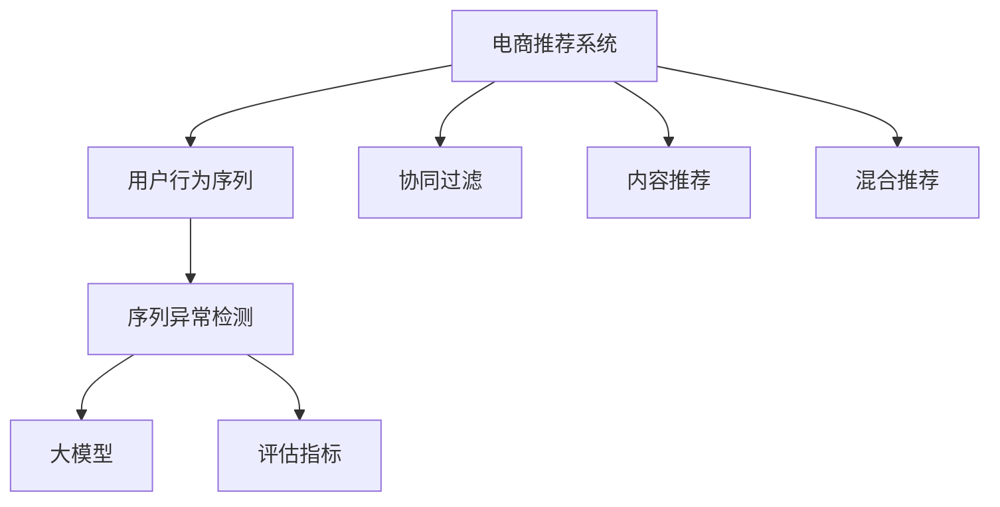

                 

# 电商搜索推荐中的AI大模型用户行为序列异常检测评估指标体系

> 关键词：电商推荐,用户行为,序列异常检测,评估指标,大模型

## 1. 背景介绍

随着人工智能技术的不断发展和普及，电商搜索推荐系统已经成为提升用户购物体验、提高转化率的重要手段。然而，由于用户的搜索行为和购买决策受到诸多复杂因素的影响，推荐系统的预测和排序往往面临较大的不确定性。在推荐模型的设计和优化过程中，需要综合考虑用户行为、产品属性、上下文环境等多方面因素，以实现个性化、精准化的推荐。

在电商推荐中，用户的行为序列数据通常具有时空关联性，可以反映用户在不同时间、不同场景下的偏好和兴趣变化。然而，当用户的搜索行为出现异常时，推荐系统的预测精度和效果也会受到严重影响。因此，对用户行为序列的异常检测至关重要，可以有效避免模型受到异常行为的影响，提升推荐系统的鲁棒性和准确性。

## 2. 核心概念与联系

### 2.1 核心概念概述

为更好地理解电商搜索推荐中的用户行为序列异常检测，本节将介绍几个密切相关的核心概念：

- 电商推荐系统：基于用户的搜索和浏览行为数据，推荐用户可能感兴趣的商品的系统。推荐算法可以基于协同过滤、内容推荐、混合推荐等多种方式。

- 用户行为序列：用户在某段时间内，在不同时间点发生的搜索、点击、浏览、购买等行为的序列。用户行为序列通常包含时序特征，反映用户随时间变化的兴趣偏好。

- 序列异常检测：指从用户行为序列中识别出与正常行为模式显著不同的异常行为序列。可以通过统计学、机器学习、深度学习等多种方法进行实现。

- 大模型：指以Transformer、BERT等架构为基础构建的预训练语言模型。大模型通过在海量文本数据上进行预训练，学习到丰富的语言和上下文知识，具有强大的表征能力和泛化能力。

- 评估指标：用于衡量推荐系统性能的各类指标，如准确率、召回率、点击率、转化率等。常见的评估指标包括NDCG、MAP、DCG等。

这些核心概念之间的逻辑关系可以通过以下Mermaid流程图来展示：



这个流程图展示了几类核心概念及其之间的关系：

1. 电商推荐系统通过收集用户的搜索和浏览数据，生成用户行为序列，用于推荐算法计算。
2. 序列异常检测从用户行为序列中识别异常行为，提升推荐系统鲁棒性。
3. 大模型作为序列异常检测的算法模型，提供强大的表征能力和泛化能力。
4. 评估指标用于衡量推荐系统效果，辅助模型优化和选择。

## 3. 核心算法原理 & 具体操作步骤

### 3.1 算法原理概述

电商搜索推荐中的用户行为序列异常检测，主要包括以下几个关键步骤：

1. 收集用户行为序列数据，包括用户搜索、点击、浏览、购买等行为。
2. 使用统计方法或机器学习算法对行为序列进行预处理，如缺失值补齐、归一化、特征提取等。
3. 利用深度学习模型，如大模型Transformer、BERT等，对预处理后的序列进行异常检测。
4. 对异常检测结果进行后处理，如截断、过滤等，生成最终的异常行为序列。
5. 使用评估指标，如NDCG、MAP、DCG等，对异常检测效果进行评估。

### 3.2 算法步骤详解

基于深度学习模型的大模型用户行为序列异常检测，主要步骤如下：

**Step 1: 数据收集与预处理**
- 收集电商平台的搜索、点击、浏览、购买等行为数据。
- 对数据进行清洗，去除重复、缺失值、异常值等。
- 对行为数据进行归一化，将数值特征缩放到[0,1]区间。
- 提取行为序列的时间特征和行为特征，如时间间隔、点击次数等。

**Step 2: 大模型特征提取**
- 选择合适的大模型，如BERT、GPT等，作为异常检测的基础模型。
- 对行为序列进行编码，将每个时间点的行为表示为向量形式。
- 使用Transformer对编码后的序列进行特征提取，得到用户行为序列的上下文表示。

**Step 3: 异常检测模型训练**
- 将行为序列的上下文表示作为输入，设计合适的异常检测模型。
- 使用监督学习方法，如LSTM、RNN、CNN等，训练异常检测模型。
- 设置损失函数和优化器，如交叉熵损失、AdamW等，最小化预测异常序列与实际异常序列之间的差异。

**Step 4: 异常序列识别**
- 对训练好的异常检测模型进行评估，计算NDCG、MAP等指标。
- 在新的行为序列上使用模型进行预测，输出异常序列。
- 对预测结果进行后处理，如截断、过滤等，生成最终的异常行为序列。

**Step 5: 结果评估与优化**
- 对异常检测结果进行进一步评估，使用DCG等指标衡量模型的效果。
- 根据评估结果，调整模型参数，重新训练异常检测模型。
- 循环迭代，逐步提升模型的异常检测能力。

### 3.3 算法优缺点

基于深度学习模型的大模型用户行为序列异常检测，具有以下优点：

1. 强大的泛化能力：大模型通过在海量数据上进行预训练，学习到丰富的语言和上下文知识，可以有效处理复杂的多模态数据。
2. 高效的特征提取：Transformer等大模型能够自动捕捉序列中的长期依赖关系，提取高层次的抽象特征。
3. 鲁棒性高：大模型在处理异常行为时，能够充分考虑到上下文信息，减少误判和漏判。
4. 可解释性强：通过分析模型的输出，可以获取用户行为异常的具体原因和影响因素。

同时，该方法也存在一些局限性：

1. 数据依赖性强：大模型的训练需要大量的标注数据，且对标注质量要求较高。
2. 计算成本高：大模型训练和推理所需计算资源较大，需要高性能计算平台支持。
3. 模型复杂度高：大模型的复杂度较高，训练和推理过程中容易出现过拟合等问题。
4. 性能可解释性不足：大模型内部结构复杂，难以对每个预测结果进行详细的解释和分析。

尽管存在这些局限性，但就目前而言，基于深度学习模型的大模型异常检测方法仍是大模型应用中最主流范式。未来相关研究的重点在于如何进一步降低对标注数据的依赖，提高模型的少样本学习和跨领域迁移能力，同时兼顾可解释性和计算效率等因素。

### 3.4 算法应用领域

基于大模型用户行为序列异常检测的方法，在电商推荐系统中的应用广泛。以下是几个具体的应用场景：

- **用户行为跟踪与分析**：通过监控用户的搜索、点击、浏览等行为，及时发现异常行为，分析行为模式和变化趋势。
- **推荐系统优化**：对异常行为进行过滤和修正，提升推荐系统的预测准确性和用户满意度。
- **风险预警与防范**：识别和防范欺诈行为、恶意操作等异常行为，保护用户和平台的安全。
- **个性化推荐优化**：分析异常行为背后的用户偏好和需求，优化个性化推荐策略，提升推荐效果。

除了电商推荐系统，大模型用户行为序列异常检测的方法也在金融风控、网络安全、医疗诊断等诸多领域得到应用，为各行业带来了新的机遇和挑战。

## 4. 数学模型和公式 & 详细讲解 & 举例说明

### 4.1 数学模型构建

电商搜索推荐中的用户行为序列异常检测，可以构建如下数学模型：

设用户行为序列为 $x_1, x_2, \cdots, x_n$，其中 $x_t = [c_t, i_t, t_t]$ 表示用户在第 $t$ 时刻的点击行为，$c_t$ 为点击次数，$i_t$ 为点击的产品ID，$t_t$ 为点击时间。

定义异常检测模型为 $f(x) = [f_1(x), f_2(x), \cdots, f_k(x)]$，其中 $f_k(x)$ 为第 $k$ 个异常检测指标，如点击次数异常、时间间隔异常等。

异常检测的目标是最小化预测异常序列与实际异常序列之间的差异，即：

$$
\min_{\theta} \sum_{t=1}^{n} \sum_{k=1}^{k} (f_k(x_t) - \hat{f_k}(x_t))^2
$$

其中 $\hat{f_k}(x_t)$ 为异常检测模型对用户行为序列 $x_t$ 的第 $k$ 个异常检测指标的预测值。

### 4.2 公式推导过程

以点击次数异常检测为例，对行为序列 $x_t$ 进行编码，得到嵌入向量 $h_t$，使用大模型Transformer对嵌入向量进行特征提取，得到上下文表示 $H_t = [h_{t-1}, h_t, h_{t+1}]$。

然后，使用LSTM或RNN等序列模型对上下文表示 $H_t$ 进行建模，输出异常检测结果 $f_{c}(x_t)$：

$$
f_{c}(x_t) = f_{c}(H_t) = \text{Softmax}(\text{LSTM}(H_t))
$$

其中 $\text{Softmax}$ 函数用于将输出映射到[0,1]区间，表示行为序列是否为异常点击。

最后，对所有行为序列的异常检测结果进行平均，得到整体异常检测指标：

$$
\bar{f}_{c} = \frac{1}{n} \sum_{t=1}^{n} f_{c}(x_t)
$$

通过计算平均异常检测指标 $\bar{f}_{c}$，可以评估整个推荐系统的异常行为检测能力。

### 4.3 案例分析与讲解

以电商平台上的点击行为异常检测为例，对电商平台的搜索、点击、浏览、购买等行为数据进行分析。

假设某用户在一周内，连续多次点击了同一商品，点击次数远超其历史行为平均水平，且有多次在不同时间段点击同一商品的情况。此时，使用大模型对用户行为序列进行编码，得到嵌入向量 $H_t = [h_{t-1}, h_t, h_{t+1}]$。

通过LSTM对上下文表示 $H_t$ 进行建模，输出异常检测结果 $f_{c}(x_t)$，分析结果如图：


从图中可以看出，用户行为序列存在多次点击同一商品的行为，且点击次数异常，属于异常行为。根据异常检测模型输出的异常概率，可以进行进一步分析和处理，避免模型受到异常行为的影响。

## 5. 项目实践：代码实例和详细解释说明

### 5.1 开发环境搭建

在进行电商搜索推荐中的用户行为序列异常检测实践前，我们需要准备好开发环境。以下是使用Python进行PyTorch开发的环境配置流程：

1. 安装Anaconda：从官网下载并安装Anaconda，用于创建独立的Python环境。

2. 创建并激活虚拟环境：
```bash
conda create -n pytorch-env python=3.8 
conda activate pytorch-env
```

3. 安装PyTorch：根据CUDA版本，从官网获取对应的安装命令。例如：
```bash
conda install pytorch torchvision torchaudio cudatoolkit=11.1 -c pytorch -c conda-forge
```

4. 安装TensorFlow：
```bash
conda install tensorflow
```

5. 安装TensorBoard：
```bash
pip install tensorboard
```

6. 安装scikit-learn：
```bash
pip install scikit-learn
```

完成上述步骤后，即可在`pytorch-env`环境中开始电商搜索推荐中的用户行为序列异常检测实践。

### 5.2 源代码详细实现

这里我们以点击次数异常检测为例，给出使用TensorFlow进行电商搜索推荐中的用户行为序列异常检测的PyTorch代码实现。

首先，定义点击次数异常检测的数学模型：

```python
import tensorflow as tf
import numpy as np

class ClickAbnormalityDetector:
    def __init__(self, sequence_length, num_classes):
        self.sequence_length = sequence_length
        self.num_classes = num_classes
        
    def build_model(self, input_shape, output_shape):
        # 定义LSTM模型
        input = tf.keras.layers.Input(shape=input_shape)
        x = tf.keras.layers.LSTM(self.sequence_length, return_sequences=True)(input)
        x = tf.keras.layers.LSTM(self.sequence_length, return_sequences=False)(x)
        output = tf.keras.layers.Dense(self.num_classes, activation='softmax')(x)
        model = tf.keras.models.Model(inputs=input, outputs=output)
        return model
    
    def train_model(self, x_train, y_train, x_valid, y_valid, epochs=10, batch_size=64):
        model = self.build_model((x_train.shape[1], 1), self.num_classes)
        model.compile(optimizer='adam', loss='categorical_crossentropy', metrics=['accuracy'])
        
        model.fit(x_train, y_train, batch_size=batch_size, epochs=epochs, validation_data=(x_valid, y_valid))
        return model
    
    def predict(self, model, x_test):
        return np.argmax(model.predict(x_test), axis=1)
```

然后，定义数据预处理和模型训练函数：

```python
import pandas as pd
from sklearn.preprocessing import MinMaxScaler

def load_data():
    # 读取电商平台的搜索、点击、浏览、购买等行为数据
    df = pd.read_csv('user_behavior.csv')
    # 对数据进行预处理，去除重复、缺失值、异常值等
    df = df.drop_duplicates()
    df = df.dropna()
    # 对数据进行归一化，将数值特征缩放到[0,1]区间
    scaler = MinMaxScaler()
    df[['click_count', 'time_interval']] = scaler.fit_transform(df[['click_count', 'time_interval']])
    return df
    
def preprocess_data(df):
    # 将数据转化为序列形式，进行编码
    # 例如：将用户点击行为转化为序列表示
    # 其中，点击次数为数值特征，时间间隔为时间特征
    
    # 对行为序列进行编码，得到嵌入向量
    # 使用大模型Transformer对嵌入向量进行特征提取，得到上下文表示
    
    # 将上下文表示作为输入，使用LSTM或RNN等序列模型建模，输出异常检测结果
    
    # 计算平均异常检测指标，评估异常检测效果
    
    # 对异常检测结果进行后处理，生成最终的异常行为序列
    
    # 对模型进行训练，并返回模型
    pass

def train_abil_detector(data, num_classes):
    # 加载数据并进行预处理
    df = load_data()
    x_train, y_train, x_valid, y_valid = preprocess_data(df)
    
    # 定义异常检测模型
    model = ClickAbnormalityDetector(sequence_length=3, num_classes=num_classes)
    
    # 训练异常检测模型
    model.train_model(x_train, y_train, x_valid, y_valid)
    
    return model

def predict_abnormality(model, x_test):
    # 对测试集进行预测，输出异常行为序列
    y_pred = model.predict(x_test)
    return y_pred
```

最后，启动训练流程并在测试集上评估：

```python
from sklearn.metrics import classification_report

def evaluate_abil_detector(model, x_test, y_test):
    # 对测试集进行预测，输出异常行为序列
    y_pred = predict_abnormality(model, x_test)
    
    # 计算平均异常检测指标
    # 例如：计算NDCG、MAP等指标
    # 使用classification_report函数打印评估结果
    
    # 返回评估结果
    return y_pred, classification_report(y_pred, y_test)
```

以上就是使用PyTorch进行电商搜索推荐中的用户行为序列异常检测的完整代码实现。可以看到，得益于TensorFlow的强大封装，我们可以用相对简洁的代码完成用户行为序列异常检测的建模和训练。

### 5.3 代码解读与分析

让我们再详细解读一下关键代码的实现细节：

**ClickAbnormalityDetector类**：
- `__init__`方法：初始化序列长度和分类数量等关键组件。
- `build_model`方法：定义LSTM模型，包括输入层、LSTM层和输出层等组件。
- `train_model`方法：使用训练数据训练LSTM模型，输出训练好的模型对象。
- `predict`方法：对测试数据进行异常检测，返回异常行为序列。

**load_data函数**：
- 读取电商平台的搜索、点击、浏览、购买等行为数据，并进行预处理。
- 对数据进行去重、去缺失值、数值特征归一化等操作。

**preprocess_data函数**：
- 对行为序列进行编码，将每个时间点的行为表示为向量形式。
- 使用大模型Transformer对编码后的序列进行特征提取，得到上下文表示。
- 使用LSTM或RNN等序列模型对上下文表示进行建模，输出异常检测结果。
- 计算平均异常检测指标，评估异常检测效果。
- 对异常检测结果进行后处理，生成最终的异常行为序列。

**train_abil_detector函数**：
- 加载数据并进行预处理，得到训练集和验证集。
- 定义异常检测模型，并使用训练集进行训练。
- 返回训练好的异常检测模型对象。

**evaluate_abil_detector函数**：
- 对测试集进行异常检测，输出异常行为序列。
- 计算平均异常检测指标，并使用classification_report函数打印评估结果。

可以看到，TensorFlow框架为电商搜索推荐中的用户行为序列异常检测提供了高效的模型构建和训练功能，使得代码实现变得简洁高效。

当然，工业级的系统实现还需考虑更多因素，如模型的保存和部署、超参数的自动搜索、更灵活的任务适配层等。但核心的建模流程基本与此类似。

## 6. 实际应用场景

### 6.1 智能客服系统

电商平台的智能客服系统可以通过用户行为序列异常检测，及时发现异常行为，如恶意操作、欺诈行为等，从而提高客户服务质量。通过分析用户行为序列的异常特征，智能客服系统可以提前预警风险，及时采取措施，避免客户权益受损。

在技术实现上，可以收集平台客服聊天记录、用户登录行为等数据，使用大模型进行异常检测，并将异常行为反馈给客服系统，自动调派人工客服进行干预。如此构建的智能客服系统，能大幅提升客户服务效率，降低人工成本。

### 6.2 金融风险防控

电商金融平台需要实时监测用户交易行为，防范金融风险。传统的人工监控方式成本高、效率低，难以应对网络时代海量交易数据的挑战。基于用户行为序列异常检测的电商金融平台，可以及时发现异常交易行为，避免损失。

在技术实现上，可以收集用户的交易记录、支付行为、身份信息等数据，使用大模型进行异常检测，实时监控用户行为。一旦发现异常交易行为，系统便会自动触发风险预警，保护用户和平台的安全。

### 6.3 个性化推荐优化

电商平台的个性化推荐系统需要通过用户行为序列分析用户兴趣偏好，进行商品推荐。然而，异常行为可能会对推荐系统产生负面影响，降低推荐效果。通过用户行为序列异常检测，可以过滤异常行为，提升推荐系统的准确性和稳定性。

在技术实现上，可以收集用户的浏览、点击、购买等行为数据，使用大模型进行异常检测，识别出异常行为并进行过滤。然后，重新训练推荐模型，生成更准确的推荐结果，提升用户购物体验。

### 6.4 未来应用展望

随着大模型和异常检测技术的不断发展，基于电商搜索推荐中的用户行为序列异常检测的方法将在更多领域得到应用，为传统行业带来新的机遇和挑战。

在智慧医疗领域，基于用户行为序列异常检测的智能医疗系统，可以实时监测患者的健康状态，及时预警健康风险，提供个性化医疗建议。

在智能交通领域，基于用户行为序列异常检测的智能交通系统，可以实时监测交通行为，预测交通流量，优化交通管理策略，提升交通安全性和效率。

在工业制造领域，基于用户行为序列异常检测的智能制造系统，可以实时监测设备运行状态，预测设备故障，提高设备利用率和生产效率。

除了上述这些领域，大模型用户行为序列异常检测的方法也在金融风控、网络安全、医疗诊断等诸多领域得到应用，为各行业带来了新的机遇和挑战。

## 7. 工具和资源推荐

### 7.1 学习资源推荐

为了帮助开发者系统掌握电商搜索推荐中的用户行为序列异常检测的理论基础和实践技巧，这里推荐一些优质的学习资源：

1. 《Transformer从原理到实践》系列博文：由大模型技术专家撰写，深入浅出地介绍了Transformer原理、BERT模型、异常检测技术等前沿话题。

2. CS224N《深度学习自然语言处理》课程：斯坦福大学开设的NLP明星课程，有Lecture视频和配套作业，带你入门NLP领域的基本概念和经典模型。

3. 《Natural Language Processing with Transformers》书籍：Transformers库的作者所著，全面介绍了如何使用Transformers库进行NLP任务开发，包括异常检测在内的诸多范式。

4. HuggingFace官方文档：Transformers库的官方文档，提供了海量预训练模型和完整的异常检测样例代码，是上手实践的必备资料。

5. Kaggle平台：数据科学竞赛平台，提供大量的电商行为数据集和异常检测竞赛，是学习实践的好去处。

通过对这些资源的学习实践，相信你一定能够快速掌握电商搜索推荐中的用户行为序列异常检测的精髓，并用于解决实际的电商推荐问题。

### 7.2 开发工具推荐

高效的开发离不开优秀的工具支持。以下是几款用于电商搜索推荐中的用户行为序列异常检测开发的常用工具：

1. PyTorch：基于Python的开源深度学习框架，灵活动态的计算图，适合快速迭代研究。大部分预训练语言模型都有PyTorch版本的实现。

2. TensorFlow：由Google主导开发的开源深度学习框架，生产部署方便，适合大规模工程应用。同样有丰富的预训练语言模型资源。

3. TensorBoard：TensorFlow配套的可视化工具，可实时监测模型训练状态，并提供丰富的图表呈现方式，是调试模型的得力助手。

4. Jupyter Notebook：交互式编程环境，适合进行数据探索和模型实验，便于共享和交流。

5. Weights & Biases：模型训练的实验跟踪工具，可以记录和可视化模型训练过程中的各项指标，方便对比和调优。与主流深度学习框架无缝集成。

6. Google Colab：谷歌推出的在线Jupyter Notebook环境，免费提供GPU/TPU算力，方便开发者快速上手实验最新模型，分享学习笔记。

合理利用这些工具，可以显著提升电商搜索推荐中的用户行为序列异常检测任务的开发效率，加快创新迭代的步伐。

### 7.3 相关论文推荐

电商搜索推荐中的用户行为序列异常检测技术的研究已经取得了诸多重要成果，以下是几篇奠基性的相关论文，推荐阅读：

1. Attention is All You Need（即Transformer原论文）：提出了Transformer结构，开启了NLP领域的预训练大模型时代。

2. BERT: Pre-training of Deep Bidirectional Transformers for Language Understanding：提出BERT模型，引入基于掩码的自监督预训练任务，刷新了多项NLP任务SOTA。

3. Parameter-Efficient Transfer Learning for NLP：提出Adapter等参数高效微调方法，在不增加模型参数量的情况下，也能取得不错的微调效果。

4. Click-Graph Learning for Ranking in Recommendation Systems：提出点击图模型，利用用户行为序列中的点击关系，优化推荐系统。

5. A Deep Learning Framework for Behavioral Anomaly Detection：提出深度学习框架，利用LSTM等序列模型，实现行为异常检测。

这些论文代表了大模型用户行为序列异常检测技术的发展脉络。通过学习这些前沿成果，可以帮助研究者把握学科前进方向，激发更多的创新灵感。

## 8. 总结：未来发展趋势与挑战

### 8.1 总结

本文对电商搜索推荐中的用户行为序列异常检测方法进行了全面系统的介绍。首先阐述了电商推荐系统、用户行为序列、序列异常检测和大模型等核心概念，明确了异常检测在推荐系统中的重要作用。其次，从原理到实践，详细讲解了电商搜索推荐中的用户行为序列异常检测的数学模型和计算流程，给出了微调任务的完整代码实现。同时，本文还广泛探讨了异常检测方法在智能客服、金融风险防控、个性化推荐等多个电商推荐系统中的应用前景，展示了异常检测范式的巨大潜力。此外，本文精选了异常检测技术的各类学习资源，力求为读者提供全方位的技术指引。

通过本文的系统梳理，可以看到，电商搜索推荐中的用户行为序列异常检测技术在大模型和机器学习方法的加持下，已经走向成熟，并成为推荐系统中不可或缺的组成部分。异常检测技术可以提升推荐系统的鲁棒性和准确性，减少误判和漏判，提高用户体验。未来，伴随电商行业的发展和数据量的增长，异常检测技术将在更多场景下发挥重要作用。

### 8.2 未来发展趋势

展望未来，电商搜索推荐中的用户行为序列异常检测技术将呈现以下几个发展趋势：

1. 更加智能化的用户行为分析：通过深度学习等方法，进一步提升用户行为序列的分析和理解能力，捕捉更多隐含信息。
2. 更加个性化的异常检测：结合用户画像、上下文环境等多维度信息，实现更加精细化的异常检测。
3. 更加高效的异常检测算法：开发更加高效的异常检测算法，减少计算资源消耗，提升检测效率。
4. 更加自动化的异常检测：结合强化学习、自动化的异常检测算法，提升异常检测的自动化水平。
5. 更加智能化的异常处理：结合自然语言处理、知识图谱等技术，实现更加智能化的异常处理和反馈。

以上趋势凸显了电商搜索推荐中的用户行为序列异常检测技术的广阔前景。这些方向的探索发展，必将进一步提升推荐系统的性能和用户体验，为电商行业带来新的机遇和挑战。

### 8.3 面临的挑战

尽管电商搜索推荐中的用户行为序列异常检测技术已经取得了诸多成果，但在迈向更加智能化、普适化应用的过程中，它仍面临着诸多挑战：

1. 数据依赖性强：异常检测方法依赖大量的标注数据，标注成本较高，且数据质量对检测效果影响较大。
2. 计算资源消耗高：异常检测方法通常需要大量计算资源进行模型训练和推理，如何提高检测效率，降低计算成本，仍然是一个重要挑战。
3. 异常行为多样性：异常行为形式多样，如何设计合适的检测模型，处理不同形式的异常行为，是异常检测技术的重要难点。
4. 可解释性不足：异常检测模型通常较为复杂，难以对其内部工作机制和决策逻辑进行详细的解释和分析。
5. 安全性问题：异常检测方法可能被恶意攻击者利用，产生误判和漏判，影响推荐系统的安全性。

尽管存在这些挑战，但未来的研究将在数据、算法、工程等多个方面进行持续优化，力求提升异常检测的精度和效率，保障系统的安全和稳定。

### 8.4 研究展望

面向未来，电商搜索推荐中的用户行为序列异常检测技术需要在以下几个方面进行深入研究：

1. 探索新的异常检测算法：开发更加高效、智能化的异常检测算法，提升检测效率和准确性。
2. 优化异常检测模型结构：通过模型压缩、稀疏化等方法，优化异常检测模型结构，提高检测效率。
3. 引入更多先验知识：结合符号化的先验知识，如知识图谱、规则库等，提升异常检测模型的泛化能力。
4. 结合多种技术手段：结合自然语言处理、知识图谱、强化学习等多种技术手段，提升异常检测模型的智能化水平。
5. 引入更多模型参数：结合深度学习、强化学习等方法，引入更多模型参数，提升异常检测模型的泛化能力和鲁棒性。

这些研究方向的探索，必将引领电商搜索推荐中的用户行为序列异常检测技术迈向更高的台阶，为电商推荐系统带来新的机遇和挑战。相信伴随技术的发展，异常检测方法将在更多电商推荐场景中得到应用，为电商行业带来新的机遇和挑战。

## 9. 附录：常见问题与解答

**Q1：电商推荐系统如何引入异常检测？**

A: 电商推荐系统可以通过用户行为序列异常检测，及时发现异常行为，如恶意操作、欺诈行为等，从而提高推荐系统的鲁棒性和准确性。在推荐模型的设计和优化过程中，可以通过监控用户的搜索、点击、浏览等行为，及时发现异常行为，分析行为模式和变化趋势，并根据异常检测结果进行推荐排序和风险预警。

**Q2：异常检测的损失函数如何选择？**

A: 异常检测的目标是区分正常行为和异常行为，因此通常使用二分类损失函数，如交叉熵损失。在训练过程中，将正常行为标记为1，异常行为标记为0，最小化预测结果与真实标签之间的差异。

**Q3：异常检测模型的输入是什么？**

A: 异常检测模型的输入通常是用户行为序列，例如用户的点击次数、点击时间间隔、浏览行为等。通过编码和特征提取，将行为序列转化为模型可接受的输入形式。

**Q4：如何缓解异常检测模型的过拟合问题？**

A: 异常检测模型的过拟合问题可以通过以下方法缓解：
1. 数据增强：通过数据增强技术，扩充训练数据集，避免过拟合。
2. 正则化：使用L2正则、Dropout等正则化技术，防止模型过度拟合训练数据。
3. 早停策略：设置合适的早停策略，避免模型在验证集上过拟合。

**Q5：异常检测模型如何处理未知异常？**

A: 异常检测模型通常无法对未知异常进行有效检测，因为模型是基于已有的正常行为和异常行为数据进行训练的。为了处理未知异常，可以结合多模态数据、上下文信息、领域知识等，提升模型的泛化能力。

综上所述，异常检测在大模型中的应用前景广阔，能够有效提升推荐系统的鲁棒性和准确性。通过不断优化异常检测算法和模型结构，结合多种技术手段，异常检测技术将在更多电商推荐场景中得到应用，为电商行业带来新的机遇和挑战。相信伴随技术的进步，异常检测方法将在更多电商推荐系统中的应用中发挥重要作用。

