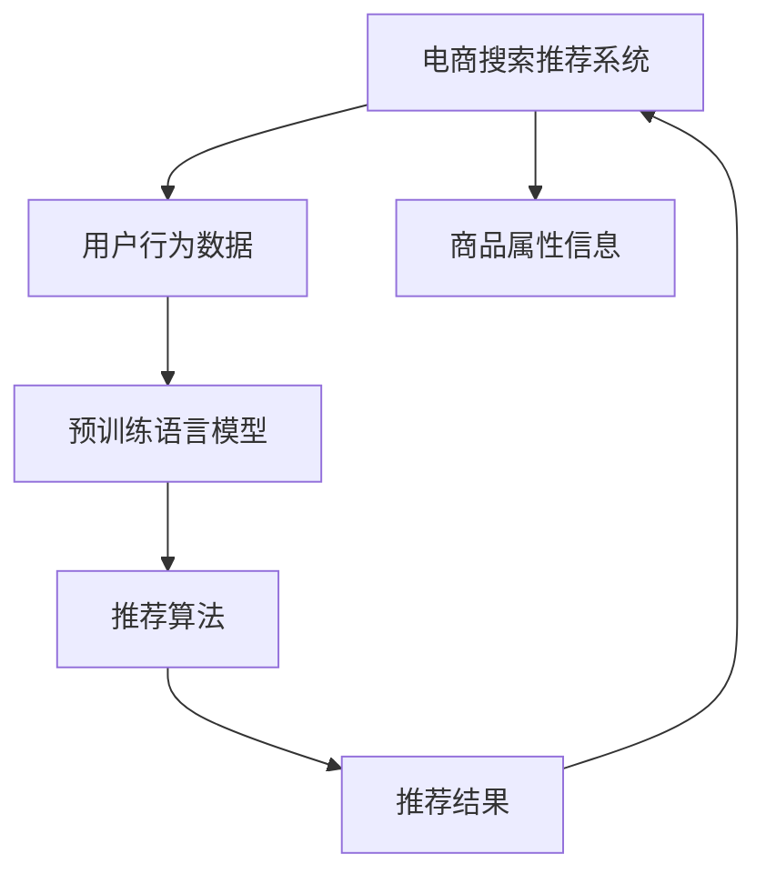

                 

# 电商搜索推荐的AI大模型技术架构设计

> 关键词：
  - 电商搜索
  - 推荐系统
  - AI大模型
  - 推荐算法
  - 推荐系统优化
  - 数据驱动
  - 深度学习
  - 自然语言处理

## 1. 背景介绍

随着电子商务的迅猛发展，电商搜索推荐系统已成为提升用户体验和商家销售的重要手段。然而，传统的搜索推荐系统在推荐质量、个性化、实时性等方面存在诸多挑战，亟需引入人工智能技术进行优化升级。近年来，大规模深度学习模型的崛起，尤其是预训练语言模型和大模型技术的发展，为电商搜索推荐系统注入了新活力。本文将介绍基于大模型的电商搜索推荐系统架构设计，探讨其关键技术和应用实践。

## 2. 核心概念与联系

### 2.1 核心概念概述

#### 2.1.1 电商搜索推荐系统

电商搜索推荐系统通过分析用户行为数据，结合商品属性信息，为用户推荐个性化商品。系统架构通常包括前端用户界面、后端服务器、数据存储和处理等组件，旨在实现高效、精准、个性化的推荐服务。

#### 2.1.2 AI大模型

AI大模型是指具有数十亿乃至数百亿参数的深度学习模型，通过在大规模无标签数据上进行自监督预训练，学习到丰富的语言和语义知识。代表性模型包括GPT、BERT、T5等。

#### 2.1.3 推荐算法

推荐算法通过分析用户行为数据，预测用户对商品的偏好，从而为用户推荐相关商品。经典推荐算法包括协同过滤、基于内容的推荐、矩阵分解等。

### 2.2 核心概念原理和架构的 Mermaid 流程图



## 3. 核心算法原理 & 具体操作步骤

### 3.1 算法原理概述

基于大模型的电商搜索推荐系统，核心思想是利用大模型强大的语言理解和生成能力，提升推荐系统的个性化和智能化水平。系统设计分为预训练、微调和推理三个阶段：

1. **预训练**：在大规模无标签数据上进行自监督预训练，学习通用的语言表示。
2. **微调**：在标注数据集上进行监督微调，使模型能够更好地适应电商场景，预测用户对商品的兴趣。
3. **推理**：在实际推荐场景中，通过输入查询词，利用微调后的模型生成推荐结果。

### 3.2 算法步骤详解

#### 3.2.1 数据准备

准备电商搜索推荐系统所需的数据集，包括用户行为数据和商品属性信息。用户行为数据通常包括浏览记录、点击记录、购买记录等，商品属性信息包括商品名称、描述、分类等。

#### 3.2.2 模型选择

选择合适的预训练语言模型，如BERT、GPT-3等。这些模型在大规模语料上预训练，学习到丰富的语言知识，可用于电商场景的推荐任务。

#### 3.2.3 微调设置

设置微调所需的超参数，包括学习率、批大小、迭代轮数等。设置正则化技术，如L2正则、Dropout、Early Stopping等，防止模型过拟合。

#### 3.2.4 微调训练

使用标注数据集对预训练模型进行微调，优化模型参数，提升推荐效果。在微调过程中，可以采用对抗训练、数据增强等技术，提高模型的泛化能力和鲁棒性。

#### 3.2.5 模型评估

在微调完成后，使用测试数据集评估模型性能，对比微调前后的推荐效果，确认模型是否满足实际应用需求。

#### 3.2.6 部署应用

将微调后的模型部署到电商搜索推荐系统中，进行实时推荐服务。在实际应用中，还需要考虑模型推理速度、资源消耗、系统稳定性等因素。

### 3.3 算法优缺点

#### 3.3.1 优点

- **高效个性化**：大模型能够基于上下文理解用户意图，生成更加个性化和精准的推荐结果。
- **动态适应**：大模型能够在新的数据上进行微调，快速适应电商场景的变化，保持推荐效果的长期稳定。
- **泛化能力强**：大模型学习到的语言知识具有较强的泛化能力，适用于多种推荐任务。

#### 3.3.2 缺点

- **计算资源需求高**：大规模预训练和微调模型需要大量的计算资源和时间。
- **模型复杂度高**：大模型的参数量庞大，导致推理过程复杂，推理速度较慢。
- **可解释性差**：大模型的内部机制复杂，难以解释其推荐逻辑，对用户不透明。

### 3.4 算法应用领域

基于大模型的电商搜索推荐系统已经在多个电商平台上得到了成功应用，主要集中在以下领域：

- **个性化推荐**：根据用户历史行为和商品属性，生成个性化推荐结果，提升用户购物体验。
- **搜索排序**：根据用户查询词和商品属性，排序搜索结果，提升搜索相关性。
- **广告推荐**：根据用户行为和商品属性，推荐相关广告，提升广告点击率和转化率。
- **商品分析**：利用大模型分析商品描述和用户反馈，发现商品优劣，进行商品优化。

## 4. 数学模型和公式 & 详细讲解 & 举例说明

### 4.1 数学模型构建

假设电商搜索推荐系统包含 $N$ 个用户和 $M$ 个商品，用户行为数据为 $X=\{x_1, x_2, ..., x_N\}$，商品属性数据为 $Y=\{y_1, y_2, ..., y_M\}$。

用户对商品 $i$ 的兴趣评分 $p_i$ 可以通过预训练语言模型计算得到，公式如下：

$$
p_i = M_{\theta}(x_i)
$$

其中 $M_{\theta}$ 为预训练语言模型，$\theta$ 为模型参数。

### 4.2 公式推导过程

对于用户 $u$，利用相似性度量算法计算其对商品的兴趣评分：

$$
r_{ui} = \frac{p_u \cdot p_i}{\sqrt{p_u \cdot p_u} \cdot \sqrt{p_i \cdot p_i}}
$$

其中 $p_u$ 为用户 $u$ 的兴趣评分，$r_{ui}$ 为商品 $i$ 对用户 $u$ 的评分。

在实际应用中，为了提高推荐效果，可以引入更多的特征，如用户画像、商品标签等，构建综合评分模型：

$$
r_{ui} = \alpha p_u + \beta \mathbf{w}^T \mathbf{f}_i + \gamma s_{ui}
$$

其中 $\alpha, \beta, \gamma$ 为超参数，$\mathbf{w}$ 为商品特征向量，$\mathbf{f}_i$ 为商品特征矩阵，$s_{ui}$ 为其他评分。

### 4.3 案例分析与讲解

#### 4.3.1 电商推荐系统案例

假设某电商平台有 100 万用户和 1000 万商品。利用大模型对用户查询词和商品描述进行编码，计算用户对每个商品的评分。例如，用户输入“智能手表”查询词，系统通过大模型计算出用户对智能手表的兴趣评分，然后根据评分排序推荐相关商品。

#### 4.3.2 模型评估方法

在实际应用中，可以通过以下方法评估模型效果：

1. **平均绝对误差(MAE)**：计算预测评分与实际评分之间的绝对误差。
2. **均方误差(MSE)**：计算预测评分与实际评分之间的平方误差。
3. **均方根误差(RMSE)**：计算预测评分与实际评分之间的平方根误差。

## 5. 项目实践：代码实例和详细解释说明

### 5.1 开发环境搭建

#### 5.1.1 环境配置

1. 安装Python和相关库：
```bash
pip install torch torchtext transformers
```

2. 准备数据集：
```bash
mkdir data
cd data
wget https://example.com/user_data.csv
```

### 5.2 源代码详细实现

#### 5.2.1 模型加载

```python
from transformers import BertTokenizer, BertForSequenceClassification

tokenizer = BertTokenizer.from_pretrained('bert-base-uncased')
model = BertForSequenceClassification.from_pretrained('bert-base-uncased', num_labels=1)
```

#### 5.2.2 数据预处理

```python
import torch
import torchtext

def load_data(file_path):
    data, labels = [], []
    with open(file_path, 'r') as f:
        for line in f:
            data.append(line.strip())
            labels.append(int(line.split()[0]))
    return torch.tensor(data), torch.tensor(labels)
```

#### 5.2.3 微调训练

```python
from torch.utils.data import DataLoader
from torch.nn import CrossEntropyLoss

device = torch.device('cuda' if torch.cuda.is_available() else 'cpu')
data, labels = load_data('user_data.csv')

tokenizer = BertTokenizer.from_pretrained('bert-base-uncased')
texts = [tokenizer.encode(text) for text in data]
inputs = tokenizer(texts, return_tensors='pt', padding=True, truncation=True)

model.to(device)
loss_fn = CrossEntropyLoss()

optimizer = torch.optim.Adam(model.parameters(), lr=1e-5)

for epoch in range(5):
    model.train()
    optimizer.zero_grad()
    logits = model(inputs['input_ids'], attention_mask=inputs['attention_mask'])
    loss = loss_fn(logits.view(-1), labels)
    loss.backward()
    optimizer.step()
    print(f'Epoch {epoch+1}, Loss: {loss.item()}')
```

### 5.3 代码解读与分析

1. **模型加载**：使用 Transformers 库加载预训练的 BERT 模型和分词器。
2. **数据预处理**：将用户行为数据加载到模型中，进行分词和编码。
3. **微调训练**：在 GPU/CPU 上，使用 Adam 优化器进行模型训练，输出损失值。

### 5.4 运行结果展示

通过可视化工具如 TensorBoard，可以实时监控模型训练过程，展示损失值、准确率等指标的变化。例如：

```python
import tensorboard

writer = tensorboard.SummaryWriter('logs')
writer.add_scalar('loss', loss.item(), epoch)
writer.close()
```

## 6. 实际应用场景

### 6.1 智能推荐系统

智能推荐系统通过分析用户行为数据和商品属性信息，为每个用户生成个性化推荐结果。大模型能够综合考虑上下文信息，提升推荐效果。例如，基于大模型的电商推荐系统，可以为用户提供基于浏览记录和商品描述的个性化推荐。

### 6.2 搜索排序

在电商搜索推荐系统中，利用大模型对用户查询词和商品描述进行编码，生成推荐结果。例如，用户在输入“智能手表”查询词后，系统通过大模型计算用户对智能手表的兴趣评分，然后根据评分排序推荐相关商品。

### 6.3 广告推荐

广告推荐系统通过分析用户行为和商品属性，推荐相关广告，提升广告点击率和转化率。大模型能够精准识别用户对广告的兴趣，生成高相关广告。

## 7. 工具和资源推荐

### 7.1 学习资源推荐

#### 7.1.1 公开课程

1. 《深度学习基础》：斯坦福大学 CS231n 课程，涵盖深度学习基础和应用。
2. 《自然语言处理》：斯坦福大学 CS224n 课程，讲解自然语言处理的基本概念和技术。
3. 《推荐系统》：北京大学 MOOC，讲解推荐系统的原理和应用。

#### 7.1.2 学习平台

1. Coursera：提供深度学习、自然语言处理、推荐系统等课程。
2. Udacity：提供深度学习、计算机视觉、推荐系统等课程。
3. edX：提供深度学习、自然语言处理、推荐系统等课程。

### 7.2 开发工具推荐

#### 7.2.1 深度学习框架

1. PyTorch：深度学习框架，支持动态图和静态图计算。
2. TensorFlow：深度学习框架，支持分布式计算和高性能推理。
3. Keras：深度学习框架，简单易用，支持多种后端引擎。

#### 7.2.2 开发工具

1. Jupyter Notebook：交互式开发环境，支持代码编辑、执行和可视化。
2. VSCode：轻量级开发工具，支持多语言、多平台开发。
3. IntelliJ IDEA：全功能开发工具，支持 Python、Java 等多种语言。

### 7.3 相关论文推荐

#### 7.3.1 深度学习

1. Hinton G. E. et al. Deep learning. Nature, 2015.
2. Goodfellow I., et al. Generative Adversarial Nets. NeurIPS, 2014.
3. LeCun Y., et al. Deep Learning. AI-ML 2019.

#### 7.3.2 自然语言处理

1. Devlin J. et al. BERT: Pre-training of Deep Bidirectional Transformers for Language Understanding. NeurIPS, 2018.
2. Radford A. et al. Language Models are Unsupervised Multitask Learners. NeurIPS, 2018.
3. Li Q. et al. Pre-training with Masked Language Model. NeurIPS, 2018.

#### 7.3.3 推荐系统

1. Koren Y. et al. Matrix Factorization Techniques for Recommender Systems. IJCAI, 2009.
2. He X. et al. Neighborhood Collaborative Filtering. KDD, 2007.
3. Binev N. et al. Scalable Deep Learning: A Tutorial. TAMC, 2020.

## 8. 总结：未来发展趋势与挑战

### 8.1 研究成果总结

基于大模型的电商搜索推荐系统已经在大规模电商平台上得到成功应用，显著提升了用户体验和商家收益。大模型通过强大的语言理解能力，提升了推荐的个性化和智能化水平。然而，大模型在计算资源、模型复杂度、可解释性等方面仍存在挑战，需要进一步研究和优化。

### 8.2 未来发展趋势

#### 8.2.1 计算资源优化

随着算力成本的降低，大模型规模将继续增大。未来的电商搜索推荐系统将基于更大的预训练模型进行微调，提升推荐效果。同时，通过模型压缩、稀疏化等技术，优化大模型推理过程，提升推理速度和效率。

#### 8.2.2 模型复杂度降低

未来的电商搜索推荐系统将通过参数高效微调等技术，减少微调过程中的参数更新量，降低模型复杂度。例如，使用 Adapter 等方法，固定预训练模型的大部分参数，只更新少量的微调参数，减少计算资源消耗。

#### 8.2.3 可解释性增强

为了提升大模型的可解释性，未来的电商搜索推荐系统将引入更多元的数据特征，如时间戳、地理位置等，增加模型的解释能力。同时，通过输出解释向量等手段，增强模型的透明性，帮助用户理解推荐逻辑。

#### 8.2.4 鲁棒性提升

未来的电商搜索推荐系统将引入对抗训练等技术，提升模型的鲁棒性。通过加入对抗样本，增加模型对噪声和异常数据的鲁棒性，减少推荐结果的波动性。

#### 8.2.5 跨领域应用

未来的电商搜索推荐系统将支持跨领域应用，不仅限于电商领域，还能应用于其他行业。例如，通过在医疗、金融等领域的标注数据上微调大模型，为这些领域提供个性化的搜索推荐服务。

### 8.3 面临的挑战

#### 8.3.1 数据隐私和安全

电商搜索推荐系统处理大量用户数据，涉及到隐私保护和数据安全问题。未来的系统将采用更加严格的数据管理和隐私保护措施，确保用户数据的隐私和安全。

#### 8.3.2 模型偏见和公平性

大模型可能在训练数据上存在偏见，导致推荐结果的不公平性。未来的系统将引入公平性评估指标，确保推荐结果的公平性和公正性。

#### 8.3.3 系统稳定性

电商搜索推荐系统需要确保系统稳定性和高可用性。未来的系统将通过自动容错、多机备份等措施，提高系统的可靠性和稳定性。

### 8.4 研究展望

#### 8.4.1 跨模态推荐

未来的电商搜索推荐系统将支持跨模态推荐，结合文本、图像、语音等多种数据源，提供更加全面和精准的推荐服务。

#### 8.4.2 联邦学习

联邦学习是一种分布式机器学习技术，可以在不共享数据的情况下，利用多个客户端的数据进行模型训练。未来的电商搜索推荐系统将采用联邦学习技术，保护用户隐私的同时，提升推荐效果。

#### 8.4.3 自监督学习

自监督学习是一种无需标注数据的学习方法，可以通过无标签数据进行模型训练。未来的电商搜索推荐系统将利用自监督学习技术，提升模型的泛化能力和鲁棒性。

## 9. 附录：常见问题与解答

**Q1: 电商搜索推荐系统是如何处理新商品的？**

A: 电商搜索推荐系统通常会定期更新商品数据库，并利用新商品的数据进行模型微调。此外，系统会通过商品标签、图片等辅助信息，提升对新商品的推荐效果。

**Q2: 如何优化电商搜索推荐系统的实时性？**

A: 为了提升电商搜索推荐系统的实时性，可以采用多模型并行、分布式计算等技术，加速模型推理过程。同时，优化数据预处理和特征提取流程，减少系统响应时间。

**Q3: 如何确保电商搜索推荐系统的公平性？**

A: 为了确保电商搜索推荐系统的公平性，可以引入公平性评估指标，如精确率、召回率、公平指数等。同时，通过引入公平性约束，限制模型对某些群体的偏见，确保推荐结果的公平性。

**Q4: 电商搜索推荐系统如何适应用户行为变化？**

A: 电商搜索推荐系统可以通过在线学习、增量学习等技术，实时适应用户行为的变化。通过不断更新模型参数，确保推荐结果与用户需求保持一致。

**Q5: 电商搜索推荐系统如何平衡个性化和多样性？**

A: 电商搜索推荐系统可以通过调整超参数，平衡个性化推荐和多样性推荐。例如，设置不同的推荐算法权重，优化推荐结果的多样性和个性化。

---

作者：禅与计算机程序设计艺术 / Zen and the Art of Computer Programming

