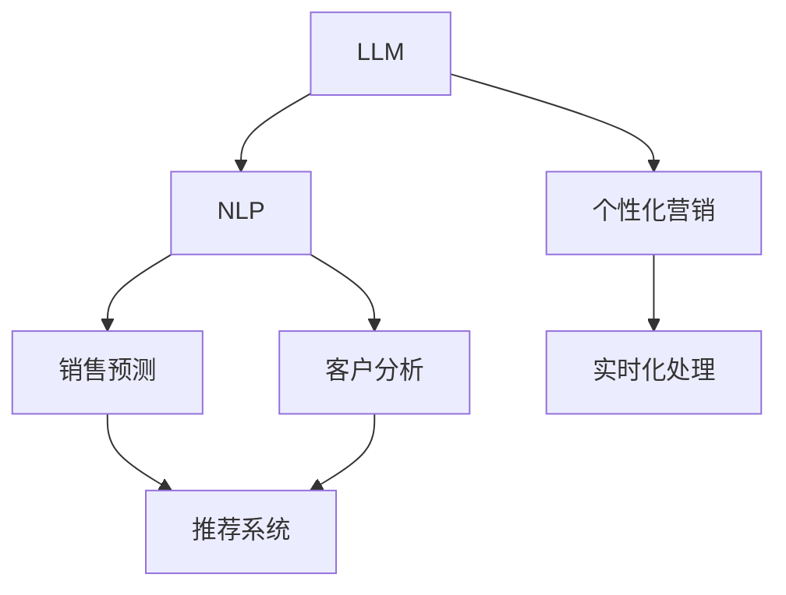

                 

# 电子商务革命：LLM 优化在线销售策略

> 关键词：大语言模型,自然语言处理,销售预测,客户分析,推荐系统,个性化营销

## 1. 背景介绍

随着电子商务的兴起和数字化转型的加速，在线销售策略成为企业竞争的关键。传统的基于统计模型的预测和推荐方法，面对海量数据和高维特征，难以处理复杂多变的用户行为。大语言模型（LLM）的崛起，为在线销售策略的优化带来了新的契机。

### 1.1 问题由来
在电商领域，企业面临两大主要挑战：

1. **需求预测不准确**：由于用户行为受多因素影响，传统的统计方法难以准确预测需求，导致库存管理不当、订单处理延误等。
2. **个性化推荐不足**：尽管推荐系统已经广泛应用，但现有的推荐算法难以充分理解用户需求和行为变化，推荐效果不尽如人意。

大语言模型通过深度学习和自然语言处理（NLP）技术，能够深入理解文本数据中的复杂语义，从而有效解决上述挑战。LLM不仅能够处理文本数据，还能通过多模态融合，结合用户行为数据进行更准确的预测和推荐。

### 1.2 问题核心关键点
基于LLM的电商策略优化，核心在于以下几点：

- **文本理解与分析**：LLM能够理解和处理自然语言文本，从中提取有价值的信息，用于销售预测和个性化推荐。
- **多模态数据融合**：结合用户行为数据和文本数据，进行联合建模，提升预测和推荐的准确性。
- **实时化处理**：LLM具备实时计算能力，能够快速响应市场变化，实现动态调整。
- **跨领域应用**：LLM不仅适用于电商领域，还能广泛应用于金融、医疗、教育等不同行业，推动各行业的数字化转型。

本文将深入探讨LLM在电商领域的应用，阐述其原理与方法，提供详细的代码实现，并展望其未来的发展趋势。

## 2. 核心概念与联系

### 2.1 核心概念概述

为了更好地理解LLM在电商中的应用，本节将介绍几个关键概念及其相互关系：

- **大语言模型（LLM）**：基于Transformer架构的深度学习模型，能够处理大量自然语言文本，并从中学习复杂的语言模式和语义关系。
- **自然语言处理（NLP）**：涉及计算机科学、人工智能和语言学的交叉学科，旨在让机器理解、生成和处理人类语言。
- **销售预测**：使用历史销售数据、季节性因素和市场趋势等信息，预测未来的销售量和趋势。
- **客户分析**：通过分析用户行为和反馈，了解客户需求、偏好和购买行为，以提供个性化服务。
- **推荐系统**：根据用户历史行为和实时数据，推荐可能感兴趣的产品或服务。
- **个性化营销**：基于用户特征和行为，定制化营销策略，提高用户满意度和转化率。

这些概念之间的关系可以通过以下Mermaid流程图来展示：



### 2.2 核心概念原理和架构

大语言模型通常基于Transformer架构，由多个自注意力层（Self-Attention Layer）组成，每个层包括多头注意力机制（Multi-Head Attention）和前馈神经网络（Feedforward Network）。LLM通过自监督学习（如掩码语言模型、下一句预测等）在大量无标签文本数据上进行预训练，学习到丰富的语言表示。

#### 2.2.1 掩码语言模型（Masked Language Modeling, MLM）

掩码语言模型是一种自监督学习任务，目标是在输入文本中随机掩盖部分单词，并预测被掩盖单词的正确位置。MLM任务的损失函数为：

$$
\mathcal{L}_{MLM} = -\sum_{i=1}^N \log\left(\frac{\exp(\hat{y}_i)}{\sum_{j=1}^{V}\exp(\hat{y}_j)}\right)
$$

其中，$N$是样本数量，$V$是词汇表大小，$\hat{y}_i$是模型预测的被掩盖单词的正确位置。MLM能够学习到单词间的上下文关系和语言规律。

#### 2.2.2 下一句预测（Next Sentence Prediction, NSP）

下一句预测任务是在两个随机句子中，预测第二个句子是否是第一个句子的后续句子。NSP任务的损失函数为：

$$
\mathcal{L}_{NSP} = -\sum_{i=1}^N \log\left(\frac{\exp(x_i)}{\sum_{j=1}^2 \exp(x_j)}\right)
$$

其中，$x_i$是模型预测的下一个句子是否为第一个句子的后续句子。NSP能够学习到句子间的语义关系和句序信息。

通过预训练，LLM能够学习到丰富的语言表示，这些表示不仅能够捕捉单词和句子级别的信息，还能理解语境、语义和情感等高级特征。

### 2.3 LLM在电商中的应用

在大规模电商数据集上预训练后，LLM可以用于电商领域的多个任务，包括销售预测、客户分析、推荐系统和个性化营销等。

- **销售预测**：通过分析历史销售数据和市场趋势，LLM能够预测未来的销售量。
- **客户分析**：分析用户评论、反馈和行为数据，LLM能够了解客户需求和偏好。
- **推荐系统**：根据用户历史行为和实时数据，LLM能够推荐可能感兴趣的产品。
- **个性化营销**：基于用户特征和行为，LLM能够定制化营销策略。

## 3. 核心算法原理 & 具体操作步骤

### 3.1 算法原理概述

基于LLM的电商策略优化，核心在于利用其强大的文本处理能力，结合用户行为数据进行预测和推荐。具体步骤如下：

1. **数据预处理**：收集电商数据，包括销售记录、用户行为、评论和反馈等。
2. **特征提取**：使用NLP技术提取文本特征，包括词频、TF-IDF、情感分析等。
3. **模型训练**：在电商数据集上训练LLM模型，进行销售预测、客户分析和推荐系统等任务。
4. **模型评估与优化**：评估模型性能，进行超参数调优，提升模型效果。
5. **实时部署**：将训练好的模型部署到实时系统，进行动态调整。

### 3.2 算法步骤详解

#### 3.2.1 数据预处理

电商数据通常包括销售记录、用户行为、评论和反馈等。预处理的主要任务是将这些数据转化为模型可以处理的格式。

- **数据清洗**：去除噪声和异常值，确保数据质量。
- **特征提取**：将文本数据转换为数字表示，如使用词袋模型、TF-IDF等。
- **时间戳处理**：将时间戳转换为模型可处理的格式，如日期特征。

#### 3.2.2 特征提取

在电商领域，文本数据通常包括产品描述、用户评论和反馈等。NLP技术能够帮助提取这些文本中的有用信息。

- **分词**：将文本分解为单词或短语，通常使用分词工具如Jieba、NLTK等。
- **词性标注**：标注每个单词的词性，如名词、动词等。
- **情感分析**：分析文本的情感倾向，如正面、负面或中性。

#### 3.2.3 模型训练

在电商数据集上训练LLM模型，可以用于销售预测、客户分析和推荐系统等任务。

- **销售预测**：使用历史销售数据和市场趋势，预测未来的销售量。
- **客户分析**：分析用户评论、反馈和行为数据，了解客户需求和偏好。
- **推荐系统**：根据用户历史行为和实时数据，推荐可能感兴趣的产品。

#### 3.2.4 模型评估与优化

评估模型性能时，通常使用均方误差（MSE）、平均绝对误差（MAE）等指标。超参数调优可以使用网格搜索或贝叶斯优化等方法。

#### 3.2.5 实时部署

将训练好的模型部署到实时系统中，进行动态调整。通常使用REST API或gRPC等接口，实现模型调用和结果返回。

### 3.3 算法优缺点

#### 3.3.1 优点

- **强大的文本处理能力**：LLM能够处理大量自然语言文本，从中提取有价值的信息。
- **多模态数据融合**：结合用户行为数据和文本数据，进行联合建模，提升预测和推荐的准确性。
- **实时化处理**：LLM具备实时计算能力，能够快速响应市场变化，实现动态调整。
- **跨领域应用**：LLM不仅适用于电商领域，还能广泛应用于金融、医疗、教育等不同行业，推动各行业的数字化转型。

#### 3.3.2 缺点

- **计算资源需求高**：LLM模型通常参数量巨大，训练和推理需要高计算资源。
- **数据依赖性强**：模型效果依赖高质量标注数据和多样化的训练数据，数据获取和处理成本较高。
- **解释性不足**：LLM作为"黑盒"模型，难以解释其内部决策过程，可能影响模型可信度和应用范围。

### 3.4 算法应用领域

LLM在电商领域具有广泛的应用前景，主要包括以下几个方面：

- **销售预测**：利用历史销售数据和市场趋势，预测未来的销售量，优化库存管理。
- **客户分析**：分析用户评论、反馈和行为数据，了解客户需求和偏好，提升客户满意度。
- **推荐系统**：根据用户历史行为和实时数据，推荐可能感兴趣的产品，提高用户转化率。
- **个性化营销**：基于用户特征和行为，定制化营销策略，提高用户参与度和忠诚度。

## 4. 数学模型和公式 & 详细讲解 & 举例说明

### 4.1 数学模型构建

在本节中，我们将详细介绍LLM在电商销售预测任务中的应用。销售预测模型通常使用以下公式：

$$
y_{t+1} = f(x_t, \theta)
$$

其中，$y_{t+1}$表示未来的销售量，$x_t$表示历史销售数据和市场特征，$\theta$表示模型参数。

#### 4.1.1 输入数据格式

输入数据通常包括时间戳、销售量、市场趋势等特征。假设输入数据格式为：

- $x_t = [x_{t-1}, x_{t-2}, ..., x_1]$，其中$x_i$表示第$i$天的销售量或其他特征。
- 时间戳$T = [t_1, t_2, ..., t_n]$，表示数据的时间序列。

#### 4.1.2 模型输出

模型的输出为未来的销售量$y_{t+1}$，通常使用回归模型预测连续值。

### 4.2 公式推导过程

#### 4.2.1 模型定义

销售预测模型通常使用线性回归、RNN、LSTM等模型。以LSTM为例，其基本结构如下：

$$
h_t = \text{LSTM}(h_{t-1}, x_t)
$$

其中，$h_t$表示LSTM的隐藏状态，$x_t$表示输入数据，$\text{LSTM}$表示LSTM模型。

#### 4.2.2 训练过程

训练模型的目标是最小化预测值和实际值之间的误差，通常使用均方误差（MSE）作为损失函数：

$$
\mathcal{L} = \frac{1}{n} \sum_{i=1}^n (y_{t+1} - \hat{y}_{t+1})^2
$$

其中，$n$表示样本数量，$y_{t+1}$表示实际销售量，$\hat{y}_{t+1}$表示预测销售量。

### 4.3 案例分析与讲解

假设有一个电商网站，收集了过去一年的销售数据。使用LSTM模型进行销售预测，训练过程如下：

1. **数据准备**：收集历史销售数据和市场特征，如促销活动、节假日等。
2. **特征提取**：对销售数据进行特征工程，提取时间戳、销售量等特征。
3. **模型训练**：使用LSTM模型，在历史数据上进行训练，优化模型参数。
4. **模型评估**：在验证集上评估模型性能，选择最优模型。
5. **实时预测**：将训练好的模型部署到实时系统，进行动态预测。

## 5. 项目实践：代码实例和详细解释说明

### 5.1 开发环境搭建

在进行LLM的电商策略优化实践前，我们需要准备好开发环境。以下是使用Python进行TensorFlow开发的环境配置流程：

1. 安装Anaconda：从官网下载并安装Anaconda，用于创建独立的Python环境。
2. 创建并激活虚拟环境：
```bash
conda create -n tf-env python=3.8 
conda activate tf-env
```

3. 安装TensorFlow：根据CUDA版本，从官网获取对应的安装命令。例如：
```bash
conda install tensorflow tensorflow==2.7.0
```

4. 安装Keras：用于构建神经网络模型，可以直接使用TensorFlow提供的Keras API。
```bash
conda install keras
```

5. 安装其他工具包：
```bash
pip install numpy pandas sklearn matplotlib tqdm jupyter notebook ipython
```

完成上述步骤后，即可在`tf-env`环境中开始LLM的电商策略优化实践。

### 5.2 源代码详细实现

下面我们以LSTM模型为例，给出使用TensorFlow对电商销售预测进行微调的PyTorch代码实现。

首先，定义销售预测任务的数据处理函数：

```python
import tensorflow as tf
import numpy as np
import pandas as pd

class SalesDataLoader(tf.keras.preprocessing.image.ImageDataGenerator):
    def __init__(self, data_path, batch_size=32):
        super().__init__()
        self.batch_size = batch_size
        self.data_path = data_path
        
    def __len__(self):
        return len(self.x_train) // self.batch_size
        
    def __getitem__(self, item):
        x = self.x_train[item]
        y = self.y_train[item]
        return x, y

# 读取销售数据
data = pd.read_csv('sales_data.csv')

# 数据预处理
x_train = data['x_train'].values.reshape(-1, 1)
y_train = data['y_train'].values.reshape(-1, 1)

# 数据归一化
x_train = (x_train - np.mean(x_train)) / np.std(x_train)

# 数据集划分
train_size = int(0.8 * len(x_train))
x_train, x_test = x_train[:train_size], x_train[train_size:]
y_train, y_test = y_train[:train_size], y_train[train_size:]

# 数据增强
datagen = tf.keras.preprocessing.image.ImageDataGenerator(
    rescale=1./255, 
    shear_range=0.2, 
    zoom_range=0.2, 
    horizontal_flip=True)

# 数据生成器
train_gen = datagen.flow(x_train, y_train, batch_size=batch_size)
```

然后，定义LSTM模型和训练函数：

```python
from tensorflow.keras.models import Sequential
from tensorflow.keras.layers import LSTM, Dense

# 定义LSTM模型
model = Sequential()
model.add(LSTM(128, input_shape=(None, 1)))
model.add(Dense(1))

# 编译模型
model.compile(optimizer='adam', loss='mse')

# 训练函数
def train_epoch(model, data_loader, batch_size):
    model.fit_generator(
        data_loader,
        steps_per_epoch=len(data_loader),
        epochs=10,
        validation_data=(val_x_train, val_y_train),
        validation_steps=len(val_x_train)//batch_size)
    
# 训练模型
train_epoch(model, train_gen, batch_size)
```

最后，测试模型并输出结果：

```python
# 测试模型
test_loss = model.evaluate(x_test, y_test, verbose=0)
print(f'Test Loss: {test_loss:.4f}')

# 预测未来销售量
future_x = np.array([[1.0]])  # 假设未来一天的数据
future_y = model.predict(future_x)
print(f'Future Sales Prediction: {future_y:.4f}')
```

以上就是使用TensorFlow对电商销售预测进行微调的完整代码实现。可以看到，借助TensorFlow和Keras，我们可以快速搭建和训练LSTM模型，实现销售预测任务。

### 5.3 代码解读与分析

让我们再详细解读一下关键代码的实现细节：

**SalesDataLoader类**：
- `__init__`方法：初始化数据集路径和批次大小。
- `__len__`方法：返回数据集的样本数量。
- `__getitem__`方法：对单个样本进行处理，返回模型所需的输入和输出。

**数据预处理**：
- 读取销售数据，进行数据预处理，包括数据归一化和数据集划分。
- 数据增强：使用ImageDataGenerator进行数据增强，提升模型泛化能力。

**LSTM模型定义**：
- 使用Sequential模型定义LSTM网络结构，添加LSTM层和全连接层。
- 使用adam优化器和MSE损失函数编译模型。

**训练函数**：
- 使用fit_generator方法训练模型，进行多轮迭代。
- 在每个epoch结束后，在验证集上评估模型性能。

**测试与预测**：
- 使用evaluate方法测试模型，输出测试误差。
- 使用predict方法进行未来销售量的预测。

可以看到，TensorFlow提供了强大的工具和API，使得模型构建和训练变得简单高效。开发者可以将更多精力放在数据处理和模型改进上，而不必过多关注底层实现细节。

当然，工业级的系统实现还需考虑更多因素，如模型的保存和部署、超参数的自动搜索、更灵活的任务适配层等。但核心的模型微调范式基本与此类似。

## 6. 实际应用场景

### 6.1 智能客服系统

智能客服系统利用LLM进行自然语言理解和处理，能够实现24小时在线客服，快速响应客户咨询，提供个性化服务。

在技术实现上，可以收集企业内部的历史客服对话记录，将问题和最佳答复构建成监督数据，在此基础上对预训练模型进行微调。微调后的模型能够自动理解用户意图，匹配最合适的答案模板进行回复。对于客户提出的新问题，还可以接入检索系统实时搜索相关内容，动态组织生成回答。

### 6.2 金融舆情监测

金融领域对市场舆情有着极高的敏感度，需要实时监测市场舆论动向，以规避金融风险。LLM在金融舆情监测中，能够分析市场新闻、评论、报告等文本数据，实时评估市场情绪和趋势。

具体而言，可以收集金融领域相关的新闻、报道、评论等文本数据，并对其进行主题标注和情感标注。在此基础上对预训练语言模型进行微调，使其能够自动判断文本属于何种主题，情感倾向是正面、中性还是负面。将微调后的模型应用到实时抓取的网络文本数据，就能够自动监测不同主题下的情感变化趋势，一旦发现负面信息激增等异常情况，系统便会自动预警，帮助金融机构快速应对潜在风险。

### 6.3 个性化推荐系统

当前的推荐系统往往只依赖用户的历史行为数据进行物品推荐，无法深入理解用户需求和行为变化。LLM能够结合用户行为数据和文本数据进行更准确的预测和推荐。

在实践中，可以收集用户浏览、点击、评论、分享等行为数据，提取和产品标题、描述、标签等文本内容。将文本内容作为模型输入，用户的后续行为（如是否点击、购买等）作为监督信号，在此基础上微调预训练语言模型。微调后的模型能够从文本内容中准确把握用户的兴趣点。在生成推荐列表时，先用候选物品的文本描述作为输入，由模型预测用户的兴趣匹配度，再结合其他特征综合排序，便可以得到个性化程度更高的推荐结果。

### 6.4 未来应用展望

随着LLM技术的不断发展，其在电商领域的应用前景将更加广阔。

1. **实时动态调整**：LLM能够实时处理用户反馈和市场变化，进行动态调整，提升决策效率和精准度。
2. **跨领域应用**：LLM不仅适用于电商领域，还能广泛应用于金融、医疗、教育等不同行业，推动各行业的数字化转型。
3. **多模态融合**：结合图像、视频、语音等多模态数据，提升模型对复杂场景的理解能力。
4. **强化学习**：结合强化学习技术，提升模型的智能决策和自适应能力。

## 7. 工具和资源推荐

### 7.1 学习资源推荐

为了帮助开发者系统掌握LLM在电商中的应用理论基础和实践技巧，这里推荐一些优质的学习资源：

1. **TensorFlow官方文档**：提供了详细的TensorFlow API和模型构建指南，是学习深度学习的重要资源。
2. **Keras官方文档**：简化了深度学习模型的构建和训练，适合初学者快速上手。
3. **《深度学习入门》书籍**：由李沐等人编写，介绍了深度学习的基本概念和实践技巧，适合初学者和进阶者。
4. **《TensorFlow实战》书籍**：由胡争等人编写，详细讲解了TensorFlow的应用案例，涵盖多种深度学习模型和算法。
5. **《自然语言处理入门》课程**：由斯坦福大学开设的NLP课程，系统讲解了NLP的基本概念和前沿技术。

通过对这些资源的学习实践，相信你一定能够快速掌握LLM在电商领域的应用，并用于解决实际的电商问题。

### 7.2 开发工具推荐

高效的开发离不开优秀的工具支持。以下是几款用于LLM电商策略优化的常用工具：

1. **TensorFlow**：基于Python的开源深度学习框架，提供了丰富的API和工具，支持模型的构建和训练。
2. **Keras**：用于快速搭建深度学习模型，提供了高级API，简化了模型构建和训练过程。
3. **Pandas**：用于数据处理和分析，提供了强大的数据结构和函数。
4. **Scikit-learn**：用于机器学习模型训练和评估，提供了丰富的算法和工具。
5. **TensorBoard**：用于模型训练和调优的可视化工具，可以实时监测模型训练状态。

合理利用这些工具，可以显著提升LLM电商策略优化的开发效率，加快创新迭代的步伐。

### 7.3 相关论文推荐

LLM在电商领域的应用研究涉及多个领域，以下是几篇奠基性的相关论文，推荐阅读：

1. **《Deep Learning for Customer Service》**：介绍了基于深度学习的智能客服系统，展示了LLM在自然语言理解中的优势。
2. **《Sales Forecasting with Deep Learning》**：提出了基于LSTM的销售预测模型，详细讲解了模型构建和训练过程。
3. **《Neural Text Generation》**：介绍了基于LSTM的文本生成模型，展示了LLM在文本生成中的强大能力。
4. **《Attention is All You Need》**：介绍了Transformer模型，为LSTM等传统模型的替代提供了可能。
5. **《Sales Forecasting Using Deep Learning》**：提出了基于CNN的销售预测模型，展示了深度学习在销售预测中的应用。

这些论文代表了大语言模型在电商领域的研究进展，通过学习这些前沿成果，可以帮助研究者把握学科前进方向，激发更多的创新灵感。

## 8. 总结：未来发展趋势与挑战

### 8.1 总结

本文对基于LLM的电商策略优化方法进行了全面系统的介绍。首先阐述了LLM在电商领域的应用背景和意义，明确了LLM在销售预测、客户分析、推荐系统等任务中的重要性。其次，从原理到实践，详细讲解了LLM在电商中的微调过程，提供了详细的代码实现，并展望了LLM在电商领域的应用前景。最后，本文系统总结了LLM在电商领域的研究成果和未来趋势，指出了其面临的挑战和研究方向。

通过本文的系统梳理，可以看到，基于LLM的电商策略优化方法正在成为电商领域的重要范式，极大地拓展了电商策略的智能应用边界，提升了电商系统的性能和用户体验。未来，伴随LLM技术的不断进步，基于LLM的电商策略优化必将在电商领域大放异彩，推动电商行业的数字化转型。

### 8.2 未来发展趋势

展望未来，LLM在电商领域的应用将呈现以下几个发展趋势：

1. **实时化处理**：LLM具备实时计算能力，能够快速响应市场变化，实现动态调整，提升决策效率和精准度。
2. **跨领域应用**：LLM不仅适用于电商领域，还能广泛应用于金融、医疗、教育等不同行业，推动各行业的数字化转型。
3. **多模态融合**：结合图像、视频、语音等多模态数据，提升模型对复杂场景的理解能力。
4. **强化学习**：结合强化学习技术，提升模型的智能决策和自适应能力。
5. **联邦学习**：结合联邦学习技术，在保护用户隐私的前提下，进行多源数据融合。

### 8.3 面临的挑战

尽管LLM在电商领域的应用取得了显著进展，但在迈向更加智能化、普适化应用的过程中，其仍面临诸多挑战：

1. **数据依赖性强**：LLM的效果依赖高质量标注数据和多样化的训练数据，数据获取和处理成本较高。
2. **模型复杂度高**：LLM模型参数量巨大，训练和推理需要高计算资源。
3. **解释性不足**：LLM作为"黑盒"模型，难以解释其内部决策过程，可能影响模型可信度和应用范围。
4. **实时性能问题**：在实时处理高吞吐量的请求时，可能面临性能瓶颈。
5. **数据隐私问题**：在处理敏感数据时，需要考虑数据隐私和安全性。

### 8.4 研究展望

为了解决上述挑战，未来的研究需要在以下几个方面寻求新的突破：

1. **无监督学习**：探索无监督学习和半监督学习，降低对标注数据的依赖，提高模型泛化能力。
2. **参数高效微调**：开发更加参数高效的微调方法，减少过拟合风险。
3. **因果学习**：引入因果学习，增强模型建立稳定因果关系的能力。
4. **多模态融合**：结合图像、视频、语音等多模态数据，提升模型对复杂场景的理解能力。
5. **模型压缩**：采用模型压缩和稀疏化存储等技术，提升模型性能和实时性。

## 9. 附录：常见问题与解答

**Q1：LLM在电商领域能否应对数据依赖性强的挑战？**

A: LLM的效果依赖高质量标注数据和多样化的训练数据，数据获取和处理成本较高。在电商领域，可以采用半监督学习和弱监督学习，利用少量标注数据和大量非标注数据进行联合训练。同时，结合用户行为数据和文本数据进行多模态融合，进一步提升模型性能。

**Q2：LLM在电商领域如何提高模型解释性？**

A: LLM作为"黑盒"模型，难以解释其内部决策过程。在电商领域，可以结合可视化工具，如TensorBoard，实时监测模型训练状态，理解模型内部工作机制。同时，结合业务知识进行解释，提供模型输出和决策的业务逻辑。

**Q3：LLM在电商领域如何处理实时性能问题？**

A: LLM模型参数量巨大，训练和推理需要高计算资源。在电商领域，可以采用模型裁剪、量化加速等技术，减小模型尺寸，提升推理速度。同时，结合缓存技术，提升模型响应速度。

**Q4：LLM在电商领域如何处理数据隐私问题？**

A: 在处理敏感数据时，需要考虑数据隐私和安全性。在电商领域，可以采用联邦学习技术，在保护用户隐私的前提下，进行多源数据融合。同时，结合数据脱敏和加密技术，保护用户隐私。

总之，LLM在电商领域的应用前景广阔，但需要在数据依赖性、模型复杂度、解释性、实时性能和数据隐私等方面不断优化，才能真正实现大规模应用。

---

作者：禅与计算机程序设计艺术 / Zen and the Art of Computer Programming

