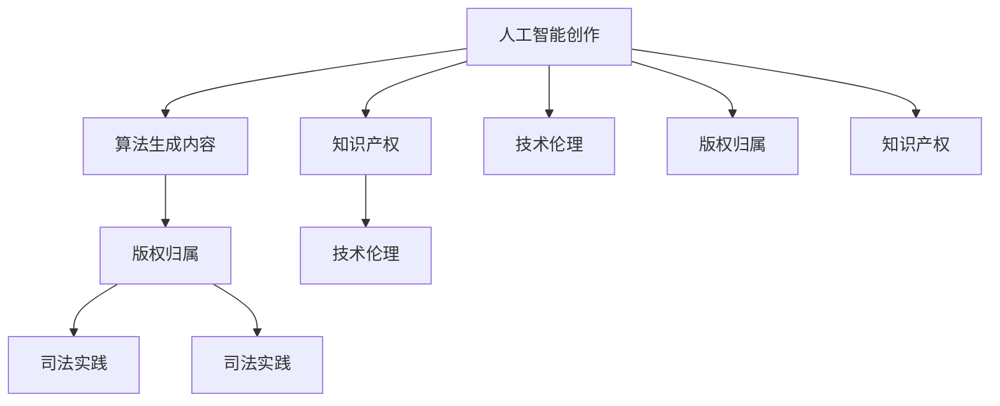

                 

# 知识产权与人工智能创作的归属

> 关键词：人工智能创作、版权归属、知识产权、算法生成内容、司法实践、技术伦理

## 1. 背景介绍

随着人工智能技术的迅猛发展，人工智能(AI)在音乐、艺术、文学等领域的应用日益广泛。AI创作的作品和内容，能否拥有与人类创作同样的知识产权？这一问题近年来引起广泛关注，并逐步进入司法实践领域。本文将探讨人工智能创作的知识产权归属，从法律、技术、伦理等角度进行深入分析。

## 2. 核心概念与联系

### 2.1 核心概念概述

为更好地理解人工智能创作的知识产权归属问题，本节将介绍几个核心概念：

- **人工智能创作(AI Content Creation)**：指使用人工智能算法自动生成作品或内容，包括文本、图像、音乐、视频等。常见的人工智能创作技术包括自然语言处理、计算机视觉、深度学习等。

- **知识产权(Intellectual Property, IP)**：指创作者对其创作的作品所享有的独占权，包括版权、专利权、商标权等。

- **版权(Copyright)**：指对文学、艺术作品以及录音、电影、软件等原创性作品的著作权。

- **算法生成内容(Algorithmic Content)**：指完全由计算机算法生成，未经过人类编辑的作品或内容。

- **司法实践(Judicial Practices)**：指法院在处理相关案件时的判例和裁定，具有指导性和约束力。

- **技术伦理(Technical Ethics)**：指技术开发和应用过程中应遵循的道德和伦理规范。

这些概念之间相互关联，共同构成了人工智能创作及其知识产权归属的法律框架和理论基础。

### 2.2 核心概念原理和架构的 Mermaid 流程图



这个流程图展示了人工智能创作、算法生成内容、版权归属、知识产权、司法实践和技术伦理之间的逻辑关系：

1. 人工智能创作是算法生成内容的一种形式。
2. 算法生成内容可能涉及到版权归属问题。
3. 人工智能创作涉及知识产权。
4. 司法实践为解决版权归属问题提供了法律依据。
5. 技术伦理为人工智能创作的应用提供了道德指导。
6. 技术伦理也影响着人工智能创作的知识产权归属。

## 3. 核心算法原理 & 具体操作步骤

### 3.1 算法原理概述

人工智能创作通常基于深度学习等机器学习技术，通过训练模型自动生成内容。其核心原理包括：

- **数据预处理**：将原始数据转化为模型可处理的格式，如文本预处理中的分词、清洗等。
- **模型训练**：使用大量标记数据训练模型，使其能够学习到生成内容的规则。
- **内容生成**：模型接收到输入后，根据训练时的规则生成新的内容。

### 3.2 算法步骤详解

以文本生成为例，人工智能创作的基本步骤包括：

1. **数据收集**：收集训练数据，如小说、新闻、网页等。
2. **数据预处理**：对数据进行清洗、分词、标记等预处理。
3. **模型选择**：选择适合的深度学习模型，如LSTM、RNN、Transformer等。
4. **模型训练**：使用标记数据训练模型，优化模型参数。
5. **内容生成**：使用训练好的模型生成新文本。

### 3.3 算法优缺点

人工智能创作的优点包括：

- **高效性**：可以快速生成大量内容，节省人力成本。
- **多样性**：能够生成多种风格和形式的内容，满足不同需求。

其缺点包括：

- **缺乏创造性**：生成的内容往往缺乏原创性，依赖于训练数据的风格。
- **伦理问题**：可能存在算法偏见和隐私泄露等伦理问题。

### 3.4 算法应用领域

人工智能创作已经在多个领域得到应用，包括：

- **文学创作**：使用AI生成诗歌、小说、剧本等文学作品。
- **音乐创作**：自动生成乐曲、编曲等音乐内容。
- **图像生成**：生成艺术作品、广告图像等。
- **视频制作**：自动生成短片、广告、动画等视频内容。
- **报告和文档**：自动生成商业报告、学术论文等。

## 4. 数学模型和公式 & 详细讲解 & 举例说明

### 4.1 数学模型构建

以自然语言处理(NLP)中的文本生成为例，常见的数学模型包括：

- **语言模型(LM)**：表示文本序列的概率分布，常用模型如n-gram、RNN、LSTM、Transformer等。
- **生成模型(GM)**：表示从给定序列生成新序列的过程，常用模型如VAE、GAN等。

### 4.2 公式推导过程

以Transformer模型为例，其核心推导过程包括：

1. **自注意力机制(Self-Attention Mechanism)**：计算每个词与其他词的注意力权重，加权求和后生成上下文向量。
2. **多头注意力机制(Multi-Head Attention)**：将输入序列分成多个头部，并行计算注意力权重。
3. **位置编码(Positional Encoding)**：将词序信息转化为位置编码，以模型捕捉上下文关系。
4. **残差连接(Residual Connections)**：连接原始输入和输出，防止梯度消失。

### 4.3 案例分析与讲解

以OpenAI的GPT模型为例，其文本生成过程如下：

1. **输入**：给定一个文本序列。
2. **自注意力计算**：计算每个词与其他词的注意力权重，生成上下文向量。
3. **前向网络(Feedforward Network)**：将上下文向量进行线性变换和ReLU激活。
4. **残差连接**：连接原始输入和前向网络输出。
5. **生成输出**：输出新的文本序列。

## 5. 项目实践：代码实例和详细解释说明

### 5.1 开发环境搭建

在使用Python进行AI内容创作的实践中，需要安装以下工具和库：

1. **Python环境**：建议使用Anaconda或Miniconda进行环境管理。
2. **深度学习框架**：如TensorFlow、PyTorch等。
3. **自然语言处理库**：如NLTK、SpaCy等。
4. **数据集**：根据项目需求选择合适的数据集，如OpenAI的GPT-3数据集。

### 5.2 源代码详细实现

以使用GPT-3生成文本为例，代码实现如下：

```python
from transformers import pipeline
from transformers import GPT3LMHeadModel, GPT3Tokenizer

tokenizer = GPT3Tokenizer.from_pretrained('text-davinci-003')
model = GPT3LMHeadModel.from_pretrained('text-davinci-003')

def generate_text(prompt):
    inputs = tokenizer.encode(prompt, return_tensors='pt')
    outputs = model.generate(inputs, max_length=100, num_return_sequences=1)
    return tokenizer.decode(outputs[0])

text = generate_text("In a world where AI can create")
print(text)
```

这段代码中，我们首先从Transformers库加载了GPT-3模型和分词器，然后使用`generate`方法生成文本。

### 5.3 代码解读与分析

- **分词器**：将输入文本转化为模型可接受的格式。
- **模型加载**：使用预训练的GPT-3模型。
- **文本生成**：输入文本序列，使用`generate`方法生成新的文本序列。
- **解码**：将生成结果解码回人类可读的文本格式。

## 6. 实际应用场景

### 6.1 音乐创作

AI在音乐创作领域的应用包括自动作曲、编曲、节奏生成等。OpenAI的Jukebox项目使用深度学习生成新的音乐作品，已经引起了广泛关注。

### 6.2 艺术创作

AI在艺术创作中的应用包括绘画、雕塑、建筑设计等。DeepArt等工具使用神经网络生成艺术作品，展示了AI在艺术创作上的潜力。

### 6.3 文学创作

AI在文学创作中的应用包括自动生成小说、诗歌、剧本等。GPT-3等模型已经能够生成高质量的文学作品，展示了AI在文学创作上的潜力。

### 6.4 未来应用展望

未来，AI创作将在更多领域得到应用，包括但不限于：

- **影视制作**：自动生成短片、动画等。
- **游戏设计**：自动生成游戏剧情、角色等。
- **新闻撰写**：自动生成新闻报道、分析等。

## 7. 工具和资源推荐

### 7.1 学习资源推荐

- **Coursera的深度学习课程**：由斯坦福大学开设，涵盖深度学习的基础理论和实践应用。
- **CS224N《自然语言处理》课程**：斯坦福大学开设的NLP明星课程，讲解了自然语言处理的基本概念和前沿技术。
- **Transformers官方文档**：详细介绍了各种预训练模型和微调方法，是学习和实践AI创作的必备资料。
- **Google AI Blog**：定期发布AI领域的最新研究和应用进展，涵盖多个领域和应用场景。

### 7.2 开发工具推荐

- **Python**：最常用的编程语言之一，易于学习和使用。
- **TensorFlow**：由Google开发，支持深度学习模型的训练和推理。
- **PyTorch**：由Facebook开发，支持动态计算图和GPU加速。
- **NLTK**：Python自然语言处理库，支持文本预处理、语义分析等功能。

### 7.3 相关论文推荐

- **"Neural Story Generation" by Sutskever et al.**：探讨了使用深度学习生成故事的算法。
- **"DeepArt: Creating Art with Deep Learning" by Zhao et al.**：展示了使用深度学习生成艺术作品的算法。
- **"Attention is All You Need" by Vaswani et al.**：提出了Transformer模型，奠定了深度学习生成内容的基础。

## 8. 总结：未来发展趋势与挑战

### 8.1 研究成果总结

当前，人工智能创作在多个领域取得了显著进展，展示了AI在内容生成上的潜力。但同时也面临着法律、伦理和技术等多方面的挑战。

### 8.2 未来发展趋势

未来，人工智能创作将在更多领域得到应用，展示更广阔的应用前景。但同时也需要注意：

- **法律和伦理**：需要制定明确的法律法规，确保AI创作符合伦理道德和社会价值观。
- **技术进步**：需要进一步提高AI创作的准确性和创造性，使其能够生成更多高质量的内容。
- **人机协同**：需要开发更加智能的AI创作工具，使人类能够更高效地利用AI进行创作。

### 8.3 面临的挑战

当前，人工智能创作面临的主要挑战包括：

- **版权归属**：如何确定AI创作作品的版权归属，是一个亟待解决的问题。
- **伦理和隐私**：AI创作可能存在算法偏见和隐私泄露等伦理问题。
- **法律适用性**：现有法律体系可能无法完全覆盖AI创作带来的新情况和新问题。
- **技术局限**：AI创作的准确性和创造性仍有待提高。

### 8.4 研究展望

未来的研究需要从多个角度进行：

- **法律研究**：制定明确的法律法规，确保AI创作符合伦理道德和社会价值观。
- **技术研究**：提高AI创作的准确性和创造性，使其能够生成更多高质量的内容。
- **人机协同**：开发更加智能的AI创作工具，使人类能够更高效地利用AI进行创作。
- **伦理研究**：研究AI创作中的算法偏见和隐私泄露问题，确保AI创作的安全性和可靠性。

## 9. 附录：常见问题与解答

**Q1: 人工智能创作的版权归属问题如何解决？**

A: 人工智能创作的版权归属问题是一个复杂的法律问题，需要结合各国法律和国际公约进行综合考量。当前，国际上还没有统一的法律框架来处理AI创作的版权归属问题。但一些法律专家和机构已经开始探讨这一问题，并提出了一些建议和方案，如将所有权归原始数据提供者，或由AI开发者持有版权等。

**Q2: 如何避免AI创作中的算法偏见？**

A: 避免AI创作中的算法偏见，需要从数据收集、模型训练和应用部署等多个环节进行综合考虑。具体措施包括：
- 数据集的多样性：收集多样化的数据，避免数据偏见。
- 模型公平性：使用公平性约束的优化算法，减少模型偏见。
- 人工审核：在模型应用前，进行人工审核和测试，确保模型的公平性和可靠性。

**Q3: 如何确保AI创作的隐私和安全？**

A: 确保AI创作的隐私和安全，需要从数据收集、存储、传输和使用等多个环节进行综合考虑。具体措施包括：
- 数据匿名化：对数据进行匿名化处理，保护用户隐私。
- 数据加密：对存储和传输的数据进行加密处理，防止数据泄露。
- 访问控制：对数据进行严格的访问控制，确保只有授权人员可以访问数据。

**Q4: 人工智能创作对传统创作者的影响是什么？**

A: 人工智能创作对传统创作者的影响是一个双刃剑。一方面，AI可以生成高质量的内容，帮助创作者提高效率和创作水平。另一方面，AI创作可能会替代一些低门槛的创作工作，影响传统创作者的就业和发展。

**Q5: 人工智能创作的未来前景是什么？**

A: 人工智能创作的前景非常广阔。未来，AI创作将在更多领域得到应用，展示更广阔的应用前景。但同时也需要注意，AI创作需要结合人类的创意和智慧，才能实现更好的创作效果。

---

作者：禅与计算机程序设计艺术 / Zen and the Art of Computer Programming

