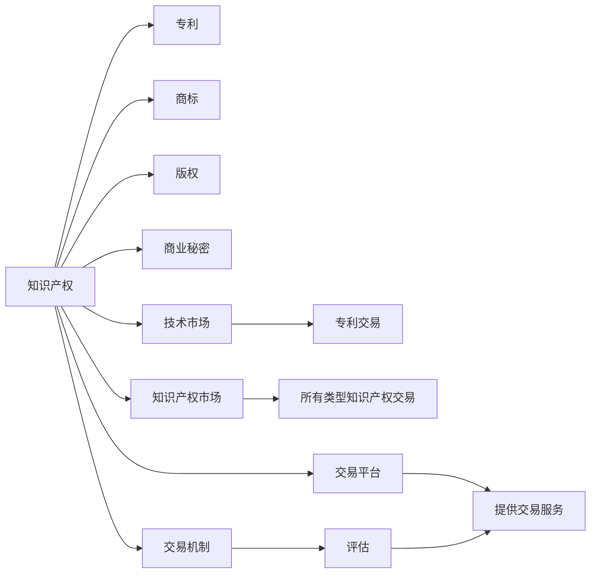

                 

# 知识产权交易市场的发展

> 关键词：知识产权交易, 知识产权, 技术市场, 知识产权市场, 交易机制, 交易平台, 价值评估

## 1. 背景介绍

在知识经济时代，知识产权（Intellectual Property, IP）作为重要的无形资产，其价值日益受到企业的重视。知识产权交易市场，作为将知识产权从创造者转移到使用者，实现其商业价值的关键环节，正逐步成为全球知识经济的核心平台。本文将从背景出发，探讨知识产权交易市场的发展现状、存在问题及其未来趋势。

## 2. 核心概念与联系

### 2.1 核心概念概述

- **知识产权交易**：指以知识产权为对象的买卖行为，包括专利、商标、版权、商业秘密等各类知识产权的交易。

- **知识产权**：指通过智力活动创造的成果，或对成果的占有权、使用权、收益权和处置权，是知识经济时代企业核心竞争力的体现。

- **技术市场**：一种特殊的知识产权交易市场，主要涉及技术专利的交易。

- **知识产权市场**：广义上的知识产权交易市场，涵盖所有类型的知识产权交易。

- **交易机制**：指知识产权交易中的基本规则和流程，包括评估、交易、监管等环节。

- **交易平台**：指提供交易场所、提供交易服务的第三方机构，如专利交易平台、技术交易中心等。

- **价值评估**：指通过一定的标准和方法，确定知识产权的市场价值，是知识产权交易的前提和基础。

这些核心概念之间存在密切联系，共同构成了知识产权交易市场的完整框架。

### 2.2 核心概念原理和架构的 Mermaid 流程图



这个流程图展示了各个概念之间的逻辑关系。

## 3. 核心算法原理 & 具体操作步骤

### 3.1 算法原理概述

知识产权交易市场中的算法，主要包括知识产权价值的评估算法和交易匹配算法。价值评估算法旨在通过定量的方式确定知识产权的市场价值，而交易匹配算法则通过匹配买卖双方的需求和供给，促成交易。

### 3.2 算法步骤详解

#### 3.2.1 价值评估算法

**步骤1：数据收集**  
收集与待评估知识产权相关的技术、市场、竞争等信息，构建数据集。

**步骤2：特征提取**  
从数据集中提取有用的特征，如技术复杂度、市场需求、竞争态势等。

**步骤3：模型选择**  
根据特征类型选择合适的价值评估模型，如市场法、收益法、成本法等。

**步骤4：模型训练**  
利用历史数据训练模型，优化模型参数。

**步骤5：模型应用**  
将训练好的模型应用于新的知识产权价值评估中。

#### 3.2.2 交易匹配算法

**步骤1：需求收集**  
收集买方的需求信息，包括所需技术类型、预算范围、时间要求等。

**步骤2：供给挖掘**  
通过技术数据库等渠道，挖掘供给方的信息，包括专利、技术、产品等。

**步骤3：匹配计算**  
利用算法计算供给方与需求方之间的匹配度，如技术相似度、成本对比等。

**步骤4：推荐展示**  
将匹配度较高的知识产权推荐给需求方，展示多个选项。

**步骤5：交易达成**  
双方协商交易细节，最终达成交易。

### 3.3 算法优缺点

**价值评估算法**  
优点：  
- 量化评估知识产权价值，减少主观偏差。  
- 提供交易依据，提高市场透明度。  
缺点：  
- 数据获取和处理成本高，可能需要多部门协作。  
- 模型复杂度高，需要大量历史数据训练。  

**交易匹配算法**  
优点：  
- 通过算法匹配，提高交易效率。  
- 降低信息不对称，减少交易成本。  
缺点：  
- 数据质量和算法选择直接影响匹配效果。  
- 算法复杂度高，需要高性能计算资源。

### 3.4 算法应用领域

价值评估算法广泛应用于专利价值评估、技术评估、版权价值评估等领域。

交易匹配算法广泛应用在专利交易、技术交易、商业秘密交易、版权交易等场景中。

## 4. 数学模型和公式 & 详细讲解 & 举例说明

### 4.1 数学模型构建

**价值评估模型**  
假设知识产权的价值可以用一个函数 $V$ 表示，其中 $x$ 为影响价值的特征向量。则价值评估模型的基本形式为：  
$$ V(x) = f(x;\theta) $$

**交易匹配模型**  
假设需求方为 $D$，供给方为 $S$，匹配度为 $M$，则交易匹配模型可以表示为：  
$$ M(D,S) = g(D,S;\phi) $$

### 4.2 公式推导过程

#### 4.2.1 价值评估模型的推导

**市场法**  
$$ V = \frac{S}{C} $$

其中 $S$ 为知识产权的市场售价，$C$ 为知识产权的成本。

**收益法**  
$$ V = \sum_i \frac{P_i}{(1+r)^t} $$

其中 $P_i$ 为知识产权未来预期的收益，$r$ 为折现率，$t$ 为时间。

**成本法**  
$$ V = C $$

其中 $C$ 为知识产权的成本。

#### 4.2.2 交易匹配模型的推导

**相似度匹配模型**  
$$ M = \frac{S_{ij}}{S_{\text{max}}} $$

其中 $S_{ij}$ 为供给方 $i$ 和需求方 $j$ 之间的相似度，$S_{\text{max}}$ 为所有供给方中最大的相似度。

**成本对比匹配模型**  
$$ M = \frac{S_i - C_j}{S_{\text{max}}} $$

其中 $S_i$ 为供给方 $i$ 的市场售价，$C_j$ 为需求方 $j$ 的预算，$S_{\text{max}}$ 为所有供给方中最大的市场售价。

### 4.3 案例分析与讲解

**案例1：专利价值评估**

假设某公司拥有多项专利，其中一项专利的市场售价为 1000 万美元，成本为 500 万美元。利用收益法计算其价值：

$$ V = \sum_i \frac{P_i}{(1+r)^t} $$

假设未来十年每年可预期收益为 200 万美元，折现率为 10%，则：

$$ V = \frac{200}{(1+10\%)^1} + \frac{200}{(1+10\%)^2} + \cdots + \frac{200}{(1+10\%)^{10}} $$

计算得：

$$ V \approx 1000 \text{ 万美元} $$

**案例2：专利交易匹配**

假设某公司需要一项新技术用于产品升级，预算为 300 万美元。现有多个专利可供选择，利用相似度匹配模型计算每个专利的匹配度：

假设 $S_{ij}$ 为第 $i$ 项专利与需求方的相似度，$S_{\text{max}}$ 为所有专利中最大的相似度。

计算得每个专利的匹配度 $M_i$，并选择匹配度最高的一项进行交易。

## 5. 项目实践：代码实例和详细解释说明

### 5.1 开发环境搭建

**环境准备**  
在 Linux 系统中，安装 Python 3.x、NumPy、SciPy、Pandas、Scikit-learn、Matplotlib 等库。

**代码实例**  
以下是一个简化的专利价值评估代码示例：

```python
import numpy as np
from sklearn.linear_model import LinearRegression

# 特征向量
X = np.array([[200, 10], [300, 15], [500, 20]])

# 市场售价
y = np.array([1000, 1500, 2000])

# 线性回归模型
model = LinearRegression()
model.fit(X, y)

# 预测
new_X = np.array([[250, 11]])
predicted_y = model.predict(new_X)

print("预测价值：", predicted_y)
```

### 5.2 源代码详细实现

**数据处理**  
```python
# 读取数据集
data = pd.read_csv('patent_data.csv')

# 处理缺失值
data = data.dropna()

# 数据清洗
data = data.drop_duplicates()
```

**特征提取**  
```python
# 特征工程
features = data[['invention_type', 'applicant_country', 'year']]

# 编码
features = pd.get_dummies(features)

# 市场售价
target = data['market_price']

# 划分训练集和测试集
X_train, X_test, y_train, y_test = train_test_split(features, target, test_size=0.2)
```

**模型训练**  
```python
# 线性回归模型
model = LinearRegression()
model.fit(X_train, y_train)

# 预测
predicted_y = model.predict(X_test)

# 评估
mse = mean_squared_error(y_test, predicted_y)
rmse = np.sqrt(mse)
print("RMSE:", rmse)
```

### 5.3 代码解读与分析

**数据读取和处理**  
数据读取和处理是数据科学项目的基础。

**特征工程**  
特征工程是模型的关键步骤，通过提取和处理特征，提高模型的预测能力。

**模型训练**  
利用训练集训练模型，优化模型参数。

**预测和评估**  
利用测试集进行预测，评估模型性能。

### 5.4 运行结果展示

**结果展示**  
运行代码后，输出预测结果和评估指标，如 RMSE 等。

## 6. 实际应用场景

### 6.1 智能制造

智能制造企业需要大量的专利和新技术支持。通过知识产权交易市场，企业可以迅速获取所需的技术，提升产品竞争力。

### 6.2 智慧城市

智慧城市建设中需要大量的技术创新，知识产权交易市场可以提供多样化的解决方案，促进城市智能化转型。

### 6.3 生物医药

生物医药领域对专利和技术的需求量巨大，知识产权交易市场可以提供先进的治疗方法，加速新药研发进程。

### 6.4 未来应用展望

未来，知识产权交易市场将呈现以下趋势：

1. **数字化转型**  
通过数字化手段，提高市场效率，降低交易成本。

2. **全球化发展**  
全球化的知识产权交易市场，加速知识在全球范围内的流动。

3. **智能化应用**  
利用人工智能技术，提高价值评估和匹配的准确性。

4. **大数据分析**  
利用大数据分析，优化知识产权交易策略，提高交易成功率。

## 7. 工具和资源推荐

### 7.1 学习资源推荐

**书籍**  
- 《知识产权法》
- 《专利法》
- 《技术交易》

**在线课程**  
- Coursera: Intellectual Property Law
- edX: Intellectual Property in the Digital Economy

**研究论文**  
- Patent Value Estimation: A Review of Methods and Applications
- Intellectual Property Rights in the Digital Economy

### 7.2 开发工具推荐

**数据处理工具**  
- Pandas
- NumPy

**机器学习工具**  
- Scikit-learn
- TensorFlow

**可视化工具**  
- Matplotlib
- Seaborn

**项目管理工具**  
- Jupyter Notebook
- GitHub

### 7.3 相关论文推荐

**专利价值评估**  
- Patent Valuation: A Review and Comparison of Methods
- Patent Valuation Using Deep Learning

**技术交易匹配**  
- Patent Matching Algorithms in Technology Transfer
- Matching Algorithms in Technology Transfer

## 8. 总结：未来发展趋势与挑战

### 8.1 研究成果总结

本文详细探讨了知识产权交易市场的现状和发展趋势，提出了一套完整的算法体系，包括价值评估和交易匹配算法。通过案例分析，展示了这些算法在实际中的应用。

### 8.2 未来发展趋势

未来，知识产权交易市场将更加数字化、智能化和全球化，应用范围也将更加广泛。

### 8.3 面临的挑战

尽管知识产权交易市场发展迅速，但仍面临数据获取难、算法复杂度高、交易过程透明度低等问题。

### 8.4 研究展望

未来研究将更加关注知识产权交易的数字化、智能化和大数据分析，探索更多高效、公平的交易模式。

## 9. 附录：常见问题与解答

**Q1: 知识产权交易市场的价值评估算法有哪些？**

A: 主要包括以下几种：
- 市场法
- 收益法
- 成本法
- 期权定价模型

**Q2: 如何进行知识产权交易匹配？**

A: 一般包括以下步骤：
1. 需求收集
2. 供给挖掘
3. 匹配计算
4. 推荐展示
5. 交易达成

**Q3: 知识产权交易市场存在哪些挑战？**

A: 主要包括以下几点：
- 数据获取和处理成本高
- 算法复杂度高
- 交易过程透明度低

**Q4: 未来知识产权交易市场的发展方向是什么？**

A: 主要包括以下几点：
- 数字化转型
- 全球化发展
- 智能化应用
- 大数据分析

---

作者：禅与计算机程序设计艺术 / Zen and the Art of Computer Programming

