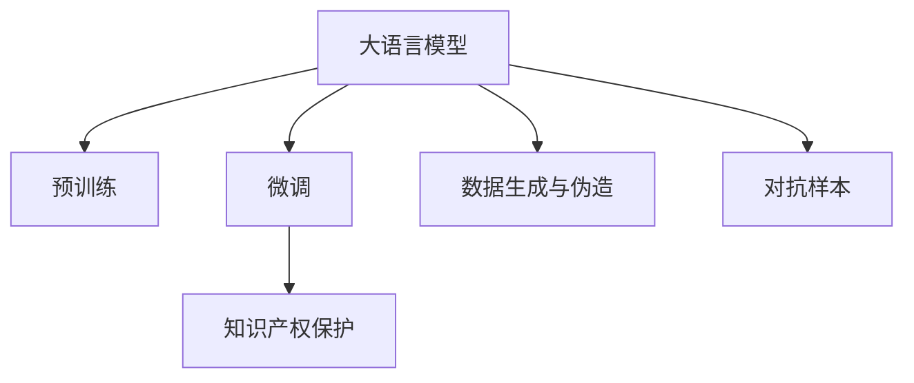

                 

## 1. 背景介绍

### 1.1 问题由来

随着人工智能（AI）技术的飞速发展，尤其是在自然语言处理（NLP）和深度学习（DL）领域，大型语言模型（Large Language Models，LLMs）已经展示了颠覆性的潜力。这些模型，如OpenAI的GPT-3、Google的BERT等，通过大规模的无标签文本数据进行预训练，学习了丰富的语言知识，并在各种任务上取得了优异的表现。然而，随之而来的问题也日益凸显：创新成果被盗用、知识产权被侵犯、假冒产品横行等。在数字化和全球化的今天，如何保护知识产权，成为了一个迫在眉睫的挑战。

### 1.2 问题核心关键点

在大语言模型（LLMs）日益广泛应用的背景下，如何构建一个既能发挥其创新潜力，又能有效保护知识产权的机制，成为一个亟待解决的问题。本文将聚焦于LLMs在知识产权保护方面的应用，探讨如何利用LLMs的强大语言理解能力，构建高效、可靠的知识产权保护机制。

## 2. 核心概念与联系

### 2.1 核心概念概述

为更好地理解LLMs在知识产权保护中的作用，本节将介绍几个关键概念：

- 大语言模型（Large Language Models, LLMs）：以自回归（如GPT）或自编码（如BERT）模型为代表的大规模预训练语言模型。通过在大规模无标签文本语料上进行预训练，学习通用的语言表示，具备强大的语言理解和生成能力。

- 预训练（Pre-training）：指在大规模无标签文本语料上，通过自监督学习任务训练通用语言模型的过程。常见的预训练任务包括言语建模、遮挡语言模型等。预训练使得模型学习到语言的通用表示。

- 微调（Fine-tuning）：指在预训练模型的基础上，使用下游任务的少量标注数据，通过有监督地训练优化模型在该任务上的性能。通常只需要调整顶层分类器或解码器，并以较小的学习率更新全部或部分的模型参数。

- 知识产权保护（Intellectual Property Protection）：指通过法律、技术、管理等手段，保护创作者对其智力成果的专有权利，防止未经授权的复制、使用和分发。

- 数据生成与伪造（Data Generation and Fabrication）：指利用语言模型生成虚假文本、伪造内容等，侵犯他人合法权益。

- 对抗样本（Adversarial Examples）：指通过细微的改动（如拼写错误、词序改变），使模型输出错误或不可靠的结果。

这些概念之间的逻辑关系可以通过以下Mermaid流程图来展示：



这个流程图展示了大语言模型的核心概念及其之间的关系：

1. 大语言模型通过预训练获得基础能力。
2. 微调是对预训练模型进行任务特定的优化，可以分为全参数微调和参数高效微调（PEFT）。
3. 数据生成与伪造是利用大语言模型生成虚假内容的风险，需要通过检测和过滤技术进行防范。
4. 对抗样本是大语言模型可能产生的输出错误，需要通过鲁棒性检测来防范。
5. 知识产权保护是大语言模型保护创新成果的应用场景，包括检测数据生成与伪造、对抗样本检测等。

这些概念共同构成了大语言模型的知识产权保护框架，使得LLMs能够安全、可靠地应用于各种场景。通过理解这些核心概念，我们可以更好地把握LLMs在知识产权保护中的工作原理和优化方向。

## 3. 核心算法原理 & 具体操作步骤
### 3.1 算法原理概述

LLMs在知识产权保护中的应用，主要是通过检测数据生成与伪造、对抗样本，以及保护原创内容等手段，构建一个安全的知识生态。其核心思想是利用LLMs的语言理解能力和知识表示能力，构建一个高效的检测和过滤系统，识别并阻断侵犯知识产权的行为。

具体来说，可以分为以下几类算法：

1. **数据生成与伪造检测**：通过训练LLM来识别虚假文本、伪造内容，检测生成的数据是否与原始数据一致。
2. **对抗样本检测**：训练LLM识别对抗样本，检测模型的输出是否正确，防范恶意攻击。
3. **原创内容保护**：训练LLM生成原创内容，验证文本的原创性，保护创作者权益。

这些算法通过有监督学习或自监督学习的方式进行训练，使其能够适应特定的检测任务，并在新数据上表现良好。

### 3.2 算法步骤详解

以下以数据生成与伪造检测为例，详细介绍LLMs在知识产权保护中的应用：

**Step 1: 准备数据集**

- 收集包含虚假文本和真实文本的数据集，如新闻、社交媒体帖子等。
- 将数据集划分为训练集、验证集和测试集。

**Step 2: 设计模型**

- 选择合适的预训练模型（如BERT、GPT等）作为初始化参数。
- 设计检测任务，如判断文本是否为虚假文本。
- 构建损失函数，如交叉熵损失函数。

**Step 3: 微调模型**

- 在训练集上使用有监督学习微调模型。
- 在验证集上评估模型性能，调整超参数。
- 在测试集上测试模型性能，评估检测效果。

**Step 4: 部署模型**

- 将训练好的模型部署到实际应用系统中。
- 实时监测和检测新数据，防范虚假内容。

**Step 5: 持续优化**

- 收集新数据，重新训练和微调模型。
- 集成用户反馈，改进检测算法。

### 3.3 算法优缺点

大语言模型在知识产权保护中的应用，具有以下优点：

1. **高效性**：利用大规模预训练模型的知识表示能力，可以在较短的时间内完成模型训练和部署。
2. **准确性**：通过有监督学习微调，模型在特定任务上能够取得较高的检测精度。
3. **灵活性**：可以根据需要调整模型架构和检测任务，适应不同的知识产权保护需求。

同时，也存在以下缺点：

1. **数据依赖**：模型检测效果很大程度上依赖于训练数据的质量和数量，难以适应数据分布变化。
2. **对抗攻击**：对抗样本和数据生成技术的发展，可能使模型检测能力失效。
3. **解释性不足**：模型的检测过程缺乏可解释性，难以理解和调试。

尽管存在这些局限性，但基于LLMs的知识产权保护技术仍是大规模应用的最佳范式之一，通过不断的技术创新和优化，可以显著提升模型的检测效果和鲁棒性。

### 3.4 算法应用领域

LLMs在知识产权保护中的应用领域广泛，涵盖了以下几个方面：

1. **新闻和社交媒体监控**：实时监控新闻和社交媒体内容，检测虚假信息、版权侵犯等。
2. **知识产权分析**：分析文档、文本等内容的知识产权属性，如专利、商标等。
3. **内容生成检测**：检测内容生成平台上的虚假内容、抄袭、版权侵犯等。
4. **版权保护**：保护文学、音乐、视频等原创作品的版权，检测未经授权的使用和分发。

这些应用场景为LLMs在知识产权保护领域的应用提供了广阔的空间，通过构建高效的检测和过滤系统，可以有效保护创新成果。

## 4. 数学模型和公式 & 详细讲解  
### 4.1 数学模型构建

本节将使用数学语言对LLMs在知识产权保护中的应用进行严格刻画。

记预训练语言模型为 $M_{\theta}$，其中 $\theta$ 为预训练得到的模型参数。假设检测任务为判断文本 $x$ 是否为虚假文本，对应的标签 $y \in \{0, 1\}$，其中 $0$ 表示文本为虚假文本，$1$ 表示文本为真实文本。

定义模型 $M_{\theta}$ 在输入 $x$ 上的输出为 $\hat{y}=M_{\theta}(x)$，输出结果通过一个Sigmoid函数转化为概率值，即 $P(y=1|x)=\sigma(\hat{y})$。检测任务的损失函数为交叉熵损失函数：

$$
\ell(M_{\theta}(x),y) = -y\log(\sigma(\hat{y})) - (1-y)\log(1-\sigma(\hat{y}))
$$

将上述损失函数扩展到整个数据集 $D=\{(x_i,y_i)\}_{i=1}^N$，得到经验风险：

$$
\mathcal{L}(\theta) = -\frac{1}{N}\sum_{i=1}^N [y_i\log M_{\theta}(x_i)+(1-y_i)\log(1-M_{\theta}(x_i))]
$$

微调的优化目标是最小化经验风险，即找到最优参数：

$$
\theta^* = \mathop{\arg\min}_{\theta} \mathcal{L}(\theta)
$$

在实践中，我们通常使用基于梯度的优化算法（如SGD、Adam等）来近似求解上述最优化问题。设 $\eta$ 为学习率，$\lambda$ 为正则化系数，则参数的更新公式为：

$$
\theta \leftarrow \theta - \eta \nabla_{\theta}\mathcal{L}(\theta) - \eta\lambda\theta
$$

其中 $\nabla_{\theta}\mathcal{L}(\theta)$ 为损失函数对参数 $\theta$ 的梯度，可通过反向传播算法高效计算。

### 4.2 公式推导过程

以下我们以二分类任务为例，推导交叉熵损失函数及其梯度的计算公式。

假设模型 $M_{\theta}$ 在输入 $x$ 上的输出为 $\hat{y}=M_{\theta}(x) \in [0,1]$，表示样本属于虚假的概率。真实标签 $y \in \{0,1\}$。则二分类交叉熵损失函数定义为：

$$
\ell(M_{\theta}(x),y) = -[y\log \hat{y} + (1-y)\log (1-\hat{y})]
$$

将其代入经验风险公式，得：

$$
\mathcal{L}(\theta) = -\frac{1}{N}\sum_{i=1}^N [y_i\log M_{\theta}(x_i)+(1-y_i)\log(1-M_{\theta}(x_i))]
$$

根据链式法则，损失函数对参数 $\theta_k$ 的梯度为：

$$
\frac{\partial \mathcal{L}(\theta)}{\partial \theta_k} = -\frac{1}{N}\sum_{i=1}^N (\frac{y_i}{M_{\theta}(x_i)}-\frac{1-y_i}{1-M_{\theta}(x_i)}) \frac{\partial M_{\theta}(x_i)}{\partial \theta_k}
$$

其中 $\frac{\partial M_{\theta}(x_i)}{\partial \theta_k}$ 可进一步递归展开，利用自动微分技术完成计算。

在得到损失函数的梯度后，即可带入参数更新公式，完成模型的迭代优化。重复上述过程直至收敛，最终得到适应检测任务的最优模型参数 $\theta^*$。

## 5. 项目实践：代码实例和详细解释说明
### 5.1 开发环境搭建

在进行知识产权保护模型开发前，我们需要准备好开发环境。以下是使用Python进行PyTorch开发的环境配置流程：

1. 安装Anaconda：从官网下载并安装Anaconda，用于创建独立的Python环境。

2. 创建并激活虚拟环境：
```bash
conda create -n pytorch-env python=3.8 
conda activate pytorch-env
```

3. 安装PyTorch：根据CUDA版本，从官网获取对应的安装命令。例如：
```bash
conda install pytorch torchvision torchaudio cudatoolkit=11.1 -c pytorch -c conda-forge
```

4. 安装Transformers库：
```bash
pip install transformers
```

5. 安装各类工具包：
```bash
pip install numpy pandas scikit-learn matplotlib tqdm jupyter notebook ipython
```

完成上述步骤后，即可在`pytorch-env`环境中开始知识产权保护模型的开发。

### 5.2 源代码详细实现

下面我们以虚假文本检测为例，给出使用Transformers库对BERT模型进行微调的PyTorch代码实现。

首先，定义虚假文本检测的数据处理函数：

```python
from transformers import BertTokenizer
from torch.utils.data import Dataset
import torch

class FalseTextDataset(Dataset):
    def __init__(self, texts, labels, tokenizer, max_len=128):
        self.texts = texts
        self.labels = labels
        self.tokenizer = tokenizer
        self.max_len = max_len
        
    def __len__(self):
        return len(self.texts)
    
    def __getitem__(self, item):
        text = self.texts[item]
        label = self.labels[item]
        
        encoding = self.tokenizer(text, return_tensors='pt', max_length=self.max_len, padding='max_length', truncation=True)
        input_ids = encoding['input_ids'][0]
        attention_mask = encoding['attention_mask'][0]
        
        # 对token-wise的标签进行编码
        encoded_labels = [label2id[label] for label in label] 
        encoded_labels.extend([label2id['O']] * (self.max_len - len(encoded_labels)))
        labels = torch.tensor(encoded_labels, dtype=torch.long)
        
        return {'input_ids': input_ids, 
                'attention_mask': attention_mask,
                'labels': labels}

# 标签与id的映射
label2id = {'False': 0, 'True': 1}
id2label = {v: k for k, v in label2id.items()}

# 创建dataset
tokenizer = BertTokenizer.from_pretrained('bert-base-cased')

train_dataset = FalseTextDataset(train_texts, train_labels, tokenizer)
dev_dataset = FalseTextDataset(dev_texts, dev_labels, tokenizer)
test_dataset = FalseTextDataset(test_texts, test_labels, tokenizer)
```

然后，定义模型和优化器：

```python
from transformers import BertForTokenClassification, AdamW

model = BertForTokenClassification.from_pretrained('bert-base-cased', num_labels=len(label2id))

optimizer = AdamW(model.parameters(), lr=2e-5)
```

接着，定义训练和评估函数：

```python
from torch.utils.data import DataLoader
from tqdm import tqdm
from sklearn.metrics import classification_report

device = torch.device('cuda') if torch.cuda.is_available() else torch.device('cpu')
model.to(device)

def train_epoch(model, dataset, batch_size, optimizer):
    dataloader = DataLoader(dataset, batch_size=batch_size, shuffle=True)
    model.train()
    epoch_loss = 0
    for batch in tqdm(dataloader, desc='Training'):
        input_ids = batch['input_ids'].to(device)
        attention_mask = batch['attention_mask'].to(device)
        labels = batch['labels'].to(device)
        model.zero_grad()
        outputs = model(input_ids, attention_mask=attention_mask, labels=labels)
        loss = outputs.loss
        epoch_loss += loss.item()
        loss.backward()
        optimizer.step()
    return epoch_loss / len(dataloader)

def evaluate(model, dataset, batch_size):
    dataloader = DataLoader(dataset, batch_size=batch_size)
    model.eval()
    preds, labels = [], []
    with torch.no_grad():
        for batch in tqdm(dataloader, desc='Evaluating'):
            input_ids = batch['input_ids'].to(device)
            attention_mask = batch['attention_mask'].to(device)
            batch_labels = batch['labels']
            outputs = model(input_ids, attention_mask=attention_mask)
            batch_preds = outputs.logits.argmax(dim=2).to('cpu').tolist()
            batch_labels = batch_labels.to('cpu').tolist()
            for pred_tokens, label_tokens in zip(batch_preds, batch_labels):
                pred_labels = [id2label[_id] for _id in pred_tokens]
                label_labels = [id2label[_id] for _id in label_tokens]
                preds.append(pred_labels[:len(label_labels)])
                labels.append(label_labels)
                
    print(classification_report(labels, preds))
```

最后，启动训练流程并在测试集上评估：

```python
epochs = 5
batch_size = 16

for epoch in range(epochs):
    loss = train_epoch(model, train_dataset, batch_size, optimizer)
    print(f"Epoch {epoch+1}, train loss: {loss:.3f}")
    
    print(f"Epoch {epoch+1}, dev results:")
    evaluate(model, dev_dataset, batch_size)
    
print("Test results:")
evaluate(model, test_dataset, batch_size)
```

以上就是使用PyTorch对BERT进行虚假文本检测的完整代码实现。可以看到，得益于Transformers库的强大封装，我们可以用相对简洁的代码完成BERT模型的加载和微调。

### 5.3 代码解读与分析

让我们再详细解读一下关键代码的实现细节：

**FalseTextDataset类**：
- `__init__`方法：初始化文本、标签、分词器等关键组件。
- `__len__`方法：返回数据集的样本数量。
- `__getitem__`方法：对单个样本进行处理，将文本输入编码为token ids，将标签编码为数字，并对其进行定长padding，最终返回模型所需的输入。

**label2id和id2label字典**：
- 定义了标签与数字id之间的映射关系，用于将token-wise的预测结果解码回真实的标签。

**训练和评估函数**：
- 使用PyTorch的DataLoader对数据集进行批次化加载，供模型训练和推理使用。
- 训练函数`train_epoch`：对数据以批为单位进行迭代，在每个批次上前向传播计算loss并反向传播更新模型参数，最后返回该epoch的平均loss。
- 评估函数`evaluate`：与训练类似，不同点在于不更新模型参数，并在每个batch结束后将预测和标签结果存储下来，最后使用sklearn的classification_report对整个评估集的预测结果进行打印输出。

**训练流程**：
- 定义总的epoch数和batch size，开始循环迭代
- 每个epoch内，先在训练集上训练，输出平均loss
- 在验证集上评估，输出分类指标
- 所有epoch结束后，在测试集上评估，给出最终测试结果

可以看到，PyTorch配合Transformers库使得BERT微调的代码实现变得简洁高效。开发者可以将更多精力放在数据处理、模型改进等高层逻辑上，而不必过多关注底层的实现细节。

当然，工业级的系统实现还需考虑更多因素，如模型的保存和部署、超参数的自动搜索、更灵活的任务适配层等。但核心的微调范式基本与此类似。

## 6. 实际应用场景
### 6.1 智能合约检测

智能合约是一种在区块链上自动执行、可验证、无需人工干预的合约。由于智能合约代码公开透明，任何人都可以对其进行编辑和攻击。因此，构建一个高效的智能合约检测系统，对于保障智能合约的安全性和可靠性至关重要。

LLMs可以用于智能合约检测，通过训练模型来识别潜在的安全漏洞、恶意代码、篡改行为等。具体而言，可以收集智能合约的源代码、审计报告等文本数据，构建一个标注有安全漏洞和安全性的数据集。在此基础上，对预训练的LLMs进行微调，使其能够识别代码中的潜在风险。微调后的模型可以在新合同的审计过程中，自动检测其中的安全问题，提高审计效率和准确性。

### 6.2 版权侵权检测

版权侵权检测是大语言模型在知识产权保护中的一个重要应用。传统的版权检测方法往往依赖于文本相似度计算和专家知识，难以处理大规模数据和复杂情境。而LLMs可以通过训练，学习到更加准确、全面的版权信息表示。

具体而言，可以收集包含版权声明、作者信息、出版时间等的数据集，构建一个标注有版权信息的标注集。在此基础上，对预训练的LLMs进行微调，使其能够识别文本中的版权信息。微调后的模型可以应用于版权监测平台，实时检测新上传的内容是否侵犯他人版权，从而有效打击侵权行为。

### 6.3 技术文档生成

在软件开发和维护过程中，技术文档的生成和维护是一个重要但繁琐的任务。传统方法往往需要大量的人力和时间，且难以保证文档的准确性和时效性。而利用LLMs，可以自动生成高质量的技术文档，提高文档生成效率和质量。

具体而言，可以收集项目代码、注释、API文档等数据，构建一个标注有技术信息的数据集。在此基础上，对预训练的LLMs进行微调，使其能够生成准确、详细、格式规范的技术文档。微调后的模型可以在代码编写过程中，自动生成API文档、注释等，减轻开发者的工作负担，提高文档的生成效率和质量。

### 6.4 未来应用展望

随着LLMs技术的不断进步，其在知识产权保护中的应用将更加广泛和深入。未来，基于LLMs的知识产权保护技术可能会在以下几个方向进一步发展：

1. **跨领域知识融合**：将LLMs与知识图谱、逻辑推理等技术结合，构建一个更加全面、准确的知识产权保护系统。
2. **深度学习与因果推理结合**：利用因果推理方法，增强LLMs在识别因果关系方面的能力，提高模型的可解释性和可靠性。
3. **多模态信息融合**：将LLMs应用于跨模态信息融合，结合文本、图像、语音等多种模态信息，构建一个更加全面、准确的知识产权保护系统。
4. **联邦学习与边缘计算结合**：将LLMs应用于联邦学习与边缘计算技术，构建一个分布式、高效、安全的知识产权保护系统。
5. **自监督学习与无监督学习结合**：利用自监督学习和大规模无标签数据，提高LLMs在知识产权保护中的泛化能力和鲁棒性。

这些技术的发展将进一步推动LLMs在知识产权保护中的应用，为构建安全、可靠、高效的知识生态提供更加坚实的技术保障。

## 7. 工具和资源推荐
### 7.1 学习资源推荐

为了帮助开发者系统掌握LLMs在知识产权保护方面的应用，这里推荐一些优质的学习资源：

1. 《深度学习与NLP》系列博文：由大模型技术专家撰写，深入浅出地介绍了深度学习与NLP的原理、模型、应用等。

2. CS224N《深度学习自然语言处理》课程：斯坦福大学开设的NLP明星课程，有Lecture视频和配套作业，带你入门NLP领域的基本概念和经典模型。

3. 《Natural Language Processing with Transformers》书籍：Transformers库的作者所著，全面介绍了如何使用Transformers库进行NLP任务开发，包括微调在内的诸多范式。

4. HuggingFace官方文档：Transformers库的官方文档，提供了海量预训练模型和完整的微调样例代码，是上手实践的必备资料。

5. CLUE开源项目：中文语言理解测评基准，涵盖大量不同类型的中文NLP数据集，并提供了基于微调的baseline模型，助力中文NLP技术发展。

通过对这些资源的学习实践，相信你一定能够快速掌握LLMs在知识产权保护中的应用，并用于解决实际的NLP问题。
###  7.2 开发工具推荐

高效的开发离不开优秀的工具支持。以下是几款用于LLMs开发和知识产权保护开发的常用工具：

1. PyTorch：基于Python的开源深度学习框架，灵活动态的计算图，适合快速迭代研究。大部分预训练语言模型都有PyTorch版本的实现。

2. TensorFlow：由Google主导开发的开源深度学习框架，生产部署方便，适合大规模工程应用。同样有丰富的预训练语言模型资源。

3. Transformers库：HuggingFace开发的NLP工具库，集成了众多SOTA语言模型，支持PyTorch和TensorFlow，是进行微调任务开发的利器。

4. Weights & Biases：模型训练的实验跟踪工具，可以记录和可视化模型训练过程中的各项指标，方便对比和调优。与主流深度学习框架无缝集成。

5. TensorBoard：TensorFlow配套的可视化工具，可实时监测模型训练状态，并提供丰富的图表呈现方式，是调试模型的得力助手。

6. Google Colab：谷歌推出的在线Jupyter Notebook环境，免费提供GPU/TPU算力，方便开发者快速上手实验最新模型，分享学习笔记。

合理利用这些工具，可以显著提升LLMs在知识产权保护中的开发效率，加快创新迭代的步伐。

### 7.3 相关论文推荐

LLMs在知识产权保护中的应用源于学界的持续研究。以下是几篇奠基性的相关论文，推荐阅读：

1. Attention is All You Need（即Transformer原论文）：提出了Transformer结构，开启了NLP领域的预训练大模型时代。

2. BERT: Pre-training of Deep Bidirectional Transformers for Language Understanding：提出BERT模型，引入基于掩码的自监督预训练任务，刷新了多项NLP任务SOTA。

3. Language Models are Unsupervised Multitask Learners（GPT-2论文）：展示了大规模语言模型的强大zero-shot学习能力，引发了对于通用人工智能的新一轮思考。

4. Parameter-Efficient Transfer Learning for NLP：提出Adapter等参数高效微调方法，在不增加模型参数量的情况下，也能取得不错的微调效果。

5. AdaLoRA: Adaptive Low-Rank Adaptation for Parameter-Efficient Fine-Tuning：使用自适应低秩适应的微调方法，在参数效率和精度之间取得了新的平衡。

6. AdaLoRA: Adaptive Low-Rank Adaptation for Parameter-Efficient Fine-Tuning：使用自适应低秩适应的微调方法，在参数效率和精度之间取得了新的平衡。

这些论文代表了大语言模型微调技术的发展脉络。通过学习这些前沿成果，可以帮助研究者把握学科前进方向，激发更多的创新灵感。

## 8. 总结：未来发展趋势与挑战

### 8.1 总结

本文对基于LLMs的知识产权保护进行了全面系统的介绍。首先阐述了LLMs在知识产权保护方面的应用背景和意义，明确了LLMs在检测数据生成与伪造、对抗样本、原创内容保护等方面的独特价值。其次，从原理到实践，详细讲解了LLMs在知识产权保护中的应用流程，包括数据准备、模型微调、评估测试等关键步骤。同时，本文还广泛探讨了LLMs在多个行业领域的应用前景，展示了LLMs在知识产权保护中的巨大潜力。此外，本文精选了LLMs技术的各类学习资源，力求为开发者提供全方位的技术指引。

通过本文的系统梳理，可以看到，基于LLMs的知识产权保护技术正在成为NLP领域的重要范式，极大地拓展了预训练语言模型的应用边界，催生了更多的落地场景。受益于大规模语料的预训练，LLMs在特定任务上能够取得较高的检测精度，有力推动了知识产权保护技术的发展。未来，伴随预训练语言模型和微调方法的持续演进，相信LLMs在知识产权保护领域的应用将更加广泛和深入。

### 8.2 未来发展趋势

展望未来，基于LLMs的知识产权保护技术将呈现以下几个发展趋势：

1. **数据自监督学习**：利用自监督学习和大规模无标签数据，提高LLMs在知识产权保护中的泛化能力和鲁棒性。
2. **跨领域知识融合**：将LLMs与知识图谱、逻辑推理等技术结合，构建一个更加全面、准确的知识产权保护系统。
3. **深度学习与因果推理结合**：利用因果推理方法，增强LLMs在识别因果关系方面的能力，提高模型的可解释性和可靠性。
4. **多模态信息融合**：将LLMs应用于跨模态信息融合，结合文本、图像、语音等多种模态信息，构建一个更加全面、准确的知识产权保护系统。
5. **联邦学习与边缘计算结合**：将LLMs应用于联邦学习与边缘计算技术，构建一个分布式、高效、安全的知识产权保护系统。
6. **对抗训练与鲁棒性检测**：利用对抗训练技术，增强LLMs在对抗样本攻击中的鲁棒性，提高系统的安全性和可靠性。

这些趋势凸显了基于LLMs的知识产权保护技术的广阔前景。这些方向的探索发展，必将进一步提升LLMs在知识产权保护中的应用效果和鲁棒性，为构建安全、可靠、高效的知识生态提供更加坚实的技术保障。

### 8.3 面临的挑战

尽管基于LLMs的知识产权保护技术已经取得了显著进展，但在迈向更加智能化、普适化应用的过程中，仍面临诸多挑战：

1. **数据依赖**：模型检测效果很大程度上依赖于训练数据的质量和数量，难以适应数据分布变化。如何进一步降低微调对标注样本的依赖，将是一大难题。
2. **对抗攻击**：对抗样本和数据生成技术的发展，可能使模型检测能力失效。如何提高模型的鲁棒性，防范恶意攻击，还需要更多理论和实践的积累。
3. **解释性不足**：模型的检测过程缺乏可解释性，难以理解和调试。如何赋予LLMs更强的可解释性，将是亟待攻克的难题。
4. **安全性不足**：预训练语言模型难免会学习到有偏见、有害的信息，通过LLMs传递到知识产权保护领域，可能造成负面影响。如何从数据和算法层面消除模型偏见，确保输出的安全性，也将是重要的研究课题。

尽管存在这些挑战，但基于LLMs的知识产权保护技术仍是大规模应用的最佳范式之一，通过不断的技术创新和优化，可以显著提升模型的检测效果和鲁棒性。

### 8.4 研究展望

面对LLMs在知识产权保护所面临的挑战，未来的研究需要在以下几个方面寻求新的突破：

1. **无监督和半监督学习**：摆脱对大规模标注数据的依赖，利用自监督学习、主动学习等无监督和半监督范式，最大限度利用非结构化数据，实现更加灵活高效的知识产权保护。
2. **参数高效和计算高效**：开发更加参数高效的LLMs微调方法，在固定大部分预训练参数的同时，只更新极少量的任务相关参数。同时优化LLMs的计算图，减少前向传播和反向传播的资源消耗，实现更加轻量级、实时性的部署。
3. **因果分析和博弈论工具**：将因果分析方法引入LLMs，识别出模型决策的关键特征，增强输出解释的因果性和逻辑性。借助博弈论工具刻画人机交互过程，主动探索并规避模型的脆弱点，提高系统稳定性。
4. **伦理道德约束**：在模型训练目标中引入伦理导向的评估指标，过滤和惩罚有偏见、有害的输出倾向。同时加强人工干预和审核，建立模型行为的监管机制，确保输出符合人类价值观和伦理道德。

这些研究方向的探索，必将引领LLMs在知识产权保护中的应用迈向更高的台阶，为构建安全、可靠、可解释、可控的智能系统铺平道路。面向未来，LLMs在知识产权保护技术还需要与其他人工智能技术进行更深入的融合，如知识表示、因果推理、强化学习等，多路径协同发力，共同推动自然语言理解和智能交互系统的进步。只有勇于创新、敢于突破，才能不断拓展语言模型的边界，让智能技术更好地造福人类社会。

## 9. 附录：常见问题与解答

**Q1：基于LLMs的知识产权保护是否适用于所有NLP任务？**

A: 基于LLMs的知识产权保护在大多数NLP任务上都能取得不错的效果，特别是对于数据量较小的任务。但对于一些特定领域的任务，如医学、法律等，仅仅依靠通用语料预训练的模型可能难以很好地适应。此时需要在特定领域语料上进一步预训练，再进行微调，才能获得理想效果。此外，对于一些需要时效性、个性化很强的任务，如对话、推荐等，LLMs也需要针对性的改进优化。

**Q2：LLMs在知识产权保护中的数据依赖问题如何解决？**

A: 数据依赖是LLMs在知识产权保护中的一大挑战。为了降低对标注数据的依赖，可以探索无监督和半监督学习技术，利用自监督学习、主动学习等方法，最大限度利用非结构化数据，实现更加灵活高效的知识产权保护。

**Q3：LLMs在知识产权保护中如何提高模型的鲁棒性？**

A: 对抗样本和数据生成技术的发展，可能使模型检测能力失效。为了提高LLMs的鲁棒性，可以引入对抗训练技术，构建一个鲁棒性更强的检测系统。此外，可以通过集成多种检测方法，构建一个更加健壮的保护系统。

**Q4：LLMs在知识产权保护中的可解释性不足如何解决？**

A: 模型的检测过程缺乏可解释性，难以理解和调试。为了赋予LLMs更强的可解释性，可以引入因果分析方法，增强模型的可解释性和可理解性。同时，可以借助博弈论工具，刻画人机交互过程，主动探索并规避模型的脆弱点，提高系统的稳定性。

**Q5：如何从数据和算法层面消除LLMs中的偏见和有害信息？**

A: 预训练语言模型难免会学习到有偏见、有害的信息，通过LLMs传递到知识产权保护领域，可能造成负面影响。为了消除偏见和有害信息，需要在模型训练目标中引入伦理导向的评估指标，过滤和惩罚有偏见、有害的输出倾向。同时加强人工干预和审核，建立模型行为的监管机制，确保输出符合人类价值观和伦理道德。

---

作者：禅与计算机程序设计艺术 / Zen and the Art of Computer Programming

