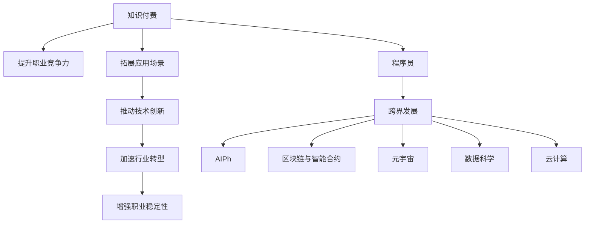

                 

# 知识付费与程序员跨界发展的机会

> 关键词：知识付费, 程序员, 跨界发展, 人工智能, 区块链, 智能合约, 元宇宙, 数据科学, 云计算

## 1. 背景介绍

### 1.1 问题由来

在互联网快速发展的今天，知识付费已经成为了一个不可逆转的趋势。随着人们对知识的需求日益增长，传统的教育模式已经无法满足需求，人们更倾向于通过付费获取高质量、高效益的知识内容。程序员作为互联网的重要基石，其技术水平和跨界能力直接影响着行业的发展。在知识付费的时代背景下，程序员不仅要掌握编程技能，更需要跨界发展，以获得更多的职业机会和更高的收入水平。

### 1.2 问题核心关键点

知识付费的本质是通过付费获取有价值的知识。在技术快速迭代的今天，程序员需要不断更新自己的知识体系，掌握新的技术和工具。跨界发展则是指程序员不仅要精通自己熟悉的领域，还需要掌握其他领域的知识，拓宽职业发展的道路。程序员跨界发展主要关注以下几个方面：

1. **人工智能**：人工智能是当前最热门的技术之一，程序员可以通过学习AI相关的知识，提升自己在智能应用开发、数据分析、机器学习等领域的能力。
2. **区块链和智能合约**：区块链和智能合约技术在金融、供应链、版权等领域有广泛应用，程序员掌握这些技术可以拓展自己的应用场景。
3. **元宇宙**：元宇宙是一个虚拟的、开放的、可交互的互联网生态系统，程序员可以涉足虚拟现实（VR）、增强现实（AR）、3D建模等领域，提升自身技术能力。
4. **数据科学**：数据科学是大数据时代的关键技术，程序员需要掌握数据收集、处理、分析、可视化等技能，以应对数据驱动的决策需求。
5. **云计算**：云计算技术改变了企业的IT基础设施，程序员需要掌握云服务、容器化、微服务、DevOps等技术，提升工作效率和协作能力。

这些核心能力为程序员提供了跨界发展的机会，帮助他们在知识付费的时代中脱颖而出。

### 1.3 问题研究意义

研究知识付费与程序员跨界发展的机会，对于提升程序员的职业竞争力、拓展其应用领域、推动技术创新具有重要意义：

1. **提升职业竞争力**：掌握多样化的技能可以提升程序员的市场竞争力，帮助他们在职业发展中占据优势地位。
2. **拓展应用场景**：跨界发展可以拓宽程序员的应用场景，使其不仅限于传统的软件开发，还能涉足AI、区块链、元宇宙等多个领域。
3. **推动技术创新**：跨界发展的程序员可以在不同技术之间进行知识融合，推动技术创新，为企业和社会带来更多价值。
4. **加速行业转型**：跨界发展的程序员可以推动各行各业的数字化转型，加速其向智能化、自动化方向发展。
5. **增强职业稳定性**：掌握多种技能可以增强程序员的职业稳定性，使其在面对行业变化时更具适应性。

## 2. 核心概念与联系

### 2.1 核心概念概述

为更好地理解知识付费与程序员跨界发展的机会，本节将介绍几个密切相关的核心概念：

- **知识付费**：指用户通过付费获取知识内容，提升自身技能和知识水平的行为。知识付费的流行趋势源于互联网技术的普及和人们对于知识获取的需求增长。
- **程序员**：指从事软件开发、系统维护、数据分析等相关工作的人员。程序员是IT行业的重要力量，其技术水平直接影响着行业的发展。
- **跨界发展**：指程序员在掌握自身领域知识的基础上，涉足其他领域，拓展职业发展道路的行为。跨界发展有助于程序员提升综合能力，适应行业变化。
- **人工智能**：指通过计算机算法和模型，使计算机具有人类智能的能力。人工智能在自然语言处理、计算机视觉、机器人等领域有广泛应用。
- **区块链**：指一种分布式数据库技术，通过加密和共识机制，实现数据的去中心化和安全性。区块链在金融、供应链、版权等领域有广泛应用。
- **智能合约**：指基于区块链技术的自动化合约，能够自动执行合同条款，提高交易效率和透明度。
- **元宇宙**：指一个虚拟的、开放的、可交互的互联网生态系统，通过VR、AR、3D建模等技术，实现虚拟与现实的融合。
- **数据科学**：指通过数据收集、处理、分析、可视化等技术，进行数据分析和决策支持。
- **云计算**：指通过互联网提供计算、存储、网络等资源的服务模式，推动企业IT基础设施的变革。

这些核心概念之间的逻辑关系可以通过以下Mermaid流程图来展示：



这个流程图展示了知识付费、程序员和跨界发展之间的关系，以及这些概念如何相互作用，提升程序员的职业能力和应用领域。

## 3. 核心算法原理 & 具体操作步骤
### 3.1 算法原理概述

知识付费与程序员跨界发展的机会，本质上是一个基于市场需求和技能提升的过程。其核心思想是：通过付费获取知识，掌握新技能，提升职业竞争力，拓宽应用场景，推动技术创新，增强职业稳定性。

形式化地，假设程序员当前掌握的技能集为 $S$，需要掌握的新技能为 $N$，知识付费的投入为 $P$，跨界发展的收益为 $R$，则最优策略为：

$$
\max_{S,N,P} R - P
$$

其中 $R$ 是跨界发展的总收益，包括但不限于提升职业竞争力、拓展应用场景、推动技术创新和增强职业稳定性。 $P$ 是知识付费的投入，包括但不限于课程费用、学习工具费用、培训费用等。

### 3.2 算法步骤详解

程序员跨界发展的步骤大致如下：

**Step 1: 确定目标技能集**
- 明确自身职业发展方向，确定需要掌握的新技能集 $N$。
- 评估这些新技能的市场需求和价值，确定投资回报率。

**Step 2: 选择知识付费平台**
- 根据自身需求和预算，选择合适的知识付费平台，如Coursera、Udacity、edX等。
- 选择适合自己的课程和学习资源，并进行课程安排。

**Step 3: 学习新技能**
- 按照课程安排，投入时间和精力，学习新技能。
- 利用在线学习工具和实践项目，巩固学习效果。

**Step 4: 拓展应用场景**
- 在掌握新技能的基础上，拓展应用场景，如参加相关项目、加入专业社区、发布技术文章等。
- 逐步积累实际经验，提升自身技术能力。

**Step 5: 推动技术创新**
- 将新技能应用到实际工作中，推动技术创新，解决实际问题。
- 参与开源项目，与同行交流，分享技术成果。

**Step 6: 增强职业稳定性**
- 通过不断的学习和实践，增强自身技能的多样性和深度。
- 掌握多种技术手段，提升应对行业变化的能力。

### 3.3 算法优缺点

知识付费与程序员跨界发展的方法具有以下优点：

1. **针对性**：通过付费学习，程序员可以更有针对性地掌握新技能，提升自身职业竞争力。
2. **效率高**：知识付费平台提供的课程和资源通常是经过精心设计和实践验证的，能够帮助程序员快速掌握新技能。
3. **实用性**：课程通常结合实际项目和案例，程序员可以更好地理解新技能的应用场景和实践方法。

同时，该方法也存在一些局限性：

1. **费用高**：知识付费课程往往价格不菲，对于没有经济基础的程序员可能难以承受。
2. **学习压力**：课程安排密集，程序员需要投入大量时间和精力，可能影响日常工作和生活。
3. **效果不一**：不同课程质量参差不齐，需要程序员具备一定的甄别能力。
4. **缺乏实践**：部分课程理论性强，缺乏实践环节，可能难以完全掌握新技能。

尽管存在这些局限性，但就目前而言，知识付费与程序员跨界发展的机会是提升程序员技能和职业发展的重要手段。未来相关研究的重点在于如何降低知识付费的门槛，提高课程质量，提供更多的实践机会。

### 3.4 算法应用领域

知识付费与程序员跨界发展的机会在多个领域都有广泛的应用，例如：

- **人工智能领域**：程序员可以通过学习机器学习、深度学习、自然语言处理等技能，提升自身在AI领域的能力。
- **区块链与智能合约领域**：程序员可以涉足区块链开发、智能合约编写、加密技术等，拓展应用场景。
- **元宇宙领域**：程序员可以掌握VR、AR、3D建模等技术，参与元宇宙生态系统的建设。
- **数据科学领域**：程序员可以学习数据收集、数据清洗、数据分析、数据可视化等技能，提升数据处理能力。
- **云计算领域**：程序员可以掌握云服务、容器化、微服务、DevOps等技术，提升工作效率和协作能力。

除了上述这些经典领域外，知识付费与程序员跨界发展的机会也被创新性地应用到更多场景中，如智能家居、智能制造、智慧医疗等，为技术创新提供了新的思路。

## 4. 数学模型和公式 & 详细讲解  
### 4.1 数学模型构建

本节将使用数学语言对知识付费与程序员跨界发展的机会进行更加严格的刻画。

记程序员当前掌握的技能集为 $S$，需要掌握的新技能为 $N$，知识付费的投入为 $P$，跨界发展的收益为 $R$。

定义程序员通过付费学习掌握新技能后的技能集为 $S'$，则有：

$$
S' = S \cup N
$$

定义跨界发展的收益函数为 $R(S', N)$，则：

$$
R(S', N) = \max_{S', N} R
$$

其中 $R$ 表示跨界发展的总收益，包括但不限于提升职业竞争力、拓展应用场景、推动技术创新和增强职业稳定性。

### 4.2 公式推导过程

以下我们以人工智能领域为例，推导学习新技能后收益函数 $R(S', N)$ 的计算公式。

假设程序员当前掌握的技能为 $S$，需要掌握的新技能为 $N$，则学习后技能集 $S'$ 的收益函数为：

$$
R(S', N) = f_1(S') + f_2(S') + f_3(S') + \cdots + f_k(S')
$$

其中 $f_i(S')$ 表示掌握新技能 $N_i$ 后，提升职业竞争力、拓展应用场景、推动技术创新和增强职业稳定性等方面的收益。

在实践中，我们可以通过问卷调查、用户反馈、市场数据等方式，获取不同技能对收益的影响权重，进而得到收益函数的具体表达式：

$$
R(S', N) = \sum_{i=1}^{k} w_i f_i(S')
$$

其中 $w_i$ 表示技能 $N_i$ 对收益的影响权重。

在得到收益函数后，我们就可以利用优化算法求解最优的技能集 $S'$，使其最大化收益函数 $R(S', N)$。

### 4.3 案例分析与讲解

假设程序员当前掌握的技能为 $S=\{Python, Django\}$，需要掌握的新技能为 $N=\{TensorFlow, PyTorch\}$，知识付费的投入为 $P=2000$。

首先，我们计算学习后技能集 $S'=\{Python, Django, TensorFlow, PyTorch\}$ 的收益函数 $R(S', N)$：

$$
R(S', N) = 0.5 f_1(S') + 0.2 f_2(S') + 0.3 f_3(S') + 0.1 f_4(S')
$$

其中 $f_1(S')$ 表示掌握Python和Django后，提升职业竞争力的收益，$f_2(S')$ 表示拓展应用场景的收益，$f_3(S')$ 表示推动技术创新的收益，$f_4(S')$ 表示增强职业稳定性的收益。

通过问卷调查和市场数据，我们得到 $w_1=0.5$，$w_2=0.2$，$w_3=0.3$，$w_4=0.1$。

假设 $f_1(S')=1000$，$f_2(S')=800$，$f_3(S')=1200$，$f_4(S')=600$，则收益函数 $R(S', N)$ 计算如下：

$$
R(S', N) = 0.5 \times 1000 + 0.2 \times 800 + 0.3 \times 1200 + 0.1 \times 600 = 1730
$$

比较不同技能集的收益，我们可以得出最优的技能集 $S'$。

通过上述分析，我们可以看到，知识付费与程序员跨界发展的机会可以量化为具体的数学模型，通过优化算法求解最优解，帮助程序员科学地规划学习路径，提升职业竞争力。

## 5. 项目实践：代码实例和详细解释说明
### 5.1 开发环境搭建

在进行知识付费与程序员跨界发展的机会实践前，我们需要准备好开发环境。以下是使用Python进行项目开发的环境配置流程：

1. 安装Anaconda：从官网下载并安装Anaconda，用于创建独立的Python环境。

2. 创建并激活虚拟环境：
```bash
conda create -n pyenv python=3.8 
conda activate pyenv
```

3. 安装PyTorch：根据CUDA版本，从官网获取对应的安装命令。例如：
```bash
conda install pytorch torchvision torchaudio cudatoolkit=11.1 -c pytorch -c conda-forge
```

4. 安装TensorFlow：
```bash
conda install tensorflow
```

5. 安装transformers库：
```bash
pip install transformers
```

6. 安装各类工具包：
```bash
pip install numpy pandas scikit-learn matplotlib tqdm jupyter notebook ipython
```

完成上述步骤后，即可在`pyenv`环境中开始项目实践。

### 5.2 源代码详细实现

这里我们以人工智能领域为例，给出使用Transformers库对BERT模型进行微调的PyTorch代码实现。

首先，定义人工智能领域的数据处理函数：

```python
from transformers import BertTokenizer
from torch.utils.data import Dataset
import torch

class AI_dataset(Dataset):
    def __init__(self, texts, labels, tokenizer, max_len=128):
        self.texts = texts
        self.labels = labels
        self.tokenizer = tokenizer
        self.max_len = max_len
        
    def __len__(self):
        return len(self.texts)
    
    def __getitem__(self, item):
        text = self.texts[item]
        label = self.labels[item]
        
        encoding = self.tokenizer(text, return_tensors='pt', max_length=self.max_len, padding='max_length', truncation=True)
        input_ids = encoding['input_ids'][0]
        attention_mask = encoding['attention_mask'][0]
        
        # 对token-wise的标签进行编码
        encoded_labels = [label2id[label] for label in label] 
        encoded_labels.extend([label2id['O']] * (self.max_len - len(encoded_labels)))
        labels = torch.tensor(encoded_labels, dtype=torch.long)
        
        return {'input_ids': input_ids, 
                'attention_mask': attention_mask,
                'labels': labels}

# 标签与id的映射
label2id = {'O': 0, 'A': 1, 'B': 2, 'C': 3}
id2label = {v: k for k, v in label2id.items()}

# 创建dataset
tokenizer = BertTokenizer.from_pretrained('bert-base-cased')

train_dataset = AI_dataset(train_texts, train_labels, tokenizer)
dev_dataset = AI_dataset(dev_texts, dev_labels, tokenizer)
test_dataset = AI_dataset(test_texts, test_labels, tokenizer)
```

然后，定义模型和优化器：

```python
from transformers import BertForTokenClassification, AdamW

model = BertForTokenClassification.from_pretrained('bert-base-cased', num_labels=len(label2id))

optimizer = AdamW(model.parameters(), lr=2e-5)
```

接着，定义训练和评估函数：

```python
from torch.utils.data import DataLoader
from tqdm import tqdm
from sklearn.metrics import classification_report

device = torch.device('cuda') if torch.cuda.is_available() else torch.device('cpu')
model.to(device)

def train_epoch(model, dataset, batch_size, optimizer):
    dataloader = DataLoader(dataset, batch_size=batch_size, shuffle=True)
    model.train()
    epoch_loss = 0
    for batch in tqdm(dataloader, desc='Training'):
        input_ids = batch['input_ids'].to(device)
        attention_mask = batch['attention_mask'].to(device)
        labels = batch['labels'].to(device)
        model.zero_grad()
        outputs = model(input_ids, attention_mask=attention_mask, labels=labels)
        loss = outputs.loss
        epoch_loss += loss.item()
        loss.backward()
        optimizer.step()
    return epoch_loss / len(dataloader)

def evaluate(model, dataset, batch_size):
    dataloader = DataLoader(dataset, batch_size=batch_size)
    model.eval()
    preds, labels = [], []
    with torch.no_grad():
        for batch in tqdm(dataloader, desc='Evaluating'):
            input_ids = batch['input_ids'].to(device)
            attention_mask = batch['attention_mask'].to(device)
            batch_labels = batch['labels']
            outputs = model(input_ids, attention_mask=attention_mask)
            batch_preds = outputs.logits.argmax(dim=2).to('cpu').tolist()
            batch_labels = batch_labels.to('cpu').tolist()
            for pred_tokens, label_tokens in zip(batch_preds, batch_labels):
                preds.append(pred_tokens[:len(label_tokens)])
                labels.append(label_tokens)
                
    print(classification_report(labels, preds))
```

最后，启动训练流程并在测试集上评估：

```python
epochs = 5
batch_size = 16

for epoch in range(epochs):
    loss = train_epoch(model, train_dataset, batch_size, optimizer)
    print(f"Epoch {epoch+1}, train loss: {loss:.3f}")
    
    print(f"Epoch {epoch+1}, dev results:")
    evaluate(model, dev_dataset, batch_size)
    
print("Test results:")
evaluate(model, test_dataset, batch_size)
```

以上就是使用PyTorch对BERT进行人工智能任务微调的完整代码实现。可以看到，得益于Transformers库的强大封装，我们可以用相对简洁的代码完成BERT模型的加载和微调。

### 5.3 代码解读与分析

让我们再详细解读一下关键代码的实现细节：

**AI_dataset类**：
- `__init__`方法：初始化文本、标签、分词器等关键组件。
- `__len__`方法：返回数据集的样本数量。
- `__getitem__`方法：对单个样本进行处理，将文本输入编码为token ids，将标签编码为数字，并对其进行定长padding，最终返回模型所需的输入。

**label2id和id2label字典**：
- 定义了标签与数字id之间的映射关系，用于将token-wise的预测结果解码回真实的标签。

**训练和评估函数**：
- 使用PyTorch的DataLoader对数据集进行批次化加载，供模型训练和推理使用。
- 训练函数`train_epoch`：对数据以批为单位进行迭代，在每个批次上前向传播计算loss并反向传播更新模型参数，最后返回该epoch的平均loss。
- 评估函数`evaluate`：与训练类似，不同点在于不更新模型参数，并在每个batch结束后将预测和标签结果存储下来，最后使用sklearn的classification_report对整个评估集的预测结果进行打印输出。

**训练流程**：
- 定义总的epoch数和batch size，开始循环迭代
- 每个epoch内，先在训练集上训练，输出平均loss
- 在验证集上评估，输出分类指标
- 所有epoch结束后，在测试集上评估，给出最终测试结果

可以看到，PyTorch配合Transformers库使得BERT微调的代码实现变得简洁高效。开发者可以将更多精力放在数据处理、模型改进等高层逻辑上，而不必过多关注底层的实现细节。

当然，工业级的系统实现还需考虑更多因素，如模型的保存和部署、超参数的自动搜索、更灵活的任务适配层等。但核心的微调范式基本与此类似。

## 6. 实际应用场景
### 6.1 智能客服系统

基于知识付费与程序员跨界发展的机会，智能客服系统可以广泛应用。传统客服往往需要配备大量人力，高峰期响应缓慢，且一致性和专业性难以保证。使用跨界发展的程序员，可以构建智能客服系统，提升客户咨询体验和问题解决效率。

在技术实现上，可以收集企业内部的历史客服对话记录，将问题和最佳答复构建成监督数据，在此基础上对预训练语言模型进行微调。微调后的对话模型能够自动理解用户意图，匹配最合适的答案模板进行回复。对于客户提出的新问题，还可以接入检索系统实时搜索相关内容，动态组织生成回答。如此构建的智能客服系统，能大幅提升客户咨询体验和问题解决效率。

### 6.2 金融舆情监测

金融机构需要实时监测市场舆论动向，以便及时应对负面信息传播，规避金融风险。传统的人工监测方式成本高、效率低，难以应对网络时代海量信息爆发的挑战。基于跨界发展的程序员，可以构建金融舆情监测系统，实时抓取网络文本数据，自动判断文本属于何种主题，情感倾向是正面、中性还是负面。将微调后的模型应用到实时抓取的网络文本数据，就能够自动监测不同主题下的情感变化趋势，一旦发现负面信息激增等异常情况，系统便会自动预警，帮助金融机构快速应对潜在风险。

### 6.3 个性化推荐系统

当前的推荐系统往往只依赖用户的历史行为数据进行物品推荐，无法深入理解用户的真实兴趣偏好。基于跨界发展的程序员，可以构建个性化推荐系统，利用自然语言处理技术，从文本内容中准确把握用户的兴趣点。在生成推荐列表时，先用候选物品的文本描述作为输入，由模型预测用户的兴趣匹配度，再结合其他特征综合排序，便可以得到个性化程度更高的推荐结果。

### 6.4 未来应用展望

随着跨界发展的程序员不断涌现，基于知识付费的机会将进一步扩展，推动更多的技术应用落地。

在智慧医疗领域，基于跨界发展的程序员，可以构建智能诊断系统，通过分析病历、影像、基因数据等，提供精准的诊断建议和治疗方案。

在智能教育领域，跨界发展的程序员可以构建智能辅导系统，根据学生的学习习惯和行为数据，提供个性化的学习路径和资源推荐，提升教学效果。

在智慧城市治理中，跨界发展的程序员可以构建智能决策系统，通过分析城市数据，提供科学的城市规划和资源分配方案，提升城市管理效率。

此外，在企业生产、社会治理、文娱传媒等众多领域，基于跨界发展的程序员，可以推动各行各业的数字化转型，提升业务效率和服务质量，为社会带来深远的影响。相信随着技术的日益成熟，知识付费与程序员跨界发展的机会必将成为推动人工智能技术落地的重要力量。

## 7. 工具和资源推荐
### 7.1 学习资源推荐

为了帮助程序员系统掌握跨界发展的机会，这里推荐一些优质的学习资源：

1. **Coursera**：提供大量高质量的计算机科学和数据科学课程，涵盖机器学习、人工智能、区块链等方向。
2. **Udacity**：提供实战导向的编程和数据科学课程，通过项目实践提升技能。
3. **edX**：提供计算机科学、人工智能、金融等领域的课程，由世界名校开设，内容权威。
4. **Kaggle**：数据科学竞赛平台，提供丰富的数据集和实战项目，提升实战能力。
5. **GitHub**：开源代码托管平台，提供大量优秀的开源项目，借鉴学习。
6. **Stack Overflow**：技术问答社区，提供丰富的技术讨论和问题解答，提升编程能力。
7. **Medium**：技术博客平台，提供大量技术文章和行业资讯，开阔视野。

通过对这些资源的学习实践，相信你一定能够快速掌握跨界发展的机会，并用于解决实际的NLP问题。

### 7.2 开发工具推荐

高效的开发离不开优秀的工具支持。以下是几款用于跨界发展机会开发的常用工具：

1. **Jupyter Notebook**：交互式编程环境，支持多语言代码编写和实时显示结果，方便调试和分享。
2. **PyTorch**：基于Python的开源深度学习框架，灵活动态的计算图，适合快速迭代研究。
3. **TensorFlow**：由Google主导开发的开源深度学习框架，生产部署方便，适合大规模工程应用。
4. **Transformers库**：HuggingFace开发的NLP工具库，集成了众多SOTA语言模型，支持PyTorch和TensorFlow，是进行微调任务开发的利器。
5. **Weights & Biases**：模型训练的实验跟踪工具，可以记录和可视化模型训练过程中的各项指标，方便对比和调优。
6. **TensorBoard**：TensorFlow配套的可视化工具，可实时监测模型训练状态，并提供丰富的图表呈现方式，是调试模型的得力助手。
7. **Git**：版本控制系统，方便代码管理和团队协作，是软件开发的基础工具。
8. **Docker**：容器化平台，方便构建和部署应用，支持跨平台运行。

合理利用这些工具，可以显著提升跨界发展机会的开发效率，加快创新迭代的步伐。

### 7.3 相关论文推荐

跨界发展的程序员在知识付费的推动下，不断涌现，催生了诸多前沿研究。以下是几篇奠基性的相关论文，推荐阅读：

1. **Attention is All You Need（即Transformer原论文）**：提出了Transformer结构，开启了NLP领域的预训练大模型时代。
2. **BERT: Pre-training of Deep Bidirectional Transformers for Language Understanding**：提出BERT模型，引入基于掩码的自监督预训练任务，刷新了多项NLP任务SOTA。
3. **Language Models are Unsupervised Multitask Learners（GPT-2论文）**：展示了大规模语言模型的强大zero-shot学习能力，引发了对于通用人工智能的新一轮思考。
4. **Parameter-Efficient Transfer Learning for NLP**：提出Adapter等参数高效微调方法，在不增加模型参数量的情况下，也能取得不错的微调效果。
5. **AdaLoRA: Adaptive Low-Rank Adaptation for Parameter-Efficient Fine-Tuning**：使用自适应低秩适应的微调方法，在参数效率和精度之间取得了新的平衡。

这些论文代表了大语言模型微调技术的发展脉络。通过学习这些前沿成果，可以帮助研究者把握学科前进方向，激发更多的创新灵感。

## 8. 总结：未来发展趋势与挑战

### 8.1 总结

本文对知识付费与程序员跨界发展的机会进行了全面系统的介绍。首先阐述了知识付费的本质和程序员跨界发展的必要性，明确了跨界发展在提升技能、拓展应用场景、推动技术创新和增强职业稳定性等方面的价值。其次，从原理到实践，详细讲解了知识付费与程序员跨界发展的机会，给出了微调任务开发的完整代码实例。同时，本文还广泛探讨了跨界发展的机会在智能客服、金融舆情、个性化推荐等多个行业领域的应用前景，展示了跨界发展的机会的巨大潜力。此外，本文精选了跨界发展的机会的学习资源，力求为读者提供全方位的技术指引。

通过本文的系统梳理，可以看到，知识付费与程序员跨界发展的机会是一个充满前景的领域，程序员通过不断学习新技能，拓展应用场景，推动技术创新，提升职业竞争力，能够在知识付费的时代中脱颖而出。未来，随着跨界发展的机会的不断深入研究，相信其将为技术应用落地带来更多的可能性，推动人工智能技术的全面发展。

### 8.2 未来发展趋势

展望未来，知识付费与程序员跨界发展的机会将呈现以下几个发展趋势：

1. **技能多样化**：随着跨界发展的机会的普及，程序员将掌握更多的技能，提升自身的多样性和深度。
2. **应用场景丰富**：跨界发展的机会将拓展到更多领域，推动各行各业的数字化转型。
3. **技术融合加速**：跨界发展的机会将与AI、区块链、元宇宙等前沿技术深度融合，推动技术创新。
4. **市场需求增长**：知识付费的趋势将持续发展，市场对于跨界发展的机会的需求将不断增长。
5. **生态系统完善**：跨界发展的机会将形成完整的生态系统，包括课程、平台、项目、社区等，提供全方位的技术支持。

以上趋势凸显了知识付费与程序员跨界发展的机会的广阔前景。这些方向的探索发展，必将进一步提升程序员的职业能力和应用领域，为技术应用落地提供更多的可能性。

### 8.3 面临的挑战

尽管知识付费与程序员跨界发展的机会已经取得了瞩目成就，但在迈向更加智能化、普适化应用的过程中，它仍面临着诸多挑战：

1. **学习成本高**：知识付费课程往往价格不菲，对于没有经济基础的程序员可能难以承受。
2. **学习效率低**：课程安排密集，程序员需要投入大量时间和精力，可能影响日常工作和生活。
3. **课程质量不一**：不同课程质量参差不齐，需要程序员具备一定的甄别能力。
4. **缺乏实践机会**：部分课程理论性强，缺乏实践环节，可能难以完全掌握新技能。
5. **职业风险高**：跨界发展过程中，可能会出现技能不足或适应不良等问题，影响职业稳定性。

尽管存在这些挑战，但就目前而言，知识付费与程序员跨界发展的机会是提升程序员技能和职业发展的重要手段。未来相关研究的重点在于如何降低学习成本，提高课程质量，提供更多的实践机会，帮助程序员更好地适应跨界发展的机会。

### 8.4 研究展望

面对知识付费与程序员跨界发展的机会所面临的挑战，未来的研究需要在以下几个方面寻求新的突破：

1. **低成本学习**：开发低成本、高质量的在线课程，帮助程序员轻松掌握新技能。
2. **高效学习**：设计高效的学习路径，合理安排课程安排，提升学习效率。
3. **优质课程**：推出更多优质课程，确保课程内容具有实际应用价值。
4. **实践平台**：建立更多的实践平台，提供真实的项目和案例，增强学习效果。
5. **个性化学习**：开发个性化学习系统，根据程序员的学习习惯和需求，推荐合适的课程和学习资源。
6. **跨领域合作**：促进跨领域合作，推动不同领域之间的知识融合，形成更具创新性的技术应用。
7. **伦理道德**：引入伦理道德导向，确保技术的健康发展和应用。

这些研究方向的探索，必将引领知识付费与程序员跨界发展的机会走向成熟，为技术应用落地提供更多的可能性，推动人工智能技术的全面发展。总之，知识付费与程序员跨界发展的机会是一个充满前景的领域，程序员通过不断学习新技能，拓展应用场景，推动技术创新，提升职业竞争力，能够在知识付费的时代中脱颖而出。相信随着跨界发展的机会的不断深入研究，知识付费与程序员跨界发展的机会必将成为推动人工智能技术落地的重要力量。

## 9. 附录：常见问题与解答

**Q1：跨界发展的机会是否适用于所有程序员？**

A: 跨界发展的机会适用于绝大多数程序员，尤其是那些具有强烈学习欲望和探索精神的程序员。但在选择技能和课程时，需要根据自己的职业规划和兴趣，选择适合自己的学习方向。

**Q2：如何平衡学习与工作？**

A: 学习与工作之间的平衡是跨界发展的机会的关键。可以通过以下方法来平衡：
1. 合理规划时间：制定详细的学习计划，每天抽出固定时间进行学习。
2. 利用碎片时间：利用通勤、午休等碎片时间进行学习。
3. 提高学习效率：选择高效的学习方法和工具，提升学习效果。
4. 项目管理：将学习任务纳入项目管理，确保学习进度和效果。

**Q3：如何选择合适的课程？**

A: 选择合适的课程是跨界发展的机会的重要环节。可以通过以下方法来选择课程：
1. 确定学习目标：明确自己需要掌握的技能和应用场景，选择相关的课程。
2. 调查课程质量：查阅课程评价和用户反馈，选择质量较高的课程。
3. 实践导向：选择具有实践环节的课程，提升实战能力。
4. 持续学习：选择持续更新的课程，保持技术领先。

**Q4：如何应对跨界发展的机会中的风险？**

A: 跨界发展的机会中的风险可以通过以下方法来应对：
1. 逐步学习：选择小步快跑的学习方式，逐步积累技能和经验。
2. 及时反馈：在学习过程中，及时反馈学习效果，调整学习策略。
3. 团队支持：加入学习团队或社区，互相交流和学习。
4. 风险管理：制定风险管理计划，应对可能出现的风险和挑战。

通过这些方法的运用，可以最大限度地降低跨界发展的机会中的风险，提升学习效果和职业竞争力。

---

作者：禅与计算机程序设计艺术 / Zen and the Art of Computer Programming

