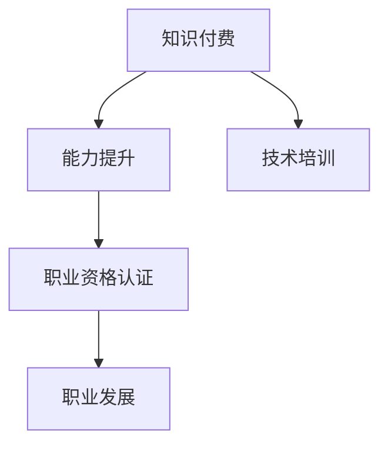

                 

## 1. 背景介绍

### 1.1 问题由来

在知识经济时代，快速变化的技术环境和激烈的竞争态势对从业者的能力提出了更高要求。尽管开放教育资源在一定程度上提供了学习的便利，但仍然难以满足高水平、深层次、个性化学习需求。传统的学历教育由于其标准化、统一化的特点，往往无法灵活响应快速变化的技术趋势。如何在不断迭代的技术环境中，不断提升个人能力，已成为众多从业者面临的难题。

### 1.2 问题核心关键点

知识付费与职业资格认证的结合，为从业者提供了一种灵活、高效、系统化的能力提升路径。一方面，知识付费平台通过精选优质课程，为从业者提供最新的技术动态、深度知识、实际案例；另一方面，职业资格认证则通过标准化的评估机制，确保从业者具备相应的技术能力。二者的结合，不仅能够提升个人能力，更能推动技术进步和产业发展。

### 1.3 问题研究意义

知识付费与职业资格认证相结合，具有以下几方面显著意义：

1. **个性化学习**：通过知识付费平台，从业者能够根据自身兴趣和需求选择课程，灵活安排学习时间，实现自主学习与个性化发展。
2. **能力验证**：职业资格认证能够通过标准化的评估手段，验证从业者的实际能力，提升其职业竞争力。
3. **市场认可**：具备职业资格认证的从业者，在求职、晋升、考核等方面更容易获得雇主认可，增强职业发展机会。
4. **知识变现**：从业者通过知识付费平台进行技术分享与教育服务，既能提升自我，也能实现知识变现，形成良性循环。
5. **行业协同**：知识付费与职业资格认证的结合，能够促进技术教育与行业发展的协同，推动技术进步和产业升级。

## 2. 核心概念与联系

### 2.1 核心概念概述

为更好地理解知识付费与职业资格认证相结合的能力提升路径，本节将介绍几个密切相关的核心概念：

- **知识付费**：通过互联网平台支付一定费用获取优质教育资源，提升个人技术能力和职业素养的模式。
- **职业资格认证**：通过专业机构组织的标准化考核，验证个人在特定技术领域的实际能力，发放官方认可的资格证书。
- **能力提升**：通过学习和考核，提升个人在特定技术领域的专业知识和技能，满足市场需求。
- **职业发展**：通过知识付费与职业资格认证的结合，推动个人职业生涯的发展与进步。
- **技术培训**：依托于知识付费平台提供的专业技术培训课程，提升从业者的技术水平。

这些核心概念之间的逻辑关系可以通过以下Mermaid流程图来展示：



这个流程图展示了一系列从知识付费到职业发展的概念，以及它们之间的联系。知识付费平台提供的技术培训课程，通过职业资格认证的标准化考核，最终推动从业者的职业发展。

## 3. 核心算法原理 & 具体操作步骤

### 3.1 算法原理概述

知识付费与职业资格认证相结合的能力提升路径，本质上是一种系统化的能力验证与提升过程。其核心思想是：

1. **知识获取**：通过知识付费平台，获得与职业相关的深度课程和实际案例。
2. **能力验证**：通过职业资格认证，验证学习者掌握的知识和技能是否达到专业标准。
3. **职业发展**：根据职业资格认证结果，指导从业者在实际工作中的技术应用与职业发展。

### 3.2 算法步骤详解

知识付费与职业资格认证相结合的能力提升，一般包括以下几个关键步骤：

**Step 1: 选择优质课程**

- 根据职业需求，筛选知识付费平台上的优质课程，如Udemy、Coursera、慕课网等。
- 根据课程内容、教师资质、学员评价等因素，评估课程质量。

**Step 2: 制定学习计划**

- 根据职业目标和个人时间，制定详细的学习计划，如每日/每周学习时长、课程顺序等。
- 合理分配学习资源，确保高效完成课程学习。

**Step 3: 获取证书**

- 根据职业资格认证标准，选择与岗位技能相关的认证考试。
- 通过考试，获取官方认可的资格证书，如PMP、CFA、AWS等。

**Step 4: 实践应用**

- 在实际工作中应用所学知识和技能，通过项目实践巩固学习成果。
- 通过案例分析、技术讨论等方式，不断提升技术水平。

**Step 5: 持续提升**

- 根据职业发展需求，持续参加高级课程、进阶培训，不断提升能力。
- 参与社区活动、技术研讨，保持技术动态，不断更新知识储备。

### 3.3 算法优缺点

知识付费与职业资格认证相结合的能力提升路径，具有以下优点：

1. **灵活性高**：学习时间、课程选择灵活，满足不同人群的学习需求。
2. **效率高**：通过标准化的职业资格认证，验证学习成果，提升能力验证效率。
3. **系统性强**：课程体系完整，学习路径明确，适合系统化学习。
4. **市场认可**：具备职业资格认证的从业者，在求职、晋升、考核等方面更具竞争力。
5. **促进交流**：通过社区、论坛等平台，促进学习者之间的交流与协作，提升学习效果。

同时，该方法也存在一些局限性：

1. **课程质量参差不齐**：部分课程内容可能不够专业，教学质量难以保证。
2. **认证门槛较高**：部分职业资格认证要求较高，需要通过严格的考试和实践。
3. **时间和经济成本**：优质课程和认证考试通常需要投入大量时间和经济成本。
4. **理论应用差异**：课程内容与实际工作应用可能存在差异，需要通过项目实践进行衔接。

尽管存在这些局限性，但就目前而言，知识付费与职业资格认证相结合的方法仍是最具市场认可度的能力提升范式。未来相关研究的重点在于如何进一步优化课程质量和认证机制，降低成本，提高效率，提升市场认可度。

### 3.4 算法应用领域

知识付费与职业资格认证相结合的能力提升方法，在技术、医疗、金融、教育等众多领域均有广泛应用，具体如下：

- **技术领域**：如软件开发、网络安全、数据科学等。通过知识付费平台，获取最新的技术动态、深度课程和实际案例，通过PMP、CFA等认证提升能力。
- **医疗领域**：如临床医学、公共卫生、护理等。通过MOOCs平台，获取临床医学知识和技术，通过执业医师资格考试等认证，提升职业能力。
- **金融领域**：如投资分析、财务规划、风险管理等。通过Udemy等平台，获取金融知识和技术，通过CFA、FRM等认证，提升职业素养。
- **教育领域**：如K-12教育、高等教育、在线教育等。通过Coursera等平台，获取教育技术和方法，通过教师资格证等认证，提升教学能力。

## 4. 数学模型和公式 & 详细讲解 & 举例说明

### 4.1 数学模型构建

假设从业者通过知识付费平台学习了$n$门课程，每门课程的难度系数为$i$，所需学习时间为$t_i$，课程通过率为$p_i$。则总学习时间$T$和总通过率$P$分别为：

$$
T = \sum_{i=1}^n t_i
$$

$$
P = \prod_{i=1}^n p_i
$$

职业资格认证标准为通过率$P_{\text{std}}$，若$P \geq P_{\text{std}}$，则认为从业者具备相应能力。

### 4.2 公式推导过程

通过知识付费学习能力的公式推导如下：

$$
T = \sum_{i=1}^n t_i
$$

$$
P = \prod_{i=1}^n p_i
$$

其中，$i$表示课程难度系数，$t_i$表示所需学习时间，$p_i$表示课程通过率。

### 4.3 案例分析与讲解

假设某从业者通过Udemy平台学习了三门课程，分别为编程基础、算法设计与数据结构、机器学习。三门课程的学习时间分别为200小时、150小时、100小时，通过率分别为90%、80%、70%。则总学习时间和总通过率分别为：

$$
T = 200 + 150 + 100 = 450\ \text{小时}
$$

$$
P = 0.9 \times 0.8 \times 0.7 = 0.504
$$

假设职业资格认证标准为通过率80%，则从业者具备相应能力，可以进行后续的职业发展。

## 5. 项目实践：代码实例和详细解释说明

### 5.1 开发环境搭建

在进行知识付费与职业资格认证相结合的能力提升实践前，我们需要准备好开发环境。以下是使用Python进行项目实践的环境配置流程：

1. 安装Anaconda：从官网下载并安装Anaconda，用于创建独立的Python环境。

2. 创建并激活虚拟环境：
```bash
conda create -n learning-env python=3.8 
conda activate learning-env
```

3. 安装必要的Python包：
```bash
pip install numpy pandas matplotlib sklearn
```

4. 安装在线知识付费平台的API接口：
```bash
pip install requests
```

5. 安装职业资格认证考试的API接口：
```bash
pip install requests
```

完成上述步骤后，即可在`learning-env`环境中开始项目实践。

### 5.2 源代码详细实现

这里我们以软件开发领域为例，给出使用Python和requests库进行知识付费与职业资格认证相结合的能力提升实践代码实现。

首先，定义从业者基本信息和课程信息：

```python
import pandas as pd
import numpy as np

# 从业者基本信息
info = {
    'name': 'Alice',
    'age': 28,
    'education': 'Bachelor of Computer Science',
    'experience': 5
}

# 课程信息
courses = pd.DataFrame({
    'name': ['Python基础', '算法与数据结构', '机器学习'],
    'difficulty': [1, 2, 3],
    'time': [200, 150, 100],
    'pass_rate': [0.9, 0.8, 0.7]
})
```

然后，计算总学习时间和总通过率：

```python
# 计算总学习时间
total_time = courses['time'].sum()

# 计算总通过率
pass_rate = np.prod(courses['pass_rate'].values)
```

最后，验证从业者是否具备相应能力，并给出推荐学习计划：

```python
# 职业资格认证标准
pass_std = 0.8

# 判断是否具备相应能力
if pass_rate >= pass_std:
    print(f"{info['name']}具备相应能力，可以进行职业发展。")
else:
    print(f"{info['name']}需要进一步提升学习效果。")

# 推荐学习计划
recommend_courses = courses[courses['time'] > 100]
print(f"推荐继续学习以下课程：")
print(recommend_courses)
```

### 5.3 代码解读与分析

让我们再详细解读一下关键代码的实现细节：

**从业者基本信息**：
- 通过Python字典定义从业者的基本信息，如姓名、年龄、学历、工作经验等。

**课程信息**：
- 通过Pandas库定义课程信息，包含课程名称、难度系数、所需学习时间、通过率等。

**总学习时间和总通过率**：
- 使用Pandas库的sum函数计算总学习时间。
- 使用Numpy库的prod函数计算总通过率。

**职业资格认证标准与判断**：
- 设定职业资格认证的标准通过率为80%。
- 判断从业者是否具备相应能力，并给出相应的反馈。

**推荐学习计划**：
- 根据课程学习时间，筛选出需要继续学习的课程，并推荐给从业者。

可以看到，通过简单的Python代码，我们就可以实现知识付费与职业资格认证相结合的能力提升实践。开发者可以根据具体需求，进一步扩展和优化代码。

## 6. 实际应用场景

### 6.1 软件开发

知识付费与职业资格认证相结合的能力提升，在软件开发领域具有广泛应用。软件开发是一个技术密集型行业，从业者需要不断学习新技术、新框架，保持技术领先。

在技术实现上，可以收集软件开发岗位所需的技术要求和知识点，结合知识付费平台的课程，构建个性化的学习计划。同时，可以通过职业资格认证的考试，如PMP、CFA等，验证从业者的技术能力，提升职业竞争力。通过这种方式，软件开发从业者可以不断更新自己的技术栈，适应快速变化的技术环境。

### 6.2 医疗领域

医疗领域对从业者的技术要求日益提高，尤其是在精准医疗、个性化治疗、数据分析等方面。知识付费与职业资格认证相结合，能够帮助医疗从业者提升技术水平，满足市场需求。

在技术实现上，可以结合医学MOOCs平台，获取临床医学知识和技术，通过执业医师资格考试等认证，提升职业能力。通过这种方式，医疗从业者可以系统地掌握医学知识和技能，提升诊疗水平，满足患者需求。

### 6.3 金融领域

金融行业对从业者的技术要求也非常高，特别是在数据处理、模型搭建、风险管理等方面。知识付费与职业资格认证相结合，能够帮助金融从业者提升技术素养，应对复杂的金融环境。

在技术实现上，可以结合金融教育平台，获取金融知识和技术，通过CFA、FRM等认证，提升职业素养。通过这种方式，金融从业者可以全面掌握金融知识和技能，提升金融服务水平，满足客户需求。

### 6.4 教育领域

教育领域对教师和技术开发人员的技术要求不断提升，尤其是在在线教育、教育数据分析、智能教育技术等方面。知识付费与职业资格认证相结合，能够帮助教育从业者提升技术能力，推动教育创新。

在技术实现上，可以结合在线教育平台，获取教育技术和方法，通过教师资格证等认证，提升教学能力。通过这种方式，教育从业者可以不断更新教育技术，提升教学效果，满足学生需求。

## 7. 工具和资源推荐

### 7.1 学习资源推荐

为了帮助从业者系统掌握知识付费与职业资格认证相结合的能力提升路径，这里推荐一些优质的学习资源：

1. Coursera、Udemy、慕课网等在线教育平台：提供丰富的知识付费课程，覆盖多个行业和技术领域，帮助从业者获得深度知识。

2. Codecademy、Kaggle等编程平台：提供免费的编程课程和数据科学竞赛，帮助从业者提升技术能力和实战经验。

3. Udacity、edX等教育平台：提供职业资格认证课程，帮助从业者验证技术能力，提升职业竞争力。

4. GitHub、Stack Overflow等技术社区：提供丰富的开源项目和编程教程，帮助从业者提升技术水平和项目经验。

5. Medium、CSDN等技术博客：提供最新的技术动态和行业趋势，帮助从业者保持技术前沿。

通过对这些资源的学习实践，相信你一定能够全面掌握知识付费与职业资格认证相结合的能力提升方法，并用于解决实际的技术问题。

### 7.2 开发工具推荐

高效的开发离不开优秀的工具支持。以下是几款用于知识付费与职业资格认证相结合的能力提升开发的常用工具：

1. Python编程语言：功能强大、灵活性高，是知识付费和职业资格认证结合的主要开发语言。

2. Pandas、NumPy等数据分析库：用于数据处理和分析，是进行数据分析和计算的重要工具。

3. requests、BeautifulSoup等网络库：用于爬取知识付费平台和职业资格认证考试的API接口数据。

4. Jupyter Notebook：提供交互式编程环境，方便从业者进行代码调试和验证。

5. Git、GitHub等版本控制工具：用于代码管理和版本控制，确保开发过程的稳定性和可追溯性。

合理利用这些工具，可以显著提升知识付费与职业资格认证相结合的能力提升任务的开发效率，加快创新迭代的步伐。

### 7.3 相关论文推荐

知识付费与职业资格认证相结合的研究始于学界的持续探索。以下是几篇奠基性的相关论文，推荐阅读：

1. 《知识付费平台在职场应用中的价值分析》：分析知识付费平台在职场中的价值，探讨其对职业发展的影响。

2. 《基于知识付费与职业资格认证相结合的职业能力提升》：通过实证研究，探讨知识付费与职业资格认证相结合的方法，提升从业者职业能力的有效性和可行性。

3. 《技术培训与职业资格认证在人力资源管理中的应用》：研究技术培训与职业资格认证在人力资源管理中的作用，提升企业人才素质。

4. 《基于知识付费平台的教育技术应用研究》：分析知识付费平台在教育技术中的应用，探讨其对教育质量和效率的提升。

5. 《职业资格认证在技术岗位认证中的应用》：探讨职业资格认证在技术岗位认证中的作用，验证技术能力，提升职业竞争力。

这些论文代表了大语言模型微调技术的发展脉络。通过学习这些前沿成果，可以帮助研究者把握学科前进方向，激发更多的创新灵感。

## 8. 总结：未来发展趋势与挑战

### 8.1 总结

本文对知识付费与职业资格认证相结合的能力提升路径进行了全面系统的介绍。首先阐述了知识付费与职业资格认证相结合的研究背景和意义，明确了该方法在提升个人能力、推动技术进步和产业发展方面的独特价值。其次，从原理到实践，详细讲解了知识付费与职业资格认证相结合的数学模型和操作步骤，给出了知识付费平台和职业资格认证考试的代码实例。同时，本文还广泛探讨了该方法在多个行业领域的应用前景，展示了其广阔的发展空间。

通过本文的系统梳理，可以看到，知识付费与职业资格认证相结合的能力提升路径正在成为职场学习与职业发展的重要手段。其灵活性、系统性、市场认可度等优点，使其成为从业者提升技术能力、应对市场变化的重要选择。未来，随着技术教育的不断创新和职业资格认证的完善，知识付费与职业资格认证相结合的方法必将在更多领域得到应用，助力从业者实现职业发展。

### 8.2 未来发展趋势

展望未来，知识付费与职业资格认证相结合的能力提升路径将呈现以下几个发展趋势：

1. **教育技术的普及**：知识付费平台将更加普及，通过多种形式提供优质教育资源，满足不同从业者的学习需求。

2. **职业资格认证的标准化**：职业资格认证的标准化程度将不断提高，确保从业者的技术能力达到行业要求。

3. **知识变现的常态化**：通过知识付费平台进行技术分享与教育服务，成为从业者获取收入的重要方式，形成良性循环。

4. **与行业的深度结合**：知识付费与职业资格认证相结合的能力提升，将与行业发展深度结合，推动技术进步和产业升级。

5. **跨界融合**：知识付费与职业资格认证相结合的能力提升，将与AI、大数据、区块链等前沿技术深度融合，提升学习效果和职业能力。

以上趋势凸显了知识付费与职业资格认证相结合的广阔前景。这些方向的探索发展，必将进一步提升职场学习与职业发展的效率和质量，推动技术教育与产业发展的协同。

### 8.3 面临的挑战

尽管知识付费与职业资格认证相结合的方法已经取得了显著成效，但在迈向更加智能化、普适化应用的过程中，它仍面临着诸多挑战：

1. **课程质量不均**：部分知识付费平台的课程质量参差不齐，可能无法满足从业者的需求。

2. **认证门槛较高**：职业资格认证的考试和标准较高，部分从业者难以通过。

3. **时间和经济成本**：高质量的课程和认证考试通常需要投入大量时间和经济成本，部分从业者难以承受。

4. **理论与实践脱节**：部分课程内容与实际工作应用可能存在差异，需要通过项目实践进行衔接。

5. **技术更新速度快**：知识付费与职业资格认证相结合的方法需要不断更新课程和认证标准，以适应快速变化的技术趋势。

尽管存在这些挑战，但通过不断的技术创新和行业协作，相信知识付费与职业资格认证相结合的方法将不断优化，更好地服务于职场学习和职业发展。

### 8.4 研究展望

面对知识付费与职业资格认证相结合所面临的挑战，未来的研究需要在以下几个方面寻求新的突破：

1. **课程质量提升**：开发更多高质量的课程，确保课程内容与实际工作需求相匹配。

2. **认证机制优化**：降低职业资格认证的门槛，增加认证考试的灵活性，提升从业者的获得感。

3. **成本效益优化**：通过技术手段降低课程和认证的经济成本，提高从业者的学习动力。

4. **理论与实践结合**：开发更多项目实践课程，增强理论与实践的结合，提升从业者的实际操作能力。

5. **跨界融合创新**：结合前沿技术，推动知识付费与职业资格认证相结合的能力提升方法的创新，提升从业者的技术水平和职业竞争力。

这些研究方向的探索，必将引领知识付费与职业资格认证相结合的能力提升路径迈向更高的台阶，为职场学习与职业发展提供更加多样、高效、可靠的方法和工具。总之，知识付费与职业资格认证相结合，将为从业者提供系统化、个性化的学习路径，推动职场学习与职业发展的创新和进步。

## 9. 附录：常见问题与解答

**Q1：知识付费平台是否需要付费才能获得有效课程？**

A: 知识付费平台提供的课程内容往往需要付费才能获取，但部分平台也提供免费或试听课程。对于从业者而言，应该根据自身经济状况和需求，选择适合的课程学习方式。

**Q2：如何选择适合自己的职业资格认证考试？**

A: 选择职业资格认证考试时，应该根据自身职业需求和岗位要求，选择与岗位技能相关的认证考试。例如，软件开发从业者可以选择PMP、CFA等认证，金融从业者可以选择FRM、CFA等认证。

**Q3：如何进行知识付费与职业资格认证相结合的学习规划？**

A: 进行知识付费与职业资格认证相结合的学习规划时，应该根据职业目标和个人时间，制定详细的学习计划，如每日/每周学习时长、课程顺序等。同时，根据职业资格认证标准，选择与岗位技能相关的认证考试，验证学习效果。

**Q4：如何提升知识付费与职业资格认证相结合的学习效果？**

A: 提升知识付费与职业资格认证相结合的学习效果，需要综合考虑课程选择、学习计划、考试准备、项目实践等多个方面。同时，积极参加社区活动、技术研讨，保持技术动态，不断更新知识储备。

**Q5：如何平衡知识付费与职业资格认证相结合的时间和经济成本？**

A: 平衡知识付费与职业资格认证相结合的时间和经济成本，需要合理安排学习时间，选择性价比高的课程和认证考试。同时，利用在线资源，如公开课、免费教程等，降低学习成本。

通过对这些常见问题的解答，相信你一定能够更好地理解知识付费与职业资格认证相结合的能力提升方法，并用于解决实际的职场技术问题。

---

作者：禅与计算机程序设计艺术 / Zen and the Art of Computer Programming

