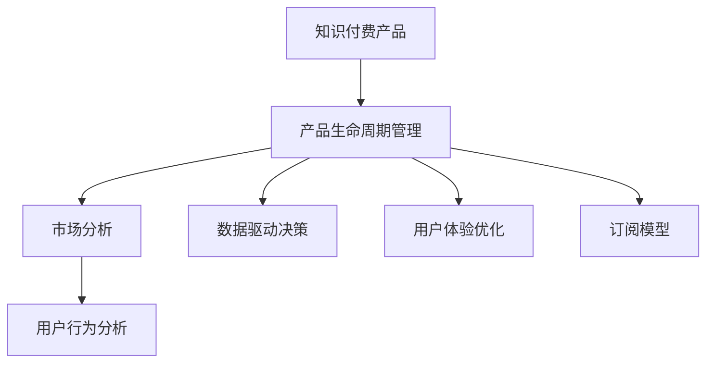

                 

# 知识付费产品的生命周期管理

> 关键词：知识付费, 产品生命周期管理, 用户行为分析, 数据驱动决策, 用户体验优化, 订阅模型

## 1. 背景介绍

随着互联网和移动设备的普及，知识付费模式成为越来越多用户获取知识与信息的重要方式。知识付费产品涵盖了教育、健康、金融等多个领域，满足了人们对于高质量内容、个性化服务的需求。然而，知识付费产品从开发到运营，再到维护升级，都面临着诸多挑战。本文将系统探讨知识付费产品的生命周期管理，从产品策略制定、市场分析、用户行为研究到运营优化、产品迭代，为知识付费产品的可持续发展提供全面指导。

## 2. 核心概念与联系

### 2.1 核心概念概述

为更好地理解知识付费产品的生命周期管理，本节将介绍几个关键概念及其相互关联：

- **知识付费产品**：利用互联网技术，将专业知识、技能、经验等内容包装成有偿服务，通过付费机制向用户提供的一种新型的知识传播方式。主要包括在线课程、电子书、音频讲座、视频教程等形式。

- **产品生命周期管理**：从产品概念构思到市场退出，围绕产品全生命周期进行策划、开发、营销、运营、维护和升级的过程。包含市场分析、用户研究、需求分析、产品设计、迭代优化等环节。

- **用户行为分析**：通过数据分析方法，研究用户在知识付费平台上的行为模式、偏好和需求，以指导产品策略和优化用户体验。

- **数据驱动决策**：利用大数据和机器学习技术，从海量数据中提取有价值信息，用于产品策略制定、用户行为预测和运营优化决策。

- **用户体验优化**：基于用户反馈和行为数据，不断调整产品功能和界面设计，提升用户满意度和黏性，增加用户活跃度和留存率。

- **订阅模型**：以月度、季度或年度为单位，用户通过定期支付费用获取持续访问特定内容的服务模式。

这些核心概念之间的逻辑关系可以通过以下Mermaid流程图来展示：



这个流程图展示了我们在讨论知识付费产品时所关注的几个核心概念及其之间的关系：

1. 知识付费产品为整个生命周期管理的起点。
2. 产品生命周期管理涉及市场分析、用户行为分析、数据驱动决策、用户体验优化和订阅模型等多个方面。
3. 市场分析、用户行为分析和数据驱动决策相互关联，是产品策略制定的基础。
4. 用户体验优化和订阅模型是提升用户黏性和活跃度的重要手段。

## 3. 核心算法原理 & 具体操作步骤

### 3.1 算法原理概述

知识付费产品的生命周期管理是一种系统化的过程，涉及市场调研、用户行为分析、产品设计、迭代优化等多个环节。核心算法原理如下：

1. **市场分析**：通过分析市场规模、增长趋势、用户需求和竞争态势，评估产品的市场潜力，指导产品定位和策略制定。
2. **用户行为分析**：利用用户行为数据，如访问时长、学习进度、互动评论等，分析用户偏好和需求，优化产品功能和界面。
3. **数据驱动决策**：通过机器学习模型预测用户行为，评估产品功能改进效果，指导产品优化和迭代。
4. **用户体验优化**：基于用户反馈和行为数据，持续调整产品功能和界面，提升用户体验和满意度。
5. **订阅模型设计**：根据用户特征和需求，设计合理的订阅定价策略，增加用户黏性和营收。

### 3.2 算法步骤详解

#### 3.2.1 市场分析

市场分析是产品生命周期管理的起点，主要步骤包括：

1. **市场调研**：收集行业报告、用户调研、竞争分析等数据，了解市场规模、增长趋势和用户需求。
2. **细分市场**：根据用户特征和需求，划分不同的市场细分，识别目标用户群。
3. **产品定位**：结合市场调研结果，确定产品的差异化优势和核心卖点，制定产品策略。

#### 3.2.2 用户行为分析

用户行为分析是优化用户体验、提升产品价值的重要手段，主要步骤包括：

1. **数据收集**：通过网站、应用、社交媒体等渠道，收集用户行为数据，包括访问时长、学习进度、互动评论等。
2. **数据处理**：对收集到的数据进行清洗、转换和特征工程，提取有价值信息。
3. **行为分析**：利用数据分析工具和方法，如K-means聚类、PCA降维等，分析用户行为模式和偏好。
4. **需求挖掘**：基于用户行为数据，挖掘用户的潜在需求和痛点，指导产品迭代和功能优化。

#### 3.2.3 数据驱动决策

数据驱动决策是实现精准运营和产品优化的重要方法，主要步骤包括：

1. **数据模型构建**：根据用户行为数据，建立机器学习模型，如决策树、随机森林、神经网络等。
2. **模型训练与评估**：利用历史数据训练模型，评估模型性能，并进行参数调优。
3. **预测与优化**：使用训练好的模型预测用户行为，评估产品功能改进效果，指导产品迭代优化。

#### 3.2.4 用户体验优化

用户体验优化是提升用户满意度和黏性的关键，主要步骤包括：

1. **用户反馈收集**：通过调查问卷、评论留言、用户访谈等方式，收集用户反馈和建议。
2. **用户体验测试**：设计用户体验测试方案，如A/B测试、可用性测试等，评估产品界面和功能。
3. **界面设计与调整**：基于用户反馈和测试结果，调整产品界面设计，提升用户体验。

#### 3.2.5 订阅模型设计

订阅模型设计是实现持续营收和用户黏性的重要手段，主要步骤包括：

1. **定价策略制定**：根据用户需求和产品价值，制定合理的订阅定价策略，如月度、季度或年度。
2. **优惠方案设计**：设计优惠方案，如首月优惠、续费折扣等，吸引用户订阅。
3. **续费激励机制**：建立续费激励机制，如积分奖励、专享内容等，提高用户续费率。

### 3.3 算法优缺点

知识付费产品生命周期管理的核心算法具有以下优点：

1. **系统化管理**：通过系统化的流程和方法，实现产品全生命周期的管理，提升产品决策的科学性和有效性。
2. **数据驱动决策**：利用大数据和机器学习技术，实现精准运营和产品优化，提升用户满意度和黏性。
3. **灵活调整**：根据市场变化和用户反馈，灵活调整产品策略和功能，保持产品竞争力和创新性。
4. **用户个性化**：通过用户行为分析，实现个性化推荐和内容定制，提升用户粘性。

同时，该方法也存在一定的局限性：

1. **数据质量依赖**：数据质量和完整性对分析结果有重要影响，数据偏差可能导致误导决策。
2. **成本高昂**：数据收集、清洗和模型训练需要大量资源和成本投入。
3. **模型复杂度**：复杂的机器学习模型需要更多的计算资源和专业技能。
4. **用户隐私保护**：在数据收集和使用过程中，需要严格遵守隐私保护法规，保护用户隐私。

尽管存在这些局限性，但就目前而言，基于数据驱动的知识付费产品生命周期管理方法是较为有效的。未来相关研究将进一步降低数据获取和处理的成本，提升模型的准确性和效率，同时保护用户隐私，推动知识付费产品的可持续发展。

### 3.4 算法应用领域

知识付费产品生命周期管理方法在多个领域得到了广泛应用，主要包括：

- **在线教育**：通过用户行为分析，优化课程内容和推荐系统，提升学习效果和用户满意度。
- **健康管理**：利用用户健康数据，优化健康计划和个性化医疗建议，提升健康管理效果。
- **金融理财**：通过用户金融行为分析，优化理财建议和投资策略，提升用户理财收益。
- **职业培训**：结合用户职业背景和学习需求，定制化职业培训课程，提升用户职业素养和技能。
- **兴趣拓展**：根据用户兴趣偏好，推荐相关课程和内容，提升用户兴趣和参与度。

这些领域的应用展示了知识付费产品生命周期管理方法的强大生命力和应用前景。

## 4. 数学模型和公式 & 详细讲解 & 举例说明

### 4.1 数学模型构建

知识付费产品生命周期管理涉及多个数学模型和公式，以下是其中的关键模型和公式：

- **市场规模预测模型**：$S(t)=S_0e^{rt}$，其中 $S(t)$ 为 $t$ 时刻的市场规模，$S_0$ 为初始市场规模，$r$ 为市场增长率，$t$ 为时间。

- **用户行为预测模型**：$P(y|x)=\frac{P(y)P(x|y)}{P(x)}$，其中 $P(y|x)$ 为用户行为 $y$ 在特征 $x$ 下的概率，$P(x)$ 为特征 $x$ 的概率，$P(y)$ 为用户行为 $y$ 的概率。

- **订阅收益模型**：$R(t)=S(t)P_s\alpha(t)$，其中 $R(t)$ 为 $t$ 时刻的订阅收益，$S(t)$ 为市场规模，$P_s$ 为订阅率，$\alpha(t)$ 为用户流失率随时间的变化函数。

- **用户体验满意度模型**：$S=f(u)$，其中 $S$ 为用户体验满意度，$u$ 为用户反馈得分，$f(u)$ 为满意度函数。

这些模型和公式将用于市场分析、用户行为预测、订阅收益计算和用户体验评估。

### 4.2 公式推导过程

以用户行为预测模型为例，推导其公式推导过程：

假设用户行为数据包括用户特征 $x$ 和行为标签 $y$，利用贝叶斯公式进行预测：

$$
P(y|x)=\frac{P(y)P(x|y)}{P(x)}
$$

其中 $P(x)$ 为特征 $x$ 的概率，$P(y)$ 为用户行为 $y$ 的概率，$P(x|y)$ 为特征 $x$ 在用户行为 $y$ 下的条件概率。

在实际应用中，我们通常使用决策树、随机森林、神经网络等机器学习模型，从历史数据中学习 $P(x|y)$ 和 $P(y)$，从而得到用户行为预测模型 $P(y|x)$。

### 4.3 案例分析与讲解

以在线教育为例，展示知识付费产品的生命周期管理：

1. **市场分析**：通过收集市场规模、增长趋势、用户需求和竞争态势的数据，确定在线教育市场规模和增长潜力。
2. **用户行为分析**：收集用户访问时长、学习进度、互动评论等数据，分析用户行为模式和需求，优化课程内容和推荐系统。
3. **数据驱动决策**：利用用户行为数据，建立机器学习模型，预测用户行为，评估课程改进效果，指导课程迭代优化。
4. **用户体验优化**：通过用户反馈和行为测试，调整课程界面设计和功能，提升用户体验。
5. **订阅模型设计**：根据用户需求和课程价值，设计合理的订阅定价策略，增加用户黏性和营收。

通过案例分析，可以看到知识付费产品的生命周期管理方法能够有效指导产品的全生命周期管理，提升产品的市场竞争力和用户满意度。

## 5. 项目实践：代码实例和详细解释说明

### 5.1 开发环境搭建

在进行知识付费产品生命周期管理的项目实践前，我们需要准备好开发环境。以下是使用Python进行数据分析和机器学习开发的环境配置流程：

1. 安装Anaconda：从官网下载并安装Anaconda，用于创建独立的Python环境。

2. 创建并激活虚拟环境：
```bash
conda create -n knowledge-management python=3.8 
conda activate knowledge-management
```

3. 安装相关工具包：
```bash
pip install pandas numpy scikit-learn seaborn matplotlib plotly statsmodels
```

4. 安装Jupyter Notebook：
```bash
pip install jupyterlab
```

完成上述步骤后，即可在`knowledge-management`环境中开始实践。

### 5.2 源代码详细实现

下面我们以在线教育课程优化为例，给出使用Python进行知识付费产品生命周期管理的代码实现。

首先，定义数据处理函数：

```python
import pandas as pd
import numpy as np

def load_data(filename):
    data = pd.read_csv(filename)
    return data

def preprocess_data(data):
    # 数据清洗、转换和特征工程
    # 例如，缺失值处理、数据归一化等
    pass
```

然后，定义模型训练和预测函数：

```python
from sklearn.ensemble import RandomForestClassifier
from sklearn.metrics import accuracy_score

def train_model(data, target_col, feature_cols, n_estimators=100):
    # 数据划分训练集和测试集
    train_data, test_data = train_test_split(data, test_size=0.2, random_state=42)
    
    # 特征选择和处理
    X_train = train_data[feature_cols]
    y_train = train_data[target_col]
    X_test = test_data[feature_cols]
    y_test = test_data[target_col]
    
    # 训练随机森林模型
    model = RandomForestClassifier(n_estimators=n_estimators, random_state=42)
    model.fit(X_train, y_train)
    
    # 预测并评估模型性能
    y_pred = model.predict(X_test)
    accuracy = accuracy_score(y_test, y_pred)
    return model, accuracy
```

最后，进行数据可视化分析：

```python
import matplotlib.pyplot as plt
import seaborn as sns

def plot_data(data, x_col, y_col, hue_col):
    # 绘制散点图、柱状图等
    # 例如，特征与目标变量的关系
    sns.scatterplot(data=data, x=x_col, y=y_col, hue=hue_col)
    plt.show()

# 加载数据
data = load_data('online_education.csv')

# 数据预处理
data = preprocess_data(data)

# 特征工程
feature_cols = ['user_age', 'daily_study_hours', 'completion_rate']
target_col = 'pass_rate'

# 训练模型
model, accuracy = train_model(data, target_col, feature_cols)

# 输出模型性能
print(f'Model accuracy: {accuracy:.2f}')

# 可视化分析
plot_data(data, 'user_age', 'pass_rate', 'gender')
```

以上就是使用Python进行知识付费产品生命周期管理的代码实现。可以看到，Python的Pandas、Scikit-Learn等库提供了强大的数据处理和机器学习功能，能够高效实现市场分析、用户行为预测、模型训练和评估等任务。

### 5.3 代码解读与分析

让我们再详细解读一下关键代码的实现细节：

**load_data函数**：
- 加载数据文件，返回Pandas DataFrame对象。

**preprocess_data函数**：
- 数据清洗和转换，例如处理缺失值、数据归一化等。

**train_model函数**：
- 数据划分训练集和测试集。
- 特征选择和处理，选择用于预测的特征和目标变量。
- 训练随机森林模型。
- 预测并评估模型性能，输出模型和评估指标。

**plot_data函数**：
- 绘制数据可视化图表，例如散点图、柱状图等。

可以看到，Python的强大库函数和数据处理能力，使得知识付费产品的生命周期管理项目开发变得高效便捷。

## 6. 实际应用场景

### 6.1 在线教育

在线教育是知识付费产品的主要应用场景之一。通过用户行为分析，在线教育平台可以优化课程内容和推荐系统，提升学习效果和用户满意度。具体应用包括：

- **课程优化**：通过分析用户学习进度、课程评价等数据，优化课程内容和教学方法，提升学习效果。
- **个性化推荐**：基于用户行为和偏好，推荐相关课程和资源，提高用户参与度和学习兴趣。
- **学习路径设计**：根据用户学习进度和需求，设计个性化的学习路径，提升学习效率和效果。

### 6.2 健康管理

健康管理是知识付费产品的另一个重要应用场景。通过用户健康数据，健康管理平台可以优化健康计划和个性化医疗建议，提升健康管理效果。具体应用包括：

- **健康监测**：通过收集用户健康数据，如运动量、饮食、睡眠等，分析用户健康状况，提供个性化健康建议。
- **医疗咨询**：基于用户健康数据和医疗记录，提供个性化的医疗咨询和建议。
- **健康计划设计**：根据用户健康数据，设计个性化的健康计划，提升用户健康管理效果。

### 6.3 金融理财

金融理财也是知识付费产品的重要应用场景。通过用户金融行为分析，理财平台可以优化理财建议和投资策略，提升用户理财收益。具体应用包括：

- **理财建议**：通过分析用户金融数据，如收入、支出、投资组合等，提供个性化的理财建议。
- **投资策略优化**：基于用户金融行为和市场数据，优化投资策略，提升用户理财收益。
- **风险管理**：通过分析用户投资数据和市场波动，提供个性化的风险管理建议。

## 7. 工具和资源推荐

### 7.1 学习资源推荐

为了帮助开发者系统掌握知识付费产品的生命周期管理理论基础和实践技巧，这里推荐一些优质的学习资源：

1. **《数据科学导论》**：涵盖数据分析、机器学习、数据可视化等多个方面的内容，是数据分析和机器学习入门的经典书籍。
2. **Coursera《Python for Data Science》**：由知名数据科学家授课，讲解Python在数据分析和机器学习中的应用，适合初学者。
3. **Kaggle竞赛平台**：提供大量真实数据集和竞赛任务，通过实战练习掌握数据分析和机器学习技能。
4. **Python机器学习社区**：汇聚大量机器学习爱好者和专家，提供丰富的学习资源和技术交流平台。
5. **TensorFlow官方文档**：详细介绍了TensorFlow框架的使用方法和应用场景，适合深入学习和实践。

通过对这些资源的学习实践，相信你一定能够快速掌握知识付费产品生命周期管理的精髓，并用于解决实际问题。

### 7.2 开发工具推荐

高效的开发离不开优秀的工具支持。以下是几款用于知识付费产品生命周期管理的常用工具：

1. **Jupyter Notebook**：强大的交互式编程环境，支持Python、R等多种语言，适合数据分析和机器学习实践。
2. **PyCharm**：强大的IDE工具，支持Python、R、Java等多种语言，提供代码高亮、调试、自动补全等功能。
3. **Tableau**：强大的数据可视化工具，支持多种数据格式和图表类型，适合数据分析和数据可视化。
4. **Hadoop生态系统**：大数据处理和分析平台，支持分布式计算和数据存储，适合处理大规模数据集。
5. **AWS云服务**：提供强大的云计算资源和工具，支持数据存储、计算、分析等功能，适合大数据和机器学习应用。

合理利用这些工具，可以显著提升知识付费产品生命周期管理的开发效率，加快创新迭代的步伐。

### 7.3 相关论文推荐

知识付费产品生命周期管理的研究源于学界的持续探索。以下是几篇奠基性的相关论文，推荐阅读：

1. **《在线教育平台的用户行为分析与优化》**：研究在线教育平台用户行为模式，提出个性化推荐和课程优化的策略。
2. **《健康管理平台的用户健康数据分析》**：研究健康管理平台用户健康数据，提出个性化健康计划和医疗建议。
3. **《金融理财平台的用户金融数据分析》**：研究金融理财平台用户金融数据，提出个性化理财建议和投资策略。

这些论文代表了大数据和机器学习在知识付费产品生命周期管理中的应用和发展方向。通过学习这些前沿成果，可以帮助研究者把握学科前进方向，激发更多的创新灵感。

## 8. 总结：未来发展趋势与挑战

### 8.1 总结

本文对知识付费产品的生命周期管理进行了全面系统的介绍。首先阐述了知识付费产品的发展背景和应用价值，明确了产品生命周期管理在产品策略制定、市场分析、用户行为研究到运营优化、产品迭代等环节中的关键作用。其次，从理论到实践，详细讲解了知识付费产品生命周期管理的算法原理和操作步骤，提供了实用的代码实现和分析。同时，本文还广泛探讨了知识付费产品在教育、健康、金融等多个领域的应用前景，展示了知识付费产品生命周期管理的强大潜力。最后，本文精选了知识付费产品生命周期管理的各类学习资源和工具，力求为开发者提供全方位的技术指引。

通过本文的系统梳理，可以看到，知识付费产品生命周期管理在提升用户体验、优化产品策略、增强用户黏性等方面具有重要意义。未来，伴随技术的持续演进和应用领域的不断拓展，知识付费产品必将在更多场景下大放异彩，为经济社会发展注入新的动力。

### 8.2 未来发展趋势

展望未来，知识付费产品生命周期管理将呈现以下几个发展趋势：

1. **数据驱动决策的普及**：随着大数据和机器学习技术的普及，更多企业将采用数据驱动决策，优化产品策略和运营管理。
2. **用户行为分析的深度应用**：通过更深入的用户行为分析，实现个性化推荐、内容定制和用户体验优化，提升用户满意度和黏性。
3. **产品迭代和优化的加速**：随着AI技术和自动化工具的发展，产品迭代和优化将更加高效和精准，缩短市场响应时间。
4. **订阅模型的多样化**：除了传统的月度、季度和年度订阅，更多企业将探索新的订阅模型，如按需订阅、按内容订阅等，满足不同用户的需求。
5. **跨平台协作的加强**：通过跨平台协作，实现数据共享和协同创新，提升整体产品和服务的竞争力。
6. **用户体验的全面优化**：从产品设计、内容推荐到服务交付，全面提升用户体验，增加用户活跃度和留存率。

以上趋势凸显了知识付费产品生命周期管理的广阔前景。这些方向的探索发展，必将进一步提升知识付费产品的市场竞争力和用户满意度，推动知识付费行业的健康发展。

### 8.3 面临的挑战

尽管知识付费产品生命周期管理已经取得了显著成果，但在迈向更加智能化、普适化应用的过程中，仍面临诸多挑战：

1. **数据隐私和安全**：在数据收集和使用过程中，需要严格遵守隐私保护法规，保护用户隐私和数据安全。
2. **数据质量和准确性**：数据质量和准确性对分析结果有重要影响，数据偏差可能导致误导决策。
3. **用户个性化需求的多样性**：用户需求和偏好多种多样，需要开发更加灵活和个性化的解决方案。
4. **模型的复杂性和效率**：复杂的机器学习模型需要更多的计算资源和专业技能，如何提高模型效率和可解释性，仍是重要课题。
5. **跨领域知识的整合**：如何将不同领域的知识有效整合，提升知识付费产品的综合价值，仍需进一步探索。

这些挑战需要开发者在技术、管理、法律等方面进行全面综合的考虑和应对，才能推动知识付费产品的可持续发展。

### 8.4 研究展望

面对知识付费产品生命周期管理所面临的挑战，未来的研究需要在以下几个方面寻求新的突破：

1. **数据隐私保护技术**：开发更加高效和安全的隐私保护技术，保障用户数据安全，提升用户信任度。
2. **数据质量提升技术**：研究数据清洗、标注和质量提升技术，提高数据准确性和可用性，降低数据偏差。
3. **个性化推荐系统**：开发更加灵活和高效的个性化推荐系统，满足用户多样化需求，提升用户满意度。
4. **模型效率和可解释性**：研究高效模型压缩和优化技术，提高模型效率和可解释性，降低资源消耗和成本。
5. **跨领域知识融合技术**：研究跨领域知识融合技术，将不同领域的知识有效整合，提升知识付费产品的综合价值。

这些研究方向的探索，必将引领知识付费产品生命周期管理技术迈向更高的台阶，为知识付费产品的健康发展提供有力支持。面向未来，知识付费产品需要持续创新和优化，才能不断提升市场竞争力和用户体验，推动知识付费行业的可持续发展。

## 9. 附录：常见问题与解答

**Q1：知识付费产品有哪些主要应用领域？**

A: 知识付费产品主要应用于教育、健康、金融、职业培训、兴趣拓展等多个领域。不同领域的产品设计和运营策略有所不同，但都遵循相同的生命周期管理原则。

**Q2：如何进行用户行为分析？**

A: 用户行为分析主要通过数据收集、数据清洗、特征工程和模型训练等步骤完成。可以使用Python的Pandas、Scikit-Learn等库进行数据处理和模型训练，常用的方法包括K-means聚类、PCA降维、随机森林等。

**Q3：数据驱动决策的优点和缺点是什么？**

A: 数据驱动决策的优点在于其科学性和精准性，能够通过大量数据分析实现精准运营和产品优化，提升用户满意度和黏性。缺点在于需要高质量、大量的数据支撑，且模型复杂度和成本较高。

**Q4：如何进行产品迭代优化？**

A: 产品迭代优化主要通过用户反馈收集、数据分析、模型训练和界面调整等步骤完成。可以使用Python的Jupyter Notebook等工具进行数据分析和模型训练，常用的方法包括A/B测试、可用性测试、用户访谈等。

**Q5：订阅模型的优点和缺点是什么？**

A: 订阅模型的优点在于能够实现持续营收和用户黏性，适合面向大量用户提供持续服务。缺点在于需要较高的用户黏性保证，且用户流失率对订阅收益有较大影响。

---

作者：禅与计算机程序设计艺术 / Zen and the Art of Computer Programming

