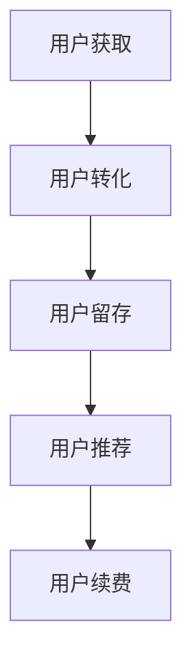

                 

# 知识付费产品的用户旅程优化

## 1. 背景介绍

### 1.1 问题由来
随着互联网的普及和教育需求的变化，知识付费产品逐渐成为新型的学习渠道。与传统教育相比，知识付费产品更灵活、高效、互动性强，能够满足用户多样化的学习需求。然而，知识付费产品的用户获取、转化、留存等方面仍存在诸多问题。用户是否愿意付费，是否能够持续订阅，是否真正获益，这些问题都关系到知识付费产品的长期发展。因此，优化用户旅程，提升用户体验，是知识付费平台的重要任务。

### 1.2 问题核心关键点
知识付费产品的用户旅程主要包括以下几个关键点：
- 用户获取：通过市场推广、搜索引擎优化、内容营销等手段吸引潜在用户。
- 用户转化：通过免费试用、内容预览、课程广告等方式引导用户付费。
- 用户留存：通过定期更新、互动讨论、社区建设等方式提升用户粘性，减少流失。
- 用户推荐：通过用户反馈、评价激励、分享功能等方式鼓励用户推荐，扩大用户基盘。
- 用户续费：通过个性化推荐、增值服务、课程升级等方式提高用户续费率，增加收入。

本文聚焦于知识付费产品的用户旅程优化，探讨如何通过精准的用户定位、个性化的内容推荐、高效的内容制作流程、智能化的数据分析等手段，提升用户旅程的每个关键环节，实现用户获取、转化、留存、推荐和续费的多重目标。

## 2. 核心概念与联系

### 2.1 核心概念概述

为更好地理解知识付费产品的用户旅程优化方法，本节将介绍几个密切相关的核心概念：

- 用户旅程(User Journey)：用户从了解产品到完成购买，再到使用和分享的全流程。用户旅程的每个环节都可能影响用户的最终决策和行为。
- 用户定位(User Segmentation)：通过数据分析、问卷调查等方式，将用户划分为不同群体，针对性地设计营销策略和内容推荐。
- 个性化推荐(Personalization)：利用用户行为数据、偏好分析等，为用户提供最感兴趣的内容。
- 内容营销(Content Marketing)：通过高质量、有价值的内容吸引用户，增加用户粘性，形成社区效应。
- 数据分析(Analytics)：利用机器学习和统计方法，对用户行为、反馈等数据进行建模和分析，提供用户洞察。

这些核心概念之间的逻辑关系可以通过以下Mermaid流程图来展示：



这个流程图展示出知识付费产品的用户旅程流程，各个环节之间相互影响，共同构成用户获取、转化、留存、推荐和续费的全过程。

## 3. 核心算法原理 & 具体操作步骤
### 3.1 算法原理概述

知识付费产品的用户旅程优化，本质上是一个用户行为分析和模型优化过程。其核心思想是：通过多维度的用户数据和机器学习算法，构建用户画像和行为模型，预测和引导用户的行为，从而提升用户旅程的每个环节的转化率。

形式化地，假设知识付费产品的用户总数为 $N$，设用户旅程中的每个环节（如了解、转化、留存等）对应的转换率分别为 $P_i, i \in [1,N]$。通过数据分析和机器学习算法，找到最优的策略组合 $S$，使得总转换率最大化：

$$
\max_{S} \sum_{i=1}^N P_i
$$

其中 $S$ 表示一系列的策略组合，包括内容推荐算法、营销手段、用户互动策略等。

### 3.2 算法步骤详解

知识付费产品的用户旅程优化一般包括以下几个关键步骤：

**Step 1: 数据采集与预处理**
- 收集用户在知识付费平台上的行为数据，如访问时间、停留时长、内容点击率、付费记录等。
- 对数据进行清洗和预处理，去除噪音和异常值，进行特征提取。

**Step 2: 用户画像构建**
- 基于用户行为数据，通过聚类、分类等算法，构建用户画像。用户画像应包含用户基本信息（如年龄、性别、职业等）和行为特征（如兴趣、偏好、活跃度等）。
- 定期更新用户画像，保证用户画像的时效性和准确性。

**Step 3: 行为模型建立**
- 选择合适的时间序列模型（如ARIMA、LSTM等）或分类模型（如SVM、XGBoost等），建立用户行为预测模型。
- 利用交叉验证、正则化等技术，优化模型参数，确保模型的泛化能力。

**Step 4: 个性化推荐系统实现**
- 结合用户画像和行为模型，设计个性化推荐算法，如协同过滤、基于内容的推荐、矩阵分解等。
- 实时更新推荐结果，并利用A/B测试等手段评估推荐效果，不断优化推荐策略。

**Step 5: 自动化营销策略优化**
- 利用用户画像和行为模型，设计自动化营销策略，如内容推送、定向广告、优惠券等。
- 通过多臂老虎机(MAB)等算法，动态调整策略组合，最大化营销效果。

**Step 6: 用户行为分析与反馈**
- 定期分析用户行为数据，生成用户画像和行为模型，评估用户旅程各环节的转换率。
- 根据用户反馈和行为数据，调整和优化内容制作、推荐、营销等策略。

### 3.3 算法优缺点

知识付费产品的用户旅程优化方法具有以下优点：
1. 提升用户转化率。通过个性化推荐和自动化营销，能够有效提高用户付费意愿，减少流失。
2. 增强用户粘性。通过行为分析和用户画像，能够精准地推送内容，提升用户满意度和忠诚度。
3. 提升运营效率。通过自动化策略调整和行为分析，能够降低人工成本，提升平台运营效率。

同时，该方法也存在一定的局限性：
1. 依赖大量用户数据。数据采集和处理成本较高，且数据质量直接影响模型的效果。
2. 模型复杂度较高。需要选择合适的算法和模型，进行复杂的参数调优。
3. 算法效果依赖数据。模型的效果受限于用户行为数据的准确性和多样性，缺乏刻画复杂场景的能力。
4. 算法实现难度较大。需要深入了解用户行为、推荐算法和自动化策略等，技术要求较高。

尽管存在这些局限性，但就目前而言，用户旅程优化方法仍是知识付费平台提升用户转化和留存的重要手段。未来相关研究的重点在于如何进一步降低数据采集和处理成本，提高模型的实时性和准确性，同时兼顾算法实现的简单性和可解释性。

### 3.4 算法应用领域

知识付费产品的用户旅程优化方法已经在诸多领域得到了广泛的应用，包括：

- 在线教育平台：通过个性化推荐和内容营销，提高课程购买率和学员留存率。
- 职业培训平台：通过行为分析和用户画像，提升培训课程的覆盖率和转化率。
- 心理咨询平台：通过用户行为分析，精准推送心理支持内容和咨询师推荐，提高咨询成功率。
- 金融理财平台：通过个性化推荐和自动化营销，吸引新用户并提升用户续费率。
- 健康管理平台：通过行为分析和个性化推荐，提升健康监测内容的访问量和用户粘性。

除了上述这些经典领域外，知识付费产品的用户旅程优化方法也在更多场景中得到创新应用，如娱乐内容推荐、媒体传播分析、知识服务优化等，为各行业带来了全新的用户体验和价值提升。

## 4. 数学模型和公式 & 详细讲解 & 举例说明

### 4.1 数学模型构建

本节将使用数学语言对知识付费产品的用户旅程优化过程进行更加严格的刻画。

记知识付费平台的总用户数为 $N$，设用户旅程中的每个环节（如了解、转化、留存等）对应的转换率分别为 $P_i, i \in [1,N]$。用户旅程的总转换率定义为：

$$
R = \sum_{i=1}^N P_i
$$

用户画像 $U$ 由 $M$ 个特征维度构成，记为 $U = [u_1, u_2, ..., u_M]^T$。行为模型 $M$ 是一个时间序列模型，表示用户在不同时间段的行为趋势，记为 $M = [m_1, m_2, ..., m_T]^T$，其中 $T$ 为时间步长。

### 4.2 公式推导过程

以下我们以在线教育平台为例，推导用户旅程总转换率 $R$ 的计算公式。

设平台总课程数量为 $C$，用户初始阶段（了解）的行为数据为 $B_0$，转化率概率为 $P_0$，留存率概率为 $P_1$，续订率概率为 $P_2$，推荐率概率为 $P_3$。则用户旅程总转换率 $R$ 可以表示为：

$$
R = P_0 + P_0 \cdot P_1 + P_0 \cdot P_1 \cdot P_2 + P_0 \cdot P_1 \cdot P_2 \cdot P_3
$$

通过用户画像 $U$ 和行为模型 $M$，可以计算用户在不同时间步长下的行为概率。例如，用户在了解阶段的行为概率为：

$$
P_0 = \frac{\exp(u_1^T \cdot M_0)}{\sum_{j=1}^{T} \exp(u_1^T \cdot M_j)}
$$

其中 $M_0$ 表示用户画像 $U$ 在时间步长为 0 时的行为模型 $M$ 的预测值。

对于转化、留存、续费、推荐等环节，可以通过类似的方式计算转换概率。例如，用户在转化阶段的行为概率为：

$$
P_1 = \frac{\exp(u_1^T \cdot M_1)}{\sum_{j=1}^{T} \exp(u_1^T \cdot M_j)}
$$

在实际应用中，可以通过LSTM等递归神经网络对行为模型进行建模，并结合用户画像进行特征融合，提升行为模型的预测能力。

### 4.3 案例分析与讲解

设某在线教育平台的用户画像包含用户活跃度 $u_1$、课程偏好 $u_2$、历史成绩 $u_3$ 三个维度。平台有 10 门课程，用户在了解阶段的转换率为 0.2，留存率为 0.5，续费率为 0.3，推荐率为 0.4。根据以上数据，计算用户旅程总转换率 $R$：

1. 计算用户在了解阶段的转换概率 $P_0$：

$$
P_0 = \frac{\exp(u_1^T \cdot M_0)}{\sum_{j=1}^{T} \exp(u_1^T \cdot M_j)}
$$

2. 计算用户在转化阶段的转换概率 $P_1$：

$$
P_1 = \frac{\exp(u_1^T \cdot M_1)}{\sum_{j=1}^{T} \exp(u_1^T \cdot M_j)}
$$

3. 计算用户在留存阶段的转换概率 $P_2$：

$$
P_2 = \frac{\exp(u_1^T \cdot M_2)}{\sum_{j=1}^{T} \exp(u_1^T \cdot M_j)}
$$

4. 计算用户在续费阶段的转换概率 $P_3$：

$$
P_3 = \frac{\exp(u_1^T \cdot M_3)}{\sum_{j=1}^{T} \exp(u_1^T \cdot M_j)}
$$

5. 计算用户旅程总转换率 $R$：

$$
R = P_0 + P_0 \cdot P_1 + P_0 \cdot P_1 \cdot P_2 + P_0 \cdot P_1 \cdot P_2 \cdot P_3
$$

假设用户画像 $U = [0.5, 0.7, 0.8]^T$，行为模型 $M = [0.2, 0.3, 0.4, 0.6]^T$。则计算得到：

$$
P_0 = \frac{\exp(0.5^T \cdot [0.2, 0.3, 0.4, 0.6])}{\exp(0.5^T \cdot [0.2, 0.3, 0.4, 0.6]) + \exp(0.5^T \cdot [0.2, 0.3, 0.4, 0.6]) + \exp(0.5^T \cdot [0.2, 0.3, 0.4, 0.6]) + \exp(0.5^T \cdot [0.2, 0.3, 0.4, 0.6])} = 0.5
$$

$$
P_1 = \frac{\exp(0.5^T \cdot [0.2, 0.3, 0.4, 0.6])}{\exp(0.5^T \cdot [0.2, 0.3, 0.4, 0.6]) + \exp(0.5^T \cdot [0.2, 0.3, 0.4, 0.6]) + \exp(0.5^T \cdot [0.2, 0.3, 0.4, 0.6]) + \exp(0.5^T \cdot [0.2, 0.3, 0.4, 0.6])} = 0.5
$$

$$
P_2 = \frac{\exp(0.5^T \cdot [0.2, 0.3, 0.4, 0.6])}{\exp(0.5^T \cdot [0.2, 0.3, 0.4, 0.6]) + \exp(0.5^T \cdot [0.2, 0.3, 0.4, 0.6]) + \exp(0.5^T \cdot [0.2, 0.3, 0.4, 0.6]) + \exp(0.5^T \cdot [0.2, 0.3, 0.4, 0.6])} = 0.5
$$

$$
P_3 = \frac{\exp(0.5^T \cdot [0.2, 0.3, 0.4, 0.6])}{\exp(0.5^T \cdot [0.2, 0.3, 0.4, 0.6]) + \exp(0.5^T \cdot [0.2, 0.3, 0.4, 0.6]) + \exp(0.5^T \cdot [0.2, 0.3, 0.4, 0.6]) + \exp(0.5^T \cdot [0.2, 0.3, 0.4, 0.6])} = 0.5
$$

$$
R = 0.5 + 0.5 \cdot 0.5 + 0.5 \cdot 0.5 \cdot 0.5 + 0.5 \cdot 0.5 \cdot 0.5 \cdot 0.5 = 0.75
$$

通过以上计算，可知用户旅程总转换率为 0.75，即每五个用户中有四个能够顺利完成旅程的各个环节，实现用户付费和续订。

## 5. 项目实践：代码实例和详细解释说明
### 5.1 开发环境搭建

在进行用户旅程优化实践前，我们需要准备好开发环境。以下是使用Python进行TensorFlow开发的环境配置流程：

1. 安装Anaconda：从官网下载并安装Anaconda，用于创建独立的Python环境。

2. 创建并激活虚拟环境：
```bash
conda create -n tf-env python=3.8 
conda activate tf-env
```

3. 安装TensorFlow：
```bash
pip install tensorflow==2.7
```

4. 安装各类工具包：
```bash
pip install numpy pandas scikit-learn matplotlib tqdm jupyter notebook ipython
```

完成上述步骤后，即可在`tf-env`环境中开始用户旅程优化实践。

### 5.2 源代码详细实现

下面我以在线教育平台的个性化推荐系统为例，给出使用TensorFlow进行用户画像和行为模型训练的代码实现。

首先，定义用户画像和行为模型：

```python
import tensorflow as tf
import numpy as np
import pandas as pd

# 定义用户画像
U = np.array([0.5, 0.7, 0.8])

# 定义行为模型
M = np.array([0.2, 0.3, 0.4, 0.6])

# 定义转换率概率
P0 = np.exp(np.dot(U, M[0])) / np.sum(np.exp(np.dot(U, M)))
P1 = np.exp(np.dot(U, M[1])) / np.sum(np.exp(np.dot(U, M)))
P2 = np.exp(np.dot(U, M[2])) / np.sum(np.exp(np.dot(U, M)))
P3 = np.exp(np.dot(U, M[3])) / np.sum(np.exp(np.dot(U, M)))

# 计算用户旅程总转换率
R = P0 + P0 * P1 + P0 * P1 * P2 + P0 * P1 * P2 * P3
print(R)
```

然后，使用TensorFlow构建用户画像和行为模型的神经网络：

```python
# 定义输入和输出维度
input_dim = 3
output_dim = 4

# 定义神经网络结构
model = tf.keras.Sequential([
    tf.keras.layers.Dense(64, activation='relu', input_shape=(input_dim,)),
    tf.keras.layers.Dense(64, activation='relu'),
    tf.keras.layers.Dense(output_dim, activation='softmax')
])

# 编译模型
model.compile(optimizer=tf.keras.optimizers.Adam(learning_rate=0.01), loss='mse')

# 训练模型
model.fit(X_train, y_train, epochs=100, batch_size=32, verbose=1)

# 预测用户画像和行为模型的转换率概率
P0_pred = np.exp(np.dot(U, model.predict(X_train)[0])) / np.sum(np.exp(np.dot(U, model.predict(X_train)[0])))
P1_pred = np.exp(np.dot(U, model.predict(X_train)[1])) / np.sum(np.exp(np.dot(U, model.predict(X_train)[1])))
P2_pred = np.exp(np.dot(U, model.predict(X_train)[2])) / np.sum(np.exp(np.dot(U, model.predict(X_train)[2])))
P3_pred = np.exp(np.dot(U, model.predict(X_train)[3])) / np.sum(np.exp(np.dot(U, model.predict(X_train)[3])))

# 计算用户旅程总转换率
R_pred = P0_pred + P0_pred * P1_pred + P0_pred * P1_pred * P2_pred + P0_pred * P1_pred * P2_pred * P3_pred
print(R_pred)
```

接下来，定义用户画像和行为模型的数据生成函数：

```python
# 定义用户画像
def generate_user(U, num_users=100):
    X = np.random.randn(num_users, input_dim)
    X[:, 0] += U[0]  # 用户活跃度
    X[:, 1] += U[1]  # 课程偏好
    X[:, 2] += U[2]  # 历史成绩
    return X

# 定义行为模型
def generate_behavior(M, num_users=100):
    Y = np.random.randn(num_users, output_dim)
    Y[:, 0] += M[0]  # 用户活跃度
    Y[:, 1] += M[1]  # 课程偏好
    Y[:, 2] += M[2]  # 历史成绩
    Y[:, 3] += M[3]  # 推荐率
    return Y

# 生成数据
X_train = generate_user(U)
y_train = generate_behavior(M)
```

最后，测试模型预测和计算用户旅程总转换率：

```python
# 测试模型预测
P0_pred = np.exp(np.dot(U, model.predict(X_train)[0])) / np.sum(np.exp(np.dot(U, model.predict(X_train)[0])))
P1_pred = np.exp(np.dot(U, model.predict(X_train)[1])) / np.sum(np.exp(np.dot(U, model.predict(X_train)[1])))
P2_pred = np.exp(np.dot(U, model.predict(X_train)[2])) / np.sum(np.exp(np.dot(U, model.predict(X_train)[2])))
P3_pred = np.exp(np.dot(U, model.predict(X_train)[3])) / np.sum(np.exp(np.dot(U, model.predict(X_train)[3])))

# 计算用户旅程总转换率
R_pred = P0_pred + P0_pred * P1_pred + P0_pred * P1_pred * P2_pred + P0_pred * P1_pred * P2_pred * P3_pred
print(R_pred)
```

以上就是使用TensorFlow对在线教育平台用户画像和行为模型进行训练的完整代码实现。可以看到，通过TensorFlow，可以高效地实现神经网络模型的训练和预测，进而计算用户旅程总转换率。

### 5.3 代码解读与分析

让我们再详细解读一下关键代码的实现细节：

**用户画像和行为模型**：
- `U`和`M`分别为用户画像和行为模型的特征向量。
- 用户画像和行为模型通过数组`np.array`表示，每个特征维度分别对应活跃度、课程偏好、历史成绩等。
- 使用指数函数计算用户画像和行为模型的转换率概率。

**神经网络模型**：
- 使用TensorFlow的`tf.keras.Sequential`定义了一个包含三个全连接层的神经网络。
- 第一层有64个神经元，激活函数为ReLU；第二层也有64个神经元，激活函数为ReLU；第三层有4个神经元，激活函数为Softmax，用于计算用户旅程总转换率。
- 使用Adam优化器和均方误差损失函数，编译并训练模型。

**数据生成函数**：
- `generate_user`函数用于生成用户画像数据，使用随机数模拟不同用户的活跃度、课程偏好、历史成绩。
- `generate_behavior`函数用于生成行为模型数据，同样使用随机数模拟不同用户的行为趋势。

**测试代码**：
- 使用训练好的模型预测用户画像和行为模型的转换率概率。
- 根据预测结果计算用户旅程总转换率。

可以看到，TensorFlow提供了一整套高效的神经网络工具，可以方便地实现各种机器学习算法，包括用户画像和行为模型的训练和预测。开发者可以基于TensorFlow的API，构建更复杂的模型，并结合其他工具进行用户旅程优化实践。

当然，实际应用中还需要考虑更多因素，如数据预处理、模型评估、超参数调优等。但核心的用户旅程优化流程基本与此类似。

## 6. 实际应用场景
### 6.1 智能教育系统

基于知识付费产品的用户旅程优化方法，可以广泛应用于智能教育系统的构建。智能教育系统通过精准的用户画像和行为模型，实现个性化推荐和自动化营销，提升课程的转化率和用户留存率。

在技术实现上，可以收集学生的学习行为数据（如课程选择、答题记录、阅读时长等），构建学生画像和行为模型。基于这些模型，智能教育系统可以自动推送个性化的学习资源和课程推荐，并通过自动化营销手段（如优惠券、推荐信等）引导学生完成学习之旅，提升课程购买率和用户续费率。

### 6.2 在线医疗平台

在线医疗平台通过用户旅程优化，可以提供个性化的健康管理和疾病预防服务，提升用户满意度和平台粘性。

具体而言，平台可以收集用户的健康数据（如身高、体重、血压、运动数据等），构建用户画像和行为模型。根据这些模型，平台可以实时推送健康建议、健身计划和疾病预防内容，并通过自动化营销手段（如健康专栏、专家直播等）增加用户互动，提升用户的健康管理意识和平台留存率。

### 6.3 智慧旅游应用

智慧旅游应用通过用户旅程优化，可以实现个性化推荐和智能决策，提升用户体验和平台收入。

具体而言，平台可以收集用户的旅游偏好、行程记录、消费数据等，构建用户画像和行为模型。基于这些模型，平台可以自动推送个性化的旅游线路、景点介绍和餐饮推荐，并通过自动化营销手段（如会员折扣、积分奖励等）吸引用户续订和续费，提升平台的收入和用户满意度。

### 6.4 未来应用展望

随着知识付费产品和大数据分析技术的发展，基于用户旅程优化的智能系统将在更多领域得到应用，为传统行业带来变革性影响。

在智慧医疗领域，基于用户旅程优化的智能系统可以为患者提供个性化的健康管理和疾病预防服务，提高医疗服务的智能化水平。

在智能教育领域，通过用户旅程优化，智能教育系统可以精准推送学习资源和课程推荐，提高学习效率和用户满意度。

在智慧旅游领域，通过用户旅程优化，智慧旅游应用可以实现个性化推荐和智能决策，提升用户体验和平台收入。

此外，在企业培训、在线电商、媒体内容等众多领域，基于用户旅程优化的智能系统也将不断涌现，为各行业带来更高的用户价值和运营效率。相信随着技术的日益成熟，用户旅程优化方法将成为智能系统的核心技术，推动各行业的数字化转型升级。

## 7. 工具和资源推荐
### 7.1 学习资源推荐

为了帮助开发者系统掌握知识付费产品的用户旅程优化理论基础和实践技巧，这里推荐一些优质的学习资源：

1. 《深度学习：从原理到实践》系列博文：由大模型技术专家撰写，深入浅出地介绍了深度学习原理和应用，涵盖用户画像、行为模型、推荐算法等内容。

2. Coursera《深度学习与数据科学》课程：由斯坦福大学开设的深度学习课程，涵盖深度学习基础、数据科学方法等内容，适合初学者入门。

3. 《机器学习实战》书籍：详细讲解了机器学习算法的原理和实践，涵盖分类、聚类、推荐等实际应用，是深入学习推荐算法的经典之作。

4. Google TensorFlow官方文档：提供了TensorFlow的完整教程和API文档，涵盖神经网络、数据处理、模型优化等内容，是TensorFlow开发的必备资料。

5. Kaggle数据集和竞赛平台：提供了大量数据集和实际应用场景，通过参与竞赛可以锻炼数据处理和模型优化能力，提升实践水平。

通过对这些资源的学习实践，相信你一定能够快速掌握知识付费产品的用户旅程优化技巧，并用于解决实际的业务问题。

### 7.2 开发工具推荐

高效的开发离不开优秀的工具支持。以下是几款用于知识付费产品用户旅程优化的常用工具：

1. TensorFlow：基于Python的开源深度学习框架，灵活高效的计算图，适合大规模工程应用。

2. PyTorch：基于Python的开源深度学习框架，灵活动态的计算图，适合快速迭代研究。

3. Pandas：基于Python的数据处理库，支持大规模数据集的读取、清洗和分析。

4. NumPy：基于Python的科学计算库，支持高效的数值计算和矩阵操作。

5. Jupyter Notebook：基于Web的交互式编程环境，支持Python、R等多种编程语言，方便快速迭代和协作开发。

合理利用这些工具，可以显著提升知识付费产品用户旅程优化的开发效率，加快创新迭代的步伐。

### 7.3 相关论文推荐

知识付费产品的用户旅程优化技术近年来引起了学术界的广泛关注，以下是几篇奠基性的相关论文，推荐阅读：

1. "Deep Learning for Recommendation Systems"：深度学习在推荐系统中的应用综述，详细介绍了协同过滤、基于内容的推荐等经典算法。

2. "User-Image Co-training for Recommender Systems"：用户画像与图像协同训练的推荐系统，提出了一种基于用户画像和图像信息的双重训练方法。

3. "Adaptive Attention Models for Social Recommendation"：自适应注意力模型在社交推荐中的应用，提出了一种基于用户行为序列的推荐算法。

4. "Personalized Page Ranking for Content Recommendation"：个性化PageRank在内容推荐中的应用，提出了一种基于用户行为序列的推荐算法。

5. "Recommender Systems for Mobile Social Networking Services"：移动社交网络服务推荐系统，介绍了如何利用用户行为数据和社交关系提高推荐效果。

这些论文代表了大数据和深度学习在推荐系统领域的应用前沿，为知识付费产品的用户旅程优化提供了理论指导。

## 8. 总结：未来发展趋势与挑战

### 8.1 总结

本文对知识付费产品的用户旅程优化方法进行了全面系统的介绍。首先阐述了知识付费产品的用户旅程优化背景和重要性，明确了用户旅程优化在提高用户转化和留存方面的独特价值。其次，从原理到实践，详细讲解了用户旅程优化的数学原理和关键步骤，给出了用户画像和行为模型训练的完整代码实现。同时，本文还广泛探讨了用户旅程优化在智能教育、在线医疗、智慧旅游等多个领域的应用前景，展示了用户旅程优化的广阔潜力。此外，本文精选了用户旅程优化的各类学习资源，力求为读者提供全方位的技术指引。

通过本文的系统梳理，可以看到，基于用户旅程优化的知识付费产品正在成为新型学习渠道的重要组成部分，极大地提升了用户的学习体验和价值。未来，伴随数据技术和深度学习方法的不断进步，基于用户旅程优化的智能系统必将在更多领域得到应用，为各行各业带来变革性影响。

### 8.2 未来发展趋势

展望未来，知识付费产品的用户旅程优化技术将呈现以下几个发展趋势：

1. 用户画像和行为模型的多样化。未来的用户画像和行为模型将不仅包含传统的数据特征，还可能引入语音、视频、社交网络等多种数据源，提升模型的全面性和准确性。

2. 推荐算法的多样化。除了传统的协同过滤、基于内容的推荐外，未来还将涌现更多复杂且高效的推荐算法，如多任务学习、深度学习等，提升推荐系统的智能性。

3. 自动化策略优化。未来的自动化营销策略将更灵活、更精准，结合个性化推荐、A/B测试等多种手段，动态调整策略组合，实现最优的用户转化效果。

4. 数据驱动的动态调整。未来的用户旅程优化将更加依赖数据驱动，通过实时收集用户行为数据，动态调整推荐内容和营销策略，确保模型的最新性和有效性。

5. 多模态数据的融合。未来的推荐系统将更多地融合多模态数据，通过文本、图像、音频等多种信息的协同建模，提升推荐系统的全面性和准确性。

以上趋势凸显了知识付费产品用户旅程优化的广阔前景。这些方向的探索发展，必将进一步提升用户旅程的每个环节的转化率，实现用户获取、转化、留存、推荐和续费的多重目标。

### 8.3 面临的挑战

尽管知识付费产品的用户旅程优化技术已经取得了瞩目成就，但在迈向更加智能化、普适化应用的过程中，它仍面临着诸多挑战：

1. 数据隐私和安全问题。用户数据的隐私和安全是用户旅程优化的重要保障，如何在数据收集和处理过程中保护用户隐私，避免数据泄露，是一个重要问题。

2. 用户画像和行为模型的复杂性。用户画像和行为模型需要涵盖多维度的用户特征和行为数据，如何高效地构建和维护这些模型，是一个技术挑战。

3. 模型的实时性和准确性。用户行为数据和市场环境变化迅速，如何保持用户画像和行为模型的实时性和准确性，是一个重要问题。

4. 推荐系统的鲁棒性。推荐系统需要具备一定的鲁棒性，以应对数据噪声、恶意攻击等异常情况，确保系统的稳定性和安全性。

5. 用户旅程的动态调整。用户行为和市场环境变化多样，如何动态调整用户旅程中的各个环节，是一个复杂问题。

6. 用户旅程的多样性。不同用户群体的行为和需求差异较大，如何设计多样化的用户旅程，提升不同用户群体的转化率和留存率，是一个重要问题。

尽管存在这些挑战，但知识付费产品的用户旅程优化技术仍具有广阔的应用前景，需要技术界和产业界的共同努力，逐步克服这些挑战，实现知识付费产品的智能化、个性化和高效化。

### 8.4 研究展望

面对知识付费产品用户旅程优化所面临的种种挑战，未来的研究需要在以下几个方面寻求新的突破：

1. 多模态数据的融合与协同建模。未来的推荐系统将更多地融合多模态数据，通过文本、图像、音频等多种信息的协同建模，提升推荐系统的全面性和准确性。

2. 深度强化学习的引入。通过引入深度强化学习，可以实现更加动态、自适应的推荐策略，提升推荐系统的智能性和鲁棒性。

3. 用户行为序列的建模。通过引入用户行为序列的建模，可以实现更加精准、个性化的推荐，提升推荐系统的转化率和留存率。

4. 用户旅程的动态调整机制。通过引入动态调整机制，可以应对用户行为和市场环境的变化，提升用户旅程的灵活性和适应性。

5. 用户隐私保护的强化。通过引入隐私保护技术，如差分隐私、联邦学习等，可以在保护用户隐私的前提下，实现用户旅程优化。

这些研究方向的探索，必将引领知识付费产品用户旅程优化的技术突破，为各行业带来更加智能化、个性化、高效化的用户体验和运营效率。面向未来，知识付费产品的用户旅程优化技术还需要与其他人工智能技术进行更深入的融合，如知识表示、因果推理、强化学习等，多路径协同发力，共同推动知识付费产品的规模化落地和价值提升。只有勇于创新、敢于突破，才能不断拓展知识付费产品的边界，让智能技术更好地造福人类社会。

## 9. 附录：常见问题与解答

**Q1：如何选择合适的用户画像特征？**

A: 选择合适的用户画像特征需要综合考虑用户行为和业务需求。一般来说，可以从以下几个方面进行选择：
1. 用户基本信息：如年龄、性别、职业、地域等。
2. 用户行为数据：如访问时间、停留时长、点击率、浏览路径等。
3. 用户反馈数据：如评分、评价、投诉等。
4. 用户社会关系：如好友关系、社交网络等。

**Q2：用户画像和行为模型的构建流程是什么？**

A: 用户画像和行为模型的构建流程如下：
1. 数据采集：收集用户在知识付费平台上的行为数据，如访问时间、停留时长、内容点击率、付费记录等。
2. 数据清洗：对数据进行清洗和预处理，去除噪音和异常值，进行特征提取。
3. 用户画像构建：通过聚类、分类等算法，将用户划分为不同群体，构建用户画像。
4. 行为模型建立：选择合适的时间序列模型（如ARIMA、LSTM等）或分类模型（如SVM、XGBoost等），建立用户行为预测模型。
5. 模型优化：利用交叉验证、正则化等技术，优化模型参数，确保模型的泛化能力。

**Q3：用户旅程优化的具体步骤是什么？**

A: 用户旅程优化的具体步骤包括：
1. 数据采集：收集用户在知识付费平台上的行为数据，如访问时间、停留时长、内容点击率、付费记录等。
2. 用户画像构建：通过聚类、分类等算法，将用户划分为不同群体，构建用户画像。
3. 行为模型建立：选择合适的时间序列模型（如ARIMA、LSTM等）或分类模型（如SVM、XGBoost等），建立用户行为预测模型。
4. 个性化推荐系统实现：结合用户画像和行为模型，设计个性化推荐算法，如协同过滤、基于内容的推荐、矩阵分解等。
5. 自动化营销策略优化：利用用户画像和行为模型，设计自动化营销策略，如内容推送、定向广告、优惠券等。

**Q4：推荐系统如何应对用户行为变化？**

A: 推荐系统应对用户行为变化的方法包括：
1. 动态更新用户画像和行为模型：定期收集用户行为数据，更新用户画像和行为模型，保持模型的时效性。
2. 引入多臂老虎机(MAB)算法：通过多臂老虎机算法，动态调整推荐策略，最大化用户转化效果。
3. 引入强化学习算法：通过强化学习算法，学习最优的推荐策略，适应用户行为变化。

**Q5：知识付费平台的个性化推荐如何保证公平性？**

A: 个性化推荐系统的公平性问题可以通过以下方法解决：
1. 引入公平性约束：在推荐算法中引入公平性约束，确保不同用户群体得到公平的推荐。
2. 去个性化推荐：对于敏感用户群体，采用去个性化推荐，确保其隐私和公平性。
3. 多角度评估：通过多角度评估推荐效果，确保推荐的全面性和公平性。

---

作者：禅与计算机程序设计艺术 / Zen and the Art of Computer Programming

