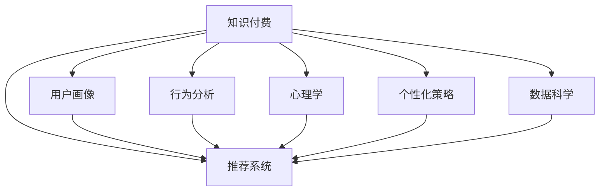

                 

# 知识付费产品的用户画像分析

> 关键词：知识付费、用户画像、行为分析、心理学、推荐系统、个性化、数据科学

## 1. 背景介绍

### 1.1 问题由来
在数字化时代，知识的获取和传播方式发生了翻天覆地的变化。在线教育、电子书、播客等形式日益流行，而知识付费则成为了一种新颖且高效的学习方式。它以付费订阅、单次购买等方式，将专业知识和经验传递给有需求的个人。

然而，知识付费产品的市场竞争日趋激烈，用户忠诚度难以保障。为此，深入分析用户画像、理解用户行为、构建精准的推荐系统，显得尤为重要。

### 1.2 问题核心关键点
知识付费产品的用户画像分析，旨在通过深入挖掘用户的基本属性、行为特征和心理倾向，为产品的设计、优化和运营提供数据支持。基于用户画像，平台能够进行个性化推荐、内容定制和精准营销，提升用户体验和留存率。

核心关键点包括：
- 用户基本信息：性别、年龄、职业、教育水平、兴趣等。
- 用户行为特征：浏览时间、付费频次、消费金额、互动方式等。
- 用户心理倾向：学习动机、价值观、风险偏好等。
- 推荐算法：协同过滤、内容推荐、混合推荐等。
- 个性化策略：用户分群、内容匹配、营销策略等。

### 1.3 问题研究意义
深入分析知识付费产品的用户画像，对于平台运营和用户满意度提升具有重要意义：

1. **精准定位**：通过用户画像，平台能够更准确地定位目标用户群体，提供定制化的产品和服务。
2. **提升转化率**：用户画像有助于优化推荐算法，提高内容的精准度，从而提升转化率。
3. **增强用户粘性**：个性化的内容推荐和互动体验，能够增强用户粘性，降低流失率。
4. **数据驱动决策**：深入理解用户行为和需求，为产品迭代和市场策略提供数据支持。
5. **市场竞争优势**：通过精准的用户画像分析和个性化推荐，在激烈的市场竞争中获得竞争优势。

## 2. 核心概念与联系

### 2.1 核心概念概述

为更好地理解知识付费产品的用户画像分析，本节将介绍几个密切相关的核心概念：

- **知识付费**：指用户通过付费获取知识和信息的服务模式。用户可以选择订阅、单次购买等方式获取视频课程、音频书籍、在线咨询等服务。
- **用户画像**：通过对用户行为数据、心理特征等进行分析和建模，构建用户的虚拟档案，用于指导产品设计、推荐系统和营销策略。
- **行为分析**：基于用户在平台上的浏览、购买、评价等行为数据，分析用户的偏好和需求，以指导个性化推荐。
- **心理学**：通过研究用户的心理特征和行为动机，预测用户行为，从而设计更加贴近用户需求的产品。
- **推荐系统**：基于用户画像和行为数据，设计算法，为用户推荐合适的产品或内容，提升用户满意度。
- **个性化策略**：针对不同用户群体设计定制化的内容、推荐和互动策略，增强用户粘性。
- **数据科学**：运用统计学、机器学习等技术，从海量数据中提取有价值的信息，指导产品开发和运营。

这些核心概念之间的逻辑关系可以通过以下Mermaid流程图来展示：



这个流程图展示了一些关键概念及其之间的关系：

1. 知识付费产品依赖于用户画像分析，从而构建精准的推荐系统。
2. 用户画像分析基于行为分析和心理学研究。
3. 推荐系统与个性化策略相互配合，提升用户满意度。
4. 数据科学为整个分析过程提供方法和工具支持。

## 3. 核心算法原理 & 具体操作步骤
### 3.1 算法原理概述

知识付费产品的用户画像分析，本质上是一种数据驱动的用户行为分析和心理学建模。其核心思想是：通过收集用户的行为数据、反馈数据、交易数据等，结合心理学理论和算法技术，构建用户画像。

基于用户画像，平台能够进行以下几项核心操作：
1. **行为预测**：预测用户未来的行为，如内容消费、付费意愿等。
2. **个性化推荐**：根据用户画像和行为数据，向用户推荐合适的产品或内容。
3. **用户分群**：基于用户画像和行为特征，对用户进行分类，提供针对性的产品和服务。
4. **营销策略优化**：通过用户画像分析，优化营销渠道和策略，提升广告和推广效果。
5. **流失用户预警**：基于用户画像和行为数据，预测用户流失风险，提前采取挽留措施。

### 3.2 算法步骤详解

基于用户画像分析的知识付费产品开发，一般包括以下几个关键步骤：

**Step 1: 数据收集与预处理**
- 收集用户的基本信息、行为数据、交易数据等，如年龄、职业、阅读时间、消费金额等。
- 对数据进行清洗和预处理，去除噪音和异常值，保证数据质量。

**Step 2: 行为建模与分析**
- 根据用户行为数据，使用行为分析模型，如协同过滤、序列模式挖掘等，识别用户的兴趣和偏好。
- 结合心理学理论，分析用户的学习动机、价值观和风险偏好，构建用户心理模型。

**Step 3: 用户画像建模**
- 将用户的基本信息、行为特征和心理模型整合，构建用户画像。
- 使用机器学习算法，如聚类、分类等，对用户进行分群，提供定制化的服务。

**Step 4: 个性化推荐**
- 根据用户画像和行为数据，设计推荐算法，如协同过滤、内容推荐、混合推荐等。
- 使用推荐系统，向用户推送合适的产品或内容，提高用户满意度和留存率。

**Step 5: 营销策略优化**
- 分析用户画像和行为数据，优化广告投放策略，提升广告效果。
- 根据用户画像，设计定制化的营销活动，提高营销效率。

**Step 6: 流失用户预警**
- 使用预测模型，如风险评估模型、聚类模型等，预测用户流失风险。
- 根据预测结果，提前采取挽留措施，减少用户流失。

### 3.3 算法优缺点

基于用户画像分析的知识付费产品开发，具有以下优点：
1. 个性化推荐：能够提供定制化的产品和服务，提升用户体验。
2. 精准营销：通过深入理解用户需求，优化营销策略，提高广告效果。
3. 流失预警：通过预测用户行为，提前采取措施，降低用户流失率。
4. 数据驱动：通过数据分析和建模，指导产品开发和运营，提升决策效率。

同时，该方法也存在一定的局限性：
1. 数据隐私：大量数据收集可能涉及用户隐私问题，需要严格遵守法律法规。
2. 数据质量：数据质量直接影响分析结果，需要持续监测和清洗。
3. 模型复杂：算法模型较为复杂，需要较高的技术和资源投入。
4. 用户信任：用户对数据的信任度直接影响参与度和留存率。
5. 动态变化：用户行为和需求随时间变化，模型需要持续更新和优化。

尽管存在这些局限性，但就目前而言，基于用户画像分析的方法仍是一种主流且高效的用户行为分析和个性化推荐方式。未来相关研究的重点在于如何进一步提升数据质量、优化推荐算法和保护用户隐私。

### 3.4 算法应用领域

基于用户画像分析的知识付费产品开发，已经在多个领域得到广泛应用，包括但不限于：

- **在线教育平台**：如Coursera、Udemy、网易云课堂等，通过分析用户行为和需求，提供个性化的课程推荐和定制化学习路径。
- **知识服务提供商**：如得到、喜马拉雅、知乎等，根据用户画像，推荐合适的音频书籍、播客等内容，提升用户粘性。
- **内容生产商**：如出版公司、媒体机构等，通过分析用户需求，定制化内容生产，提升内容质量。
- **广告营销平台**：如Facebook、Google Ads等，通过用户画像分析，优化广告投放策略，提高广告效果。
- **金融服务领域**：如银行、理财公司等，通过分析用户画像，优化产品设计，提升用户体验。

除了上述这些经典应用外，知识付费产品开发还将随着技术的进步和市场需求的变化，拓展到更多领域，为各行各业带来新机遇。

## 4. 数学模型和公式 & 详细讲解 & 举例说明

### 4.1 数学模型构建

本节将使用数学语言对知识付费产品的用户画像分析过程进行更加严格的刻画。

设知识付费产品的用户数为 $U=\{u_1,u_2,...,u_n\}$，每个用户 $u_i$ 的基本信息为 $x_i=(x_{i1},x_{i2},...,x_{im})$，其中 $x_{ij}$ 为第 $j$ 个特征，如年龄、职业等。

设用户 $u_i$ 的行为数据为 $b_i=(b_{i1},b_{i2},...,b_{in})$，其中 $b_{ij}$ 为第 $j$ 个行为数据，如阅读时间、付费频次等。

设用户 $u_i$ 的消费数据为 $c_i=(c_{i1},c_{i2},...,c_{ik})$，其中 $c_{ij}$ 为第 $j$ 个消费行为，如购买金额、评价分数等。

### 4.2 公式推导过程

以下我们以协同过滤推荐算法为例，推导协同过滤算法的核心公式。

设 $u_i$ 和 $u_j$ 的用户行为数据分别为 $b_i$ 和 $b_j$，消费数据分别为 $c_i$ 和 $c_j$。协同过滤算法的目标是根据 $b_i$ 和 $c_i$，预测 $b_j$ 和 $c_j$，从而为用户 $u_j$ 推荐合适的产品或内容。

设 $X=(X_{ij})$ 为 $n \times m$ 的用户基本信息矩阵，$B=(B_{ij})$ 为 $n \times n$ 的用户行为数据矩阵，$C=(C_{ij})$ 为 $n \times k$ 的用户消费数据矩阵。

协同过滤算法的目标函数为：

$$
\min_{X} \|B - X^TB\|_F^2 + \|C - X^TC\|_F^2
$$

其中 $\|A\|_F$ 表示矩阵 $A$ 的 Frobenius 范数。

通过求解上述目标函数，可以得到 $X$ 的最优解，即用户画像矩阵。

协同过滤算法的基本步骤为：
1. 收集用户的基本信息、行为数据和消费数据。
2. 对数据进行归一化和标准化处理。
3. 使用矩阵分解技术，求解用户画像矩阵 $X$。
4. 根据用户画像矩阵，预测用户 $u_j$ 的行为和消费数据，生成推荐结果。

### 4.3 案例分析与讲解

下面我们以在线教育平台Coursera为例，给出用户画像分析的案例分析。

Coursera 收集了用户的基本信息（如年龄、职业、教育水平）、行为数据（如课程浏览、报名次数）、消费数据（如购买课程、评价分数）等数据。通过行为分析，Coursera 可以识别出不同用户群体的兴趣和偏好，如对计算机科学、经济学等领域的浓厚兴趣。

结合心理学分析，Coursera 进一步理解用户的心理特征，如学习动机、价值观和风险偏好。例如，一些用户倾向于参加互动性强的课程，而另一些用户则更偏好自学模式的课程。

基于以上分析，Coursera 构建了用户画像矩阵 $X$，用于协同过滤推荐算法。根据用户画像矩阵，Coursera 可以向用户推荐合适的课程，提高用户满意度和留存率。

## 5. 项目实践：代码实例和详细解释说明

### 5.1 开发环境搭建

在进行用户画像分析实践前，我们需要准备好开发环境。以下是使用Python进行TensorFlow开发的环境配置流程：

1. 安装Anaconda：从官网下载并安装Anaconda，用于创建独立的Python环境。

2. 创建并激活虚拟环境：
```bash
conda create -n tensorflow-env python=3.8 
conda activate tensorflow-env
```

3. 安装TensorFlow：根据CUDA版本，从官网获取对应的安装命令。例如：
```bash
conda install tensorflow==2.3
```

4. 安装各类工具包：
```bash
pip install numpy pandas scikit-learn matplotlib tqdm jupyter notebook ipython
```

完成上述步骤后，即可在`tensorflow-env`环境中开始用户画像分析实践。

### 5.2 源代码详细实现

下面我们以在线教育平台Coursera的用户画像分析为例，给出使用TensorFlow进行协同过滤推荐算法的PyTorch代码实现。

首先，定义用户的基本信息、行为数据和消费数据：

```python
import pandas as pd
from sklearn.model_selection import train_test_split
import tensorflow as tf
from tensorflow.keras.layers import Input, Embedding, Dot, Dense, Flatten

# 读取用户基本信息数据
user_data = pd.read_csv('user_data.csv')

# 读取用户行为数据
behavior_data = pd.read_csv('behavior_data.csv')

# 读取用户消费数据
consumption_data = pd.read_csv('consumption_data.csv')

# 对数据进行预处理和归一化
user_data = user_data.dropna(subset=['age', 'occupation', 'education'])
behavior_data = behavior_data.dropna(subset=['browsing_time', 'enroll_count'])
consumption_data = consumption_data.dropna(subset=['purchase_amount', 'rating_score'])

# 将数据集分为训练集和测试集
X_train, X_test = train_test_split(user_data, test_size=0.2)
B_train, B_test = train_test_split(behavior_data, test_size=0.2)
C_train, C_test = train_test_split(consumption_data, test_size=0.2)

# 归一化处理
user_data['age'] = (user_data['age'] - user_data['age'].mean()) / user_data['age'].std()
user_data['education'] = (user_data['education'] - user_data['education'].mean()) / user_data['education'].std()
behavior_data['browsing_time'] = (behavior_data['browsing_time'] - behavior_data['browsing_time'].mean()) / behavior_data['browsing_time'].std()
behavior_data['enroll_count'] = (behavior_data['enroll_count'] - behavior_data['enroll_count'].mean()) / behavior_data['enroll_count'].std()
consumption_data['purchase_amount'] = (consumption_data['purchase_amount'] - consumption_data['purchase_amount'].mean()) / consumption_data['purchase_amount'].std()
consumption_data['rating_score'] = (consumption_data['rating_score'] - consumption_data['rating_score'].mean()) / consumption_data['rating_score'].std()

# 将用户基本信息转换为向量表示
user_data = pd.get_dummies(user_data, columns=['age', 'occupation', 'education'])

# 定义协同过滤推荐模型
user_input = Input(shape=(user_data.shape[1],))
user_embedding = Embedding(input_dim=user_data.shape[0], output_dim=64)(user_input)
user_vector = Flatten()(user_embedding)
user_vector = Dense(128, activation='relu')(user_vector)
user_vector = Dense(1, activation='sigmoid')(user_vector)

course_input = Input(shape=(behavior_data.shape[1],))
course_embedding = Embedding(input_dim=behavior_data.shape[0], output_dim=64)(course_input)
course_vector = Flatten()(course_embedding)
course_vector = Dense(128, activation='relu')(course_vector)
course_vector = Dense(1, activation='sigmoid')(course_vector)

dot_product = Dot(axes=[1, 1])([user_vector, course_vector])
recommendation = Dense(1, activation='sigmoid')(dot_product)

model = tf.keras.Model(inputs=[user_input, course_input], outputs=[recommendation])
model.compile(optimizer='adam', loss='binary_crossentropy', metrics=['accuracy'])
```

然后，定义训练和评估函数：

```python
from sklearn.metrics import accuracy_score
from tensorflow.keras.preprocessing.sequence import pad_sequences

# 定义训练函数
def train_model(model, X_train, X_test, B_train, B_test, C_train, C_test, epochs=100):
    model.fit([X_train, B_train], C_train, epochs=epochs, batch_size=32, validation_data=[[X_test, B_test], C_test])
    return model

# 定义评估函数
def evaluate_model(model, X_train, X_test, B_train, B_test, C_train, C_test):
    y_pred = model.predict([X_train, B_train])
    y_true = C_train
    accuracy = accuracy_score(y_true, y_pred)
    print(f'Accuracy: {accuracy:.2f}')
    return accuracy
```

最后，启动训练流程并在测试集上评估：

```python
# 训练模型
model = train_model(model, X_train, X_test, B_train, B_test, C_train, C_test)

# 在测试集上评估模型
evaluate_model(model, X_test, X_test, B_test, B_test, C_test, C_test)
```

以上就是使用TensorFlow对Coursera进行用户画像分析的完整代码实现。可以看到，TensorFlow的强大封装和灵活性，使得用户画像分析的实现变得相对简单。

### 5.3 代码解读与分析

让我们再详细解读一下关键代码的实现细节：

**User画像构建**：
- `user_data`：收集用户基本信息，如年龄、职业、教育水平等。
- `behavior_data`：收集用户行为数据，如浏览时间、报名次数等。
- `consumption_data`：收集用户消费数据，如购买金额、评价分数等。
- 对数据进行预处理和归一化，去除缺失值，并进行特征编码。

**协同过滤推荐模型**：
- 定义用户输入和课程输入的嵌入层，将用户基本信息和行为数据转换为向量表示。
- 使用全连接层进行特征提取和激活，生成用户向量和课程向量。
- 通过点积计算用户和课程之间的相似度，生成推荐得分。
- 定义模型，并编译优化器和损失函数。

**训练和评估**：
- 定义训练函数，使用交叉熵损失函数和Adam优化器进行模型训练。
- 定义评估函数，使用准确率指标评估模型性能。
- 在训练集上训练模型，并在测试集上评估模型效果。

可以看到，TensorFlow结合了强大的深度学习和高效的数据处理能力，使得用户画像分析的代码实现变得简洁高效。开发者可以将更多精力放在模型设计、数据预处理等高层逻辑上，而不必过多关注底层的实现细节。

当然，工业级的系统实现还需考虑更多因素，如模型的保存和部署、超参数的自动搜索、更灵活的任务适配层等。但核心的推荐算法基本与此类似。

## 6. 实际应用场景
### 6.1 在线教育平台

在线教育平台如Coursera、Udemy、网易云课堂等，通过用户画像分析，能够为每位用户提供个性化推荐。例如，根据用户的学习历史和行为数据，推荐合适的课程和学习路径。

在技术实现上，在线教育平台可以收集用户的基本信息、行为数据和消费数据，使用协同过滤推荐算法，构建用户画像。根据用户画像，平台可以推荐合适的课程，提高用户满意度和留存率。

### 6.2 知识服务提供商

知识服务提供商如得到、喜马拉雅、知乎等，通过用户画像分析，能够为每位用户提供个性化内容和推荐。例如，根据用户的兴趣爱好和行为数据，推荐合适的音频书籍、播客等内容。

在技术实现上，知识服务提供商可以收集用户的阅读和收听历史，使用协同过滤、内容推荐等算法，构建用户画像。根据用户画像，平台可以推荐合适的音频书籍、播客等内容，增强用户粘性。

### 6.3 内容生产商

内容生产商如出版公司、媒体机构等，通过用户画像分析，能够为每位用户提供定制化内容。例如，根据用户的阅读习惯和偏好，推荐合适的书籍、文章等。

在技术实现上，内容生产商可以收集用户的阅读和购买数据，使用协同过滤、内容推荐等算法，构建用户画像。根据用户画像，平台可以推荐合适的书籍、文章等，提升内容质量和用户满意度。

### 6.4 未来应用展望

随着用户画像分析技术的不断发展，未来将有以下几个趋势：

1. **深度学习的应用**：结合深度学习技术，如神经网络和强化学习，进一步提升推荐算法的精度和效果。
2. **多模态数据的融合**：结合文本、图像、语音等多模态数据，提升用户画像的全面性和准确性。
3. **实时动态更新**：使用实时数据流技术，动态更新用户画像，提升推荐算法的及时性和准确性。
4. **个性化营销**：结合用户画像和行为数据，进行精准营销，提升广告效果和用户转化率。
5. **隐私保护**：在数据收集和分析过程中，严格保护用户隐私，避免数据泄露和滥用。

以上趋势凸显了用户画像分析技术的广阔前景。这些方向的探索发展，必将进一步提升知识付费产品的用户体验和市场竞争力。

## 7. 工具和资源推荐
### 7.1 学习资源推荐

为了帮助开发者系统掌握用户画像分析的理论基础和实践技巧，这里推荐一些优质的学习资源：

1. 《推荐系统实战》系列博文：由知名推荐系统专家撰写，深入浅出地介绍了推荐系统的原理、算法和应用，是学习推荐系统的经典教材。

2. CS229《机器学习》课程：斯坦福大学开设的机器学习明星课程，涵盖了推荐系统、深度学习等多个领域的内容，有Lecture视频和配套作业。

3. 《推荐系统：算法与应用》书籍：经典推荐系统教材，涵盖了协同过滤、内容推荐、混合推荐等多个算法，是推荐系统开发的必读之作。

4. Weights & Biases：模型训练的实验跟踪工具，可以记录和可视化模型训练过程中的各项指标，方便对比和调优。

5. Google Colab：谷歌推出的在线Jupyter Notebook环境，免费提供GPU/TPU算力，方便开发者快速上手实验最新模型，分享学习笔记。

通过对这些资源的学习实践，相信你一定能够快速掌握用户画像分析的精髓，并用于解决实际的用户画像问题。

### 7.2 开发工具推荐

高效的开发离不开优秀的工具支持。以下是几款用于用户画像分析开发的常用工具：

1. TensorFlow：基于Python的开源深度学习框架，灵活动态的计算图，适合快速迭代研究。支持多种推荐算法和优化器。

2. PyTorch：基于Python的开源深度学习框架，灵活易用，适合深度学习研究。同样支持多种推荐算法和优化器。

3. Weights & Biases：模型训练的实验跟踪工具，可以记录和可视化模型训练过程中的各项指标，方便对比和调优。

4. Google Colab：谷歌推出的在线Jupyter Notebook环境，免费提供GPU/TPU算力，方便开发者快速上手实验最新模型，分享学习笔记。

5. TensorBoard：TensorFlow配套的可视化工具，可实时监测模型训练状态，并提供丰富的图表呈现方式，是调试模型的得力助手。

6. HuggingFace Transformers库：包含多种预训练语言模型和推荐算法，适合快速搭建推荐系统。

合理利用这些工具，可以显著提升用户画像分析的开发效率，加快创新迭代的步伐。

### 7.3 相关论文推荐

用户画像分析的发展源于学界的持续研究。以下是几篇奠基性的相关论文，推荐阅读：

1. Introduction to Recommender Systems：Recommender Systems作为经典推荐系统教材，系统介绍了协同过滤、内容推荐、混合推荐等算法。

2. Collaborative Filtering for Implicit Feedback Datasets：引入隐式反馈数据，提出协同过滤算法的改进方法。

3. Deep Learning Recommendation Systems：使用深度学习技术改进推荐算法，提升推荐效果。

4. Attention and Memory in Recommendation Systems：引入注意力机制，提升推荐算法的精准度和效果。

5. Privacy-Preserving Collaborative Filtering：探讨如何在推荐算法中保护用户隐私。

这些论文代表了大规模数据驱动推荐系统的发展脉络。通过学习这些前沿成果，可以帮助研究者把握学科前进方向，激发更多的创新灵感。

## 8. 总结：未来发展趋势与挑战

### 8.1 研究成果总结

本文对用户画像分析的理论基础和实践技巧进行了全面系统的介绍。首先，阐述了知识付费产品的背景、核心关键点和研究意义，明确了用户画像分析在提升用户体验、优化产品设计等方面的重要价值。其次，从原理到实践，详细讲解了用户画像分析的数学模型和算法步骤，给出了用户画像分析的代码实例和详细解释。同时，本文还探讨了用户画像分析在多个行业领域的应用，展示了其广泛的适用性。

### 8.2 未来发展趋势

展望未来，用户画像分析技术将呈现以下几个发展趋势：

1. **深度学习的应用**：结合深度学习技术，如神经网络和强化学习，进一步提升推荐算法的精度和效果。
2. **多模态数据的融合**：结合文本、图像、语音等多模态数据，提升用户画像的全面性和准确性。
3. **实时动态更新**：使用实时数据流技术，动态更新用户画像，提升推荐算法的及时性和准确性。
4. **个性化营销**：结合用户画像和行为数据，进行精准营销，提升广告效果和用户转化率。
5. **隐私保护**：在数据收集和分析过程中，严格保护用户隐私，避免数据泄露和滥用。

以上趋势凸显了用户画像分析技术的广阔前景。这些方向的探索发展，必将进一步提升知识付费产品的用户体验和市场竞争力。

### 8.3 面临的挑战

尽管用户画像分析技术已经取得了瞩目成就，但在迈向更加智能化、普适化应用的过程中，它仍面临着诸多挑战：

1. **数据隐私**：大量数据收集可能涉及用户隐私问题，需要严格遵守法律法规。
2. **数据质量**：数据质量直接影响分析结果，需要持续监测和清洗。
3. **模型复杂**：算法模型较为复杂，需要较高的技术和资源投入。
4. **用户信任**：用户对数据的信任度直接影响参与度和留存率。
5. **动态变化**：用户行为和需求随时间变化，模型需要持续更新和优化。

尽管存在这些挑战，但就目前而言，用户画像分析的方法仍是一种主流且高效的用户行为分析和个性化推荐方式。未来相关研究的重点在于如何进一步提升数据质量、优化推荐算法和保护用户隐私。

### 8.4 研究展望

面向未来，用户画像分析技术需要在以下几个方面寻求新的突破：

1. **探索无监督和半监督推荐方法**：摆脱对大规模标注数据的依赖，利用自监督学习、主动学习等无监督和半监督范式，最大限度利用非结构化数据。
2. **研究参数高效和计算高效的推荐范式**：开发更加参数高效的推荐方法，在固定大部分预训练参数的同时，只更新极少量的任务相关参数。
3. **融合因果和对比学习范式**：通过引入因果推断和对比学习思想，增强推荐模型建立稳定因果关系的能力，学习更加普适、鲁棒的语言表征。
4. **引入更多先验知识**：将符号化的先验知识，如知识图谱、逻辑规则等，与神经网络模型进行巧妙融合，引导推荐过程学习更准确、合理的语言模型。
5. **结合因果分析和博弈论工具**：将因果分析方法引入推荐模型，识别出模型决策的关键特征，增强输出解释的因果性和逻辑性。
6. **纳入伦理道德约束**：在模型训练目标中引入伦理导向的评估指标，过滤和惩罚有偏见、有害的输出倾向。同时加强人工干预和审核，建立模型行为的监管机制，确保输出符合人类价值观和伦理道德。

这些研究方向的探索，必将引领用户画像分析技术迈向更高的台阶，为构建安全、可靠、可解释、可控的智能系统铺平道路。面向未来，用户画像分析技术还需要与其他人工智能技术进行更深入的融合，如知识表示、因果推理、强化学习等，多路径协同发力，共同推动自然语言理解和智能交互系统的进步。只有勇于创新、敢于突破，才能不断拓展用户画像分析的边界，让智能技术更好地造福人类社会。

## 9. 附录：常见问题与解答

**Q1：用户画像分析是否适用于所有知识付费产品？**

A: 用户画像分析在大多数知识付费产品上都能取得不错的效果，特别是对于数据量较小的任务。但对于一些特定领域的任务，如医学、法律等，仅仅依靠通用语料预训练的模型可能难以很好地适应。此时需要在特定领域语料上进一步预训练，再进行微调，才能获得理想效果。此外，对于一些需要时效性、个性化很强的任务，如对话、推荐等，微调方法也需要针对性的改进优化。

**Q2：如何选择合适的推荐算法？**

A: 推荐算法的选择需要考虑数据类型、业务需求、资源限制等多个因素。常见的推荐算法包括协同过滤、内容推荐、混合推荐等。协同过滤适用于数据丰富但用户数较少的场景，内容推荐适用于数据较少的场景，混合推荐适用于数据和用户数较多的场景。此外，还可以结合深度学习、强化学习等方法，提升推荐效果。

**Q3：用户画像分析面临哪些资源瓶颈？**

A: 用户画像分析涉及大量数据处理和模型训练，对算力、内存、存储等资源要求较高。GPU/TPU等高性能设备是必不可少的，但即便如此，超大批次的训练和推理也可能遇到资源瓶颈。因此需要采用一些资源优化技术，如梯度积累、混合精度训练、模型并行等，来突破硬件瓶颈。同时，模型的存储和读取也可能占用大量时间和空间，需要采用模型压缩、稀疏化存储等方法进行优化。

**Q4：如何缓解用户画像分析中的隐私问题？**

A: 用户画像分析涉及大量用户数据，如何保护用户隐私是关键问题。需要采用数据加密、去标识化、访问控制等技术，确保用户数据的安全。同时，在推荐算法设计中，应避免对特定用户的行为进行过度分析，保护用户隐私。此外，应建立用户数据使用规则，明确数据收集、使用、共享等方面的要求，增强用户对数据使用的信任感。

**Q5：用户画像分析如何应对用户行为的变化？**

A: 用户行为和需求随时间变化，用户画像分析也需要动态更新和优化。可以采用在线学习、增量学习等技术，实时更新用户画像，提升推荐算法的及时性和准确性。同时，应定期评估用户画像分析的效果，根据评估结果进行模型调整和优化，确保推荐系统始终处于最佳状态。

通过本文的系统梳理，可以看到，用户画像分析在提升知识付费产品用户体验、优化产品设计、精准营销等方面的巨大价值。未来，随着技术的不断进步，用户画像分析必将在更多领域得到应用，为各行各业带来新机遇。

---

作者：禅与计算机程序设计艺术 / Zen and the Art of Computer Programming

